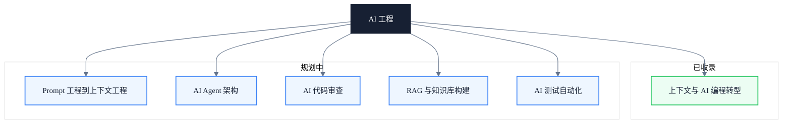

# AI 工程

> 副标题：从上下文工程到 AI 编程转型，构建可验证的 AI 工程能力而非 Prompt 技巧

## 模块定位

AI 时代的工程能力核心不再只是"能否写出代码"，而是"能否为 AI 提供正确的上下文、定义有边界的任务、并通过工具验证结果"。本模块不提供"写好 Prompt"这类表层技巧，而是拆解为上下文的六层模型、AI 编程转型的三层架构、以及可执行的质量门禁。

我们关注的不是单次对话的技巧，而是可重复、可团队协作、可工程化度量的能力建设。从个体如何设计任务包，到团队如何沉淀共享上下文资产，再到如何用自动化测试与审查闭环保障质量，本模块覆盖端到端的工程链路。

无论是刚接触 AI 编程的工程师，还是希望将团队 AI 能力系统化的技术负责人，都能在本模块找到对应的工程框架与实践抓手。

---

## 知识地图

---

## 核心主题

- ✓ **上下文工程**：语言 / 任务 / 业务 / 状态 / 组织 / 约束六层上下文模型，从"写 Prompt"到"构建信息环境"
- ✓ **AI 上下文概念**：上下文窗口、短期 / 长期上下文、检索上下文、工具上下文的工程化运用
- ✓ **AI 编程转型**：个人任务包设计、团队共享上下文资产、可验证的工程执行闭环
- ✓ **质量与风险**：上下文不足 / 过载 / 冲突 / 失效四类质量问题的识别与治理
- ◯ **Prompt 工程到上下文工程**：从单点提示词优化走向系统化上下文治理
- ◯ **AI Agent 架构**：多步规划、工具调用与状态管理
- ◯ **AI 代码审查**：自动化规则与人工协同的审查闭环
- ◯ **RAG 与知识库构建**：检索增强生成与私有知识沉淀
- ◯ **AI 测试自动化**：生成、执行与回归验证

---

## 学习路径

1. 通读已收录的「上下文」文章，建立六层上下文模型与 AI 编程转型的整体认知。
2. 对照自身工作流，识别当前上下文供给的薄弱层（语言 / 任务 / 业务 / 状态 / 组织 / 约束）。
3. 设计个人任务包，将"写 Prompt"升级为"构建信息环境"。
4. 在团队层面沉淀共享上下文资产，建立可复用的工程基线。
5. 引入自动化测试与代码审查作为质量门禁，形成可验证的执行闭环。
6. 按规划主题（Agent 架构、RAG、AI 测试等）横向扩展能力。

---

## 文章导览

- [AI 时代如何理解「上下文」及其在 AI 编程转型中的应用](/ai/understanding-context-in-ai-era) — 六层上下文模型、AI 中的核心上下文概念、三层转型路径与自动化测试应用

---

## 适用读者

- 使用 AI 辅助编程的工程师，希望提升 AI 生成代码的质量与可维护性
- 技术负责人，需要在团队层面建立 AI 编程的规范与质量门禁
- QA / 测试工程师，需要将 AI 生成的测试脚本纳入可验证的工程闭环

---

## 延伸资源

- [Anthropic Claude 文档](https://docs.anthropic.com/claude/docs)
- [OpenAI Cookbook](https://github.com/openai/openai-cookbook)
- [LangChain 文档](https://python.langchain.com/docs/)
- 书籍：《AI Engineering: Building AI Systems That Work in Production》
