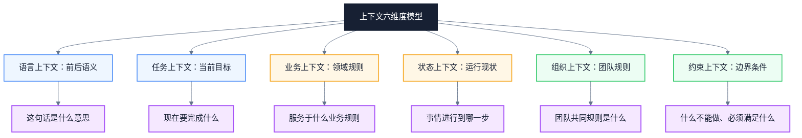
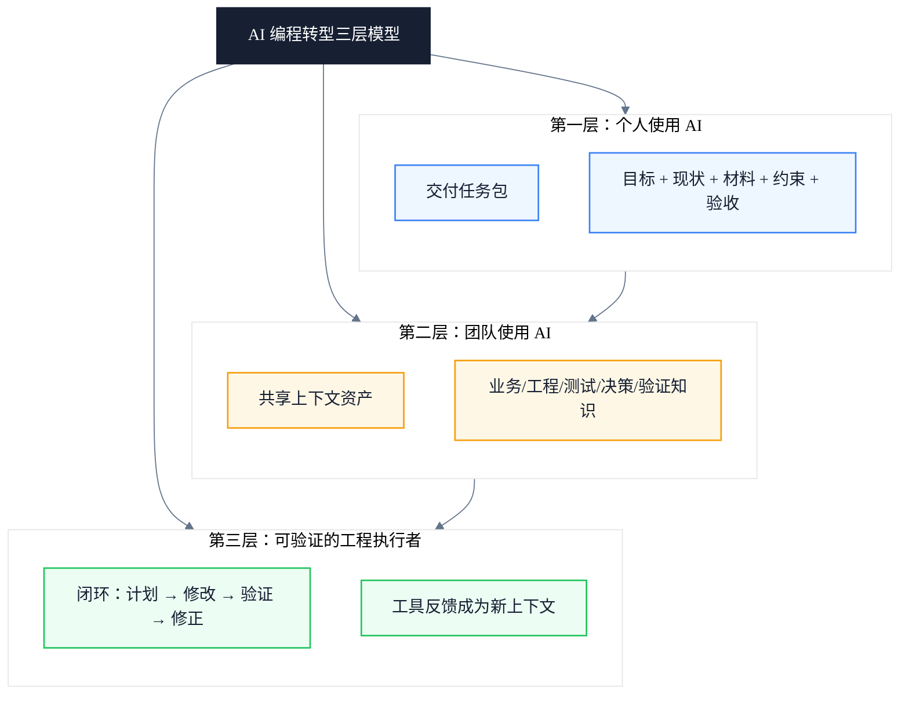
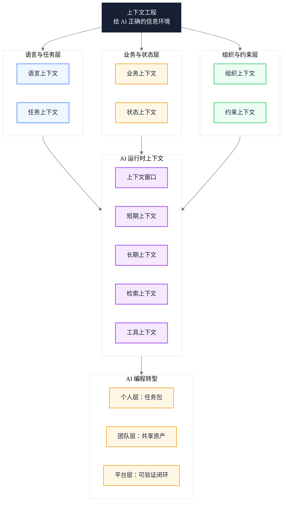

# AI 时代如何理解「上下文」及其在 AI 编程转型中的应用

> 副标题：从日常语言的上下文到 AI 编程的上下文工程
>
> 目标读者：中高级工程师、测试与 QA 负责人、AI 编程转型推进者
>
> 阅读时间：约 20 分钟

::: info 一句话
AI 编程质量越来越不只取决于"怎么写 Prompt"，而取决于"给 AI 提供了什么上下文"。
:::

## 目录

- [一、从日常语言理解上下文](#一、从日常语言理解上下文)
- [二、上下文的六个维度](#二、上下文的六个维度)
- [三、AI 时代的上下文变化](#三、ai-时代的上下文变化)
- [四、AI 中的核心上下文概念](#四、ai-中的核心上下文概念)
- [五、为什么上下文比代码生成更重要](#五、为什么上下文比代码生成更重要)
- [六、上下文的四类质量问题](#六、上下文的四类质量问题)
- [七、三层 AI 编程转型](#七、三层-ai-编程转型)
- [八、在自动化测试中的具体应用](#八、在自动化测试中的具体应用)
- [九、角色变化与能力迁移](#九、角色变化与能力迁移)
- [十、统一模型：六层上下文框架](#十、统一模型-六层上下文框架)
- [十一、AI 编程实践清单](#十一、ai-编程实践清单)
- [结语：从 Prompt 到上下文工程](#结语-从-prompt-到上下文工程)
- [FAQ](#faq)
- [来源](#来源)

---

## 一、从日常语言理解上下文

"上下文"听起来像一个技术词，但它其实是人类每天都在使用的基本能力。

先看一个最简单的例子。假设有人说：

> "帮我处理一下这个问题。"

这句话本身几乎没有有效信息。要理解它，至少需要知道：

- "我"是谁；
- "你"是谁；
- "这个问题"指什么；
- 问题发生在哪里；
- 之前已经做过什么；
- 期望得到什么结果；
- 什么时间之前完成；
- 有哪些限制条件。

如果双方刚刚讨论过一个登录失败的问题，那么"这个问题"可能就是登录失败。如果双方正在讨论测试报告，那么"这个问题"可能就是报告里的阻塞缺陷。

一句话的真实含义，通常不是只存在于字面中，而是由多个信息层共同决定：

```text
真实含义
= 当前表达
+ 前文信息
+ 当前环境
+ 双方共同认知
+ 隐含规则
```

这里的"前文信息、当前环境、共同认知和隐含规则"，就是上下文。

::: tip 本节核心结论

上下文不是附加信息，而是理解真实意图的必要前提。同一句话在不同上下文里含义可能完全不同，理解上下文是理解意图的基础。

:::

::: warning 常见误区

把上下文等同于"聊天记录"或"前面说过的话"。这只是上下文的一部分，完整的上下文还包括环境、共同认知、隐含规则等。

:::

---

## 二、上下文的六个维度

很多人把上下文简单理解为聊天记录，这是不完整的。广义的上下文至少包含六个维度，每个维度都决定了 AI 能否正确理解你的真实意图。

下图展示了这六个维度的整体关系：



### 1. 语言上下文

一句话前后说了什么。例如"它还是不行"——要理解"它"，必须知道前面讨论的是接口、脚本、服务器，还是测试环境。

### 2. 任务上下文

当前到底在完成什么任务。同样是"检查这段代码"：

- 在 Code Review 中，可能是检查可维护性；
- 在故障排查中，可能是寻找异常原因；
- 在安全审计中，可能是检查漏洞；
- 在测试开发中，可能是补充可测试性和边界条件。

不知道任务就"检查代码"，很容易检查错方向。

### 3. 业务上下文

代码不是孤立存在的，它服务于某种业务规则。例如：

```typescript
if (income > threshold) {
  calculateTax();
}
```

只看代码，AI 可以检查语法和一般逻辑，但它不知道：

- `income` 是月收入还是年收入；
- `threshold` 对应哪个课税年度；
- 是否区分个人和企业；
- 币种和精度如何处理；
- 临界值是"大于"还是"大于等于"；
- 是否存在豁免条件。

这些都属于业务上下文。在税务、金融、政务等规则密集型系统中，**业务上下文往往比代码上下文更重要**。

### 4. 状态上下文

描述"事情目前进行到了哪里"。例如当前使用哪个分支、运行在哪个环境、用户是否已登录、数据库中存在什么测试数据、前一个接口返回了什么、某个任务已经尝试过多少次。

自动化测试特别依赖状态上下文。假设测试步骤是"点击提交按钮"，只有这个动作是不够的，还需要知道完整的前置状态：

```text
用户已经登录
→ 已进入申报页面
→ 已填写必填字段
→ 已上传附件
→ 当前记录处于草稿状态
→ "提交"按钮可见且启用
```

这些前置状态，决定了"点击提交"是否有意义。

### 5. 组织上下文

团队内部形成的共同规则：代码规范、目录结构、命名约定、分支策略、缺陷等级、测试优先级、Definition of Done、哪些框架允许使用、哪些数据不能进入 AI、谁负责审批和发布。

一名新员工不知道这些规则，就容易写出"技术上正确、团队里不可用"的代码。AI 也一样。

### 6. 约束上下文

告诉执行者什么不能做，以及结果必须满足什么条件。例如必须使用 Playwright、不能修改生产代码、不能访问真实客户数据、脚本必须兼容 Linux CI Agent、单个测试用例不得超过五分钟、失败后必须保留截图和网络日志、不得通过固定等待解决稳定性问题。

约束不是附加信息，而是任务定义的一部分。

::: tip 本节核心结论

完整的上下文是六个维度的组合：语言、任务、业务、状态、组织、约束。缺少任何一个维度，AI 都可能在某个方向上做出错误判断。

:::

---

## 三、AI 时代的上下文变化

传统软件按照明确的输入和规则运行：

```text
输入 + 固定程序 = 输出
```

生成式 AI 完全不同：

```text
当前指令
+ 对话历史
+ 提供的文档
+ 代码和工具结果
+ 系统规则
+ 模型已有能力
= 模型对当前任务的理解
= 输出结果
```

因此，AI 的输出不单由最后一句 Prompt 决定，而是由它在当前时刻能够获得的整个信息环境决定。

可以把 AI 想象成一位能力很强、学习速度很快，但刚刚加入项目的工程师：

- 它懂通用编程；
- 它知道常见框架；
- 它可以快速阅读代码；
- 但它天然不知道你们公司的业务；
- 不知道内部缩写；
- 不知道历史设计决策；
- 不知道哪些接口已经废弃；
- 不知道你们真正关心的验收标准。

你不给它上下文，它就会根据一般经验补全空白。而 AI 补全空白的过程，正是很多错误和"幻觉"的来源。

::: tip 本节核心结论

AI 的问题经常不是"不会做"，而是"不知道你真正要它做什么"。AI 的输出质量由它当前能获得的整个信息环境决定，而不是由最后一句指令决定。

:::

::: info 工程启示

理解 AI 的这一特性后，工程团队的工作重心应从"优化单条 Prompt"转向"优化 AI 能获得的信息环境"。这正是从 Prompt Engineering 走向 Context Engineering 的关键转变。

:::

---

## 四、AI 中的核心上下文概念

进入 AI 领域后，"上下文"这个词被赋予了更具体的含义。理解以下几个核心概念，是掌握 AI 编程的基础。

### 1. 上下文窗口

上下文窗口可以理解为 AI 一次能够"放在工作台上阅读"的信息容量。工作台上可能包括：系统指令、当前对话、代码文件、需求文档、API 定义、日志、测试结果、工具调用结果、AI 自己之前生成的内容。

上下文窗口越大，AI 一次可以阅读的材料越多。但"大"不等于"好"。如果工作台上堆满了过期文档、重复代码、无关日志、相互冲突的需求、大量没有优先级的信息，AI 反而更难抓住重点。

真正需要追求的不是"给 AI 最多的信息"，而是：

> 给 AI 完成当前任务所需的最相关、最准确、最有结构的信息。

### 2. 上下文工程

Prompt Engineering 通常关注"这句话应该怎么问"。Context Engineering（上下文工程）更关注"为了让 AI 正确完成任务，应该让它看到哪些信息"。

二者的差异可以这样理解：

```text
// 反例：低上下文指令
帮我生成登录测试。
```

```text
// 正例：经过上下文工程后的任务包
目标：
为香港税务申报系统的个人用户登录功能生成自动化测试。

技术栈：
- Playwright
- TypeScript
- Page Object Model
- 测试运行在 Linux CI 环境

相关材料：
- requirements/login.md
- openapi/auth.yaml
- pages/LoginPage.ts
- fixtures/users.ts
- tests/login/existing-login.spec.ts

业务规则：
- 连续5次输入错误密码后锁定账户
- 锁定时间为30分钟
- MFA只对特定角色启用
- 测试环境禁止使用真实纳税人资料

实现约束：
- 不使用 waitForTimeout
- 定位器优先采用 getByRole
- 每个测试独立创建和清理数据
- 失败时保存截图、trace和接口响应

验收标准：
- 覆盖正常登录、错误密码、账户锁定和MFA
- 通过 npm run typecheck
- 通过 npm run lint
- 生成代码后执行登录模块的 smoke test
```

最后这个例子不只是"写得更详细"，而是构建了一个可执行的信息环境。

### 3. 短期上下文

短期上下文是当前会话或当前任务中的信息，例如正在修改哪个文件、刚才运行了什么命令、出现了什么报错、已经尝试了哪些方案、用户刚刚否定了什么做法。它相当于人的工作记忆。

AI 编程中，短期上下文使 AI 能够连续完成：

```text
阅读代码
→ 修改代码
→ 运行测试
→ 读取错误
→ 修复错误
→ 再次验证
```

如果中间上下文丢失，就可能出现重复已经失败的方案、忘记前面确认的约束、改回已经修复的代码、只处理最后一个错误而忽略整体目标。

### 4. 长期上下文

长期上下文是跨任务保持有效的信息，例如项目架构说明、团队编码规范、业务术语表、测试策略、历史技术决策、系统边界、安全与合规规范。它相当于团队的组织记忆。

长期上下文不应该只存在于某位资深员工的脑中。为了支持 AI 编程，团队需要把它转化为可读取的资产：

```text
/docs
  business-glossary.md
  architecture.md
  testing-strategy.md
  coding-guidelines.md
  security-rules.md
  domain-rules.md

/decisions
  ADR-001-test-framework.md
  ADR-002-api-mocking.md
  ADR-003-test-data-isolation.md
```

这也是 AI 转型的一个重要变化：过去文档主要写给人看，未来文档还要能够被 AI 准确检索和使用。

### 5. 检索上下文

大型项目不可能把所有内容一次性塞给 AI，因此需要先找到与当前任务最相关的信息，再提供给模型。

例如任务是"修复提交报税表时金额精度错误"，系统可以检索：金额计算规则、当前课税年度配置、相关接口定义、Decimal 工具类、对应测试用例、过去类似缺陷、最近的代码变更。

这个过程通常被称为检索增强（RAG）。核心思想不是让 AI 永远记住全部信息，而是：

> 在需要的时候，把正确的信息送到 AI 面前。

### 6. 工具上下文

AI 仅阅读代码是不够的，它还需要从工具获得真实反馈：Git 当前差异、编译错误、单元测试结果、Playwright trace、浏览器 console、网络请求、API 响应、数据库查询结果、CI 日志、静态分析结果。

例如 AI 认为某段测试已经修复，但真正运行后仍失败：

```text
Expected: "Submitted"
Received: "Pending Review"
```

这个测试结果会成为新的上下文，促使 AI 修正原来的判断。

因此，可靠的 AI 编程不是"用户提问 → AI 生成代码 → 结束"，而是：

```text
理解任务
→ 获取相关上下文
→ 制定计划
→ 修改代码
→ 调用真实工具验证
→ 把结果加入上下文
→ 根据反馈继续修正
```

::: tip 本节核心结论

上下文工程是从"写好一句话"到"构建可执行信息环境"的转变。上下文窗口决定容量上限，短期/长期/检索/工具上下文共同决定了 AI 能否在正确时刻获得正确信息。

:::

---

## 五、为什么上下文比代码生成更重要

过去评价一名程序员，往往关注是否熟悉语法、是否了解框架、是否能快速写代码。AI 已经大幅降低了代码生成成本，但没有自动解决以下问题：

- 应该解决什么问题；
- 需求是否完整；
- 哪些业务规则适用；
- 应该修改哪个模块；
- 哪些现有设计不能破坏；
- 如何证明修改是正确的；
- 失败时如何定位原因。

因此，AI 编程转型的核心能力逐渐从"亲手写出所有代码"，转向：

1. 定义问题；
2. 组织上下文；
3. 分解任务；
4. 设置约束；
5. 让 AI 调用工具；
6. 验证结果；
7. 管理知识和反馈。

可以用一个公式来表达这种关系：

```text
AI编程结果质量
≈ 模型能力
× 上下文质量
× 任务定义质量
× 工具验证能力
```

这里是乘法关系。如果任务定义或上下文质量接近零，即使模型很强，最终结果也会很不稳定。

::: tip 本节核心结论

AI 编程质量是乘法关系，上下文质量趋零则整体趋零。模型决定能力上限，而上下文工程决定这种能力能否在真实项目中稳定落地。

:::

::: warning 常见误区

认为"只要模型够强，就不需要精心组织上下文"。实际上，再强的模型在缺乏业务规则、约束条件和验收标准时，也只能基于一般经验猜测，而猜测正是"幻觉"和返工的主要来源。

:::

---

## 六、上下文的四类质量问题

上下文不是越多越好。实际工程中，上下文质量问题主要分为四类，每一类都会直接影响 AI 输出的稳定性。

### 1. 上下文不足

表现为：只说"帮我修复"、没有提供错误日志、没有说明期望结果、不提供相关代码、不说明技术限制。结果是 AI 被迫猜测。

解决办法：

> 补充目标、现状、材料、限制和验收标准。

### 2. 上下文过载

表现为：把整个代码库一次性提交给 AI、提供几万行无关日志、同时让 AI 处理多个互不相关的问题、复制大量历史对话但不指出当前结论。

解决办法：

> 围绕当前任务筛选信息，而不是机械堆积信息。

### 3. 上下文冲突

例如：需求文档说锁定 30 分钟，测试用例写锁定 60 分钟，实际配置是 15 分钟，旧代码注释又写永久锁定。

此时 AI 不应该自行选择一个"看起来合理"的答案。团队需要定义信息优先级：

```text
已经批准的最新业务需求
> 当前版本验收标准
> API契约
> 测试用例
> 代码注释
> 历史文档
```

如果高优先级资料之间仍有冲突，则必须升级为需求澄清，而不是让 AI 猜。

### 4. 上下文失效

常见情况包括：文档没有跟随代码更新、API 示例已经过期、测试数据不再有效、AI 读取了旧版本分支、历史缺陷的解决方案不再适用。

因此，上下文除了"相关"，还必须具备：版本、更新时间、适用范围、来源、权威级别、当前是否仍有效。

::: tip 本节核心结论

上下文质量 = 相关 × 准确 × 一致 × 有效。四类问题中任何一类失控，都会让 AI 输出从"可靠"退化为"看起来合理但实际错误"。

:::

---

## 七、三层 AI 编程转型

理解了上下文的概念和质量问题后，关键在于如何把认知转化为可落地的转型路径。AI 编程转型通常分为三层，逐层递进：



### 第一层：个人使用 AI

个人首先要从"问问题"转向"交付任务包"。每次向 AI 发起编程任务时，至少提供：

```text
1. 目标：要解决什么问题
2. 现状：现在发生了什么
3. 材料：相关代码、日志、接口和需求
4. 约束：不能怎么做、必须使用什么
5. 输出：希望得到代码、方案还是分析
6. 验收：怎样判断任务完成
```

可以复用下面这个任务包模板：

```text
任务目标：
[描述预期结果]

当前现象：
[描述实际结果、错误信息和复现方式]

项目背景：
[业务模块、技术栈和运行环境]

相关材料：
[文件、接口、日志、测试用例]

必须遵守：
[框架、规范、安全和兼容性要求]

禁止事项：
[不能修改的模块、不能使用的方式]

验收标准：
[编译、测试、性能和业务结果]

执行要求：
先分析原因和影响范围，再修改代码；修改后运行相关检查，
不要只根据代码推断成功。
```

### 第二层：团队使用 AI

团队需要建立共享上下文，而不是让每个人重复向 AI 解释项目。建议建设五类资产：

**业务知识**：业务术语表、核心业务流程、角色与权限、状态转换规则、边界和异常规则。

**工程知识**：项目架构、模块职责、编码规范、依赖使用原则、常用命令。

**测试知识**：测试分层策略、UI/API/性能测试的适用范围、Page Object 设计规则、标签和优先级规范、测试数据管理、失败证据采集标准。

**决策知识**：为什么选择 Playwright、为什么禁止固定等待、为什么接口测试和 UI 测试要分层、哪些模块不能直接 Mock、历史方案为什么被废弃。

**验证知识**：完成任务后必须运行哪些命令、什么情况下需要全量回归、哪些失败可以重试、什么条件才能合并、哪些结果必须人工审核。

### 第三层：让 AI 成为可验证的工程执行者

成熟的 AI 编程平台应让 AI 具备一个闭环：

```text
获取任务
→ 检索项目上下文
→ 阅读相关代码
→ 输出实施计划
→ 修改最小范围
→ 执行类型检查
→ 执行静态检查
→ 执行相关自动化测试
→ 分析失败证据
→ 修正
→ 输出变更摘要和风险
```

其中每一步产生的结果，都会成为下一步的新上下文。

这就是 AI Agent 与普通聊天机器人的关键区别之一：

> 聊天机器人主要根据已有文字回答；编程 Agent 会通过代码库和工具主动获取新的上下文。

::: tip 本节核心结论

三层转型逐层递进：个人层交付任务包，团队层建设共享上下文资产，平台层构建可验证的工程闭环。底层是个人习惯，顶层是系统能力，缺一不可。

:::

---

## 八、在自动化测试中的具体应用

在根据已有业务测试用例生成 UI、接口和压力测试脚本这个场景中，最大挑战通常不是"AI 会不会写 Playwright"，而是测试用例里是否包含足够的可执行上下文。

一条传统人工测试用例可能写成：

```text
用户登录系统，填写申报表并提交，检查提交成功。
```

人类测试人员可能了解大量隐含信息，但 AI 不知道：

- 使用哪类用户；
- 登录入口在哪里；
- 测试数据怎么创建；
- 申报表对应哪个课税年度；
- 必填字段有哪些；
- "提交成功"的判断依据是什么；
- 提交后是 `Submitted` 还是 `Pending Review`；
- 是否要验证数据库和接口；
- 如何清理数据；
- 是否允许重复提交。

要让它可以被 AI 稳定转化为自动化脚本，测试用例应升级为结构化上下文：

```yaml
case_id: TAX-FILING-001
objective: 验证个人用户可以提交有效申报表

preconditions:
  - 用户已完成身份验证
  - 用户存在当前课税年度的草稿申报表
  - 测试账户未开启MFA

test_data:
  user_role: individual_taxpayer
  assessment_year: 2025
  currency: HKD
  income: 500000

steps:
  - action: 登录系统
  - action: 打开草稿申报表
  - action: 填写收入信息
  - action: 提交申报表

expected_results:
  - 页面显示提交成功
  - 申报表状态变为Submitted
  - 提交接口返回成功业务码
  - 系统生成submission reference

automation_constraints:
  framework: Playwright
  language: TypeScript
  locator_strategy: role-first
  fixed_wait: forbidden
  cleanup_required: true
```

这实际上不是简单地"把测试用例写得更详细"，而是在建设一套机器可消费的测试上下文。

::: tip 本节核心结论

测试用例需要从"人类可读"升级为"机器可消费的上下文"。只有把前置条件、测试数据、预期结果和自动化约束都结构化，AI 才能稳定生成可运行的测试脚本。

:::

::: warning 常见误区

认为"AI 会写 Playwright 就够了"。实际上，AI 写出的脚本能否在真实环境中稳定运行，取决于测试用例是否提供了完整的业务规则、状态前置和验证标准，而不是 AI 对框架语法的熟悉程度。

:::

---

## 九、角色变化与能力迁移

AI 不会让工程人员只剩下"写 Prompt"这项工作。相反，它会提高对工程判断力的要求。未来更重要的能力正在发生迁移：

| 传统能力重心 | AI 时代能力重心 |
|---|---|
| 记忆语法 | 准确定义问题 |
| 手工编写大量代码 | 设计任务与上下文 |
| 根据经验查错 | 利用工具建立证据链 |
| 个人掌握项目知识 | 把知识沉淀成团队资产 |
| 审查代码写法 | 审查业务正确性和影响范围 |
| 执行测试步骤 | 设计质量门禁和反馈闭环 |

对于 QA 和自动化测试工程师，角色也会从"脚本编写者"进一步转向：

- 测试上下文设计者；
- 业务规则结构化人员；
- AI 生成结果的验证者；
- 自动化质量门禁建设者；
- 测试知识库维护者；
- Agent 工作流设计者。

::: tip 本节核心结论

AI 提高了对工程判断力的要求，而非降低。核心能力从"亲手实现"转向"定义问题、组织上下文、设计验证闭环"，这对工程师的系统思维提出了更高要求。

:::

---

## 十、统一模型：六层上下文框架

下图将全文散落的上下文概念汇总为统一模型。核心节点是上下文工程，它连接六个维度的上下文，并最终服务于 AI 编程转型的三层路径：



### 1. 六维度模型

语言、任务、业务、状态、组织、约束六个维度共同构成了理解任何任务所需的完整上下文。前两个维度回答"在说什么"和"要做什么"，中间两个维度回答"在什么环境中做"，最后两个维度回答"按什么规则做"和"不能做什么"。

### 2. AI 运行时上下文

上下文窗口是容量上限，短期上下文维持任务连续性，长期上下文承载团队记忆，检索上下文按需获取相关信息，工具上下文提供真实反馈。这五者共同决定了 AI 在某一时刻能获得的信息环境。

### 3. 三层转型路径

个人层交付结构化任务包，团队层建设可复用的上下文资产，平台层构建"修改 → 验证 → 反馈"的工程闭环。三层逐层递进，最终让 AI 成为可验证的工程执行者。

::: tip 本节核心结论

六维度模型 + AI 运行时上下文 + 三层转型路径，共同构成 AI 编程的统一上下文框架。模型决定能力上限，而上下文工程决定这种能力能否在真实项目中稳定落地。

:::

---

## 十一、AI 编程实践清单

### 1. 个人任务包设计

- [ ] 每次向 AI 发起编程任务时，提供目标、现状、材料、约束、输出、验收六要素
- [ ] 区分"问问题"和"交付任务包"，后者必须包含验收标准
- [ ] 任务包中明确禁止事项（不能修改的模块、不能使用的方式）
- [ ] 要求 AI 先分析原因和影响范围，再修改代码
- [ ] 修改后要求运行相关检查，不要只根据代码推断成功

### 2. 团队上下文资产建设

- [ ] 维护业务术语表（business-glossary.md）
- [ ] 维护项目架构说明（architecture.md）
- [ ] 维护测试策略文档（testing-strategy.md）
- [ ] 维护编码规范（coding-guidelines.md）
- [ ] 使用 ADR 记录历史技术决策（/decisions 目录）
- [ ] 维护安全与合规规则（security-rules.md）

### 3. 测试用例结构化

- [ ] 测试用例包含 case_id、objective、preconditions、test_data、steps、expected_results
- [ ] 明确 automation_constraints（框架、语言、定位器策略、等待策略、清理策略）
- [ ] expected_results 覆盖页面、接口、数据库三个层面的验证
- [ ] preconditions 描述完整的前置状态，而非隐含假设

### 4. 上下文质量管理

- [ ] 提交前检查上下文是否充足（目标、材料、约束是否齐全）
- [ ] 避免一次性提交整个代码库或几万行无关日志
- [ ] 定义信息优先级（业务需求 > 验收标准 > API 契约 > 测试用例 > 代码注释 > 历史文档）
- [ ] 高优先级资料冲突时升级为需求澄清，而非让 AI 猜
- [ ] 文档标注版本、更新时间、适用范围和当前是否有效

### 5. 工具反馈闭环

- [ ] AI 修改代码后必须运行类型检查和静态检查
- [ ] 失败时保留截图、trace 和接口响应作为证据
- [ ] 把工具运行结果加入下一轮上下文，形成反馈闭环
- [ ] 不允许只根据代码推断成功，必须用真实运行结果验证
- [ ] 区分"聊天机器人"和"编程 Agent"，后者必须能调用真实工具

### 6. 知识沉淀与版本管理

- [ ] 文档既要给人看，也要能被 AI 准确检索和使用
- [ ] 长期上下文不依赖于个人记忆，必须转化为可读取的资产
- [ ] API 示例、测试数据、代码注释跟随代码同步更新
- [ ] AI 读取的分支与当前工作分支保持一致
- [ ] 历史缺陷解决方案标注适用范围和失效条件

### 7. 能力迁移与角色升级

- [ ] 从"记忆语法"转向"准确定义问题"
- [ ] 从"手工编写大量代码"转向"设计任务与上下文"
- [ ] 从"根据经验查错"转向"利用工具建立证据链"
- [ ] 从"个人掌握项目知识"转向"把知识沉淀成团队资产"
- [ ] 从"审查代码写法"转向"审查业务正确性和影响范围"
- [ ] 从"执行测试步骤"转向"设计质量门禁和反馈闭环"

---

## 结语：从 Prompt 到上下文工程

可以把上下文理解成四层：

```text
第一层：这句话是什么意思？
        ——语言上下文

第二层：现在要完成什么任务？
        ——任务上下文

第三层：这个任务处于什么业务和工程环境？
        ——业务、状态和组织上下文

第四层：如何证明结果真的正确？
        ——工具、测试和验收上下文
```

而在 AI 编程中，最重要的认知转变是：

> **Prompt 是命令，上下文是工作环境，工具结果是事实，验收标准是终点。**

只有 Prompt，没有上下文，AI 只能猜。只有上下文，没有明确任务，AI 不知道从哪里开始。有任务和上下文，但没有工具验证，AI 只能认为自己做对了。

真正可靠的 AI 编程应该具备：

```text
清晰任务
+ 高质量上下文
+ 明确约束
+ 真实工具反馈
+ 可检查的验收标准
= 可落地的AI工程能力
```

企业进行 AI 编程转型时，第一步未必是选择最强的模型，而是检查团队能否回答三个问题：我们的业务与工程知识是否已经结构化？AI 能否在正确时间获得正确的项目上下文？AI 生成结果是否能通过编译、测试和业务规则自动验证？

模型决定能力上限，而上下文工程决定这种能力能否在真实项目中稳定落地。

> **AI 编程质量越来越不只取决于"怎么写 Prompt"，而取决于"给 AI 提供了什么上下文"。**

---

## FAQ

### 1. 上下文工程和 Prompt 工程的区别是什么？

Prompt Engineering 关注"这句话应该怎么问"，重点是优化单条指令的表达方式。Context Engineering（上下文工程）关注"为了让 AI 正确完成任务，应该让它看到哪些信息"，重点是构建可执行的信息环境，包括相关材料、业务规则、约束条件和验收标准。前者是写好一句话，后者是构建一个任务包。

### 2. 上下文窗口越大越好吗？

不是。上下文窗口大意味着 AI 一次能阅读更多材料，但如果工作台上堆满过期文档、重复代码、无关日志和相互冲突的需求，AI 反而更难抓住重点。真正需要追求的是给 AI 完成当前任务所需的最相关、最准确、最有结构的信息，而非最多的信息。

### 3. 如何判断上下文是否充足？

一个简单的检查清单：是否提供了目标、现状、材料、约束和验收标准？如果 AI 的输出需要多次返工，或出现"看起来合理但实际错误"的结果，通常不是模型能力问题，而是上下文不足。补充业务规则、前置状态和验证标准往往比换更强的模型更有效。

### 4. 团队从哪里开始 AI 编程转型？

建议从三件事开始：第一，把个人任务包模板固化下来，要求每次向 AI 交付任务时都包含六要素；第二，把团队隐性知识（业务术语、架构说明、测试策略、历史决策）转化为可读取的文档资产；第三，建立"修改 → 验证 → 反馈"的工具闭环，让 AI 的输出必须经过真实运行验证。

### 5. 上下文冲突时应该如何处理？

不要让 AI 自行选择一个"看起来合理"的答案。团队应定义信息优先级，例如"已批准的最新业务需求 > 当前版本验收标准 > API 契约 > 测试用例 > 代码注释 > 历史文档"。如果高优先级资料之间仍有冲突，必须升级为需求澄清，由人工确认后再提供给 AI，而不是让 AI 在冲突信息中猜测。

---

## 来源

1. Addy Osmani《Modern Web Performance》：
   
   [https://addyosmani.com/](https://addyosmani.com/)

2. Andrej Karpathy 谈 LLM 上下文与 Agent 设计：
   
   [https://karpathy.ai/](https://karpathy.ai/)

3. Anthropic 文档《Context Engineering for Agents》：
   
   [https://docs.anthropic.com/](https://docs.anthropic.com/)

4. Playwright 官方文档《Best Practices》：
   
   [https://playwright.dev/docs/best-practices](https://playwright.dev/docs/best-practices)

5. Microsoft《The New Future of Work: AI and Context》：
   
   [https://www.microsoft.com/en-us/research/](https://www.microsoft.com/en-us/research/)
