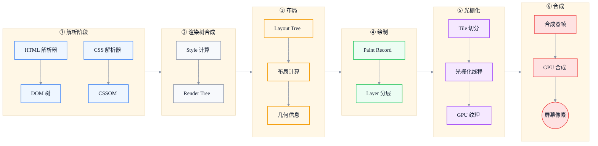
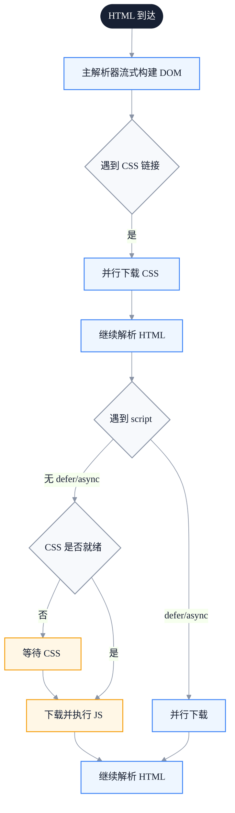
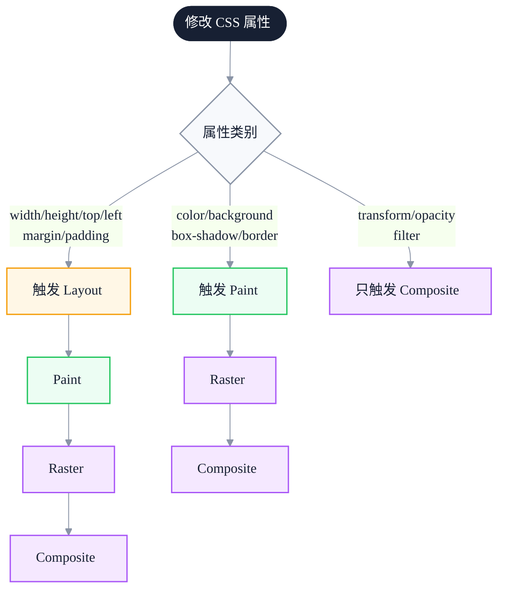

# 渲染流水线：从 HTML 到像素

> 副标题：从 HTML 流式解析、CSSOM 构建、渲染树合成、布局计算、绘制分层到 GPU 合成的完整链路
>
> 目标读者：中高级前端工程师、前端架构师、性能优化负责人
>
> 阅读时间：约 28 分钟

::: info 一句话
渲染流水线不是一条直线，而是一张带依赖关系的状态机；理解每个阶段何时被触发、何时被跳过，才能精准定位性能瓶颈。
:::

## 目录

- [写在前面](#写在前面)
- [一、渲染流水线全景图](#一、渲染流水线全景图)
- [二、HTML 流式解析与 DOM 构建](#二、html-流式解析与-dom-构建)
- [三、CSSOM 构建与 CSS 阻塞机制](#三、cssom-构建与-css-阻塞机制)
- [四、渲染树（Render Tree）合成](#四、渲染树-render-tree-合成)
- [五、布局（Layout / Reflow）计算](#五、布局-layout-reflow-计算)
- [六、绘制（Paint）与图层分层](#六、绘制-paint-与图层分层)
- [七、合成（Composite）与 GPU 加速](#七、合成-composite-与-gpu-加速)
- [八、每个阶段的性能瓶颈](#八、每个阶段的性能瓶颈)
- [九、不同 CSS 属性触发不同路径](#九、不同-css-属性触发不同路径)
- [十、实战：用 Performance 面板定位瓶颈](#十、实战-用-performance-面板定位瓶颈)
- [结语：把流水线当作状态机来管理](#结语-把流水线当作状态机来管理)
- [FAQ](#faq)
- [来源](#来源)

## 写在前面

很多前端工程师对"浏览器渲染"的理解停留在"DOM + CSS = 页面"，再深一点知道有 Layout、Paint、Composite，但再追问下去就模糊了：

- HTML 解析是流式还是一次性？预加载扫描器到底干了什么？
- CSSOM 是一棵树还是一张表？为什么 CSS 会阻塞首次渲染却不阻塞 HTML 解析？
- `display:none` 和 `visibility:hidden` 在渲染树里有什么区别？
- Layout 真的那么贵吗？为什么改一个 width 会让整页 reflow？
- Paint 和 Composite 之间到底隔了什么？为什么 `transform` 不触发 Layout？
- GPU 合成到底是怎么把多个图层拼到屏幕上的？

本文的目标不是把渲染流水线讲成一系列名词解释，而是建立一个**可推理的模型**：当你修改了一段 DOM 或一个 CSS 属性后，能准确预测浏览器会走流水线上的哪几段、各自付出什么代价、如何被 Performance 面板观察到。

::: tip 本节核心结论

渲染流水线的核心不是"记住五个阶段的名字"，而是理解**触发条件**与**数据流转**。每一段都有输入、输出和触发条件，优化就是减少不必要的触发、缩小每次触发的范围。
:::

---

## 一、渲染流水线全景图

现代浏览器的渲染流水线（以 Chromium 为参考）可以简化为以下六个阶段：



每个阶段的输入和输出大致如下：

| 阶段 | 主要输入 | 主要输出 | 运行线程 |
| --- | --- | --- | --- |
| HTML 解析 | HTML 字节流 | DOM 树 | 主线程 |
| CSS 解析 | CSS 字节流 | CSSOM | 主线程 |
| Style 计算 | DOM + CSSOM | 每个 DOM 节点的最终样式 | 主线程 |
| Layout | Render/Style 树 + 几何约束 | 每个节点的位置和大小 | 主线程 |
| Paint | Layout 树 + 样式 | Paint Record（绘制指令列表）+ Layer 列表 | 主线程 |
| Raster | Layer + Tile | 像素位图（GPU 纹理） | 合成线程 + 光栅化工作线程 |
| Composite | 多个 Layer 的纹理 | 合成帧 | GPU 进程 |

::: info 关键认知

注意"主线程 / 合成线程 / 光栅化工作线程 / GPU 进程"的分工。**Layout 和 Paint 在主线程**，所以它们会阻塞 JS、阻塞交互；**Raster 和 Composite 可以在主线程之外完成**，所以 `transform/opacity` 动画即使主线程被 JS 占满也能流畅。这是后面所有优化策略的根因。
:::

---

## 二、HTML 流式解析与 DOM 构建

### 1. 增量式解析

HTML 解析器不是等 HTML 全部下载完才开始工作的，而是**字节流到达即解析**。Chromium 把网络层收到的字节流交给 HTML 解析器，解析器一边消费字节、一边构建 DOM 节点。

这意味着：

- HTML 越早开始流式返回，DOM 越早开始构建
- 服务端可以分段返回 HTML（流式 SSR），让浏览器提前开始解析和发现子资源
- 大块 HTML 仍然会形成"Parse HTML"长任务

### 2. 预加载扫描器（Preload Scanner）

主解析器遇到 `<script src="...">`（无 defer/async）会被阻塞，但浏览器不会傻等。**预加载扫描器**会在主解析器阻塞期间，继续向前扫描原始 HTML 标记，提前发现图片、CSS、JS 等资源并并行下载。

```html
<!-- 预加载扫描器能发现 -->
<link rel="stylesheet" href="/a.css">
<script src="/b.js"></script>


<!-- 预加载扫描器发现不了：要等 JS 执行后才知道 -->
<div id="root"></div>
<script>
  // 这里的图片必须等 JS 执行后才会被发现
  document.getElementById('root').innerHTML = ''
</script>
```

### 3. 阻塞点

HTML 解析阶段的主要阻塞点有两个：

- **同步 script**：阻塞 HTML 解析，等脚本下载并执行完成
- **CSS 阻塞 JS 执行**：如果脚本要操作 DOM 的样式，CSS 必须先加载完成。所以 CSS 不阻塞 HTML 解析，但可能阻塞 JS 执行



::: tip 本节核心结论

HTML 解析是流式的，越早返回越好。同步 script 和 CSS 是主要阻塞点。让首屏关键资源出现在 HTML 中、对非关键 JS 使用 `defer`，是降低解析阶段成本的核心手段。
:::

::: warning 常见误区

把 SSR 当成性能银弹。SSR 让 HTML 更早返回，但如果 SSR 输出的 HTML 体积过大、或者把所有数据都塞进 HTML，反而会拖慢 Parse HTML 阶段。流式 SSR + 关键内容前置才是正确姿势。
:::

---

## 三、CSSOM 构建与 CSS 阻塞机制

### 1. CSSOM 是什么

CSS 解析器把 CSS 文本解析成 **CSSOM（CSS Object Model）**。CSSOM 的结构与 DOM 类似，也是树形：选择器按嵌套关系组织，最终每个规则带一组样式声明。

CSSOM 之所以是树形，是因为 CSS 有继承和层叠：

- **继承**：`font-size`、`color` 等属性会从父节点继承
- **层叠**：多个规则作用于同一节点时，需要按优先级、特殊性、来源决定最终值

### 2. CSS 阻塞首次渲染

CSS 不阻塞 HTML 解析（解析器可以继续构建 DOM），但**阻塞首次渲染**。原因是浏览器要避免"先渲染无样式版本，再重绘成有样式版本"的闪烁（FOUC，Flash of Unstyled Content）。

::: info 关键认知

"CSS 阻塞渲染"不等于"CSS 阻塞解析"。这就是为什么我们说 CSS 是渲染阻塞资源，但不是解析阻塞资源。
:::

### 3. CSS 阻塞 JS 执行

如果脚本要查询元素样式（如 `getComputedStyle`），CSS 必须先加载完成。所以 CSS 也会间接阻塞后续 JS 执行。

### 4. 媒体查询与不阻塞

`<link rel="stylesheet" media="print">` 不会阻塞首次渲染，因为浏览器知道它不适用于当前媒体。可以利用这个机制把非首屏 CSS 标记为不同 media，再在加载后切换：

```html
<!-- 非首屏 CSS：不阻塞首次渲染 -->
<link rel="stylesheet" href="/non-critical.css"
      media="print" onload="this.media='all'">
```

### 5. Style 计算阶段

DOM 和 CSSOM 都准备好后，浏览器进入 **Style 计算**阶段：

1. 对每个 DOM 节点，从 CSSOM 中找出所有匹配的规则
2. 按优先级、特殊性、来源排序
3. 计算最终样式（Computed Style）

Style 计算的成本取决于：

- DOM 节点数量
- CSS 规则数量
- 选择器复杂度（后代选择器、通配符选择器更贵）

::: tip 本节核心结论

CSS 阻塞首次渲染但不阻塞 HTML 解析。关键 CSS 必须尽早加载，非关键 CSS 可以用 media hack 异步化。选择器越简单越好，避免大规模后代选择器。
:::

---

## 四、渲染树（Render Tree）合成

### 1. 渲染树 ≠ DOM 树

**渲染树（Render Tree）** 是 DOM 和样式信息的合并产物，但**只包含需要绘制的节点**：

- `display: none` 的元素**不在渲染树**里（不参与布局、不参与绘制）
- `visibility: hidden` 的元素**仍在渲染树**里（占位但不显示）
- `<head>`、`<script>` 等不可见元素不在渲染树里
- `::before`、`::after` 等伪元素会在渲染树里生成对应节点

### 2. Layout Tree 与 Render Tree

在 Chromium 的现代架构里，"渲染树"的概念被进一步细分为：

- **Layout Tree**：参与布局的节点，每个节点对应一个 LayoutObject
- **Paint Layer**：参与绘制的图层单元
- **Graphics Layer**：合成器能独立处理的合成层

Layout Tree 的构建规则大致是：

```
对 DOM 树中每个节点：
  如果它生成盒子（有 box，比如 display 不是 none）
    则为它创建 LayoutObject
  否则跳过
```

### 3. 关键启示

理解了渲染树与 DOM 的区别，就能解释很多现象：

- 为什么 `display: none` 切换比 `visibility: hidden` 切换更贵：前者要重新构建渲染树并触发完整 Layout，后者只触发 Paint
- 为什么大量 `display: none` 节点会拖慢初始渲染：它们虽然不绘制，但 DOM 解析、Style 计算阶段仍要处理
- 为什么虚拟列表能优化长列表：从源头减少 Layout Tree 的节点数

::: tip 本节核心结论

渲染树 ≠ DOM 树。`display: none` 的元素不在渲染树，避免初始 Layout 成本；但它们仍在 DOM 里，仍要参与解析和 Style 计算。控制 DOM 规模才是根本。
:::

---

## 五、布局（Layout / Reflow）计算

### 1. Layout 做什么

Layout 阶段根据渲染树和视口约束，计算每个节点的**几何信息**：位置（x, y）、尺寸（width, height）、z-order、相对父节点的关系等。

Layout 是一个递归过程：从根节点开始，根据盒模型约束逐层向下计算。父节点的尺寸可能依赖子节点（如 `height: auto`），子节点的尺寸也可能依赖父节点（如 `width: 50%`），所以 Layout 经常需要多轮迭代。

### 2. Layout 的代价

Layout 是渲染流水线里最贵的阶段之一，原因：

- 全局性：一个节点的尺寸变化可能影响整页布局
- 多轮迭代：弹性布局、自适应布局可能需要多次计算才能收敛
- 同步执行：在主线程上同步完成，无法被 Worker 加速

### 3. 增量 Layout

浏览器不会因为一个节点变化就重排整页。Chromium 会做**增量 Layout**：标记脏节点（dirty mark），只重新计算受影响的部分。

但增量 Layout 的边界并不总是和开发者直觉一致：

- 改一个 `width` 可能影响兄弟节点和父节点
- 改 `font-size` 可能影响整页文本回流
- 改一个浮动元素的位置可能影响后续所有内容

### 4. 强制同步布局（Forced Synchronous Layout）

JS 读取布局属性时，如果之前有未消化的样式修改，浏览器会被迫**立即执行 Layout**才能返回正确值。这就是后面要专门讲的 Layout Thrashing 的根源。

常见的"会触发 Layout 的读取"包括：

```javascript
element.offsetWidth / offsetHeight / offsetTop / offsetLeft
element.clientWidth / clientHeight / clientTop / clientLeft
element.scrollHeight / scrollWidth / scrollLeft / scrollTop
window.getComputedStyle(element)
element.getBoundingClientRect()
window.scrollX / scrollY / innerWidth / innerHeight
```

::: tip 本节核心结论

Layout 是渲染流水线最贵的阶段，且具有全局性。优先避免触发它，触发时尽量缩小范围。读写布局信息交替进行会触发强制同步布局，详见后续 Layout Thrashing 专文。
:::

::: warning 常见误区

"我把动画做成 transform 就不会触发 Layout 了，所以可以随便用。" —— `transform` 不触发 Layout 没错，但 `will-change: transform` 滥用会创建大量合成层，反而增加内存和合成成本。
:::

---

## 六、绘制（Paint）与图层分层

### 1. Paint 做什么

Paint 阶段不直接产生像素，而是产生**绘制指令列表（Paint Record / Display List）**：在哪个坐标画什么颜色、什么矩形、什么文字、什么图片，按什么顺序。

Paint Record 是一系列绘制指令，类似：

```
drawRect(0, 0, 100, 100, #ff0000)
drawText("hello", 10, 50, font=...)
drawImage(hero.webp, 0, 200, 800, 600)
```

这些指令的顺序很重要，因为后画的会覆盖先画的（painter's algorithm）。

### 2. 图层（Layer）分层

Paint 阶段不只是把整页画成一张大图，而是会**根据层叠上下文切成多个图层**，每个图层独立产生 Paint Record。

会触发新图层的常见原因：

- 有 3D 变换：`transform: translateZ(0)`、`translate3d`
- `position: fixed`、`sticky`（在某些浏览器里）
- `opacity < 1`
- `will-change: transform / opacity`
- `<video>`、`<canvas>`、WebGL 元素
- 有 `z-index` 且不是 auto 的定位元素

每个图层会进一步被切成小的 **Tile**（瓦片），交给光栅化线程并发处理。

### 3. Paint 的代价

Paint 的成本主要来自：

- 绘制区域大小（重绘面积）
- 绘制复杂度（阴影、模糊、渐变、滤镜）
- 图层数量（每个图层都要单独生成 Paint Record）

`box-shadow: 0 0 50px rgba(0,0,0,0.5)` 这种大面积模糊阴影非常贵，因为浏览器要么用 CPU 软件模糊，要么用 GPU 多次采样。

::: tip 本节核心结论

Paint 产生绘制指令而非像素，按图层组织。控制重绘面积、避免大面积模糊阴影、合理使用图层，是降低 Paint 成本的关键。
:::

---

## 七、合成（Composite）与 GPU 加速

### 1. 合成做什么

合成阶段把多个已经光栅化的图层按正确顺序、正确变换拼到一起，最终输出到屏幕。

关键点：合成阶段**在 GPU 进程里完成**，主线程不参与。所以只要动画只改 `transform` 和 `opacity`，即使主线程被 JS 占满，合成线程和 GPU 仍然能继续推进动画。

### 2. 合成层（Compositing Layer）

如果一个图层被提升为**合成层**，它会有自己独立的 GPU 纹理，可以被 GPU 直接变换和合成，不需要主线程参与。

提升为合成层的常见触发条件：

- 3D 变换
- `<video>`、`<canvas>`、WebGL
- `will-change: transform / opacity`（前提是真有动画）
- `position: fixed` + 软件合成
- 被动画的 `transform / opacity`

### 3. GPU 加速的正确理解

"GPU 加速"是个被滥用的词。准确说法是：**这个图层被提升为合成层，它的变换和透明度变化由 GPU 直接处理，不触发 Layout 和 Paint**。

不是所有"GPU 加速"都好：

- 每个合成层都要占用 GPU 内存
- 大量合成层会让合成阶段本身变慢
- `will-change` 滥用会导致内存爆炸

::: tip 本节核心结论

合成是渲染流水线唯一在主线程之外完成的关键阶段。把动画做成"只改 transform / opacity"是流畅动画的根本前提，但合成层不是越多越好。
:::

::: warning 常见误区

给所有元素加 `will-change: transform` 或 `transform: translateZ(0)` 来"开启 GPU 加速"。这会导致大量合成层被创建，反而拖慢合成阶段并消耗内存。`will-change` 应该在有动画即将开始时加上、动画结束后移除。
:::

---

## 八、每个阶段的性能瓶颈

下面这张表汇总了每个阶段的常见瓶颈和优化方向：

| 阶段 | 常见瓶颈 | 优化方向 | 性能面板标记 |
| --- | --- | --- | --- |
| HTML 解析 | 同步 script 阻塞、HTML 体积过大 | 用 defer/async、流式 SSR | 蓝色 Parse HTML |
| CSS 解析 | CSS 文件大、规则多 | 关键 CSS 内联、非关键 CSS 异步 | 蓝色 Parse Stylesheet |
| Style 计算 | DOM 节点多、选择器复杂 | 减少 DOM、简化选择器 | 紫色 Recalculate Style |
| Layout | 频繁触发、强制同步布局 | 避免 R/W 交错、动画用 transform | 紫色 Layout |
| Paint | 大面积重绘、复杂效果 | 控制重绘范围、避免大阴影模糊 | 绿色 Paint |
| Raster | 图层大、Tile 多 | 控制图层尺寸、避免长列表整层光栅化 | 绿色 Rasterize |
| Composite | 合成层过多 | 谨慎使用 will-change | 绿色 Composite Layers |

### 一个典型的"全线重做"反例

```javascript
// 反例：一次操作触发完整流水线
function updateList(items) {
  const list = document.querySelector('.list')
  list.innerHTML = ''  // 触发 DOM 重建
  items.forEach(item => {
    const li = document.createElement('li')
    li.style.width = list.clientWidth + 'px'  // 触发强制同步布局
    li.style.boxShadow = '0 0 30px rgba(0,0,0,0.3)'  // 复杂绘制
    li.textContent = item.name
    list.appendChild(li)
  })
}
```

这段代码每次调用都会触发：DOM 重建 → Style 重算 → 强制 Layout → Paint → Raster → Composite，且在循环中重复触发。优化思路：

1. 用 DocumentFragment 批量构建 DOM
2. 先读 `clientWidth`，再批量写
3. 把阴影做成静态背景或用 filter（合成层）

::: tip 本节核心结论

性能瓶颈定位的本质是回答："这次操作触发了流水线的哪几段？每段成本有多大？" Performance 面板的颜色块直接回答了这个问题。
:::

---

## 九、不同 CSS 属性触发不同路径

这是渲染流水线最实用的知识：**修改不同 CSS 属性会触发不同长度的流水线**。



### 1. 触发 Layout 的属性

凡是会改变元素几何信息的属性，都会触发 Layout：

- `width`、`height`
- `margin`、`padding`
- `top`、`left`、`right`、`bottom`
- `font-size`、`font-family`、`line-height`
- `float`、`clear`
- `text-align`（影响文本流）
- `display`

### 2. 只触发 Paint 的属性

不改变几何信息，但改变视觉表现的属性：

- `color`、`background-color`
- `border-color`
- `box-shadow`、`text-shadow`
- `background-image`
- `border-radius`

### 3. 只触发 Composite 的属性（黄金属性）

- `transform`
- `opacity`
- `filter`（部分情况下）

这两个属性之所以神奇，是因为它们作用在合成层：浏览器不需要重新计算布局、不需要重新生成绘制指令，只需要在合成时改变变换矩阵或透明度。

::: tip 本节核心结论

动画优先用 `transform` 和 `opacity`。需要位移用 `transform: translate()`，需要旋转用 `transform: rotate()`，需要缩放用 `transform: scale()`，需要淡入淡出用 `opacity`。
:::

::: info CSS Triggers 参考

csstriggers.com 网站列出了每个 CSS 属性在主流浏览器中触发的渲染阶段，可以做快速参考。但要注意：实际行为还会受到合成层提升、增量 Layout 等优化影响。
:::

---

## 十、实战：用 Performance 面板定位瓶颈

### 1. 录制正确姿势

1. 打开 DevTools → Performance 面板
2. 启用 CPU 4× slowdown（模拟低端设备）
3. 启用网络节流（可选）
4. 点击录制 → 操作页面 → 停止

### 2. 颜色对应关系

| 颜色 | 阶段 | 含义 |
| --- | --- | --- |
| 蓝色 | Parse HTML / Parse Stylesheet | 解析阶段 |
| 紫色 | Recalculate Style / Layout | 样式和布局 |
| 绿色 | Paint / Raster / Composite | 绘制和合成 |
| 黄色 | Evaluate Script / Function Call | JS 执行 |
| 红色 | 长任务 | 主线程被占用 >50ms |

### 3. 典型问题模式

- **Parse HTML 后接长 Evaluate Script**：同步 script 阻塞解析
- **连续紫色 Layout 块**：布局抖动，可能强制同步布局
- **大量绿色 Paint 块**：重绘面积过大或效果太复杂
- **黄色长任务 + 红色三角**：JS 占用主线程，影响交互（INP）
- **Composite Layers 很贵**：合成层过多

### 4. Rendering 标签页

DevTools → More tools → Rendering 提供：

- **Paint flashing**：高亮重绘区域
- **Layout Shift Regions**：高亮布局抖动区域
- **Layer borders**：显示合成层边界
- **FPS meter**：实时帧率

::: tip 本节核心结论

定位渲染瓶颈的标准流程：Performance 录制 → 看颜色分布 → 找最长的那段 → 定位到具体代码 → 针对性优化。Rendering 标签页用来辅助验证。
:::

---

## 结语：把流水线当作状态机来管理

理解渲染流水线后，你应该能回答这些问题：

- 这段 JS 修改会不会触发 Layout？为什么？
- 这个动画用 `transform` 还是 `top/left`？为什么？
- 为什么 `display:none` 切换比 `visibility:hidden` 更贵？
- 为什么 `will-change` 不能滥用？
- 为什么 Performance 面板里出现连续紫色 Layout 块是坏信号？

最终的心智模型应该是：

> **渲染流水线是一张带依赖关系的状态机。每次 DOM/JS/CSS 变更都是一次事件，浏览器根据事件类型决定走流水线的哪几段。优化的本质是减少事件触发次数、缩小每次触发的范围、把触发的阶段尽量往后推（从 Layout 推到 Paint，从 Paint 推到 Composite）。**

记住这张状态机的关键节点：

1. **解析** → 决定 DOM 和 CSSOM 何时准备好
2. **Style** → 决定每个节点长什么样
3. **Layout** → 决定每个节点在哪、多大（最贵）
4. **Paint** → 产生绘制指令（中等）
5. **Raster** → 把指令变成像素（贵，但在工作线程）
6. **Composite** → 把图层拼到屏幕（便宜，在 GPU）

把所有优化策略都对应到这六个节点上，你就能形成一个完整、自洽的渲染性能模型。

---

## FAQ

### 1. 为什么 `transform: translate()` 比 `top/left` 更适合做动画？

`top/left` 改变的是几何位置，会触发 Layout，然后连带触发 Paint、Raster、Composite 整条流水线。`transform` 作用在合成层，浏览器只需要改变合成时的变换矩阵，不触发 Layout、不触发 Paint，只在 Composite 阶段处理。前者占用主线程，后者在 GPU 进程完成，所以 `transform` 动画更流畅。

### 2. `display: none` 和 `visibility: hidden` 哪个性能更好？

要看场景。初始加载时，`display: none` 的元素不在渲染树里，不参与 Layout 和 Paint，所以初始渲染成本更低。但切换时，`display: none` 要重建渲染树节点并触发完整 Layout，而 `visibility: hidden` 只触发 Paint。所以频繁切换用 `visibility: hidden`，长时间隐藏用 `display: none`。

### 3. CSS 选择器复杂度对性能影响大吗？

在多数场景下影响不大，因为现代浏览器的 Style 匹配算法已经很快了。但当 DOM 节点数量上万、CSS 规则上千时，复杂选择器（特别是后代选择器、通配符）会让 Recalculate Style 阶段明显变慢。规则是：能用类名就用类名，避免 `div ul li a` 这种长链后代选择器。

### 4. `will-change` 应该一直开着吗？

不应该。`will-change` 会预先创建合成层并占用 GPU 内存。一直开着会让浏览器为不一定发生的动画预留资源，导致内存浪费和合成层爆炸。正确做法是：在动画即将开始时（如 hover、scroll 进入触发区域）加上，动画结束后移除。

### 5. 为什么 SSR 返回的 HTML 越大反而越慢？

HTML 体积过大，Parse HTML 阶段会变长，主线程被占用时间增加，可能阻塞后续脚本执行和首屏渲染。SSR 的价值是让 HTML 更早返回 + 让关键内容直接出现在 HTML 中（更早被浏览器发现），不是把所有数据都塞进 HTML。流式 SSR + 关键内容前置才是正确姿势。

---

## 来源

本文基于 Chromium 官方文档、Web.dev 性能系列、Chrome DevTools 文档以及作者工程实践总结。涉及的关键技术细节可参考：

1. Chromium Rendering Pipeline 官方介绍：[https://www.chromium.org/developers/design-documents/gpu-accelerated-2d-canvas/](https://www.chromium.org/developers/design-documents/gpu-accelerated-2d-canvas/)
2. web.dev 渲染性能系列：[https://web.dev/articles/rendering-performance](https://web.dev/articles/rendering-performance)
3. CSS Triggers：[https://csstriggers.com/](https://csstriggers.com/)
4. Chrome DevTools Performance 面板文档：[https://developer.chrome.com/docs/devtools/performance/](https://developer.chrome.com/docs/devtools/performance/)
