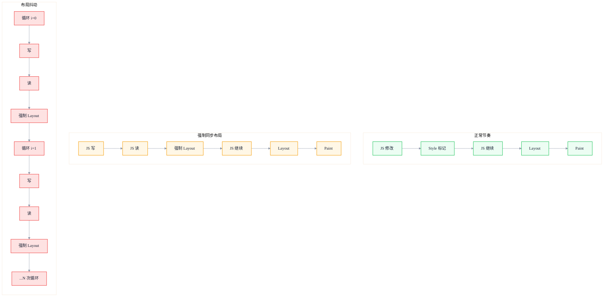
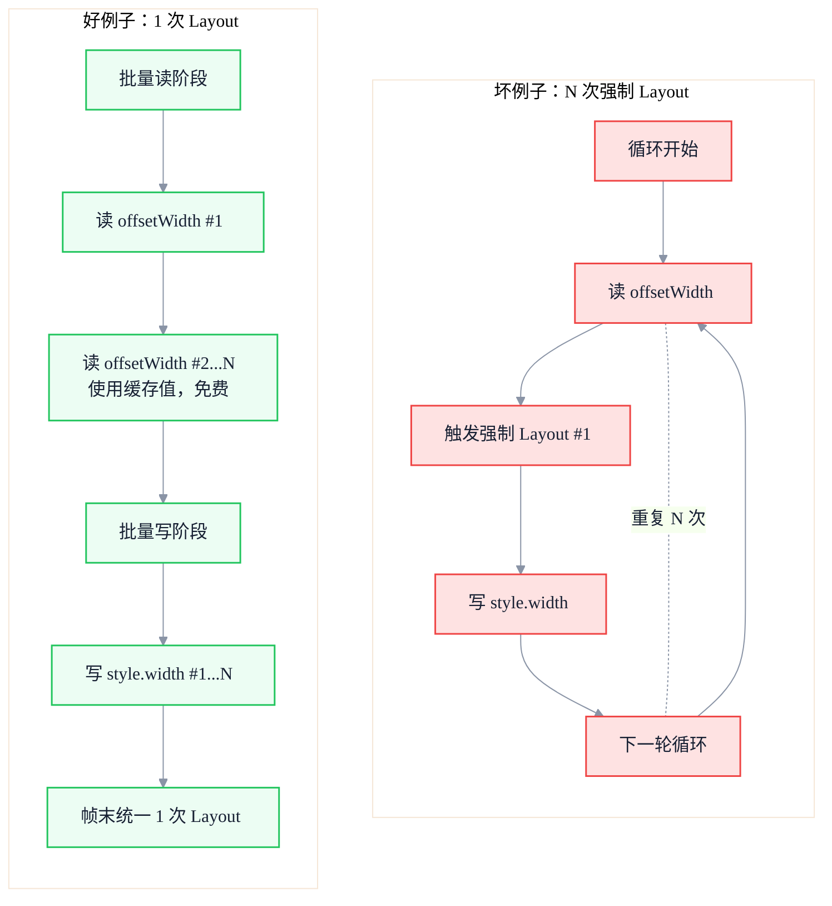

# 布局抖动的真相：Layout Thrashing 如何搞垮你的动画

> 副标题：从强制同步布局到布局抖动，深入剖析读写交替的代价、rAF 的正确用法与 Layout 阶段优化策略
>
> 目标读者：中高级前端工程师、前端架构师、动画与交互性能优化负责人
>
> 阅读时间：约 22 分钟

::: info 一句话
在循环中交替读写布局信息，会迫使浏览器反复执行强制同步布局，把 O(n) 的操作变成 O(n²)，这是动画卡顿最隐蔽的元凶之一。
:::

## 目录

- [写在前面](#写在前面)
- [一、什么是强制同步布局（Forced Synchronous Layout）](#一、什么是强制同步布局forced-synchronous-layout)
- [二、读写交替导致的布局抖动机制](#二、读写交替导致的布局抖动机制)
- [三、坏例子与好例子代码对比](#三、坏例子与好例子代码对比)
- [四、requestAnimationFrame 的正确使用](#四、requestanimationframe-的正确使用)
- [五、Layout 阶段的性能优化策略](#五、layout-阶段的性能优化策略)
- [六、如何识别与诊断布局抖动](#六、如何识别与诊断布局抖动)
- [七、常见触发场景与陷阱](#七、常见触发场景与陷阱)
- [结语：把读写分离当作肌肉记忆](#结语-把读写分离当作肌肉记忆)
- [FAQ](#faq)
- [来源](#来源)

## 写在前面

如果你做过前端动画优化，大概率听说过一句话："不要在循环里读 offsetWidth"。但很少有人讲清楚为什么。

这背后涉及一个常被误解的浏览器机制：**布局是惰性计算的**。当你修改样式时，浏览器不会立即重新计算布局，而是把脏标记（dirty mark）留着，等到下一帧渲染前才统一处理。这是浏览器为了批量优化而设计的机制。

但当你**读取布局信息**（如 `offsetWidth`、`getBoundingClientRect`）时，浏览器必须返回**当前准确的值**。如果之前有未消化的样式修改，浏览器就被迫**立即执行 Layout**才能给出正确答案。这就是"强制同步布局"（Forced Synchronous Layout，FSL）。

把这个机制放在循环里，每次循环都先写后读，浏览器就被迫在每次循环里做一次完整 Layout。原本 O(n) 的批量操作退化成 O(n²)，这就是 **Layout Thrashing（布局抖动）**。

::: tip 本节核心结论

布局抖动的根源不是"读了布局信息"，而是"在写之后读"。理解这一点，才能从机制上避免它，而不是靠记住一份"会触发 Layout 的属性列表"。
:::

---

## 一、什么是强制同步布局（Forced Synchronous Layout）

### 1. 正常的渲染节奏

在正常情况下，浏览器的渲染节奏是这样的：

```
JS 执行 → Style 标记 → Layout → Paint → Composite → 下一帧
```

JS 修改 DOM 或样式时，浏览器只是把"需要重新计算"的标记打上，**不立即执行 Layout**。等 JS 把一帧内所有改动都做完，主线程进入渲染阶段时，浏览器才一次性完成 Style 重算、Layout、Paint、Composite。

这是浏览器的"批量优化"——把一帧内的多次修改合并成一次 Layout。

### 2. 强制同步布局的触发

问题来了：JS 在修改样式后，**立刻读取布局信息**：

```javascript
element.style.width = '100px'
console.log(element.offsetWidth)  // 触发强制同步布局
```

`offsetWidth` 返回的是元素**当前**的布局宽度。浏览器要返回正确值，就必须先应用刚才的 `width: 100px` 修改，**立即执行 Layout**。这一次 Layout 没有等到帧末，而是被"提前"到 JS 执行过程中，所以叫"强制同步布局"——强制、同步、立即。

### 3. 强制同步布局 vs Layout Thrashing

两个术语经常混用，但有区别：

- **强制同步布局（FSL）**：一次写后立即读，触发一次提前 Layout
- **布局抖动（Layout Thrashing）**：在循环里反复"写-读-写-读"，触发 N 次提前 Layout，造成性能坍塌



::: tip 本节核心结论

强制同步布局是单次"写-读"触发的提前 Layout。布局抖动是在循环里反复"写-读"导致的 N 次提前 Layout，是性能坍塌的真正元凶。
:::

::: warning 常见误区

把"读 offsetWidth 一定慢"当成铁律。实际上，**没有前置修改的读**几乎是免费的——浏览器直接返回缓存的布局信息。慢的是"写后读"。
:::

---

## 二、读写交替导致的布局抖动机制

### 1. 为什么"写后读"会触发提前 Layout

浏览器设计上有一个不变量：**任何布局查询都必须返回当前准确的值**。

如果不强制 Layout，你刚把 `width` 改成 100px，紧接着读 `offsetWidth` 拿到的还是旧值——这是不可接受的。所以浏览器只能选择：**JS 查询布局信息时，如果有未消化的样式修改，就立即执行 Layout**。

### 2. 为什么在循环里会变成 O(n²)

考虑这段代码：

```javascript
const items = document.querySelectorAll('.item')
for (let i = 0; i < items.length; i++) {
  items[i].style.width = container.offsetWidth + 'px'  // 写 + 读
}
```

每次循环都执行"写 → 读"：

- 第 1 次循环：写 item[0]，读 container → 触发 1 次 Layout
- 第 2 次循环：写 item[1]，读 container → 触发 1 次 Layout
- ...
- 第 N 次循环：触发 1 次 Layout

总共 N 次 Layout。每次 Layout 的成本可能并不只是"处理一个元素"，因为浏览器要做增量 Layout 的脏标记追踪、依赖计算，在大 DOM 上单次 Layout 也可能很贵。所以总成本是 O(N) × 单次 Layout 成本，最坏情况下接近 O(N²)。

### 3. 浏览器的"Layout 提示"优化

Chromium 有一个轻微的优化：在某些情况下，连续的强制同步布局会被合并。但这只在很简单的场景下生效，不能依赖。在循环里、有多个互相依赖的元素时，优化失效。

::: tip 本节核心结论

布局抖动的本质是：本应被批量合并的 N 次 Layout 被迫在 JS 执行过程中逐次完成。修复的根本思路是"先批量读、再批量写"，让浏览器只在帧末做一次 Layout。
:::

---

## 三、坏例子与好例子代码对比

### 1. 坏例子：循环里读写交替

```javascript
// 坏例子：每次循环都触发强制同步布局
function updateWidthsBad(items) {
  for (let i = 0; i < items.length; i++) {
    // 读：触发 Layout（因为前一次循环已经写过）
    const width = items[i].parentNode.offsetWidth
    // 写：标记 Layout 脏
    items[i].style.width = width + 'px'
  }
}

const items = document.querySelectorAll('.item')
updateWidthsBad(items)
```

如果 `items` 有 500 个，这段代码会触发约 500 次强制同步 Layout。在低端设备上，单次 Layout 可能就要 5-10ms，500 次就是 2.5-5 秒——动画必然卡死。

### 2. 好例子：先批量读，再批量写

```javascript
// 好例子：先读全部，再写全部
function updateWidthsGood(items) {
  // 第一步：批量读，把所有需要的值先拿出来
  const widths = []
  for (let i = 0; i < items.length; i++) {
    widths.push(items[i].parentNode.offsetWidth)
  }

  // 第二步：批量写
  for (let i = 0; i < items.length; i++) {
    items[i].style.width = widths[i] + 'px'
  }
}

const items = document.querySelectorAll('.item')
updateWidthsGood(items)
```

这段代码只触发 1 次 Layout（在第一次循环的第一次读时，之后所有读都是缓存值），写阶段全部累积到帧末统一处理。性能差距通常是几十倍到几百倍。

### 3. 对比 Mermaid 图



### 4. 更复杂的场景：多变量读写

实际项目中，往往不是单一变量的读写。比如：

```javascript
// 坏例子：循环里同时读多个属性
for (const card of cards) {
  const containerWidth = card.parentNode.offsetWidth
  const containerHeight = card.parentNode.offsetHeight
  const ratio = containerWidth / containerHeight
  card.style.aspectRatio = ratio
  card.style.width = containerWidth * 0.5 + 'px'
}
```

修复思路一样：把所有读操作前置到循环外，把所有写操作后置到循环外或循环内统一写。

```javascript
// 好例子：批量读 + 批量写
const ratios = cards.map(card => {
  const w = card.parentNode.offsetWidth
  const h = card.parentNode.offsetHeight
  return { ratio: w / h, w: w * 0.5 }
})

cards.forEach((card, i) => {
  card.style.aspectRatio = ratios[i].ratio
  card.style.width = ratios[i].w + 'px'
})
```

::: tip 本节核心结论

修复布局抖动的固定套路：**先批量读、再批量写**。无论循环多复杂，只要把"读"和"写"在时间上分开，就能把 N 次 Layout 压成 1 次。
:::

---

## 四、requestAnimationFrame 的正确使用

### 1. rAF 的作用

`requestAnimationFrame` 是浏览器提供的、用来在**下一次渲染前**执行 JS 的 API。它有几个关键特性：

- 回调在渲染前执行
- 回调里修改样式会被合并到当前帧的 Layout 阶段
- 一帧只回调一次（约 16.6ms @ 60fps）
- 标签页不可见时回调暂停，节省资源

### 2. rAF 修复"分散的写"

如果同一帧内有多个不相关的代码块都要修改 DOM，把它们都放到 rAF 里可以确保它们在同一个帧末统一处理：

```javascript
// 坏例子：多个事件回调里直接改 DOM
button1.addEventListener('click', () => {
  element.style.left = '100px'  // 写
})
button2.addEventListener('click', () => {
  element.style.top = '200px'   // 写
})
// 两次点击发生在同一帧内时，浏览器会做两次 Style 标记，但只做一次 Layout
```

这种情况其实问题不大（浏览器批量优化能处理），但如果你**在每次写后立刻读**，rAF 也救不了。rAF 解决不了循环里的"写-读"问题，因为问题发生在一次 JS 执行内部。

### 3. rAF 修复动画循环

动画场景下，rAF 是必须的：

```javascript
// 坏例子：用 setTimeout 做动画
function animateBad() {
  element.style.transform = `translateX(${x}px)`
  setTimeout(animateBad, 16)
}
```

`setTimeout` 不和渲染对齐，可能在帧的中间触发，导致一帧执行多次或错过帧。

```javascript
// 好例子：用 rAF 做动画
function animateGood() {
  element.style.transform = `translateX(${x}px)`
  requestAnimationFrame(animateGood)
}
```

### 4. rAF 的错误用法

```javascript
// 错误：在 rAF 里读布局，外面写
function bad() {
  const width = element.offsetWidth  // 读
  requestAnimationFrame(() => {
    element.style.width = width + 'px'  // 写
  })
}
```

这个写法没解决任何问题。正确做法是反过来：**外面读，rAF 里写**——这样读的时候还没有未消化的写，写的时候统一在帧末 Layout。

```javascript
// 正确：先读，rAF 里写
function good() {
  const width = element.offsetWidth  // 读：此时没有脏修改，免费
  requestAnimationFrame(() => {
    element.style.width = width + 'px'  // 写：帧末统一处理
  })
}
```

### 5. 双 rAF 的特殊场景

有时需要"在下一帧的渲染完成后"读取布局信息（比如测量一个动画结束后的最终位置），这时用**双 rAF**：

```javascript
requestAnimationFrame(() => {
  requestAnimationFrame(() => {
    // 此时上一帧已经渲染完成，读布局是准确的
    const rect = element.getBoundingClientRect()
  })
})
```

::: tip 本节核心结论

rAF 不是布局抖动的解药，**读写分离才是**。rAF 解决的是"动画和渲染对齐"和"多次写合并到一帧"的问题。记住：先读后写，rAF 里只写不读。
:::

::: warning 常见误区

把所有 DOM 操作都包进 rAF 来"提升性能"。这不会修复布局抖动，只会让代码更难调试。先确保读写分离正确，再考虑是否需要 rAF 调度。
:::

---

## 五、Layout 阶段的性能优化策略

### 1. 优先用 transform / opacity 做动画

最根本的避免 Layout 的方法是**不触发它**。把动画做成只改 `transform` 和 `opacity`，整条流水线就跳过 Layout 和 Paint，直接进 Composite。

```css
/* 坏：触发 Layout */
.move {
  transition: left 0.3s, top 0.3s;
  left: 100px;
  top: 200px;
}

/* 好：只触发 Composite */
.move {
  transition: transform 0.3s;
  transform: translate(100px, 200px);
}
```

### 2. 避免 `display: none` 切换

`display: none` 与 `display: block` 之间切换会触发渲染树重建 + 完整 Layout。需要频繁切换的场景，用 `visibility: hidden`（只触发 Paint）或 `opacity: 0`（只触发 Composite）。

### 3. 用 `contain` 属性隔离布局

CSS `contain` 属性告诉浏览器某个元素的子树独立，可以隔离重排范围：

```css
.card-list {
  contain: layout style;
}
```

这样卡片列表内部的 Layout 变化不会扩散到外部。`contain: strict` 等价于 `layout style paint size`，隔离最彻底，但要求元素有固定尺寸。

### 4. 减少 DOM 规模

DOM 节点数量直接决定 Layout 成本。长列表用虚拟滚动（如 `react-window`、`vue-virtual-scroller`），只渲染可见区域的几十个节点，而不是几千个。

### 5. 使用 DocumentFragment 批量插入

```javascript
// 坏：循环里逐个 append，触发多次 Layout
for (const item of items) {
  const li = document.createElement('li')
  li.textContent = item
  list.appendChild(li)
}

// 好：用 DocumentFragment 批量插入
const fragment = document.createDocumentFragment()
for (const item of items) {
  const li = document.createElement('li')
  li.textContent = item
  fragment.appendChild(li)
}
list.appendChild(fragment)
```

### 6. 现代框架的批量更新机制

React、Vue、Solid 等框架都有批量更新机制：

- **React 18**：所有事件回调和 `setTimeout` 中的状态更新都会被自动批处理
- **Vue 3**：基于响应式系统的依赖追踪，同一 tick 内的多次修改合并成一次更新
- 但框架的批量更新解决的是"多次状态修改合并成一次渲染"，**不能解决你主动在 effect 里读写 DOM 造成的布局抖动**

::: tip 本节核心结论

Layout 优化四件套：① 用 transform/opacity 替代几何属性；② 用 contain 隔离；③ 用虚拟列表控制 DOM 规模；④ 用 DocumentFragment 批量插入。框架的批量更新不能替代手动的读写分离。
:::

---

## 六、如何识别与诊断布局抖动

### 1. Performance 面板

打开 DevTools → Performance → 录制 → 查看主线程轨迹：

- **紫色 Layout 块连续出现**：典型布局抖动信号
- **点击 Layout 块**：在 Bottom-Up 面板看到触发函数
- **红色三角标记**：长任务（>50ms）
- **强制同步布局警告**：在 Main 区块的 Layout 事件上会有紫色三角标，提示 "Forced reflow"

### 2. Rendering 面板

DevTools → More tools → Rendering：

- **Layout Shift Regions**：高亮发生布局抖动的区域（这是 CLS 概念，与 Layout Thrashing 不同，但区域重合时往往能定位问题）
- **Paint flashing**：高亮重绘区域

### 3. Lighthouse 审计

Lighthouse 报告里有 "Minimize layout thrashing" 一项，会指出具体的代码位置。

### 4. 关键指标

- **FPS**：动画期间 FPS 突然下降且伴随大量紫色 Layout 块
- **INP**：交互响应慢，但 JS 执行时间不长——可能是 Layout 占用了主线程
- **CLS**：累积布局偏移，反映视觉稳定性

::: tip 本节核心结论

诊断布局抖动的最快路径：Performance 面板录制 → 看是否有连续紫色 Layout 块 → 点击查看触发函数 → 检查是否有"写-读"交替。强制同步布局警告是最直接的信号。
:::

---

## 七、常见触发场景与陷阱

### 1. 响应式组件中频繁 getBoundingClientRect

```javascript
// 坏例子：滚动事件里读 getBoundingClientRect
window.addEventListener('scroll', () => {
  const rect = element.getBoundingClientRect()  // 读
  if (rect.top < 100) {
    element.classList.add('sticky')  // 写
  }
})
```

修复：

```javascript
// 好例子：用 IntersectionObserver 替代
const observer = new IntersectionObserver((entries) => {
  entries.forEach(entry => {
    if (entry.isIntersecting) {
      element.classList.add('sticky')
    }
  })
}, { threshold: [0, 0.1, 0.5, 1] })
observer.observe(element)
```

### 2. 第三方库的 DOM 操作

某些第三方库（旧版本图表库、广告 SDK）内部存在读写交替。这类问题难以直接修复，应对方式：

- 升级到新版本
- 用 `contain: strict` 隔离第三方库操作的容器
- 把第三方库的 DOM 操作放到 `requestAnimationFrame` 里，避免影响当前帧

### 3. 框架内的 ref 测量

```javascript
// React 中的反例
useEffect(() => {
  const height = ref.current.offsetHeight  // 读
  ref.current.style.height = height * 2 + 'px'  // 写
}, [deps])
```

修复思路：

```javascript
// 好例子：先读后写，且让 React 批量处理
useLayoutEffect(() => {
  const height = ref.current.offsetHeight  // 读
  // 通过 setState 触发 React 的批量更新
  setTargetHeight(height * 2)
}, [deps])
```

### 4. 动画驱动的布局测量

某些动画需要在每帧测量元素位置（如拖拽吸附、磁吸效果）。这种场景下：

- 用 `useLayoutEffect` 或 rAF 在帧末统一测量
- 把测量结果缓存到 ref，避免重复读
- 能用 `transform` 表达的位移，绝不用 `top/left`

::: tip 本节核心结论

最常见的布局抖动陷阱：滚动事件里读 `getBoundingClientRect`、第三方库的内部读写交替、框架 effect 里的 ref 测量。能用 `IntersectionObserver` 替代的就不要手动测量，能用 `transform` 的就不要改几何属性。
:::

---

## 结语：把读写分离当作肌肉记忆

布局抖动是前端性能里"低成本高收益"的优化点：修复方法简单（读写分离），但效果立竿见影（FPS 几倍提升）。它也是面试里区分"会写代码"和"理解浏览器"的关键知识点。

记住这条肌肉记忆：

> **每次想读布局信息时，先问自己：刚才有没有写过样式？如果有，把读前置到所有写之前。**

更进一步的认知：

1. **布局是惰性的**：写只打标记，Layout 在帧末统一执行
2. **读是即时的**：读必须返回当前准确值，所以会强制 Layout
3. **批量是王道**：先读后写，永远比读写交替快
4. **rAF 是对齐**：解决的是渲染对齐，不是布局抖动
5. **transform 是银弹**：能用 transform 表达的动画，绝不触发 Layout

把这套认知应用到日常代码里，你就能从源头上消灭绝大多数布局抖动。

---

## FAQ

### 1. 为什么"先读后写"就能解决布局抖动？

读布局信息时，如果没有未消化的样式修改，浏览器直接返回缓存值，几乎免费。把所有读前置到所有写之前，整个流程只触发 1 次 Layout（在第一次读时，如果之前有脏标记）。之后所有读都是免费的，所有写都在帧末统一处理。

### 2. requestAnimationFrame 能解决布局抖动吗？

不能直接解决。rAF 解决的是"动画和渲染对齐"以及"多次写合并到一帧"的问题。如果在一帧内 JS 执行过程中存在"写-读"交替，rAF 帮不上忙。正确做法是先在 rAF 外或 rAF 内做所有读，再做所有写。

### 3. 框架的批量更新能替代读写分离吗？

不能。React、Vue 的批量更新是把多次状态修改合并成一次渲染。但如果你在 `useEffect` 或 `watch` 里主动读 DOM 再写 DOM，框架管不到——这是直接操作真实元素，不走虚拟 DOM。这种情况下还是要手动读写分离。

### 4. 怎么判断一个属性会不会触发 Layout？

参考 csstriggers.com。但更简单的判断：**会改变元素几何位置或大小的属性都会触发 Layout**，如 `width`、`height`、`margin`、`padding`、`top/left`、`font-size`、`float`、`display`。`transform` 和 `opacity` 是少数只触发 Composite 的属性，所以它们是动画首选。

### 5. `getBoundingClientRect` 一定慢吗？

不一定。如果之前没有未消化的样式修改，`getBoundingClientRect` 直接返回缓存值，几乎是免费的。慢的是"在写之后读"。所以问题不在于这个 API 本身，而在于调用时机。

---

## 来源

本文基于 Chromium 渲染管线文档、web.dev 性能系列、Chrome DevTools 文档及作者工程实践总结。涉及的关键技术细节可参考：

1. web.dev - Avoid large, complex layouts and layout thrashing：[https://web.dev/articles/avoid-large-complex-layouts-and-layout-thrashing](https://web.dev/articles/avoid-large-complex-layouts-and-layout-thrashing)
2. Chrome DevTools - Analyze runtime performance：[https://developer.chrome.com/docs/devtools/performance/](https://developer.chrome.com/docs/devtools/performance/)
3. CSS Triggers：[https://csstriggers.com/](https://csstriggers.com/)
4. MDN - requestAnimationFrame：[https://developer.mozilla.org/zh-CN/docs/Web/API/Window/requestAnimationFrame](https://developer.mozilla.org/zh-CN/docs/Web/API/Window/requestAnimationFrame)
