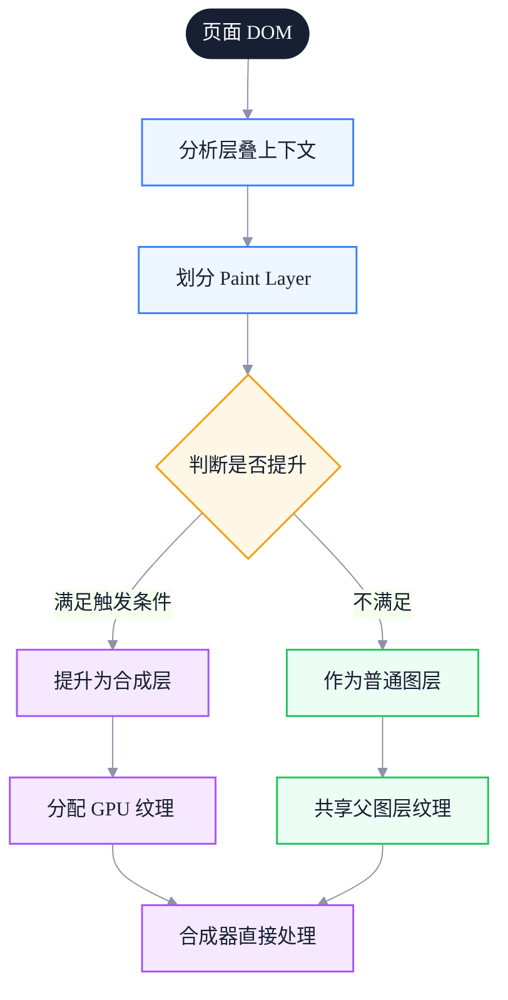
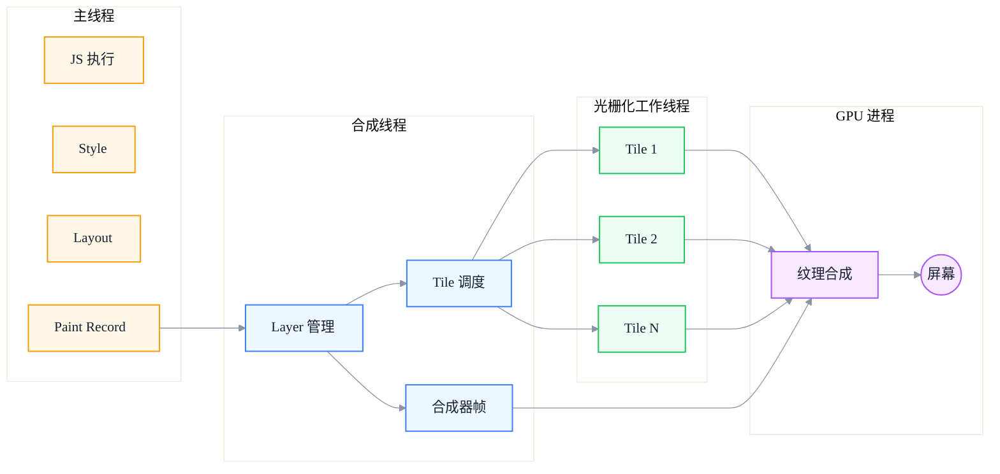

# 绘制与光栅化：从图层合成到屏幕显示

> 副标题：从 Paint Record 生成、图层分层、Tile 光栅化到 GPU 合成的完整链路，深入解析 transform/opacity 为何不触发 Layout
>
> 目标读者：中高级前端工程师、前端架构师、动画与渲染性能优化负责人
>
> 阅读时间：约 26 分钟

::: info 一句话
从 Paint 到屏幕，是一条"指令生成 → 图层切分 → Tile 光栅化 → GPU 合成"的流水线；理解这条流水线，才能解释为什么 transform 动画能在主线程卡顿时仍然丝滑。
:::

## 目录

- [写在前面](#写在前面)
- [一、绘制（Paint）阶段做什么](#一、绘制paint阶段做什么)
- [二、图层（Layer）与层叠上下文](#二、图层layer-与层叠上下文)
- [三、光栅化（Raster）：从矢量到位图](#三、光栅化raster从矢量到位图)
- [四、合成（Composite）：GPU 合成原理](#四、合成composite-gpu-合成原理)
- [五、transform/opacity 为何不触发 Layout](#五、transformopacity-为何不触发-layout)
- [六、硬件加速的正确理解](#六、硬件加速的正确理解)
- [七、合成线程与主线程的协作](#七、合成线程与主线程的协作)
- [八、实战：定位 Paint 与 Raster 瓶颈](#八、实战定位-paint-与-raster-瓶颈)
- [结语：合成是性能优化的终极战场](#结语-合成是性能优化的终极战场)
- [FAQ](#faq)
- [来源](#来源)

## 写在前面

在前一篇《渲染流水线》里，我们介绍了 Layout 之前的几个阶段。本文聚焦 Layout 之后的另一半：**从绘制指令到屏幕像素**的完整链路。

这条链路常被前端工程师忽视，因为它"看起来离业务很远"。但它恰恰是解释很多现象的关键：

- 为什么 `transform: translate()` 的动画即使主线程被 JS 卡死也能丝滑？
- 为什么 `will-change` 不能滥用，但又确实有效？
- 为什么 `box-shadow` 大面积模糊会让 FPS 暴跌？
- 为什么 `position: fixed` 元素有时会"闪烁"？
- 为什么 GPU 加速不是免费的？
- 为什么 LCP 图片下载完了还要等几百毫秒才能显示？

理解这条链路，本质上是理解"浏览器如何把抽象的图层模型变成具体的像素"。本文会带你走完从 Paint 到屏幕的每一步，最终建立一个能解释上述所有现象的模型。

::: tip 本节核心结论

Paint 和 Raster 是两件事：Paint 生成绘制指令（在主线程），Raster 把指令变成像素（在工作线程 + GPU）。Composite 把多个图层拼起来（在 GPU 进程）。`transform/opacity` 之所以不触发 Layout，是因为它们作用在合成阶段，而不是 Paint 阶段。
:::

---

## 一、绘制（Paint）阶段做什么

### 1. Paint 不直接产生像素

一个常见的误解是"Paint 就是把页面画出来"。但严格来说，**Paint 阶段不直接产生像素**，而是产生**绘制指令列表**（Paint Record、Display List、Paint Ops）。

Paint Record 类似这样一组抽象指令：

```
pushClip(0, 0, 1440, 900)
  drawRect(0, 0, 1440, 900, color=#ffffff)
  drawRect(20, 20, 200, 50, color=#3b82f6)
  drawText("Hello", 30, 50, font=14px sans-serif, color=#ffffff)
  drawImage(hero.webp, 0, 100, 1440, 600)
  drawShadow(20, 700, 300, 100, blur=20px, color=rgba(0,0,0,0.3))
    drawRect(20, 700, 300, 100, color=#ffffff)
popClip()
```

这些指令告诉光栅化器：在哪个坐标画什么、按什么顺序、用什么参数。指令的顺序遵循 painter's algorithm——后画的覆盖先画的。

### 2. 为什么不直接产生像素

把"生成指令"和"执行指令"分开，有几个好处：

- **并行化**：指令可以分给多个光栅化线程并发执行
- **重用**：如果只是图层变换（transform），可以重用旧的指令，跳过 Paint
- **分层**：每个图层独立产生指令，独立光栅化，独立合成
- **缓存**：相同指令序列可以缓存到 GPU 纹理，下次直接合成

### 3. Paint 的代价来自哪里

Paint 阶段的成本主要来自：

- **重绘面积**：每次重绘覆盖多少像素
- **绘制复杂度**：阴影、模糊、渐变、滤镜的复杂度
- **图层数量**：每个图层都要单独生成 Paint Record

最贵的操作之一是**大面积模糊阴影**。`box-shadow: 0 0 100px rgba(0,0,0,0.5)` 这种阴影，浏览器要么用 CPU 软件模糊（贵），要么用 GPU 多次采样（也贵）。如果元素还在动画中反复重绘，FPS 会暴跌。

### 4. Paint 的输出：Paint Layer 与 Graphics Layer

Paint 阶段除了产生 Paint Record，还会**根据层叠上下文把页面切成多个图层**：

- **Paint Layer**：参与绘制的图层单元，对应一个层叠上下文
- **Graphics Layer**：能被合成器独立处理的合成层，每个 Graphics Layer 有自己的 GPU 纹理

不是每个 Paint Layer 都会升级成 Graphics Layer。只有满足特定条件（如 3D 变换、`will-change`、被动画的 transform/opacity）的图层，才会被提升为合成层。

::: tip 本节核心结论

Paint 产生绘制指令而非像素，按图层组织。最贵的 Paint 操作是大面积模糊阴影和复杂滤镜。Paint 的输出是 Paint Record + Layer 列表，后续交给光栅化和合成处理。
:::

---

## 二、图层（Layer）与层叠上下文

### 1. 层叠上下文（Stacking Context）

层叠上下文是 CSS 的概念：某些元素会成为"层叠上下文根"，它的子元素在内部按 z-order 叠加，外部对该元素整体处理。

会创建层叠上下文的常见条件：

- `position: absolute/relative` + `z-index` 非 auto
- `position: fixed/sticky`
- `opacity < 1`
- `transform` 非 none
- `filter` 非 none
- `will-change` 为某些值
- `<video>`、`<canvas>` 等替换元素

### 2. 从层叠上下文到图层

浏览器在 Paint 阶段会把层叠上下文映射成图层（Paint Layer）。但**不是每个层叠上下文都会成为独立图层**——这是浏览器的优化空间。

一个简单的页面可能只有 1 个图层（所有内容画在一起）。但当页面有：

- `position: fixed` 的导航栏
- 一个 `transform: translateZ(0)` 的卡片
- 一个 `<video>` 元素
- 一个 `opacity: 0.5` 的浮层

每个都可能成为独立图层。

### 3. 合成层（Compositing Layer）

合成层是图层里的"VIP"：它有自己独立的 GPU 纹理，可以被合成器直接处理，不需要主线程参与。

合成层提升的常见触发条件：

| 触发条件 | 说明 |
| --- | --- |
| 3D 变换 | `transform: translateZ(0)`、`translate3d`、`rotateX/Y` |
| `will-change: transform/opacity` | 前提是真有动画即将发生 |
| 被动画的 `transform/opacity` | 至少一帧动画 |
| `<video>`、`<canvas>`、WebGL | 替换元素天然合成 |
| `position: fixed` + 软件合成 | 部分浏览器实现 |
| `opacity < 1` + 已是合成层 | 配合 transform 等其他条件 |
| CSS `filter` | 部分浏览器实现 |

### 4. 合成层提升的副作用

合成层不是越多越好。每个合成层都带来：

- **GPU 内存**：每个纹理至少几百 KB 到几 MB
- **合成成本**：合成器要处理多个纹理，越多越慢
- **重绘成本**：合成层内容变化时，要重新光栅化整个图层



::: tip 本节核心结论

图层来自层叠上下文，合成层是图层里的 VIP。合成层能跳过主线程直接由 GPU 合成，但每个合成层都消耗 GPU 内存。`will-change` 滥用会导致"合成层爆炸"，反而拖慢性能。
:::

::: warning 常见误区

给所有元素加 `transform: translateZ(0)` 来"开启 GPU 加速"。这会让浏览器为不一定需要的元素都创建合成层，导致内存占用激增和合成阶段变慢。正确做法是只对真正需要动画的元素临时使用。
:::

---

## 三、光栅化（Raster）：从矢量到位图

### 1. 光栅化做什么

光栅化是把**矢量绘制指令**（drawRect、drawText、drawImage）转换成**真实像素位图**的过程。

Paint Record 描述的是"在 (20, 20) 画一个 200×50 的蓝色矩形"，光栅化器要计算这个矩形覆盖哪些像素、每个像素应该是什么颜色（考虑抗锯齿、子像素渲染、文本 hinting 等）。

### 2. Tile 切分

合成层通常不是一次性整体光栅化的，而是被切成小的 **Tile（瓦片）**，通常是 256×256 或 512×512 像素。

Tile 切分的好处：

- **并行化**：多个 Tile 可以分给多个光栅化线程并发处理
- **按需光栅化**：只光栅化当前可见区域 + 预光栅化周边，节省资源
- **优先级**：先光栅化视口内的 Tile，再光栅化视口外的
- **增量更新**：图层局部变化时，只重新光栅化受影响的 Tile

### 3. 光栅化线程池

Chromium 的光栅化不是在主线程做的，而是在**合成线程 + 光栅化工作线程池**里完成：

- **合成线程**：负责图层管理、Tile 调度、合成帧生成
- **光栅化工作线程**：多个 worker 并发执行 Tile 光栅化

这就是为什么 transform 动画即使主线程被 JS 占满也能流畅——合成线程和工作线程独立于主线程。

### 4. GPU 光栅化 vs 软件光栅化

现代浏览器普遍用 **GPU 光栅化**：把绘制指令交给 GPU，由 GPU 着色器执行，输出像素。

GPU 光栅化的优势：

- 大规模并行，像素级并发
- 文本、路径、图像都可以用 GPU 着色器处理
- 输出直接是 GPU 纹理，无需 CPU↔GPU 拷贝

某些场景下仍会回退到软件光栅化（CPU），比如：

- 某些复杂 SVG 滤镜
- 某些 CSS filter（如复杂的 `drop-shadow`）
- 显存不足时
- 某些非标准 CSS 属性

### 5. 光栅化与 LCP

LCP（Largest Contentful Paint）的完成时间，本质上取决于"**LCP 元素的光栅化完成时间**"。即使图片下载完、解码完、布局完，如果合成线程在排队其他工作，LCP 元素的 Tile 还没光栅化，LCP 就不会触发。

这就是为什么主线程长任务会拖慢 LCP——主线程被占用时，Paint 阶段无法启动，光栅化也就没法开始。

::: tip 本节核心结论

光栅化把绘制指令变成像素位图，按 Tile 切分并发执行。GPU 光栅化是主流，但某些复杂滤镜会回退到软件。LCP 的最终时间取决于光栅化完成时间，主线程卡顿会拖慢整个链路。
:::

---

## 四、合成（Composite）：GPU 合成原理

### 1. 合成做什么

合成是渲染流水线的最后一步：把多个已经光栅化的图层（GPU 纹理），按正确的顺序、正确的变换，拼成最终的一帧画面，输出到屏幕。

合成的本质是一系列**纹理 + 变换矩阵**的组合：

```
合成帧 = [
  { texture: layer1, transform: identity, opacity: 1.0 },
  { texture: layer2, transform: translate(100, 50) rotate(15deg), opacity: 0.8 },
  { texture: layer3, transform: scale(1.2), opacity: 1.0 }
]
```

GPU 把每个纹理按变换矩阵画到屏幕缓冲区，按顺序叠加，最终输出像素。

### 2. 合成在 GPU 进程完成

Chromium 的合成分两步：

- **合成器线程**（属于渲染器进程）：决定每个图层的位置、变换、可见性，生成"合成器帧"
- **GPU 进程**：实际执行纹理合成，输出到屏幕

合成器线程和 GPU 进程都**不在主线程**。这是"transform 动画不卡主线程"的根本原因。

### 3. 合成的代价

合成本身相对便宜（就是几次纹理采样），但仍然有成本：

- **图层数量**：每个图层都要采样一次，越多越慢
- **变换复杂度**：3D 变换比 2D 变换略贵
- **混合模式**：opacity、blend mode 需要额外采样
- **裁剪和遮罩**：复杂 mask 增加采样次数
- **超大纹理**：超过 GPU 最大纹理尺寸时要切分

### 4. 合成的频率

合成是按帧进行的，60fps 意味着每 16.6ms 一次合成。即使页面完全静止，浏览器仍然在做合成（合成静态帧），只是成本很低。

当用户滚动时，合成器线程可以直接更新滚动位置并重新合成，**不需要主线程参与**——这就是"非主线程滚动"的基础。前提是滚动容器没有 `scroll` 事件监听器，或者监听器用了 `passive: true`。



::: tip 本节核心结论

合成是渲染流水线的最后一步，在合成线程和 GPU 进程完成，主线程不参与。这是 transform/opacity 动画能在主线程卡顿时仍然流畅的根本原因。滚动可以是"非主线程滚动"，前提是合理使用 passive 监听器。
:::

---

## 五、transform/opacity 为何不触发 Layout

这是渲染流水线最神奇的现象，也是面试常考题。理解了前面的链路，这个问题就一目了然。

### 1. transform 的本质

`transform` 改变的是**元素的视觉变换**，而不是**元素的布局位置**。

具体来说：

- `transform: translate(100px, 50px)` 改变的是元素在屏幕上**绘制时的位置**
- 元素的**布局位置**（影响其他元素的位置）没有改变
- 浏览器仍然认为这个元素在原来的位置，只是合成时把它"挪"到新位置

所以 transform 不触发 Layout——布局信息没变，不需要重新计算。

### 2. transform 在哪个阶段生效

transform 作用在**合成阶段**：

```
Layout（不变） → Paint（不变） → Raster（不变） → Composite（应用 transform）
```

也就是说，元素的光栅化纹理（位图）不变，只是在合成时用变换矩阵把它画到新位置。这就是为什么 transform 动画如此便宜——只有合成阶段工作，主线程、Layout、Paint、Raster 全部跳过。

### 3. opacity 同理

`opacity` 改变的是**绘制时的透明度**，不改变布局，也不改变绘制内容。合成器在把图层纹理画到屏幕时，按 opacity 调整透明度即可：

```
合成输出像素 = 原像素 × opacity + 下方像素 × (1 - opacity)
```

### 4. 完整对比

```mermaid
%%{init: {'theme': 'base', 'themeVariables': { 'fontFamily': 'Inter, PingFang SC, Microsoft YaHei, sans-serif', 'primaryColor': '#EEF6FF', 'primaryTextColor': '#172033', 'primaryBorderColor': '#6EA8FE', 'lineColor': '#8A94A6'}}}%%
flowchart TB
    subgraph Width["改 width/height"]
        direction LR
        W1[Style] --> W2[Layout] --> W3[Paint] --> W4[Raster] --> W5[Composite]
    end

    subgraph Color["改 color/background"]
        direction LR
        C1[Style] --> C2[Paint] --> C3[Raster] --> C4[Composite]
    end

    subgraph Transform["改 transform/opacity"]
        direction LR
        T1[Composite]
    end

    classDef expensive fill:#FEE2E2,stroke:#EF4444,color:#172033,stroke-width:1.5px;
    classDef medium fill:#FFF7E6,stroke:#F59E0B,color:#172033,stroke-width:1.5px;
    classDef cheap fill:#ECFDF3,stroke:#22C55E,color:#172033,stroke-width:1.5px;

    class W1,W2,W3,W4,W5 expensive;
    class C1,C2,C3,C4 medium;
    class T1 cheap;
```



### 5. 为什么 transform 必须作用在合成层

如果元素不在合成层，transform 动画的每一帧都要：

1. 主线程重新做 Style
2. 主线程重新做 Layout（即使布局不变，也要确认）
3. 主线程重新做 Paint
4. 工作线程重新做 Raster
5. 合成

这比"只做合成"贵得多。所以浏览器会**自动把"被动画的 transform/opacity"的元素提升为合成层**，确保动画期间只走合成路径。

::: tip 本节核心结论

transform/opacity 不触发 Layout 的根因：它们改变的是合成阶段的变换矩阵和透明度，不改变布局信息，也不改变绘制内容。浏览器会把被动画的这类元素自动提升为合成层，让动画完全走合成路径。
:::

::: info 关键认知

"transform 不触发 Layout" 这句话完整说应该是："transform 作用在合成层、且只改 transform/opacity 时，整条流水线只在合成阶段执行"。如果元素不是合成层（比如某些边界情况），或者同时改了其他属性，可能仍会触发 Paint 甚至 Layout。
:::

---

## 六、硬件加速的正确理解

### 1. "GPU 加速"是个被滥用的词

业界常说的"GPU 加速"通常指：**某个图层被提升为合成层，它的变换/透明度由 GPU 直接处理**。

但 GPU 在渲染流水线里的作用不止于此：

- **GPU 光栅化**：把绘制指令变成像素（在工作线程 + GPU）
- **GPU 合成**：把多个图层纹理合成成最终帧（在 GPU 进程）
- **GPU 着色器**：执行 CSS filter、复杂混合

所以严格说，"GPU 加速"不是开关，而是不同阶段的不同加速方式。

### 2. 强制提升合成层的 hack

历史上前端常用的 hack：

```css
.gpu-hack {
  transform: translateZ(0);
  /* 或 */
  transform: translate3d(0, 0, 0);
  /* 或 */
  will-change: transform;
}
```

这些都能强制元素提升为合成层，让动画走合成路径。但代价是：

- 每个合成层占用 GPU 内存
- 大量合成层让合成阶段本身变慢
- 显存不足时可能触发更糟的回退

### 3. will-change 的正确用法

`will-change` 是浏览器提供的"预告"机制：告诉浏览器某个属性即将变化，请预先准备。

正确用法：

```css
/* 元素 hover 时即将开始动画 */
.card:hover {
  will-change: transform;
}
.card {
  transition: transform 0.3s;
}
```

错误用法：

```css
/* 给所有卡片永久开启 will-change */
.card {
  will-change: transform;
}
```

正确做法是**事件驱动**：在动画即将开始时加上 will-change，动画结束后移除。例如 React 中：

```jsx
function Card() {
  const ref = useRef()
  const handleMouseEnter = () => {
    ref.current.style.willChange = 'transform'
  }
  const handleTransitionEnd = () => {
    ref.current.style.willChange = 'auto'
  }
  return (
    <div
      ref={ref}
      onMouseEnter={handleMouseEnter}
      onTransitionEnd={handleTransitionEnd}
      className="card"
    />
  )
}
```

### 4. 内存成本

每个合成层的 GPU 纹理大小大致是：`宽 × 高 × 4 字节（RGBA）`。

- 1920×1080 的图层约 8MB
- 一个页面有 20 个这样的图层，就是 160MB GPU 内存
- 显存不够时，浏览器会回退到软件合成，性能急剧下降

::: tip 本节核心结论

"GPU 加速"准确说法是"图层提升为合成层"。`will-change` 应该事件驱动、用完即移除，不能永久开启。每个合成层都消耗 GPU 内存，过多会导致性能反而下降。
:::

::: warning 常见误区

把 `will-change` 当成性能优化"补丁"，给所有可能有动画的元素都加上。这会导致合成层爆炸、GPU 内存占用激增，反而拖慢页面。
:::

---

## 七、合成线程与主线程的协作

### 1. 分工

| 工作 | 在哪里执行 | 是否阻塞主线程 |
| --- | --- | --- |
| JS 执行 | 主线程 | 是 |
| Style 计算 | 主线程 | 是 |
| Layout | 主线程 | 是 |
| Paint Record 生成 | 主线程 | 是 |
| Layer 管理 | 合成线程 | 否 |
| Tile 光栅化调度 | 合成线程 | 否 |
| Tile 光栅化执行 | 工作线程 + GPU | 否 |
| 合成器帧生成 | 合成线程 | 否 |
| 最终合成 + 输出 | GPU 进程 | 否 |

### 2. 主线程被卡顿时会发生什么

如果主线程被 JS 长任务占用：

- **新输入的样式修改无法处理**：Style、Layout、Paint 都排队等待
- **但已合成的图层可以继续动画**：合成线程独立工作，transform 动画继续推进
- **新动画无法启动**：因为提升合成层需要主线程做 Style

这就是"主线程卡死但 transform 动画还在动"的真相。

### 3. 非主线程滚动

浏览器滚动可以不走主线程：

- 合成线程直接更新滚动位置
- 重新合成图层，输出新帧
- 不触发 Style、Layout、Paint

但有例外：

- 如果有 `scroll` 事件监听器且非 `passive`，主线程要先执行监听器，可能阻塞滚动
- 如果滚动触发了 `position: sticky` 等需要 Layout 的效果，需要主线程参与
- 如果滚动改变了 DOM（如 `scrollTo` + 状态更新），需要主线程参与

所以移动端滚动性能优化的第一条：**scroll 监听器加 `passive: true`**。

```javascript
// 坏：阻塞滚动
element.addEventListener('scroll', handleScroll)

// 好：不阻塞滚动
element.addEventListener('scroll', handleScroll, { passive: true })
```

### 4. 合成与输入事件

合成线程还负责处理部分输入事件（如触摸、滚轮）。合成线程可以把事件转发给主线程（如 `click`），也可以直接消费（如非被动滚动）。如果主线程被长任务占用，事件会排队，造成 INP 恶化。

::: tip 本节核心结论

合成线程和工作线程独立于主线程，是"transform 动画不卡主线程"和"非主线程滚动"的基础。但新动画启动、Style/Layout 更新仍需主线程参与。移动端 scroll 监听器必须加 `passive: true`。
:::

---

## 八、实战：定位 Paint 与 Raster 瓶颈

### 1. Performance 面板

录制一段操作，查看：

- **绿色 Paint 块**：Paint 阶段耗时
- **绿色 Rasterize / Raster Task 块**：光栅化耗时
- **绿色 Composite Layers 块**：合成耗时
- **图层列表**：在 Layers 标签页可以看到所有图层和合成层数量

### 2. Layers 标签页

DevTools → More tools → Layers：

- 查看所有图层
- 查看每个图层的尺寸、内存占用
- 查看 Paint Profile（绘制耗时分析）
- 检测合成层爆炸

### 3. Rendering 标签页

- **Paint flashing**：高亮重绘区域，看哪些区域在重绘
- **Layer borders**：显示合成层边界，看合成层数量

### 4. 典型问题模式

- **大面积绿色 Paint 块**：重绘面积过大，可能用了大阴影或复杂背景
- **大量 Rasterize 块**：图层数量过多，或单图层尺寸过大
- **Composite Layers 很贵**：合成层爆炸
- **Paint flashing 高亮整个屏幕**：可能不小心触发了全页重绘（如改了 `body` 背景）

### 5. 优化方向

| 问题 | 优化方向 |
| --- | --- |
| 大面积重绘 | 减少重绘区域，把动画元素隔离到合成层 |
| 大阴影/滤镜 | 用静态图片替代，或简化效果 |
| 合成层过多 | 移除不必要的 `will-change` 和 `translateZ(0)` |
| 图层尺寸过大 | 拆分大图层，或用 `contain` 隔离 |
| 光栅化慢 | 控制图层数量和尺寸，避免大列表整层光栅化 |

::: tip 本节核心结论

Paint 与 Raster 瓶颈的定位：Performance 面板看绿色块的分布和耗时，Layers 面板看图层数量和内存，Paint flashing 看重绘区域。优化方向是减少重绘面积、控制合成层数量、避免大面积模糊效果。
:::

---

## 结语：合成是性能优化的终极战场

理解了 Paint → Raster → Composite 的完整链路，你应该能回答：

- 为什么 `transform` 动画能在主线程卡顿时仍然丝滑？
- 为什么 `will-change` 不能滥用？
- 为什么 LCP 图片下载完还要等光栅化？
- 为什么 GPU 加速不是免费的？
- 为什么大量 `box-shadow` 模糊会让 FPS 暴跌？

最终的心智模型：

> **渲染流水线后半段（Paint → Raster → Composite）的核心是"图层"。每个图层独立产生绘制指令、独立光栅化、独立合成。`transform/opacity` 之所以便宜，是因为它们只作用在合成阶段，跳过了前面的全部主线程工作。**

记住几个关键认知：

1. **Paint 产生指令而非像素**：在主线程，会阻塞交互
2. **Raster 把指令变成像素**：在工作线程 + GPU，不阻塞主线程
3. **Composite 把图层拼起来**：在 GPU 进程，最便宜
4. **transform/opacity 只走 Composite**：这是动画流畅的根本
5. **合成层有代价**：GPU 内存 + 合成成本，不能滥用

把所有性能优化策略都对应到这条链路上，你就能形成一个完整的"后半段"性能模型。

---

## FAQ

### 1. 为什么 `transform` 动画在主线程卡死时仍然丝滑？

因为 `transform` 作用在合成阶段，合成线程和 GPU 进程独立于主线程。即使主线程被 JS 长任务占用，合成线程仍然能继续推进 transform 动画——它只需要更新变换矩阵并重新合成。

### 2. `will-change` 应该一直开着吗？

不应该。`will-change` 会预先创建合成层并占用 GPU 内存。一直开着会让浏览器为不一定发生的动画预留资源，导致内存浪费和合成层爆炸。正确做法是事件驱动：动画即将开始时加上，动画结束后移除。

### 3. 为什么 `box-shadow: 0 0 100px` 会让 FPS 暴跌？

大面积模糊阴影非常贵，浏览器要么用 CPU 软件模糊，要么用 GPU 多次采样。如果元素还在动画中反复重绘，每次重绘都要重新计算模糊，FPS 自然暴跌。优化方向：减小阴影面积、用静态图片替代、或把阴影做成合成层（用 `filter: drop-shadow` + `will-change`）。

### 4. LCP 图片下载完为什么还要等几百毫秒才能显示？

LCP 的完成时间取决于"光栅化完成时间"，不只是"下载完成时间"。即使图片下载完、解码完、布局完，如果主线程被占用（Parse HTML、JS 长任务），Paint 阶段无法启动，光栅化也就没法开始。优化方向：减少首屏 JS 长任务、把 LCP 图片直接放在 HTML 中（更早被发现）。

### 5. GPU 加速是免费的吗？

不是。每个合成层都消耗 GPU 内存（约 `宽×高×4 字节`），过多合成层会让合成阶段本身变慢，显存不足时还会回退到软件合成。`will-change` 和 `transform: translateZ(0)` 滥用会导致"合成层爆炸"，反而拖慢性能。GPU 加速是优化手段，但不是免费午餐。

### 6. 为什么 scroll 监听器要加 `passive: true`？

非 passive 的 scroll 监听器会阻塞滚动：浏览器必须等主线程执行完监听器，才能开始滚动，导致滚动卡顿。`passive: true` 告诉浏览器"这个监听器不会调用 `preventDefault`"，浏览器可以直接在合成线程推进滚动，主线程监听器异步执行。移动端滚动性能优化的第一条就是给 scroll/touchmove 监听器加 `passive: true`。

---

## 来源

本文基于 Chromium 渲染管线文档、web.dev 性能系列、Chrome DevTools 文档及作者工程实践总结。涉及的关键技术细节可参考：

1. web.dev - Stick to compositor-only properties and manage layer count：[https://web.dev/articles/stick-to-compositor-only-properties-and-manage-layer-count](https://web.dev/articles/stick-to-compositor-only-properties-and-manage-layer-count)
2. Chromium Graphics 文档：[https://www.chromium.org/developers/design-documents/graphics-and-skia/](https://www.chromium.org/developers/design-documents/graphics-and-skia/)
3. web.dev - Animate with will-change：[https://web.dev/articles/animations-guide#will-change](https://web.dev/articles/animations-guide#will-change)
4. Chrome DevTools - Layers 面板文档：[https://developer.chrome.com/docs/devtools/performance/inspector/](https://developer.chrome.com/docs/devtools/performance/inspector/)
5. MDN - CSS will-change：[https://developer.mozilla.org/zh-CN/docs/Web/CSS/will-change](https://developer.mozilla.org/zh-CN/docs/Web/CSS/will-change)
