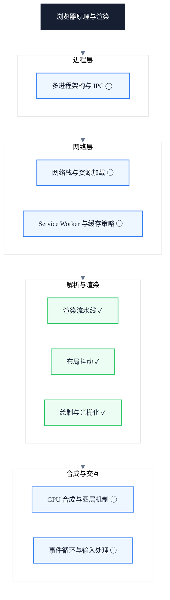

# 浏览器原理与渲染

> 副标题：从多进程架构到渲染管线，建立"请求 → 像素"的完整心智模型

## 模块定位

本模块以"请求 → 像素"为主线，拆解浏览器的多进程架构、网络栈、HTML/CSS 解析器、V8 引擎、渲染管线与 GPU 合成等内部链路。我们关注的是浏览器内部机制本身，而非运行在它之上的框架——框架只是这些机制的使用者。

很多前端工程师做性能优化时，第一反应是"框架重复渲染"或"包体积太大"，却忽略了真正的瓶颈往往在浏览器内部链路。只有建立从请求到像素的完整心智模型，才能把性能问题定位到具体阶段，选择正确的优化手段：知道一次回流触发 Layout，知道合成层提升的代价，知道为什么 read-after-write 会引发强制同步布局。

本模块不解决"如何用某个框架 API 写得更快"这类问题，也不替代《性能优化工程》模块中围绕关键路径与指标的工程实践。它的职责是提供浏览器内部的机制原语——当你理解了这些原语，再去阅读性能模块的实践清单时，会知道每一条建议背后的"为什么"。

---

## 知识地图

---

## 核心主题

### 已收录 ✓

- ✓ **渲染流水线**：Style / Layout / Paint / Raster / Composite 五段的输入、输出与触发条件
- ✓ **布局抖动**：强制同步布局的成因、读写交替模式与 FastDOM 解法
- ✓ **绘制与光栅化**：Paint 记录、显示列表、Tile 光栅化与合成层机制

### 规划中 ◯

- ◯ **多进程架构与 IPC**：浏览器进程、渲染器进程、GPU 进程、网络进程的职责划分与 IPC 协作
- ◯ **网络栈与资源加载**：预加载扫描器、Fetch Priority、HTTP/2 与 HTTP/3 对资源组织方式的影响
- ◯ **GPU 合成与图层机制**：图层树、Tile 光栅化、合成层提升条件与合成层爆炸
- ◯ **事件循环与输入处理**：任务队列、微任务、渲染时机与输入事件调度
- ◯ **Service Worker 与缓存策略**：SW 生命周期、Cache Storage 与缓存优先策略

---

## 学习路径

1. **渲染流水线** — 先建立"请求 → 像素"的全景视图，理解每一阶段的输入与输出
2. **绘制与光栅化** — 深入 Paint 与 Raster 阶段，理解显示列表、Tile 与合成层
3. **布局抖动** — 回到 Layout 阶段的运行时陷阱，掌握强制同步布局的识别与解法
4. （规划中）多进程架构与 IPC — 理解浏览器如何把工作分发给多个进程
5. （规划中）网络栈与资源加载 — 补齐"请求"之前的部分
6. （规划中）GPU 合成与图层机制 — 补齐"合成"部分的细节
7. （规划中）事件循环与输入处理 — 理解运行时的任务调度
8. （规划中）Service Worker 与缓存策略 — 理解资源缓存的另一条路径

---

## 文章导览

- [渲染流水线：从 HTML 到像素](/browser/rendering-pipeline) — 完整链路总览，理解每一阶段的输入与输出
- [布局抖动的真相：Layout Thrashing 如何搞垮你的动画](/browser/layout-thrashing) — 强制同步布局的成因与 FastDOM 解法
- [绘制与光栅化](/browser/painting-rasterization) — Paint 记录、Tile 光栅化与合成层机制

---

## 适用读者

- 中高级前端工程师，希望突破"框架局部优化"的视角局限
- 性能优化负责人，需要建立团队级的性能问题诊断框架
- 前端架构师，需要在技术选型时评估浏览器能力边界

---

## 延伸资源

- [Chrome University — Evaluate Performance](https://developer.chrome.com/docs/devtools/evaluate-performance/)：Chrome 官方的性能分析教学
- [web.dev Performance](https://web.dev/learn/performance/)：Google 出品的系统化性能课程
- [Chromium Source Documentation](https://chromium.googlesource.com/chromium/src/+/HEAD/docs/README.md)：Chromium 源码文档，深入实现细节
- 书籍：《Web Performance in Action》by Jeremy Wagner
