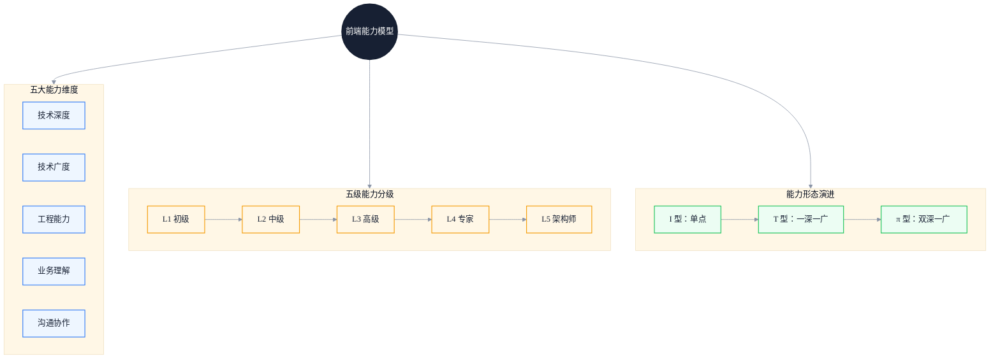
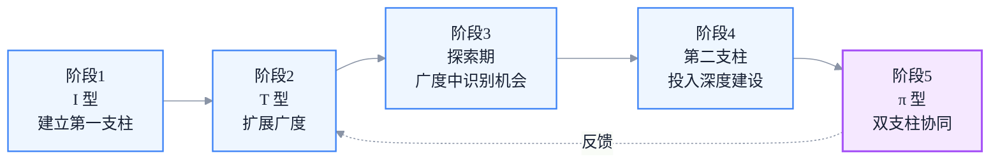

# 前端工程师能力模型：从 T 型到 π 型人才的进阶框架

> 副标题：能力维度划分、五级分级标准、T 型局限与 π 型构建、雷达图自评方法
>
> 目标读者：初中级前端工程师寻求进阶、高级前端工程师规划成长路径、技术管理者制定人才标准
>
> 阅读时间：约 25 分钟

::: info 一句话
前端工程师的能力不是"会多少框架"，而是"在多个维度上能稳定输出工程价值"。从 T 型到 π 型，本质是从单点深度走向双支柱协同。
:::

## 目录

- [写在前面](#写在前面)
- [一、为什么需要重新定义前端能力模型](#一、为什么需要重新定义前端能力模型)
- [二、能力模型的五大维度](#二、能力模型的五大维度)
- [三、五级能力分级标准](#三、五级能力分级标准)
- [四、T 型人才的局限性](#四-t-型人才的局限性)
- [五、π 型人才：两个深度支柱的构建](#五-π-型人才-两个深度支柱的构建)
- [六、能力雷达图：自我评估方法](#六-能力雷达图-自我评估方法)
- [七、常见的能力短板与突破策略](#七-常见的能力短板与突破策略)
- [八、能力模型的工程化应用](#八-能力模型的工程化应用)
- [结语：能力模型是地图，不是标尺](#结语-能力模型是地图-不是标尺)
- [FAQ](#faq)
- [来源](#来源)

## 写在前面

很多前端工程师在做年度规划时，会写下这样的目标：

- 学习 React 18 新特性
- 学习 Vue 3 源码
- 学习 Node.js
- 学习 TypeScript

这些目标本身没有问题，但它们都在回答"我会什么"，而不是"我能在多大复杂度下稳定输出"。结果是：很多人学完了一系列技术，仍然在解决相似复杂度的问题，能力天花板并没有真正被抬高。

::: info 一句话
能力模型不是技术清单，而是衡量"在什么复杂度下能稳定输出什么价值"的框架。
:::

本文试图建立一个对前端工程师真正可用的能力模型。这个模型的核心不是"会什么技术"，而是把能力拆解为多个可衡量维度，并用一套分级标准去定位自己当前所处的位置，进而规划下一步要补什么。

下图展示了从能力维度到分级、再到 T 型/π 型演进的完整框架：

---

## 一、为什么需要重新定义前端能力模型

过去十年前端岗位的边界发生了根本变化：

- 2014 年前后，"会 jQuery + Ajax"就够用了
- 2017 年前后，要求"会一个 MVVM 框架 + 构建工具"
- 2020 年前后，要求"懂性能优化、有工程化经验"
- 2023 年以后，要求"能独立设计系统、跨端、跨团队协作"

岗位边界的扩张带来了一个直接问题：**用"会多少技术"来衡量能力，越来越不准确**。

举一个真实的例子。两位工程师都"会 React":

- 工程师 A：能在已有脚手架下完成页面开发，遇到状态复杂场景就开始堆 Redux，遇到性能问题就 `memo` 全套加上
- 工程师 B：能根据业务复杂度选择状态方案（Context/Zustand/自研），能定位 LCP 慢是因为模块图过深，能在 Code Review 中识别出可能导致 Hydration 问题的写法

两个人在"技术清单"上看起来一样，但在"能解决的复杂度"上差了一个量级。

::: tip 本节核心结论

能力模型的本质，是从"会什么技术"转向"在什么复杂度下能稳定输出什么价值"。前者是清单，后者才是能力。
:::

---

## 二、能力模型的五大维度

把前端工程师的能力拆成五个相对独立的维度，每个维度都有自己的衡量标准。

### 1. 技术深度

技术深度指的是在某个具体技术领域内，能穿透到多底层的理解。对前端工程师来说，最常见的深度支柱是：

- **JavaScript / TypeScript 语言本身**：类型系统、运行时、V8 执行模型、GC、Event Loop
- **浏览器原理**：渲染管线、事件循环、网络栈、安全模型
- **框架源码与设计思想**：React Fiber、Vue 响应式、Svelte 编译时优化

深度的衡量标准不是"读过多少源码"，而是"遇到一个新问题，能不能定位到链路上的根因"。

::: warning 常见误区

把"读过 React 源码"等同于"有技术深度"。读源码只是手段，深度体现在能否用源码级的理解去解决真实工程问题。
:::

### 2. 技术广度

技术广度指的是对不同技术栈、不同解决方案的认知广度。它解决的是"知道有哪些选项"的问题。

广度的典型表现：

- 听说过 SSR / SSG / ISR / Streaming SSR / Islands / Resumability 各自适用场景
- 知道 Webpack / Vite / Rollup / esbuild / Turbopack 的差异和取舍
- 了解 CSS 方案的演进：CSS-in-JS / CSS Modules / Tailwind / CSS Modules + CSS Variables

广度不是"会用"，而是"知道存在并能判断适用场景"。广度让你在做技术选型时不至于"只会用锤子"。

### 3. 工程能力

工程能力指的是把代码变成可维护、可演进、可多人协作系统的能力。这是最容易在面试中被低估、却在工作中决定成败的维度。

工程能力的具体表现：

- 能设计合理的目录结构和模块边界
- 能制定 Code Review 标准，并真正执行
- 能搭建 CI/CD、灰度发布、监控告警
- 能在多人协作中控制代码质量（类型、测试、Lint、Commit 规范）
- 能识别和偿还技术债，而不是让它无限累积

工程能力的核心是**让别人能更容易地在你的代码上继续工作**。

### 4. 业务理解

业务理解指的是能不能跳出"实现需求"的视角，理解需求背后的业务目标。

业务理解的层次：

- L1：能按 PRD 实现
- L2：能识别 PRD 中的不合理之处，提出技术侧的反建议
- L3：能从业务指标出发，反推技术投入的优先级
- L4：能主动发现业务机会，用技术手段推动业务结果

举一个具体的例子。需求方说"做一个活动落地页，要求支持自定义配置"。

- 业务理解 L1 的工程师：直接按需求做配置后台 + 渲染页
- 业务理解 L3 的工程师：先问"配置频率多高？是运营配还是开发配？活动周期多长？"——这些问题会直接影响是做一个可视化搭建系统，还是只做一个 JSON Schema 配置

### 5. 沟通协作

沟通协作指的是在跨角色、跨团队场景下推动事情前进的能力。

沟通协作的典型场景：

- 和产品经理对齐需求边界，避免"PRD 写到一半就开始做"
- 和后端约定接口契约，避免后期联调返工
- 和测试沟通边界 case，避免上线后才发现关键路径漏测
- 跨团队推进技术方案，能在不同利益方之间找到平衡

沟通协作的核心不是"会说话"，而是**能识别不同角色的关注点，并用对方能接受的方式推动决策**。

::: tip 本节核心结论

五个维度相对独立：一个人可以在某个维度很强，但在另一个维度很弱。成长不是"五个维度同步提升"，而是"识别短板 + 强化支柱"。
:::

---

## 三、五级能力分级标准

把五个维度组合起来，可以建立五级能力分级。每级的核心特征用一句话概括：**这一级的人能在什么复杂度下独立完成什么**。

```mermaid
%%{init: {'theme': 'base', 'themeVariables': { 'fontFamily': 'Inter, PingFang SC, Microsoft YaHei, sans-serif', 'primaryColor': '#FFF7E6', 'primaryTextColor': '#172033', 'primaryBorderColor': '#F59E0B', 'lineColor': '#8A94A6'}}}%%
flowchart LR
    subgraph L1[L1 初级 0-2 年]
        L1A[能在指导下<br/>完成明确任务]
        L1B[技术深度: 单框架使用]
        L1C[工程能力: 遵循规范]
    end

    subgraph L2[L2 中级 2-4 年]
        L2A[能独立完成<br/>模块级功能]
        L2B[技术深度: 框架机制理解]
        L2C[工程能力: 写出可维护代码]
    end

    subgraph L3[L3 高级 4-6 年]
        L3A[能独立负责<br/>完整业务线]
        L3B[技术深度: 浏览器/运行时]
        L3C[工程能力: 制定规范]
    end

    subgraph L4[L4 专家 6-8 年]
        L4A[能设计复杂系统<br/>解决跨团队问题]
        L4B[技术深度: 多领域穿透]
        L4C[工程能力: 平台化建设]
    end

    subgraph L5[L5 架构师 8+ 年]
        L5A[能定义技术方向<br/>对业务结果负责]
        L5B[技术深度: 全链路视角]
        L5C[工程能力: 组织级工程体系]
    end

    L1 --> L2 --> L3 --> L4 --> L5

    classDef l1 fill:#ECFDF3,stroke:#22C55E,color:#172033,stroke-width:1.5px;
    classDef l2 fill:#EEF6FF,stroke:#3B82F6,color:#172033,stroke-width:1.5px;
    classDef l3 fill:#FFF7E6,stroke:#F59E0B,color:#172033,stroke-width:1.5px;
    classDef l4 fill:#F5E8FF,stroke:#A855F7,color:#172033,stroke-width:1.5px;
    classDef l5 fill:#FEE2E2,stroke:#EF4444,color:#172033,stroke-width:1.5px;

    class L1,L1A,L1B,L1C l1;
    class L2,L2A,L2B,L2C l2;
    class L3,L3A,L3B,L3C l3;
    class L4,L4A,L4B,L4C l4;
    class L5,L5A,L5B,L5C l5;
```

### L1 初级（0-2 年）

**核心特征**：能在指导下完成明确任务。

- **技术深度**：能熟练使用 1 个框架（React 或 Vue）完成页面开发，理解基本 API 背后的机制（如 `useState` 何时触发重渲染）
- **技术广度**：知道 HTML/CSS/JS 三件套，听说过构建工具但不会自己配置
- **工程能力**：能遵循已有规范提交代码，能在 Code Review 中接受建议并改进
- **业务理解**：能按 PRD 实现，对需求背后的业务目标不敏感
- **沟通协作**：能在小团队内同步进度，遇到阻塞能主动反馈

**衡量信号**：给定一个明确的设计稿和接口，能在 3 天内独立完成一个中等复杂度页面，主要 bug 不超过 5 个。

### L2 中级（2-4 年）

**核心特征**：能独立完成模块级功能。

- **技术深度**：理解框架核心机制（如 Fiber、Reconciler、响应式系统），能定位常见性能问题
- **技术广度**：熟悉构建工具配置、了解 SSR 基本原理、知道状态管理方案的演进
- **工程能力**：能写出可维护代码（合理抽象、命名清晰、单一职责），能写出有效的单元测试
- **业务理解**：能识别 PRD 中的边界 case，能从技术角度提出反建议
- **沟通协作**：能和后端、测试独立对接，能主导小规模技术方案讨论

**衡量信号**：能独立负责一个完整业务模块（如下单流程、用户中心），从设计到上线全程不需要他人指导。

### L3 高级（4-6 年）

**核心特征**：能独立负责一条完整业务线。

- **技术深度**：能从浏览器底层链路定位性能问题，理解 V8 执行模型、渲染管线、网络栈
- **技术广度**：能对比多种方案并给出选型依据，跨端（Web/RN/小程序）有实战经验
- **工程能力**：能制定团队规范（Code Review 标准、提交规范、测试策略），能搭建监控告警
- **业务理解**：能从业务指标反推技术投入优先级，能用技术手段提升业务结果
- **沟通协作**：能跨团队推进方案，能在不同利益方之间找到平衡

**衡量信号**：能独立负责一个业务线的技术方案，能在 3-6 个月内显著改善该业务线的核心指标（如性能、稳定性、研发效率）。

### L4 专家（6-8 年）

**核心特征**：能设计复杂系统，解决跨团队问题。

- **技术深度**：在多个领域有穿透性理解，能在源码层面贡献或修复框架级问题
- **技术广度**：跨栈视野（前端 + Node + 基础设施），能在不同技术栈之间做技术迁移
- **工程能力**：能主导平台化建设（组件库、工具链、低代码平台）
- **业务理解**：能识别业务机会，用技术手段推动业务模式创新
- **沟通协作**：能在组织层面推动技术决策，能影响其他团队的技术方向

**衡量信号**：能主导一个跨团队的技术项目（如全公司前端性能优化、统一工程化平台），产出可衡量的组织级结果。

### L5 架构师（8+ 年）

**核心特征**：能定义技术方向，对业务结果负责。

- **技术深度**：全链路视角，能在任意环节定位根因
- **技术广度**：技术全景图清晰，能判断"哪些技术值得投入"
- **工程能力**：组织级工程体系设计（研发流程、质量体系、技术栈演进路线）
- **业务理解**：能用技术驱动业务战略，参与业务决策
- **沟通协作**：能在 C-level 高管、产品负责人、技术团队之间做翻译

**衡量信号**：能定义一个业务线或技术领域 1-3 年的演进方向，并对最终结果负责。

::: warning 常见误区

把"工作年限"等同于"能力级别"。年限只是参考，真正的分级标准是"能独立解决的复杂度"。3 年做到 L3 的人存在，10 年还在 L2 的人也常见。
:::

::: tip 本节核心结论

五级分级的本质不是"评级"，而是"定位当前能独立处理的复杂度边界"。下一级的突破点，往往就在当前级的瓶颈上。
:::

---

## 四、T 型人才的局限性

"T 型人才"是过去十年最被推崇的能力模型：一竖代表深度，一横代表广度。

对前端工程师来说，T 型人才的典型画像：

- 一竖：React / Vue 框架熟练
- 一横：HTML/CSS/构建工具/状态管理/基础后端

T 型模型相比"I 型"（只有单点深度）是巨大进步，但在今天的复杂度下，它的局限性越来越明显：

### 1. 单一深度支柱容易过时

如果你的深度支柱是"React 用法"，那么 React 18 的并发模型、Server Components、Suspense for Data Fetching 等变化会让你的深度贬值。

深度支柱如果是"渲染管线 + React 调度模型"，那么无论 React 怎么演进，你的深度都仍然有效——因为你理解的是更底层的稳定结构。

### 2. 单一深度难以应对跨领域问题

很多真实问题不是"前端问题"或"后端问题"，而是"系统问题"。

例如 Hydration 性能问题，需要同时理解：

- 浏览器渲染管线（前端深度）
- 服务端执行模型（Node/Edge 深度）
- 框架的 SSR 实现（框架深度）

只有一个深度支柱的工程师，会在跨领域问题上失去判断力。

### 3. 单一深度难以承担架构责任

架构师工作的本质是在多个不确定维度上做权衡。如果只有一个深度支柱，你的判断会被这个支柱主导，倾向于"用熟悉的方案解决所有问题"。

::: tip 本节核心结论

T 型模型在 2015 年足够，但在今天，单一深度支柱已经无法支撑高级岗位的要求。需要向 π 型演进。
:::

---

## 五、π 型人才：两个深度支柱的构建

π 型人才的本质：**两条深度支柱 + 一定广度**。

对前端工程师，常见的 π 型组合：

- 支柱 A：前端框架 + 浏览器原理（前端深度）
- 支柱 B：Node.js / 服务端 / 云原生（后端深度）
- 广度：跨端、工程化、性能优化、业务理解

π 型的关键不是"两个支柱随便选"，而是**两个支柱之间能产生协同**。

### 1. 协同性的判断标准

判断两个支柱是否有协同，可以问三个问题：

1. **支柱 A 的深度，能否帮助支柱 B 解决更复杂的问题？**
   - 例：前端框架深度 → 帮助设计更好的 SSR 方案
2. **支柱 B 的深度，能否帮助支柱 A 突破天花板？**
   - 例：服务端深度 → 帮助实现 BFF、Edge Computing、Streaming SSR
3. **两个支柱结合，能否解决单一支柱无法解决的问题？**
   - 例：全栈深度 → 主导 Islands Architecture 落地

如果三个问题都是"否"，那只是"两个独立的 I 型拼在一起"，不是真正的 π 型。

### 2. 第二支柱的选择

第二支柱的选择不应该跟风，而应该结合自己的业务场景。

| 业务场景 | 第二支柱建议 |
| --- | --- |
| 中后台 SaaS | 后端架构 + 数据库设计（BFF、权限模型、数据流转） |
| C 端内容/电商 | 性能工程 + CDN/边缘计算 |
| 跨端业务 | RN/Flutter/小程序运行时 |
| 工具/平台型业务 | 编译原理 + IDE 工具链 |
| AI 应用 | LLM 应用工程 + Prompt 工程 |

### 3. π 型的构建路径

构建 π 型不是"先把 A 做到顶级，再开始 B"，而是更复杂的迭代过程：

::: tip 本节核心结论

π 型不是"两个 T 型拼起来"，而是"两个有协同性的深度支柱"。第二支柱的选择应结合业务场景，而不是跟风热点。
:::

---

## 六、能力雷达图：自我评估方法

抽象的能力模型如果不能落到自我评估上，就没有实操价值。下面是一个可用的雷达图评估方法。

### 1. 五维度评分表

对每个维度，按 1-5 分自评：

| 维度 | 1 分 | 3 分 | 5 分 |
| --- | --- | --- | --- |
| 技术深度 | 会用框架 | 理解框架机制 | 能从底层链路定位问题 |
| 技术广度 | 只会一个栈 | 知道多种方案并能选型 | 跨栈视野，能做技术迁移 |
| 工程能力 | 遵循规范 | 写出可维护代码 | 制定规范、主导平台化 |
| 业务理解 | 按 PRD 实现 | 识别边界 case | 从业务指标反推技术投入 |
| 沟通协作 | 团队内同步 | 跨职能对齐 | 跨团队推动决策 |

### 2. 评分的纪律

自评最大的风险是"自我感觉良好"。三个对齐手段：

1. **用具体事件佐证**：每项评分必须能举出 1-2 个具体事件作为证据。"我沟通协作 4 分"——请说出最近 3 个月你主导过的 1 个跨团队决策
2. **和同事校准**：找 1-2 个长期合作的同事，让他们给你评同样的维度，对比差异
3. **和外部对比**：通过技术社区、开源贡献、技术分享，对比同级别工程师的水平

### 3. 识别"短板"还是"瓶颈"

雷达图的本质是识别改进优先级。但要注意区分：

- **短板**：明显低于其他维度，限制了整体水平。例如工程能力 2 分，其他都 4 分
- **瓶颈**：当前级别向上突破时最关键的能力。例如想从 L3 升到 L4，业务理解和沟通协作通常是瓶颈

补短板解决"木桶效应"，破瓶颈解决"成长停滞"。两者在不同阶段优先级不同：

- L1→L2、L2→L3：优先补短板
- L3→L4、L4→L5：优先破瓶颈

::: tip 本节核心结论

能力雷达图是自我评估工具，但需要用具体事件佐证、和同事校准、和外部对比，否则容易陷入自我感觉良好。
:::

---

## 七、常见的能力短板与突破策略

### 1. "技术深度伪瓶颈"

很多 L2 工程师觉得自己"深度不够"，于是去看 React 源码、Vue 源码，但看了几个月发现工作能力没有提升。

**原因**：深度不是"读源码"，而是"用底层理解解决问题"。光读源码没有应用场景，知识无法沉淀为能力。

**突破策略**：

- 选 1 个最近遇到的线上问题（性能、内存、稳定性）
- 从浏览器链路、框架机制、运行时三个角度去定位根因
- 把整个过程写成技术文章或团队分享

这样深度就不再是"我读过什么源码"，而是"我能解决什么问题"。

### 2. "工程能力欠缺"

L2→L3 的最大瓶颈往往是工程能力。表现：

- 写的代码别人接手困难
- 不知道怎么制定 Code Review 标准
- 团队代码质量长期低迷但不知道如何改善

**突破策略**：

- 主动承担 Code Review 工作，每周至少 Review 5 个 PR
- 主导一次团队规范制定（如提交规范、测试规范）
- 从 0 搭建一次监控告警，把团队线上问题转化为可观测指标

工程能力只能通过"做工程"获得，看再多文章都不够。

### 3. "业务理解表面化"

很多技术工程师对业务的理解停留在"知道这个功能是干什么的"。真正的业务理解需要再深一层：

- 这个功能解决用户什么问题？
- 这个功能对哪些业务指标有影响？
- 这个功能的 ROI 如何衡量？

**突破策略**：

- 主动找产品经理对齐业务目标，不只是 PRD 细节
- 看业务周报、看核心指标看板，理解自己工作的影响
- 选 1 个业务线核心指标，主动用技术手段去优化它

### 4. "沟通协作只在熟人圈"

很多工程师在团队内沟通顺畅，但一跨团队就磕磕绊绊。这是 L3→L4 的典型瓶颈。

**原因**：跨团队沟通的核心不是"讲清楚技术"，而是"识别对方利益点 + 用对方能接受的方式推动"。

**突破策略**：

- 主导一次跨团队技术项目（如统一登录、性能优化、组件库共建）
- 在每次跨团队沟通前，先列出"对方关心什么、对方担心什么、我能提供什么"
- 复盘每次跨团队协作的成功/失败，找到自己的沟通模式

::: warning 常见误区

把"我不擅长沟通"当作不成长的借口。沟通协作是可学习的技能，核心是"识别对方视角 + 练习反馈"，不是天生的性格。
:::

::: tip 本节核心结论

每个能力短板都有对应的突破策略。核心原则是"用具体事件验证能力提升"，而不是"看更多书 / 学更多技术"。
:::

---

## 八、能力模型的工程化应用

能力模型不仅是个人规划工具，也可以应用到团队管理中。

### 1. 招聘定级

招聘时用统一的分级标准评估候选人，避免"感觉不错就给高级"。具体做法：

- 每级定义清晰的"能独立解决的复杂度"
- 面试问题对应到具体能力维度，而不是"会不会某个 API"
- 多个面试官独立评级，校准差异

### 2. 晋升评估

晋升评估的关键问题不是"工作几年"，而是"是否稳定在下一级复杂度上输出"。

判断信号：

- 候选人最近 6 个月是否有 2-3 个事件证明其在下一级复杂度上稳定输出
- 候选人是否在当前级别已经"过于轻松"，说明能力溢出
- 候选人的短板是否会限制其在下一级发挥作用

### 3. 团队能力地图

把团队成员的能力雷达图汇总，可以得到团队能力地图：

- 哪些维度是团队短板（需要招聘或培养）
- 哪些维度有冗余（可以做交叉备份）
- 哪些成员的能力可以互补

::: info 工程启示

能力模型在团队管理中的应用，本质是让"能力"从主观判断变成可衡量、可对比、可规划的对象。
:::

---

## 结语：能力模型是地图，不是标尺

能力模型最大的价值，是让你在做职业规划时不再只能写"学 React、学 Node、学 Rust"。

它能帮你回答更本质的问题：

- 我现在在哪个位置？
- 我下一步要补什么？
- 我的短板是哪个维度？
- 我的瓶颈是什么？

但它不是标尺——不要用它给自己或别人贴标签。能力是动态的，模型是静态的。模型帮你定位和规划，但真正的成长永远发生在解决具体问题的过程里。

::: info 一句话
能力模型是地图，不是终点。地图的价值是帮你决定下一步走哪里，而不是让你站在原地争论自己到底是 L3 还是 L4。
:::

---

## FAQ

### 1. 我工作 5 年了，但还是觉得自己在 L2，是哪里出问题了？

年限和能力级别不直接对应。先做雷达图自评，识别真正的短板。常见情况是：技术深度停留在"会用框架"，没有沉淀到底层链路理解；或者工程能力停留在"写代码"，没有进阶到"制定规范、主导平台化"。识别短板后，用具体事件验证突破，而不是继续堆技术清单。

### 2. T 型和 π 型真的有本质区别吗？是不是概念炒作？

T 型在 2015 年前后是有效的，因为前端复杂度还在单支柱能覆盖的范围内。但今天前端涉及 SSR、Edge、跨端、AI 等多个领域，单支柱深度已经不足以应对跨领域问题。π 型不是概念炒作，而是对"复杂度提升后单支柱失效"的回应。判断标准很简单：你最近半年遇到的最难的问题，是不是单一深度支柱已经无法解决？

### 3. π 型的第二支柱应该选什么？有标准答案吗？

没有标准答案，要看业务场景和个人兴趣。但有一个判断原则：第二支柱应该和第一支柱有协同性。例如第一支柱是前端框架深度，第二支柱选 Node/服务端可以协同解决 SSR、BFF 等问题；选 AI 工程化可以协同解决 LLM 应用前端问题。如果第二支柱和第一支柱无法协同，那只是两个独立的 I 型拼在一起。

### 4. 能力雷达图自评总是不客观，怎么办？

三个对齐手段：(1) 每项评分必须能举出 1-2 个具体事件作为证据；(2) 找长期合作的同事给你评同样的维度，对比差异；(3) 通过技术社区、开源贡献、技术分享，对比同级别工程师的水平。如果一项评分你自己说不出具体事件，那就是无效评分。

### 5. 团队管理者如何用能力模型做晋升评估？

晋升评估的核心问题是"是否稳定在下一级复杂度上输出"。具体做法：候选人最近 6 个月是否有 2-3 个事件证明其在下一级复杂度上稳定输出；候选人是否在当前级别已经"过于轻松"，说明能力溢出；候选人的短板是否会限制其在下一级发挥作用。避免"工作年限到了就给晋升"。

---

## 来源

本文基于行业实践和作者经验总结。能力模型的五个维度和五级分级参考了多家互联网公司的工程师能力标准，π 型人才的概念源自对前端岗位边界扩张的观察。
