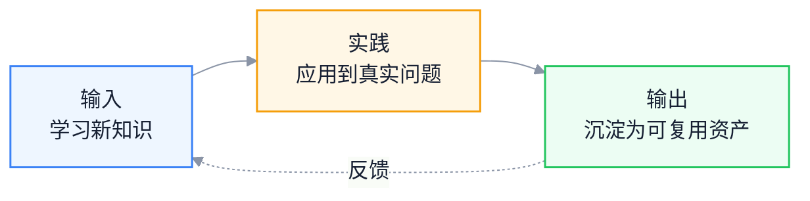

# 技术成长路径：从初级到架构师的能力跃迁

> 副标题：五个阶段的核心特征、四次关键跃迁、转折点与瓶颈、复利效应
>
> 目标读者：前端工程师规划下一阶段成长、技术管理者识别团队成员瓶颈、个人贡献者思考是否走向架构师
>
> 阅读时间：约 28 分钟

::: info 一句话
技术成长不是平滑的爬坡，而是多次"能力跃迁"。每次跃迁的本质，都是工作对象从一个具体事物升级为一个更抽象的系统。
:::

## 目录

- [写在前面](#写在前面)
- [一、技术成长的非线性特征](#一、技术成长的非线性特征)
- [二、五个阶段的核心特征](#二、五个阶段的核心特征)
- [三、初级 → 中级：从能写到写好的跨越](#三、初级--中级-从能写到写好的跨越)
- [四、中级 → 高级：从功能到系统的思维升级](#四、中级--高级-从功能到系统的思维升级)
- [五、高级 → 专家：从实现到设计的抽象能力](#五、高级--专家-从实现到设计的抽象能力)
- [六、专家 → 架构师：从技术到全局的视野](#六、专家--架构师-从技术到全局的视野)
- [七、技术成长的复利效应](#七、技术成长的复利效应)
- [结语：跃迁不是更努力，是工作对象的升级](#结语-跃迁不是更努力-是工作对象的升级)
- [FAQ](#faq)
- [来源](#来源)

## 写在前面

很多前端工程师在做职业规划时，隐含的假设是：

> 只要我持续学技术、做项目，能力就会随时间线性提升，最终自然成为架构师。

这个假设是错的。

技术成长不是平滑爬坡，而是阶梯式跃迁。每次跃迁都需要工作对象、思维方式、价值产出的根本变化。如果不主动完成这种变化，工作 10 年和能力 3 年的本质上没区别——只是把 3 年的经验重复了 7 次。

::: info 一句话
技术成长的本质是工作对象的升级：从一段代码，到一个功能，到一个系统，到一个领域，到一个业务。
:::

下图展示了从初级到架构师的五阶段成长路径，以及每次跃迁需要完成的核心转变：

```mermaid
%%{init: {'theme': 'base', 'themeVariables': { 'fontFamily': 'Inter, PingFang SC, Microsoft YaHei, sans-serif', 'primaryColor': '#EEF6FF', 'primaryTextColor': '#172033', 'primaryBorderColor': '#6EA8FE', 'lineColor': '#8A94A6', 'secondaryColor': '#F7F9FC', 'tertiaryColor': '#FFF7E6'}}}%%
flowchart LR
    subgraph Stage1[初级]
        S1[工作对象: 一段代码<br/>价值: 完成任务]
    end

    subgraph Stage2[中级]
        S2[工作对象: 一个功能<br/>价值: 独立交付]
    end

    subgraph Stage3[高级]
        S3[工作对象: 一个系统<br/>价值: 负责业务线]
    end

    subgraph Stage4[专家]
        S4[工作对象: 一个领域<br/>价值: 跨团队影响]
    end

    subgraph Stage5[架构师]
        S5[工作对象: 一个业务<br/>价值: 定义方向]
    end

    Stage1 -->|写好| Stage2
    Stage2 -->|系统思维| Stage3
    Stage3 -->|抽象设计| Stage4
    Stage4 -->|全局视野| Stage5

    classDef s1 fill:#ECFDF3,stroke:#22C55E,color:#172033,stroke-width:1.5px;
    classDef s2 fill:#EEF6FF,stroke:#3B82F6,color:#172033,stroke-width:1.5px;
    classDef s3 fill:#FFF7E6,stroke:#F59E0B,color:#172033,stroke-width:1.5px;
    classDef s4 fill:#F5E8FF,stroke:#A855F7,color:#172033,stroke-width:1.5px;
    classDef s5 fill:#FEE2E2,stroke:#EF4444,color:#172033,stroke-width:2px;
    classDef leap fill:#FFF7E6,stroke:#F59E0B,color:#172033,stroke-dasharray: 4 3;

    class Stage1,S1 s1;
    class Stage2,S2 s2;
    class Stage3,S3 s3;
    class Stage4,S4 s4;
    class Stage5,S5 s5;
```



---

## 一、技术成长的非线性特征

先理解一个反直觉的事实：**技术能力和工作年限之间不是线性关系，而是阶梯关系**。

如果把能力画在纵轴，年限画在横轴，真实的曲线更像下面这样：

```mermaid
%%{init: {'theme': 'base', 'themeVariables': { 'fontFamily': 'Inter, PingFang SC, Microsoft YaHei, sans-serif', 'primaryColor': '#F7F9FC', 'primaryTextColor': '#172033', 'primaryBorderColor': '#6EA8FE', 'lineColor': '#8A94A6'}}}%%
flowchart LR
    P1((起点))
    P2[平台期1<br/>能写代码])
    P3((跃迁1))
    P4[平台期2<br/>能做功能])
    P5((跃迁2))
    P6[平台期3<br/>能做系统])
    P7((跃迁3))
    P8[平台期4<br/>能做领域])
    P9((跃迁4))
    P10[平台期5<br/>能做业务])

    P1 --> P2 --> P3 --> P4 --> P5 --> P6 --> P7 --> P8 --> P9 --> P10

    classDef start fill:#172033,color:#fff,stroke:#172033,stroke-width:2px;
    classDef plateau fill:#EEF6FF,stroke:#3B82F6,color:#172033,stroke-width:1.5px;
    classDef leap fill:#F5E8FF,stroke:#A855F7,color:#172033,stroke-width:2px;

    class P1,P10 start;
    class P2,P4,P6,P8 plateau;
    class P3,P5,P7,P9 leap;
```

每个平台期的能力增长是缓慢的，因为你在当前阶段已经接近天花板。真正的能力提升发生在"跃迁"——当你完成一次工作对象的升级后，能力曲线会突然跳到新的平台。

这种非线性特征有两个直接推论：

1. **平台期不能靠"更努力"突破**：在当前阶段更努力只能让你更接近天花板，但天花板不会变高
2. **跃迁需要主动设计**：跃迁不会自然发生，需要主动改变工作对象和思维方式

::: tip 本节核心结论

技术成长是非线性的。平台期靠"做得更好"积累，跃迁靠"工作对象升级"突破。识别自己当前在哪个阶段、是否接近天花板，是规划成长的前提。
:::

---

## 二、五个阶段的核心特征

在进入具体跃迁分析前，先简要列出五个阶段的核心特征，作为后续展开的参照。

| 阶段 | 工作对象 | 核心能力 | 价值产出 | 典型年限 |
| --- | --- | --- | --- | --- |
| 初级 | 一段代码 | 实现明确任务 | 完成开发任务 | 0-2 年 |
| 中级 | 一个功能 | 独立交付模块 | 独立完成功能 | 2-4 年 |
| 高级 | 一个系统 | 设计技术方案 | 负责业务线 | 4-6 年 |
| 专家 | 一个领域 | 跨团队推动 | 平台化建设 | 6-8 年 |
| 架构师 | 一个业务 | 全局权衡 | 定义技术方向 | 8+ 年 |

每个阶段的核心问题都不同：

- 初级："怎么把这个功能写出来？"
- 中级："怎么把这个功能写好、写得别人能维护？"
- 高级："这个系统怎么设计才能支撑业务未来 1-2 年的发展？"
- 专家："这个领域的共性问题是什么，能不能平台化解决？"
- 架构师："这个业务的技术投入应该往哪里倾斜？"

下面四次跃迁，就是回答"如何从一个问题升级到下一个问题"。

---

## 三、初级 → 中级：从能写到写好的跨越

### 1. 跃迁的本质

初级工程师的核心能力是"把功能写出来"——给定明确的设计稿和接口，能产出可运行的代码。

中级工程师的核心能力是"把功能写好"——代码可维护、可测试、可扩展，能独立处理边界 case 和异常情况。

这次跃迁的本质是**从"实现功能"到"实现工程化功能"**。

### 2. 关键转变

#### 转变 1：从"能跑就行"到"可维护代码"

初级工程师写的代码通常有这样的特征：

```javascript
// 典型初级代码：能跑但难维护
function handleSubmit() {
  const name = document.getElementById('name').value
  const age = document.getElementById('age').value
  if (name && age) {
    fetch('/api/user', {
      method: 'POST',
      body: JSON.stringify({ name, age })
    }).then(res => {
      if (res.ok) {
        alert('成功')
      } else {
        alert('失败')
      }
    })
  }
}
```

中级工程师会写出这样的代码：

```typescript
// 中级代码：抽象、类型化、错误处理
interface UserData {
  name: string
  age: number
}

async function createUser(data: UserData): Promise<Result<User, ApiError>> {
  try {
    const response = await fetch('/api/user', {
      method: 'POST',
      body: JSON.stringify(data)
    })
    if (!response.ok) {
      return { ok: false, error: await parseApiError(response) }
    }
    return { ok: true, value: await response.json() }
  } catch (e) {
    return { ok: false, error: { type: 'network' } }
  }
}

async function handleSubmit(values: FormValues) {
  const result = await createUser(values)
  if (result.ok) {
    notify.success('创建成功')
  } else {
    notify.error(formatApiError(result.error))
  }
}
```

差异不在"会用 TypeScript"，而在三个层面的转变：

- **类型化思维**：先想清楚数据形状，再写实现
- **错误处理思维**：所有外部调用都可能失败，错误是显式的
- **抽象思维**：API 调用、UI 通知、表单提交是不同关注点，应该分离

#### 转变 2：从"自己能跑"到"别人能接手"

初级工程师经常写"只有自己看得懂"的代码：变量名缩写、魔法数字、隐式依赖、缺乏文档。

中级工程师开始考虑"如果我离职，别人接手这份代码需要多久"。具体表现：

- 命名清晰，避免 `data1`、`temp`、`handle` 这类无意义名字
- 关键逻辑有注释说明"为什么这么做"，而不是"做了什么"
- 公共函数有简单的 JSDoc 说明参数和返回值
- 复杂业务逻辑有简短的设计说明

#### 转变 3：从"测过没问题"到"有测试保障"

初级工程师的"测试"是手动点几下，"应该没问题"。

中级工程师会写单元测试，至少覆盖核心逻辑：

- 工具函数有完整测试
- 关键业务逻辑有路径覆盖
- 边界 case 有显式测试

### 3. 关键转折点

这次跃迁的转折点是**第一次接手别人的代码**。

当你痛苦地维护别人写的烂代码时，会突然意识到："如果当初他这样写，我现在就不用这么累。"——这个瞬间，你就开始从"能写"向"写好"跃迁了。

### 4. 常见瓶颈

#### 瓶颈 1：陷入框架文档学习

很多初级工程师以为"中级 = 会更多框架 API"，于是不断学 React、Vue、Angular 的新特性。但这是错误方向——API 学得再多，写出来的代码还是难维护。

**突破**：选一个自己最近写的功能，主动找高级工程师做深度 Code Review。重点关注"为什么这样写不好"，而不是"还有什么 API 没学"。

#### 瓶颈 2：业务理解停滞

初级工程师容易被"实现需求"占满注意力，不思考需求背后的业务目标。结果是做了 1 年仍然是"按 PRD 写代码"的水平。

**突破**：每周问自己一次"我这个需求解决了用户的什么问题"，长期积累业务理解。

::: tip 本节核心结论

初级 → 中级的跃迁，是从"实现功能"到"实现工程化功能"。核心是代码质量、可维护性、测试意识的全面升级，而不是学更多 API。
:::

---

## 四、中级 → 高级：从功能到系统的思维升级

### 1. 跃迁的本质

中级工程师的工作对象是"一个功能"——能独立完成从设计到上线。

高级工程师的工作对象是"一个系统"——多个功能如何组合、数据如何流转、如何支撑业务长期发展。

这次跃迁的本质是**从"功能视角"到"系统视角"**。

### 2. 关键转变

#### 转变 1：从"实现需求"到"设计技术方案"

中级工程师拿到需求，第一反应是"怎么实现"。

高级工程师拿到需求，第一反应是"这个需求会怎么影响系统"：

- 这个需求会引入哪些新数据？
- 这些数据和现有数据的关系是什么？
- 这个需求未来可能怎么扩展？
- 这个需求和已有功能能否复用底层能力？

举个具体的例子。需求是"给用户列表增加批量导出功能"。

中级工程师的思路：

```text
1. 加一个导出按钮
2. 调后端接口拿数据
3. 用 SheetJS 生成 Excel
4. 触发下载
```

高级工程师的思路：

```text
1. 这个导出功能未来会不会扩展？（比如导出 PDF、导出选中的列）
   → 如果会，应该抽象成统一的导出能力
2. 数据量多大？同步导出还是异步任务？
   → 大数据量需要后端任务化，前端轮询
3. 导出权限怎么控制？和现有权限体系如何整合？
   → 不能单独做一套，要复用权限系统
4. 导出失败如何反馈？是否需要重试？
   → 失败要可观测，要有重试机制
```

差异不在"实现能力"，而在"思考维度"。高级工程师在动手前，已经把整个系统的影响想清楚了。

#### 转变 2：从"局部最优"到"全局权衡"

中级工程师的优化往往是局部的："这个组件渲染慢，加 memo"。

高级工程师会从全局看问题：

- 这个组件为什么会渲染慢？是数据结构问题还是设计问题？
- 加 memo 是治标还是治本？会不会引入新的内存问题？
- 如果不优化，对用户体验的实际影响有多大？
- 优化的投入产出比是否合理？

#### 转变 3：从"自己写好"到"团队规范"

中级工程师能写出好代码，但只对自己的代码负责。

高级工程师开始制定团队规范，把自己的"好"复制到整个团队：

- 制定 Code Review Checklist
- 推动提交规范、Lint 规则、测试覆盖率门槛
- 设计团队的技术栈和目录结构标准
- 主导技术分享和文档沉淀

### 3. 关键转折点

这次跃迁的转折点通常是**第一次独立负责一个完整业务模块**。

当你需要从 0 设计一个模块的技术方案、考虑未来扩展、和多方对齐时，你被迫从"功能视角"升级到"系统视角"。

### 4. 常见瓶颈

#### 瓶颈 1：技术深度不够，无法定位根因

中级工程师能定位"哪个组件慢"，但定位不到"为什么慢"——因为后者需要理解浏览器渲染管线、框架调度机制、V8 执行模型。

**突破**：选一个真实的性能问题，从浏览器 DevTools 开始，逐步深入到渲染管线、框架源码、运行时机制。把整个过程写下来。

#### 瓶颈 2：缺乏跨职能对齐能力

中级工程师习惯"自己搞定"，但高级工程师需要频繁和产品、后端、测试对齐。这个转变对很多人是痛苦的。

**突破**：主动承担一次跨职能项目，比如一次复杂的需求评审、一次跨端联调、一次线上事故复盘。这些场景会强制你练习跨职能沟通。

#### 瓶颈 3：业务理解停留在"按 PRD 实现"

中级工程师虽然能识别 PRD 的边界 case，但对业务整体缺乏理解，导致技术方案经常"过度设计"或"设计不足"。

**突破**：花 1-2 个月时间，主动了解自己负责的业务线的核心指标、用户画像、商业模型。这是从"功能工程师"到"系统工程师"的关键。

::: tip 本节核心结论

中级 → 高级的跃迁，是从"功能视角"到"系统视角"。核心是技术方案设计能力、全局权衡能力、团队规范制定能力的全面升级。
:::

::: warning 常见误区

把"会用更多工具"等同于高级能力。会用 Webpack、Vite、Turbo Pack 不等于高级工程师，能在具体场景下做正确选型才是。
:::

---

## 五、高级 → 专家：从实现到设计的抽象能力

### 1. 跃迁的本质

高级工程师的工作对象是"一个系统"——能设计技术方案、负责业务线。

专家的工作对象是"一个领域"——多个系统之间的共性、平台化能力、跨团队影响。

这次跃迁的本质是**从"解决具体问题"到"识别模式并抽象"**。

### 2. 关键转变

#### 转变 1：从"解决问题"到"消除问题"

高级工程师解决具体问题：这个页面慢，我来优化。

专家识别问题模式：为什么我们团队的页面普遍慢？是工程化体系缺失、是规范不到位、还是组件库设计有问题？

举个例子。团队里有 5 个业务都在重复实现"分页表格 + 筛选 + 导出"。

- 高级工程师：把 5 个实现都重构成统一组件
- 专家：识别这是中后台的共性问题，设计一个低代码搭建平台，让非核心业务通过配置生成

差异在于：高级工程师解决"重复"，专家消除"重复的原因"。

#### 转变 2：从"技术方案"到"领域设计"

高级工程师设计技术方案：怎么实现这个功能、用什么技术栈、如何扩展。

专家设计领域模型：这个领域的核心概念是什么、不同业务的差异点在哪里、如何抽象出可复用的模型。

典型的领域抽象例子：

- 设计组件库时，不是堆组件，而是抽象出"原子组件 / 复合组件 / 业务组件"三层模型
- 设计监控系统时，不是堆指标，而是抽象出"性能 / 稳定性 / 业务"三层指标体系
- 设计工程化平台时，不是堆工具，而是抽象出"构建 / 部署 / 监控 / 治理"四个领域

#### 转变 3：从"团队内影响"到"跨团队影响"

高级工程师的影响范围是自己负责的业务线。

专家需要在跨团队场景下推动事情：

- 主导跨团队的技术项目（如统一登录、性能优化、组件库共建）
- 在技术委员会层面参与决策
- 影响其他团队的技术方向

跨团队推动的关键不是"技术更强"，而是"能识别不同团队的诉求 + 找到共赢点 + 用对方能接受的方式推动"。

### 3. 关键转折点

这次跃迁的转折点通常是**第一次主导跨团队项目**。

当你发现自己用"团队内沟通"的方式无法推动跨团队项目时，被迫升级思维模式：从"讲清楚技术"到"识别利益 + 设计共赢"。

### 4. 常见瓶颈

#### 瓶颈 1：技术深度停滞

很多高级工程师在 L3 阶段技术深度就停滞了——会定位常见性能问题，但遇到深层问题（如 GC 行为异常、跨进程通信成本、JIT 去优化）就束手无策。

**突破**：选 1-2 个底层领域做深度穿透，比如完整理解 V8 执行流水线、Chromium 渲染架构、HTTP/3 协议。这种深度让你在跨团队场景下有"权威感"。

#### 瓶颈 2：缺乏抽象能力

高级工程师习惯"解决具体问题"，但抽象能力需要刻意练习。

**突破**：

- 每次解决一个共性问题后，问自己"这类问题能不能从根本上消除？"
- 主导一次平台化项目（组件库、工具链、低代码平台）
- 学习领域驱动设计（DDD），理解如何从业务中抽象领域模型

#### 瓶颈 3：跨团队推动能力不足

这是 L3 → L4 最常见的瓶颈。表现是"技术很强，但跨团队项目总是推不动"。

**突破**：

- 主导一次跨团队项目，提前识别"哪些团队需要配合、各自关心什么、潜在阻力在哪"
- 在每次跨团队会议前，准备一份"对方视角"分析：对方为什么要配合我？对方有什么顾虑？
- 复盘每次跨团队协作，找到自己的沟通盲点

::: tip 本节核心结论

高级 → 专家的跃迁，是从"解决具体问题"到"识别模式并抽象"。核心是抽象能力、领域设计能力、跨团队推动能力的全面升级。
:::

---

## 六、专家 → 架构师：从技术到全局的视野

### 1. 跃迁的本质

专家的工作对象是"一个领域"——能在该领域做平台化建设、跨团队影响。

架构师的工作对象是"一个业务"——能在多个领域之间做权衡、定义技术方向、对业务结果负责。

这次跃迁的本质是**从"技术最优"到"全局最优"**。

### 2. 关键转变

#### 转变 1：从"技术驱动"到"业务驱动"

专家的技术决策往往是"技术最优"导向：这个方案性能更好、可扩展性更强、更优雅。

架构师的技术决策是"业务最优"导向：

- 这个技术投入对业务指标的影响有多大？
- 这个方案的成本（人力、时间、维护）是否合理？
- 这个方案是否符合业务未来 1-2 年的发展方向？
- 如果业务方向变了，这个方案的沉没成本多大？

举个具体例子。团队讨论"是否自研状态管理库"。

- 专家视角：自研可以更贴合业务需求、性能更好、可控性更强
- 架构师视角：自研需要 2 人月开发 + 持续维护成本，业务未来 1 年是否会扩展到需要自研的程度？如果不会，用开源方案 + 适配层是否更合适？

#### 转变 2：从"单领域深度"到"跨领域权衡"

专家在自己擅长的领域有深度，但跨领域决策时容易"以自己领域为中心"。

架构师需要在多个领域之间做权衡：

- 性能 vs 开发效率
- 稳定性 vs 迭代速度
- 技术先进性 vs 团队承接能力
- 短期收益 vs 长期投入

权衡的本质是"识别什么对业务最重要，其他的可以妥协"。

#### 转变 3：从"技术领导"到"组织领导"

专家的领导力体现在技术方向：团队应该用什么技术栈、应该怎么设计系统。

架构师的领导力体现在组织层面：

- 团队结构应该如何设计（按业务线 / 按技术领域 / 按平台）
- 人才结构应该如何配置（高级 / 中级 / 初级比例）
- 技术栈演进路线如何规划（哪些技术该投入、哪些该淘汰）
- 如何衡量团队效能（不只是代码量，而是业务结果 + 工程质量 + 人才成长）

### 3. 关键转折点

这次跃迁的转折点是**第一次对业务结果负全责**。

当你发现自己不只是"完成技术项目"，而是要为业务的核心指标（如 GMV、留存、转化率）负责时，你的视角被迫从"技术"扩展到"业务 + 组织 + 技术"。

### 4. 常见瓶颈

#### 瓶颈 1：技术惯性，无法跳出"技术视角"

很多专家升到架构师后，仍然习惯用技术视角看问题——业务方提需求，第一反应是"怎么实现"，而不是"这个需求是否值得做"。

**突破**：

- 主动参与业务规划会议，理解业务战略和优先级
- 和业务负责人建立定期沟通，不只听技术诉求
- 学习业务分析方法：用户漏斗、ROI 计算、商业模型

#### 瓶颈 2：缺乏组织设计能力

架构师不只是设计技术架构，还要设计团队架构。这是很多专家的盲区。

**突破**：

- 学习康威定律：系统架构和团队架构是相互影响的
- 观察不同团队结构的优劣：职能团队 vs 业务团队 vs 平台团队
- 主动参与团队组建、人才招聘、绩效考核设计

#### 瓶颈 3：失去技术敏感度

有些架构师升上去后，因为忙于业务和组织事务，技术敏感度下降，最终变成"画 PPT 的"。

**突破**：

- 保持至少 20% 时间做技术深度工作（code review、关键问题定位、技术预研）
- 定期和一线工程师 1:1，了解真实的技术问题
- 保留一个自己持续跟进的技术领域，不让自己和代码完全脱节

::: tip 本节核心结论

专家 → 架构师的跃迁，是从"技术最优"到"全局最优"。核心是业务驱动决策、跨领域权衡、组织领导能力的全面升级。
:::

::: warning 常见误区

以为架构师就是"画架构图的人"。架构图只是产物，架构师的核心能力是"在多个不确定维度上做权衡，并对结果负责"。
:::

---

## 七、技术成长的复利效应

前面四节讲的都是"跃迁"，但跃迁不会从天而降。支撑跃迁的，是平台期的持续积累。这种积累的本质，是**复利效应**。

### 1. 复利的三要素：输入、实践、输出

技术成长的复利来自三个环节的闭环：



#### 输入：学习新知识

输入不是"刷技术新闻"，而是有目标地学习。三个层次：

- **L1 输入**：读技术文章、看视频教程。被动接收，留存率低
- **L2 输入**：读经典书籍、官方文档、源码。系统性学习，留存率中
- **L3 输入**：带着具体问题去学习。比如为了解决 Hydration 问题去读 React SSR 实现，留存率高

有效输入的核心是"带着问题学"，而不是"先学完再用"。

#### 实践：应用到真实问题

实践是复利的关键。没有实践的输入，会快速遗忘。

实践的关键是"真实问题"——不是写 demo，而是在真实业务场景下用新知识解决问题。真实问题的复杂度会暴露学习中的盲点。

#### 输出：沉淀为可复用资产

输出是复利的放大器。没有输出的实践，只能沉淀为个人经验；有输出的实践，可以沉淀为可复用资产。

输出的形式：

- 技术文章 / 团队分享：把解决问题的过程写下来
- 开源贡献 / 内部组件库：把通用解决方案沉淀为代码
- 技术规范 / Checklist：把经验沉淀为团队规范
- 培训 / Mentorship：把经验传递给其他人

### 2. 复利的非线性特征

复利的核心是非线性：

- 第 1 年：每周输出 1 篇技术笔记，能力提升不明显
- 第 2 年：之前的笔记成为参考，解决问题的速度加快
- 第 3 年：积累的笔记可以组合成系统化的文章 / 分享
- 第 5 年：系统化的输出让你成为团队内的"领域专家"

但很多人坚持不到复利拐点。常见情况是：写了 3 个月技术笔记，看不到明显效果，就放弃了。

::: tip 本节核心结论

复利效应的本质是"输入 - 实践 - 输出"的闭环。三个环节缺一不可。复利的拐点通常在 2-3 年后出现，坚持不到拐点就放弃，是最大的浪费。
:::

### 3. 复利的工程化方法

把复利落到日常，可以用"3-3-3 原则"：

- **每周 3 小时输入**：读源码、读官方文档、读经典书籍
- **每周 3 次深度实践**：在真实业务场景下应用新知识
- **每月 3 次输出**：技术分享、文章、Code Review 总结

这个节奏看起来不快，但 1 年后会有显著复利：50+ 篇技术笔记、150+ 次深度实践、36+ 次输出。这就是从 L2 到 L3、L3 到 L4 的能力基础。

::: info 工程启示

复利不是"更努力"，而是"建立可持续的节奏"。每周 3-3-3 比每月突击 30 小时更有效——因为复利依赖持续，不依赖强度。
:::

---

## 结语：跃迁不是更努力，是工作对象的升级

回到开头的问题：为什么工作 10 年和能力 3 年的人本质上没区别？

答案是：**他们解决的是同一个复杂度的问题，只是重复了 7 年**。

真正的成长发生在工作对象的升级：

- 从"一段代码"到"一个功能"
- 从"一个功能"到"一个系统"
- 从"一个系统"到"一个领域"
- 从"一个领域"到"一个业务"

每次升级，你面对的问题规模、影响范围、不确定度都提升一个量级。这种升级不会自然发生，需要主动设计：

- 主动接手比当前能力稍难的任务
- 主动从"自己写好"扩展到"团队规范"
- 主动从"技术视角"扩展到"业务视角"
- 主动从"自己团队"扩展到"跨团队"

跃迁的过程是痛苦的——你被迫放弃熟悉的工作方式，学习新的思维模式。但这种痛苦是值得的，因为每一次跃迁，你的能力曲线都会跳到新的平台。

::: info 一句话
技术成长不是更努力，是工作对象的升级。识别自己当前的工作对象，主动寻找下一个对象，是规划成长的核心。
:::

---

## FAQ

### 1. 我工作 4 年了，还在做"按 PRD 实现"的工作，怎么突破？

先判断是"团队没给你机会"还是"你自己没主动争取"。如果是前者，可以尝试：(1) 主动和 leader 沟通成长诉求，争取参与更复杂项目；(2) 在当前工作中主动做"超预期"的事，比如做需求时主动考虑扩展性、主动写测试、主动做性能分析。如果是后者，需要反思自己是否一直在舒适区——成长需要主动接手比当前能力稍难的任务。

### 2. 跃迁一定要换公司吗？在一家公司能完成多次跃迁吗？

可以，但有条件。在一家公司完成多次跃迁的前提是：(1) 公司业务在发展，会不断产生新的复杂度；(2) 团队有合理的晋升通道和培养机制；(3) 你能主动争取到超出当前级别的工作。如果三个条件都不满足，换公司可能是更有效的跃迁方式。但要注意：换公司只换环境不换工作对象，不会带来真正的跃迁。

### 3. 我已经工作 6 年了，是 L3，但感觉升 L4 遥遥无期，怎么办？

L3 → L4 的跃迁是最难的之一，因为涉及从"团队内影响"到"跨团队影响"的转变。先识别自己的具体瓶颈：(1) 技术深度不够？选一个底层领域做穿透；(2) 抽象能力不够？主导一次平台化项目；(3) 跨团队推动能力不够？主动承担一次跨团队项目。最关键的是：L4 需要主动创造机会，而不是等机会分配。如果当前团队没有跨团队项目，可以主动发起一个。

### 4. 复利效应真的有用吗？我写了 1 年技术笔记，没感觉能力提升多少。

复利的拐点通常在 2-3 年后出现，1 年看不到效果是正常的。但也要检查你的"输出"质量：(1) 是不是只是抄书式的笔记？这种输出价值低；(2) 是不是没有和实践结合？光写不练，知识不会沉淀为能力；(3) 是不是没有形成体系？零散的笔记不如体系化的输出。建议把零散笔记重新组织成"解决某个具体问题的完整方案"，这种输出价值更高。

### 5. 架构师一定要做管理吗？技术专家路线和管理路线怎么选？

架构师和技术管理者是两个不同的方向。架构师的核心是"在多个不确定维度上做技术权衡"，技术管理者的核心是"通过团队拿结果"。两者有重叠但不完全相同。选哪条路看个人偏好：喜欢深度技术权衡选架构师，喜欢带团队拿结果选管理。两条路都可以达到 L5 级别，没必要强求"架构师必须做管理"。

---

## 来源

本文基于行业实践和作者经验总结。五阶段成长模型参考了多家互联网公司的工程师职级体系，复利效应的"输入-实践-输出"框架源自个人长期实践观察。
