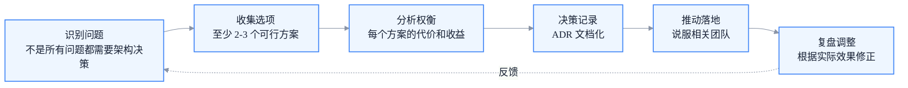

# 技术影响力构建：从代码贡献到技术领导力

> 副标题：四层影响力模型、代码/团队/组织/行业层面的构建路径、技术领导力本质与转型陷阱
>
> 目标读者：高级前端工程师寻求扩大影响、专家工程师构建组织级影响、技术专家思考是否走向技术管理
>
> 阅读时间：约 26 分钟

::: info 一句话
技术影响力的本质，是让你的能力产生的价值超过你亲自写的代码——从"自己做好"到"让系统更好"到"让组织更好"。
:::

## 目录

- [写在前面](#写在前面)
- [一、技术影响力的四层模型](#一、技术影响力的四层模型)
- [二、代码层面：高质量产出与开源贡献](#二、代码层面-高质量产出与开源贡献)
- [三、团队层面：技术规范、Code Review、知识沉淀](#三、团队层面-技术规范-code-review-知识沉淀)
- [四、组织层面：架构决策、跨团队协作、技术布道](#四、组织层面-架构决策-跨团队协作-技术布道)
- [五、行业层面：技术演讲、文章输出、开源项目](#五、行业层面-技术演讲-文章输出-开源项目)
- [六、技术领导力的本质](#六、技术领导力的本质)
- [七、从技术专家到技术管理者的转型陷阱](#七、从技术专家到技术管理者的转型陷阱)
- [结语：影响力是放大器，不是替代品](#结语-影响力是放大器-不是替代品)
- [FAQ](#faq)
- [来源](#来源)

## 写在前面

很多高级前端工程师在职业发展中会遇到一个困惑：

> 我的技术能力已经很强了，但为什么在团队中的影响力还是不够？为什么跨团队项目推不动？为什么我的技术方案总是被否决？

这个困惑的本质是：**把"技术能力"等同于"技术影响力"**。

技术能力是"自己能做什么"，技术影响力是"能让别人也做什么"。两者相关但不相等。一个人可以技术能力很强但影响力很弱（典型的"孤狼"型工程师），也可以技术能力中等但影响力很强（典型的"放大器"型工程师）。

::: info 一句话
技术影响力的本质，是让你的能力产生的价值超过你亲自写的代码。从"自己做好"到"让系统更好"到"让组织更好"。
:::

下图展示了技术影响力的四层模型，以及每一层对应的核心能力：

```mermaid
%%{init: {'theme': 'base', 'themeVariables': { 'fontFamily': 'Inter, PingFang SC, Microsoft YaHei, sans-serif', 'primaryColor': '#EEF6FF', 'primaryTextColor': '#172033', 'primaryBorderColor': '#6EA8FE', 'lineColor': '#8A94A6', 'secondaryColor': '#F7F9FC', 'tertiaryColor': '#FFF7E6'}}}%%
flowchart TB
    Core((技术影响力))

    subgraph L1[L1 代码层面]
        direction LR
        L1A[高质量产出]
        L1B[开源贡献]
        L1C[技术博客]
    end

    subgraph L2[L2 团队层面]
        direction LR
        L2A[技术规范]
        L2B[Code Review]
        L2C[知识沉淀]
        L2D[Mentorship]
    end

    subgraph L3[L3 组织层面]
        direction LR
        L3A[架构决策]
        L3B[跨团队协作]
        L3C[技术布道]
        L3D[技术战略]
    end

    subgraph L4[L4 行业层面]
        direction LR
        L4A[技术演讲]
        L4B[深度文章]
        L4C[开源项目]
        L4D[标准制定]
    end

    Core --> L1
    L1 --> L2
    L2 --> L3
    L3 --> L4

    classDef core fill:#172033,color:#fff,stroke:#172033,stroke-width:2px;
    classDef l1 fill:#ECFDF3,stroke:#22C55E,color:#172033,stroke-width:1.5px;
    classDef l2 fill:#EEF6FF,stroke:#3B82F6,color:#172033,stroke-width:1.5px;
    classDef l3 fill:#FFF7E6,stroke:#F59E0B,color:#172033,stroke-width:1.5px;
    classDef l4 fill:#F5E8FF,stroke:#A855F7,color:#172033,stroke-width:1.5px;

    class Core core;
    class L1,L1A,L1B,L1C l1;
    class L2,L2A,L2B,L2C,L2D l2;
    class L3,L3A,L3B,L3C,L3D l3;
    class L4,L4A,L4B,L4C,L4D l4;
```



本文会逐层展开，最后讨论技术领导力的本质和从技术专家到技术管理者的转型陷阱。

---

## 一、技术影响力的四层模型

技术影响力可以拆成四个层次，每一层的影响范围、核心能力、衡量标准都不同：

| 层次 | 影响范围 | 核心能力 | 衡量标准 |
| --- | --- | --- | --- |
| L1 代码层面 | 个人 / 小团队 | 高质量产出 | 代码质量、Bug 率、复用度 |
| L2 团队层面 | 整个团队 | 规范制定、知识沉淀 | 团队效率、代码质量、人才成长 |
| L3 组织层面 | 多个团队 | 架构决策、跨团队推动 | 跨团队项目结果、组织级指标 |
| L4 行业层面 | 整个行业 | 思想输出、生态建设 | 行业认知度、开源项目影响 |

四层之间是递进关系，但不是"必须做完 L1 才能做 L2"。实际上，多数高级工程师在 L1-L2 之间切换，专家在 L2-L3 之间切换，架构师在 L3-L4 之间切换。

四层模型的核心价值是：**让你识别自己当前的影响力主要在哪一层，以及下一层突破需要补什么**。

::: tip 本节核心结论

技术影响力是分层的。识别自己当前在哪一层、下一层需要什么能力，是规划影响力建设的前提。
:::

---

## 二、代码层面：高质量产出与开源贡献

L1 是影响力的基础。如果你的代码质量不行，再会沟通、再会布道，也难以获得技术信任。

### 1. 高质量代码产出

高质量代码的核心特征：

- **可读性**：别人接手你的代码，能在 1 小时内理解主要逻辑
- **可维护性**：需求变更时，改动局部化，不会牵一发动全身
- **可测试性**：核心逻辑有测试覆盖，重构时不会破坏功能
- **健壮性**：边界 case、异常情况都有处理

举一个具体的例子。同样是写一个用户列表组件：

```typescript
// 低质量版本：能跑但难维护
function UserList() {
  const [users, setUsers] = useState([])
  const [loading, setLoading] = useState(false)
  
  useEffect(() => {
    setLoading(true)
    fetch('/api/users').then(res => res.json()).then(data => {
      setUsers(data)
      setLoading(false)
    })
  }, [])
  
  if (loading) return <div>loading...</div>
  return (
    <div>
      {users.map(u => <div key={u.id}>{u.name}</div>)}
    </div>
  )
}
```

```typescript
// 高质量版本：可维护、可测试、健壮
interface User {
  id: string
  name: string
}

interface UserListProps {
  onError?: (error: Error) => void
}

type UserListState =
  | { status: 'idle' }
  | { status: 'loading' }
  | { status: 'success'; users: User[] }
  | { status: 'error'; error: Error }

function UserList({ onError }: UserListProps) {
  const [state, setState] = useState<UserListState>({ status: 'idle' })

  useEffect(() => {
    const controller = new AbortController()
    
    setState({ status: 'loading' })
    fetchUsers(controller.signal)
      .then(users => setState({ status: 'success', users }))
      .catch(error => {
        if (error.name !== 'AbortError') {
          setState({ status: 'error', error })
          onError?.(error)
        }
      })
    
    return () => controller.abort()
  }, [onError])

  switch (state.status) {
    case 'idle':
    case 'loading':
      return <Skeleton />
    case 'error':
      return <ErrorFallback message={state.error.message} />
    case 'success':
      return (
        <List>
          {state.users.map(user => (
            <UserItem key={user.id} user={user} />
          ))}
        </List>
      )
  }
}
```

差异不在"会用更多 API"，而在三个层面的提升：

- **状态机思维**：显式建模状态，避免"loading + error"组合态
- **资源管理**：用 AbortController 处理竞态和清理
- **关注点分离**：数据获取、UI 渲染、错误处理各自独立

### 2. 开源贡献

开源贡献是 L1 影响力的放大器。它的价值不只是"代码被合并"，而在于：

- **可信度建设**：公开可验证的技术能力
- **协作能力证明**：在陌生团队中推动事情的能力
- **技术视野拓展**：接触不同场景和最佳实践

开源贡献不一定要"维护一个 star 数过万的项目"。从低门槛到高门槛的路径：

1. **修文档 / 修小 bug**：很多热门项目都有 `good first issue` 标签
2. **修功能 bug**：理解项目代码后，修复具体问题
3. **新增功能**：在理解设计原则基础上，扩展能力
4. **维护子模块**：负责某个模块的 review 和演进
5. **维护自己的项目**：从工具库到框架

很多工程师对开源贡献有"门槛焦虑"，觉得"我水平不够，没法贡献"。但实际上，开源项目最缺的不是"会写大功能的人"，而是"愿意做脏活累活的人"——修文档、补测试、复现 issue、参与讨论。这些贡献看似小，但是建立信任的基础。

::: tip 本节核心结论

L1 影响力的基础是高质量代码产出。开源贡献是放大器，从低门槛任务开始建立信任，逐步承担更大责任。
:::

::: warning 常见误区

把"会写复杂代码"等同于"高质量代码"。复杂的代码往往意味着设计不清晰，高质量的代码通常是简洁的——因为抽象到位。
:::

---

## 三、团队层面：技术规范、Code Review、知识沉淀

L2 影响力的核心是**让你的能力复制到整个团队**。

### 1. 技术规范制定

技术规范的本质，是把"个人最佳实践"沉淀为"团队标准"。一个好的规范应该具备：

- **可执行**：能通过工具自动检查（ESLint、TypeScript、CommitLint）
- **有理由**：每条规则都有"为什么"，而不是"我觉得"
- **可演进**：随着团队和业务发展可以更新

举一个具体的例子。前端代码规范如果只是"我们用 ESLint"，价值有限。一个真正有用的规范应该包括：

- **目录结构规范**：为什么这样划分模块、组件放哪里、工具函数放哪里
- **状态管理规范**：什么场景用 Context、什么场景用 Zustand、什么场景需要 Redux
- **接口调用规范**：错误处理统一怎么做、loading 状态怎么管理、缓存策略是什么
- **测试规范**：哪些代码必须有测试、测试覆盖率门槛、E2E 测试范围
- **提交规范**：Commit Message 格式、PR 大小限制、Review 流程

制定规范的关键不是"列规则"，而是"解释为什么 + 提供工具支持"。一条没有工具支持的规则，最终会被遗忘。

### 2. Code Review 文化建设

Code Review 是 L2 影响力最直接的体现。一个高效的 Code Review 文化包括：

#### Review 的层次

低质量 Review 只看语法：

```text
- 这里少了一个分号
- 这个变量名拼错了
- 这个 import 没用到
```

高质量 Review 看设计：

```text
- 这个组件承担了太多职责，建议拆分成 3 个
- 这个状态管理方案在 X 场景下会有问题，因为 Y
- 这个错误处理不够健壮，如果接口超时会怎样？
- 这个抽象可能过度了，当前只有 1 个使用场景
```

#### Review 的态度

Code Review 不是"挑错"，而是"协作改进"。三个原则：

- **对事不对人**：评论针对代码，不针对作者
- **解释为什么**：不只是说"这样不好"，而是说"这样在 X 场景下会有 Y 问题"
- **给出建议**：不只是指出问题，而是提供改进方向

#### Review 的尺度

Review 不是"什么都管"。关键问题：

- 会影响线上稳定性的：必须严格
- 会影响可维护性的：建议改进
- 个人风格偏好：可以提，但不强求

### 3. 知识沉淀

知识沉淀是把"团队隐性知识"转化为"显性可复用资产"。

隐性知识的典型例子：

- "这个接口要特殊处理，因为后端有 bug"——只有经手过的人知道
- "这个组件不能改，因为某个老业务依赖"——只有维护过的人知道
- "这个性能问题不能用 X 方案解决，因为 Y"——只有踩过坑的人知道

显性化的方法：

- **技术文档**：每个核心模块有设计文档，每个关键决策有 ADR（Architecture Decision Record）
- **故障复盘**：线上事故有 postmortem，记录根因、影响、改进措施
- **Onboarding 文档**：新人加入团队时，能通过文档快速了解系统全貌
- **内部技术博客**：团队成员的深度技术分享沉淀下来

### 4. Mentorship

Mentorship 是 L2 影响力的最高形式——**通过培养他人来放大自己的影响**。

Mentorship 的关键不是"教技术"，而是"帮 mentee 成长"。具体做法：

- **定期 1:1**：每周或每两周一次，聊成长而非进度
- **挑战性任务分配**：给 mentee 比当前能力稍难的任务，并提供安全网
- **复盘反馈**：在关键事件后给出具体反馈，不只说"做得好"或"做得不好"
- **职业规划**：帮 mentee 看清楚下一步成长方向

::: tip 本节核心结论

L2 影响力的核心是"让你的能力复制到整个团队"。技术规范、Code Review、知识沉淀、Mentorship 是四个关键手段。从"自己做好"升级到"让团队更好"。
:::

---

## 四、组织层面：架构决策、跨团队协作、技术布道

L3 影响力的核心是**让多个团队朝同一个方向走**。

### 1. 架构决策

架构决策的本质，是"在多个不确定维度上做权衡，并说服其他人跟随"。

一个有效的架构决策过程：



#### 识别问题

不是所有问题都需要架构决策。需要架构决策的问题特征：

- 影响多个团队
- 难以回退（决策后改起来成本高）
- 没有明显最优解（多个方案各有优劣）

举例：是否引入微前端、是否统一状态管理库、是否自研组件库——这些是需要架构决策的问题。而"用 React 还是 Vue"通常不是——除非整个组织需要统一。

#### 收集选项

至少要列出 2-3 个可行方案，包括"不做什么"这个选项。只列 1 个方案的"决策"实际上是"说服"。

#### 分析权衡

每个方案的代价和收益要从多个维度评估：

- **技术维度**：性能、可维护性、可扩展性
- **组织维度**：学习成本、招聘成本、团队接受度
- **业务维度**：开发效率、迭代速度、风险
- **时间维度**：短期成本 vs 长期收益

#### 决策记录

用 ADR（Architecture Decision Record）记录决策：

```markdown
# ADR-001: 使用 Vite 替换 Webpack 作为构建工具

## 状态
已采纳

## 背景
- 团队当前使用 Webpack 5，构建时间在大型项目上超过 60s
- 新项目接入频繁，启动时间影响开发体验
- 团队对 Vite 有兴趣但缺乏生产环境验证

## 决策
新项目默认使用 Vite，老项目保持 Webpack 不主动迁移

## 替代方案
1. 全部迁移到 Vite：风险高，老项目改造成本大
2. 继续 Webpack + 优化：收益有限，无法解决根本问题
3. 探索 Turbopack：成熟度不足，不建议生产使用

## 后果
- 优点：新项目开发体验提升，HMR 速度从秒级到毫秒级
- 缺点：需要维护两套构建体系，工具链复杂度增加
- 风险：Vite 在大型项目上的稳定性需要持续观察
```

ADR 的价值不在于"记录决策"，而在于"让未来的工程师能理解决策当时的上下文"。

### 2. 跨团队协作

跨团队协作是 L3 影响力最直接的考验。一个跨团队项目能否推动，往往不是技术问题，而是利益问题。

跨团队协作的关键原则：

#### 识别利益相关方

在项目启动前，列出所有利益相关方：

- 谁是受益者？（这个项目对谁有好处）
- 谁是承担者？（谁需要付出工作）
- 谁是决策者？（谁能拍板）
- 谁是潜在阻力？（谁可能反对）

#### 设计共赢

好的跨团队项目是"所有参与方都能受益"。如果只有一方受益，推动会非常困难。

举个例子。你要推动"全公司前端统一监控平台"。

- 你的团队：受益（平台能力建设）
- 业务团队：需要接入，短期是负担
- 运维团队：受益（统一可观测性）
- 测试团队：受益（线上问题可追踪）

业务团队是潜在阻力。解决方案：

- 接入成本最小化（一行 SDK 引入）
- 给业务团队带来即时价值（比如免费的性能报告）
- 高层背书（让业务负责人认可价值）

#### 沟通策略

跨团队沟通不能用"讲技术"的方式。要针对不同角色用不同语言：

- 对业务负责人：讲业务价值（效率提升多少、风险降低多少）
- 对技术负责人：讲技术价值（架构更清晰、维护成本更低）
- 对一线工程师：讲操作价值（接入多简单、能解决什么具体问题）

### 3. 技术布道

技术布道是 L3 影响力的放大器。它的本质是"让好的技术实践被更多人采用"。

技术布道的形式：

- **内部技术分享**：定期分享团队的最佳实践
- **跨团队技术大会**：组织公司级的技术交流活动
- **技术 Newsletter**：定期推送有价值的技术内容
- **培训课程**：系统性地培训团队新技术

技术布道的关键不是"讲新技术"，而是"讲清楚什么场景该用、什么场景不该用"。一个只会说"这个技术很好"的布道者，最终会让团队陷入"盲目跟风"。

::: tip 本节核心结论

L3 影响力的核心是"让多个团队朝同一方向走"。架构决策、跨团队协作、技术布道是关键手段。从"让团队更好"升级到"让组织更好"。
:::

---

## 五、行业层面：技术演讲、文章输出、开源项目

L4 影响力的核心是**让你的思考影响整个行业**。

L4 不是必须的——很多优秀的架构师终其职业生涯都在 L3 层面。但如果有意愿和能力建设 L4 影响力，可以参考以下路径。

### 1. 技术演讲

技术演讲是 L4 影响力最直接的形式。一个好的技术演讲应该具备：

- **有洞察**：不是"我会用什么技术"，而是"我发现了什么规律"
- **有体系**：不是零散技巧，而是系统化思考
- **有案例**：不是空泛理论，而是真实工程实践
- **有争议**：敢于表达不同观点，引发讨论

技术演讲的常见问题：

- **过度自嘲**：用"我菜"来博取好感，反而降低专业度
- **过度营销**：把演讲变成产品广告，听众反感
- **过度细节**：陷入代码细节，失去主线
- **过度抽象**：全是"道"没有"术"，听众无法落地

### 2. 深度文章

深度文章是 L4 影响力的基础。和演讲相比，文章的优势是：

- 可索引：搜索引擎可以找到，长期价值高
- 可深度：可以展开复杂论证，演讲时间有限
- 可迭代：根据反馈持续修订

深度文章的写作原则：

- **先有洞察，再写文章**：不要为了写而写
- **结构清晰**：让读者能快速定位感兴趣的部分
- **证据充分**：论点要有数据或案例支撑
- **承认局限**：诚实说明方案的适用场景和局限

### 3. 开源项目

L4 的开源项目和 L1 的开源贡献不同。L4 是"维护有影响力的项目"，而 L1 是"给项目贡献代码"。

维护一个开源项目的关键能力：

- **愿景清晰**：项目要解决什么问题、不解决什么问题
- **设计原则**：项目的设计哲学是什么，避免功能无限膨胀
- **社区建设**：吸引贡献者、处理 issue、回应 PR
- **可持续性**：避免 burnout，建立维护者团队

很多优秀的开源项目最终死掉，不是因为技术不行，而是维护者 burnout。所以"可持续性"是 L4 开源项目最被低估的能力。

### 4. 标准制定

最高级别的 L4 影响力是参与行业标准制定：

- W3C 标准提案
- ECMA 提案
- 行业技术规范

这是极少数人能达到的层级，但作为方向可以了解。

::: tip 本节核心结论

L4 影响力是可选的，不是必须的。如果有意愿建设，技术演讲、深度文章、开源项目是主要路径。核心是"输出有洞察的思考"，而不是"营销自己"。
:::

---

## 六、技术领导力的本质

技术领导力经常被误解为"技术最强的人当领导"。这是错误的。

::: info 一句话
技术领导力的本质，不是"自己做得最好"，而是"让团队做到最好"。
:::

### 1. 技术领导力 vs 技术能力

技术能力是"自己能解决问题"，技术领导力是"能让团队解决更多问题"。

两者的差异：

| 维度 | 技术能力 | 技术领导力 |
| --- | --- | --- |
| 价值产出 | 自己写的代码 | 团队整体的产出 |
| 关注点 | 怎么实现 | 谁来实现、怎么协作 |
| 衡量标准 | 代码质量、技术深度 | 团队效能、人才成长 |
| 时间尺度 | 当前任务 | 长期演进 |

### 2. 技术领导力的三个层次

#### 层次 1：技术方向领导

定义团队的技术方向：

- 团队应该用什么技术栈
- 系统应该怎么演进
- 哪些技术债需要优先还

#### 层次 2：技术决策领导

在关键决策点拍板：

- 多个方案各有优劣时，选择哪个
- 业务压力和技术原则冲突时，如何平衡
- 出现分歧时，如何统一方向

#### 层次 3：技术人才领导

培养团队的技术能力：

- 识别每个工程师的能力短板
- 设计有挑战性的任务分配
- 提供 mentorship 和反馈
- 帮助团队成员成长

很多技术专家升到技术领导后，只做层次 1 和层次 2，忽略层次 3。结果团队对他个人的依赖越来越强，他越忙，团队越弱——这就是典型的"技术领导陷阱"。

### 3. 技术领导力的核心原则

#### 原则 1：让团队不需要你

好的技术领导，最终目标是让自己变得"不必要"——团队能在你不在的情况下依然做出正确决策。

这意味着：

- 不要成为单点决策瓶颈
- 把决策权下放给最了解情况的人
- 培养团队自己的判断力

#### 原则 2：在关键问题上有判断

放权不等于没有判断。在关键问题（如架构方向、关键技术选型、人才任用）上，技术领导必须有清晰判断，否则团队会陷入"无方向"。

#### 原则 3：为团队的错误负责

团队犯错时，技术领导要承担起责任，而不是甩锅给执行者。这是建立信任的基础。

::: tip 本节核心结论

技术领导力的本质是"让团队做到最好"，不是"自己做得最好"。三个层次：方向领导、决策领导、人才领导。核心原则是"让团队不需要你"。
:::

---

## 七、从技术专家到技术管理者的转型陷阱

很多技术专家在 L3/L4 阶段会面临一个选择：继续走技术专家路线，还是转向技术管理？

如果选择转向技术管理，会有一系列转型陷阱。

### 陷阱 1：用"技术最强"代替"管理"

很多新晋技术管理者仍然把"自己技术最强"作为核心价值。表现：

- 关键技术问题自己上，不让团队尝试
- Code Review 时过度干预实现细节
- 团队讨论时很快给出"标准答案"，扼杀讨论

**问题**：团队对你的依赖越来越强，你的时间越来越不够用，团队成长停滞。

**突破**：把"自己解决问题"切换为"指导团队解决问题"。哪怕团队第一遍做得不够好，也要让他们试。

### 陷阱 2：失去技术敏感度

有些技术管理者升上去后，忙于会议、汇报、组织事务，技术敏感度快速下降。

**问题**：失去技术判断力后，无法在关键决策上提供价值，最终变成"传话筒"。

**突破**：

- 保留至少 20% 时间做技术深度工作
- 持续参与 Code Review（不一定要写代码，但要看代码）
- 定期和一线工程师 1:1，了解真实问题
- 保留一个自己持续跟进的技术领域

### 陷阱 3：用"流程"代替"信任"

新晋管理者容易陷入"建立流程"的执念：定周报、定周会、定 OKR、定 KPI。

**问题**：流程过多会让团队失去主动性，所有人都在"完成流程"，而不是"拿结果"。

**突破**：流程是工具，不是目的。建立流程前先问"这个流程解决什么问题"，如果说不清楚，就不要建。

### 陷阱 4：避免冲突

很多技术管理者不愿意做困难的决定：

- 不愿意给低绩效员工负面反馈
- 不愿意否定明显不合理的需求
- 不愿意处理团队内的冲突

**问题**：避免短期冲突，会带来长期更大的问题——团队失去方向感、低绩效员工拖累整体、合理需求被业务方持续挤压。

**突破**：把"避免冲突"切换为"建设性冲突"。直接但尊重地表达意见，比绕圈子更高效，也更被团队尊重。

### 陷阱 5：把"向上汇报"当作核心工作

有些技术管理者把大部分精力放在"让上级满意"上，写精美的 PPT、做漂亮的汇报。

**问题**：团队会觉得你"只会说不会做"，丧失对你的信任。

**突破**：向上汇报是必要的，但不是核心。核心是"让团队拿结果"。如果团队结果好，汇报自然有素材；如果团队结果差，再漂亮的汇报也撑不住。

### 陷阱 6：忘记自己曾是工程师

有些技术管理者转型后，开始用"管理者视角"看问题，对工程师的处境缺乏共情。

**问题**：工程师会觉得你"变了"，不再代表他们。

**突破**：记住自己当工程师时的感受——被不合理需求压迫的痛苦、被模糊 PRD 折磨的痛苦、被线上事故惊醒的痛苦。这种共情是做好技术管理的基础。

::: tip 本节核心结论

从技术专家到技术管理者的转型有六大陷阱。核心原则是：技术管理者仍然是技术人，只是工作对象从"代码"扩展到"团队 + 系统"。
:::

::: warning 常见误区

认为"做管理就是放弃技术"。优秀的技术管理者仍然保持技术敏感度，只是不再亲自写所有代码。完全脱离技术的"管理"，最终会失去技术团队的信任。
:::

---

## 结语：影响力是放大器，不是替代品

回到开头：技术能力和技术影响力是什么关系？

**技术能力是基础，技术影响力是放大器**。

没有技术能力的影响力是空中楼阁——你可以说得头头是道，但无法落地。
没有影响力的技术能力是孤狼——你能解决问题，但解决不了系统问题。

四层影响力模型（代码 / 团队 / 组织 / 行业）不是"必须爬到顶层"，而是给你一个地图：

- L1 是基础，无论如何都要扎实
- L2 是大多数高级工程师的目标
- L3 是专家和架构师的主战场
- L4 是可选的，看个人兴趣和机会

技术领导力不是"升职"的同义词。一个 L2 的工程师完全可以展现技术领导力——通过 Code Review 帮助同事成长、通过技术规范提升团队效率、通过 Mentorship 培养新人。这些都是技术领导力的体现。

最终，技术影响力的衡量标准不是"你的 title 是什么"，而是"如果没有你，团队会变成什么样"。

::: info 一句话
技术影响力是放大器——它让你的能力产生的价值超过你亲自写的代码。从"自己做好"到"让系统更好"到"让组织更好"，是技术人成长的本质路径。
:::

---

## FAQ

### 1. 我是一个 L2 工程师，想开始建设 L2 影响力，从哪里入手？

从 Code Review 开始最容易。主动承担 Code Review 工作，从"挑语法错"升级到"看设计问题"。同时可以选一个小领域（比如团队内部的工具函数库）做规范化和文档化。Mentorship 可以从"带新人"开始，不需要正式的 mentor 关系，平时多帮助新人解决问题就是 mentorship 的雏形。

### 2. 跨团队项目推不动，是技术问题还是沟通问题？

90% 是沟通问题。先检查：(1) 是否识别了所有利益相关方？(2) 是否设计了共赢方案？(3) 是否用了对方能接受的方式沟通？(4) 是否有高层背书？如果这四个问题都没解决，再强的技术方案也推不动。建议在每次跨团队项目启动前，先做一份"利益相关方分析"，把每个团队的诉求、顾虑、收益列清楚。

### 3. 开源贡献真的对职业发展有帮助吗？

有帮助，但有前提。前提是：(1) 贡献是真实的，不是刷 PR 数量；(2) 贡献和你的成长方向相关，不是盲目参与；(3) 能从贡献中提炼出洞察，而不是"我贡献了 N 个 PR"。开源贡献的最大价值不是"履历加分"，而是"协作能力证明 + 技术视野拓展"。如果你能在面试中讲清楚"我在贡献某个项目时学到了什么"，价值远大于"我给 N 个项目贡献过代码"。

### 4. 技术领导力一定要做管理才能体现吗？

不需要。技术领导力可以在 IC（Individual Contributor）路线上充分体现。一个高级 IC 可以通过：(1) 技术方向建议影响团队决策；(2) Code Review 和 Mentorship 帮助团队成长；(3) 跨团队技术项目推动组织改进。这些都是技术领导力的体现。是否做管理，取决于你更喜欢"通过自己影响"还是"通过团队影响"——两者都可以达到很高的影响力。

### 5. 从技术专家转管理后，感觉自己越来越"虚"，怎么办？

这是非常常见的感受。三个建议：(1) 保留技术深度工作时间，每周至少 1 天不安排会议，做技术预研或 Code Review；(2) 找一个自己持续跟进的技术领域，不让它完全脱节；(3) 定期和一线工程师 1:1，听他们讲真实的技术问题。如果做完这些仍然觉得"虚"，可能需要反思是否真的适合管理路线——IC 路线同样是合理的长期选择。

---

## 来源

本文基于行业实践和作者经验总结。四层影响力模型参考了多家科技公司工程师影响力建设的常见路径，技术领导力部分参考了多个技术管理者的转型经验。
