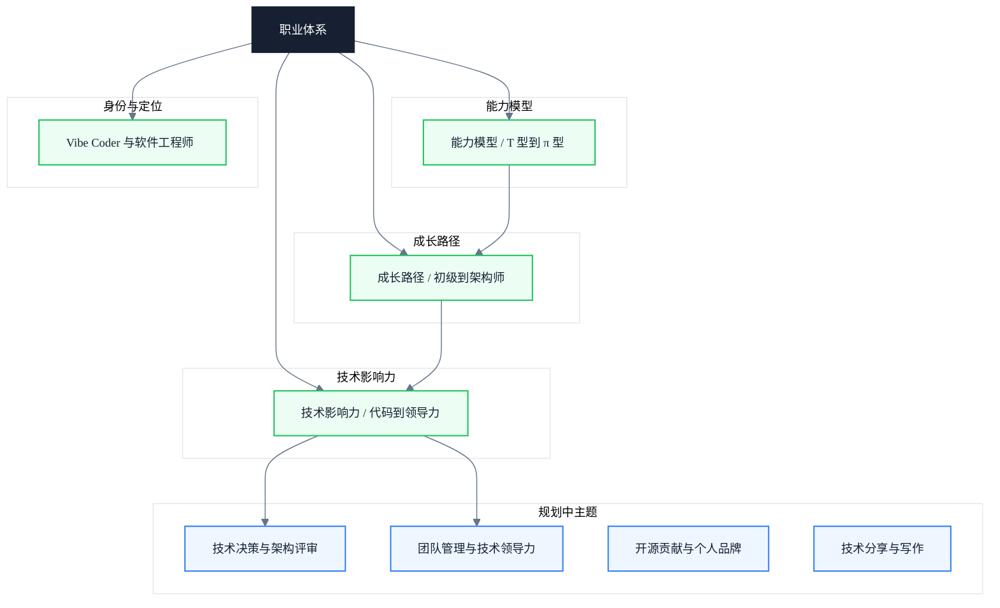

# 职业体系

> 副标题：从能力模型到技术影响力，构建可量化的成长路径而非空泛建议

---

## 模块定位

前端工程师的成长不是"多写几年代码就能自动升级"，而是需要主动构建能力模型、规划技术路径、积累技术影响力。本模块不提供"多读源码、多刷题"这类空泛建议，而是拆解为可量化的能力维度、可执行的成长阶梯、可观察的影响力信号。

能力模型回答"我现在在哪、还差什么"，成长路径回答"下一级需要什么能力、如何跨越瓶颈"，技术影响力回答"我的工作如何被组织看见、如何放大杠杆"。三者构成一条从自我评估到外部产出的闭环，再辅以身份认同这一底层校准，避免成长方向被短期风向带偏。

无论是刚入行的初级工程师，还是希望突破到架构师的中高级工程师，都能在本模块找到对应的进阶框架。

---

## 知识地图

---

## 核心主题

- **能力模型** ✓ 已收录 — T 型 vs π 型人才、技术深度与广度的量化维度、能力雷达图
- **成长路径** ✓ 已收录 — 初级 → 中级 → 高级 → 资深 → 架构师的关键跃迁点与瓶颈
- **技术影响力** ✓ 已收录 — 代码贡献、技术分享、开源参与、技术决策、团队赋能的层层递进
- **身份与定位** ✓ 已收录 — Vibe Coder 与软件工程师的本质差异、工程师身份认同
- **技术决策与架构评审** ◯ 规划中 — 架构决策记录（ADR）、技术评审机制与权衡方法
- **团队管理与技术领导力** ◯ 规划中 — 技术管理线、人员培养、绩效评估与团队效能
- **开源贡献与个人品牌** ◯ 规划中 — 开源策略、社区参与、技术写作与个人影响力
- **技术分享与写作** ◯ 规划中 — 技术表达、演讲结构、知识沉淀与传播

---

## 学习路径

1. **建立能力坐标系**：阅读《前端工程师能力模型》，完成自我能力雷达图，识别深度与广度的短板
2. **规划跃迁阶梯**：阅读《技术成长路径》，对照当前级别与目标级别的差距清单，找到关键瓶颈
3. **放大杠杆**：阅读《技术影响力构建》，识别自己所在的影响力层级，制定下一层级的产出计划
4. **校准身份**：阅读《Vibe Coder 与软件工程师》，反思工程师身份与长期价值取向
5. **按需扩展**：在技术决策、团队管理、开源贡献、技术分享等规划主题中选取与当前阶段最相关的方向深入

---

## 文章导览

- [前端工程师能力模型：从 T 型到 π 型人才的进阶框架](/career/capability-model) — 量化能力维度，避免"感觉自己什么都会一点"
- [技术成长路径：从初级到架构师的能力跃迁](/career/growth-path) — 每一级别的关键能力、典型瓶颈与突破方法
- [技术影响力构建：从代码贡献到技术领导力](/career/technical-influence) — 影响力的五个层级与可观察的信号
- [Vibe Coder 与软件工程师](/career/vibe-coder-vs-software-engineer) — 两种工程师身份的本质差异与长期价值取向

---

## 适用读者

- 初中级前端工程师，希望明确下一阶段的成长方向
- 高级 / 资深工程师，希望突破到架构师或技术负责人
- 技术管理者，需要建立团队的能力评估与培养体系
- 希望从"代码产出者"转向"技术影响者"的工程师

---

## 延伸资源

- [Staff Engineer](https://staffeng.com/) — Will Larson 的 Staff 工程师职业路径案例集
- [The Pragmatic Engineer](https://www.pragmaticengineer.com/) — Gergely Orosz 主持的工程师视角深度通讯
- 《The Software Engineer's Guidebook》by Gergely Orosz — 从初级到 Staff 的完整成长手册
- 《Staff Engineer: Leadership beyond the management track》by Will Larson — 管理线之外的技术领导力路径
