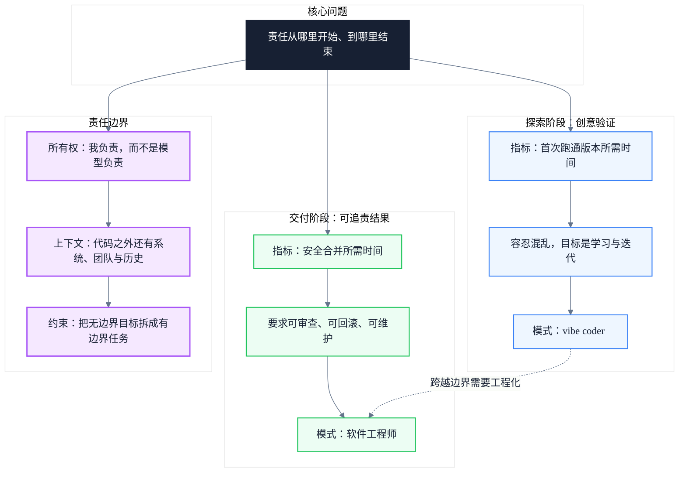

# Vibe Coder 与软件工程师：AI 时代的责任分界线

> 副标题：从 vibe coding 的现象出发，重新理解 AI 辅助开发中的责任、审查成本与交付纪律
>
> 目标读者：中高级软件工程师、技术负责人、正在引入 AI 辅助开发流程的团队管理者
>
> 阅读时间：约 15 分钟

::: info 一句话
区别不在工具，而在责任从哪里开始、到哪里结束。当主要产出是创意验证时，vibe coder 有用；当主要成本是责任归属时，就需要软件工程师。
:::

## 目录

- [一、错误的衡量指标](#一错误的衡量指标)
- [二、输出不等于进展](#二输出不等于进展)
- [三、AI 无法替你担责](#三AI无法替你担责)
- [四、上下文不只是文件](#四上下文不只是文件)
- [五、Vibe Coding 适合交付流程中的某些阶段但不适用于所有地方](#五Vibe-Coding-适合交付流程中的某些阶段但不适用于所有地方)
- [六、学徒问题](#六学徒问题)
- [七、区别](#七区别)
- [八、统一模型：探索与交付之间的责任边界](#八统一模型探索与交付之间的责任边界)
- [九、实践清单](#九实践清单)
- [结语：选择模式，而不是选择阵营](#结语选择模式而不是选择阵营)
- [FAQ](#FAQ)
- [来源](#来源)

## 一、错误的衡量指标

围绕 vibe coding 的很多讨论，衡量的仍然是错误的东西。人们展示的是自己从想法到应用用了多快。这当然有价值，尤其是在目标只是验证一个想法时。但在软件开发团队里，总得有人审查它。总得有人理解背后的意图。总得有人判断这个依赖是不是该放在这里。总得有人检查测试是否真的验证了行为。总得有人处理 schema 变更。总得有人在团队之间协调这次改动。总得有人回滚。总得有人写运行手册。总得有人回应告警。

这些都不属于任何人的玩具项目。因此，衡量 AI 生成工作应当换一个指标：**安全合并所需时间**。这包括可审查性、风险、测试质量、所有权、回滚能力，以及作者是否能解释这次变更中的关键决策。如果 AI 让代码生成更便宜，却让安全合并更昂贵，那团队获得的收益就没有自己以为的那么多。

vibe coder 衡量的是首次跑通版本所需时间；软件工程师衡量的是安全合并所需时间。当工作处于探索阶段时，首次跑通版本很有用；但当工作进入共享代码库时，安全合并所需时间就是必要指标。它包括审查成本、测试成本、发布成本、回滚成本、协调成本，以及未来的维护成本。

::: tip 本节核心结论
演示不是正确的终点。它能证明某样东西可以被展示出来，却不能证明它能被团队接纳。安全合并所需时间才是共享代码库中的真实成本。
:::

::: warning 常见误区
把“从提示词到可运行原型”的速度当作团队整体效率，会掩盖后续审查、修复和运维的隐性开销。
:::

---

## 二、输出不等于进展

AI 辅助编写的代码应该更好，而不是更多。如果工具让你能生成更多内容，那么人就必须更多地约束它。否则，你并没有省下工作量，只是把工作顺延到了下游，让维护变成别人的麻烦。AI 辅助代码不能适用不同的标准。它必须达到和手写代码一样的门槛。

所以它应该是收敛的。它应该只有一个存在理由。它不应该包含无关的清理。它不应该因为模型“顺手”就把半个文件重新格式化。它不应该在没有清晰解释的情况下新增一个包。

如果变更之所以很大，是因为模型生成得太多，那就拆分。模型很乐意为一个十行就能写完的东西生成一大堆样板代码。如果作者不能解释为什么每个有意义的文件都发生了变化，那就还没准备好。这就是基本的所有权意识。

第二个区别是工作的单位。vibe coder 把生成结果当作进展；软件工程师则把任何改动都视为责任单位。生成结果可以很大、很乱、也可以是临时的。但真正的变更管理不能这么随意。它必须足够聚焦，便于审查；足够可解释，值得信任；足够边界清晰，能够合并而不把半个系统一起拖下水。这就是速度要么变得有用、要么沦为审查债的地方。

::: tip 本节核心结论
AI 辅助代码的输出单位应该是“可合并的改动”，而不是“模型生成的内容”。进展的度量标准是变更的可解释性与可维护性。
:::

::: info 工程启示
在提交前对生成结果做一轮主动收缩：删除无关改动、拆分大变更、补全测试与说明，这是把生成内容转化为工程产出的最低门槛。
:::

---

## 三、AI 无法替你担责

审查生成代码和审查普通代码并不一样。当人写代码时，通常会有一条决策链。它可能有缺陷，但至少有一个人能解释这条路径。你可以问他为什么用了那个抽象，为什么把规则放在那里，为什么选这个包，为什么测试写成那样。

而对于 AI 生成的代码，其中一些所谓“决策”根本不是决策，只是补全。如果作者没有把生成结果转化为自己真正负责的成果，那么审查者实际上是在同时做两件事：审查与追溯作者意图。

所有权是第三个区别。vibe coder 可以说是模型生成的；软件工程师必须说，这是我负责的。这意味着，在请求审查之前，作者必须先把生成内容转化为一个工程决策。代码也许是从模型开始的，但责任不能停留在模型那里。

::: tip 本节核心结论
审查权不能替代所有权。模型可以提供起点，但只有工程师才能对设计决策、风险与后续维护负责。
:::

::: warning 常见误区
认为“我审查过了”就等于“我负责了”。审查是质量手段，责任归属才是工程身份的分界线。
:::

---

## 四、上下文不只是文件

现在，模型已经能读很多代码了。这并不意味着它理解系统。一部分上下文存在于代码里，但大量工程上下文存在于别处。它存在于事故中、旧迁移中、客户行为中、运维痛点中、团队惯例中、安全要求中、合规规则中，以及过去那些奇怪的决策里。

如果你不给它，这些上下文模型就没有。即便你给了，它携带这些上下文的方式也不像工程师那样。它是在自己的上下文窗口里运行。任务越大，模型越容易局部优化，却在全局上造成破坏。

所以，“直接让它把整个东西修好”既是个坏习惯，现阶段也确实不太管用。更好的方式是在让它写代码之前，先缩小决策空间。当要求更具体时，模型确实能做得更好。但更具体要求什么？要求作者自己真正明白到底在干什么。

经验丰富的工程师会从 AI 中获得最大价值，不是给模型更多自由，而是给它更少自由。自由适合周末折腾；生产环境需要约束。

这就是第四个区别。vibe coder 给模型一个目标，而软件工程师给模型一个有边界的任务。真正的工程性恰恰发生在这个有边界的任务里：用这个接口，不要碰这一层，等等。一个好的提示词在这里并不是魔法。它通常只是说明工程师已经理解了边界。

::: tip 本节核心结论
工程上下文分布在代码之外的系统、团队与历史之中。把大目标拆成有边界的任务，是让 AI 输出可用产出的关键约束。
:::

::: info 工程启示
在提示词中显式声明“不做什么”往往比“做什么”更能降低后续审查成本。
:::

---

## 五、Vibe Coding 适合交付流程中的某些阶段，但不适用于所有地方

Zig 的创建者 Andrew Kelley 在采访中提到，该项目禁止 AI 贡献，并把它们一概称为垃圾。维护者们看到的是大量 AI 生成的拉取请求，里面充满无关改动、损坏的遗留行为、奇怪的依赖新增，以及那些连自己提交的代码都解释不清的贡献者。

但他们描述的混乱，并不是对 AI 的判决；它只是 vibe coding 在越界时的产物。所以问题不在于禁止它，而在于把它放到合适的位置。

这就是第五个区别：**探索与交付**。同样一份会让维护者花掉一整个下午的拉取请求，在你做原型验证时却无伤大雅。没人会对那段一次性代码负责。探索可以容忍混乱，因为目标是学习，或者围绕一个想法快速迭代。交付则不能容忍无法解释的混乱，因为目标是一个真实的业务结果。你不能说我们有 99.9% 的正确率。有时候，它就是必须正确。这就是现实中的分界线。

这条线也在不断移动。随着工具在测试、回滚和审查方面变得更强，安全合并的部分成本会下降。但下降不等于消失。只要仍然需要有人对结果负责，就必须保有一定程度的纪律。把 vibe coding 用在出错代价低的地方，把工程纪律用在出错代价由客户、团队或业务承担的地方。

::: tip 本节核心结论
探索可以容忍混乱，因为目标是学习；交付不能容忍无法解释的混乱，因为目标是可追责的业务结果。
:::

::: warning 常见误区
把“它能跑”当成“它能交付”。演示级代码与生产级代码之间隔着审查、测试、回滚、运维与长期维护的成本。
:::

---

## 六、学徒问题

初级工程师一定会用 AI，而且他们也应该用。用得好时，它可以解释代码、比较方案、生成示例，并加速学习。但也有坏的一面。

如果初级工程师用 AI 来逃避理解系统，那么他们可能会交付更多，却学得更少。这是一笔糟糕的交易。工程生涯的头几年，正是人们建立心智模型的时候。他们需要在自己的大脑里建立这个模型，而不是从机器那里借来。

你不会靠一直站在系统外面、让模型替你修复问题来建立判断力。这也是管理者最难处理的部分之一。AI 可能会在短期内让初级工程师看起来更高产，却削弱了把他们培养成强工程师的学习闭环。Kelley 对 Zig 禁止 AI 的更深层原因也与此相关。他把代码审查称为“贡献者扑克”，也就是项目寻找值得成长为核心团队成员的人的方式。而 AI 提交会破坏这一点，因为贡献者并没有真正学习代码库，也没有吸收反馈。

这就是最后一点。工程需要一定程度的学徒制。vibe coding 会诱使你单打独斗；而人是在团队中工作和学习的。软件工程师通过与他人协作来提升技艺。工作不只是写代码，工作是判断，而不是产出。软件工程师要判断什么有风险、什么没风险。这种判断力来自与系统和人之间的接触。

::: tip 本节核心结论
AI 可以加速学习，也可以替代学习。初级工程师的成长依赖于与系统、代码库和团队反馈的接触，而不是持续依赖模型输出。
:::

::: info 工程启示
为 junior 工程师设置“先解释、后生成”的练习：在调用模型之前，先用自己的话描述问题、约束与预期改动。
:::

---

## 七、区别

当主要产出是创意验证时，vibe coder 是有用的。他们可以缩短想法到可点击原型之间的距离。很多想法都值得先这样处理，再决定是否值得投入真正的工程产能。

当主要成本是责任归属时，就需要软件工程师。他们控制什么进入系统、如何审查、如何保护、如何测试、如何运维，以及今后如何修改。这个区别是运营层面的，它也不是固定身份。同一个人应该在探索阶段进行 vibe coding，在交付阶段切换到工程模式。

关键技能在于知道自己当前处于哪种模式，并且不要让一种模式的习惯渗透到另一种模式里。vibe coding 可以帮助你更快学习；软件工程则能帮你避免为这份学习付出永远的代价。

::: tip 本节核心结论
vibe coder 与软件工程师不是两种人，而是两种模式。识别当前模式并遵守其纪律，是 AI 时代工程成熟度的核心标志。
:::

---

## 八、统一模型：探索与交付之间的责任边界

前文从衡量指标、工作单位、所有权、上下文边界、阶段适用性与学徒制六个角度展开了讨论。它们可以归并为一个统一模型：以“责任归属”为主轴，区分创意验证的探索阶段与可追责交付的工程阶段。

### 探索阶段

在探索阶段，主要产出是创意验证。vibe coding 可以快速把想法变成可点击、可讨论的原型。这个阶段的指标是首次跑通版本所需时间，允许一定程度的混乱，因为目标是学习与迭代。

### 交付阶段

在交付阶段，主要成本是责任归属。软件工程师需要确保变更可审查、可测试、可回滚、可运维。这个阶段的指标是安全合并所需时间，纪律要求高于速度要求。

### 责任边界

两个阶段之间的转换不是自动发生的。它依赖于三个要素：作者对产出承担所有权、理解代码之外的工程上下文、以及把大目标拆分为有边界的任务。只有当这些条件满足时，生成内容才能从探索阶段进入交付阶段。

::: tip 本节核心结论
统一模型的核心不是“人与工具的对立”，而是“责任边界的移动”。识别当前阶段、履行该阶段的纪律，是工程判断力的体现。
:::

---

## 九、实践清单

### 衡量指标

- [ ] 把“安全合并所需时间”纳入团队对 AI 辅助开发的效率评估
- [ ] 在展示原型速度的同时，同步估算后续审查、测试与回滚成本
- [ ] 拒绝将“首次跑通版本所需时间”作为共享代码库中的唯一效率指标

### 变更管理

- [ ] 每次提交前检查生成内容是否包含无关改动或自动格式化噪声
- [ ] 将过大的 AI 生成变更拆分为多个可独立审查的提交
- [ ] 确保每个被修改的文件都能用一句话说明变更理由

### 所有权与审查

- [ ] 在提交审查前，将模型输出转化为自己的工程决策并写入说明
- [ ] 审查 AI 生成代码时，重点关注设计意图与边界条件，而非仅检查语法
- [ ] 明确“审查通过”不等于“责任转移”，作者仍需对后续问题负责

### 上下文控制

- [ ] 在提示词中同时声明“做什么”和“不做什么”，缩小模型决策空间
- [ ] 对涉及历史决策、合规要求或运维约束的任务，主动补充代码之外的上下文
- [ ] 避免让模型直接处理“把整个系统修好”这类无边界任务

### 阶段划分

- [ ] 在项目开始时明确标注当前任务属于探索阶段还是交付阶段
- [ ] 探索阶段的产物进入共享代码库前，必须重新经历交付阶段的审查纪律
- [ ] 为出错代价低的场景保留 vibe coding 空间，为高代价场景强制工程纪律

### 团队成长

- [ ] 为初级工程师设置“先解释、后生成”的练习环节
- [ ] 在代码审查中保留反馈闭环，避免 AI 提交绕过学习过程
- [ ] 定期复盘 AI 生成代码在长期维护中的表现，调整使用策略

---

## 结语：选择模式，而不是选择阵营

AI 不是另一种编程语言，也不是另一个框架。它改变的是软件开发的经济学：生成代码的成本在下降，但审查、理解、维护和担责的成本并没有同比例消失。于是，真正的问题从“能不能写出来”变成了“谁对它负责”。

vibe coder 与软件工程师之间的区别，因此不是身份标签，而是工作模式的选择。探索阶段需要速度、容忍混乱、以学习为目标；交付阶段需要纪律、可解释性与可追责的结果。同一个人完全可以在上午做 vibe coding，下午切换为工程模式。成熟的标志，是清楚自己处于哪种模式，并遵守该模式的规则。

工具会继续变强，边界会继续移动，但责任归属这条线不会消失。

> **区别不在工具，而在责任从哪里开始、到哪里结束。当主要产出是创意验证时，vibe coder 有用；当主要成本是责任归属时，就需要软件工程师。**

---

## FAQ

### 1. Vibe coding 是不是不专业的开发方式？

不是。它是一种适合创意验证和快速学习的模式。问题在于把它用在需要可追责交付的场景中，却不附加工程纪律。专业性的体现在于知道什么时候该用哪种模式。

### 2. 如果 AI 生成的代码通过了所有测试，是不是就可以安全合并？

测试通过只是合并条件之一。还需要审查者理解设计意图、确认边界条件、评估依赖变更、检查回滚能力，并明确作者愿意为后续问题负责。测试覆盖的是已知行为，而工程责任覆盖的是未知风险。

### 3. 初级工程师应该如何使用 AI 才能不影响成长？

把 AI 当作解释和比较方案的工具，而不是绕过理解的捷径。建议在生成代码之前先自己描述问题、约束和预期改动；在生成之后手动走读并解释每一行。管理者应保留代码审查中的反馈闭环。

### 4. 团队应该怎样划定 vibe coding 与工程交付的边界？

可以从“出错代价”出发：只在个人或隔离环境中允许无约束的 vibe coding；进入共享代码库、用户环境或生产路径之前，必须经历可审查、可测试、可回滚的工程流程。阶段划分应在任务开始时明确。

### 5. 如果同一个人既要探索又要交付，如何避免习惯混淆？

使用明确的切换信号：为探索任务设置独立分支或目录，标注其“原型”属性；在转向交付前强制做一次变更清理，包括删除无关文件、补充测试、撰写说明。关键是不要让探索阶段的临时性产物默认进入交付流程。

---

## 来源

1. Yusuf Aytaş. *Vibe Coder vs Software Engineer*：[https://yusufaytas.com/vibe-coder-vs-software-engineer](https://yusufaytas.com/vibe-coder-vs-software-engineer)
2. Yusuf Aytaş. *The Invisible Difference*：[https://yusufaytas.com/the-invisible-difference](https://yusufaytas.com/the-invisible-difference)
3. Yusuf Aytaş. *Managers Have Been Vibe Coding All Along*：[https://yusufaytas.com/managers-have-been-vibe-coding-all-along](https://yusufaytas.com/managers-have-been-vibe-coding-all-along)
