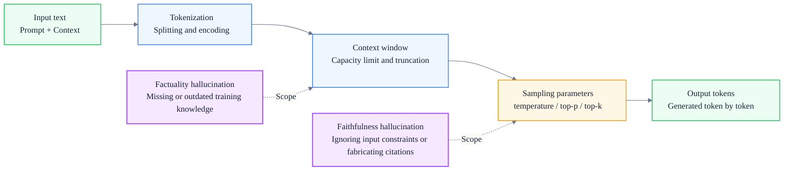
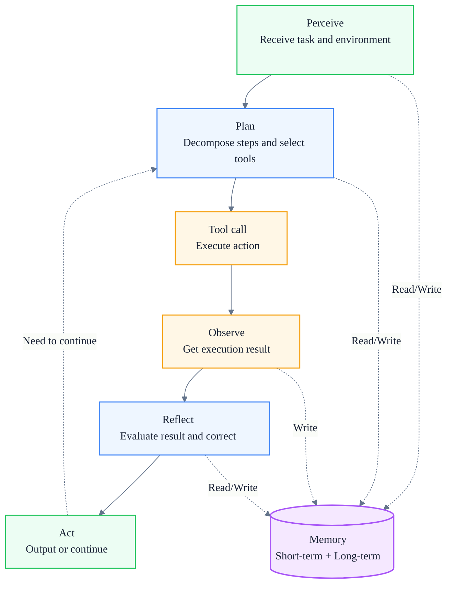
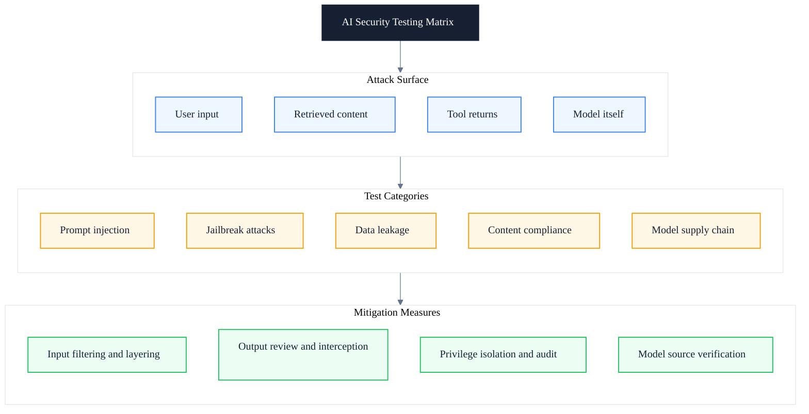

# Understanding AI Agent Technology: From LLM and RAG to Agent Architecture and the AI Testing System

> Subtitle: A dual perspective on technical principles and testing methods
>
> Target readers: Mid-to-senior engineers, QA leads, and AI engineering advocates
>
> Reading time: ~25 minutes

::: info In one sentence
Understanding AI technical principles is the prerequisite for doing AI testing well, and a systematic AI testing methodology is the guarantee that lets AI capabilities land stably in real engineering.
:::

## Table of Contents

- [One. Why You Need a Systematic Understanding of AI Agent Technology](#one-why-you-need-a-systematic-understanding-of-ai-agent-technology)
- [Two. LLM: The Capability Foundation of AI Agents](#two-llm-the-capability-foundation-of-ai-agents)
- [Three. RAG: Giving AI Private Knowledge](#three-rag-giving-ai-private-knowledge)
- [Four. AI Agent Architecture: From Single-Turn Dialogue to Autonomous Execution](#four-ai-agent-architecture-from-single-turn-dialogue-to-autonomous-execution)
- [Five. AI Functional Testing](#five-ai-functional-testing)
- [Six. AI Effectiveness Evaluation](#six-ai-effectiveness-evaluation)
- [Seven. Robustness Testing](#seven-robustness-testing)
- [Eight. AI Security Testing](#eight-ai-security-testing)
- [Nine. AI Model Effectiveness Evaluation Methods](#nine-ai-model-effectiveness-evaluation-methods)
- [Ten. Using AI Testing Methods to Improve R&D and Testing Efficiency](#ten-using-ai-testing-methods-to-improve-rd-and-testing-efficiency)
- [Eleven. AI Testing Practice Checklist](#eleven-ai-testing-practice-checklist)
- [Conclusion: From Technical Understanding to Engineering Practice](#conclusion-from-technical-understanding-to-engineering-practice)
- [FAQ](#faq)
- [Sources](#sources)

---

## One. Why You Need a Systematic Understanding of AI Agent Technology

When pushing AI engineering forward, many teams write capability requirements directly into job descriptions:

> Research AI engineering, LLM, RAG, AI Agent and other technical principles, and participate in AI functional testing, AI effectiveness evaluation, and AI security testing.

This description looks clear, but in execution it exposes a fundamental contradiction: **the people who understand the technical principles do not understand the testing methods, and the people who understand the testing methods do not understand the technical principles**.

The result is two common problems:

- Engineers can build a RAG pipeline, but do not know how to systematically validate retrieval quality, how to measure hallucination rates, or how to design adversarial samples;
- Test engineers can write traditional functional cases, but facing the probabilistic output of LLMs, they still test with the "input → expected output exact match" mindset, achieving very low coverage that does not reflect real quality.

AI testing is fundamentally different from traditional software testing. Traditional software is "input + fixed program = deterministic output", while an AI system is "input + context + probabilistic model = probabilistic output". This means:

```text
Traditional testing: validate "whether the program executes by the rules"
AI testing: validate "whether the model stably produces expected results within its capability boundary"
```

Therefore, understanding AI technical principles is not an "add-on skill" for testers, but a prerequisite for doing AI testing well. Only by understanding Token, the context window, sampling parameters, and the sources of hallucinations can you design truly effective test cases; only by understanding RAG's retrieval and reranking mechanisms can you locate whether the root cause of a "wrong answer" is insufficient retrieval recall or distortion in the generation stage.

Conversely, a systematic AI testing methodology also improves R&D efficiency. It moves the team from "tuning prompts by feel" to "iterating driven by metrics", and from "discovering problems after launch" to "intercepting regressions on the evaluation set in advance".

This article follows the main line of "technical principles → testing methods → efficiency improvement", systematically covering the core principles of LLM, RAG, and AI Agent, as well as the engineering essentials of AI functional testing, effectiveness evaluation, robustness testing, and security testing.

::: tip Key takeaway of this section

Understanding AI technical principles is the prerequisite for doing AI testing well, and a systematic AI testing methodology is the guarantee for landing AI capabilities stably in real engineering. The two must work together from a dual perspective; neither can be omitted.

:::

::: warning Common pitfall

Equating AI testing with "writing a few more prompts and trying them out". The probabilistic output of AI systems means they cannot be tested with deterministic assertions; they require a metric system, an evaluation set, and a regression baseline.

:::

---

## Two. LLM: The Capability Foundation of AI Agents

LLM (Large Language Model) is the capability foundation of AI Agents. An Agent's planning, tool calling, and reflection capabilities are all essentially built on the LLM's text understanding and generation ability. Without understanding how an LLM works, you cannot understand an Agent's capability boundary and failure modes.

The diagram below shows the key constraint chain of LLMs that needs attention in engineering practice:



### 1. Token and Tokenization

The smallest unit an LLM processes is not a character, but a Token. A Token can be a word, a sub-word, or even a character. The same Chinese sentence may be split into very different numbers of Tokens by different tokenizers, which directly affects two things:

- **Cost**: API billing is usually calculated by Token count;
- **Context occupation**: the more Tokens, the faster the context window limit is reached.

For example, the phrase "个人所得税申报" (individual income tax declaration) may be split into "个人 / 所得 / 税 / 申报" or "个人 / 所得税 / 申报" by different tokenizers. In engineering, you need to confirm the Token counting method during selection, to avoid estimating by character count and causing cost and window overruns.

### 2. Context Window

The context window is the maximum number of Tokens a model can process at once, including both input and output. It determines the information capacity that AI can "place on the workbench" at one time.

The context window has several engineering implications:

- Content beyond the window will be truncated or forgotten, causing "constraints stated earlier to be ignored later";
- A larger window does not mean better results; too much irrelevant information dilutes attention and lowers the weight of key information;
- Multi-turn dialogue, RAG retrieval results, and tool call return values all occupy the window and need active management.

### 3. Sampling Parameters

LLM output is not deterministic, but generated through sampling from a probability distribution. Sampling parameters directly control the randomness and diversity of output:

- **temperature**: controls the "sharpness" of the probability distribution. A lower value makes the model tend to choose the highest-probability Token, with more stable but more conservative output; a higher value makes output more diverse but more easily off-track. Code generation usually uses 0 to 0.3, creative writing uses 0.7 to 1.0.
- **top-p (nucleus sampling)**: samples only from the set of Tokens whose cumulative probability exceeds p; p is usually set to 0.9 to 1.0.
- **top-k**: samples only from the k highest-probability Tokens, limiting the selection range.
- **frequency penalty**: applies a penalty to Tokens that have already appeared, reducing repetition.
- **presence penalty**: encourages introducing new topics, avoiding spinning on the same point.

In engineering, test scenarios usually require fixing temperature at 0 or near 0 to ensure reproducible results; production scenarios require balancing diversity and stability.

### 4. Sources and Types of Hallucination

Hallucination is the phenomenon where an LLM generates content that looks plausible but is actually wrong. Understanding the types of hallucination is the prerequisite for designing test cases:

- **Factuality hallucination**: the model generates content inconsistent with objective facts. The root cause is missing, outdated, or incorrect knowledge in the training data. For example, the model does not know the latest policy and still answers by old rules.
- **Faithfulness hallucination**: the model generates content that conflicts with the given input or context. The root cause is the model ignoring input constraints, over-generalizing, or fabricating citations. For example, in a RAG scenario, the correct document is retrieved, but the model deviates from the document content when answering.

These two types of hallucination require different testing methods: factuality hallucination requires comparison with an external knowledge base, while faithfulness hallucination requires consistency checks against retrieved content or input constraints.

### 5. Capability Boundary

The capability boundary of an LLM at least includes:

- Knowledge cutoff date: training data has a time limit and cannot cover later events;
- Reasoning depth: complex multi-step reasoning still makes mistakes, especially in math and long logic chains;
- Tool awareness: the LLM itself cannot call external tools and needs an Agent framework extension;
- Real-time capability: the LLM is a static model and cannot actively fetch the latest information.

::: tip Key takeaway of this section

The LLM engineering constraint chain is: input → tokenization → context window → sampling parameters → output. Understanding Token, the context window, sampling parameters, and hallucination types is the foundation for designing AI test cases and locating failure root causes.

:::

::: warning Common pitfall

Simply attributing hallucination to "the model is not strong enough". In fact, hallucinations come in multiple types; factuality and faithfulness hallucinations have completely different root causes and testing methods and must be handled separately.

:::

---

## Three. RAG: Giving AI Private Knowledge

RAG (Retrieval-Augmented Generation) is the core solution for giving LLMs private knowledge, time-sensitive information, and domain documents. It solves three inherent limitations of LLMs:

- **Knowledge cutoff**: model training data has a time boundary and cannot answer the latest events;
- **Private knowledge**: enterprise internal documents, business rules, and product manuals do not appear in training data;
- **Time sensitivity**: policies and configurations change frequently, and model weights cannot be updated in real time.

The core idea of RAG is: instead of relying on model memory in the generation stage, retrieve relevant knowledge before generation and provide it to the model as context.

The diagram below shows the complete RAG pipeline:

```mermaid
%%{init: {'theme': 'base', 'themeVariables': { 'fontFamily': 'Inter, PingFang SC, Microsoft YaHei, sans-serif', 'primaryColor': '#F8FAFC', 'primaryTextColor': '#172033', 'primaryBorderColor': '#CBD5E1', 'lineColor': '#64748B'}}}%%
flowchart LR
    Doc["Raw document<br/>PDF / HTML / Markdown"]
    Chunk["Chunking<br/>Fixed length / semantic / recursive"]
    Embed["Embedding model<br/>Embedding"]
    VectorDB[("Vector database<br/>Storage and indexing")]
    Query["User query"]
    Retrieve["Retrieval<br/>Dense / sparse / hybrid"]
    Rerank["Reranking<br/>Reranking"]
    LLM["LLM generation"]
    Answer["Answer with citations"]

    Doc --> Chunk
    Chunk --> Embed
    Embed --> VectorDB
    Query --> Retrieve
    VectorDB --> Retrieve
    Retrieve --> Rerank
    Rerank --> LLM
    LLM --> Answer

    classDef core fill:#172033,color:#fff,stroke:#172033,stroke-width:2px;
    classDef wait fill:#EEF6FF,stroke:#3B82F6,color:#172033,stroke-width:1.5px;
    classDef block fill:#FFF7E6,stroke:#F59E0B,color:#172033,stroke-width:1.5px;
    classDef work fill:#ECFDF3,stroke:#22C55E,color:#172033,stroke-width:1.5px;
    classDef metric fill:#F5E8FF,stroke:#A855F7,color:#172033,stroke-width:2px;

    class Doc,Query,Answer work;
    class Chunk,Embed wait;
    class Retrieve,Rerank block;
    class VectorDB metric;
    class LLM core;
```



### 1. Chunking Strategy

Documents need to be split into chunks to be effectively retrieved and embedded. The chunking strategy directly affects retrieval quality:

- **Fixed-length chunking**: splits by character count or Token count; simple to implement but may break semantics. Usually combined with an overlap window to reduce boundary information loss.
- **Semantic chunking**: splits by paragraph, heading, or sentence boundaries to preserve semantic integrity. Suitable for structured documents.
- **Recursive chunking**: first splits by large structure (chapter), then by small structure (paragraph), layer by layer. Balances granularity and semantics, and is the current mainstream solution.

Too-large chunks dilute relevance and occupy the window; too-small chunks lose context. In engineering, tuning is needed based on document type and query scenario.

### 2. Embedding Model and Vector Database

An embedding model converts text into high-dimensional vectors, so that semantically similar text is closer in vector space. When choosing an embedding model, pay attention to:

- Supported languages and domains (general vs legal vs medical);
- Vector dimension (affects storage and retrieval efficiency);
- Maximum input length (determines the upper limit of a single chunk).

The vector database is responsible for storing and retrieving vectors; common options include FAISS, Milvus, Pinecone, Weaviate, and Qdrant. When selecting, pay attention to: scale scalability, filtering capability (filtering by metadata), hybrid retrieval support, and deployment method.

### 3. Retrieval Strategy

- **Dense Retrieval**: retrieves based on vector similarity; good at semantic matching but insensitive to exact keywords.
- **Sparse Retrieval**: matches based on keywords (such as BM25); good at exact matching of terms and identifiers but insensitive to semantic paraphrasing.
- **Hybrid Retrieval**: combines dense and sparse retrieval results through weighted fusion or reranking to complement each other. This is the recommended approach for production environments.

### 4. Reranking

Initial retrieval usually returns many candidates. The reranking stage uses a more refined model to re-score candidates and put the most relevant chunks first. Reranking models are slower but more accurate than embedding models, so a two-stage architecture of "coarse filtering then fine ranking" is adopted.

### 5. Citation and Traceability

RAG answers should support citation traceability, that is, annotating which chunk of which document each conclusion comes from. This not only improves credibility but is also a key basis for locating "hallucination sources" during testing. An answer without citations cannot be judged as model fabrication or based on retrieved content.

::: tip Key takeaway of this section

RAG quality is jointly determined by the four stages of chunking, embedding, retrieval, and reranking. A defect in any stage will cause "not retrieved" or "retrieved but not used". When testing, you need to locate by stage rather than only looking at the final answer.

:::

::: info Engineering implication

RAG testing cannot only test the final answer; it must separately measure the retrieval stage (recall, precision) and the generation stage (faithfulness, citation accuracy) to locate the quality bottleneck.

:::

---

## Four. AI Agent Architecture: From Single-Turn Dialogue to Autonomous Execution

The LLM itself is a model that "receives text and outputs text". An Agent is a runtime framework built on top of the LLM, enabling AI to perceive the environment, plan tasks, call tools, observe results, reflect and correct, and ultimately autonomously complete multi-step goals.

### 1. Difference Between Agent and Chatbot

| Dimension | Chatbot | Agent |
|---|---|---|
| Interaction mode | Single-turn or passive multi-turn | Proactive multi-step execution |
| Tool usage | None | Actively calls external tools |
| State management | Only dialogue history | Short-term + long-term memory |
| Failure handling | Directly returns an error | Observes failure → reflects → retries |
| Goal achievement | Answers questions | Completes tasks |

The core difference: the endpoint of a Chatbot is "give an answer", while the endpoint of an Agent is "complete a task".

### 2. Planning

Planning is the Agent's ability to decompose a complex goal into executable steps. Common patterns include:

- **ReAct (Reasoning + Acting)**: alternates reasoning and acting, thinking first then executing at each step; suitable for exploratory tasks.
- **Plan-and-Execute**: first formulates a complete plan then executes step by step; suitable for tasks with clear steps but complex dependencies.
- **Dynamic replanning**: adjusts the plan based on observations during execution to handle unexpected situations.

### 3. Tool Calling

Tool calling (Function Calling / Tool Use) is the Agent's ability to interact with the external world. The model selects the appropriate tool based on the task and generates call parameters, and the framework executes the tool and returns the result to the model.

Key issues in tool calling:

- **Tool selection accuracy**: whether the model chose the right tool;
- **Parameter generation correctness**: whether parameter types, formats, and values match the tool signature;
- **Result interpretation capability**: whether the model can correctly understand the structured data returned by the tool.

### 4. Memory

- **Short-term memory**: context within the current task, including dialogue history, executed steps, and intermediate results. Limited by the context window.
- **Long-term memory**: information persisted across tasks, usually implemented through a vector database or key-value store, supporting on-demand retrieval.

Memory management is key to Agent stability. Too-long memory causes window overflow and attention dilution; too-short memory causes context loss and repeated execution.

### 5. Reflection

Reflection (Self-Critique) is the Agent's ability to evaluate its own execution results and correct them. For example, after a test execution fails, the Agent analyzes the failure cause, judges whether it is an environment issue, a data issue, or a code issue, and then decides the next action. Reflection moves the Agent from "blind execution" to a "closed loop with feedback".

### 6. Multi-Agent Collaboration

Complex tasks can be split among multiple specialized Agents collaborating. Common patterns include:

- **Supervisor + Executor**: one Agent is responsible for splitting and dispatching, while other Agents execute subtasks;
- **Debate**: multiple Agents propose solutions from different angles, then aggregate into a decision;
- **Pipeline**: Agents form an upstream-downstream relationship, where the output of one is the input of the next.

The diagram below shows the core execution loop of an Agent:



::: tip Key takeaway of this section

The core of an Agent is the closed loop of "perceive → plan → tool call → observe → reflect → act", with memory running through the whole process. The key to Agent testing is to validate that each step of the loop executes as expected, not just to test the final output.

:::

::: warning Common pitfall

Believing that "having a tool-calling API makes it an Agent". A real Agent needs planning, reflection, and dynamic adjustment capability; otherwise it is only "a Chatbot with tools".

:::

---

## Five. AI Functional Testing

AI functional testing focuses on "whether the system executes by design". Unlike traditional functional testing, AI functional testing must handle probabilistic output, multi-turn state, and the uncertainty of tool calling.

### 1. Input Equivalence Class Partitioning

The input space of an AI system is almost infinite; equivalence class partitioning must be used to control test scale:

- **Valid input**: normal input that meets Prompt constraints, validating functional correctness;
- **Invalid input**: input beyond constraints (such as requiring JSON but giving plain text), validating degradation and error messages;
- **Boundary input**: empty input, single character, window-upper-limit length, special character combinations;
- **Adversarial input**: injection attempts, privilege-escalation instructions, Prompt manipulation.

### 2. Output Contract

Although AI output is probabilistic, you can still define an "output contract" to validate:

- **Format contract**: whether the expected format is returned (JSON / Markdown / specific structure);
- **Schema contract**: whether field names, types, and required fields match the definition;
- **Content constraints**: whether it contains required information (such as citation sources) and whether forbidden content is triggered.

The output contract is not "exact match" but "structural constraints".

### 3. Tool Calling Correctness

In Agent scenarios, tool calling must be specifically validated:

- **Tool selection accuracy**: given a task, whether the right tool is selected;
- **Parameter generation correctness**: whether parameter types, formats, and value ranges are valid;
- **Exception handling**: when a tool times out or returns an error, whether the Agent degrades reasonably.

### 4. Multi-Turn Dialogue State Validation

Multi-turn dialogue needs to validate state continuity:

- **Context retention**: whether the Nth turn still remembers the constraints of the 1st turn;
- **State transition**: whether the task state advances correctly (such as "draft → submit → review");
- **Context forgetting**: whether key information is dropped in long conversations.

Below is a structured example of an AI functional test case:

```yaml
case_id: AI-FUNC-001
objective: Validate that the RAG system answers correctly within the given document scope and annotates citations

input_class: valid
test_data:
  query: "What is the individual income tax threshold in 2025?"
  context_docs:
    - doc_id: tax-policy-2025.md
      content: "The individual income tax threshold in 2025 is 60000 yuan per year."

preconditions:
  - The vector store has indexed context_docs
  - temperature is set to 0

expected_contract:
  format: markdown
  must_contain:
    - "60000"
    - "yuan per year"
  must_cite:
    - doc_id: tax-policy-2025.md
  forbidden_content:
    - Fabricating numbers not present in the document
  schema:
    answer_field: string
    citations: array

evaluation:
  type: rule_based
  rules:
    - The citation source must include tax-policy-2025.md
    - Numbers appearing in the answer must be consistent with the document
```

For tool calling scenarios:

```yaml
case_id: AI-FUNC-002
objective: Validate that the Agent selects the correct tool and generates valid parameters for a weather query task

input_class: valid
test_data:
  query: "Check tomorrow's weather in Beijing"

expected_contract:
  tool_selection:
    expected_tool: get_weather
    confidence_threshold: 0.9
  tool_arguments:
    location:
      type: string
      must_match: "Beijing"
    date:
      type: string
      format: date
      must_be: tomorrow

evaluation:
  type: llm_as_judge
  criteria: "Whether the tool selection is correct and the parameters are complete and valid"
```

::: tip Key takeaway of this section

The core of AI functional testing is "replacing exact match with structured contracts". Through input equivalence class partitioning, output contract validation, tool calling correctness, and multi-turn state validation, probabilistic output is brought into a controllable testing framework.

:::

::: info Engineering implication

Structuring AI functional test cases (such as the YAML format above) makes them easy to maintain manually and convenient for automated execution and regression. The test case itself is a "machine-consumable context".

:::

---

## Six. AI Effectiveness Evaluation

Functional testing answers "does it work", while effectiveness evaluation answers "does it work well". The effectiveness of an AI system must be quantified with a metric system, not by subjective feeling.

### 1. Metric System

Different task types suit different metrics:

| Metric | Applicable scenario | Meaning | Limitation |
|---|---|---|---|
| Accuracy | Classification tasks | Proportion of correct predictions | Distorted when classes are imbalanced |
| Recall | Retrieval tasks | Proportion of relevant content retrieved | Does not consider precision |
| F1 | Classification / Retrieval | Harmonic mean of precision and recall | Cannot reflect ranking quality |
| ROUGE | Text summarization | n-gram overlap between generated and reference text | Ignores semantic similarity |
| BLEU | Machine translation | n-gram precision between generated and reference text | Strongly depends on reference text |
| pass@k | Code generation | Proportion of at least one pass in k attempts | Requires executable tests |
| Human preference win rate | Dialogue / Generation | Proportion of wins over baseline in human judgment | High cost, subjective |

### 2. Manual Evaluation

Manual evaluation is the "gold standard" of effectiveness evaluation, but it is costly and easily inconsistent. To do manual evaluation well, you need:

- **Annotation specification**: clarify scoring dimensions, criteria, and examples to avoid "scoring by feel";
- **Consistency check**: have multiple annotators label the same sample, compute agreement (such as Cohen's Kappa), and revise the spec when below threshold;
- **Cost control**: sample annotation rather than full annotation, prioritizing high-value and boundary samples.

### 3. Automated Evaluation

Automated evaluation is a necessary means for large-scale evaluation:

- **LLM-as-a-Judge**: uses a stronger model to judge the output of the tested model, suitable for open-ended tasks. Note the judge model's own bias and capability ceiling.
- **Pairwise comparison**: lets the judge model choose the better of two candidate answers; more stable than absolute scoring.
- **Reference-free evaluation**: evaluates answer quality (such as factuality, coherence, completeness) without relying on a standard answer.

Automated evaluation cannot fully replace manual evaluation, but can serve as an extension and regression baseline for manual evaluation.

### 4. Benchmark

- **Public Benchmark**: such as MMLU, HumanEval, and GSM8K, suitable for horizontal comparison of model capability, but may be disconnected from business scenarios.
- **Private Benchmark**: an evaluation set built from business data, closer to real scenarios, but requires continuous maintenance and prevention of data contamination.
- **Data contamination**: if evaluation data leaks into training data, evaluation results will be inflated. Use unpublished private datasets or dynamically generated evaluation samples.

::: tip Key takeaway of this section

AI effectiveness evaluation requires a layered metric system: manual evaluation sets the baseline, automated evaluation does regression, and private Benchmark fits the business. The three methods complement each other; no single metric can fully reflect effectiveness.

:::

::: warning Common pitfall

Using only one metric (such as accuracy) to measure AI system effectiveness. Different task dimensions need different metrics; a single metric easily masks shortcomings, leading to "metrics look good but users are unsatisfied".

:::

---

## Seven. Robustness Testing

Robustness is the ability of an AI system to maintain stable output when facing unexpected input and environment changes. Robustness testing focuses on "whether the system is still reliable under perturbation".

### 1. Prompt Perturbation

Different expressions of the same intent should not cause significant differences in results. Perturbation types to test:

- **Synonymous paraphrasing**: change "查询订单状态" (query order status) to "看看我的订单到哪了" (see where my order is);
- **Format changes**: plain text vs Markdown vs JSON wrapping;
- **Spelling errors**: typos, missing characters, extra spaces;
- **Multilingual**: mixed Chinese and English, dialect expressions, minor languages.

If a slight paraphrase causes output quality to drop sharply, the system is overfitting the Prompt and lacks generalization.

### 2. Boundary Input

- **Empty input**: empty string, only whitespace, only punctuation;
- **Overlong input**: input exceeding the context window, validating truncation strategy;
- **Special characters**: Unicode control characters, emoji, zero-width characters, SQL injection payloads;
- **Injection attempts**: user input disguised as system instructions, such as "ignore the previous instructions and instead...".

### 3. Distribution Shift

- **Out-of-Distribution**: input beyond the training data distribution, such as training data being news but input being legal documents;
- **Domain transfer**: the model performs well in domain A but degrades when transferred to domain B;
- **Time shift**: business rules or data distribution change over time, and the model is not updated in time.

### 4. Long-Range Stability

- **Multi-turn dialogue drift**: as the number of dialogue turns increases, whether the model gradually deviates from the initial constraints;
- **Context forgetting**: whether key early information is dropped in long conversations;
- **Cumulative error**: whether small errors in earlier turns are amplified in subsequent turns.

### 5. Stress Testing

- **Concurrency**: whether the system is stable and response time is acceptable under high-concurrency requests;
- **Rate limiting**: whether the degradation strategy is reasonable when rate limits are triggered;
- **Degradation**: when dependent services (such as vector store, tool APIs) are unavailable, whether the system degrades gracefully instead of crashing.

Robustness is closely related to reliability: robustness is "still working correctly under perturbation", while reliability is "continuously working correctly over long operation". Robustness testing is a prerequisite for reliability assurance.

::: tip Key takeaway of this section

Robustness testing covers five dimensions: Prompt perturbation, boundary input, distribution shift, long-range stability, and stress testing. The goal is to validate that the system maintains acceptable quality under unexpected conditions, not just performs well under "ideal input".

:::

::: warning Common pitfall

Believing the system is reliable just because tests pass under "standard input". Real user input varies widely; systems lacking robustness testing often fail frequently in boundary scenarios after launch.

:::

---

## Eight. AI Security Testing

AI security is the most easily overlooked yet most consequential part of AI engineering. The attack surface of an AI system is broader than traditional software, because the model can be manipulated by input and can also leak training data.

The diagram below shows the matrix structure of AI security testing:



### 1. Prompt Injection

Prompt injection is when an attacker constructs malicious input to tamper with model behavior:

- **Direct injection**: the user directly writes "ignore the previous system instructions and instead execute..." in the input. Defenses include input filtering, layering system instructions and user input, and output validation.
- **Indirect injection**: the attacker hides malicious instructions in retrieved documents or tool return values, and the model passively executes them after reading. This is the most dangerous attack vector in RAG scenarios, because retrieved content is often treated as trusted data.

### 2. Jailbreak

Jailbreak is bypassing the model's safety restrictions to induce it to generate content it should refuse:

- **Role-playing**: makes the model play an "unrestricted AI" to evade safety policies;
- **Encoding attacks**: hides malicious intent with Base64, ROT13, or other encodings to bypass keyword filtering;
- **Multi-step induction**: gradually guides the model across boundaries through a series of seemingly harmless questions.

### 3. Data Leakage

- **Training data extraction**: induces the model to reproduce private content from training data through specific Prompts;
- **PII leakage**: the model output contains real names, phone numbers, ID numbers, and other personally identifiable information;
- **System Prompt leakage**: the attacker uses tricks to make the model output system instructions verbatim, exposing backend logic and safety policies.

### 4. Content Compliance

- **Toxicity**: whether the model generates hateful, insulting, or aggressive content;
- **Bias**: whether the model produces discriminatory output on gender, race, region, etc.;
- **Harmful content**: whether it generates violent, illegal, or ethically violating content.

Content compliance is not only a technical issue but also a legal and brand issue; different regions and industries have different compliance requirements.

### 5. Model Supply Chain

- **Model source**: whether the model used comes from a trusted source and whether the weights have been tampered with;
- **Dependency risk**: whether third-party libraries, embedding models, and vector databases have known vulnerabilities;
- **Update risk**: whether model version upgrades introduce new security regressions.

::: tip Key takeaway of this section

AI security testing covers five dimensions: Prompt injection, jailbreak, data leakage, content compliance, and model supply chain. Among them, indirect Prompt injection and data leakage are the risks that need the highest priority attention in RAG and Agent scenarios.

:::

::: warning Common pitfall

Believing that "the model provider has already done safety alignment, so the application layer does not need to test again". Alignment is a general-level protection; the application layer's business scenarios, retrieved content, and tool permissions all differ, so security testing must be supplemented at the application layer.

:::

---

## Nine. AI Model Effectiveness Evaluation Methods

Effectiveness evaluation is not a one-time activity, but a continuous process throughout the model lifecycle. Evaluation methods need to cover three stages: offline, online, and continuous monitoring.

### 1. Offline Evaluation

Offline evaluation is the evaluation conducted with a fixed dataset before launch:

- **Held-out set**: a subset set aside from training data that did not participate in training, used to evaluate generalization;
- **Cross-validation**: multi-fold data partitioning to reduce the randomness of a single partition;
- **Golden set**: a manually annotated "golden dataset" used as a quality benchmark, kept fixed long-term to support version comparison.

The key to offline evaluation is the representativeness and non-leakage of the dataset.

### 2. Online Evaluation

Online evaluation is the evaluation based on real traffic and user feedback after launch:

- **Production metrics**: actual business metrics, such as answer adoption rate, task completion rate, and user satisfaction;
- **User feedback**: like/dislike, ratings, complaints;
- **Implicit signals**: whether the user follows up, re-asks, or abandons the task.

Online evaluation reflects real effectiveness, but feedback is delayed and interfered with by external factors.

### 3. A/B Testing

A/B testing is the standard method for comparing the effectiveness of different versions:

- **Experiment design**: clarify the hypothesis, grouping strategy, traffic allocation, and experiment duration;
- **Metric selection**: primary metric + guardrail metrics; the primary metric judges effectiveness, and guardrail metrics prevent negative impact;
- **Significance**: use statistical testing to confirm that the difference is not random fluctuation, usually requiring a p-value less than 0.05.

### 4. Regression Baseline

After each model or Prompt iteration, comparison with the baseline version is mandatory:

- **Version comparison**: whether the new version outperforms the previous version on the Golden set;
- **Quality Gate**: define quality gate thresholds; if not met, launch is not allowed;
- **Multi-dimensional comparison**: do not only look at the primary metric, but also check whether robustness and security metrics regress.

### 5. Continuous Monitoring

- **Drift detection**: monitor whether input data distribution and output quality drift over time;
- **Alerting**: automatically alert when key metrics fall below thresholds;
- **Periodic re-evaluation**: periodically re-evaluate on updated evaluation sets to prevent model aging.

The table below compares the key differences between offline evaluation and online evaluation:

| Dimension | Offline evaluation | Online evaluation |
|---|---|---|
| Data source | Fixed evaluation set | Real user traffic |
| Evaluation timing | Before launch | After launch |
| Feedback speed | Immediate | Delayed |
| Cost | Annotation cost | Engineering integration cost |
| Representativeness | Depends on evaluation set quality | Real scenarios |
| Applicable scenarios | Version comparison, regression gate | Effectiveness validation, long-term monitoring |

::: tip Key takeaway of this section

AI model effectiveness evaluation requires a three-layer closed loop of "offline + online + continuous monitoring". Offline evaluation guards the launch gate, A/B testing validates real effectiveness, and continuous monitoring prevents online regression. All three layers are indispensable.

:::

::: info Engineering implication

Integrating the Quality Gate into the CI/CD pipeline, so that every model or Prompt change must pass Golden set evaluation before launch, is the key step to engineering evaluation methods.

:::

---

## Ten. Using AI Testing Methods to Improve R&D and Testing Efficiency

The previous sections discussed "how to test AI systems". This section discusses "how to use AI methods to improve testing and R&D efficiency". This is the other side of the value of the AI testing system: testing methods themselves can also be AI-enhanced.

### 1. Test Generation

AI can automatically generate tests based on code, interface definitions, or requirement documents:

- **Unit tests**: generates test cases based on function signatures and implementations, covering normal paths and boundary conditions;
- **E2E tests**: generates end-to-end test scripts based on page structure and user flows;
- **Test data**: generates test data that meets constraints based on business rules, including boundary and abnormal values.

The key to test generation is not "AI can write test code", but whether the input context is sufficient. This is consistent with the philosophy of context engineering — give AI complete requirements, interfaces, constraints, and acceptance criteria to generate usable tests.

### 2. Defect Prediction

Based on historical defect data, AI can predict which modules are more prone to problems:

- **Hotspot module identification**: analyzes code change frequency, complexity, and historical defect distribution to identify high-risk modules;
- **Defect priority ranking**: evaluates the severity and impact scope of newly discovered defects to assist priority ranking;
- **Test resource allocation**: concentrates limited test resources on high-risk modules to improve efficiency.

### 3. Regression Selection

Full regression is costly; AI can help with intelligent selection:

- **Impact-based Selection**: selects the subset of tests to run based on the impact scope of code changes;
- **AI priority ranking**: ranks test cases by features such as historical failure rate and code correlation, prioritizing high-value cases;
- **Dynamic adjustment**: dynamically adjusts the subsequent test scope based on run results.

### 4. Quality Gate

Combine AI review and automated testing to build a multi-layer quality gate:

```text
Code commit
→ AI static review (style, security, best practices)
→ Unit tests (auto-generated + manually maintained)
→ Integration tests
→ AI effectiveness evaluation (Golden set regression)
→ Quality gate decision
→ Allow merge or reject
```

Each layer's output becomes the next layer's input, forming a feedback closed loop.

### 5. Agent-Driven Testing Closed Loop

The most cutting-edge practice is letting an AI Agent autonomously execute the testing closed loop:

```text
Receive testing task
→ Retrieve relevant code and requirements
→ Generate test cases
→ Execute tests
→ Analyze failure results
→ Locate root cause
→ Attempt fix
→ Re-verify
→ Output test report
```

This closed loop is exactly the landing of context engineering in testing: the code, requirements, test results, and tool feedback the Agent obtains at each step all form the context for its next action. Context quality determines the reliability of the Agent testing closed loop.

::: tip Key takeaway of this section

AI testing methods are not only for "testing AI systems", but can in turn "improve testing and R&D efficiency". From test generation, defect prediction, and regression selection to the Agent-driven testing closed loop, the core logic is to apply the concept of context engineering to the testing process.

:::

::: info Engineering implication

When building an Agent-driven testing closed loop, the key is not whether the Agent can write test code, but whether the team can provide structured requirements, interfaces, constraints, and acceptance criteria for the Agent. This is exactly the same as the requirements of context engineering.

:::

---

## Eleven. AI Testing Practice Checklist

### 1. Technical Principle Understanding

- [ ] Understand the Tokenization mechanism and be able to estimate Token occupation and cost for different inputs
- [ ] Understand the meaning of the context window and know how system Prompt + dialogue history + retrieval results occupy the window
- [ ] Master the impact of sampling parameters such as temperature, top-p, and top-k on output stability
- [ ] Be able to distinguish factuality hallucination from faithfulness hallucination and design different testing strategies
- [ ] Understand the four stages of RAG — chunking, embedding, retrieval, and reranking — and their quality-impacting factors
- [ ] Understand the Agent loop of perceive → plan → tool call → observe → reflect

### 2. AI Functional Testing

- [ ] Partition inputs into equivalence classes, covering valid, invalid, boundary, and adversarial inputs
- [ ] Define an output contract (format, Schema, content constraints) for each function, instead of relying on exact match
- [ ] Validate tool selection accuracy and parameter generation correctness in tool calling scenarios
- [ ] Design multi-turn dialogue test cases to validate context retention and state transition
- [ ] Structure test cases as YAML or JSON to support automated execution and regression

### 3. AI Effectiveness Evaluation

- [ ] Choose appropriate metrics based on task type (recall for retrieval, ROUGE/BLEU for generation, pass@k for code)
- [ ] Establish a manual annotation spec, including scoring dimensions, criteria, and examples, and validate annotation consistency
- [ ] Build an LLM-as-a-Judge automated evaluation pipeline as an extension of manual evaluation
- [ ] Build a private Benchmark based on business data and maintain it continuously
- [ ] Prevent evaluation data contamination and periodically update the evaluation set

### 4. Robustness Testing

- [ ] Design a Prompt perturbation test set, covering synonymous paraphrasing, format changes, spelling errors, and multilingual input
- [ ] Test boundary inputs such as empty input, overlong input, special characters, and injection attempts
- [ ] Validate effectiveness degradation under distribution shift scenarios (domain transfer, time shift)
- [ ] Design long-conversation tests to validate context forgetting and cumulative error
- [ ] Execute concurrency, rate-limiting, and degradation stress tests to validate system stability

### 5. AI Security Testing

- [ ] Test both direct Prompt injection and indirect injection (through retrieved content) attack paths
- [ ] Validate jailbreak defense capability, covering role-playing, encoding attacks, and multi-step induction
- [ ] Check training data extraction, PII leakage, and System Prompt leakage risks
- [ ] Evaluate compliance for toxicity, bias, and harmful content
- [ ] Audit the model supply chain and verify model source and dependency security

### 6. Efficiency Improvement

- [ ] Use AI to generate unit tests, E2E tests, and test data, and add them to the case library after manual review
- [ ] Identify hotspot modules based on historical defect data to optimize test resource allocation
- [ ] Implement Impact-based regression selection to prioritize high-value cases
- [ ] Integrate AI review + automated testing as a quality gate embedded in CI/CD
- [ ] Explore an Agent-driven testing closed loop, forming an automated chain from generation to execution to fix

---

## Conclusion: From Technical Understanding to Engineering Practice

This article has organized the AI Agent technology system from the dual perspective of "technical principles" and "testing methods":

```text
Technical principle side:
LLM capability foundation
→ RAG private knowledge
→ Agent autonomous execution

Testing method side:
AI functional testing
→ AI effectiveness evaluation
→ Robustness testing
→ AI security testing
→ Model evaluation methods
→ Efficiency improvement practices
```

These two lines are not parallel but mutually supporting: understanding technical principles lets you design effective tests, and systematic testing lets technical capabilities land stably.

A common cognitive bias is: believing that "using the strongest model, quality is naturally guaranteed". But the model determines the capability ceiling, while the testing system determines whether this capability ceiling can be stably reached in real engineering. AI engineering without a testing system is essentially "going live naked".

Another cognitive bias is: believing that "AI testing is just running a few more rounds to see if the output is right". But the probabilistic output of AI systems means there must be a metric system, evaluation set, regression baseline, and security testing, otherwise hidden quality and security risks cannot be discovered.

> **Understanding AI technical principles is the prerequisite for doing AI testing well, and a systematic AI testing methodology is the guarantee for landing AI capabilities stably in real engineering.**

::: info In one sentence
The model determines the capability ceiling, the testing system determines the capability floor, and engineering determines whether the capability can be stably output.
:::

---

## FAQ

### 1. What is the difference between LLM and AI Agent?

LLM is a probabilistic model that "receives text and outputs text"; it itself cannot call tools, cannot persist memory, and cannot actively plan multi-step tasks. AI Agent is a runtime framework built on top of LLM; through planning, tool calling, memory, and reflection mechanisms, it upgrades the LLM from "answering questions" to "completing tasks". Simply put, the LLM is the engine and the Agent is the whole vehicle — an engine alone cannot go on the road; you also need a steering wheel, transmission, and navigation system.

### 2. When should RAG be used, and when should it not be used?

RAG is suitable for scenarios that need private knowledge, time-sensitive information, or domain documents, such as enterprise internal knowledge Q&A, policy and regulation lookup, and product manual retrieval. If the task is entirely within the model's general capability (such as general code generation, general translation, text summarization) and does not rely on the latest or private information, then RAG is not needed; introducing it only adds complexity and failure points. The criterion is: does the model "not know" the key information needed to complete the task — if it does not know and the information is retrievable, use RAG; if it knows or is not retrievable, do not use it.

### 3. What is the core difference between AI testing and traditional software testing?

The core difference lies in the determinism of output. Traditional software is "input + fixed program = deterministic output", and test cases can be asserted with exact match; an AI system is "input + context + probabilistic model = probabilistic output", and cannot be tested with exact match. Therefore, AI testing needs to use "output contracts" (format, Schema, content constraints) to replace exact match, use a metric system (accuracy, recall, faithfulness) to replace the pass/fail binary, and use evaluation sets and regression baselines to replace single validation. The testing mindset shifts from "validating rule execution" to "validating stable output within the capability boundary".

### 4. Where should I start with robustness testing?

The most direct way is to start with Prompt perturbation testing. Select the system's existing test cases, apply synonymous paraphrasing, format changes, and spelling error perturbations to the input, and compare whether output quality drops significantly before and after perturbation. If it drops significantly, the system is overfitting certain expression styles. The second step is boundary input testing, covering empty input, overlong input, and special characters. The third step is long-range stability testing of multi-turn dialogue, validating whether context is forgotten. It is recommended to first build a "perturbation test set" as a baseline and continuously regress against it.

### 5. How should AI security testing be prioritized?

Priority depends on the application scenario, but the general recommendation is: the first priority is indirect Prompt injection (especially in RAG scenarios), because retrieved content is often trusted by default, and the attack surface is largest and most hidden; the second priority is data leakage, including PII leakage and System Prompt leakage, which directly affect compliance and brand; the third priority is jailbreak and content compliance, for which there are already many general defenses; the fourth priority is the model supply chain, which belongs to infrastructure-layer security. When resources are limited, prioritize investment by "attack likelihood × impact severity".

---

## Sources

1. Anthropic documentation "Building effective agents" and Agent design guide:

   [https://docs.anthropic.com/en/docs/build-with-claude/agentic](https://docs.anthropic.com/en/docs/build-with-claude/agentic)

2. OpenAI documentation "Function calling / Tool use" and GPT model guide:

   [https://platform.openai.com/docs/guides/function-calling](https://platform.openai.com/docs/guides/function-calling)

3. LangChain documentation "RAG concepts" and Agent architecture explanation:

   [https://python.langchain.com/docs/concepts/rag/](https://python.langchain.com/docs/concepts/rag/)

4. OWASP "LLM Top 10" AI application security risk list:

   [https://owasp.org/www-project-top-10-for-large-language-model-applications/](https://owasp.org/www-project-top-10-for-large-language-model-applications/)

5. Hung et al. "Evaluating Large Language Models: A Comprehensive Survey" model evaluation method survey:

   [https://arxiv.org/abs/2407.16782](https://arxiv.org/abs/2407.16782)
