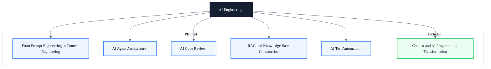

# AI Engineering

> Subtitle: From context engineering to AI programming transformation — build verifiable AI engineering capability, not prompt tricks

## Module Positioning

The core engineering capability in the AI era is no longer just "can you write code" but "can you provide the right context for AI, define bounded tasks, and verify results through tools." This module does not offer surface-level tips like "write better prompts." Instead, it decomposes into a six-layer context model, a three-layer AI programming transformation architecture, and executable quality gates.

What we focus on is not single-turn conversation tricks but capability building that is repeatable, team-collaborable, and engineering-measurable. From how an individual designs task packages, to how a team accumulates shared context assets, to how automated testing and review loops safeguard quality, this module covers the end-to-end engineering pipeline.

Whether you are an engineer just starting with AI-assisted programming or a technical lead looking to systematize team AI capabilities, you can find the corresponding engineering framework and practical levers in this module.

---

## Knowledge Map

---

## Core Topics

- ✓ **Context Engineering**: Six-layer context model (language / task / business / state / organization / constraint), from "writing prompts" to "building information environments."
- ✓ **AI Context Concepts**: Context window, short-term / long-term context, retrieval context, tool context — and their engineering application.
- ✓ **AI Programming Transformation**: Individual task package design, team shared context assets, verifiable engineering execution loop.
- ✓ **Quality and Risk**: Identification and remediation of four context quality problems — insufficient / overload / conflict / stale.
- ◯ **From Prompt Engineering to Context Engineering**: Move from single-point prompt tuning to systematic context governance.
- ◯ **AI Agent Architecture**: Multi-step planning, tool invocation, and state management.
- ◯ **AI Code Review**: A review loop combining automated rules and human collaboration.
- ◯ **RAG & Knowledge Base Construction**: Retrieval-augmented generation and private knowledge accumulation.
- ◯ **AI Test Automation**: Generation, execution, and regression verification.

---

## Learning Path

1. Read the included "Context" article to build a holistic understanding of the six-layer context model and AI programming transformation.
2. Map your own workflow and identify the weakest context layer you currently supply (language / task / business / state / organization / constraint).
3. Design personal task packages and upgrade "writing prompts" into "building information environments."
4. Accumulate shared context assets at the team level to establish a reusable engineering baseline.
5. Introduce automated testing and code review as quality gates to form a verifiable execution loop.
6. Expand horizontally across planned topics (Agent architecture, RAG, AI testing, etc.).

---

## Article Guide

- [Understanding Context in the AI Era and Its Role in AI Programming Transformation](/en/ai/understanding-context-in-ai-era) — Six-layer context model, core AI context concepts, three-layer transformation path, and automated testing application.

---

## Intended Readers

- Engineers using AI-assisted programming who want to improve the quality and maintainability of AI-generated code.
- Technical leads who need to establish AI programming standards and quality gates at the team level.
- QA / test engineers who need to bring AI-generated test scripts into a verifiable engineering loop.

---

## Extended Resources

- [Anthropic Claude Docs](https://docs.anthropic.com/claude/docs)
- [OpenAI Cookbook](https://github.com/openai/openai-cookbook)
- [LangChain Docs](https://python.langchain.com/docs/)
- Book: *AI Engineering: Building AI Systems That Work in Production*
