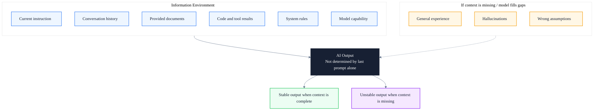
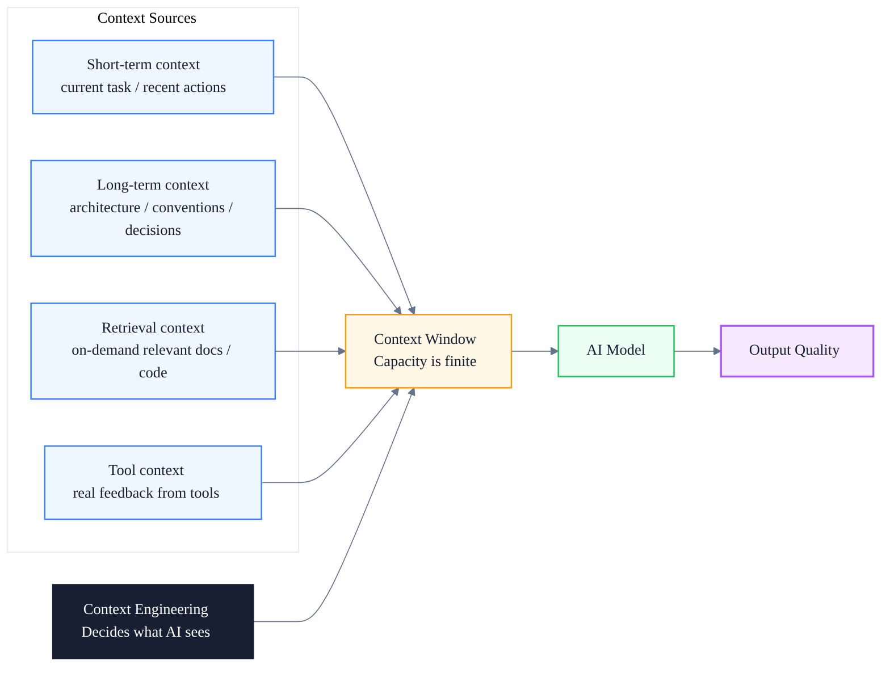
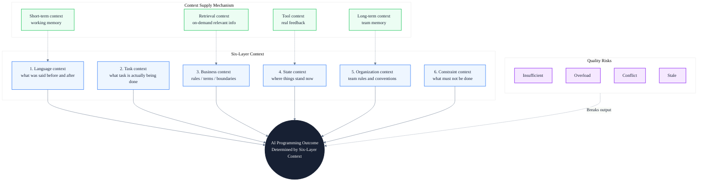

# Understanding Context in the AI Era and Its Role in AI Programming Transformation

> Subtitle: From daily language, six context dimensions, and core AI context concepts to a verifiable AI programming loop
>
> Target readers: Engineers, QA leads, and engineering managers driving AI programming transformation
>
> Reading time: ~20 minutes

::: info In one sentence
Code quality in AI programming increasingly depends not on "how to write prompts" but on "what context is provided to the AI."
:::

## Table of Contents

- [One. Understanding Context from Everyday Language](#one-understanding-context-from-everyday-language)
- [Two. The Six Dimensions of Context](#two-the-six-dimensions-of-context)
- [Three. How Context Changes in the AI Era](#three-how-context-changes-in-the-ai-era)
- [Four. Core Context Concepts in AI](#four-core-context-concepts-in-ai)
- [Five. Why Context Matters More Than Code Generation](#five-why-context-matters-more-than-code-generation)
- [Six. Four Types of Context Quality Problems](#six-four-types-of-context-quality-problems)
- [Seven. Three Layers of AI Programming Transformation](#seven-three-layers-of-ai-programming-transformation)
- [Eight. Concrete Application in Automated Testing](#eight-concrete-application-in-automated-testing)
- [Nine. Role Evolution and Capability Shift](#nine-role-evolution-and-capability-shift)
- [Ten. Unified Model: Six-Layer Context Framework](#ten-unified-model-six-layer-context-framework)
- [Eleven. AI Programming Practice Checklist](#eleven-ai-programming-practice-checklist)
- [Conclusion: Context Engineering Decides Whether AI Capability Lands in Real Projects](#conclusion-context-engineering-decides-whether-ai-capability-lands-in-real-projects)
- [FAQ](#faq)
- [Sources](#sources)

---

## One. Understanding Context from Everyday Language

"Context" sounds like a technical term, but it is actually a capability humans use every day.

Put simply:

> **Context is the background, relationships, state, and cause-and-effect chain required to understand the current information.**

The same sentence can mean completely different things in different contexts. In the AI era, context becomes even more important, because AI does not work only from your last instruction. It judges your real intent based on everything it can see, understand, and use at the current moment.

For AI programming, this can be summarized in one sentence:

> **Code quality increasingly depends less on "how to write the prompt" and more on "what context is provided to the AI."**

Suppose someone says:

> "Help me handle this issue."

This sentence itself carries almost no useful information. To understand it, you need to know at least:

- Who "me" is;
- Who "you" is;
- What "this issue" refers to;
- Where the issue occurred;
- What has already been tried;
- What outcome is expected;
- By when it must be done;
- What constraints apply.

If both sides just discussed a login failure, "this issue" might be the login failure. If both sides are reviewing a test report, "this issue" might be a blocking defect in the report.

So the real meaning of a sentence is usually not contained only in its literal text:

```text
Real meaning
= current expression
+ previous information
+ current environment
+ shared understanding
+ implicit rules
```

The "previous information, current environment, shared understanding, and implicit rules" here are context.

::: tip Key takeaway of this section

Context is not the literal text of an instruction. It is the combination of background, relationships, state, and implicit rules. The same instruction produces completely different outputs when the context changes.

:::

::: warning Common pitfall

Treating "context" as equivalent to "chat history." Chat history is only one slice of context; environment, shared understanding, and implicit rules are equally decisive.

:::

---

## Two. The Six Dimensions of Context

Many people equate context with chat history. That is incomplete. Broadly, context contains at least six dimensions.

### 1. Language Context

What was said before and after a sentence. For example:

> "It still doesn't work."

To understand "it," you must know whether the previous discussion was about an API, a script, a server, or a test environment.

### 2. Task Context

What task is actually being completed. For example, "check this code" means different things depending on the task:

- In code review: check maintainability;
- In incident response: find the root cause;
- In security audit: check for vulnerabilities;
- In test development: add testability and boundary cases.

Without knowing the task, "check the code" easily goes in the wrong direction.

### 3. Business Context

Code does not exist in isolation. It serves business rules. For example:

```typescript
// Example: tax calculation entry point
if (income > threshold) {
  calculateTax();
}
```

Just by reading the code, AI can check syntax and general logic, but it does not know:

- Whether `income` is monthly or annual;
- Which tax year `threshold` corresponds to;
- Whether individuals and companies are distinguished;
- How currency and precision are handled;
- Whether the boundary is "greater than" or "greater than or equal to";
- Whether exemption conditions exist.

All of these belong to business context. In rule-dense systems such as tax, finance, and government, **business context is often more important than code context**.

### 4. State Context

Describes "where things currently stand." For example:

- Which branch is in use;
- Which environment is running;
- Whether the user has logged in;
- What test data exists in the database;
- What the previous API returned;
- What state the current page is in;
- How many times a task has already been retried.

Automated testing depends heavily on state context. Suppose the test step is:

```text
Click the "Submit" button
```

That action alone is not enough. You also need to know:

```text
User has logged in
-> Has entered the declaration page
-> Has filled in required fields
-> Has uploaded attachments
-> The current record is in draft state
-> The "Submit" button is visible and enabled
```

These preconditions determine whether "click submit" is meaningful.

### 5. Organization Context

Includes shared rules formed within a team:

- Coding standards;
- Directory structure;
- Naming conventions;
- Branching strategy;
- Defect severity levels;
- Test priority;
- Definition of Done;
- Which frameworks are allowed;
- Which data must not enter AI;
- Who is responsible for approval and release.

A new employee who does not know these rules tends to write code that is "technically correct but unusable in the team." AI is the same.

### 6. Constraint Context

Tells the executor what cannot be done and what conditions the result must meet. For example:

- Must use Playwright;
- Must not modify production code;
- Must not access real customer data;
- Scripts must be compatible with the Linux CI agent;
- A single test case must not exceed five minutes;
- On failure, screenshots and network logs must be retained;
- Stability issues must not be solved with fixed waits.

Constraints are not extra information; they are part of the task definition.

::: tip Key takeaway of this section

Context has six dimensions: language, task, business, state, organization, and constraint. Missing any one of them is enough to make AI produce "technically plausible but actually wrong" results.

:::

::: info Engineering implication

When handing a task to AI, do not just paste code. Explicitly state the task type, business rules, current state, team rules, and hard constraints. This is the cheapest way to significantly improve output quality.

:::

---

## Three. How Context Changes in the AI Era

Traditional software generally runs on explicit inputs and rules:

```text
Input + Fixed Program = Output
```

Generative AI is more like:

```text
Current instruction
+ conversation history
+ provided documents
+ code and tool results
+ system rules
+ model's existing capability
= model's understanding of the current task
= output
```

So AI output is not determined by the last prompt alone. It is determined by the entire information environment the model can access at that moment.

You can think of AI as a very capable, fast-learning engineer who just joined the project:

- It knows general programming;
- It knows common frameworks;
- It can read code quickly;
- But it inherently does not know your company's business;
- It does not know internal abbreviations;
- It does not know historical design decisions;
- It does not know which APIs are already deprecated;
- It does not know the acceptance criteria you actually care about.

If you do not give it context, it fills the gaps with general experience. And that gap-filling process is the source of many errors and "hallucinations."



> **The problem with AI is often not that it cannot do the task, but that it does not know what you really want it to do.**

::: tip Key takeaway of this section

In the AI era, output is determined by the entire information environment, not by the last prompt. AI's "hallucinations" are usually the result of the model filling context gaps with general experience.

:::

::: warning Common pitfall

Believing that "a stronger model will naturally understand our project." Capability and context are different axes. A stronger model with poor context still produces confident but wrong answers.

:::

---

## Four. Core Context Concepts in AI

### 1. Context Window

The context window can be understood as the amount of information AI can "place on the workbench to read" at one time. The workbench may include:

- System instructions;
- Current conversation;
- Code files;
- Requirement documents;
- API definitions;
- Logs;
- Test results;
- Tool call results;
- Content previously generated by the AI itself.

A larger context window means the AI can read more material at once. But "large" does not mean "good."

If the workbench is piled with:

- Outdated documents;
- Duplicate code;
- Irrelevant logs;
- Conflicting requirements;
- Lots of unprioritized information;

the AI has more trouble finding the focus.

So what you should pursue is not:

> Give AI the most information.

But:

> Give AI the most relevant, accurate, and structured information needed to complete the current task.

### 2. Context Engineering

Prompt Engineering usually focuses on:

> How should this sentence be asked?

Context Engineering focuses on:

> For the AI to correctly complete the task, what information should it see?

The difference can be seen in three stages.

Low-context instruction:

```text
Help me generate login tests.
```

Optimized prompt:

```text
Please use Playwright and TypeScript to generate automated tests for the login page.
```

After context engineering, the task looks like this:

```text
Goal:
Generate automated tests for the individual user login feature of the Hong Kong tax filing system.

Tech stack:
- Playwright
- TypeScript
- Page Object Model
- Tests run in a Linux CI environment

Relevant materials:
- requirements/login.md
- openapi/auth.yaml
- pages/LoginPage.ts
- fixtures/users.ts
- tests/login/existing-login.spec.ts

Business rules:
- After 5 consecutive wrong passwords, the account is locked
- Lock duration is 30 minutes
- MFA is only enabled for specific roles
- Real taxpayer data must not be used in the test environment

Implementation constraints:
- Do not use waitForTimeout
- Prefer getByRole for locators
- Each test creates and cleans up its own data
- On failure, save screenshot / trace / API response

Acceptance criteria:
- Cover normal login / wrong password / account lock / MFA
- Pass npm run typecheck
- Pass npm run lint
- After generating code, run the smoke test for the login module
```

The last example is not just "more detailed writing." It builds an executable information environment.



### 3. Short-term Context

Short-term context is the information in the current session or current task, for example:

- Which file we are editing;
- What command was just run;
- What error appeared;
- Which solutions have already been tried;
- What approach the user just rejected.

It is equivalent to human working memory. In AI programming, short-term context lets the AI continuously complete:

```text
Read code
-> Modify code
-> Run tests
-> Read errors
-> Fix errors
-> Verify again
```

If context is lost mid-way, several problems may appear:

- Repeating already-failed solutions;
- Forgetting constraints confirmed earlier;
- Reverting already-fixed code;
- Handling only the last error and ignoring the overall goal.

### 4. Long-term Context

Long-term context is information that remains valid across tasks, for example:

- Project architecture description;
- Team coding standards;
- Business glossary;
- Test strategy;
- Historical technical decisions;
- System boundaries;
- Security and compliance rules.

It is equivalent to the team's organizational memory. Long-term context should not live only in the head of a senior employee. To support AI programming, the team needs to turn it into readable assets, for example:

```text
/docs
  business-glossary.md
  architecture.md
  testing-strategy.md
  coding-guidelines.md
  security-rules.md
  domain-rules.md

/decisions
  ADR-001-test-framework.md
  ADR-002-api-mocking.md
  ADR-003-test-data-isolation.md
```

This is also an important shift in AI transformation:

> In the past, documentation was mainly written for humans. In the future, documentation must also be accurately retrievable and usable by AI.

### 5. Retrieval Context

Large projects cannot feed everything to the AI at once, so the system must first find the information most relevant to the current task and then provide it to the model.

For example, if the task is to fix "the amount precision error when submitting a tax return," the system can retrieve:

- Amount calculation rules;
- Current tax year configuration;
- Relevant API definitions;
- The Decimal utility class;
- Corresponding test cases;
- Past similar defects;
- Recent code changes.

This process is usually called retrieval augmentation. The core idea is not to make AI remember all information forever, but:

> When needed, deliver the right information to the AI.

### 6. Tool Context

Reading code alone is not enough for AI. It also needs real feedback from tools:

- Git current diff;
- Compilation errors;
- Unit test results;
- Playwright trace;
- Browser console;
- Network requests;
- API responses;
- Database query results;
- CI logs;
- Static analysis results.

This kind of information is called tool context. For example, the AI believes a test has been fixed, but the actual run still fails:

```text
Expected: "Submitted"
Received: "Pending Review"
```

This test result becomes new context, prompting the AI to revise its earlier judgment.

So reliable AI programming is not:

```text
User asks a question -> AI generates code -> Done
```

But:

```text
Understand task
-> Retrieve relevant context
-> Make a plan
-> Modify code
-> Call real tools to verify
-> Add results to context
-> Continue revising based on feedback
```

::: tip Key takeaway of this section

Six core concepts form the context model in AI: Context Window defines capacity, Context Engineering defines method, Short-term / Long-term / Retrieval / Tool Context define four types of supply. Together they decide what the AI actually "sees."

:::

::: info Engineering implication

When evaluating an AI programming platform, do not only look at "which model is used." Also check how it manages short-term context, how it stores long-term context, how it performs retrieval, and how it brings tool results back into the loop.

:::

---

## Five. Why Context Matters More Than Code Generation

In the past, evaluating a programmer often focused on:

- Familiarity with syntax;
- Knowledge of frameworks;
- Speed of writing code.

AI has already significantly lowered the cost of code generation, but it has not automatically solved the following problems:

- What problem should be solved;
- Whether requirements are complete;
- Which business rules apply;
- Which module should be modified;
- Which existing designs must not be broken;
- How to prove the change is correct;
- How to locate the cause when something fails.

So the core capability in AI programming transformation gradually shifts from "writing all the code by hand" to:

1. Defining the problem;
2. Organizing context;
3. Decomposing tasks;
4. Setting constraints;
5. Letting AI call tools;
6. Verifying results;
7. Managing knowledge and feedback.

This can be expressed as a formula:

```text
AI Programming Result Quality
≈ Model capability
× Context quality
× Task definition quality
× Tool verification capability
```

Note the multiplication relationship. If task definition or context quality approaches zero, the final result will be very unstable even if the model is strong.

::: tip Key takeaway of this section

The bottleneck of AI programming has shifted from "code generation" to "context quality and task definition." A strong model cannot save a project with broken context.

:::

::: warning Common pitfall

Evaluating AI programming ROI only by "how many lines of code AI generated." If context and verification are weak, more generated code can mean more hidden defects to clean up later.

:::

---

## Six. Four Types of Context Quality Problems

### 1. Insufficient Context

Symptoms:

- Only "help me fix it" is provided;
- No error log is attached;
- Expected result is not stated;
- Relevant code is not provided;
- Technical constraints are not explained.

The result is that the AI is forced to guess.

Solution:

> Supplement goal / current state / materials / constraints / acceptance criteria.

### 2. Context Overload

Symptoms:

- Submitting the entire codebase to AI at once;
- Providing tens of thousands of lines of irrelevant logs;
- Asking AI to handle multiple unrelated problems simultaneously;
- Copying a large amount of history without pointing out the current conclusion.

Solution:

> Filter information around the current task, instead of mechanically accumulating information.

### 3. Context Conflict

For example:

- The requirement document says the lock is 30 minutes;
- The test case says the lock is 60 minutes;
- The actual configuration is 15 minutes;
- An old code comment says "permanent lock."

At this point, the AI should not pick a "reasonable-looking" answer on its own. The team needs to define information priority, for example:

```text
Approved latest business requirements
> Current version acceptance criteria
> API contract
> Test cases
> Code comments
> Historical documents
```

If high-priority sources still conflict, the conflict must be escalated to a requirement clarification, not left for the AI to guess.

### 4. Stale Context

Common situations include:

- Documentation not updated with code;
- API examples already expired;
- Test data no longer valid;
- AI read an old branch;
- Past defect solutions no longer apply.

So context, besides being "relevant," must also carry:

- Version;
- Update time;
- Applicable scope;
- Source;
- Authority level;
- Whether it is still valid now.

::: tip Key takeaway of this section

Context quality has four typical problems: insufficient, overload, conflict, and stale. Each one breaks AI output in a different way and requires a different mitigation.

:::

::: info Engineering implication

Build a small context hygiene checklist for the team: every task package must include goal / current state / materials / constraints / acceptance. Every long-term asset must include version / update time / owner. These two habits eliminate the majority of context quality issues.

:::

---

## Seven. Three Layers of AI Programming Transformation

### Layer 1: Individual Use of AI

Individuals first need to shift from "asking questions" to "delivering task packages." Every time you start a programming task with AI, provide at least:

```text
1. Goal: what problem to solve
2. Current state: what is happening now
3. Materials: relevant code / logs / APIs / requirements
4. Constraints: what not to do / what must be used
5. Output: do you want code / a plan / an analysis
6. Acceptance: how to judge task completion
```

You can reuse this template:

```text
Task goal:
[Describe expected result]

Current phenomenon:
[Describe actual result / error / reproduction]

Project background:
[Business module / tech stack / runtime environment]

Relevant materials:
[Files / APIs / logs / test cases]

Must follow:
[Frameworks / standards / security / compatibility]

Prohibited:
[Modules that cannot be modified / approaches that cannot be used]

Acceptance criteria:
[Compile / test / performance / business outcome]

Execution requirements:
First analyze root cause and impact scope, then modify code. After modification, run relevant
checks; do not infer success from code alone.
```

### Layer 2: Team Use of AI

The team needs to build shared context, instead of letting everyone repeatedly explain the project to AI. It is recommended to build five categories of assets.

#### 1. Business Knowledge

- Business glossary;
- Core business processes;
- Roles and permissions;
- State transition rules;
- Boundary and exception rules.

#### 2. Engineering Knowledge

- Project architecture;
- Module responsibilities;
- Coding standards;
- Dependency usage principles;
- Common commands.

#### 3. Testing Knowledge

- Test layering strategy;
- Scope of UI / API / performance tests;
- Page Object design rules;
- Tag and priority conventions;
- Test data management;
- Failure evidence collection standards.

#### 4. Decision Knowledge

- Why Playwright was chosen;
- Why fixed waits are forbidden;
- Why API and UI tests are layered;
- Which modules cannot be directly mocked;
- Why historical solutions were deprecated.

#### 5. Verification Knowledge

- Which commands must be run after a task;
- When a full regression is required;
- Which failures can be retried;
- What conditions must be met before merging;
- Which results must be manually reviewed.

### Layer 3: Let AI Become a Verifiable Engineering Executor

A mature AI programming platform should let AI complete a closed loop:

```text
Receive task
-> Retrieve project context
-> Read relevant code
-> Output implementation plan
-> Modify minimal scope
-> Run type check
-> Run static check
-> Run relevant automated tests
-> Analyze failure evidence
-> Revise
-> Output change summary and risks
```

Each step's result becomes new context for the next step. This is one of the key differences between an AI Agent and an ordinary chatbot:

> A chatbot mainly answers based on existing text;
> A programming Agent actively obtains new context through the codebase and tools.

::: tip Key takeaway of this section

AI programming transformation has three layers: individuals deliver task packages, teams build shared context assets, and the platform runs a verifiable closed loop. Skipping any layer leads to unstable AI output.

:::

::: warning Common pitfall

Investing only in "the strongest model" while ignoring team-level shared context. The strongest model with fragmented context still loses to a mid-tier model with a well-structured context base.

:::

---

## Eight. Concrete Application in Automated Testing

A common scenario is generating UI / API / load test scripts from existing business test cases. In this scenario, the biggest challenge is usually not "whether AI can write Playwright," but whether the test case contains enough executable context.

A traditional manual test case might be written as:

```text
The user logs in to the system, fills in the declaration form, and submits it. Verify submission succeeds.
```

A human tester may know a lot of implicit information, but the AI does not:

- Which type of user is used;
- Where the login entry is;
- How test data is created;
- Which tax year the declaration form corresponds to;
- What the required fields are;
- What "submission succeeds" is judged by;
- Whether the post-submit status is `Submitted` or `Pending Review`;
- Whether the database and API need to be verified;
- How to clean up data;
- Whether duplicate submissions are allowed.

To make it stably convertible by AI into an automated script, the test case should be upgraded to structured context:

```yaml
# Example: structured test context for tax filing submission
case_id: TAX-FILING-001
objective: Verify that an individual user can submit a valid declaration form

preconditions:
  - User has completed identity verification
  - User has a draft declaration form for the current tax year
  - The test account does not have MFA enabled

test_data:
  user_role: individual_taxpayer
  assessment_year: 2025
  currency: HKD
  income: 500000

steps:
  - action: Log in to the system
  - action: Open the draft declaration form
  - action: Fill in income information
  - action: Submit the declaration form

expected_results:
  - The page shows submission success
  - The declaration form status becomes Submitted
  - The submission API returns a success business code
  - The system generates a submission reference

automation_constraints:
  framework: Playwright
  language: TypeScript
  locator_strategy: role-first
  fixed_wait: forbidden
  cleanup_required: true
```

This is not simply "writing the test case in more detail." It is building a machine-consumable test context.

::: tip Key takeaway of this section

For automated testing transformation, the bottleneck is not the framework or the model. It is whether the original test case carries executable context: preconditions / test data / steps / expected results / automation constraints.

:::

::: info Engineering implication

When planning AI-generated test scripts, first standardize the test case schema (YAML / JSON), then run a pilot on one module. Treating test cases as context assets is more valuable than chasing script generation speed.

:::

---

## Nine. Role Evolution and Capability Shift

AI will not leave engineers with only the job of "writing prompts." On the contrary, it raises the bar for engineering judgment. The more important capabilities in the future include:

| Traditional capability focus | AI-era capability focus |
|---|---|
| Memorizing syntax | Accurately defining the problem |
| Hand-writing large amounts of code | Designing tasks and context |
| Debugging from experience | Building evidence chains with tools |
| Individuals holding project knowledge | Crystallizing knowledge into team assets |
| Reviewing code style | Reviewing business correctness and impact scope |
| Executing test steps | Designing quality gates and feedback loops |

For QA and automation engineers, the role also further shifts from "script writer" to:

- Test context designer;
- Business rule structurer;
- Verifier of AI-generated results;
- Builder of automated quality gates;
- Maintainer of the test knowledge base;
- Agent workflow designer.

::: tip Key takeaway of this section

AI shifts engineering value from "writing code" to "defining problems, organizing context, and verifying outcomes." Roles do not disappear; they move up the abstraction ladder.

:::

::: warning Common pitfall

Assuming "AI will handle testing, so QA can shrink." In practice, QA expands into context design, business rule structuring, and AI output verification, which often requires more senior judgment, not less.

:::

---

## Ten. Unified Model: Six-Layer Context Framework

The diagram below summarizes the six dimensions of context from earlier chapters into a unified model. Each layer feeds the AI's understanding of the current task, and skipping any layer creates a gap that the model fills with general experience.



### 1. Language Context

What was said before and after the current instruction. Determines reference resolution and pronoun disambiguation.

### 2. Task Context

What task is actually being completed. Determines whether "check the code" means review, debugging, security audit, or test development.

### 3. Business Context

Business rules, terms, boundaries, and exception paths. Especially important in rule-dense domains such as tax, finance, and government.

### 4. State Context

Current branch / environment / login status / pre-existing data / previous API responses. Especially critical for automated testing.

### 5. Organization Context

Team-level shared rules: coding standards, directory structure, naming, branching strategy, allowed frameworks, Definition of Done.

### 6. Constraint Context

Hard limits: must use Playwright, must not touch production code, no real customer data, scripts must run on Linux CI, no fixed waits.

The four supply mechanisms (short-term / long-term / retrieval / tool) feed these six layers, while the four quality risks (insufficient / overload / conflict / stale) threaten each layer at any time.

::: tip Key takeaway of this section

The six-layer model is the mental framework for AI programming context. Every task package should be able to answer the question "which layer does this piece of information belong to, and is it fresh?"

:::

---

## Eleven. AI Programming Practice Checklist

### 1. Individual Context Discipline

- [ ] Every AI task package includes goal / current state / materials / constraints / acceptance
- [ ] Attach the relevant error log, not just "it doesn't work"
- [ ] Specify the expected output type: code / plan / analysis
- [ ] State prohibited approaches explicitly, not implicitly
- [ ] End each task with a verification step (compile / type check / smoke test)

### 2. Team Shared Context Assets

- [ ] Maintain a business glossary with versions and update dates
- [ ] Maintain an architecture document describing module responsibilities
- [ ] Maintain a test strategy document covering UI / API / performance scope
- [ ] Keep an ADR log explaining why historical solutions were chosen or deprecated
- [ ] Keep a verification playbook of commands that must run after each task type

### 3. AI Engineering Loop

- [ ] Platform retrieves relevant project context before code generation
- [ ] Platform runs type check after each code change
- [ ] Platform runs static analysis after each code change
- [ ] Platform runs relevant automated tests after each code change
- [ ] Platform feeds failure evidence back into context for the next iteration
- [ ] Platform outputs a change summary and risk notes

### 4. Context Quality Hygiene

- [ ] Define an information priority ladder (requirements > API contract > tests > comments > history)
- [ ] Require version and update date on every long-term document
- [ ] Block AI from reading stale branches by default
- [ ] Detect and escalate conflicts between requirement sources instead of letting AI guess
- [ ] Periodically prune outdated context from the workbench

### 5. Automated Testing Context

- [ ] Standardize test case schema (YAML / JSON) with preconditions / data / steps / expected / constraints
- [ ] Mark each case with case_id, owner, and last-updated
- [ ] Specify locator strategy, fixed-wait policy, and cleanup policy per case
- [ ] Specify expected post-action state, not just expected UI text
- [ ] Pair each case with the relevant API contract and Page Object

### 6. Role Evolution Skills

- [ ] Practice writing problem definitions before writing prompts
- [ ] Practice decomposing tasks into AI-sized steps with explicit acceptance
- [ ] Practice building evidence chains from tool output, not from intuition
- [ ] Practice reviewing AI output for business correctness and impact scope
- [ ] Practice designing quality gates and feedback loops, not just scripts

### 7. Long-term Knowledge Management

- [ ] Treat docs as AI-readable assets, not only human-readable notes
- [ ] Use a consistent structure across ADRs so retrieval is reliable
- [ ] Tag each doc with applicable scope and authority level
- [ ] Schedule periodic doc audits aligned with code releases
- [ ] Assign an owner to each long-term context asset

---

## Conclusion: Context Engineering Decides Whether AI Capability Lands in Real Projects

AI programming is not a single feature. It is a transformation of how an engineering organization defines problems, organizes context, decomposes tasks, and verifies outcomes. Code generation cost has dropped sharply; the bottleneck has moved to whether the team can supply the right context at the right time and verify the result with real tools.

The model sets the capability ceiling. Context engineering decides whether that capability can be reliably deployed in real projects. Before chasing a stronger model, first check whether the team can answer three questions:

1. **Have we structured our business and engineering knowledge?**
2. **Can AI obtain the right project context at the right time?**
3. **Can AI-generated results be automatically verified against compile, test, and business rules?**

If any answer is no, the next investment should not be a larger model. It should be a context engineering upgrade.

> **Code quality in AI programming increasingly depends not on "how to write prompts" but on "what context is provided to the AI."**

---

## FAQ

### 1. Is context engineering just a rebranding of prompt engineering?

No. Prompt engineering focuses on how a single instruction is phrased. Context engineering focuses on the entire information environment the AI sees: short-term memory, long-term assets, retrieval results, and tool feedback. A better prompt cannot compensate for a missing business rule; context engineering can.

### 2. If the context window keeps growing, do we still need retrieval context?

Yes. A larger window raises capacity, but it does not solve relevance, freshness, or conflict. Dumping everything into the window causes overload and stale-context issues. Retrieval context keeps the workbench focused on what the current task actually needs.

### 3. How do we convince the team to invest in long-term context assets?

Frame docs as AI-readable infrastructure, not as nice-to-have writing. Run a pilot on one module: structure the business glossary, test strategy, and ADR log, then measure AI output quality before and after. The delta is usually the easiest ROI argument.

### 4. What is the difference between a chatbot and a programming Agent?

A chatbot mainly answers from existing text. A programming Agent actively retrieves project context, calls real tools, and feeds results back into context. The closed loop of "understand / plan / modify / verify / revise" is what makes the Agent trustworthy for engineering work.

### 5. How do we handle context conflicts between requirement documents and code?

Define an explicit information priority ladder, for example: approved latest requirements > current acceptance criteria > API contract > test cases > code comments > historical docs. If high-priority sources still conflict, escalate to a requirement clarification instead of letting AI pick a reasonable-looking answer.

---

## Sources

1. Frontier Vault — Frontier Vault Article Style Skill specification:
   
   [https://github.com/frontier-vault](https://github.com/frontier-vault)

2. VitePress markdown extensions (containers, task lists, mermaid):
   
   [https://vitepress.dev/guide/markdown](https://vitepress.dev/guide/markdown)

3. Playwright documentation (locator strategies, traces, auto-waiting):
   
   [https://playwright.dev/docs/locators](https://playwright.dev/docs/locators)

4. Anthropic — Context Engineering and effective context usage:
   
   [https://www.anthropic.com/news/contextual-retrieval](https://www.anthropic.com/news/contextual-retrieval)

5. OpenAI — GPT best practices on providing context:
   
   [https://platform.openai.com/docs/guides/prompt-engineering](https://platform.openai.com/docs/guides/prompt-engineering)
