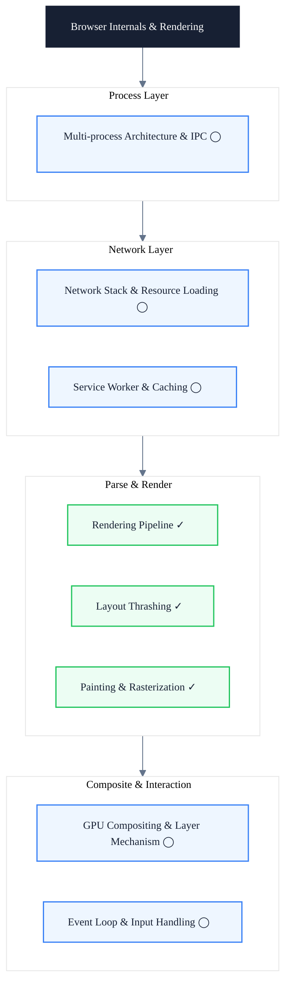

# Browser Internals & Rendering

> Subtitle: From multi-process architecture to rendering pipeline — building a complete "request to pixel" mental model

## Module Positioning

This module follows the "request to pixel" mainline, disassembling the browser's multi-process architecture, network stack, HTML/CSS parsers, V8 engine, rendering pipeline, and GPU compositing. We focus on the browser's internal mechanisms themselves, not the frameworks running on top — frameworks are merely consumers of these mechanisms.

When many frontend engineers approach performance optimization, their first instinct is to blame "framework re-renders" or "bundle size," while ignoring that the real bottleneck often lies inside the browser's pipeline. Only by building a complete request-to-pixel mental model can you locate performance problems to a specific stage and choose the right optimization: knowing that a reflow triggers Layout, knowing the cost of compositing-layer promotion, knowing why read-after-write causes forced synchronous layout.

This module does not address "how to write faster with a particular framework API," nor does it replace the engineering practice around the critical path and metrics covered in the Performance Engineering module. Its responsibility is to provide the mechanical primitives of the browser internals — once you understand these primitives, reading the performance module's practice checklist will reveal the "why" behind every recommendation.

---

## Knowledge Map

---

## Core Topics

### Collected ✓

- ✓ **Rendering Pipeline**: Input, output, and triggering conditions of the five stages — Style / Layout / Paint / Raster / Composite
- ✓ **Layout Thrashing**: Causes of forced synchronous layout, read-write interleaving patterns, and the FastDOM solution
- ✓ **Painting & Rasterization**: Paint records, display lists, tile rasterization, and compositing-layer mechanisms

### Planned ◯

- ◯ **Multi-process Architecture & IPC**: Responsibilities of the browser process, renderer process, GPU process, and network process, plus IPC collaboration
- ◯ **Network Stack & Resource Loading**: Preload scanner, Fetch Priority, and how HTTP/2 / HTTP/3 change resource organization
- ◯ **GPU Compositing & Layer Mechanism**: Layer trees, tile rasterization, compositing-layer promotion conditions, and compositing-layer explosion
- ◯ **Event Loop & Input Handling**: Task queues, microtasks, render timing, and input event dispatch
- ◯ **Service Worker & Caching**: SW lifecycle, Cache Storage, and cache-first strategies

---

## Learning Path

1. **Rendering Pipeline** — First build the full "request to pixel" view, understand the input and output of each stage
2. **Painting & Rasterization** — Go deeper into the Paint and Raster stages, understand display lists, tiles, and compositing layers
3. **Layout Thrashing** — Return to the runtime pitfalls of the Layout stage, master identification and resolution of forced synchronous layout
4. (Planned) Multi-process Architecture & IPC — Understand how the browser dispatches work across multiple processes
5. (Planned) Network Stack & Resource Loading — Fill in the "request" portion of the pipeline
6. (Planned) GPU Compositing & Layer Mechanism — Fill in the details of the "composite" stage
7. (Planned) Event Loop & Input Handling — Understand runtime task scheduling
8. (Planned) Service Worker & Caching — Understand an alternative path for resource caching

---

## Article Guide

- [Rendering Pipeline: From HTML to Pixel](/en/browser/rendering-pipeline) — A complete end-to-end overview; understand the input and output of each stage
- [Layout Thrashing: How It Breaks Your Animations](/en/browser/layout-thrashing) — Causes of forced synchronous layout and the FastDOM solution
- [Painting & Rasterization](/en/browser/painting-rasterization) — Paint records, tile rasterization, and compositing-layer mechanisms

---

## Intended Readers

- Intermediate and senior frontend engineers who want to break free from the limited perspective of "framework-level optimization"
- Performance owners who need to build a team-level framework for diagnosing performance issues
- Frontend architects who need to evaluate browser capability boundaries during technical decision-making

---

## Further Resources

- [Chrome University — Evaluate Performance](https://developer.chrome.com/docs/devtools/evaluate-performance/): Official Chrome performance analysis tutorial
- [web.dev Performance](https://web.dev/learn/performance/): A systematic performance course by Google
- [Chromium Source Documentation](https://chromium.googlesource.com/chromium/src/+/HEAD/docs/README.md): Chromium source docs for diving into implementation details
- Book: *Web Performance in Action* by Jeremy Wagner
