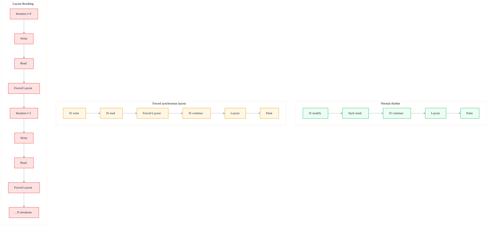
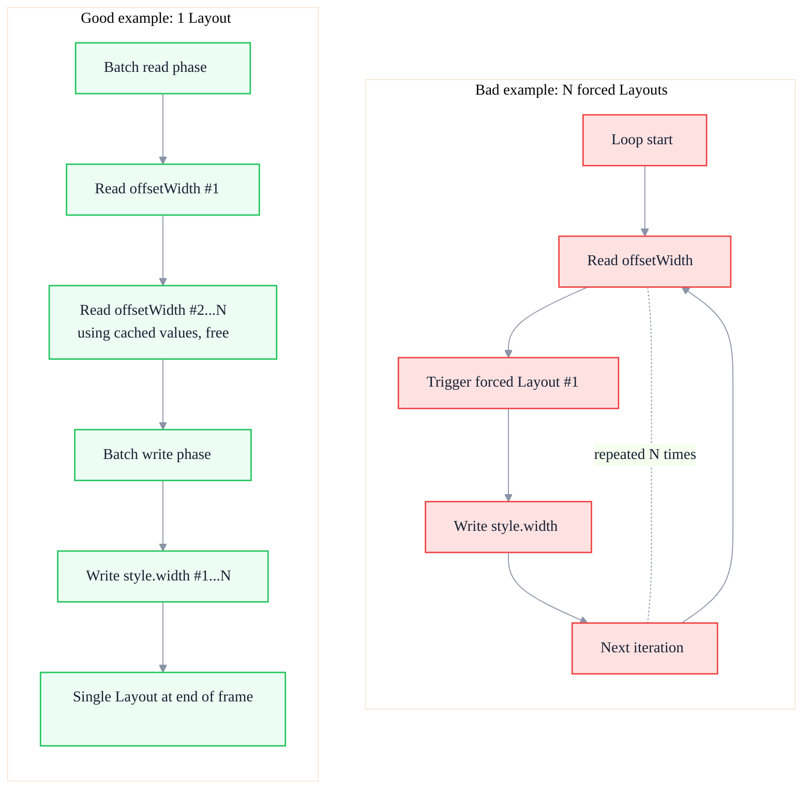

# The Truth About Layout Thrashing: How It Wrecks Your Animations

> Subtitle: From forced synchronous layout to layout thrashing, a deep dive into the cost of interleaved reads/writes, the correct use of rAF, and Layout-stage optimization strategies.
>
> Target readers: Intermediate to advanced frontend engineers, frontend architects, and animation/interaction performance owners.
>
> Reading time: ~22 minutes.

::: info In one sentence
Alternating layout reads and writes inside a loop forces the browser to repeatedly perform forced synchronous layout, turning an O(n) operation into O(n²) — one of the most insidious causes of animation jank.
:::

## Table of Contents

- [Preface](#preface)
- [1. What Is Forced Synchronous Layout (FSL)](#what-is-forced-synchronous-layout)
- [2. How Read-Write Alternation Causes Layout Thrashing](#how-read-write-alternation-causes-layout-thrashing)
- [3. Bad vs. Good Code Examples](#bad-vs-good-code-examples)
- [4. The Correct Way to Use requestAnimationFrame](#the-correct-way-to-use-requestanimationframe)
- [5. Layout-Stage Optimization Strategies](#layout-stage-optimization-strategies)
- [6. How to Identify and Diagnose Layout Thrashing](#how-to-identify-and-diagnose-layout-thrashing)
- [7. Common Trigger Scenarios and Pitfalls](#common-trigger-scenarios-and-pitfalls)
- [Conclusion: Make Read-Write Separation a Muscle Memory](#conclusion-make-read-write-separation-a-muscle-memory)
- [FAQ](#faq)
- [Sources](#sources)

## Preface {#preface}

If you have ever optimized frontend animations, you have probably heard: "Don't read `offsetWidth` inside a loop." But few people explain why.

The mechanism behind this is a commonly misunderstood browser behavior: **layout is lazily evaluated**. When you modify styles, the browser does not recompute layout immediately; it leaves a dirty mark and processes everything in a batch right before the next frame renders. This batching is how the browser optimizes rendering.

But when you **read layout information** (e.g. `offsetWidth`, `getBoundingClientRect`), the browser must return an **accurate current value**. If there are unprocessed style changes, the browser is forced to **execute Layout immediately** to give the correct answer. This is "forced synchronous layout" (FSL).

Put this mechanism inside a loop where each iteration writes then reads, and the browser is forced to perform a full Layout on every iteration. An originally O(n) batched operation degrades to O(n²). This is **Layout Thrashing**.

::: tip Key takeaway of this section
The root cause of layout thrashing is not "reading layout information," but "reading after writing." Understand this mechanism, and you can avoid it structurally instead of memorizing a list of "properties that trigger Layout."
:::

---

## 1. What Is Forced Synchronous Layout (FSL)? {#what-is-forced-synchronous-layout}

### 1. Normal rendering rhythm

Under normal conditions, the browser renders in this rhythm:

```
JS execution → Style mark → Layout → Paint → Composite → next frame
```

When JS modifies the DOM or styles, the browser only marks "needs recalculation" and **does not execute Layout immediately**. After JS finishes all changes within a frame and the main thread enters the rendering phase, the browser completes Style recalculation, Layout, Paint, and Composite in one go.

This is the browser's "batch optimization" — merging multiple changes within one frame into a single Layout.

### 2. Triggering forced synchronous layout

The problem arises when JS **reads layout information immediately after modifying styles**:

```javascript
element.style.width = '100px'
console.log(element.offsetWidth)  // triggers forced synchronous layout
```

`offsetWidth` returns the element's **current** layout width. To return the correct value, the browser must apply the `width: 100px` change and **execute Layout immediately**. This Layout does not wait until the end of the frame; it is pulled forward into JS execution, hence "forced synchronous layout" — forced, synchronous, and immediate.

### 3. Forced synchronous layout vs. Layout Thrashing

The two terms are often conflated, but they differ:

- **Forced Synchronous Layout (FSL)**: one write immediately followed by one read, triggering one early Layout.
- **Layout Thrashing**: repeatedly write-read-write-read inside a loop, triggering N early Layouts and causing performance collapse.



::: tip Key takeaway of this section
Forced synchronous layout is a single write-read pair that triggers one early Layout. Layout Thrashing is repeated write-read pairs in a loop that trigger N early Layouts — the real culprit behind performance collapse.
:::

::: warning Common misconception
Treating "reading `offsetWidth` is always slow" as an iron rule. In reality, a **read with no preceding modification** is almost free — the browser returns cached layout information. What is slow is "reading after writing."
:::

---

## 2. How Read-Write Alternation Causes Layout Thrashing {#how-read-write-alternation-causes-layout-thrashing}

### 1. Why write-then-read triggers early Layout

The browser's design has an invariant: **any layout query must return the currently accurate value**.

If Layout were not forced, after you changed `width` to 100px, reading `offsetWidth` immediately would still return the old value — unacceptable. So the browser's only choice is: **when JS queries layout information, if there are unprocessed style changes, execute Layout immediately**.

### 2. Why it becomes O(n²) in a loop

Consider this code:

```javascript
const items = document.querySelectorAll('.item')
for (let i = 0; i < items.length; i++) {
  items[i].style.width = container.offsetWidth + 'px'  // write + read
}
```

Every iteration performs write → read:

- Iteration 1: write item[0], read container → triggers 1 Layout
- Iteration 2: write item[1], read container → triggers 1 Layout
- ...
- Iteration N: triggers 1 Layout

A total of N Layouts. Each Layout cost is not necessarily "processing one element," because the browser must track dirty marks for incremental Layout and compute dependencies; on a large DOM a single Layout can also be expensive. So total cost is O(N) × single Layout cost, approaching O(N²) in the worst case.

### 3. The browser's "Layout hint" optimization

Chromium has a minor optimization: in some cases, consecutive forced synchronous layouts are merged. But this only works in very simple scenarios and cannot be relied upon. In loops, or with multiple interdependent elements, the optimization fails.

::: tip Key takeaway of this section
The essence of layout thrashing: N Layouts that should have been batched are forced to complete one by one during JS execution. The fundamental fix is "read in batch first, then write in batch," so the browser performs only one Layout at the end of the frame.
:::

---

## 3. Bad vs. Good Code Examples {#bad-vs-good-code-examples}

### 1. Bad example: read-write alternation in a loop

```javascript
// Bad example: each iteration triggers forced synchronous layout
function updateWidthsBad(items) {
  for (let i = 0; i < items.length; i++) {
    // Read: triggers Layout (because the previous iteration already wrote)
    const width = items[i].parentNode.offsetWidth
    // Write: marks Layout dirty
    items[i].style.width = width + 'px'
  }
}

const items = document.querySelectorAll('.item')
updateWidthsBad(items)
```

If `items` has 500 elements, this code triggers about 500 forced synchronous Layouts. On low-end devices a single Layout may take 5–10ms; 500 of them is 2.5–5 seconds — the animation will freeze.

### 2. Good example: batch read, then batch write

```javascript
// Good example: read all first, then write all
function updateWidthsGood(items) {
  // Step 1: batch read, pull out all needed values first
  const widths = []
  for (let i = 0; i < items.length; i++) {
    widths.push(items[i].parentNode.offsetWidth)
  }

  // Step 2: batch write
  for (let i = 0; i < items.length; i++) {
    items[i].style.width = widths[i] + 'px'
  }
}

const items = document.querySelectorAll('.item')
updateWidthsGood(items)
```

This code triggers only 1 Layout (on the first read of the first iteration; all subsequent reads are cached), and all writes are accumulated and processed at frame end. The performance difference is often tens to hundreds of times.

### 3. Comparison Mermaid diagram



### 4. More complex scenarios: multi-variable read/write

In real projects, it is rarely a single variable. For example:

```javascript
// Bad example: reading multiple properties inside the loop
for (const card of cards) {
  const containerWidth = card.parentNode.offsetWidth
  const containerHeight = card.parentNode.offsetHeight
  const ratio = containerWidth / containerHeight
  card.style.aspectRatio = ratio
  card.style.width = containerWidth * 0.5 + 'px'
}
```

The fix is the same: move all reads before the loop, and move all writes after the loop or into a unified write loop.

```javascript
// Good example: batch read + batch write
const ratios = cards.map(card => {
  const w = card.parentNode.offsetWidth
  const h = card.parentNode.offsetHeight
  return { ratio: w / h, w: w * 0.5 }
})

cards.forEach((card, i) => {
  card.style.aspectRatio = ratios[i].ratio
  card.style.width = ratios[i].w + 'px'
})
```

::: tip Key takeaway of this section
The fixed pattern for fixing layout thrashing: **read in batch first, then write in batch**. No matter how complex the loop, as long as reads and writes are separated in time, N Layouts collapse into 1.
:::

---

## 4. The Correct Way to Use requestAnimationFrame {#the-correct-way-to-use-requestanimationframe}

### 1. What rAF does

`requestAnimationFrame` is a browser API for running JS **before the next render**. Its key characteristics:

- The callback runs before rendering.
- Style changes inside the callback are merged into the current frame's Layout phase.
- Only one callback per frame (~16.6ms @ 60fps).
- Paused when the tab is invisible, saving resources.

### 2. rAF fixes "scattered writes"

If multiple unrelated code blocks in the same frame modify the DOM, putting them in rAF ensures they are handled together at frame end:

```javascript
// Bad example: directly modifying DOM in multiple event callbacks
button1.addEventListener('click', () => {
  element.style.left = '100px'  // write
})
button2.addEventListener('click', () => {
  element.style.top = '200px'   // write
})
// When both clicks happen in the same frame, the browser marks Style twice but performs Layout once
```

This is actually not a big problem (the browser's batch optimization handles it), but if you **read immediately after each write**, rAF cannot save you. rAF does not solve write-read alternation inside a loop, because the issue occurs within a single JS execution.

### 3. rAF fixes animation loops

For animations, rAF is a must:

```javascript
// Bad example: using setTimeout for animation
function animateBad() {
  element.style.transform = `translateX(${x}px)`
  setTimeout(animateBad, 16)
}
```

`setTimeout` is not aligned with rendering; it may fire mid-frame, causing multiple executions per frame or missing frames.

```javascript
// Good example: using rAF for animation
function animateGood() {
  element.style.transform = `translateX(${x}px)`
  requestAnimationFrame(animateGood)
}
```

### 4. Incorrect rAF usage

```javascript
// Wrong: read layout inside rAF while writing outside
function bad() {
  const width = element.offsetWidth  // read
  requestAnimationFrame(() => {
    element.style.width = width + 'px'  // write
  })
}
```

This solves nothing. The correct approach is the opposite: **read outside, write inside rAF** — so the read happens before any unprocessed writes, and the write is unified at frame end.

```javascript
// Correct: read first, write inside rAF
function good() {
  const width = element.offsetWidth  // read: no dirty writes at this point, cheap
  requestAnimationFrame(() => {
    element.style.width = width + 'px'  // write: batched at frame end
  })
}
```

### 5. Double rAF special case

Sometimes you need to read layout **after** the next frame has rendered (e.g. measuring the final position after an animation ends). Use **double rAF**:

```javascript
requestAnimationFrame(() => {
  requestAnimationFrame(() => {
    // At this point the previous frame has rendered; reading layout is accurate
    const rect = element.getBoundingClientRect()
  })
})
```

::: tip Key takeaway of this section
rAF is not a cure for layout thrashing; **read/write separation is**. rAF solves "animation alignment with rendering" and "merging multiple writes into one frame." Remember: read first, then write; inside rAF, only write, don't read.
:::

::: warning Common misconception
Wrapping all DOM operations in rAF to "improve performance." This won't fix layout thrashing; it only makes debugging harder. First ensure read/write separation is correct, then consider whether rAF scheduling is needed.
:::

---

## 5. Layout-Stage Optimization Strategies {#layout-stage-optimization-strategies}

### 1. Prefer transform / opacity for animations

The most fundamental way to avoid Layout is **not to trigger it**. Make animations only change `transform` and `opacity`, and the pipeline skips Layout and Paint and goes straight to Composite.

```css
/* Bad: triggers Layout */
.move {
  transition: left 0.3s, top 0.3s;
  left: 100px;
  top: 200px;
}

/* Good: only triggers Composite */
.move {
  transition: transform 0.3s;
  transform: translate(100px, 200px);
}
```

### 2. Avoid `display: none` toggling

Toggling between `display: none` and `display: block` triggers render-tree reconstruction + full Layout. For frequent toggling, use `visibility: hidden` (only Paint) or `opacity: 0` (only Composite).

### 3. Use `contain` to isolate layout

The CSS `contain` property tells the browser that an element's subtree is independent, isolating reflow scope:

```css
.card-list {
  contain: layout style;
}
```

This way, Layout changes inside the card list won't propagate outward. `contain: strict` is equivalent to `layout style paint size`, the strongest isolation, but requires fixed dimensions.

### 4. Reduce DOM size

DOM node count directly determines Layout cost. For long lists, use virtual scrolling (e.g. `react-window`, `vue-virtual-scroller`), rendering only dozens of visible nodes instead of thousands.

### 5. Use DocumentFragment for batch insertion

```javascript
// Bad: appending one by one in a loop triggers multiple Layouts
for (const item of items) {
  const li = document.createElement('li')
  li.textContent = item
  list.appendChild(li)
}

// Good: batch insert with DocumentFragment
const fragment = document.createDocumentFragment()
for (const item of items) {
  const li = document.createElement('li')
  li.textContent = item
  fragment.appendChild(li)
}
list.appendChild(fragment)
```

### 6. Modern framework batching

React, Vue, Solid, and others all have batching mechanisms:

- **React 18**: all state updates inside event callbacks and `setTimeout` are automatically batched.
- **Vue 3**: based on reactive-system dependency tracking, multiple modifications in the same tick are merged into one update.
- But framework batching solves "multiple state changes merged into one render"; it **cannot** solve layout thrashing caused by actively reading/writing the DOM inside effects.

::: tip Key takeaway of this section
Layout optimization toolkit: ① replace geometric properties with `transform`/`opacity`; ② isolate with `contain`; ③ control DOM size with virtual lists; ④ batch insertions with `DocumentFragment`. Framework batching cannot replace manual read/write separation.
:::

---

## 6. How to Identify and Diagnose Layout Thrashing {#how-to-identify-and-diagnose-layout-thrashing}

### 1. Performance panel

Open DevTools → Performance → record → inspect the main-thread trace:

- **Consecutive purple Layout blocks**: a classic layout thrashing signal.
- **Click a Layout block**: see the triggering function in the Bottom-Up panel.
- **Red triangle marker**: long tasks (>50ms).
- **Forced synchronous layout warning**: a purple triangle on the Layout event in the Main thread, showing "Forced reflow."

### 2. Rendering panel

DevTools → More tools → Rendering:

- **Layout Shift Regions**: highlight areas experiencing layout shifts (this is the CLS concept; different from Layout Thrashing, but overlapping regions often locate issues).
- **Paint flashing**: highlight repaint areas.

### 3. Lighthouse audit

The Lighthouse report has a "Minimize layout thrashing" item that points out specific code locations.

### 4. Key metrics

- **FPS**: sudden FPS drops during animations, accompanied by lots of purple Layout blocks.
- **INP**: slow interaction response but JS execution time is not high — Layout may be occupying the main thread.
- **CLS**: cumulative layout shift, reflecting visual stability.

::: tip Key takeaway of this section
The fastest path to diagnose layout thrashing: Performance panel recording → look for consecutive purple Layout blocks → click to see the triggering function → check for write-read alternation. Forced synchronous layout warnings are the most direct signal.
:::

---

## 7. Common Trigger Scenarios and Pitfalls {#common-trigger-scenarios-and-pitfalls}

### 1. Frequent `getBoundingClientRect` in responsive components

```javascript
// Bad example: reading getBoundingClientRect inside scroll events
window.addEventListener('scroll', () => {
  const rect = element.getBoundingClientRect()  // read
  if (rect.top < 100) {
    element.classList.add('sticky')  // write
  }
})
```

Fix:

```javascript
// Good example: use IntersectionObserver instead
const observer = new IntersectionObserver((entries) => {
  entries.forEach(entry => {
    if (entry.isIntersecting) {
      element.classList.add('sticky')
    }
  })
}, { threshold: [0, 0.1, 0.5, 1] })
observer.observe(element)
```

### 2. Third-party library DOM operations

Some third-party libraries (old chart libraries, ad SDKs) contain internal read/write alternation. These problems are hard to fix directly. Mitigations:

- Upgrade to a newer version.
- Use `contain: strict` to isolate the container the third-party operates on.
- Put the third-party's DOM operations inside `requestAnimationFrame` to avoid affecting the current frame.

### 3. Ref measurements inside frameworks

```javascript
// Anti-pattern in React
useEffect(() => {
  const height = ref.current.offsetHeight  // read
  ref.current.style.height = height * 2 + 'px'  // write
}, [deps])
```

Fix idea:

```javascript
// Good example: read first, then write, and let React batch the update
useLayoutEffect(() => {
  const height = ref.current.offsetHeight  // read
  // Trigger React's batch update via setState
  setTargetHeight(height * 2)
}, [deps])
```

### 4. Animation-driven layout measurements

Some animations need per-frame element-position measurements (e.g. drag snapping, magnetic effects). In such cases:

- Use `useLayoutEffect` or rAF to measure uniformly at frame end.
- Cache measurement results in a ref to avoid repeated reads.
- Displacement expressible with `transform` should never use `top`/`left`.

::: tip Key takeaway of this section
The most common layout thrashing traps: reading `getBoundingClientRect` in scroll events, internal read/write alternation in third-party libraries, and ref measurements inside framework effects. Use `IntersectionObserver` instead of manual measurement, and `transform` instead of geometric properties.
:::

---

## Conclusion: Make Read-Write Separation a Muscle Memory {#conclusion-make-read-write-separation-a-muscle-memory}

Layout thrashing is a "low-cost, high-return" optimization point in frontend performance: the fix is simple (read/write separation), but the effect is immediate (several-fold FPS improvement). It is also a key interview topic that distinguishes "can write code" from "understands the browser."

Remember this muscle memory:

> **Every time you want to read layout information, ask yourself: did I just write any styles? If yes, move the read before all writes.**

Further insights:

1. **Layout is lazy**: writes only mark; Layout runs at frame end.
2. **Reads are immediate**: reads must return accurate current values, so they force Layout.
3. **Batching is king**: read first then write is always faster than read-write alternation.
4. **rAF is alignment**: it solves rendering alignment, not layout thrashing.
5. **transform is the silver bullet**: any animation expressible with `transform` should never trigger Layout.

Apply this mental model to daily code, and you can eliminate most layout thrashing at the source.

---

## FAQ {#faq}

### 1. Why does "read first, then write" solve layout thrashing?

Reading layout information when there are no unprocessed style changes lets the browser return cached values almost for free. Moving all reads before all writes triggers only 1 Layout (on the first read, if there were dirty marks before). All subsequent reads are free, and all writes are batched at frame end.

### 2. Can `requestAnimationFrame` solve layout thrashing?

Not directly. rAF solves "animation alignment with rendering" and "merging multiple writes into one frame." If write-read alternation occurs within a single frame's JS execution, rAF cannot help. The correct approach is to do all reads first (outside or inside rAF), then do all writes.

### 3. Can framework batch updates replace read/write separation?

No. React and Vue batching merges multiple state changes into one render. But if you actively read the DOM and then write the DOM inside `useEffect` or `watch`, the framework has no control — this bypasses the virtual DOM. In these cases, manual read/write separation is still required.

### 4. How do I know whether a property triggers Layout?

Reference [csstriggers.com](https://csstriggers.com/). A simpler rule: **properties that change an element's geometry or size trigger Layout**, such as `width`, `height`, `margin`, `padding`, `top`/`left`, `font-size`, `float`, `display`. `transform` and `opacity` are among the few properties that only trigger Composite, making them the first choice for animations.

### 5. Is `getBoundingClientRect` always slow?

Not necessarily. If there are no unprocessed style changes, `getBoundingClientRect` returns cached values almost for free. The slowness comes from "reading after writing." So the issue is not the API itself, but the timing of the call.

---

## Sources {#sources}

This article is based on the Chromium rendering pipeline documentation, the web.dev performance series, the Chrome DevTools documentation, and the author's engineering practice. Key technical details can be found in:

1. web.dev - Avoid large, complex layouts and layout thrashing: [https://web.dev/articles/avoid-large-complex-layouts-and-layout-thrashing](https://web.dev/articles/avoid-large-complex-layouts-and-layout-thrashing)
2. Chrome DevTools - Analyze runtime performance: [https://developer.chrome.com/docs/devtools/performance/](https://developer.chrome.com/docs/devtools/performance/)
3. CSS Triggers: [https://csstriggers.com/](https://csstriggers.com/)
4. MDN - requestAnimationFrame: [https://developer.mozilla.org/en-US/docs/Web/API/Window/requestAnimationFrame](https://developer.mozilla.org/en-US/docs/Web/API/Window/requestAnimationFrame)
