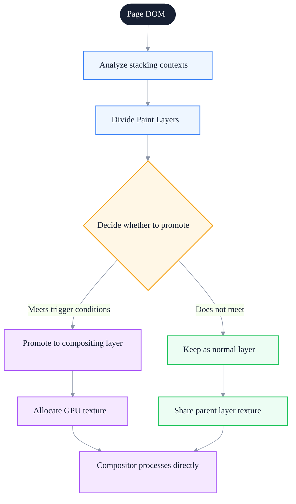
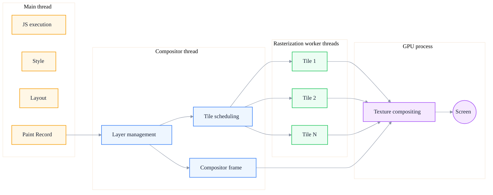

# Painting and Rasterization: From Layer Composition to Screen Display

> Subtitle: The complete pipeline from Paint Record generation, layer splitting, tile rasterization to GPU compositing, with a deep dive into why transform/opacity don't trigger Layout
>
> Target readers: intermediate to advanced frontend engineers, frontend architects, animation and rendering performance optimization leads
>
> Reading time: about 26 minutes

::: info In one sentence
From Paint to screen is an "instruction generation → layer splitting → tile rasterization → GPU compositing" pipeline; understanding this pipeline is the only way to explain why transform animations can stay silky smooth even when the main thread is choked.
:::

## Table of Contents

- [Introduction](#introduction)
- [1. What the Paint Stage Does](#1-what-the-paint-stage-does)
- [2. Layers and Stacking Contexts](#2-layers-and-stacking-contexts)
- [3. Rasterization: From Vector to Bitmap](#3-rasterization-from-vector-to-bitmap)
- [4. Compositing: GPU Compositing Principles](#4-compositing-gpu-compositing-principles)
- [5. Why transform/opacity Don't Trigger Layout](#5-why-transformopacity-dont-trigger-layout)
- [6. The Correct Understanding of Hardware Acceleration](#6-the-correct-understanding-of-hardware-acceleration)
- [7. How the Compositor Thread Cooperates with the Main Thread](#7-how-the-compositor-thread-cooperates-with-the-main-thread)
- [8. Practice: Pinpointing Paint and Raster Bottlenecks](#8-practice-pinpointing-paint-and-raster-bottlenecks)
- [Conclusion: Compositing Is the Ultimate Battlefield of Performance Optimization](#conclusion-compositing-is-the-ultimate-battlefield-of-performance-optimization)
- [FAQ](#faq)
- [Sources](#sources)

## Introduction

In the previous article "Rendering Pipeline" we covered the stages before Layout. This article focuses on the second half after Layout: **the complete path from paint commands to screen pixels**.

This path is often overlooked by frontend engineers because it "seems far from business logic." Yet it is precisely the key to explaining many phenomena:

- Why can `transform: translate()` animations stay smooth even when the main thread is choked by JavaScript?
- Why can't `will-change` be abused, yet it really works?
- Why does a large blurred `box-shadow` cause FPS to crash?
- Why do `position: fixed` elements sometimes "flicker"?
- Why isn't GPU acceleration free?
- Why does an LCP image still need a few hundred milliseconds to display after it has downloaded?

Understanding this path is essentially understanding "how the browser turns an abstract layer model into concrete pixels." This article will walk you through every step from Paint to screen, and finally build a model that can explain all the phenomena above.

::: tip Key takeaway of this section

Paint and Raster are two different things: Paint generates drawing commands (on the main thread), while Raster turns commands into pixels (on worker threads + GPU). Compositing assembles multiple layers (in the GPU process). The reason `transform/opacity` don't trigger Layout is that they act in the compositing stage, not the Paint stage.
:::

---

## 1. What the Paint Stage Does

### 1.1 Paint Does Not Produce Pixels Directly

A common misconception is that "Paint is drawing the page." But strictly speaking, **the Paint stage does not produce pixels directly**; it produces a **list of drawing commands** (Paint Record, Display List, Paint Ops).

A Paint Record looks like this set of abstract commands:

```
pushClip(0, 0, 1440, 900)
  drawRect(0, 0, 1440, 900, color=#ffffff)
  drawRect(20, 20, 200, 50, color=#3b82f6)
  drawText("Hello", 30, 50, font=14px sans-serif, color=#ffffff)
  drawImage(hero.webp, 0, 100, 1440, 600)
  drawShadow(20, 700, 300, 100, blur=20px, color=rgba(0,0,0,0.3))
    drawRect(20, 700, 300, 100, color=#ffffff)
popClip()
```

These commands tell the rasterizer: what to draw at which coordinates, in what order, and with what parameters. The order follows the painter's algorithm — later drawings cover earlier ones.

### 1.2 Why Not Produce Pixels Directly

Separating "command generation" from "command execution" has several benefits:

- **Parallelism**: commands can be distributed to multiple rasterization threads and executed concurrently
- **Reuse**: if only the layer transform changes, old commands can be reused, skipping Paint
- **Layering**: each layer generates commands independently, rasterizes independently, and composites independently
- **Caching**: identical command sequences can be cached as GPU textures and composited directly next time

### 1.3 Where Paint Cost Comes From

The cost of the Paint stage mainly comes from:

- **Repaint area**: how many pixels are redrawn each time
- **Paint complexity**: complexity of shadows, blur, gradients, and filters
- **Layer count**: each layer must generate its own Paint Record

One of the most expensive operations is **large-area blurred shadows**. A shadow like `box-shadow: 0 0 100px rgba(0,0,0,0.5)` forces the browser to either blur in software on the CPU (expensive) or sample multiple times on the GPU (also expensive). If the element is also re-painted repeatedly during animation, FPS will drop sharply.

### 1.4 Paint Output: Paint Layer and Graphics Layer

In addition to producing the Paint Record, the Paint stage also **splits the page into multiple layers based on stacking contexts**:

- **Paint Layer**: the basic unit that participates in painting, corresponding to a stacking context
- **Graphics Layer**: a compositing layer that the compositor can handle independently; each Graphics Layer has its own GPU texture

Not every Paint Layer is promoted to a Graphics Layer. Only layers that meet specific conditions (such as 3D transforms, `will-change`, animated transform/opacity) are promoted to compositing layers.

::: tip Key takeaway of this section

Paint produces drawing commands rather than pixels, organized by layer. The most expensive Paint operations are large-area blurred shadows and complex filters. The output of Paint is the Paint Record plus a layer list, which is then handed over to rasterization and compositing.
:::

---

## 2. Layers and Stacking Contexts

### 2.1 Stacking Context

Stacking context is a CSS concept: certain elements become a "stacking context root," whose child elements are stacked internally according to z-order, while the element itself is treated as a whole from the outside.

Common conditions that create a stacking context:

- `position: absolute/relative` + `z-index` not auto
- `position: fixed/sticky`
- `opacity < 1`
- `transform` not none
- `filter` not none
- `will-change` with certain values
- `<video>`, `<canvas>`, and other replaced elements

### 2.2 From Stacking Context to Layer

During the Paint stage the browser maps stacking contexts to layers (Paint Layers). But **not every stacking context becomes an independent layer** — that is the browser's optimization space.

A simple page may have only 1 layer (all content painted together). But when a page has:

- a `position: fixed` navigation bar
- a card with `transform: translateZ(0)`
- a `<video>` element
- an overlay with `opacity: 0.5`

each of these may become an independent layer.

### 2.3 Compositing Layer

A compositing layer is the "VIP" among layers: it has its own independent GPU texture and can be processed directly by the compositor without main-thread involvement.

Common conditions that trigger compositing layer promotion:

| Trigger condition | Description |
| --- | --- |
| 3D transform | `transform: translateZ(0)`, `translate3d`, `rotateX/Y` |
| `will-change: transform/opacity` | provided real animation is about to happen |
| Animated `transform/opacity` | at least one animation frame |
| `<video>`, `<canvas>`, WebGL | replaced elements are composited by nature |
| `position: fixed` + software compositing | partial browser implementation |
| `opacity < 1` + already a compositing layer | combined with transform or other conditions |
| CSS `filter` | partial browser implementation |

### 2.4 Side Effects of Compositing Layer Promotion

More compositing layers is not always better. Each compositing layer brings:

- **GPU memory**: each texture costs at least a few hundred KB to several MB
- **Compositing cost**: the compositor must process more textures; more is slower
- **Repaint cost**: when a compositing layer's content changes, the entire layer must be re-rasterized



::: tip Key takeaway of this section

Layers come from stacking contexts; compositing layers are the VIPs among layers. Compositing layers can be composited directly by the GPU, skipping the main thread, but each one consumes GPU memory. Abusing `will-change` can cause a "compositing-layer explosion" that actually slows performance.
:::

::: warning Common pitfall

Adding `transform: translateZ(0)` to every element to "enable GPU acceleration." This makes the browser create compositing layers for elements that don't really need them, causing memory usage to surge and the compositing stage to slow down. The correct approach is to use it temporarily only for elements that truly need animation.
:::

---

## 3. Rasterization: From Vector to Bitmap

### 3.1 What Rasterization Does

Rasterization is the process of turning **vector drawing commands** (drawRect, drawText, drawImage) into **real pixel bitmaps**.

The Paint Record says "draw a 200×50 blue rectangle at (20, 20)"; the rasterizer must calculate which pixels the rectangle covers and what color each pixel should be (taking anti-aliasing, subpixel rendering, text hinting, etc. into account).

### 3.2 Tile Splitting

Compositing layers are usually not rasterized all at once; they are cut into small **tiles**, typically 256×256 or 512×512 pixels.

Benefits of tile splitting:

- **Parallelism**: multiple tiles can be distributed to multiple rasterization threads for concurrent processing
- **On-demand rasterization**: only the currently visible area is rasterized, plus nearby pre-rasterization, saving resources
- **Priority**: tiles inside the viewport are rasterized first, then tiles outside the viewport
- **Incremental updates**: when only part of a layer changes, only the affected tiles are re-rasterized

### 3.3 Rasterization Thread Pool

Chromium's rasterization does not happen on the main thread, but in the **compositor thread + rasterization worker thread pool**:

- **Compositor thread**: responsible for layer management, tile scheduling, and compositor frame generation
- **Rasterization worker threads**: multiple workers execute tile rasterization concurrently

This is why transform animations can stay smooth even when the main thread is occupied by JavaScript — the compositor thread and worker threads are independent of the main thread.

### 3.4 GPU Rasterization vs Software Rasterization

Modern browsers generally use **GPU rasterization**: drawing commands are handed to the GPU, which executes them through GPU shaders and outputs pixels.

Advantages of GPU rasterization:

- Massive parallelism at the pixel level
- Text, paths, and images can all be processed by GPU shaders
- Output is directly a GPU texture, with no CPU↔GPU copy

Certain scenarios still fall back to software rasterization (CPU), such as:

- Some complex SVG filters
- Some CSS filters (such as complex `drop-shadow`)
- When video memory is insufficient
- Some non-standard CSS properties

### 3.5 Rasterization and LCP

The completion time of LCP (Largest Contentful Paint) essentially depends on **when the LCP element finishes rasterization**. Even if the image has downloaded, decoded, and been laid out, if the compositor thread is queued with other work and the LCP element's tiles have not been rasterized, LCP will not fire.

This is why long main-thread tasks delay LCP — when the main thread is occupied, the Paint stage cannot start, and rasterization cannot begin either.

::: tip Key takeaway of this section

Rasterization turns drawing commands into pixel bitmaps, split into tiles and executed concurrently. GPU rasterization is the mainstream, but some complex filters fall back to software. The final LCP time depends on rasterization completion; main-thread stalling slows the whole pipeline.
:::

---

## 4. Compositing: GPU Compositing Principles

### 4.1 What Compositing Does

Compositing is the last step of the rendering pipeline: multiple already-rasterized layers (GPU textures) are assembled in the correct order and with the correct transforms into the final frame, which is output to the screen.

The essence of compositing is a combination of **textures + transform matrices**:

```
Compositor frame = [
  { texture: layer1, transform: identity, opacity: 1.0 },
  { texture: layer2, transform: translate(100, 50) rotate(15deg), opacity: 0.8 },
  { texture: layer3, transform: scale(1.2), opacity: 1.0 }
]
```

The GPU draws each texture to the screen buffer according to its transform matrix, stacked in order, and finally outputs pixels.

### 4.2 Compositing Happens in the GPU Process

Chromium's compositing is split into two steps:

- **Compositor thread** (part of the renderer process): decides each layer's position, transform, and visibility, and generates a "compositor frame"
- **GPU process**: actually executes texture compositing and outputs to the screen

Neither the compositor thread nor the GPU process is **on the main thread**. This is the root reason why "transform animations don't block the main thread."

### 4.3 Cost of Compositing

Compositing itself is relatively cheap (just a few texture samples), but it still has costs:

- **Layer count**: each layer must be sampled once; more is slower
- **Transform complexity**: 3D transforms are slightly more expensive than 2D transforms
- **Blend modes**: opacity, blend modes require extra samples
- **Clipping and masking**: complex masks increase sample count
- **Oversized textures**: when exceeding the GPU's maximum texture size, splitting is required

### 4.4 Compositing Frequency

Compositing happens per frame; 60fps means one compositing every 16.6ms. Even when the page is completely still, the browser is still compositing (compositing a static frame), only the cost is very low.

When the user scrolls, the compositor thread can directly update the scroll position and re-composite, **without main-thread involvement** — this is the basis of "non-main-thread scrolling." The precondition is that the scrolling container has no `scroll` event listener, or the listener uses `passive: true`.



::: tip Key takeaway of this section

Compositing is the last step of the rendering pipeline, completed in the compositor thread and GPU process without main-thread involvement. This is the fundamental reason why transform/opacity animations can stay smooth when the main thread is stalled. Scrolling can be "non-main-thread scrolling" provided passive listeners are used reasonably.
:::

---

## 5. Why transform/opacity Don't Trigger Layout

This is the most magical phenomenon in the rendering pipeline and a common interview question. With the pipeline we have covered, the answer is obvious.

### 5.1 The Nature of transform

`transform` changes the **visual transform** of an element, not its **layout position**.

Specifically:

- `transform: translate(100px, 50px)` changes where the element is **drawn on screen**
- The element's **layout position** (which affects the positions of other elements) does not change
- The browser still considers the element at its original position; it is just "moved" to the new position during compositing

So transform does not trigger Layout — the layout information hasn't changed, so there is no need to recalculate.

### 5.2 In Which Stage Does transform Take Effect

transform acts in the **compositing stage**:

```
Layout (unchanged) → Paint (unchanged) → Raster (unchanged) → Composite (apply transform)
```

That is, the element's rasterized texture (bitmap) remains unchanged; it is only drawn to the new position with a transform matrix during compositing. This is why transform animations are so cheap — only the compositing stage works, while the main thread, Layout, Paint, and Raster are all skipped.

### 5.3 Same for opacity

`opacity` changes the **transparency at draw time**, without changing layout or draw content. The compositor simply adjusts transparency when drawing the layer texture to the screen:

```
Composited output pixel = original pixel × opacity + pixel below × (1 - opacity)
```

### 5.4 Full Comparison

```mermaid
%%{init: {'theme': 'base', 'themeVariables': { 'fontFamily': 'Inter, PingFang SC, Microsoft YaHei, sans-serif', 'primaryColor': '#EEF6FF', 'primaryTextColor': '#172033', 'primaryBorderColor': '#6EA8FE', 'lineColor': '#8A94A6'}}}%%
flowchart TB
    subgraph Width["Change width/height"]
        direction LR
        W1[Style] --> W2[Layout] --> W3[Paint] --> W4[Raster] --> W5[Composite]
    end

    subgraph Color["Change color/background"]
        direction LR
        C1[Style] --> C2[Paint] --> C3[Raster] --> C4[Composite]
    end

    subgraph Transform["Change transform/opacity"]
        direction LR
        T1[Composite]
    end

    classDef expensive fill:#FEE2E2,stroke:#EF4444,color:#172033,stroke-width:1.5px;
    classDef medium fill:#FFF7E6,stroke:#F59E0B,color:#172033,stroke-width:1.5px;
    classDef cheap fill:#ECFDF3,stroke:#22C55E,color:#172033,stroke-width:1.5px;

    class W1,W2,W3,W4,W5 expensive;
    class C1,C2,C3,C4 medium;
    class T1 cheap;
```



### 5.5 Why transform Must Act on a Compositing Layer

If an element is not on a compositing layer, every frame of a transform animation must:

1. Redo Style on the main thread
2. Redo Layout on the main thread (even if layout hasn't changed, it must be confirmed)
3. Redo Paint on the main thread
4. Redo Raster on the worker thread
5. Composite

This is much more expensive than "only compositing." So the browser **automatically promotes elements with animated transform/opacity to compositing layers**, ensuring the animation takes only the compositing path.

::: tip Key takeaway of this section

The root reason transform/opacity don't trigger Layout: they change the transform matrix and opacity in the compositing stage, without changing layout information or draw content. The browser automatically promotes elements animated with these properties to compositing layers, so the animation runs entirely through the compositing path.
:::

::: info Key insight

The statement "transform doesn't trigger Layout" should fully be: "when transform acts on a compositing layer and only changes transform/opacity, the entire pipeline only executes in the compositing stage." If the element is not a compositing layer (some edge cases), or if other properties are changed at the same time, Paint or even Layout may still be triggered.
:::

---

## 6. The Correct Understanding of Hardware Acceleration

### 6.1 "GPU Acceleration" Is an Overused Term

What the industry commonly calls "GPU acceleration" usually means: **a layer is promoted to a compositing layer, and its transform/opacity is handled directly by the GPU**.

But the GPU's role in the rendering pipeline goes further:

- **GPU rasterization**: turning drawing commands into pixels (on worker threads + GPU)
- **GPU compositing**: combining multiple layer textures into the final frame (in the GPU process)
- **GPU shaders**: executing CSS filters and complex blending

So strictly speaking, "GPU acceleration" is not a single switch, but different acceleration methods at different stages.

### 6.2 Hacks That Forcibly Promote Compositing Layers

Historical frontend hacks:

```css
.gpu-hack {
  transform: translateZ(0);
  /* or */
  transform: translate3d(0, 0, 0);
  /* or */
  will-change: transform;
}
```

These can all force an element to be promoted to a compositing layer and let animation take the compositing path. But the costs are:

- Each compositing layer occupies GPU memory
- A large number of compositing layers slows the compositing stage itself
- When video memory is insufficient, worse fallback may be triggered

### 6.3 Correct Usage of will-change

`will-change` is a browser "heads-up" mechanism: it tells the browser that a property is about to change, so please prepare in advance.

Correct usage:

```css
/* The element is about to animate when hovered */
.card:hover {
  will-change: transform;
}
.card {
  transition: transform 0.3s;
}
```

Incorrect usage:

```css
/* Permanently enable will-change for all cards */
.card {
  will-change: transform;
}
```

The correct approach is **event-driven**: add `will-change` just before the animation starts, and remove it after the animation ends. For example, in React:

```jsx
function Card() {
  const ref = useRef()
  const handleMouseEnter = () => {
    ref.current.style.willChange = 'transform'
  }
  const handleTransitionEnd = () => {
    ref.current.style.willChange = 'auto'
  }
  return (
    <div
      ref={ref}
      onMouseEnter={handleMouseEnter}
      onTransitionEnd={handleTransitionEnd}
      className="card"
    />
  )
}
```

### 6.4 Memory Cost

The GPU texture size of each compositing layer is roughly: `width × height × 4 bytes (RGBA)`.

- A 1920×1080 layer is about 8MB
- A page with 20 such layers uses 160MB of GPU memory
- When video memory is insufficient, the browser falls back to software compositing and performance drops sharply

::: tip Key takeaway of this section

The accurate term for "GPU acceleration" is "promoting a layer to a compositing layer." `will-change` should be event-driven and removed immediately after use; it must not be left on permanently. Each compositing layer consumes GPU memory; too many will degrade performance.
:::

::: warning Common pitfall

Treating `will-change` as a performance optimization "patch" and adding it to every element that might animate. This causes compositing-layer explosion, GPU memory usage to surge, and the page to slow down.
:::

---

## 7. How the Compositor Thread Cooperates with the Main Thread

### 7.1 Division of Labor

| Work | Where it runs | Blocks main thread? |
| --- | --- | --- |
| JS execution | Main thread | Yes |
| Style calculation | Main thread | Yes |
| Layout | Main thread | Yes |
| Paint Record generation | Main thread | Yes |
| Layer management | Compositor thread | No |
| Tile rasterization scheduling | Compositor thread | No |
| Tile rasterization execution | Worker threads + GPU | No |
| Compositor frame generation | Compositor thread | No |
| Final compositing + output | GPU process | No |

### 7.2 What Happens When the Main Thread Is Stalled

If the main thread is occupied by a long JavaScript task:

- **New style changes cannot be processed**: Style, Layout, and Paint all queue and wait
- **But already-composited layers can continue animating**: the compositor thread works independently, and transform animations keep advancing
- **New animations cannot start**: because promoting a compositing layer requires the main thread to do Style

This is the truth behind "the main thread is dead but transform animations are still moving."

### 7.3 Non-Main-Thread Scrolling

Browser scrolling can bypass the main thread:

- The compositor thread directly updates the scroll position
- Re-composites layers and outputs a new frame
- Does not trigger Style, Layout, or Paint

But there are exceptions:

- If there is a `scroll` event listener that is not `passive`, the main thread must execute the listener first, which may block scrolling
- If scrolling triggers effects that need Layout, such as `position: sticky`, the main thread must be involved
- If scrolling changes the DOM (such as `scrollTo` + state update), the main thread must be involved

Therefore the first rule of mobile scrolling performance optimization: **add `passive: true` to scroll listeners**.

```javascript
// Bad: blocks scrolling
element.addEventListener('scroll', handleScroll)

// Good: does not block scrolling
element.addEventListener('scroll', handleScroll, { passive: true })
```

### 7.4 Compositing and Input Events

The compositor thread is also responsible for handling some input events (such as touch, wheel). The compositor thread can forward events to the main thread (e.g. `click`) or consume them directly (e.g. non-passive scrolling). If the main thread is occupied by a long task, events queue up and INP worsens.

::: tip Key takeaway of this section

The compositor thread and worker threads are independent of the main thread, which is the foundation of "transform animations don't block the main thread" and "non-main-thread scrolling." But starting new animations and Style/Layout updates still require the main thread. Mobile scroll listeners must use `passive: true`.
:::

---

## 8. Practice: Pinpointing Paint and Raster Bottlenecks

### 8.1 Performance Panel

Record an interaction and examine:

- **Green Paint blocks**: Paint stage duration
- **Green Rasterize / Raster Task blocks**: rasterization duration
- **Green Composite Layers blocks**: compositing duration
- **Layer list**: the Layers tab shows all layers and the number of compositing layers

### 8.2 Layers Tab

DevTools → More tools → Layers:

- View all layers
- View each layer's dimensions and memory usage
- View Paint Profile (paint cost analysis)
- Detect compositing-layer explosion

### 8.3 Rendering Tab

- **Paint flashing**: highlight repainted areas to see which regions are repainting
- **Layer borders**: show compositing-layer boundaries to see the number of compositing layers

### 8.4 Typical Problem Patterns

- **Large green Paint blocks**: repaint area is too large, possibly due to large shadows or complex backgrounds
- **Many Rasterize blocks**: too many layers, or a single layer is too large
- **Composite Layers is expensive**: compositing-layer explosion
- **Paint flashing highlights the whole screen**: a full-page repaint may have been accidentally triggered (e.g. changing the `body` background)

### 8.5 Optimization Directions

| Problem | Optimization direction |
| --- | --- |
| Large-area repaint | Reduce repaint area; isolate animated elements into compositing layers |
| Large shadow/filter | Replace with static images, or simplify the effect |
| Too many compositing layers | Remove unnecessary `will-change` and `translateZ(0)` |
| Layer too large | Split large layers, or use `contain` to isolate |
| Slow rasterization | Control layer count and size; avoid rasterizing entire large lists as one layer |

::: tip Key takeaway of this section

To locate Paint and Raster bottlenecks: use the Performance panel to inspect the distribution and duration of green blocks, the Layers panel to inspect layer count and memory, and Paint flashing to inspect repainted areas. The optimization directions are to reduce repaint area, control compositing-layer count, and avoid large-area blur effects.
:::

---

## Conclusion: Compositing Is the Ultimate Battlefield of Performance Optimization

With a full understanding of the Paint → Raster → Composite pipeline, you should be able to answer:

- Why can `transform` animations stay silky smooth when the main thread is stalled?
- Why can't `will-change` be abused?
- Why does an LCP image still need to wait for rasterization after downloading?
- Why isn't GPU acceleration free?
- Why do large amounts of `box-shadow` blur crash FPS?

The final mental model:

> **The core of the second half of the rendering pipeline (Paint → Raster → Composite) is "layers." Each layer independently generates drawing commands, independently rasterizes, and independently composites. `transform/opacity` are cheap because they only act in the compositing stage, skipping all the preceding main-thread work.**

Keep a few key insights in mind:

1. **Paint produces commands, not pixels**: on the main thread; blocks interaction
2. **Raster turns commands into pixels**: on worker threads + GPU; does not block the main thread
3. **Composite assembles layers**: in the GPU process; cheapest
4. **transform/opacity only go through Composite**: this is the root of smooth animations
5. **Compositing layers have costs**: GPU memory + compositing cost; don't abuse them

Map every performance optimization strategy to this pipeline, and you will have a complete "second-half" performance model.

---

## FAQ

### 1. Why can `transform` animations stay silky smooth when the main thread is dead?

Because `transform` acts in the compositing stage, and the compositor thread and GPU process are independent of the main thread. Even if the main thread is occupied by a long JavaScript task, the compositor thread can still advance the transform animation — it only needs to update the transform matrix and re-composite.

### 2. Should `will-change` be left on all the time?

No. `will-change` pre-creates compositing layers and occupies GPU memory. Leaving it on makes the browser reserve resources for animations that may not happen, causing memory waste and compositing-layer explosion. The correct approach is event-driven: add it just before the animation starts, and remove it after the animation ends.

### 3. Why does `box-shadow: 0 0 100px` crash FPS?

Large-area blurred shadows are very expensive. The browser either blurs in software on the CPU or samples multiple times on the GPU. If the element is also repainted repeatedly during animation, the blur must be recalculated every repaint, so FPS naturally crashes. Optimization directions: reduce shadow area, replace with a static image, or make the shadow a compositing layer (using `filter: drop-shadow` + `will-change`).

### 4. Why does an LCP image still need a few hundred milliseconds to display after downloading?

LCP completion time depends on "rasterization completion time," not just "download completion time." Even if the image has downloaded, decoded, and been laid out, if the main thread is occupied (parsing HTML, long JavaScript tasks), the Paint stage cannot start and rasterization cannot begin. Optimization directions: reduce first-screen JavaScript long tasks, and put the LCP image directly in HTML (so it is discovered earlier).

### 5. Is GPU acceleration free?

No. Each compositing layer consumes GPU memory (about `width × height × 4 bytes`). Too many compositing layers slow the compositing stage itself, and when video memory is insufficient the browser falls back to software compositing. Abusing `will-change` and `transform: translateZ(0)` causes a "compositing-layer explosion" that actually slows performance. GPU acceleration is an optimization tool, but not a free lunch.

### 6. Why should scroll listeners use `passive: true`?

Non-passive scroll listeners block scrolling: the browser must wait for the main thread to finish executing the listener before it can start scrolling, causing jank. `passive: true` tells the browser "this listener will not call `preventDefault`," so the browser can advance scrolling directly on the compositor thread while the main-thread listener runs asynchronously. The first rule of mobile scrolling performance optimization is to add `passive: true` to scroll/touchmove listeners.

---

## Sources

This article is based on Chromium rendering pipeline documentation, the web.dev performance series, Chrome DevTools documentation, and the author's engineering practice. Key technical details can be found in:

1. web.dev - Stick to compositor-only properties and manage layer count: [https://web.dev/articles/stick-to-compositor-only-properties-and-manage-layer-count](https://web.dev/articles/stick-to-compositor-only-properties-and-manage-layer-count)
2. Chromium Graphics documentation: [https://source.chromium.org/chromium/chromium/src/+/main:docs/graphics/](https://source.chromium.org/chromium/chromium/src/+/main:docs/graphics/)
3. web.dev - Animate with will-change: [https://web.dev/articles/animations-guide#will-change](https://web.dev/articles/animations-guide#will-change)
4. Chrome DevTools - Layers panel documentation: [https://developer.chrome.com/docs/devtools/performance/inspector/](https://developer.chrome.com/docs/devtools/performance/inspector/)
5. MDN - CSS will-change: [https://developer.mozilla.org/en-US/docs/Web/CSS/will-change](https://developer.mozilla.org/en-US/docs/Web/CSS/will-change)
