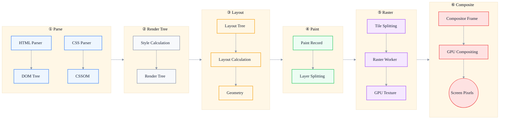
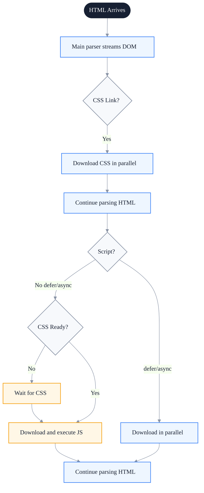
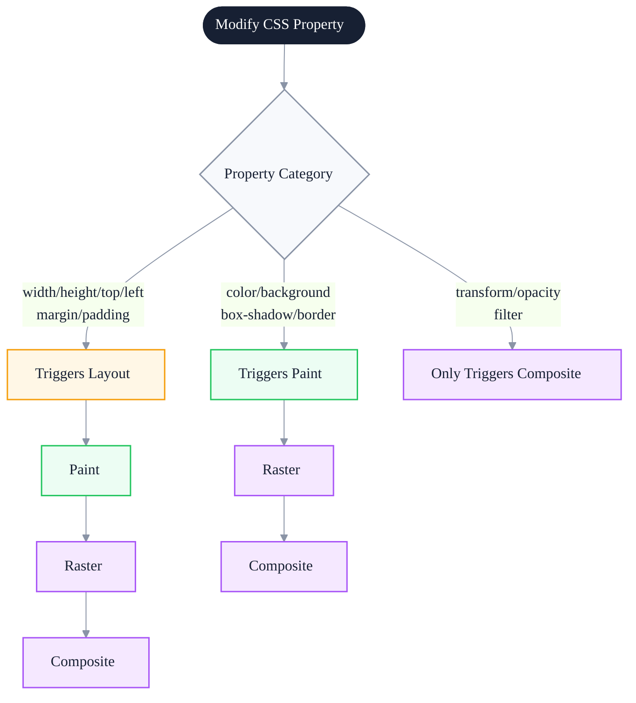

# Rendering Pipeline: From HTML to Pixels

> Subtitle: From HTML streaming parsing, CSSOM construction, render-tree synthesis, layout calculation, paint layering, to GPU compositing.
>
> Target readers: Intermediate and senior frontend engineers, frontend architects, performance owners.
>
> Reading time: ~28 minutes.

::: info In one sentence
The rendering pipeline is not a straight line but a dependency state machine; understanding when each stage is triggered or skipped is the only way to pinpoint performance bottlenecks accurately.
:::

## Table of Contents

- [Introduction](#introduction)
- [1. Rendering Pipeline Overview](#1-rendering-pipeline-overview)
- [2. HTML Streaming Parsing and DOM Construction](#2-html-streaming-parsing-and-dom-construction)
- [3. CSSOM Construction and CSS Blocking](#3-cssom-construction-and-css-blocking)
- [4. Render Tree Synthesis](#4-render-tree-synthesis)
- [5. Layout (Reflow) Calculation](#5-layout-reflow-calculation)
- [6. Paint and Layering](#6-paint-and-layering)
- [7. Composite and GPU Acceleration](#7-composite-and-gpu-acceleration)
- [8. Performance Bottlenecks at Each Stage](#8-performance-bottlenecks-at-each-stage)
- [9. Which CSS Properties Trigger Which Paths](#9-which-css-properties-trigger-which-paths)
- [10. Practice: Locating Bottlenecks with the Performance Panel](#10-practice-locating-bottlenecks-with-the-performance-panel)
- [Conclusion: Manage the Pipeline as a State Machine](#conclusion-manage-the-pipeline-as-a-state-machine)
- [FAQ](#faq)
- [Sources](#sources)

## Introduction

Many frontend engineers understand browser rendering as "DOM + CSS = page," and some know about Layout, Paint, and Composite. But questions quickly become fuzzy:

- Is HTML parsed streaming or all at once? What exactly does the preload scanner do?
- Is CSSOM a tree or a table? Why does CSS block first render but not HTML parsing?
- What is the difference between `display: none` and `visibility: hidden` in the render tree?
- Is Layout really that expensive? Why does changing one `width` force a whole-page reflow?
- What sits between Paint and Composite? Why doesn't `transform` trigger Layout?
- How does GPU compositing assemble multiple layers onto the screen?

This article does not turn the rendering pipeline into a list of definitions. It aims to build a **reasoning model**: after you change a piece of DOM or a CSS property, you can predict which pipeline stages the browser will walk through, the cost of each, and how they appear in the Performance panel.

::: tip Key takeaway of this section
The core of the rendering pipeline is not memorizing the names of five stages, but understanding **trigger conditions** and **data flow**. Every stage has input, output, and trigger conditions; optimization means reducing unnecessary triggers and shrinking the scope of each trigger.
:::

---

## 1. Rendering Pipeline Overview

The modern browser rendering pipeline (using Chromium as reference) can be simplified into six stages:



The input and output of each stage are roughly as follows:

| Stage | Main Input | Main Output | Thread |
| --- | --- | --- | --- |
| HTML parsing | HTML byte stream | DOM tree | Main thread |
| CSS parsing | CSS byte stream | CSSOM | Main thread |
| Style calculation | DOM + CSSOM | Final style of each DOM node | Main thread |
| Layout | Render/Style tree + geometry constraints | Position and size of each node | Main thread |
| Paint | Layout tree + styles | Paint Record (display list) + layer list | Main thread |
| Raster | Layer + tile | Bitmap pixels (GPU texture) | Compositor thread + raster worker threads |
| Composite | Textures of multiple layers | Composited frame | GPU process |

::: info Key insight

Notice the division of labor among the **main thread / compositor thread / raster worker threads / GPU process**. **Layout and Paint run on the main thread**, so they block JavaScript and interaction; **Raster and Composite can happen off the main thread**, so `transform/opacity` animations remain smooth even when the main thread is occupied by JavaScript. This is the root cause behind all optimization strategies.
:::

---

## 2. HTML Streaming Parsing and DOM Construction

### 2.1 Incremental Parsing

The HTML parser does not wait for the entire HTML document to download before starting. It parses the byte stream as it arrives. Chromium hands the bytes received from the network layer to the HTML parser, which consumes bytes and builds DOM nodes at the same time.

This means:

- The earlier HTML starts streaming back, the earlier DOM construction begins.
- The server can return HTML in chunks (streaming SSR), letting the browser start parsing and discovering subresources earlier.
- Large HTML blocks still create long "Parse HTML" tasks.

### 2.2 Preload Scanner

When the main parser encounters `<script src="...">` (without `defer`/`async`), it gets blocked, but the browser does not idle. A **preload scanner** continues scanning raw HTML tags ahead while the main parser is blocked, discovering images, CSS, JS, and other resources in advance and downloading them in parallel.

```html
<!-- The preload scanner can discover these -->
<link rel="stylesheet" href="/a.css">
<script src="/b.js"></script>


<!-- The preload scanner cannot discover this: it only becomes known after JS executes -->
<div id="root"></div>
<script>
  // This image is discovered only after the script runs
  document.getElementById('root').innerHTML = ''
</script>
```

### 2.3 Blocking Points

There are two main blocking points during HTML parsing:

- **Synchronous scripts**: block HTML parsing until the script is downloaded and executed.
- **CSS blocks JS execution**: if a script queries element styles, CSS must be loaded first. So CSS does not block HTML parsing, but may block JS execution.



::: tip Key takeaway of this section

HTML parsing is streaming, so earlier bytes are better. Synchronous scripts and CSS are the main blockers. Putting first-screen critical resources in HTML and using `defer` for non-critical JS are the core ways to reduce parsing cost.
:::

::: warning Common misconception

Treating SSR as a performance silver bullet. SSR makes HTML return earlier, but if the SSR output is too large or stuffs all data into HTML, it can slow down the Parse HTML stage. Streaming SSR + putting critical content first is the right approach.
:::

---

## 3. CSSOM Construction and CSS Blocking

### 3.1 What Is CSSOM

The CSS parser converts CSS text into the **CSSOM (CSS Object Model)**. The structure of CSSOM is tree-like, similar to DOM: selectors are organized by nesting relationships, and each rule ends up with a set of style declarations.

CSSOM is tree-like because CSS has inheritance and cascading:

- **Inheritance**: properties such as `font-size` and `color` are inherited from parent nodes.
- **Cascading**: when multiple rules apply to the same node, the final value is determined by priority, specificity, and origin.

### 3.2 CSS Blocks First Render

CSS does not block HTML parsing (the parser can continue building the DOM), but it **blocks first render**. The reason is that the browser wants to avoid the flash of unstyled content (FOUC) — rendering a page without styles first, then repainting it with styles.

::: info Key insight

"CSS blocks rendering" does not mean "CSS blocks parsing." That is why we say CSS is a **render-blocking resource**, not a **parser-blocking resource**.
:::

### 3.3 CSS Blocks JS Execution

If a script queries element styles (e.g. `getComputedStyle`), CSS must be loaded first. So CSS also indirectly blocks subsequent JS execution.

### 3.4 Media Queries and Non-Blocking CSS

`<link rel="stylesheet" media="print">` does not block first render because the browser knows it does not apply to the current media. You can use this mechanism to mark non-first-screen CSS as a different media, then switch it after load:

```html
<!-- Non-critical CSS: does not block first render -->
<link rel="stylesheet" href="/non-critical.css"
      media="print" onload="this.media='all'">
```

### 3.5 Style Calculation Stage

After both DOM and CSSOM are ready, the browser enters the **Style calculation** stage:

1. For each DOM node, find all matching rules in the CSSOM.
2. Sort by priority, specificity, and origin.
3. Compute the final style (Computed Style).

The cost of Style calculation depends on:

- DOM node count
- Number of CSS rules
- Selector complexity (descendant selectors and universal selectors are more expensive)

::: tip Key takeaway of this section

CSS blocks first render but not HTML parsing. Critical CSS should load as early as possible; non-critical CSS can be made asynchronous with the media hack. Keep selectors simple and avoid large-scale descendant selectors.
:::

---

## 4. Render Tree Synthesis

### 4.1 Render Tree ≠ DOM Tree

The **Render Tree** is the product of merging DOM and style information, but it **contains only nodes that need to be painted**:

- `display: none` elements are **not in the render tree** (no layout, no paint).
- `visibility: hidden` elements are **still in the render tree** (they take up space but are not visible).
- Invisible elements such as `<head>` and `<script>` are not in the render tree.
- Pseudo-elements such as `::before` and `::after` generate corresponding nodes in the render tree.

### 4.2 Layout Tree vs Render Tree

In Chromium's modern architecture, the concept of "render tree" is further broken down:

- **Layout Tree**: nodes that participate in layout, each corresponding to a LayoutObject.
- **Paint Layer**: layer units that participate in painting.
- **Graphics Layer**: compositing layers that the compositor can handle independently.

The rules for building the Layout Tree are roughly:

```
For each node in the DOM tree:
  If it generates a box (display is not none)
    Create a LayoutObject for it
  Else skip
```

### 4.3 Key Implications

Understanding the difference between render tree and DOM explains many phenomena:

- Why toggling `display: none` is more expensive than toggling `visibility: hidden`: the former rebuilds the render tree and triggers full Layout, the latter only triggers Paint.
- Why a large number of `display: none` nodes slows initial rendering: although they are not painted, the DOM parsing and Style calculation stages still process them.
- Why virtual lists optimize long lists: they reduce the number of Layout Tree nodes at the source.

::: tip Key takeaway of this section

Render tree ≠ DOM tree. `display: none` elements are not in the render tree and avoid initial Layout cost, but they are still in the DOM and still participate in parsing and Style calculation. Controlling DOM scale is the root solution.
:::

---

## 5. Layout (Reflow) Calculation

### 5.1 What Layout Does

The Layout stage calculates the **geometry** of each node based on the render tree and viewport constraints: position (x, y), dimensions (width, height), z-order, and relationship to the parent.

Layout is a recursive process: starting from the root node, it calculates layer by layer according to box-model constraints. Parent size may depend on children (e.g. `height: auto`), and child size may depend on the parent (e.g. `width: 50%`), so Layout often requires multiple iterations.

### 5.2 The Cost of Layout

Layout is one of the most expensive stages in the rendering pipeline because:

- **Global impact**: changing one node's size can affect the layout of the whole page.
- **Multiple iterations**: flex layouts and adaptive layouts may need several calculations to converge.
- **Synchronous execution**: it completes synchronously on the main thread and cannot be accelerated by Workers.

### 5.3 Incremental Layout

The browser does not reflow the entire page just because one node changed. Chromium performs **incremental layout**: it marks dirty nodes and recalculates only the affected parts.

But the boundary of incremental layout does not always match developer intuition:

- Changing a `width` may affect siblings and the parent.
- Changing `font-size` may cause whole-page text reflow.
- Changing the position of a floated element may affect all subsequent content.

### 5.4 Forced Synchronous Layout

When JavaScript reads layout properties and there are uncommitted style changes, the browser is **forced to execute Layout immediately** to return the correct value. This is the root of Layout Thrashing, which is covered in detail in the next article.

Common reads that trigger Layout include:

```javascript
element.offsetWidth / offsetHeight / offsetTop / offsetLeft
element.clientWidth / clientHeight / clientTop / clientLeft
element.scrollHeight / scrollWidth / scrollLeft / scrollTop
window.getComputedStyle(element)
element.getBoundingClientRect()
window.scrollX / scrollY / innerWidth / innerHeight
```

::: tip Key takeaway of this section

Layout is the most expensive stage of the rendering pipeline and has global impact. Prioritize avoiding it; when unavoidable, shrink its scope. Alternating reads and writes of layout information triggers forced synchronous layout; see the dedicated Layout Thrashing article.
:::

::: warning Common misconception

"I made the animation use `transform`, so it won't trigger Layout, therefore I can use it anywhere." — `transform` does not trigger Layout, but abusing `will-change: transform` creates a large number of compositing layers, increasing memory and compositing cost.
:::

---

## 6. Paint and Layering

### 6.1 What Paint Does

The Paint stage does not directly produce pixels. It produces a **Paint Record / Display List**: at what coordinates to draw what color, what rectangle, what text, what image, and in what order.

A Paint Record is a series of drawing instructions, similar to:

```
drawRect(0, 0, 100, 100, #ff0000)
drawText("hello", 10, 50, font=...)
drawImage(hero.webp, 0, 200, 800, 600)
```

The order of these instructions matters because later draws overwrite earlier ones (painter's algorithm).

### 6.2 Layer Splitting

Paint does not draw the whole page as one big image. Instead, it **splits the page into multiple layers according to stacking context**, and each layer generates its own Paint Record independently.

Common reasons for creating a new layer:

- 3D transforms: `transform: translateZ(0)`, `translate3d`
- `position: fixed`, `sticky` (in some browsers)
- `opacity < 1`
- `will-change: transform / opacity`
- `<video>`, `<canvas>`, WebGL elements
- Positioned elements with `z-index` other than auto

Each layer is further cut into small **tiles** that are processed concurrently by raster worker threads.

### 6.3 The Cost of Paint

Paint cost mainly comes from:

- Repaint area size
- Paint complexity (shadows, blur, gradients, filters)
- Number of layers (each layer must generate its own Paint Record)

A large-area blurred shadow such as `box-shadow: 0 0 50px rgba(0,0,0,0.5)` is very expensive because the browser either uses CPU software blur or multiple GPU samples.

::: tip Key takeaway of this section

Paint produces drawing instructions rather than pixels, organized by layers. Controlling repaint area, avoiding large-area blurred shadows, and using layers reasonably are the keys to reducing Paint cost.
:::

---

## 7. Composite and GPU Acceleration

### 7.1 What Composite Does

The Composite stage assembles multiple already-rasterized layers in the correct order and with the correct transforms, ultimately outputting them to the screen.

Key point: Composite happens **in the GPU process**, and the main thread is not involved. So as long as an animation only changes `transform` and `opacity`, even if the main thread is occupied by JavaScript, the compositor thread and GPU can continue to advance the animation.

### 7.2 Compositing Layer

When a layer is promoted to a **compositing layer**, it gets its own independent GPU texture and can be transformed and composited directly by the GPU without main-thread involvement.

Common conditions for promotion to a compositing layer:

- 3D transforms
- `<video>`, `<canvas>`, WebGL
- `will-change: transform / opacity` (only when there is actually animation)
- `position: fixed` with software compositing
- Animated `transform / opacity`

### 7.3 Correct Understanding of GPU Acceleration

"GPU acceleration" is an overused term. The accurate statement is: **this layer has been promoted to a compositing layer, and its transform and opacity changes are handled directly by the GPU without triggering Layout or Paint**.

Not all "GPU acceleration" is good:

- Each compositing layer consumes GPU memory.
- Too many compositing layers slow down the Composite stage itself.
- Abusing `will-change` causes memory bloat.

::: tip Key takeaway of this section

Composite is the only key stage of the rendering pipeline that completes outside the main thread. Making animations "only change transform / opacity" is the fundamental prerequisite for smooth animation, but more compositing layers are not always better.
:::

::: warning Common misconception

Adding `will-change: transform` or `transform: translateZ(0)` to all elements to "enable GPU acceleration." This creates a large number of compositing layers, slowing down the Composite stage and consuming memory. `will-change` should be added just before an animation starts and removed after it ends.
:::

---

## 8. Performance Bottlenecks at Each Stage

The following table summarizes common bottlenecks and optimization directions for each stage:

| Stage | Common Bottleneck | Optimization Direction | Performance Panel Marker |
| --- | --- | --- | --- |
| HTML parsing | Synchronous scripts blocking, large HTML | Use defer/async, streaming SSR | Blue Parse HTML |
| CSS parsing | Large CSS files, many rules | Inline critical CSS, async non-critical CSS | Blue Parse Stylesheet |
| Style calculation | Many DOM nodes, complex selectors | Reduce DOM, simplify selectors | Purple Recalculate Style |
| Layout | Frequent triggers, forced synchronous layout | Avoid read/write alternation, use transform for animations | Purple Layout |
| Paint | Large-area repaint, complex effects | Control repaint area, avoid large blurred shadows | Green Paint |
| Raster | Large layers, many tiles | Control layer size, avoid rasterizing entire long-list layers | Green Rasterize |
| Composite | Too many compositing layers | Use will-change carefully | Green Composite Layers |

### A Typical "Full Pipeline Redo" Anti-pattern

```javascript
// Anti-pattern: one operation triggers the full pipeline
function updateList(items) {
  const list = document.querySelector('.list')
  list.innerHTML = ''  // triggers DOM rebuild
  items.forEach(item => {
    const li = document.createElement('li')
    li.style.width = list.clientWidth + 'px'  // triggers forced synchronous layout
    li.style.boxShadow = '0 0 30px rgba(0,0,0,0.3)'  // complex paint
    li.textContent = item.name
    list.appendChild(li)
  })
}
```

Every call to this function triggers: DOM rebuild → Style recalculation → forced Layout → Paint → Raster → Composite, and repeats these in a loop. Optimization ideas:

1. Build DOM in bulk with `DocumentFragment`.
2. Read `clientWidth` first, then write in batch.
3. Make shadows static backgrounds or use `filter` (compositing layer).

::: tip Key takeaway of this section

The essence of bottleneck localization is answering: "Which pipeline stages does this operation trigger, and how expensive is each?" The color blocks in the Performance panel directly answer this.
:::

---

## 9. Which CSS Properties Trigger Which Paths

This is the most practical knowledge about the rendering pipeline: **modifying different CSS properties triggers different lengths of the pipeline**.



### 9.1 Properties That Trigger Layout

Any property that changes element geometry triggers Layout:

- `width`, `height`
- `margin`, `padding`
- `top`, `left`, `right`, `bottom`
- `font-size`, `font-family`, `line-height`
- `float`, `clear`
- `text-align` (affects text flow)
- `display`

### 9.2 Properties That Only Trigger Paint

Properties that do not change geometry but change visual appearance:

- `color`, `background-color`
- `border-color`
- `box-shadow`, `text-shadow`
- `background-image`
- `border-radius`

### 9.3 The Golden Properties: Only Trigger Composite

- `transform`
- `opacity`
- `filter` (in some cases)

These two properties are magical because they act on compositing layers: the browser does not need to recalculate layout or regenerate drawing instructions; it only changes the transform matrix or opacity during Composite.

::: tip Key takeaway of this section

For animations, prefer `transform` and `opacity`. Use `transform: translate()` for movement, `transform: rotate()` for rotation, `transform: scale()` for scaling, and `opacity` for fade in/out.
:::

::: info CSS Triggers Reference

The site [csstriggers.com](https://csstriggers.com/) lists which rendering stage each CSS property triggers in major browsers. It is a good quick reference. But note that actual behavior is also affected by optimizations such as compositing-layer promotion and incremental layout.
:::

---

## 10. Practice: Locating Bottlenecks with the Performance Panel

### 10.1 How to Record

1. Open DevTools → Performance panel.
2. Enable CPU 4× slowdown (to simulate low-end devices).
3. Enable network throttling (optional).
4. Click record → interact with the page → stop.

### 10.2 Color Mapping

| Color | Stage | Meaning |
| --- | --- | --- |
| Blue | Parse HTML / Parse Stylesheet | Parsing |
| Purple | Recalculate Style / Layout | Style and layout |
| Green | Paint / Raster / Composite | Painting and compositing |
| Yellow | Evaluate Script / Function Call | JavaScript execution |
| Red | Long task | Main thread occupied > 50 ms |

### 10.3 Typical Problem Patterns

- **Long Evaluate Script right after Parse HTML**: synchronous script blocking parsing.
- **Continuous purple Layout blocks**: layout thrashing, possibly forced synchronous layout.
- **Lots of green Paint blocks**: repaint area too large or effect too complex.
- **Yellow long task + red triangle**: JavaScript occupying the main thread, affecting interaction (INP).
- **Expensive Composite Layers**: too many compositing layers.

### 10.4 Rendering Tab

DevTools → More tools → Rendering provides:

- **Paint flashing**: highlights repaint regions.
- **Layout Shift Regions**: highlights layout shift regions.
- **Layer borders**: shows compositing-layer boundaries.
- **FPS meter**: real-time frame rate.

::: tip Key takeaway of this section

The standard workflow for locating rendering bottlenecks: Performance recording → look at color distribution → find the longest block → locate the specific code → optimize specifically. The Rendering tab is used for auxiliary verification.
:::

---

## Conclusion: Manage the Pipeline as a State Machine

After understanding the rendering pipeline, you should be able to answer these questions:

- Will this JavaScript modification trigger Layout? Why?
- Should this animation use `transform` or `top/left`? Why?
- Why is `display: none` switching more expensive than `visibility: hidden`?
- Why can't `will-change` be abused?
- Why are continuous purple Layout blocks in the Performance panel a bad signal?

The final mental model should be:

> **The rendering pipeline is a dependency state machine. Every DOM/JS/CSS change is an event, and the browser decides which pipeline stages to walk based on the event type. The essence of optimization is reducing the number of events, shrinking the scope of each event, and pushing the triggered stage as far back as possible (from Layout to Paint, from Paint to Composite).**

Remember the key nodes of this state machine:

1. **Parse** → decides when DOM and CSSOM are ready.
2. **Style** → decides what each node looks like.
3. **Layout** → decides where each node is and how big it is (most expensive).
4. **Paint** → produces drawing instructions (medium).
5. **Raster** → turns instructions into pixels (expensive, but on worker threads).
6. **Composite** → assembles layers onto the screen (cheap, on GPU).

Map every optimization strategy to these six nodes, and you will form a complete, self-consistent rendering performance model.

---

## FAQ

### 1. Why is `transform: translate()` more suitable for animation than `top/left`?

`top/left` changes geometric position, triggering Layout, which then triggers Paint, Raster, and Composite. `transform` acts on a compositing layer; the browser only needs to change the transform matrix during compositing, without triggering Layout or Paint, only Composite. The former occupies the main thread; the latter is done in the GPU process, so `transform` animations are smoother.

### 2. Which performs better, `display: none` or `visibility: hidden`?

It depends on the scenario. During initial load, `display: none` elements are not in the render tree and do not participate in Layout or Paint, so initial rendering cost is lower. But when toggling, `display: none` must rebuild render-tree nodes and trigger full Layout, while `visibility: hidden` only triggers Paint. So use `visibility: hidden` for frequent toggling and `display: none` for long-term hiding.

### 3. Does CSS selector complexity have a big performance impact?

In most scenarios the impact is small because modern browser style-matching algorithms are already fast. But when there are tens of thousands of DOM nodes and thousands of CSS rules, complex selectors (especially descendant selectors and universal selectors) can make the Recalculate Style stage noticeably slower. The rule is: use class names when possible, and avoid long-chain descendant selectors like `div ul li a`.

### 4. Should `will-change` always be on?

No. `will-change` creates compositing layers in advance and consumes GPU memory. Keeping it on all the time makes the browser reserve resources for animations that may not happen, causing memory waste and compositing-layer explosion. The correct approach is to add it just before an animation starts (e.g. on hover or when entering a scroll-triggered region) and remove it after the animation ends.

### 5. Why does larger SSR HTML become slower?

A larger HTML volume makes the Parse HTML stage longer, increasing main-thread occupancy and possibly blocking subsequent script execution and first-screen rendering. The value of SSR is making HTML return earlier + putting critical content directly in HTML (so the browser discovers it sooner), not stuffing all data into HTML. Streaming SSR + putting critical content first is the right approach.

---

## Sources

This article is based on Chromium official documentation, the web.dev performance series, Chrome DevTools documentation, and the author's engineering practice. Key technical details can be found in:

1. Chromium Graphics architecture documentation: [https://source.chromium.org/chromium/chromium/src/+/main:docs/graphics/](https://source.chromium.org/chromium/chromium/src/+/main:docs/graphics/)
2. web.dev rendering performance series: [https://web.dev/articles/rendering-performance](https://web.dev/articles/rendering-performance)
3. CSS Triggers: [https://csstriggers.com/](https://csstriggers.com/)
4. Chrome DevTools Performance panel docs: [https://developer.chrome.com/docs/devtools/performance/](https://developer.chrome.com/docs/devtools/performance/)
