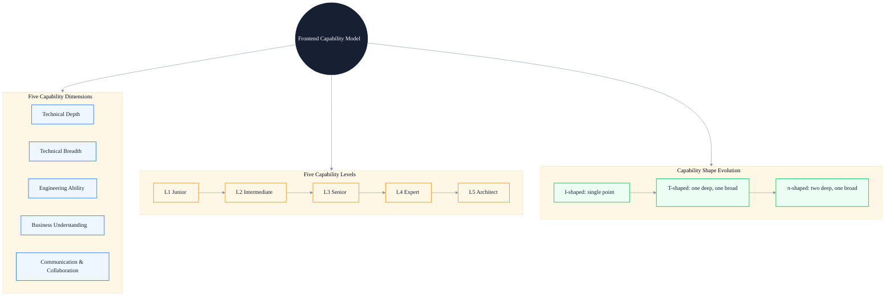
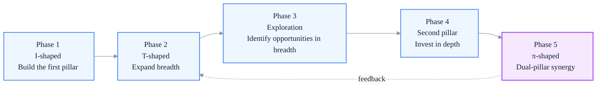

# Frontend Engineer Capability Model: A Growth Framework from T-Shaped to π-Shaped Talent

> Subtitle: Capability dimension division, five-level grading standards, T-shaped limitations and π-shaped construction, and radar-chart self-assessment methods.
>
> Target readers: Junior and intermediate frontend engineers seeking advancement, senior frontend engineers planning growth paths, and engineering managers defining talent standards.
>
> Reading time: ~25 minutes.

::: info In one sentence
A frontend engineer's capability is not "how many frameworks they know," but "whether they can stably deliver engineering value across multiple dimensions." From T-shaped to π-shaped, the essence is moving from single-point depth to dual-pillar synergy.
:::

## Table of Contents

- [Introduction](#introduction)
- [1. Why Redefine the Frontend Capability Model](#1-why-redefine-the-frontend-capability-model)
- [2. Five Dimensions of the Capability Model](#2-five-dimensions-of-the-capability-model)
- [3. Five-Level Capability Grading Standards](#3-five-level-capability-grading-standards)
- [4. Limitations of T-Shaped Talent](#4-limitations-of-t-shaped-talent)
- [5. π-Shaped Talent: Building Two Deep Pillars](#5-π-shaped-talent-building-two-deep-pillars)
- [6. Capability Radar Chart: Self-Assessment Method](#6-capability-radar-chart-self-assessment-method)
- [7. Common Capability Shortcomings and Breakthrough Strategies](#7-common-capability-shortcomings-and-breakthrough-strategies)
- [8. Engineering Applications of the Capability Model](#8-engineering-applications-of-the-capability-model)
- [Conclusion: The Capability Model Is a Map, Not a Ruler](#conclusion-the-capability-model-is-a-map-not-a-ruler)
- [FAQ](#faq)
- [Sources](#sources)

## Introduction

Many frontend engineers write annual goals like these:

- Learn React 18 new features.
- Learn Vue 3 source code.
- Learn Node.js.
- Learn TypeScript.

These goals are not wrong, but they all answer "what I can do," not "at what complexity I can stably deliver value." The result: many people finish learning a series of technologies but still solve problems of similar complexity; their capability ceiling is not truly raised.

::: info In one sentence
A capability model is not a technology checklist; it is a framework for measuring "at what complexity you can stably deliver what value."
:::

This article tries to build a truly usable capability model for frontend engineers. The core is not "what technologies you know," but decomposing capability into multiple measurable dimensions and using a grading standard to locate where you currently are, then planning what to improve next.

The following diagram shows the complete framework from capability dimensions to grading, and then to T-shaped / π-shaped evolution:

---

## 1. Why Redefine the Frontend Capability Model

Over the past decade, the boundaries of frontend roles have fundamentally changed:

- Around 2014, "knowing jQuery + Ajax" was enough.
- Around 2017, the expectation became "knowing an MVVM framework + build tools."
- Around 2020, the expectation added "understanding performance optimization and having engineering experience."
- After 2023, the expectation became "able to independently design systems, work across platforms, and collaborate across teams."

The expansion of role boundaries brings a direct problem: **measuring capability by "how many technologies you know" is becoming less and less accurate.**

Here is a real example. Both engineers "know React":

- Engineer A: Can complete page development within an existing scaffold; starts piling on Redux when state becomes complex; throws `memo` everywhere when performance issues arise.
- Engineer B: Can choose state solutions based on business complexity (Context / Zustand / custom-built); can locate that slow LCP is caused by an overly deep module graph; can identify code patterns in Code Review that may cause hydration issues.

The two look the same on a "technology checklist," but differ by an order of magnitude in "complexity they can solve."

::: tip Key takeaway of this section
The essence of a capability model is shifting from "what technologies you know" to "at what complexity you can stably deliver what value." The former is a checklist; the latter is capability.
:::

---

## 2. Five Dimensions of the Capability Model

Frontend engineer capability can be decomposed into five relatively independent dimensions, each with its own measurement standard.

### 1. Technical Depth

Technical depth refers to how deeply you can penetrate into a specific technology domain. For frontend engineers, the most common deep pillars are:

- **JavaScript / TypeScript as languages**: type systems, runtime, V8 execution model, GC, event loop.
- **Browser internals**: rendering pipeline, event loop, network stack, security model.
- **Framework source code and design philosophy**: React Fiber, Vue reactivity, Svelte compile-time optimization.

The measure of depth is not "how much source code you have read," but "when encountering a new problem, can you locate the root cause along the chain."

::: warning Common pitfall
Treating "having read the React source code" as equivalent to "having technical depth." Reading source code is only a means; depth is reflected in whether you can use source-level understanding to solve real engineering problems.
:::

### 2. Technical Breadth

Technical breadth refers to the breadth of awareness of different technology stacks and solutions. It answers the question "what options exist."

Typical manifestations of breadth:

- Knowing the applicable scenarios of SSR / SSG / ISR / Streaming SSR / Islands / Resumability.
- Knowing the differences and trade-offs among Webpack / Vite / Rollup / esbuild / Turbopack.
- Understanding the evolution of CSS solutions: CSS-in-JS / CSS Modules / Tailwind / CSS Modules + CSS Variables.

Breadth is not "being able to use," but "knowing it exists and being able to judge applicable scenarios." Breadth prevents you from being someone who "only has a hammer."

### 3. Engineering Ability

Engineering ability refers to the ability to turn code into a maintainable, evolvable, multi-person collaborative system. This is the dimension most underestimated in interviews but most decisive for success at work.

Specific manifestations of engineering ability:

- Able to design reasonable directory structures and module boundaries.
- Able to define Code Review standards and actually enforce them.
- Able to set up CI/CD, canary releases, monitoring, and alerting.
- Able to control code quality in multi-person collaboration (types, tests, lint, commit conventions).
- Able to identify and pay down technical debt rather than letting it accumulate indefinitely.

The core of engineering ability is **making it easier for others to continue working on your code.**

### 4. Business Understanding

Business understanding refers to whether you can step outside the "implement requirements" perspective and understand the business goals behind the requirements.

Levels of business understanding:

- L1: Can implement according to the PRD.
- L2: Can identify unreasonable parts in the PRD and raise technical counter-suggestions.
- L3: Can derive the priority of technical investment from business metrics.
- L4: Can proactively discover business opportunities and drive business outcomes through technical means.

Here is a concrete example. The product manager says, "Build a campaign landing page that supports custom configuration."

- Engineer at business understanding L1: directly builds a configuration backend + rendering page according to the requirement.
- Engineer at business understanding L3: first asks, "How often is it configured? Is it configured by operations or developers? How long is the campaign cycle?" — these questions directly determine whether to build a visual builder system or just a JSON Schema configuration.

### 5. Communication & Collaboration

Communication and collaboration refer to the ability to drive things forward in cross-role and cross-team scenarios.

Typical scenarios:

- Aligning requirement boundaries with product managers to avoid "starting implementation before the PRD is half written."
- Agreeing on interface contracts with backend engineers to avoid late integration rework.
- Communicating boundary cases with QA to avoid discovering untested critical paths only after launch.
- Driving technical solutions across teams and finding balance among stakeholders with different interests.

The core of communication and collaboration is not "being good at talking," but **being able to identify the concerns of different roles and drive decisions in a way the other party can accept.**

::: tip Key takeaway of this section
The five dimensions are relatively independent: a person can be strong in one dimension and weak in another. Growth is not "improving all five dimensions simultaneously," but "identifying shortcomings + strengthening pillars."
:::

---

## 3. Five-Level Capability Grading Standards

Combining the five dimensions, we can establish a five-level capability grading system. Each level is summarized in one sentence: **at what complexity can a person at this level independently complete what.**

```mermaid
%%{init: {'theme': 'base', 'themeVariables': { 'fontFamily': 'Inter, PingFang SC, Microsoft YaHei, sans-serif', 'primaryColor': '#FFF7E6', 'primaryTextColor': '#172033', 'primaryBorderColor': '#F59E0B', 'lineColor': '#8A94A6'}}}%%
flowchart LR
    subgraph L1["L1 Junior (0-2 years)"]
        L1A["Can complete explicit<br/>tasks under guidance"]
        L1B["Technical depth: single framework usage"]
        L1C["Engineering ability: follows conventions"]
    end

    subgraph L2["L2 Intermediate (2-4 years)"]
        L2A["Can independently complete<br/>module-level features"]
        L2B["Technical depth: understands framework mechanisms"]
        L2C["Engineering ability: writes maintainable code"]
    end

    subgraph L3["L3 Senior (4-6 years)"]
        L3A["Can independently own<br/>a complete business line"]
        L3B["Technical depth: browser / runtime"]
        L3C["Engineering ability: defines conventions"]
    end

    subgraph L4["L4 Expert (6-8 years)"]
        L4A["Can design complex systems<br/>and solve cross-team problems"]
        L4B["Technical depth: penetrates multiple domains"]
        L4C["Engineering ability: platform construction"]
    end

    subgraph L5["L5 Architect (8+ years)"]
        L5A["Can define technical direction<br/>and be responsible for business outcomes"]
        L5B["Technical depth: full-chain perspective"]
        L5C["Engineering ability: organization-level engineering system"]
    end

    L1 --> L2 --> L3 --> L4 --> L5

    classDef l1 fill:#ECFDF3,stroke:#22C55E,color:#172033,stroke-width:1.5px;
    classDef l2 fill:#EEF6FF,stroke:#3B82F6,color:#172033,stroke-width:1.5px;
    classDef l3 fill:#FFF7E6,stroke:#F59E0B,color:#172033,stroke-width:1.5px;
    classDef l4 fill:#F5E8FF,stroke:#A855F7,color:#172033,stroke-width:1.5px;
    classDef l5 fill:#FEE2E2,stroke:#EF4444,color:#172033,stroke-width:1.5px;

    class L1,L1A,L1B,L1C l1;
    class L2,L2A,L2B,L2C l2;
    class L3,L3A,L3B,L3C l3;
    class L4,L4A,L4B,L4C l4;
    class L5,L5A,L5B,L5C l5;
```

### L1 Junior (0-2 years)

**Core characteristic**: Can complete explicit tasks under guidance.

- **Technical depth**: Proficient in using one framework (React or Vue) to complete page development; understands the basic mechanisms behind common APIs (e.g., when `useState` triggers re-rendering).
- **Technical breadth**: Knows the HTML/CSS/JS triad; has heard of build tools but cannot configure them independently.
- **Engineering ability**: Can submit code following existing conventions; can accept feedback in Code Review and improve.
- **Business understanding**: Can implement according to the PRD; not sensitive to the business goals behind requirements.
- **Communication & collaboration**: Can sync progress within a small team; can proactively raise blockers.

**Measurement signal**: Given a clear design draft and interfaces, can independently complete a medium-complexity page within 3 days, with no more than 5 major bugs.

### L2 Intermediate (2-4 years)

**Core characteristic**: Can independently complete module-level features.

- **Technical depth**: Understands core framework mechanisms (e.g., Fiber, Reconciler, reactivity system); can locate common performance issues.
- **Technical breadth**: Familiar with build tool configuration; understands basic SSR principles; knows the evolution of state management solutions.
- **Engineering ability**: Can write maintainable code (reasonable abstraction, clear naming, single responsibility); can write effective unit tests.
- **Business understanding**: Can identify boundary cases in the PRD and raise technical counter-suggestions.
- **Communication & collaboration**: Can independently interface with backend and QA; can lead small-scale technical solution discussions.

**Measurement signal**: Can independently own a complete business module (e.g., checkout flow, user center) from design to launch without needing guidance from others.

### L3 Senior (4-6 years)

**Core characteristic**: Can independently own a complete business line.

- **Technical depth**: Can locate performance issues from browser low-level chains; understands V8 execution model, rendering pipeline, and network stack.
- **Technical breadth**: Can compare multiple solutions and provide selection rationale; has practical cross-platform experience (Web / RN / mini-programs).
- **Engineering ability**: Can define team conventions (Code Review standards, commit conventions, testing strategy); can set up monitoring and alerting.
- **Business understanding**: Can derive technical investment priorities from business metrics; can use technical means to improve business outcomes.
- **Communication & collaboration**: Can drive solutions across teams and find balance among stakeholders with different interests.

**Measurement signal**: Can independently own the technical solution of a business line and significantly improve its core metrics (performance, stability, R&D efficiency) within 3-6 months.

### L4 Expert (6-8 years)

**Core characteristic**: Can design complex systems and solve cross-team problems.

- **Technical depth**: Has penetrating understanding across multiple domains; can contribute to or fix framework-level issues at the source-code level.
- **Technical breadth**: Cross-stack vision (frontend + Node + infrastructure); can drive technology migration across different stacks.
- **Engineering ability**: Can lead platform construction (component libraries, toolchains, low-code platforms).
- **Business understanding**: Can identify business opportunities and drive business model innovation through technical means.
- **Communication & collaboration**: Can drive technical decisions at the organizational level and influence the technical direction of other teams.

**Measurement signal**: Can lead a cross-team technical project (e.g., company-wide frontend performance optimization, unified engineering platform) and produce measurable organization-level results.

### L5 Architect (8+ years)

**Core characteristic**: Can define technical direction and be responsible for business outcomes.

- **Technical depth**: Full-chain perspective; can locate root causes at any link.
- **Technical breadth**: Clear technology landscape; can judge "which technologies are worth investing in."
- **Engineering ability**: Organization-level engineering system design (R&D process, quality system, technology stack evolution roadmap).
- **Business understanding**: Can drive business strategy with technology and participate in business decisions.
- **Communication & collaboration**: Can translate among C-level executives, product owners, and technical teams.

**Measurement signal**: Can define the 1-3 year evolution direction of a business line or technical domain and be responsible for the final outcome.

::: warning Common pitfall
Treating "years of work experience" as equivalent to "capability level." Years are only a reference; the real grading standard is "the complexity of problems you can independently solve." People who reach L3 in 3 years exist, and people who remain at L2 after 10 years are also common.
:::

::: tip Key takeaway of this section
The essence of the five-level grading is not "rating," but "locating the boundary of complexity you can currently handle independently." The breakthrough point to the next level is often at the bottleneck of the current level.
:::

---

## 4. Limitations of T-Shaped Talent

"T-shaped talent" has been the most praised capability model over the past decade: the vertical bar represents depth, and the horizontal bar represents breadth.

For frontend engineers, the typical T-shaped profile is:

- Vertical: proficient in React / Vue frameworks.
- Horizontal: HTML/CSS/build tools/state management/basic backend.

Compared with "I-shaped" (only single-point depth), the T-shaped model is a huge advancement. But under today's complexity, its limitations are becoming increasingly obvious:

### 1. A Single Deep Pillar Is Prone to Obsolescence

If your deep pillar is "React usage," then changes such as React 18's concurrent model, Server Components, and Suspense for Data Fetching will devalue your depth.

If your deep pillar is "rendering pipeline + React scheduling model," then no matter how React evolves, your depth remains valid — because you understand the more fundamental and stable structures underneath.

### 2. A Single Deep Pillar Struggles with Cross-Domain Problems

Many real problems are not "frontend problems" or "backend problems," but "system problems."

For example, hydration performance issues require understanding:

- Browser rendering pipeline (frontend depth).
- Server execution model (Node/Edge depth).
- Framework SSR implementation (framework depth).

An engineer with only one deep pillar will lose judgment on cross-domain problems.

### 3. A Single Deep Pillar Struggles to Bear Architectural Responsibility

The essence of an architect's work is to make trade-offs across multiple uncertain dimensions. If you have only one deep pillar, your judgment will be dominated by that pillar, tending to "solve all problems with familiar solutions."

::: tip Key takeaway of this section
The T-shaped model was sufficient in 2015, but today a single deep pillar can no longer support the requirements of senior roles. It needs to evolve toward π-shaped.
:::

---

## 5. π-Shaped Talent: Building Two Deep Pillars

The essence of π-shaped talent: **two deep pillars + a certain breadth.**

For frontend engineers, common π-shaped combinations are:

- Pillar A: Frontend frameworks + browser internals (frontend depth).
- Pillar B: Node.js / server-side / cloud-native (backend depth).
- Breadth: cross-platform, engineering, performance optimization, business understanding.

The key to π-shaped is not "randomly picking two pillars," but **that the two pillars can synergize with each other.**

### 1. Criteria for Synergy

To judge whether two pillars have synergy, ask three questions:

1. **Can the depth of pillar A help pillar B solve more complex problems?**
   - Example: frontend framework depth → helps design better SSR solutions.
2. **Can the depth of pillar B help pillar A break through its ceiling?**
   - Example: server-side depth → helps implement BFF, Edge Computing, Streaming SSR.
3. **Can the combination of the two pillars solve problems that a single pillar cannot solve?**
   - Example: full-stack depth → leading the implementation of Islands Architecture.

If the answer to all three questions is "no," then it is just "two independent I-shapes pieced together," not a true π-shape.

### 2. Choosing the Second Pillar

The choice of the second pillar should not follow trends; it should be based on your business scenario.

| Business Scenario | Recommended Second Pillar |
| --- | --- |
| Mid- to back-office SaaS | Backend architecture + database design (BFF, permission model, data flow) |
| Consumer content / e-commerce | Performance engineering + CDN / edge computing |
| Cross-platform business | RN / Flutter / mini-program runtime |
| Tool / platform business | Compiler theory + IDE toolchain |
| AI applications | LLM application engineering + prompt engineering |

### 3. Building Path for π-Shaped Talent

Building π-shaped talent is not "make A top-level first, then start B." It is a more complex iterative process:

::: tip Key takeaway of this section
π-shaped is not "two T-shapes pieced together," but "two deep pillars with synergy." The choice of the second pillar should be based on business scenarios, not on following hot trends.
:::

---

## 6. Capability Radar Chart: Self-Assessment Method

An abstract capability model has no practical value if it cannot be applied to self-assessment. Below is a usable radar-chart assessment method.

### 1. Five-Dimension Scoring Table

For each dimension, self-rate on a scale of 1-5:

| Dimension | 1 point | 3 points | 5 points |
| --- | --- | --- | --- |
| Technical depth | Can use frameworks | Understands framework mechanisms | Can locate problems from low-level chains |
| Technical breadth | Only knows one stack | Knows multiple solutions and can choose | Cross-stack vision, can drive technology migration |
| Engineering ability | Follows conventions | Writes maintainable code | Defines conventions, leads platformization |
| Business understanding | Implements per PRD | Identifies boundary cases | Derives technical investment priorities from business metrics |
| Communication & collaboration | Syncs within team | Cross-functional alignment | Drives decisions across teams |

### 2. Scoring Discipline

The biggest risk of self-assessment is "feeling good about yourself." Three alignment methods:

1. **Substantiate with concrete events**: Every score must be supported by 1-2 concrete events. "I score 4 in communication and collaboration" — please name one cross-team decision you led in the last 3 months.
2. **Calibrate with colleagues**: Find 1-2 long-term collaborators and ask them to rate you on the same dimensions, then compare the differences.
3. **Compare externally**: Through technical communities, open-source contributions, and tech sharing, compare yourself with engineers at the same level.

### 3. Identifying "Shortcomings" vs. "Bottlenecks"

The essence of a radar chart is to identify improvement priorities. But note the distinction:

- **Shortcoming**: Significantly lower than other dimensions, limiting the overall level. For example, engineering ability at 2 points while others are at 4 points.
- **Bottleneck**: The capability most critical for breaking through from the current level to the next. For example, when moving from L3 to L4, business understanding and communication & collaboration are usually the bottlenecks.

Fixing shortcomings solves the "bucket effect"; breaking bottlenecks solves "growth stagnation." The priorities differ at different stages:

- L1→L2, L2→L3: prioritize fixing shortcomings.
- L3→L4, L4→L5: prioritize breaking bottlenecks.

::: tip Key takeaway of this section
The capability radar chart is a self-assessment tool, but it needs to be substantiated by concrete events, calibrated with colleagues, and compared externally; otherwise it is easy to fall into self-satisfaction.
:::

---

## 7. Common Capability Shortcomings and Breakthrough Strategies

### 1. "Pseudo Bottleneck in Technical Depth"

Many L2 engineers feel their "depth is insufficient," so they read the React source code or Vue source code, but after several months find that their work ability has not improved.

**Reason**: Depth is not "reading source code," but "using underlying understanding to solve problems." Reading source code without application scenarios cannot precipitate knowledge into capability.

**Breakthrough strategy**:

- Choose one recent online issue (performance, memory, stability).
- Locate the root cause from three perspectives: browser chain, framework mechanism, and runtime.
- Write the whole process into a technical article or team sharing.

This way, depth is no longer "what source code I have read," but "what problems I can solve."

### 2. "Insufficient Engineering Ability"

The biggest bottleneck from L2 to L3 is often engineering ability. Manifestations:

- The code you write is difficult for others to take over.
- You don't know how to define Code Review standards.
- Team code quality is chronically low but you don't know how to improve it.

**Breakthrough strategy**:

- Proactively take on Code Review work, reviewing at least 5 PRs per week.
- Lead one team convention definition (e.g., commit conventions, testing conventions).
- Build monitoring and alerting from scratch, converting team online issues into observable metrics.

Engineering ability can only be acquired by "doing engineering"; reading more articles is not enough.

### 3. "Superficial Business Understanding"

Many technical engineers' understanding of business stays at "knowing what this feature does." True business understanding needs to go one level deeper:

- What user problem does this feature solve?
- What business metrics does this feature affect?
- How is the ROI of this feature measured?

**Breakthrough strategy**:

- Proactively align with product managers on business goals, not just PRD details.
- Read business weekly reports and core metric dashboards to understand the impact of your work.
- Choose one core metric of a business line and proactively optimize it with technical means.

### 4. "Communication & Collaboration Only Within the Comfort Zone"

Many engineers communicate smoothly within the team, but stumble as soon as they cross teams. This is a typical bottleneck from L3 to L4.

**Reason**: The core of cross-team communication is not "explaining technology clearly," but "identifying the other party's interests + driving forward in a way the other party can accept."

**Breakthrough strategy**:

- Lead one cross-team technical project (e.g., unified login, performance optimization, component library co-construction).
- Before each cross-team communication, list "what the other party cares about, what the other party worries about, and what I can offer."
- Review the success/failure of each cross-team collaboration to find your own communication pattern.

::: warning Common pitfall
Using "I'm not good at communication" as an excuse for not growing. Communication and collaboration are learnable skills; the core is "identifying the other person's perspective + practicing feedback," not innate personality.
:::

::: tip Key takeaway of this section
Every capability shortcoming has a corresponding breakthrough strategy. The core principle is "using concrete events to verify capability improvement," not "reading more books / learning more technologies."
:::

---

## 8. Engineering Applications of the Capability Model

The capability model is not only a personal planning tool; it can also be applied to team management.

### 1. Hiring and Leveling

Use unified grading standards to evaluate candidates during hiring to avoid "giving a senior title just because they feel good." Specific practices:

- Define clear "complexity they can independently solve" for each level.
- Map interview questions to specific capability dimensions rather than "whether they know a certain API."
- Have multiple interviewers rate independently and calibrate differences.

### 2. Promotion Evaluation

The key question in promotion evaluation is not "how many years have they worked," but "whether they are stably outputting at the next level of complexity."

Signals to judge:

- Has the candidate had 2-3 events in the last 6 months proving stable output at the next level of complexity?
- Is the candidate already "too comfortable" at the current level, indicating capability overflow?
- Will the candidate's shortcomings limit their effectiveness at the next level?

### 3. Team Capability Map

Aggregating the capability radar charts of team members gives a team capability map:

- Which dimensions are team shortcomings (need to hire or cultivate)?
- Which dimensions have redundancy (can be used for cross-training)?
- Which members' capabilities can complement each other?

::: info Engineering insight
The application of the capability model in team management is essentially turning "capability" from a subjective judgment into a measurable, comparable, and plannable object.
:::

---

## Conclusion: The Capability Model Is a Map, Not a Ruler

The greatest value of a capability model is that it helps you no longer write annual plans that only say "learn React, learn Node, learn Rust."

It helps you answer more fundamental questions:

- Where am I now?
- What should I improve next?
- Which dimension is my shortcoming?
- What is my bottleneck?

But it is not a ruler — do not use it to label yourself or others. Capability is dynamic, while the model is static. The model helps you locate and plan, but real growth always happens in the process of solving concrete problems.

::: info In one sentence
The capability model is a map, not a destination. The value of a map is to help you decide where to go next, not to stand still arguing whether you are L3 or L4.
:::

---

## FAQ

### 1. I have worked for 5 years, but still feel like I am at L2. What went wrong?

Years of experience do not directly correspond to capability level. First do a radar-chart self-assessment to identify the real shortcoming. Common situations are: technical depth stays at "using frameworks" without precipitating into low-level chain understanding; or engineering ability stays at "writing code" without advancing to "defining conventions and leading platformization." After identifying the shortcoming, use concrete events to verify breakthroughs, rather than continuing to pile up technology checklists.

### 2. Are T-shaped and π-shaped really fundamentally different, or is it just conceptual hype?

T-shaped was effective around 2015 because frontend complexity was still within the range that a single pillar could cover. But today frontend involves SSR, Edge, cross-platform, AI, and other domains; a single deep pillar is no longer sufficient for cross-domain problems. π-shaped is not conceptual hype, but a response to the failure of a single deep pillar after complexity rises. The judgment standard is simple: in the last six months, was the hardest problem you encountered no longer solvable by a single deep pillar?

### 3. What should the second pillar of π-shaped be? Is there a standard answer?

There is no standard answer; it depends on business scenarios and personal interests. But there is a judgment principle: the second pillar should have synergy with the first pillar. For example, if the first pillar is frontend framework depth, choosing Node / server-side can synergize to solve SSR, BFF, and other problems; choosing AI engineering can synergize to solve LLM application frontend problems. If the second pillar cannot synergize with the first, it is just two independent I-shapes pieced together.

### 4. How can I make my capability radar-chart self-assessment more objective?

Three alignment methods: (1) every score must be supported by 1-2 concrete events; (2) ask long-term collaborators to rate you on the same dimensions and compare differences; (3) through technical communities, open-source contributions, and tech sharing, compare yourself with engineers at the same level. If you cannot name a concrete event for a score, that score is invalid.

### 5. How should team managers use the capability model for promotion evaluation?

The core question of promotion evaluation is "whether the candidate is stably outputting at the next level of complexity." Specific practices: in the last 6 months, has the candidate had 2-3 events proving stable output at the next level of complexity; is the candidate already "too comfortable" at the current level, indicating capability overflow; will the candidate's shortcomings limit their effectiveness at the next level. Avoid "promoting just because years of service are up."

---

## Sources

This article is based on industry practice and the author's experience. The five dimensions and five-level grading of the capability model reference engineer capability standards from multiple internet companies. The concept of π-shaped talent comes from observation of the expansion of frontend role boundaries.
