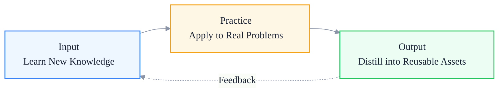

# Technical Growth Path: The Capability Leap from Junior to Architect

> Subtitle: Core characteristics of five stages, four key leaps, turning points and bottlenecks, and compounding effects.
>
> Target readers: Frontend engineers planning their next stage of growth, engineering managers identifying team member bottlenecks, and individual contributors considering whether to pursue architecture.
>
> Reading time: ~28 minutes.

::: info In one sentence
Technical growth is not a smooth climb but a series of "capability leaps." The essence of each leap is upgrading the object of your work from a concrete thing to a more abstract system.
:::

## Table of Contents

- [Introduction](#introduction)
- [1. The Non-linear Nature of Technical Growth](#1-the-non-linear-nature-of-technical-growth)
- [2. Core Characteristics of the Five Stages](#2-core-characteristics-of-the-five-stages)
- [3. Junior → Intermediate: From "Can Write" to "Writes Well"](#3-junior--intermediate-from-can-write-to-writes-well)
- [4. Intermediate → Senior: From Feature to System Thinking](#4-intermediate--senior-from-feature-to-system-thinking)
- [5. Senior → Expert: From Implementation to Design Abstraction](#5-senior--expert-from-implementation-to-design-abstraction)
- [6. Expert → Architect: From Technology to Global Vision](#6-expert--architect-from-technology-to-global-vision)
- [7. The Compounding Effect of Technical Growth](#7-the-compounding-effect-of-technical-growth)
- [Conclusion: A Leap Is Not About Working Harder, but Upgrading the Object of Work](#conclusion-a-leap-is-not-about-working-harder-but-upgrading-the-object-of-work)
- [FAQ](#faq)
- [Sources](#sources)

## Introduction

Many frontend engineers make an implicit assumption when planning their careers:

> As long as I keep learning technology and working on projects, my capabilities will improve linearly over time, and eventually I will naturally become an architect.

This assumption is wrong.

Technical growth is not a smooth climb but a series of stepwise leaps. Each leap requires a fundamental change in the object of work, the mode of thinking, and the value delivered. Without actively completing this transformation, 10 years of work and 3 years of capability are essentially the same — you have merely repeated 3 years of experience 7 times.

::: info In one sentence
The essence of technical growth is upgrading the object of work: from a piece of code, to a feature, to a system, to a domain, to a business.
:::

The following diagram shows the five-stage growth path from junior to architect, along with the core transformation required at each leap:

```mermaid
%%{init: {'theme': 'base', 'themeVariables': { 'fontFamily': 'Inter, PingFang SC, Microsoft YaHei, sans-serif', 'primaryColor': '#EEF6FF', 'primaryTextColor': '#172033', 'primaryBorderColor': '#6EA8FE', 'lineColor': '#8A94A6', 'secondaryColor': '#F7F9FC', 'tertiaryColor': '#FFF7E6'}}}%%
flowchart LR
    subgraph Stage1["Junior"]
        S1["Work Object: A Piece of Code<br/>Value: Complete Tasks"]
    end

    subgraph Stage2["Intermediate"]
        S2["Work Object: A Feature<br/>Value: Independent Delivery"]
    end

    subgraph Stage3["Senior"]
        S3["Work Object: A System<br/>Value: Own a Business Line"]
    end

    subgraph Stage4["Expert"]
        S4["Work Object: A Domain<br/>Value: Cross-team Influence"]
    end

    subgraph Stage5["Architect"]
        S5["Work Object: A Business<br/>Value: Define Direction"]
    end

    Stage1 -->|"Write Well"| Stage2
    Stage2 -->|"System Thinking"| Stage3
    Stage3 -->|"Abstract Design"| Stage4
    Stage4 -->|"Global Vision"| Stage5

    classDef s1 fill:#ECFDF3,stroke:#22C55E,color:#172033,stroke-width:1.5px;
    classDef s2 fill:#EEF6FF,stroke:#3B82F6,color:#172033,stroke-width:1.5px;
    classDef s3 fill:#FFF7E6,stroke:#F59E0B,color:#172033,stroke-width:1.5px;
    classDef s4 fill:#F5E8FF,stroke:#A855F7,color:#172033,stroke-width:1.5px;
    classDef s5 fill:#FEE2E2,stroke:#EF4444,color:#172033,stroke-width:2px;
    classDef leap fill:#FFF7E6,stroke:#F59E0B,color:#172033,stroke-dasharray: 4 3;

    class Stage1,S1 s1;
    class Stage2,S2 s2;
    class Stage3,S3 s3;
    class Stage4,S4 s4;
    class Stage5,S5 s5;
```



---

## 1. The Non-linear Nature of Technical Growth

First, understand a counterintuitive fact: **technical capability and years of experience are not linearly related; they are stepwise.**

If capability is on the vertical axis and years of experience on the horizontal axis, the real curve looks more like this:


Within each plateau, capability growth is slow because you are already close to the ceiling of that stage. Real capability growth happens during a "leap" — when you complete an upgrade of the object of work, the capability curve suddenly jumps to a new plateau.

This non-linear characteristic has two direct implications:

1. **A plateau cannot be broken through by "working harder"**: Working harder at your current stage only brings you closer to the ceiling; it does not raise the ceiling itself.
2. **A leap must be intentionally designed**: Leaps do not happen naturally. They require actively changing the object of work and the mode of thinking.

::: tip Key takeaway from this section

Technical growth is non-linear. Plateaus are accumulated by "doing better," while leaps are broken through by "upgrading the object of work." Identifying which stage you are currently in and whether you are near the ceiling is the prerequisite for planning growth.
:::

---

## 2. Core Characteristics of the Five Stages

Before diving into the specific leaps, here is a brief summary of the core characteristics of the five stages as a reference for the following discussion.

| Stage | Object of Work | Core Capability | Value Output | Typical Years |
| --- | --- | --- | --- | --- |
| Junior | A piece of code | Implement clear tasks | Complete development tasks | 0-2 years |
| Intermediate | A feature | Independently deliver modules | Independently complete features | 2-4 years |
| Senior | A system | Design technical solutions | Own a business line | 4-6 years |
| Expert | A domain | Cross-team drive | Platformization | 6-8 years |
| Architect | A business | Global trade-offs | Define technical direction | 8+ years |

The core question at each stage is different:

- Junior: "How do I write this feature?"
- Intermediate: "How do I write this feature well and make it maintainable by others?"
- Senior: "How should this system be designed to support the business for the next 1-2 years?"
- Expert: "What are the common problems in this domain, and can they be solved through platformization?"
- Architect: "Where should this business's technical investment be directed?"

The four leaps below answer the question of "how to upgrade from one problem to the next."

---

## 3. Junior → Intermediate: From "Can Write" to "Writes Well"

### 1. The Essence of the Leap

A junior engineer's core capability is "writing a feature" — given clear designs and interfaces, they can produce runnable code.

An intermediate engineer's core capability is "writing a feature well" — code that is maintainable, testable, and extensible, and can independently handle edge cases and exceptions.

The essence of this leap is **from "implementing a feature" to "implementing an engineered feature."**

### 2. Key Transformations

#### Transformation 1: From "As Long As It Runs" to "Maintainable Code"

Code written by junior engineers often has these characteristics:

```javascript
// Typical junior code: works but is hard to maintain
function handleSubmit() {
  const name = document.getElementById('name').value
  const age = document.getElementById('age').value
  if (name && age) {
    fetch('/api/user', {
      method: 'POST',
      body: JSON.stringify({ name, age })
    }).then(res => {
      if (res.ok) {
        alert('Success')
      } else {
        alert('Failed')
      }
    })
  }
}
```

An intermediate engineer would write code like this:

```typescript
// Mid-level code: abstract, typed, with error handling
interface UserData {
  name: string
  age: number
}

async function createUser(data: UserData): Promise<Result<User, ApiError>> {
  try {
    const response = await fetch('/api/user', {
      method: 'POST',
      body: JSON.stringify(data)
    })
    if (!response.ok) {
      return { ok: false, error: await parseApiError(response) }
    }
    return { ok: true, value: await response.json() }
  } catch (e) {
    return { ok: false, error: { type: 'network' } }
  }
}

async function handleSubmit(values: FormValues) {
  const result = await createUser(values)
  if (result.ok) {
    notify.success('Created successfully')
  } else {
    notify.error(formatApiError(result.error))
  }
}
```

The difference is not "knowing TypeScript" but a transformation across three dimensions:

- **Typed thinking**: Clarify the shape of the data before writing the implementation.
- **Error-handling thinking**: All external calls can fail; errors should be explicit.
- **Abstract thinking**: API calls, UI notifications, and form submission are different concerns and should be separated.

#### Transformation 2: From "Works for Me" to "Others Can Take Over"

Junior engineers often write code that "only they can understand": abbreviated variable names, magic numbers, implicit dependencies, and a lack of documentation.

Intermediate engineers start to ask, "If I leave, how long would it take someone else to take over this code?" Specific manifestations:

- Clear naming; avoid meaningless names like `data1`, `temp`, or `handle`.
- Key logic has comments explaining "why it is done this way," not "what it does."
- Public functions have simple JSDoc describing parameters and return values.
- Complex business logic has brief design explanations.

#### Transformation 3: From "I Tested It; It Should Be Fine" to "Protected by Tests"

For junior engineers, "testing" means manually clicking around a few times and thinking, "It should be fine."

Intermediate engineers write unit tests, at least covering core logic:

- Utility functions have complete tests.
- Key business logic has path coverage.
- Edge cases have explicit tests.

### 3. Key Turning Point

The turning point for this leap is **the first time you take over someone else's code**.

When you painfully maintain poorly written code by someone else, you suddenly realize: "If they had written it this way back then, I wouldn't be working so hard now." At that moment, you begin to leap from "can write" to "writes well."

### 4. Common Bottlenecks

#### Bottleneck 1: Getting Stuck in Framework Documentation

Many junior engineers think that "intermediate = knowing more framework APIs," so they keep learning new features of React, Vue, and Angular. But this is the wrong direction — no matter how many APIs you learn, the code you write can still be hard to maintain.

**Breakthrough**: Pick a feature you recently wrote and actively ask a senior engineer for an in-depth code review. Focus on "why this is not written well" rather than "what APIs I haven't learned yet."

#### Bottleneck 2: Stagnant Business Understanding

Junior engineers are easily consumed by "implementing requirements" and do not think about the business goals behind the requirements. The result is that after one year, they are still at the level of "writing code according to the PRD."

**Breakthrough**: Ask yourself once a week, "What user problem does this requirement solve?" Accumulate business understanding over the long term.

::: tip Key takeaway from this section

The leap from junior to intermediate is from "implementing a feature" to "implementing an engineered feature." The core is a comprehensive upgrade in code quality, maintainability, and testing awareness — not learning more APIs.
:::

---

## 4. Intermediate → Senior: From Feature to System Thinking

### 1. The Essence of the Leap

An intermediate engineer's object of work is "a feature" — able to independently complete something from design to launch.

A senior engineer's object of work is "a system" — how multiple features combine, how data flows, and how to support the long-term development of the business.

The essence of this leap is **from a "feature perspective" to a "system perspective."**

### 2. Key Transformations

#### Transformation 1: From "Implementing Requirements" to "Designing Technical Solutions"

When an intermediate engineer receives a requirement, the first reaction is "how to implement it."

When a senior engineer receives a requirement, the first reaction is "how will this requirement affect the system":

- What new data will this requirement introduce?
- What is the relationship between this data and existing data?
- How might this requirement be extended in the future?
- Can this requirement reuse underlying capabilities from existing features?

Here is a concrete example. The requirement is "add a batch export feature to the user list."

An intermediate engineer's thinking:

```text
1. Add an export button.
2. Call the backend API to get data.
3. Use SheetJS to generate an Excel file.
4. Trigger a download.
```

A senior engineer's thinking:

```text
1. Will this export feature be extended in the future? (e.g., export PDF, export selected columns)
   → If yes, it should be abstracted into a unified export capability.
2. How large is the data volume? Synchronous export or asynchronous task?
   → Large data volumes require backend taskization with frontend polling.
3. How is export permission controlled? How does it integrate with the existing permission system?
   → It cannot be a separate system; it must reuse the permission system.
4. How are export failures reported? Is retry needed?
   → Failures must be observable and have a retry mechanism.
```

The difference is not "implementation ability" but "dimension of thinking." Before starting, a senior engineer has already thought through the impact on the entire system.

#### Transformation 2: From "Local Optimum" to "Global Trade-off"

Intermediate engineers' optimizations are often local: "This component renders slowly; add memo."

Senior engineers look at problems globally:

- Why is this component rendering slowly? Is it a data structure problem or a design problem?
- Does adding memo treat the symptom or the root cause? Will it introduce new memory issues?
- If we don't optimize, what is the actual impact on user experience?
- Is the cost-benefit ratio of the optimization reasonable?

#### Transformation 3: From "Writing Well Myself" to "Team Standards"

Intermediate engineers can write good code, but only take responsibility for their own code.

Senior engineers begin to establish team standards, replicating their "good" across the entire team:

- Define a code review checklist.
- Drive commit standards, lint rules, and test coverage thresholds.
- Design the team's tech stack and directory structure standards.
- Lead technical sharing and documentation.

### 3. Key Turning Point

The turning point for this leap is usually **the first time you independently own a complete business module**.

When you need to design a module's technical solution from scratch, consider future extensions, and align with multiple stakeholders, you are forced to upgrade from a "feature perspective" to a "system perspective."

### 4. Common Bottlenecks

#### Bottleneck 1: Insufficient Technical Depth to Locate Root Causes

Intermediate engineers can locate "which component is slow," but not "why it is slow" — because the latter requires understanding the browser rendering pipeline, framework scheduling mechanisms, and the V8 execution model.

**Breakthrough**: Pick a real performance issue, start with browser DevTools, and gradually dig into the rendering pipeline, framework source code, and runtime mechanisms. Write the whole process down.

#### Bottleneck 2: Lack of Cross-functional Alignment Ability

Intermediate engineers are used to "handling things themselves," but senior engineers need to frequently align with product, backend, and QA. This transformation is painful for many people.

**Breakthrough**: Actively take on a cross-functional project, such as a complex requirements review, a cross-end integration, or a post-incident retrospective. These scenarios force you to practice cross-functional communication.

#### Bottleneck 3: Business Understanding Stuck at "Implementing the PRD"

Although intermediate engineers can identify edge cases in PRDs, they lack an overall understanding of the business, leading to technical solutions that are often "over-engineered" or "under-engineered."

**Breakthrough**: Spend 1-2 months actively learning the core metrics, user personas, and business model of the business line you are responsible for. This is the key to moving from "feature engineer" to "system engineer."

::: tip Key takeaway from this section

The leap from intermediate to senior is from a "feature perspective" to a "system perspective." The core is a comprehensive upgrade in technical solution design, global trade-off, and team standard-setting abilities.
:::

::: warning Common pitfall

Equating "knowing more tools" with senior capability. Knowing Webpack, Vite, and Turbo Pack does not make you a senior engineer; making the right choices in specific scenarios does.
:::

---

## 5. Senior → Expert: From Implementation to Design Abstraction

### 1. The Essence of the Leap

A senior engineer's object of work is "a system" — able to design technical solutions and own a business line.

An expert's object of work is "a domain" — commonalities across multiple systems, platformization capabilities, and cross-team influence.

The essence of this leap is **from "solving specific problems" to "identifying patterns and abstracting."**

### 2. Key Transformations

#### Transformation 1: From "Solving Problems" to "Eliminating Problems"

Senior engineers solve specific problems: this page is slow; let me optimize it.

Experts identify problem patterns: Why are pages across our team generally slow? Is it a missing engineering system, inadequate standards, or a problematic component library design?

For example, five business lines in the team are repeatedly implementing "paginated table + filters + export."

- Senior engineer: Refactor all five implementations into a unified component.
- Expert: Recognize this as a common problem in admin backends and design a low-code platform so that non-core businesses can generate pages through configuration.

The difference is: senior engineers solve "repetition," while experts eliminate "the cause of repetition."

#### Transformation 2: From "Technical Solution" to "Domain Design"

Senior engineers design technical solutions: how to implement this feature, what tech stack to use, how to extend it.

Experts design domain models: what are the core concepts in this domain, where different businesses differ, and how to abstract reusable models.

Typical examples of domain abstraction:

- When designing a component library, do not just pile up components; abstract a three-layer model of "atomic components / composite components / business components."
- When designing a monitoring system, do not just pile up metrics; abstract a three-layer indicator system of "performance / stability / business."
- When designing an engineering platform, do not just pile up tools; abstract four domains: "build / deploy / monitor / govern."

#### Transformation 3: From "Within-team Influence" to "Cross-team Influence"

Senior engineers' scope of influence is the business line they own.

Experts need to drive things in cross-team scenarios:

- Lead cross-team technical projects (such as unified login, performance optimization, and component library co-construction).
- Participate in decision-making at the technical committee level.
- Influence the technical direction of other teams.

The key to cross-team drive is not "being technically stronger" but "being able to identify different teams' needs + find win-win points + push forward in a way the other party can accept."

### 3. Key Turning Point

The turning point for this leap is usually **the first time you lead a cross-team project**.

When you find that the way you communicate within your team cannot drive a cross-team project, you are forced to upgrade your thinking mode: from "explaining the technology clearly" to "identifying interests + designing win-win outcomes."

### 4. Common Bottlenecks

#### Bottleneck 1: Stagnant Technical Depth

Many senior engineers' technical depth stagnates at the L3 stage — they can locate common performance issues, but are helpless when facing deep issues (such as abnormal GC behavior, cross-process communication costs, or JIT deoptimization).

**Breakthrough**: Select 1-2 underlying domains for deep penetration, such as fully understanding the V8 execution pipeline, Chromium rendering architecture, or the HTTP/3 protocol. This depth gives you "authority" in cross-team scenarios.

#### Bottleneck 2: Lack of Abstraction Ability

Senior engineers are used to "solving specific problems," but abstraction ability requires deliberate practice.

**Breakthrough**:

- After solving each common problem, ask yourself, "Can this type of problem be fundamentally eliminated?"
- Lead a platformization project (component library, toolchain, low-code platform).
- Learn Domain-Driven Design (DDD) and understand how to abstract domain models from business.

#### Bottleneck 3: Insufficient Cross-team Drive Ability

This is the most common bottleneck in the L3 → L4 leap. The manifestation is "technically strong, but cross-team projects always fail to move forward."

**Breakthrough**:

- Lead a cross-team project and identify in advance "which teams need to cooperate, what each cares about, and where potential resistance lies."
- Before each cross-team meeting, prepare an "other-party perspective" analysis: Why should the other party cooperate with me? What concerns do they have?
- Retrospect on every cross-team collaboration to find your own communication blind spots.

::: tip Key takeaway from this section

The leap from senior to expert is from "solving specific problems" to "identifying patterns and abstracting." The core is a comprehensive upgrade in abstraction ability, domain design ability, and cross-team drive ability.
:::

---

## 6. Expert → Architect: From Technology to Global Vision

### 1. The Essence of the Leap

An expert's object of work is "a domain" — able to do platformization in that domain and influence across teams.

An architect's object of work is "a business" — able to make trade-offs across multiple domains, define technical direction, and be responsible for business outcomes.

The essence of this leap is **from "technical optimum" to "global optimum."**

### 2. Key Transformations

#### Transformation 1: From "Technology-driven" to "Business-driven"

Experts' technical decisions tend to be "technically optimum" oriented: this solution has better performance, stronger scalability, and is more elegant.

Architects' technical decisions are "business optimum" oriented:

- How much impact will this technical investment have on business metrics?
- Is the cost (human resources, time, maintenance) of this solution reasonable?
- Does this solution align with the business's development direction in the next 1-2 years?
- If the business direction changes, how much sunk cost will this solution incur?

A concrete example: the team discusses "whether to build a state management library in-house."

- Expert perspective: Building in-house can better fit business needs, perform better, and offer more control.
- Architect perspective: Building in-house requires 2 person-months of development plus ongoing maintenance costs. Will the business expand to the point of needing in-house development in the next year? If not, is an open-source solution plus an adapter layer more appropriate?

#### Transformation 2: From "Single-domain Depth" to "Cross-domain Trade-offs"

Experts have depth in their own domain, but when making cross-domain decisions, they tend to be "centered on their own domain."

Architects need to make trade-offs across multiple domains:

- Performance vs. development efficiency.
- Stability vs. iteration speed.
- Technical advancement vs. team adoption ability.
- Short-term gains vs. long-term investment.

The essence of trade-offs is "identifying what matters most to the business; everything else can be compromised."

#### Transformation 3: From "Technical Leadership" to "Organizational Leadership"

Experts' leadership is reflected in technical direction: what tech stack the team should use, how systems should be designed.

Architects' leadership is reflected at the organizational level:

- How should team structure be designed (by business line / by technical domain / by platform)?
- How should talent structure be configured (ratio of senior / intermediate / junior)?
- How should the tech stack evolution roadmap be planned (which technologies to invest in, which to retire)?
- How should team effectiveness be measured (not just lines of code, but business results + engineering quality + talent growth)?

### 3. Key Turning Point

The turning point for this leap is **the first time you take full responsibility for business outcomes**.

When you realize that you are not just "completing technical projects" but are responsible for the business's core metrics (such as GMV, retention, and conversion rate), your perspective is forced to expand from "technology" to "business + organization + technology."

### 4. Common Bottlenecks

#### Bottleneck 1: Technical Inertia, Unable to Break Out of the "Technical Perspective"

Many experts, after becoming architects, still habitually view problems from a technical perspective — when business stakeholders propose requirements, their first reaction is "how to implement" rather than "whether this requirement is worth doing."

**Breakthrough**:

- Actively participate in business planning meetings to understand business strategy and priorities.
- Establish regular communication with business leaders, not just listening to technical requests.
- Learn business analysis methods: user funnels, ROI calculation, and business models.

#### Bottleneck 2: Lack of Organizational Design Ability

Architects do not just design technical architecture; they also design team architecture. This is a blind spot for many experts.

**Breakthrough**:

- Learn Conway's Law: system architecture and team architecture influence each other.
- Observe the pros and cons of different team structures: functional teams vs. business teams vs. platform teams.
- Actively participate in team building, talent hiring, and performance evaluation design.

#### Bottleneck 3: Losing Technical Sensitivity

Some architects, after moving up, become so busy with business and organizational affairs that their technical sensitivity declines, eventually becoming "people who only draw PPTs."

**Breakthrough**:

- Keep at least 20% of your time for deep technical work (code review, critical issue troubleshooting, technical pre-research).
- Regularly have 1:1s with frontline engineers to understand real technical problems.
- Retain a technical domain that you continuously follow so you do not become completely disconnected from code.

::: tip Key takeaway from this section

The leap from expert to architect is from "technical optimum" to "global optimum." The core is a comprehensive upgrade in business-driven decision-making, cross-domain trade-offs, and organizational leadership.
:::

::: warning Common pitfall

Thinking that an architect is someone who "draws architecture diagrams." Architecture diagrams are just artifacts; the core ability of an architect is "making trade-offs across multiple uncertain dimensions and being responsible for the results."
:::

---

## 7. The Compounding Effect of Technical Growth

The previous four sections discussed "leaps," but leaps do not fall from the sky. What supports leaps is continuous accumulation during plateaus. The essence of this accumulation is the **compounding effect**.

### 1. The Three Elements of Compounding: Input, Practice, Output

The compounding effect of technical growth comes from a closed loop of three links:



#### Input: Learning New Knowledge

Input is not "scrolling through tech news" but learning with purpose. Three levels:

- **L1 input**: Reading tech articles and watching video tutorials. Passive reception, low retention.
- **L2 input**: Reading classic books, official documentation, and source code. Systematic learning, medium retention.
- **L3 input**: Learning with a specific problem in mind. For example, reading the React SSR implementation to solve a hydration problem. High retention.

The core of effective input is "learning with a problem," not "learning first and using later."

#### Practice: Apply to Real Problems

Practice is the key to compounding. Without practice, input is quickly forgotten.

The key to practice is "real problems" — not writing demos, but using new knowledge to solve problems in real business scenarios. The complexity of real problems exposes blind spots in learning.

#### Output: Distill into Reusable Assets

Output is the amplifier of compounding. Without output, practice can only precipitate into personal experience; with output, practice can precipitate into reusable assets.

Forms of output:

- Technical articles / team sharing: Write down the process of solving a problem.
- Open-source contributions / internal component library: Precipitate general solutions into code.
- Technical standards / checklists: Precipitate experience into team standards.
- Training / mentorship: Pass experience on to others.

### 2. The Non-linear Nature of Compounding

The core of compounding is non-linearity:

- Year 1: Output one technical note per week; capability improvement is not obvious.
- Year 2: Previous notes become references; problem-solving speed accelerates.
- Year 3: Accumulated notes can be combined into systematic articles / sharing.
- Year 5: Systematic output makes you a "domain expert" within the team.

But many people cannot persist until the compounding inflection point. A common situation is: after writing technical notes for 3 months without seeing obvious results, they give up.

::: tip Key takeaway from this section

The essence of the compounding effect is a closed loop of "input — practice — output." All three links are indispensable. The inflection point of compounding usually appears after 2-3 years; giving up before the inflection point is the biggest waste.
:::

### 3. The Engineering Method of Compounding

To put compounding into daily practice, use the "3-3-3 principle":

- **3 hours of input per week**: Read source code, official documentation, and classic books.
- **3 deep practices per week**: Apply new knowledge in real business scenarios.
- **3 outputs per month**: Technical sharing, articles, or code review summaries.

This pace may not seem fast, but after one year, there will be significant compounding: 50+ technical notes, 150+ deep practices, and 36+ outputs. This is the capability foundation for moving from L2 to L3 and from L3 to L4.

::: info Engineering insight

Compounding is not "working harder" but "establishing a sustainable rhythm." 3-3-3 per week is more effective than cramming 30 hours per month — because compounding relies on consistency, not intensity.
:::

---

## Conclusion: A Leap Is Not About Working Harder, but Upgrading the Object of Work

Returning to the question at the beginning: Why are people with 10 years of work and 3 years of capability essentially the same?

The answer is: **They are solving problems of the same complexity, just repeating them for 7 years.**

Real growth happens through upgrades of the object of work:

- From "a piece of code" to "a feature."
- From "a feature" to "a system."
- From "a system" to "a domain."
- From "a domain" to "a business."

Each upgrade increases the scale, impact scope, and uncertainty of the problems you face by an order of magnitude. This upgrade does not happen naturally; it requires intentional design:

- Actively take on tasks slightly harder than your current capability.
- Actively expand from "writing well yourself" to "team standards."
- Actively expand from a "technical perspective" to a "business perspective."
- Actively expand from "your own team" to "cross-team."

The process of leaping is painful — you are forced to abandon familiar ways of working and learn new modes of thinking. But this pain is worthwhile, because every leap moves your capability curve to a new plateau.

::: info In one sentence

Technical growth is not about working harder, but about upgrading the object of work. Identifying your current object of work and actively seeking the next one is the core of planning growth.
:::

---

## FAQ

### 1. I have been working for 4 years and am still doing "implementing the PRD" work. How do I break through?

First determine whether it is "the team is not giving you opportunities" or "you are not actively seeking them." If it is the former, you can try: (1) actively communicate your growth aspirations with your leader and fight for participation in more complex projects; (2) actively do "above expectations" work in your current job, such as proactively considering extensibility when doing requirements, proactively writing tests, and proactively doing performance analysis. If it is the latter, you need to reflect on whether you have always stayed in your comfort zone — growth requires actively taking on tasks slightly harder than your current capability.

### 2. Do leaps require changing companies? Can multiple leaps be completed within one company?

Yes, but under conditions. The premise of completing multiple leaps within one company is: (1) the company's business is growing and continuously producing new complexity; (2) the team has reasonable promotion paths and training mechanisms; (3) you can actively fight for work beyond your current level. If none of the three conditions are met, changing companies may be a more effective way to leap. But note: changing companies only changes the environment, not the object of work, and will not bring a real leap.

### 3. I have been working for 6 years and am at L3, but L4 feels far away. What should I do?

The L3 → L4 leap is one of the hardest because it involves the transformation from "within-team influence" to "cross-team influence." First identify your specific bottleneck: (1) insufficient technical depth? Pick an underlying domain for deep penetration; (2) insufficient abstraction ability? Lead a platformization project; (3) insufficient cross-team drive ability? Actively take on a cross-team project. The most important thing is: L4 requires actively creating opportunities, not waiting for opportunities to be assigned. If there are no cross-team projects in your current team, you can initiate one yourself.

### 4. Is the compounding effect really useful? I have been writing technical notes for a year and don't feel much capability improvement.

The inflection point of compounding usually appears after 2-3 years; not seeing results after 1 year is normal. But also check the quality of your "output": (1) Are you just taking copycat notes? This kind of output has low value; (2) Are you not combining it with practice? Writing without practicing will not precipitate knowledge into capability; (3) Are you not forming a system? Scattered notes are less valuable than systematic output. It is recommended to reorganize scattered notes into "a complete solution to a specific problem"; this kind of output has higher value.

### 5. Does an architect have to do management? How do I choose between the technical expert path and the management path?

Architect and engineering manager are two different directions. The core of an architect is "making technical trade-offs across multiple uncertain dimensions," while the core of an engineering manager is "getting results through the team." The two overlap but are not identical. Which path to choose depends on personal preference: choose architect if you like deep technical trade-offs, and choose management if you like leading teams to get results. Both paths can reach the L5 level; there is no need to force the idea that "an architect must do management."

---

## Sources

This article is based on industry practice and the author's experience. The five-stage growth model references the engineering ladder systems of multiple Internet companies; the "input-practice-output" framework for the compounding effect comes from long-term personal practice and observation.
