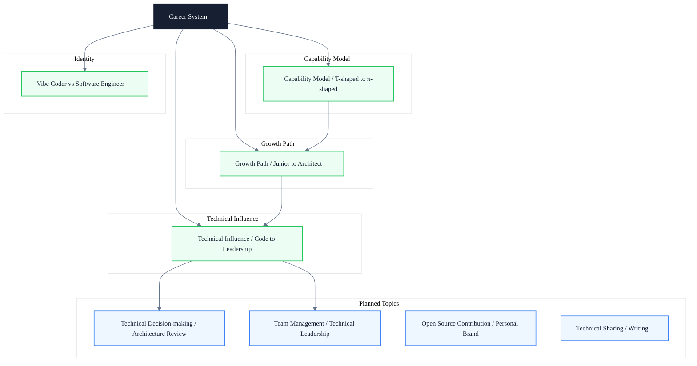

# Career System

> Subtitle: From capability models to technical influence — building a quantifiable growth path, not vague advice

---

## Module Positioning

The growth of a frontend engineer is not automatic promotion after writing code for a few more years. It requires actively building a capability model, planning a technical path, and accumulating technical influence. This module does not offer vague advice like "read more source code" or "solve more problems." Instead, it decomposes growth into quantifiable capability dimensions, executable growth ladders, and observable influence signals.

The capability model answers "where am I now and what am I missing," the growth path answers "what capabilities does the next level require and how to cross the bottleneck," and technical influence answers "how is my work seen by the organization and how to amplify leverage." Together they form a closed loop from self-assessment to external output, reinforced by a sense of identity that keeps the growth direction from drifting with short-term trends.

Whether you are a junior engineer just starting out or a mid-to-senior engineer aiming to break through to architect, you can find the corresponding advancement framework in this module.

---

## Knowledge Map

---

## Core Topics

- **Capability model** ✓ Published — T-shaped vs π-shaped talent, quantified dimensions of technical depth and breadth, capability radar charts
- **Growth path** ✓ Published — Key leap points and bottlenecks from junior → intermediate → senior → staff → architect
- **Technical influence** ✓ Published — Layered progression from code contributions, technical sharing, open-source participation, technical decision-making, to team enablement
- **Identity** ✓ Published — Essential difference between Vibe Coder and software engineer, engineer identity
- **Technical decision-making & architecture review** ◯ Planned — Architecture Decision Records (ADR), technical review mechanisms and trade-off methods
- **Team management & technical leadership** ◯ Planned — Technical management track, people development, performance assessment and team effectiveness
- **Open source contribution & personal brand** ◯ Planned — Open source strategy, community participation, technical writing and personal influence
- **Technical sharing & writing** ◯ Planned — Technical expression, presentation structure, knowledge consolidation and dissemination

---

## Learning Path

1. **Build a capability coordinate system**: Read "Frontend Engineer Capability Model," complete a self capability radar chart, and identify depth and breadth gaps
2. **Plan the leap ladder**: Read "Technical Growth Path," compare the gap list between current level and target level, and find key bottlenecks
3. **Amplify leverage**: Read "Building Technical Influence," identify your current influence level, and plan outputs for the next level
4. **Calibrate identity**: Read "Vibe Coder vs Software Engineer," reflect on engineer identity and long-term value orientation
5. **Expand on demand**: Choose the most relevant direction among planned topics such as technical decision-making, team management, open source contribution, and technical sharing

---

## Article Guide

- [Frontend Engineer Capability Model: From T-shaped to π-shaped Talent](/en/career/capability-model) — Quantify capability dimensions to avoid the feeling of "knowing a little about everything"
- [Technical Growth Path: From Junior to Architect](/en/career/growth-path) — Key capabilities, typical bottlenecks, and breakthrough methods at each level
- [Building Technical Influence: From Code Contribution to Technical Leadership](/en/career/technical-influence) — Five levels of influence and observable signals
- [Vibe Coder vs Software Engineer](/en/career/vibe-coder-vs-software-engineer) — The essential difference between two engineer identities and long-term value orientation

---

## Intended Readers

- Junior and intermediate frontend engineers who want to clarify the next stage of growth
- Senior and staff engineers who want to break through to architect or technical lead
- Engineering managers who need to build team capability assessment and cultivation systems
- Engineers who want to shift from "code producer" to "technical influencer"

---

## Extended Resources

- [Staff Engineer](https://staffeng.com/) — Will Larson's case collection of Staff engineer career paths
- [The Pragmatic Engineer](https://www.pragmaticengineer.com/) — In-depth newsletter from an engineer's perspective, hosted by Gergely Orosz
- *The Software Engineer's Guidebook* by Gergely Orosz — A complete growth manual from junior to Staff
- *Staff Engineer: Leadership beyond the management track* by Will Larson — The technical leadership path beyond the management track
