# Building Technical Influence: From Code Contribution to Technical Leadership

> Subtitle: Four-layer influence model, building paths at the code/team/organization/industry levels, the nature of technical leadership, and transition traps
>
> Target readers: Senior frontend engineers seeking to expand their influence, expert engineers building organization-level impact, and technical experts considering a move into technical management
>
> Reading time: ~26 minutes

::: info In one sentence
The essence of technical influence is making the value produced by your capabilities exceed the code you personally write — from "doing well yourself" to "making the system better" to "making the organization better."
:::

## Table of Contents

- [Introduction](#introduction)
- [1. The Four-Layer Model of Technical Influence](#1-the-four-layer-model-of-technical-influence)
- [2. Code Level: High-Quality Output and Open Source Contribution](#2-code-level-high-quality-output-and-open-source-contribution)
- [3. Team Level: Technical Standards, Code Review, and Knowledge Retention](#3-team-level-technical-standards-code-review-and-knowledge-retention)
- [4. Organization Level: Architecture Decisions, Cross-Team Collaboration, and Technical Evangelism](#4-organization-level-architecture-decisions-cross-team-collaboration-and-technical-evangelism)
- [5. Industry Level: Technical Talks, Articles, and Open Source Projects](#5-industry-level-technical-talks-articles-and-open-source-projects)
- [6. The Nature of Technical Leadership](#6-the-nature-of-technical-leadership)
- [7. Transition Traps from Technical Expert to Technical Manager](#7-transition-traps-from-technical-expert-to-technical-manager)
- [Conclusion: Influence Is an Amplifier, Not a Substitute](#conclusion-influence-is-an-amplifier-not-a-substitute)
- [FAQ](#faq)
- [Sources](#sources)

## Introduction

Many senior frontend engineers feel confused at a certain stage of career development:

> My technical skills are already strong, but why is my influence in the team still limited? Why can't I push cross-team projects forward? Why are my technical proposals always rejected?

The essence of this confusion is: **equating "technical capability" with "technical influence."**

Technical capability is "what you can do yourself"; technical influence is "what you can make others do." The two are related but not equal. A person can have strong technical skills but weak influence (the typical "lone wolf" engineer), or moderate technical skills but strong influence (the typical "amplifier" engineer).

::: info In one sentence
The essence of technical influence is making the value produced by your capabilities exceed the code you personally write. From "doing well yourself" to "making the system better" to "making the organization better."
:::

The diagram below shows the four-layer model of technical influence and the core capabilities corresponding to each layer:

```mermaid
%%{init: {'theme': 'base', 'themeVariables': { 'fontFamily': 'Inter, PingFang SC, Microsoft YaHei, sans-serif', 'primaryColor': '#EEF6FF', 'primaryTextColor': '#172033', 'primaryBorderColor': '#6EA8FE', 'lineColor': '#8A94A6', 'secondaryColor': '#F7F9FC', 'tertiaryColor': '#FFF7E6'}}}%%
flowchart TB
    Core((Technical Influence))

    subgraph L1["L1 Code Level"]
        direction LR
        L1A[High-Quality Output]
        L1B[Open Source Contribution]
        L1C[Technical Blog]
    end

    subgraph L2["L2 Team Level"]
        direction LR
        L2A[Technical Standards]
        L2B[Code Review]
        L2C[Knowledge Retention]
        L2D[Mentorship]
    end

    subgraph L3["L3 Organization Level"]
        direction LR
        L3A[Architecture Decisions]
        L3B[Cross-Team Collaboration]
        L3C[Technical Evangelism]
        L3D[Technical Strategy]
    end

    subgraph L4["L4 Industry Level"]
        direction LR
        L4A[Technical Talks]
        L4B[In-Depth Articles]
        L4C[Open Source Projects]
        L4D[Standard Setting]
    end

    Core --> L1
    L1 --> L2
    L2 --> L3
    L3 --> L4

    classDef core fill:#172033,color:#fff,stroke:#172033,stroke-width:2px;
    classDef l1 fill:#ECFDF3,stroke:#22C55E,color:#172033,stroke-width:1.5px;
    classDef l2 fill:#EEF6FF,stroke:#3B82F6,color:#172033,stroke-width:1.5px;
    classDef l3 fill:#FFF7E6,stroke:#F59E0B,color:#172033,stroke-width:1.5px;
    classDef l4 fill:#F5E8FF,stroke:#A855F7,color:#172033,stroke-width:1.5px;

    class Core core;
    class L1,L1A,L1B,L1C l1;
    class L2,L2A,L2B,L2C,L2D l2;
    class L3,L3A,L3B,L3C,L3D l3;
    class L4,L4A,L4B,L4C,L4D l4;
```



This article will expand layer by layer and conclude with a discussion of the nature of technical leadership and the transition traps from technical expert to technical manager.

---

## 1. The Four-Layer Model of Technical Influence

Technical influence can be divided into four layers, each with different scope, core capabilities, and metrics:

| Layer | Scope of Influence | Core Capability | Metric |
| --- | --- | --- | --- |
| L1 Code Level | Individual / Small Team | High-quality output | Code quality, bug rate, reusability |
| L2 Team Level | Entire Team | Standards setting, knowledge retention | Team efficiency, code quality, talent growth |
| L3 Organization Level | Multiple Teams | Architecture decisions, cross-team driving | Cross-team project outcomes, organization-level metrics |
| L4 Industry Level | Entire Industry | Thought leadership, ecosystem building | Industry recognition, open source project impact |

The four layers are progressive, but that doesn't mean "you must finish L1 before doing L2." In reality, most senior engineers switch between L1 and L2, experts between L2 and L3, and architects between L3 and L4.

The core value of the four-layer model is: **it lets you identify which layer your current influence mainly sits on, and what you need to supplement to break through to the next layer.**

::: tip Key takeaway from this section
Technical influence is layered. Identifying your current layer and what capabilities the next layer requires is the prerequisite for planning influence building.
:::

---

## 2. Code Level: High-Quality Output and Open Source Contribution

L1 is the foundation of influence. If your code quality is poor, no matter how well you communicate or evangelize, it will be hard to gain technical trust.

### 1. High-Quality Code Output

The core characteristics of high-quality code:

- **Readability**: Others can understand the main logic within an hour of taking over your code
- **Maintainability**: When requirements change, changes are localized and don't trigger cascading effects
- **Testability**: Core logic has test coverage, so refactoring won't break functionality
- **Robustness**: Edge cases and exceptional situations are handled

Here's a concrete example. Writing the same user list component:

```typescript
// Low-quality version: works but is hard to maintain
function UserList() {
  const [users, setUsers] = useState([])
  const [loading, setLoading] = useState(false)
  
  useEffect(() => {
    setLoading(true)
    fetch('/api/users').then(res => res.json()).then(data => {
      setUsers(data)
      setLoading(false)
    })
  }, [])
  
  if (loading) return <div>loading...</div>
  return (
    <div>
      {users.map(u => <div key={u.id}>{u.name}</div>)}
    </div>
  )
}
```

```typescript
// High-quality version: maintainable, testable, robust
interface User {
  id: string
  name: string
}

interface UserListProps {
  onError?: (error: Error) => void
}

type UserListState =
  | { status: 'idle' }
  | { status: 'loading' }
  | { status: 'success'; users: User[] }
  | { status: 'error'; error: Error }

function UserList({ onError }: UserListProps) {
  const [state, setState] = useState<UserListState>({ status: 'idle' })

  useEffect(() => {
    const controller = new AbortController()
    
    setState({ status: 'loading' })
    fetchUsers(controller.signal)
      .then(users => setState({ status: 'success', users }))
      .catch(error => {
        if (error.name !== 'AbortError') {
          setState({ status: 'error', error })
          onError?.(error)
        }
      })
    
    return () => controller.abort()
  }, [onError])

  switch (state.status) {
    case 'idle':
    case 'loading':
      return <Skeleton />
    case 'error':
      return <ErrorFallback message={state.error.message} />
    case 'success':
      return (
        <List>
          {state.users.map(user => (
            <UserItem key={user.id} user={user} />
          ))}
        </List>
      )
  }
}
```

The difference is not "using more APIs," but improvements on three levels:

- **State machine thinking**: Explicitly model states to avoid the "loading + error" combined state
- **Resource management**: Use AbortController to handle race conditions and cleanup
- **Separation of concerns**: Data fetching, UI rendering, and error handling are independent

### 2. Open Source Contribution

Open source contribution is an amplifier of L1 influence. Its value lies not just in "code being merged," but in:

- **Credibility building**: Publicly verifiable technical capability
- **Collaboration proof**: The ability to drive things forward in an unfamiliar team
- **Technical horizon expansion**: Exposure to different scenarios and best practices

Open source contribution doesn't have to mean "maintaining a project with tens of thousands of stars." The path from low to high barrier:

1. **Fix docs / small bugs**: Many popular projects have `good first issue` labels
2. **Fix functional bugs**: After understanding the project code, fix specific issues
3. **Add features**: Extend capabilities based on an understanding of design principles
4. **Maintain a submodule**: Be responsible for reviewing and evolving a module
5. **Maintain your own project**: From utility libraries to frameworks

Many engineers have "barrier anxiety" about open source contribution, feeling "I'm not good enough to contribute." But in reality, what open source projects need most is not "people who can write big features," but "people willing to do the dirty work" — fixing docs, adding tests, reproducing issues, participating in discussions. These contributions may seem small, but they are the foundation for building trust.

::: tip Key takeaway from this section
The foundation of L1 influence is high-quality code output. Open source contribution is an amplifier; start with low-barrier tasks to build trust and gradually take on greater responsibility.
:::

::: warning Common misconception
Equating "ability to write complex code" with "high-quality code." Complex code often means unclear design; high-quality code is usually simple — because the abstraction is right.
:::

---

## 3. Team Level: Technical Standards, Code Review, and Knowledge Retention

The core of L2 influence is **making your capabilities replicate across the entire team**.

### 1. Technical Standards Setting

The essence of technical standards is turning "personal best practices" into "team standards." A good standard should be:

- **Executable**: Can be automatically checked by tools (ESLint, TypeScript, CommitLint)
- **Justified**: Every rule has a "why," not just "I think so"
- **Evolvable**: Can be updated as the team and business grow

Here's a concrete example. A frontend code standard that merely says "we use ESLint" has limited value. A truly useful standard should include:

- **Directory structure standards**: Why modules are divided this way, where components go, where utility functions go
- **State management standards**: What scenarios use Context, what scenarios use Zustand, what scenarios need Redux
- **API call standards**: How to unify error handling, how to manage loading states, what the caching strategy is
- **Testing standards**: Which code must have tests, test coverage thresholds, E2E test scope
- **Commit standards**: Commit message format, PR size limits, review process

The key to setting standards is not "listing rules," but "explaining why + providing tool support." A rule without tool support will eventually be forgotten.

### 2. Code Review Culture Building

Code Review is the most direct manifestation of L2 influence. An effective Code Review culture includes:

#### Levels of Review

Low-quality review only looks at syntax:

```text
- A semicolon is missing here
- This variable name is misspelled
- This import is unused
```

High-quality review looks at design:

```text
- This component has too many responsibilities; consider splitting it into 3
- This state management approach will have issues in scenario X because of Y
- This error handling isn't robust enough; what happens if the API times out?
- This abstraction may be premature; there's only 1 usage scenario currently
```

#### Review Attitude

Code Review is not "finding fault," but "collaborative improvement." Three principles:

- **Target the code, not the person**: Comments address the code, not the author
- **Explain why**: Don't just say "this is bad"; say "this will cause problem Y in scenario X"
- **Give suggestions**: Don't just point out problems; provide direction for improvement

#### Review Scope

Review doesn't mean "micromanage everything." Key questions:

- Affects online stability: must be strict
- Affects maintainability: recommend improvement
- Personal style preference: can mention, but don't insist

### 3. Knowledge Retention

Knowledge retention is the process of turning "tacit team knowledge" into "explicit, reusable assets."

Typical examples of tacit knowledge:

- "This API needs special handling because the backend has a bug" — only those who've worked on it know
- "This component can't be changed because some legacy business depends on it" — only those who've maintained it know
- "This performance issue can't be solved with approach X because of Y" — only those who've been burned know

Ways to make it explicit:

- **Technical documentation**: Every core module has design docs; every key decision has an ADR (Architecture Decision Record)
- **Incident postmortems**: Online incidents have postmortems recording root cause, impact, and improvement measures
- **Onboarding docs**: New team members can quickly understand the overall system through documentation
- **Internal tech blog**: Team members' in-depth technical shares are preserved

### 4. Mentorship

Mentorship is the highest form of L2 influence — **amplifying your impact by developing others**.

The key to mentorship is not "teaching technology," but "helping the mentee grow." Specific practices:

- **Regular 1:1s**: Weekly or biweekly, discussing growth rather than progress
- **Challenging task assignment**: Give mentees tasks slightly harder than their current ability, with a safety net
- **Reflective feedback**: Give specific feedback after key events, not just "good job" or "bad job"
- **Career planning**: Help mentees see the next step in their growth direction

::: tip Key takeaway from this section
The core of L2 influence is "making your capabilities replicate across the entire team." Technical standards, Code Review, knowledge retention, and mentorship are the four key means. Upgrade from "doing well yourself" to "making the team better."
:::

---

## 4. Organization Level: Architecture Decisions, Cross-Team Collaboration, and Technical Evangelism

The core of L3 influence is **getting multiple teams to move in the same direction**.

### 1. Architecture Decisions

The essence of architecture decisions is "making trade-offs across multiple uncertain dimensions and convincing others to follow."

An effective architecture decision process:

```mermaid
%%{init: {'theme': 'base', 'themeVariables': { 'fontFamily': 'Inter, PingFang SC, Microsoft YaHei, sans-serif', 'primaryColor': '#F7F9FC', 'primaryTextColor': '#172033', 'primaryBorderColor': '#6EA8FE', 'lineColor': '#8A94A6'}}}%%
flowchart LR
    P1["Identify the Problem<br/>Not every problem needs an architecture decision"]
    P2["Gather Options<br/>At least 2-3 viable solutions"]
    P3["Analyze Trade-offs<br/>Costs and benefits of each option"]
    P4["Record the Decision<br/>Document via ADR"]
    P5["Drive Implementation<br/>Convince relevant teams"]
    P6["Review and Adjust<br/>Correct based on actual results"]

    P1 --> P2 --> P3 --> P4 --> P5 --> P6
    P6 -. Feedback .-> P1

    classDef step fill:#EEF6FF,stroke:#3B82F6,color:#172033,stroke-width:1.5px;
    classDef feedback fill:#FFF7E6,stroke:#F59E0B,color:#172033,stroke-dasharray: 4 3;

    class P1,P2,P3,P4,P5,P6 step;
```



#### Identify the Problem

Not every problem needs an architecture decision. Problems that need architecture decisions share these characteristics:

- Affect multiple teams
- Hard to roll back (high cost to change after the decision)
- No obviously optimal solution (multiple options have pros and cons)

Examples: whether to introduce micro-frontends, whether to unify the state management library, whether to build an in-house component library — these are architecture decision problems. But "React or Vue" usually isn't — unless the whole organization needs to unify.

#### Gather Options

At least 2-3 viable options should be listed, including the "do nothing" option. A "decision" that lists only 1 option is actually "persuasion."

#### Analyze Trade-offs

The cost and benefit of each option should be evaluated across multiple dimensions:

- **Technical dimension**: performance, maintainability, scalability
- **Organization dimension**: learning cost, hiring cost, team acceptance
- **Business dimension**: development efficiency, iteration speed, risk
- **Time dimension**: short-term cost vs. long-term benefit

#### Record the Decision

Use ADR (Architecture Decision Record) to document decisions:

```markdown
# ADR-001: Replace Webpack with Vite as the Build Tool

## Status
Adopted

## Context
- The team currently uses Webpack 5; build time for large projects exceeds 60s
- New projects are added frequently; startup time affects developer experience
- The team is interested in Vite but lacks production validation

## Decision
New projects default to Vite; legacy projects stay on Webpack and are not actively migrated

## Alternatives
1. Migrate everything to Vite: high risk, large refactoring cost for legacy projects
2. Keep Webpack + optimize: limited benefit, doesn't solve the root problem
3. Explore Turbopack: not mature enough, not recommended for production

## Consequences
- Pros: improved developer experience for new projects, HMR speed from seconds to milliseconds
- Cons: need to maintain two build systems, increased toolchain complexity
- Risks: Vite's stability on large projects needs ongoing observation
```

The value of ADR is not in "recording the decision," but in "letting future engineers understand the context at the time the decision was made."

### 2. Cross-Team Collaboration

Cross-team collaboration is the most direct test of L3 influence. Whether a cross-team project can be driven forward is often not a technical problem, but an interest problem.

Key principles of cross-team collaboration:

#### Identify Stakeholders

Before project launch, list all stakeholders:

- Who benefits? (Who gains from this project)
- Who bears the cost? (Who needs to do the work)
- Who decides? (Who has the authority)
- Who is potential resistance? (Who might oppose)

#### Design Win-Win Outcomes

A good cross-team project is one where "all participants benefit." If only one party benefits, it will be very hard to push forward.

Example. You want to promote a "unified front-end monitoring platform" across the company.

- Your team: benefits (platform capability building)
- Business teams: need to integrate, short-term burden
- Operations team: benefits (unified observability)
- Testing team: benefits (online issues traceable)

Business teams are potential resistance. Solutions:

- Minimize integration cost (one-line SDK introduction)
- Bring immediate value to business teams (e.g., free performance reports)
- Get executive backing (let business leaders recognize the value)

#### Communication Strategy

Cross-team communication can't use "technical talk." Use different languages for different roles:

- For business leaders: talk business value (how much efficiency improves, how much risk decreases)
- For technical leaders: talk technical value (clearer architecture, lower maintenance cost)
- For frontline engineers: talk operational value (how simple integration is, what specific problems it solves)

### 3. Technical Evangelism

Technical evangelism is an amplifier of L3 influence. Its essence is "making good technical practices adopted by more people."

Forms of technical evangelism:

- **Internal tech talks**: Regularly share the team's best practices
- **Cross-team tech conferences**: Organize company-level technical exchange events
- **Tech newsletter**: Regularly push valuable technical content
- **Training courses**: Systematically train teams on new technologies

The key to technical evangelism is not "talking about new technology," but "clearly explaining which scenarios it fits and which it doesn't." An evangelist who only says "this technology is great" will eventually lead the team into "blind following."

::: tip Key takeaway from this section
The core of L3 influence is "getting multiple teams to move in the same direction." Architecture decisions, cross-team collaboration, and technical evangelism are the key means. Upgrade from "making the team better" to "making the organization better."
:::

---

## 5. Industry Level: Technical Talks, Articles, and Open Source Projects

The core of L4 influence is **making your thinking influence the entire industry**.

L4 is not required — many excellent architects spend their entire careers at the L3 level. But if you have the willingness and ability to build L4 influence, the following paths are worth considering.

### 1. Technical Talks

Technical talks are the most direct form of L4 influence. A good technical talk should have:

- **Insight**: Not "what technology I use," but "what patterns I've discovered"
- **Systematic thinking**: Not scattered tips, but systematic thinking
- **Real cases**: Not empty theory, but real engineering practice
- **Controversy**: Dare to express different views and spark discussion

Common problems with technical talks:

- **Excessive self-deprecation**: Using "I'm bad" to win favor actually lowers professionalism
- **Excessive marketing**: Turning the talk into a product ad annoys the audience
- **Excessive detail**: Getting lost in code details and losing the main thread
- **Excessive abstraction**: All "principle" and no "practice"; audience can't apply it

### 2. In-Depth Articles

In-depth articles are the foundation of L4 influence. Compared with talks, articles have the advantages of:

- Indexability: search engines can find them, long-term value
- Depth: can unfold complex arguments; talks are time-limited
- Iterability: can be continuously revised based on feedback

Principles for writing in-depth articles:

- **Have insight before writing**: Don't write for the sake of writing
- **Clear structure**: Let readers quickly locate the parts they're interested in
- **Sufficient evidence**: Arguments need data or case support
- **Acknowledge limitations**: Honestly explain the applicable scenarios and limitations of the solution

### 3. Open Source Projects

L4 open source projects differ from L1 open source contribution. L4 is "maintaining influential projects," while L1 is "contributing code to projects."

Key capabilities for maintaining an open source project:

- **Clear vision**: What problem the project solves and doesn't solve
- **Design principles**: The project's design philosophy, avoiding unbounded feature growth
- **Community building**: Attracting contributors, handling issues, responding to PRs
- **Sustainability**: Avoiding burnout, building a maintainer team

Many excellent open source projects eventually die not because of poor technology, but because of maintainer burnout. So "sustainability" is the most underrated capability for L4 open source projects.

### 4. Standard Setting

The highest level of L4 influence is participating in industry standard setting:

- W3C standard proposals
- ECMA proposals
- Industry technical specifications

This is a level few can reach, but it's worth knowing as a direction.

::: tip Key takeaway from this section
L4 influence is optional, not required. If you want to build it, technical talks, in-depth articles, and open source projects are the main paths. The core is "outputting insightful thinking," not "marketing yourself."
:::

---

## 6. The Nature of Technical Leadership

Technical leadership is often misunderstood as "the strongest technical person becomes the leader." This is wrong.

::: info In one sentence
The essence of technical leadership is not "doing best yourself," but "making the team do best."
:::

### 1. Technical Leadership vs. Technical Capability

Technical capability is "solving problems yourself"; technical leadership is "making the team solve more problems."

Differences between the two:

| Dimension | Technical Capability | Technical Leadership |
| --- | --- | --- |
| Value output | Code you write | The team's overall output |
| Focus | How to implement | Who implements, how to collaborate |
| Metric | Code quality, technical depth | Team effectiveness, talent growth |
| Time horizon | Current task | Long-term evolution |

### 2. Three Levels of Technical Leadership

#### Level 1: Technical Direction Leadership

Define the team's technical direction:

- What technology stack should the team use
- How should the system evolve
- Which technical debts should be prioritized

#### Level 2: Technical Decision Leadership

Make decisions at critical junctures:

- When multiple options have pros and cons, which one to choose
- When business pressure conflicts with technical principles, how to balance
- When disagreements arise, how to unify direction

#### Level 3: Technical Talent Leadership

Develop the team's technical capabilities:

- Identify each engineer's capability gaps
- Design challenging task assignments
- Provide mentorship and feedback
- Help team members grow

Many technical experts, after becoming technical leaders, only do Level 1 and Level 2 and ignore Level 3. As a result, the team's dependence on them grows stronger, the busier they are, the weaker the team becomes — this is the typical "technical leadership trap."

### 3. Core Principles of Technical Leadership

#### Principle 1: Make the Team Not Need You

A good technical leader's ultimate goal is to make themselves "unnecessary" — the team can still make correct decisions even when they're not around.

This means:

- Don't become a single-point decision bottleneck
- Delegate decision-making to those who know the situation best
- Cultivate the team's own judgment

#### Principle 2: Have Judgment on Key Issues

Delegation doesn't mean no judgment. On key issues (such as architecture direction, key technology choices, talent placement), technical leaders must have clear judgment; otherwise the team will be "directionless."

#### Principle 3: Take Responsibility for the Team's Mistakes

When the team makes mistakes, technical leaders should take responsibility, not pass the buck to executors. This is the foundation of building trust.

::: tip Key takeaway from this section
The essence of technical leadership is "making the team do best," not "doing best yourself." Three levels: direction leadership, decision leadership, talent leadership. The core principle is "make the team not need you."
:::

---

## 7. Transition Traps from Technical Expert to Technical Manager

Many technical experts at the L3/L4 stage face a choice: continue on the technical expert path, or move into technical management?

If you choose to move into technical management, there will be a series of transition traps.

### Trap 1: Using "Strongest Technical Skills" to Replace Management

Many new technical managers still treat "being the strongest technically" as their core value. Manifestations:

- Handle key technical problems themselves, not letting the team try
- Over-intervene in implementation details during Code Review
- Quickly give the "standard answer" in team discussions, stifling discussion

**Problem**: The team's dependence on you grows stronger, your time becomes increasingly insufficient, and team growth stagnates.

**Breakthrough**: Switch from "solving problems yourself" to "guiding the team to solve problems." Even if the team doesn't do it well the first time, let them try.

### Trap 2: Losing Technical Sensitivity

Some technical managers, after promotion, are busy with meetings, reports, and organizational matters, and their technical sensitivity declines rapidly.

**Problem**: After losing technical judgment, they can't provide value on key decisions and eventually become a "megaphone."

**Breakthrough**:

- Reserve at least 20% of time for deep technical work
- Continue participating in Code Review (don't have to write code, but read code)
- Regular 1:1s with frontline engineers to understand real problems
- Keep a technical domain that you continuously follow

### Trap 3: Using "Process" to Replace Trust

New managers easily fall into the obsession of "building processes": weekly reports, weekly meetings, OKRs, KPIs.

**Problem**: Too many processes make the team lose initiative; everyone is "completing processes" rather than "delivering results."

**Breakthrough**: Process is a tool, not a goal. Before establishing a process, ask "what problem does this process solve"; if you can't explain it, don't establish it.

### Trap 4: Avoiding Conflict

Many technical managers are unwilling to make difficult decisions:

- Unwilling to give negative feedback to low-performing employees
- Unwilling to reject obviously unreasonable requirements
- Unwilling to handle conflicts within the team

**Problem**: Avoiding short-term conflict brings bigger long-term problems — the team loses direction, low performers drag down the whole, and reasonable requirements are continuously squeezed by business stakeholders.

**Breakthrough**: Switch from "avoiding conflict" to "constructive conflict." Expressing opinions directly but respectfully is more efficient than beating around the bush, and earns more respect from the team.

### Trap 5: Treating "Upward Reporting" as Core Work

Some technical managers put most of their energy into "pleasing superiors": writing beautiful PPTs, making polished reports.

**Problem**: The team feels you "only talk and don't do," and loses trust in you.

**Breakthrough**: Upward reporting is necessary, but not core. The core is "making the team deliver results." If the team delivers good results, reporting naturally has material; if the team delivers poor results, no matter how beautiful the report, it won't hold up.

### Trap 6: Forgetting You Were Once an Engineer

Some technical managers, after transitioning, start looking at problems from a "manager perspective" and lack empathy for engineers' situations.

**Problem**: Engineers feel you've "changed" and no longer represent them.

**Breakthrough**: Remember how you felt as an engineer — the pain of being pressured by unreasonable requirements, the pain of being tortured by vague PRDs, the pain of being woken up by online incidents. This empathy is the foundation of good technical management.

::: tip Key takeaway from this section
The transition from technical expert to technical manager has six major traps. The core principle is: technical managers are still technical people; only their work object has expanded from "code" to "team + system."
:::

::: warning Common misconception
Thinking "management means giving up technology." Excellent technical managers maintain technical sensitivity; they just no longer write all the code themselves. "Management" completely detached from technology will eventually lose the trust of the technical team.
:::

---

## Conclusion: Influence Is an Amplifier, Not a Substitute

Back to the beginning: what is the relationship between technical capability and technical influence?

**Technical capability is the foundation; technical influence is the amplifier.**

Influence without technical capability is a castle in the air — you can talk eloquently, but you can't land.
Technical capability without influence is the lone wolf — you can solve problems, but you can't solve systemic problems.

The four-layer influence model (code / team / organization / industry) is not "you must climb to the top," but a map:

- L1 is the foundation; in any case, it must be solid
- L2 is the goal of most senior engineers
- L3 is the main battlefield of experts and architects
- L4 is optional, depending on personal interest and opportunity

Technical leadership is not a synonym for "promotion." An L2 engineer can fully demonstrate technical leadership — through Code Review helping colleagues grow, through technical standards improving team efficiency, through mentorship cultivating new people. These are all manifestations of technical leadership.

Ultimately, the measure of technical influence is not "what is your title," but "what would the team become without you."

::: info In one sentence
Technical influence is an amplifier — it makes the value produced by your capabilities exceed the code you personally write. From "doing well yourself" to "making the system better" to "making the organization better," this is the essential path of technical people growth.
:::

---

## FAQ

### 1. I'm an L2 engineer and want to start building L2 influence. Where do I start?

Starting with Code Review is easiest. Take the initiative to do Code Review, upgrading from "finding syntax errors" to "looking at design problems." At the same time, you can choose a small area (such as the team's internal utility function library) to standardize and document. Mentorship can start with "onboarding new people"; you don't need a formal mentor relationship — usually helping new people solve problems is the prototype of mentorship.

### 2. Cross-team projects can't move forward. Is it a technical problem or a communication problem?

90% is a communication problem. First check: (1) Have all stakeholders been identified? (2) Has a win-win plan been designed? (3) Are you communicating in a way the other party can accept? (4) Is there executive backing? If these four questions are not resolved, no matter how strong the technical solution, it can't be pushed forward. It's recommended to do a "stakeholder analysis" before each cross-team project starts, listing each team's needs, concerns, and benefits clearly.

### 3. Does open source contribution really help career development?

It helps, but with prerequisites. The prerequisites are: (1) the contribution is real, not padding PR numbers; (2) the contribution is related to your growth direction, not blind participation; (3) you can extract insights from the contribution, not just "I contributed N PRs." The biggest value of open source contribution is not "resume points," but "proof of collaboration ability + expansion of technical horizons." If you can clearly explain in an interview "what I learned while contributing to a project," the value far exceeds "I contributed to N projects."

### 4. Does technical leadership have to be demonstrated through management?

No. Technical leadership can be fully demonstrated on the IC (Individual Contributor) path. A senior IC can: (1) influence team decisions through technical direction suggestions; (2) help the team grow through Code Review and mentorship; (3) drive organizational improvement through cross-team technical projects. These are all manifestations of technical leadership. Whether to do management depends on whether you prefer "influencing through yourself" or "influencing through the team" — both can achieve high influence.

### 5. After moving from technical expert to manager, I feel increasingly "empty." What should I do?

This is a very common feeling. Three suggestions: (1) reserve technical deep-work time, at least 1 day per week with no meetings, doing technical research or Code Review; (2) find a technical domain you continuously follow, don't let it completely disconnect; (3) regularly have 1:1s with frontline engineers, listening to them talk about real technical problems. If after doing these you still feel "empty," you may need to reflect on whether management is really suitable for you — the IC path is also a reasonable long-term choice.

---

## Sources

This article is based on industry practice and the author's experience. The four-layer influence model refers to the common paths of engineer influence building in many technology companies; the technical leadership section refers to the transition experience of multiple technical managers.
