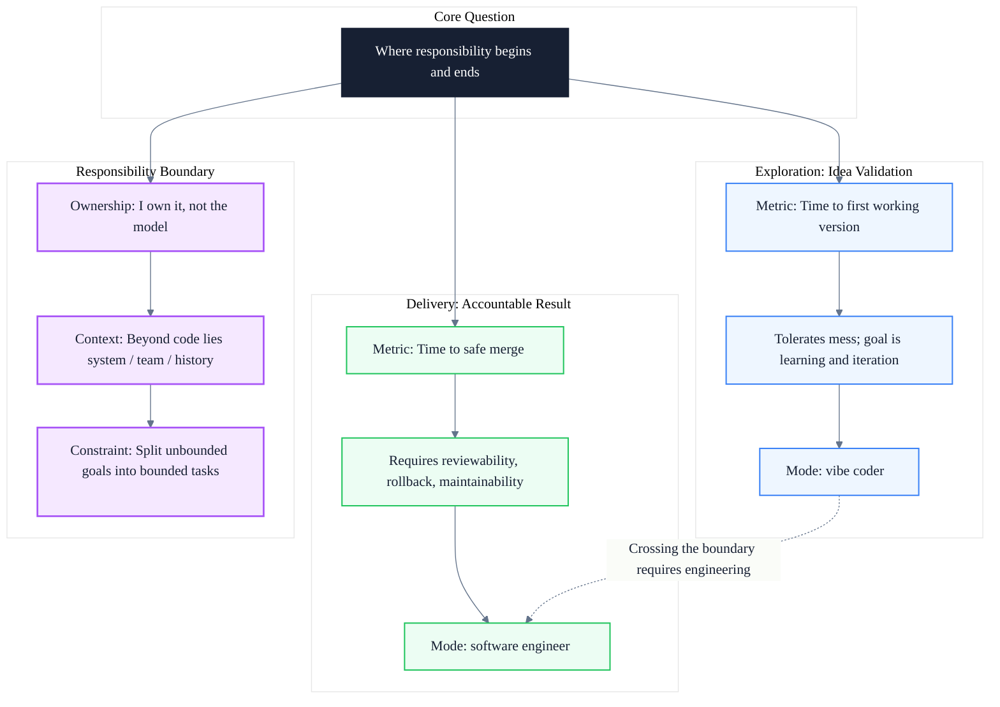

# Vibe Coder vs Software Engineer: The Boundary of Responsibility in the AI Era

> Subtitle: Starting from the phenomenon of vibe coding, re-examining responsibility, review cost, and delivery discipline in AI-assisted development
>
> Target readers: mid-to-senior software engineers, tech leads, and engineering managers introducing AI-assisted development workflows
>
> Reading time: about 15 minutes

::: info One Sentence
The difference is not the tool; it is where responsibility begins and ends. Vibe coders are useful when the main output is idea validation; software engineers are needed when the main cost is accountability.
:::

## Table of Contents

- [1. The Wrong Metric](#1-the-wrong-metric)
- [2. Output Is Not Progress](#2-output-is-not-progress)
- [3. AI Cannot Take Responsibility for You](#3-ai-cannot-take-responsibility-for-you)
- [4. Context Is More Than Files](#4-context-is-more-than-files)
- [5. Vibe Coding Fits Some Stages of the Delivery Process, but Not Everywhere](#5-vibe-coding-fits-some-stages-of-the-delivery-process-but-not-everywhere)
- [6. The Apprenticeship Problem](#6-the-apprenticeship-problem)
- [7. The Difference](#7-the-difference)
- [8. Unified Model: The Boundary of Responsibility Between Exploration and Delivery](#8-unified-model-the-boundary-of-responsibility-between-exploration-and-delivery)
- [9. Practice Checklist](#9-practice-checklist)
- [Conclusion: Choose the Mode, Not the Camp](#conclusion-choose-the-mode-not-the-camp)
- [FAQ](#faq)
- [Sources](#sources)

## 1. The Wrong Metric

Much of the discussion around vibe coding measures the wrong thing. People showcase how fast they went from idea to running application. That is valuable, especially when the goal is simply to validate an idea. But in a software development team, someone always has to review it. Someone has to understand the intent behind it. Someone has to decide whether a dependency belongs there. Someone has to check whether tests actually verify behavior. Someone has to handle schema changes. Someone has to coordinate the change across teams. Someone has to roll it back. Someone has to write the runbook. Someone has to respond to alerts.

None of these belong to anyone's toy project. Therefore, the metric for evaluating AI-generated work should be different: **time to safe merge**. This includes reviewability, risk, test quality, ownership, rollback capability, and whether the author can explain the key decisions in the change. If AI makes code generation cheaper but makes safe merge more expensive, the team gains far less than it thinks.

The vibe coder measures time to first working version; the software engineer measures time to safe merge. When the work is in exploration, time to first working version is useful; but when it enters a shared codebase, time to safe merge is the necessary metric. It covers review cost, testing cost, release cost, rollback cost, coordination cost, and future maintenance cost.

::: tip Key Takeaway
A demo is not the right finish line. It proves something can be shown, not that it can be accepted by the team. Time to safe merge is the real cost in a shared codebase.
:::

::: warning Common Pitfall
Treating "prompt-to-running-prototype" speed as overall team efficiency hides the hidden downstream cost of review, fixes, and operations.
:::

---

## 2. Output Is Not Progress

AI-assisted code should be better, not more. If the tool lets you generate more, then people must constrain it more. Otherwise, you are not saving work; you are merely deferring it downstream, turning maintenance into someone else's problem. AI-assisted code cannot be held to a different standard. It must meet the same threshold as hand-written code.

So it should be convergent. It should have only one reason to exist. It should not contain unrelated cleanups. It should not reformat half a file just because the model "happened to." It should not add a package without a clear explanation.

If a change is large only because the model generated too much, split it. The model is happy to generate a pile of boilerplate for something that could be written in ten lines. If the author cannot explain why every meaningful file changed, it is not ready. That is basic ownership.

The second distinction is the unit of work. The vibe coder treats generated output as progress; the software engineer treats any change as a unit of accountability. Generated output can be large, messy, and temporary. Real change management cannot be so casual. It must be focused enough to review, explainable enough to trust, and bounded enough to merge without dragging half the system with it. This is where speed becomes either useful or review debt.

::: tip Key Takeaway
The unit of output for AI-assisted code should be a "mergeable change," not "whatever the model generated." Progress is measured by explainability and maintainability.
:::

::: info Engineering Insight
Before committing, actively shrink generated output: remove unrelated changes, split large diffs, and add tests and explanations. This is the minimum bar for turning generated content into engineering output.
:::

---

## 3. AI Cannot Take Responsibility for You

Reviewing generated code is not the same as reviewing human-written code. When a person writes code, there is usually a chain of decisions. It may be flawed, but at least one person can explain the path. You can ask why that abstraction was chosen, why the rule was placed there, why that package was selected, why the test was written that way.

For AI-generated code, some of the so-called "decisions" are not decisions at all—they are completions. If the author has not transformed the generated result into something they truly own, then the reviewer is doing two things at once: reviewing and reverse-engineering the author's intent.

Ownership is the third distinction. The vibe coder can say the model generated it; the software engineer must say, this is on me. That means, before requesting review, the author must first convert generated content into an engineering decision. The code may start with the model, but responsibility cannot stop at the model.

::: tip Key Takeaway
Review rights cannot replace ownership. The model can provide a starting point, but only the engineer is responsible for design decisions, risks, and ongoing maintenance.
:::

::: warning Common Pitfall
Assuming "I reviewed it" equals "I own it." Review is a quality mechanism; accountability is the dividing line of engineering identity.
:::

---

## 4. Context Is More Than Files

Models can read a lot of code now. That does not mean they understand the system. Part of the context lives in code, but much of engineering context lives elsewhere. It lives in incidents, past migrations, customer behavior, operational pain points, team conventions, security requirements, compliance rules, and those strange decisions made long ago.

If you do not give them to the model, it does not have them. Even if you do, it does not carry that context the way an engineer does. It operates within its own context window. The larger the task, the more likely the model is to optimize locally and damage globally.

So "just let it fix the whole thing" is both a bad habit and, at this stage, not very effective. A better approach is to narrow the decision space before asking it to write code. Models do better when the request is more specific. But what does "more specific" require? It requires the author to actually understand what is going on.

Experienced engineers get the most value from AI not by giving the model more freedom, but by giving it less. Freedom is for weekend tinkering; production needs constraints.

This is the fourth distinction. The vibe coder gives the model a goal; the software engineer gives the model a bounded task. Real engineering happens inside that bounded task: use this interface, do not touch this layer, and so on. A good prompt is not magic here. It usually just shows that the engineer already understands the boundaries.

::: tip Key Takeaway
Engineering context is distributed across systems, teams, and history beyond the code. Breaking large goals into bounded tasks is the key constraint that makes AI output usable.
:::

::: info Engineering Insight
Explicitly stating "do not do this" in a prompt often reduces downstream review cost more than stating "do this."
:::

---

## 5. Vibe Coding Fits Some Stages of the Delivery Process, but Not Everywhere

Andrew Kelley, creator of Zig, said in an interview that the project bans AI contributions and broadly calls them garbage. The maintainers saw a flood of AI-generated pull requests full of unrelated changes, broken legacy behavior, strange dependency additions, and contributors who could not even explain their own submissions.

But the chaos they describe is not a verdict on AI; it is what happens when vibe coding crosses the line. The question is not whether to ban it, but where to place it.

This is the fifth distinction: **exploration versus delivery**. The same pull request that would cost a maintainer an entire afternoon is harmless when you are building a prototype. No one is accountable for throwaway code. Exploration tolerates mess because the goal is learning or rapid iteration around an idea. Delivery cannot tolerate unexplained mess because the goal is a real business outcome. You cannot say we are 99.9% correct. Sometimes, it simply has to be correct. That is the real boundary.

This line also keeps moving. As tools improve in testing, rollback, and review, some of the cost of safe merge will fall. But falling is not disappearing. As long as someone still needs to be responsible for the result, a certain level of discipline must remain. Use vibe coding where the cost of failure is low; use engineering discipline where the cost of failure is borne by customers, the team, or the business.

::: tip Key Takeaway
Exploration tolerates mess because the goal is learning; delivery cannot tolerate unexplained mess because the goal is an accountable business outcome.
:::

::: warning Common Pitfall
Equating "it runs" with "it can ship." Demo-grade code and production-grade code are separated by the costs of review, testing, rollback, operations, and long-term maintenance.
:::

---

## 6. The Apprenticeship Problem

Junior engineers will use AI, and they should. Used well, it can explain code, compare approaches, generate examples, and accelerate learning. But there is a downside.

If junior engineers use AI to avoid understanding the system, they may deliver more while learning less. That is a bad trade. The first few years of an engineering career are when people build mental models. They need to build that model in their own minds, not borrow it from a machine.

You do not build judgment by staying outside the system and letting the model fix things for you. This is also one of the hardest parts for managers. AI may make junior engineers appear more productive in the short term, but it weakens the learning loop that turns them into strong engineers. Kelley's deeper reason for banning AI in Zig is related to this. He called code review "contributor poker"—the way the project finds people worth growing into core team members. AI submissions break this, because contributors are not really learning the codebase or absorbing feedback.

This is the final point. Engineering requires a certain degree of apprenticeship. Vibe coding tempts you to work alone; but people learn by working with others. Software engineers improve their craft through collaboration. Work is not just writing code; work is judgment, not output. Software engineers judge what is risky and what is not. That judgment comes from contact with the system and with people.

::: tip Key Takeaway
AI can accelerate learning, or it can replace learning. A junior engineer's growth depends on contact with the system, the codebase, and team feedback—not continuous reliance on model output.
:::

::: info Engineering Insight
Give junior engineers a "explain first, generate second" exercise: before invoking the model, describe the problem, constraints, and expected changes in their own words.
:::

---

## 7. The Difference

Vibe coders are useful when the main output is idea validation. They shorten the distance from idea to clickable prototype. Many ideas deserve this treatment first, before deciding whether they are worth real engineering capacity.

Software engineers are needed when the main cost is accountability. They control what enters the system, how it is reviewed, how it is protected, how it is tested, how it is operated, and how it will be changed later. This distinction is operational, not a fixed identity. The same person should vibe-code during exploration and switch to engineering mode during delivery.

The key skill is knowing which mode you are in, and not letting the habits of one mode leak into the other. Vibe coding can help you learn faster; software engineering can help you avoid paying for that learning forever.

::: tip Key Takeaway
Vibe coder and software engineer are not two kinds of people; they are two modes. Recognizing the current mode and honoring its discipline is the core marker of engineering maturity in the AI era.
:::

---

## 8. Unified Model: The Boundary of Responsibility Between Exploration and Delivery

The previous sections examined six angles: metric, unit of work, ownership, context boundary, stage fit, and apprenticeship. They can be unified into one model: a spectrum along "accountability," separating the idea-validation exploration phase from the accountable-delivery engineering phase.

### Exploration Phase

In the exploration phase, the main output is idea validation. Vibe coding can quickly turn an idea into a clickable, discussable prototype. The metric here is time to first working version, and a certain degree of mess is acceptable because the goal is learning and iteration.

### Delivery Phase

In the delivery phase, the main cost is accountability. Software engineers must ensure changes are reviewable, testable, rollback-capable, and operable. The metric here is time to safe merge, and discipline matters more than speed.

### Boundary of Responsibility

The transition between the two phases is not automatic. It depends on three things: the author taking ownership of the output, understanding engineering context beyond the code, and breaking large goals into bounded tasks. Only when these conditions are met can generated content move from exploration into delivery.

::: tip Key Takeaway
The core of the unified model is not "human versus tool," but "the moving boundary of responsibility." Recognizing the current phase and fulfilling its discipline is an expression of engineering judgment.
:::

---

## 9. Practice Checklist

### Metrics

- [ ] Include "time to safe merge" in the team's efficiency evaluation of AI-assisted development
- [ ] When showing prototype speed, also estimate downstream review, testing, and rollback costs
- [ ] Refuse to treat "time to first working version" as the only efficiency metric in a shared codebase

### Change Management

- [ ] Before every commit, check whether generated content contains unrelated changes or auto-formatting noise
- [ ] Split oversized AI-generated changes into multiple independently reviewable commits
- [ ] Ensure every modified file can be explained with one sentence describing the reason for the change

### Ownership and Review

- [ ] Before requesting review, transform model output into your own engineering decision and write it into the description
- [ ] When reviewing AI-generated code, focus on design intent and boundary conditions, not just syntax
- [ ] Make clear that "review approved" does not mean "responsibility transferred"; the author remains accountable for follow-up issues

### Context Control

- [ ] State both "do this" and "do not do this" in prompts to narrow the model's decision space
- [ ] For tasks involving historical decisions, compliance requirements, or operational constraints, proactively add context from outside the code
- [ ] Avoid asking the model to directly handle open-ended tasks like "fix the whole system"

### Stage Separation

- [ ] Clearly label at the start of a task whether it belongs to the exploration phase or the delivery phase
- [ ] Before exploration-phase output enters a shared codebase, it must go through the review discipline of the delivery phase again
- [ ] Reserve vibe coding space for low-cost-of-failure scenarios; enforce engineering discipline for high-cost scenarios

### Team Growth

- [ ] Give junior engineers an "explain first, generate second" practice routine
- [ ] Preserve the feedback loop in code review so AI submissions do not bypass the learning process
- [ ] Regularly review how AI-generated code performs in long-term maintenance and adjust usage strategy accordingly

---

## Conclusion: Choose the Mode, Not the Camp

AI is not another programming language, nor another framework. It changes the economics of software development: the cost of generating code is falling, but the costs of reviewing, understanding, maintaining, and being accountable for it are not disappearing in the same proportion. So the real question shifts from "can it be written?" to "who is responsible for it?"

The difference between a vibe coder and a software engineer is therefore not an identity label, but a choice of working mode. Exploration needs speed, tolerates mess, and aims at learning; delivery needs discipline, explainability, and accountable outcomes. The same person can vibe-code in the morning and switch to engineering mode in the afternoon. Maturity lies in knowing which mode you are in and obeying the rules of that mode.

Tools will keep getting stronger, and the boundary will keep moving, but the line of accountability will not disappear.

> **The difference is not the tool; it is where responsibility begins and ends. Vibe coders are useful when the main output is idea validation; software engineers are needed when the main cost is accountability.**

---

## FAQ

### 1. Is vibe coding an unprofessional way of developing?

No. It is a mode suited for idea validation and rapid learning. The problem arises when it is used in scenarios requiring accountable delivery without adding engineering discipline. Professionalism lies in knowing when to use which mode.

### 2. If AI-generated code passes all tests, can it be safely merged?

Passing tests is only one condition for merging. Reviewers also need to understand design intent, confirm boundary conditions, evaluate dependency changes, check rollback capability, and ensure the author is willing to be responsible for follow-up issues. Tests cover known behavior; engineering responsibility covers unknown risks.

### 3. How should junior engineers use AI without harming their growth?

Treat AI as a tool for explanation and comparing approaches, not as a shortcut around understanding. Before generating code, describe the problem, constraints, and expected changes in your own words; after generating, manually walk through and explain each line. Managers should preserve the feedback loop in code review.

### 4. How should a team draw the boundary between vibe coding and engineering delivery?

Start from "cost of failure": allow unconstrained vibe coding only in personal or isolated environments. Before entering a shared codebase, user environment, or production path, it must go through reviewable, testable, and rollback-capable engineering processes. Stage separation should be explicit at the start of a task.

### 5. If the same person both explores and delivers, how can they avoid mixing up the habits?

Use explicit switching signals: set up separate branches or directories for exploration tasks and label them as "prototypes"; before switching to delivery, force a cleanup pass that includes removing unrelated files, adding tests, and writing explanations. The key is not to let temporary exploration artifacts default into the delivery process.

---

## Sources

1. Yusuf Aytaş. *Vibe Coder vs Software Engineer*: [https://yusufaytas.com/vibe-coder-vs-software-engineer](https://yusufaytas.com/vibe-coder-vs-software-engineer)
2. Yusuf Aytaş. *The Invisible Difference*: [https://yusufaytas.com/the-invisible-difference](https://yusufaytas.com/the-invisible-difference)
3. Yusuf Aytaş. *Managers Have Been Vibe Coding All Along*: [https://yusufaytas.com/managers-have-been-vibe-coding-all-along](https://yusufaytas.com/managers-have-been-vibe-coding-all-along)
