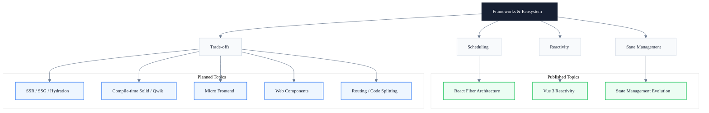

# Frameworks & Ecosystem

> Subtitle: See through the engineering trade-offs behind React Fiber / Vue 3 reactivity / state management abstractions

## Module Positioning

Modern frontend frameworks abstract "how to update the DOM" more and more thoroughly, but abstraction is not free. React Fiber's interruptible chain rendering, Vue 3's Proxy reactivity, and Zustand's atomic state — each solution represents a different trade-off among scheduling, dependency tracking, performance, and developer experience. This module does not just teach "how to use frameworks." It disassembles their internal mechanisms so that you understand why they are designed this way, where their performance bottlenecks lie, and when you should bypass the abstraction and operate at a lower level.

We do not treat frameworks as black boxes, nor APIs as the destination. Once you understand the Fiber node structure, Proxy traps and Effect scheduling, and the evolution of Flux unidirectional flow, you can make evidence-based decisions on performance issues, framework selection, and source contributions — rather than stopping at "copy from the docs once."

The end goal is not to become an expert in any single framework, but to build three interrelated engineering perspectives — scheduling, reactivity, and state management — so that the design choices of different frameworks can be compared within the same coordinate system.

---

## Knowledge Map

---

## Core Topics

### ✓ Published

- **Scheduling**: React Fiber linked-list structure, time slicing, interruptible rendering, and the Lane priority model
  → [React Fiber Architecture](/en/frameworks/react-fiber)
- **Reactivity**: Vue 3 Proxy dependency collection, Effect scheduling, and implementation differences among ref / reactive / computed
  → [Vue 3 Reactivity](/en/frameworks/vue3-reactivity)
- **State management**: Design evolution of Flux unidirectional flow, Redux middleware, Zustand atomicity, and Recoil derived state
  → [State Management Evolution](/en/frameworks/state-management)

### ◯ Planned

- **SSR / SSG & Hydration**: Engineering trade-offs among server-side rendering, static generation, and hydration
- **Compile-time Optimization (Solid / Qwik)**: How fine-grained reactivity and zero-hydration paradigms avoid runtime scheduling overhead
- **Micro Frontend Architecture**: Boundaries of application isolation, shared dependencies, and runtime orchestration
- **Web Components**: Native component model, Shadow DOM, and framework interop
- **Routing & Code Splitting**: Client / server routing, lazy loading, and prefetching strategies

---

## Learning Path

1. Start with [React Fiber Architecture](/en/frameworks/react-fiber) to build a mental model of "schedule → render → commit" and understand why interruptible rendering relieves main-thread blocking
2. Then read [Vue 3 Reactivity](/en/frameworks/vue3-reactivity) to compare Proxy dependency tracking against virtual DOM diff in scheduling granularity
3. Continue with [State Management Evolution](/en/frameworks/state-management) to place state abstractions in the Flux → Redux → Zustand lineage
4. Advanced: study Solid / Qwik compile-time optimization to consider whether runtime scheduling can be fully eliminated

---

## Article Guide

- [React Fiber Architecture: From Stack Scheduling to Interruptible Rendering](/en/frameworks/react-fiber) — Fiber node structure, Scheduler, and the Lane priority model
- [Vue 3 Reactivity: Proxy & Dependency Tracking](/en/frameworks/vue3-reactivity) — The complete chain from Proxy traps to Effect scheduling
- [State Management Evolution: From Flux to Zustand](/en/frameworks/state-management) — The trade-off thread among unidirectional flow, immutability, and atomicity

---

## Intended Readers

- Intermediate and senior frontend engineers who want to understand framework internals rather than only APIs
- Frontend architects who need to evaluate performance boundaries and extensibility when choosing frameworks
- Framework source-code contributors who need a unified perspective on scheduling, reactivity, and state management
- Toolchain and SDK developers who need portable runtime capabilities above framework abstractions

---

## Extended Resources

- [React Official Docs](https://react.dev) — Authoritative reference on Fiber, concurrent mode, and Suspense
- [Vue 3 Official Docs](https://vuejs.org) — Reactivity system, Composition API, and compiler optimizations
- *Front-End Architecture in the React Era* — A systematic treatment of framework selection and frontend architecture evolution
- [Frontend Architecture Patterns](https://www.patterns.dev/) — A pattern library of modern frontend architecture
