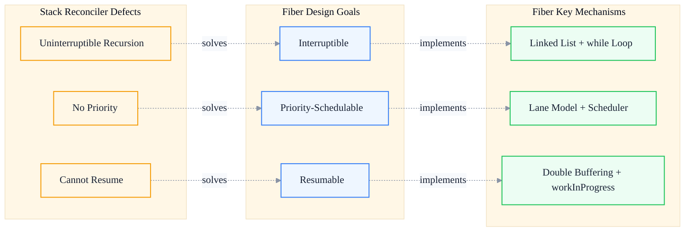
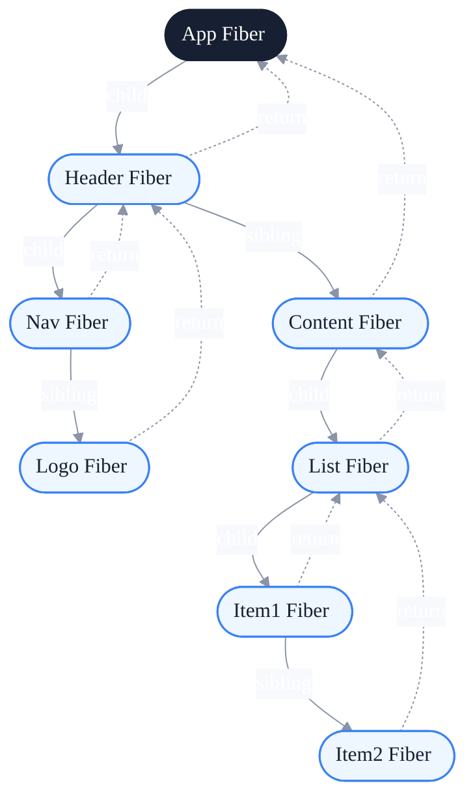
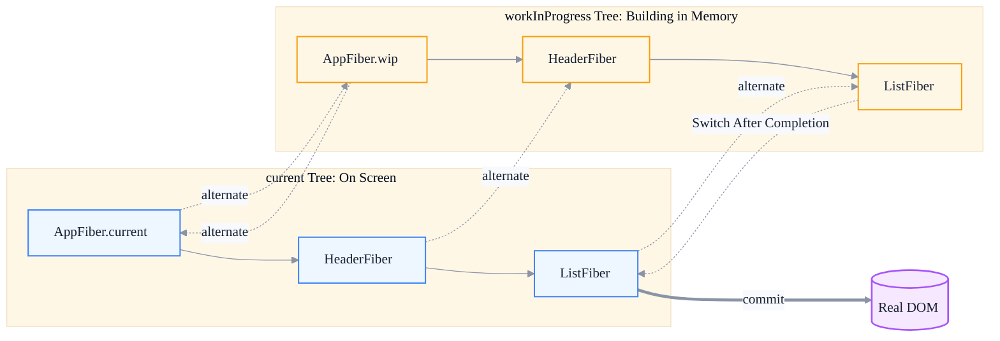
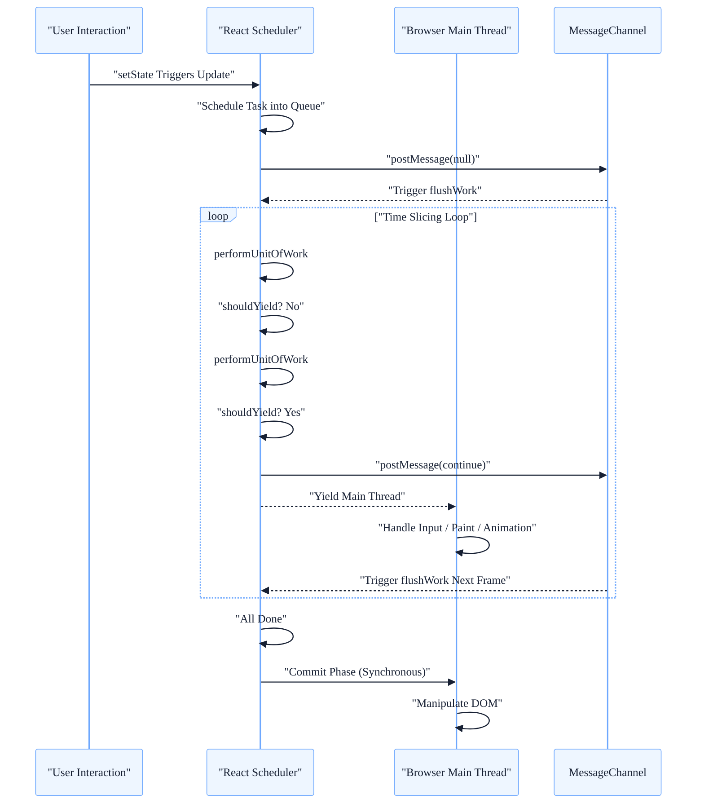
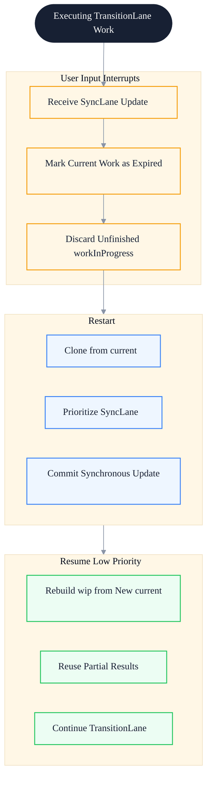
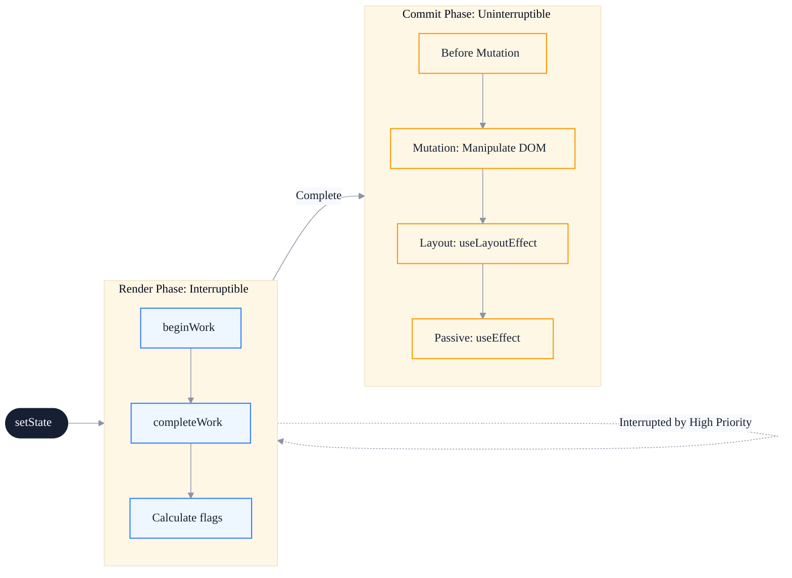
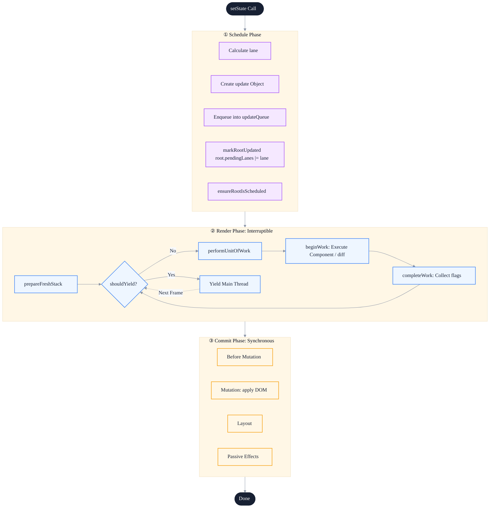

# React Fiber Architecture: From Stack Reconciliation to Interruptible Chain Rendering

> Subtitle: From stack reconciliation to interruptible chain rendering — Fiber data structures, double buffering, time slicing, and the Lane model.
>
> Target readers: Intermediate and senior frontend engineers, frontend architects, advanced React users.
>
> Reading time: ~28 minutes.

::: info In one sentence
The essence of React Fiber is rewriting a recursively uninterruptible component tree into an interruptible, resumable, priority-schedulable linked list.
:::

## Table of Contents

- [Introduction](#introduction)
- [1. The Fundamental Problem of React 15 Stack Reconciler](#1-the-fundamental-problem-of-react-15-stack-reconciler)
- [2. Fiber Design Motivations: Interruptible, Resumable, Priority-Schedulable](#2-fiber-design-motivations-interruptible-resumable-priority-schedulable)
- [3. Fiber Node Data Structure: From Tree to Linked List](#3-fiber-node-data-structure-from-tree-to-linked-list)
- [4. Double Buffering: current Tree and workInProgress Tree](#4-double-buffering-current-tree-and-workinprogress-tree)
- [5. Time Slicing and MessageChannel: Letting the Main Thread Breathe](#5-time-slicing-and-messagechannel-letting-the-main-thread-breathe)
- [6. Lane Model: Expressing Priority with Bit Operations](#6-lane-model-expressing-priority-with-bit-operations)
- [7. The Essence of Concurrent Mode: Cooperative Scheduling, Not True Concurrency](#7-the-essence-of-concurrent-mode-cooperative-scheduling-not-true-concurrency)
- [8. From setState to commit: The Flow of a Complete Update](#8-from-setstate-to-commit-the-flow-of-a-complete-update)
- [9. Engineering Value and Cost of Fiber](#9-engineering-value-and-cost-of-fiber)
- [FAQ](#faq)
- [Sources](#sources)

## Introduction

Many frontend engineers understand Fiber as "the new architecture introduced in React 16" and know it "uses time slicing," but cannot clearly answer:

- Why is a recursive call stack uninterruptible? Can't we just change it to a `while` loop?
- Why does a Fiber node split into a "three-pointer linked list" instead of continuing to use a tree?
- What is double buffering really for? Just to "reuse memory"?
- Who exactly does `shouldYield` yield to? The browser main thread, or its own work?
- What does the Lane model solve compared to `expirationTime`?
- Since JavaScript is single-threaded, where exactly is the "concurrency" in Concurrent Mode?

This article tries to build a truly self-consistent Fiber model that connects these questions. It does not pursue line-by-line source reading; it focuses on design motivations and key data structures, so that after reading, you can compare details with the React source code yourself.

::: tip Core argument of this article
Fiber is not a "performance optimization." It restructures React from a **synchronous recursive renderer** into a **cooperative scheduling system**. It does not solve "slow rendering," but "rendering blocks the main thread so it cannot yield."
:::

---

## 1. The Fundamental Problem of React 15 Stack Reconciler

React 15's Reconciler is called **Stack Reconciler**. Its workflow is straightforward: recursively traverse the component tree, compare the two trees, and commit the differences to the DOM.

```javascript
// Simplified Stack Reconciler workflow
function reconcileChildren(parentFiber, children) {
  // Recursive calls; call stack depth equals component tree depth
  for (const child of children) {
    reconcileChild(parentFiber, child)
  }
}

function reconcileChild(parentFiber, child) {
  if (Array.isArray(child)) {
    reconcileChildren(parentFiber, child) // keep recursing
  } else {
    // create / update / delete fiber
    // recursively process child nodes
    reconcileChildren(parentFiber, child.props.children)
  }
}
```

This implementation is simple and intuitive, but has a fatal flaw: **once it starts, it must run to completion**.

### 1. Recursive Call Stacks Cannot Be Interrupted

The JavaScript execution stack is managed by the engine; developers cannot "pause" a running function. When the Reconciler enters `reconcileChildren`, the reconciliation of the entire tree recurses all the way down. If the tree is large — say, thousands of nodes — this process can take more than 100 ms.

During those 100 ms, the main thread is fully occupied:

- User clicks get no response
- Input fields stutter
- Animations drop frames
- Scrolling becomes janky

::: warning Key issue
It is not that "React is slow," but that "while React is working, it cannot yield the main thread."
:::

### 2. Single Priority, No Cutting in Line

In Stack Reconciler, all updates are treated equally. A high-priority user input (such as clicking a button) must wait behind a low-priority update already in flight (such as a `setState` triggered by a network response).

This leads to a counterintuitive phenomenon: **click response is slow because a "less important update" is running ahead, and the click can only be handled after it finishes**.

### 3. Call Stack Depth Equals Component Tree Depth

Because recursion is used, the deeper the component tree, the deeper the call stack. This not only limits architectural evolution but also makes error stacks hard to read.

::: tip Core conclusion of this section
The fundamental problem of Stack Reconciler is not "insufficient performance," but "insufficient model" — it does not treat "interruptibility" and "priority scheduling" as first-class citizens. Fiber's design motivation is precisely to add these two capabilities.
:::

---

## 2. Fiber Design Motivations: Interruptible, Resumable, Priority-Schedulable

Fiber's design motivations can be summarized as three goals, each corresponding to a defect of Stack Reconciler:



### 1. Interruptible: Turning Recursion into Iteration

To make recursion interruptible, the most direct approach is to **turn recursion into a `while` loop** and check inside the loop "whether the main thread needs to be yielded."

But a key question arises: recursion's "context" is saved on the call stack. After switching to a `while` loop, the call stack is gone — where does the context come from?

The answer: **use objects to store the context yourself**. These "objects that store context themselves" are Fiber nodes.

### 2. Resumable: Linked List Structure + Nodes Remember Context

A recursive function's "next step should process whom" is decided by the call stack. After switching to iteration, each node must remember:

- Who is my parent node (where to return after I am processed)
- Who is my first child node (where I should go down)
- Who is my next sibling node (where to go after processing the subtree)

This is the origin of Fiber's three core pointers: `return`, `child`, and `sibling`.

### 3. Priority-Schedulable: Important Things First

Interruptibility and resumability are only the foundation; the real goal is **priority scheduling**. Fiber designed a priority system (early on it was `expirationTime`, later evolved into the Lane model) so that the scheduler can:

- Compare the priority of two updates
- "Interrupt" or "delay" low-priority updates
- Let high-priority updates "cut in line"

::: tip Core conclusion of this section
Fiber's three goals — interruptible, resumable, and priority-schedulable — together determine its implementation: replacing the tree with a linked list, saving context with objects, and using a scheduler to decide when to yield the main thread. This is a cooperative scheduling system, not a simple "performance optimization."
:::

---

## 3. Fiber Node Data Structure: From Tree to Linked List

Below is a simplified but kernel-accurate Fiber node structure (fields unrelated to this article's main line are removed):

```javascript
function FiberNode(tag, pendingProps, key) {
  // === Identity and Type ===
  this.tag = tag              // FunctionComponent / ClassComponent / HostComponent / ...
  this.key = key
  this.type = null            // corresponding function / class / string such as 'div'
  this.pendingProps = pendingProps
  this.memoizedProps = null   // props used in last render
  this.memoizedState = null   // hooks linked list / class instance state
  this.stateNode = null       // corresponding DOM node / class instance

  // === Three pointers: turning a tree into a linked list ===
  this.return = null          // parent Fiber
  this.child = null           // first child Fiber
  this.sibling = null         // next sibling Fiber
  this.index = 0              // position among siblings

  // === Double buffering ===
  this.alternate = null       // points to the corresponding Fiber in the other tree

  // === Side effects ===
  this.flags = NoFlags        // Placement / Update / Deletion / ...
  this.subtreeFlags = NoFlags // accumulated flags of the subtree
  this.deletions = null       // child nodes pending deletion

  // === Scheduling related ===
  this.lanes = NoLanes        // pending priority on this Fiber
  this.childLanes = NoLanes   // pending priority of the subtree
}
```

### 1. Three-Pointer Linked List: Each Node Only Remembers 3 Neighbors

The most critical design is the three pointers `return / child / sibling`. They transform a tree into a "traversable linked list":



This structure allows traversal to be done with a single `while` loop:

```javascript
function workLoopSync(rootFiber) {
  let nextUnitOfWork = rootFiber
  while (nextUnitOfWork !== null) {
    nextUnitOfWork = performUnitOfWork(nextUnitOfWork)
  }
}

function performUnitOfWork(unitOfWork) {
  // 1. Process current node (execute function component, compare props, etc.)
  const next = beginWork(unitOfWork)
  if (next !== null) {
    return next // has child node, process child next
  }
  // 2. No child node, look for sibling; if no sibling, backtrack to parent
  let node = unitOfWork
  while (node !== null) {
    completeWork(node)
    if (node.sibling !== null) {
      return node.sibling
    }
    node = node.return
  }
  return null // entire tree traversal complete
}
```

Note that the return value of `performUnitOfWork` is "the next unit of work to be processed." This is the core of Fiber turning recursion into iteration: **the next unit of work is determined by pointers, not by the call stack**.

### 2. Scheduling Unit = Rendering Unit

A Fiber node is not only a data carrier, but also a scheduling unit. The scheduler can decide:

- How many Fiber nodes to process now
- At which node to yield the main thread
- From which node to resume next time

::: info Engineering insight
Every Fiber node carries its own "context," so React can interrupt and resume at any node. This is why hooks must be called in order — the hooks linked list is stored in the Fiber's `memoizedState`, and if the order is wrong, it cannot be found again.
:::

::: tip Core conclusion of this section
Fiber's linked list structure is not for "saving memory," but for "traversable interruptibility." The three pointers flatten the tree into a single-steppable workflow; every Fiber node is an independent unit of work.
:::

---

## 4. Double Buffering: current Tree and workInProgress Tree

Fiber also introduces a strange-looking field: `alternate`. It points to "the corresponding Fiber in the other tree."

This is the **double buffering** mechanism. React maintains two Fiber trees at the same time:

- **current tree**: the tree currently displayed on screen; each Fiber node's `stateNode` points to the real DOM
- **workInProgress tree**: the tree for the next frame being built in memory



### 1. Why Double Buffering?

The most direct benefit is **reusing Fiber objects**. When an update is interrupted and restarted, React can choose:

- Rebuild a brand-new tree from scratch (wastes memory)
- Reuse Fiber objects from the current tree and only update changed fields (efficient)

Through the `alternate` pointer, React can "clone" the workInProgress tree from the current tree. If this node already had a workInProgress built in a previous attempt, it is reused directly.

```javascript
function createWorkInProgress(current, pendingProps) {
  let workInProgress = current.alternate
  if (workInProgress === null) {
    // First clone: create new Fiber
    workInProgress = createFiber(current.tag, pendingProps, current.key)
    workInProgress.type = current.type
    workInProgress.stateNode = current.stateNode
    // Point to each other
    workInProgress.alternate = current
    current.alternate = workInProgress
  } else {
    // Reuse: only update fields
    workInProgress.pendingProps = pendingProps
    workInProgress.flags = NoFlags
    workInProgress.deletions = null
  }
  workInProgress.lanes = current.lanes
  workInProgress.childLanes = current.childLanes
  workInProgress.memoizedProps = current.memoizedProps
  workInProgress.memoizedState = current.memoizedState
  return workInProgress
}
```

### 2. Double Buffering Makes Interruption "Almost Free"

Suppose a low-priority update starts and is interrupted halfway by a high-priority task. React will:

1. Discard the current unfinished workInProgress tree
2. Prioritize the high-priority update and build a new workInProgress tree
3. After the high-priority update commits, the current tree points to the new root
4. The low-priority update restarts, cloned from the new current tree

Because cloning is "on-demand," unvisited nodes are not created as workInProgress at all. This keeps the cost of interruption and restart bounded to "the part already worked on."

### 3. Double Buffering vs. Git Branches

::: tip Analogy
Think of the current tree as the `main` branch and the workInProgress tree as the `feature` branch. React builds on the feature branch; after the build completes (commit), it fast-forwards `main` to point to `feature`. The next time a new update starts, it cuts a new `feature` from the new `main`.
:::

::: tip Core conclusion of this section
Double buffering is not as simple as "memory reuse"; it makes the cost of "interrupt — restart" controllable. The `alternate` field is the physical implementation of double buffering, allowing React to switch quickly between the two trees and reuse nodes on demand.
:::

---

## 5. Time Slicing and MessageChannel: Letting the Main Thread Breathe

Interruptible and resumable are only data-structure-level preparations; the real decision of "when to yield the main thread" is made by the **Scheduler**.

### 1. Time Slicing: A 5 ms Work Budget

React sets a time budget for each frame's work, defaulting to **5 ms** (configurable in the `scheduler` package). The Scheduler maintains a `currentTime` and checks after each unit of work:

```javascript
function workLoopConcurrent(rootFiber) {
  let nextUnitOfWork = rootFiber
  while (nextUnitOfWork !== null && !shouldYield()) {
    nextUnitOfWork = performUnitOfWork(nextUnitOfWork)
  }
  if (nextUnitOfWork !== null) {
    // Work is not done yet; yield the main thread and wait for the next slice
    scheduleCallback(continueWork, nextUnitOfWork)
  }
}

function shouldYield() {
  const now = getCurrentTime()
  return now >= deadline
  // deadline = frameStart + 5ms
}
```

Note the essence of `shouldYield`: **it asks "has my 5 ms budget been used up," not "does the main thread have other things to do."** React voluntarily yields the main thread, giving the browser a chance to process input events, paint, animations, etc.

### 2. Why MessageChannel?

React needs a mechanism that is "called when the browser is idle." Options include:

- `setTimeout(cb, 0)`: minimum delay is about 1–4 ms, and it can be clamped
- `requestAnimationFrame`: fires before rendering, but only once before each frame's render
- `requestIdleCallback`: called when the browser is idle, but compatibility is poor and priority is too low
- `MessageChannel`: triggered via `postMessage`, callback runs in a macro task with the lowest latency

```javascript
const channel = new MessageChannel()
const port = channel.port2

channel.port1.onmessage = () => {
  // Execute the work loop here
  flushWork()
}

function scheduleCallback() {
  port.postMessage(null)
}
```

React ultimately chose `MessageChannel` for two reasons:

1. **Lowest latency**: the macro task triggered by `postMessage` executes almost immediately after the current event loop ends, unlike `setTimeout` which has a minimum delay
2. **Controllable**: React decides when to yield and when to continue, rather than relying on the browser's idle judgment

::: warning Common misconception
Many people think React uses `requestIdleCallback`. In fact, the React team evaluated it early on and ultimately abandoned it. Reasons: poor compatibility, unstable call timing, and uncontrollable priority. React implemented its own time-slicing-based scheduler on top of `MessageChannel`.
:::

### 3. Time Slicing Flow



::: tip Core conclusion of this section
The essence of time slicing is "React voluntarily yields the main thread." `MessageChannel` provides the lowest-latency wake-up mechanism. `shouldYield` checks whether the work budget is exhausted, giving the browser a chance to handle input, rendering, and other tasks.
:::

---

## 6. Lane Model: Expressing Priority with Bit Operations

Before React 17, React used the `expirationTime` model: each update had an "expiration time," and the smaller the value, the more urgent. This model is simple but problematic:

- **Hard to express "batches"**: multiple updates of different priorities mixed together make it hard to quickly calculate "the priority range of this batch"
- **Hard to "overlap"**: when a high-priority update cuts in, how does low-priority work distinguish itself from and reuse it?

React 18 introduced the **Lane model**, using each bit of a 32-bit integer to represent a priority:

```javascript
// Simplified Lane definitions (more exist in practice)
export const NoLanes = 0b0000000000000000000000000000000
export const SyncLane = 0b0000000000000000000000000000001  // synchronous, highest
export const InputContinuousLane = 0b0000000000000000000000000000010 // continuous input
export const DefaultLane = 0b0000000000000000000000000000100 // default
export const TransitionLane = 0b0000000000000000000000100000000 // transition
export const IdleLane = 0b0010000000000000000000000000000 // idle
export const OffscreenLane = 0b1000000000000000000000000000000 // offscreen
```

### 1. Why Bit Operations?

Bit operations have several key advantages:

**First, batch checks use `&`:**

```javascript
// Check whether a Fiber has "high-priority tasks pending"
function includesBlockingLane(root, lanes) {
  const blockingLanes = SyncLane | InputContinuousLane | DefaultLane
  return (lanes & blockingLanes) !== NoLanes
}
```

**Second, multiple priorities can coexist:**

```javascript
// A Fiber can have both SyncLane and TransitionLane at the same time
const lanes = SyncLane | TransitionLane // 0b0000000000000000000000100000001
```

This means multiple updates of different priorities can be "hanging" on the same Fiber, and React can handle them separately.

**Third, separating priorities uses `&` and `~`:**

```javascript
// Remove transition-related lanes from lanes to get the "non-transition" part
const nonTransitionLanes = lanes & ~TransitionLanes
```

### 2. Lane and batchedUpdates Relationship

React 18's Automatic Batching is tightly coupled with the Lane model. Multiple `setState`s being merged into the same update essentially means their lanes are merged with `|`:

```javascript
function markRootUpdated(root, updateLane) {
  root.pendingLanes |= updateLane
}
```

The scheduler gets `pendingLanes`, finds the "highest-priority lane" among them, and decides the priority of the next task.

### 3. Priority Cut-in

When user input triggers a `SyncLane` update while `TransitionLane` work is in progress:



::: tip Core conclusion of this section
The Lane model uses bit operations to express priority as "a set of stackable, separable bits." This allows React to handle multiple priorities simultaneously, batch updates, cut in line, and resume, making it the arithmetic foundation of Concurrent Mode.
:::

---

## 7. The Essence of Concurrent Mode: Cooperative Scheduling, Not True Concurrency

Many articles say React 18 introduced "Concurrent Mode," giving the impression that React became multi-threaded. It did not; JavaScript is still single-threaded. **"Concurrent" here does not mean "parallel."**

### 1. Cooperative vs. Preemptive

There are two kinds of OS process scheduling:

- **Preemptive**: the kernel forcibly suspends a process to let another run
- **Cooperative**: a process voluntarily yields the CPU

JavaScript is single-threaded and cannot be "preempted" — once a function starts, it runs to completion. So React must **voluntarily yield** itself; this is "cooperative scheduling."

### 2. Concurrency = Interruptible + Cut-in-Capable

React's "concurrency" is actually:

- Rendering work is cut into many small tasks
- High-priority tasks can interrupt low-priority tasks
- Low-priority tasks continue when idle

The "concurrency" users feel is that input response, animation, and rendering no longer block one another.

### 3. useTransition and useDeferredValue

These two APIs let developers actively mark an update as low priority:

```jsx
function App() {
  const [isPending, startTransition] = useTransition()
  const [query, setQuery] = useState('')
  const [results, setResults] = useState([])

  function handleChange(e) {
    setQuery(e.target.value) // high priority: input updates immediately
    startTransition(() => {
      setResults(filter(hugeList, e.target.value)) // low priority: list can be slower
    })
  }

  return (
    <>
      <input value={query} onChange={handleChange} />
      {isPending ? 'loading...' : <List items={results} />}
    </>
  )
}
```

The `setState` inside `startTransition` will be tagged with `TransitionLane`. When the user types, the input box responds immediately; even if list rendering is slow, it will not block input.

::: warning Key insight
`useTransition` is not a "performance optimization API," but a "priority declaration API." It tells React: "this update can happen later." If the list can already render within 5 ms, `useTransition` will not have any speed-up effect.
:::

### 4. Concurrent Mode Does Not Affect the Commit Phase

Although the render phase (reconcile) is interruptible, the **commit phase is not**. The commit phase contains real DOM operations, lifecycles, `useEffect` scheduling, etc. Once started, it must complete synchronously.



::: warning Important rule
Do not read uncommitted data or perform side effects in the commit phase (such as `useLayoutEffect`, `componentDidMount`) — it executes synchronously and will block the main thread.
:::

::: tip Core conclusion of this section
"Concurrency" in Concurrent Mode is cooperative scheduling, not multi-threading. Only the render phase is interruptible; the commit phase remains synchronous. `useTransition / useDeferredValue` are the entry points for developers to actively declare priority.
:::

---

## 8. From setState to commit: The Flow of a Complete Update

Putting all the concepts together, the complete flow of a `setState` is as follows:



### 1. Schedule Phase

`setState` does not immediately trigger rendering. Instead:

1. Calculate the lane based on the source of `setState` (event, transition, suspense, etc.)
2. Create an update object `{ lane, action, next }`
3. Attach the update to the corresponding Hook / updateQueue
4. Merge the lane into `root.pendingLanes` via `|=`
5. Call `ensureRootIsScheduled`: if no task is running, `scheduleCallback`

### 2. Render Phase

The scheduler calls the work loop at the right time:

1. Start from the root, `prepareFreshStack` resets the work unit
2. Loop `performUnitOfWork` to process the current node
3. Check `shouldYield` each loop; if timed out, yield the main thread
4. When complete, the flags of the entire workInProgress tree are ready

### 3. Commit Phase

After Render completes, enter commit, executed **synchronously**:

1. **Before Mutation**: `getSnapshotBeforeUpdate`, etc.
2. **Mutation**: manipulate the DOM according to flags (insert, delete, update)
3. **Layout**: `useLayoutEffect` / `componentDidMount` / `componentDidUpdate`
4. **Passive Effects**: `useEffect` scheduled asynchronously

### 4. Switch current

After commit completes, `root.current` points to the new `workInProgress.root`. The next time an update starts, this tree becomes the new current.

::: tip Core conclusion of this section
The complete chain of an update is "Schedule → Render (interruptible) → Commit (synchronous) → switch current." Understanding what each phase does and whether it can be interrupted is the navigational map for reading the React source code.
:::

---

## 9. Engineering Value and Cost of Fiber

### 1. Engineering Value

- **Interruptible rendering**: long tasks are split, and the main thread is no longer monopolized
- **Priority scheduling**: user input takes precedence over data updates, a qualitative experience improvement
- **Suspense**: rendering can "wait," working more naturally with asynchronous data flows
- **Streaming SSR**: server-side streaming HTML, combined with `lazy` for on-demand loading
- **Server Components**: Fiber's priority model is one of the foundations of RSC

### 2. Cost

- **Mental complexity**: from "render once" to "may render multiple times, some attempts discarded"
- **No side effects in the render phase**: because render may be interrupted and redone, side effects would execute repeatedly
- **Memory footprint**: double buffering + linked list structure uses more heap memory than a recursive call stack
- **Hooks rules**: must be called in order, because the hooks linked list is stored on the Fiber

::: warning Easy-to-miss pitfalls
Reading refs and mutating them in the render phase, calling side effects without cleanup, reading "stale" state in Concurrent Mode — these are traps exposed only after Fiber's introduction. In Concurrent Mode, render functions may be called multiple times and must remain pure.
:::

### 3. Fiber and the Tension of "React Is a Declarative Framework"

React has always claimed to be a declarative UI framework. But after Concurrent Mode was introduced, developers must care about the non-declarative fact that "rendering may be interrupted and redone." This is a real tension in React's design philosophy and has not been perfectly resolved.

::: tip Core conclusion of this section
Fiber is a key step for React toward becoming a "scheduling system." It brings capabilities such as priority, interruptibility, Suspense, and RSC, but also requires developers to write render functions more purely and accept a certain conceptual complexity.
:::

---

## FAQ

### 1. Why doesn't React just use `requestIdleCallback`?

`requestIdleCallback` has several problems: poor browser compatibility; unstable call timing (it only callbacks when the browser is completely idle); uncontrollable priority; and it may not fire at all when frames are busy. The React team needed a scheduling mechanism "that they controlled," so they implemented a time-slicing-based scheduler on top of `MessageChannel`.

### 2. Is Fiber's linked list structure really "cheaper" than a recursive call stack?

It is not "cheaper," it is "controllable." The recursive call stack is managed by the engine and developers cannot pause it; the linked list structure is managed by React itself and can be interrupted and resumed at any node. The cost is higher heap memory usage, but it buys schedulability.

### 3. What is the difference between `useTransition` and `setTimeout(fn, 0)`?

`setTimeout` defers the callback to the next macro task; it is still essentially executing all `setState`s inside that callback synchronously. `useTransition` marks the `setState` as low priority, letting React "defer processing" at the scheduling level, and it can be interrupted and cut in line. The former is "delayed invocation," the latter is "priority declaration" — completely different models.

### 4. Why can't the commit phase be interrupted?

The commit phase operates on the real DOM. Interrupting halfway would leave the UI in an inconsistent state (for example, some nodes deleted while others not yet updated). Moreover, the commit phase is usually very short (millisecond-level), so the benefit of interrupting is small. Therefore, React designed the commit phase to be synchronous and uninterruptible.

### 5. What is the essential advantage of the Lane model over `expirationTime`?

`expirationTime` is a single value and is hard to express "multiple priorities coexisting" and "batch separation." Lane compresses multiple priorities into a 32-bit integer using bit operations, allowing merge with `|`, check with `&`, and separation with `& ~`. This lets React make fast decisions when facing complex priority combinations (such as sync, transition, and suspense simultaneously).

### 6. In Concurrent Mode, render functions may execute multiple times. How do you avoid performance issues?

Keep render functions pure: do not perform side effects in render, do not read mutable global state, and cache complex calculations with `useMemo`. If side effects are unavoidable, put them in `useEffect` or `useLayoutEffect` — they execute in the commit phase and will not be called repeatedly.

---

## Sources

1. React Official Docs - Concurrent Features: <https://react.dev/blog/2021/06/08/the-plan-for-react-18>
2. React Official Docs - Scheduling in React: <https://react.dev/reference/react/useTransition>
3. Andrew Clark - React Fiber Architecture (classic community notes): <https://github.com/acdlite/react-fiber-architecture>
4. Sebastian Markbåge - React Basic (Fiber design motivations): <https://github.com/reactjs/react-basic>
5. React Source Code (`packages/react-reconciler` / `packages/scheduler`): <https://github.com/facebook/react>

This article is also based on the author's own reading and synthesis of the React source code.
