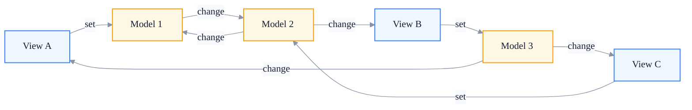
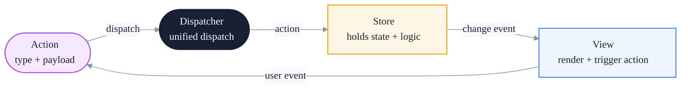
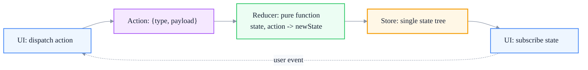
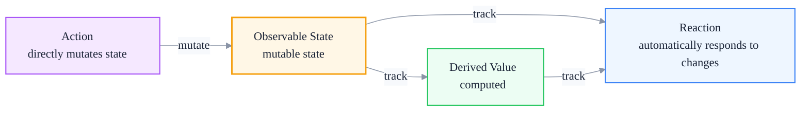
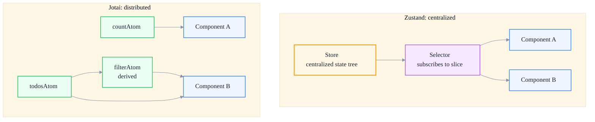
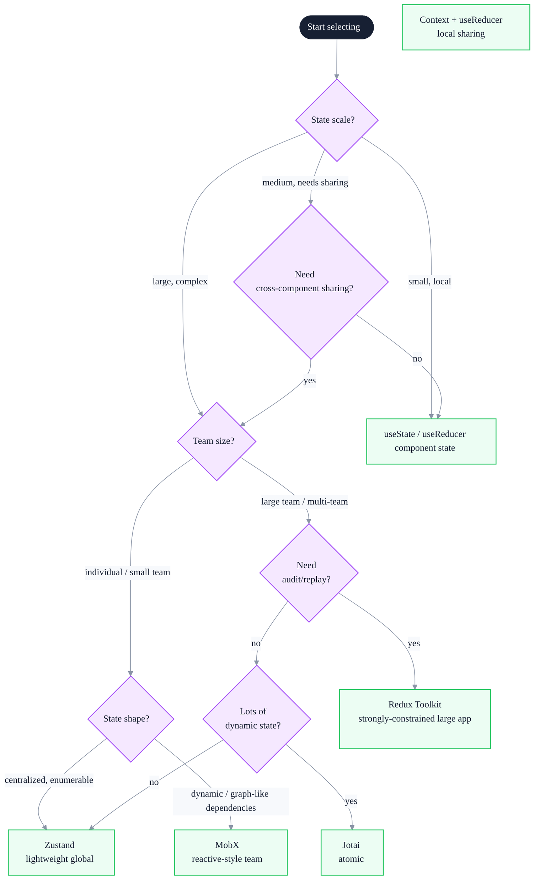

# Modern State Management Evolution: The Design Philosophy from Flux to Zustand

> Subtitle: From MVC to Flux, Redux, MobX, Zustand, and Jotai — design philosophy and decision framework for frontend state management.
>
> Target readers: Intermediate and senior frontend engineers, frontend architects, and engineers making technology choices.
>
> Reading time: ~27 minutes.

::: info In one sentence
Every step in frontend state-management evolution resolves the tension between "traceability of state changes" and "developer experience" — from Flux's strongly constrained unidirectional flow to Zustand's minimal API, each is essentially a rebalancing of these two dimensions.
:::

## Table of Contents

- [Preface](#preface)
- [1. State Management Problems in the MVC Era](#1-state-management-problems-in-the-mvc-era)
- [2. Flux: The Unidirectional Data Flow Revolution](#2-flux-the-unidirectional-data-flow-revolution)
- [3. Redux: The Extreme of Functional and Immutable Style](#3-redux-the-extreme-of-functional-and-immutable-style)
- [4. MobX: Reactive State Management](#4-mobx-reactive-state-management)
- [5. Zustand and Jotai: A Return to Simplicity](#5-zustand-and-jotai-a-return-to-simplicity)
- [6. Decision Framework for State Management](#6-decision-framework-for-state-management)
- [7. Trend Observation: State Management Is "Disappearing"](#7-trend-observation-state-management-is-disappearing)
- [FAQ](#faq)
- [Sources](#sources)

## Preface

Many frontend engineers understand state management like this:

- At project start: use `useState`, simple enough.
- As state grows: lift to parent components, prop drilling.
- Annoyed: install Redux.
- Annoyed by Redux: switch to MobX / Zustand / Jotai.
- After a while: each solution feels slightly off.

This process of "switching tools" essentially reflects a failure to understand the problems different solutions are trying to solve. This article tries to build a complete "state-management evolution map" to answer these questions:

- Why did Flux appear? What problem of MVC did it solve?
- Why are Redux's "three principles" these three? What is forced immutability for?
- Are MobX and Redux opposites, or do they solve different problems?
- Zustand is so simple; why can it replace Redux? What is it "missing"?
- What is the essential difference between Jotai's "atomic" approach and Zustand's "centralized" approach?
- For a specific project, how should you choose?

::: tip Core argument of this article

There is no "absolutely optimal" state-management solution. Each is a different trade-off among "constraint vs freedom," "centralized vs distributed," and "explicit vs implicit." Understanding these trade-off dimensions is the only way to make suitable choices instead of being led by tools.

:::

---

## 1. State Management Problems in the MVC Era

Before frontend frameworks became mainstream (around 2010–2014), frameworks such as Backbone.js, Ember.js, and Knockout commonly adopted MVC or MVP patterns. The Model held data, the View listened to Model changes and rendered, and the Controller handled user interactions.

### 1. The Temptation and Trap of Two-Way Binding

Early MVC frameworks widely supported two-way binding: changes in View inputs wrote back to the Model, and Model changes refreshed the View. This was very convenient in simple scenarios, but quickly got out of control in large applications:

```javascript
// Backbone-style pseudocode
const Model = Backbone.Model.extend({
  defaults: { count: 0, total: 100 }
})

const View = Backbone.View.extend({
  events: {
    'input #count': 'onInput'  // View -> Model
  },
  initialize() {
    this.model.on('change', this.render, this) // Model -> View
  },
  onInput(e) {
    this.model.set('count', e.target.value)
  },
  render() { /* ... */ }
})
```

### 2. State Flow Becomes Untraceable

As the number of Models grows, Views depend on one another, and Models listen to one another, a single user action may trigger a chain of changes that is hard to trace:



This kind of "mesh dependency" leads to:

- **Unpredictable data flow**: a single input may trigger circular or cascading updates.
- **Difficult debugging**: the source of state changes is hard to trace.
- **Difficult testing**: relies on a lot of implicit state.

### 3. Facebook's "MVC Does Not Scale" Claim

In 2014, Facebook engineer Chew Chua showed a diagram in a Flux talk: in large applications, MVC quickly became a tangle of "V-C-M-V-M-C." This diagram directly drove the birth of Flux.

::: warning Common misconception

Many people misinterpret this as "the MVC pattern itself is flawed." In fact, MVC works very well in small applications. The problem is that "as frontend applications grow in scale, there is a lack of unified constraints on state changes." Flux's core is not "replacing MVC," but "using unidirectional data flow to forcibly constrain the path of state changes."

:::

::: tip Key takeaway of this section

The core problem of state management in the MVC era was: two-way binding + Models listening to each other caused data flow to become a mesh that could not be traced. Flux appeared precisely to break this mesh dependency with unidirectional data flow.

:::

---

## 2. Flux: The Unidirectional Data Flow Revolution

Flux is a state-management architecture proposed by Facebook in 2014. It is not a library, but a design pattern. The core idea: **all state changes must pass through the Dispatcher and flow in one direction**.

### 1. The Four Roles of Flux



- **Action**: a plain object describing "what happened" — `{ type, payload }`.
- **Dispatcher**: dispatches Actions uniformly to all Stores.
- **Store**: holds state, registers with the Dispatcher, and updates itself based on Action type.
- **View**: subscribes to Store changes, renders, and responds to user actions by triggering Actions.

### 2. Simplified Implementation

```javascript
// Dispatcher: simplified implementation
class Dispatcher {
  constructor() {
    this.callbacks = []
  }
  register(callback) {
    this.callbacks.push(callback)
    return () => {
      this.callbacks = this.callbacks.filter((cb) => cb !== callback)
    }
  }
  dispatch(action) {
    this.callbacks.forEach((cb) => cb(action))
  }
}

const dispatcher = new Dispatcher()

// Store
class TodoStore {
  constructor() {
    this.todos = []
    this.listeners = new Set()
    dispatcher.register((action) => this.handleAction(action))
  }
  handleAction(action) {
    switch (action.type) {
      case 'ADD_TODO':
        this.todos.push(action.payload)
        this.emit()
        break
      case 'REMOVE_TODO':
        this.todos = this.todos.filter((t) => t.id !== action.payload.id)
        this.emit()
        break
    }
  }
  emit() {
    this.listeners.forEach((l) => l())
  }
  subscribe(listener) {
    this.listeners.add(listener)
    return () => this.listeners.delete(listener)
  }
}

// View
const store = new TodoStore()
store.subscribe(() => render(store.todos))
addButton.onclick = () => {
  dispatcher.dispatch({ type: 'ADD_TODO', payload: { id: Date.now(), text: 'new' } })
}
```

### 3. What Flux Solved

| MVC Problem | Flux Solution |
|-------------|---------------|
| Mesh data flow | All data flows through the Dispatcher, unidirectionally. |
| Models listening to each other | Stores are not allowed to call each other directly; they communicate only indirectly through the Dispatcher. |
| Untraceable state changes | All changes must be triggered by Actions; Actions are immutable events. |
| Difficult debugging | Actions are discrete events that can be logged and replayed. |

### 4. Limitations of Flux

- **Multi-Store coordination is cumbersome**: one Action may need to update multiple Stores, and Stores must wait for one another (`waitFor`).
- **No standard implementation**: Facebook provided the pattern, but concrete APIs differed across implementations.
- **Boilerplate code**: every Store required a switch-case, generating a lot of template code.

These limitations directly gave birth to Redux — a "standardized, single-Store, functional" variant of Flux.

::: tip Key takeaway of this section

Flux broke MVC's mesh dependency with unidirectional data flow (Action → Dispatcher → Store → View). Its core contribution is "constraint": all state changes must be explicit Actions. The cost is verbose boilerplate and complex multi-Store coordination — precisely the problems Redux set out to solve.

:::

---

## 3. Redux: The Extreme of Functional and Immutable Style

Redux is a library created by Dan Abramov in 2015. It pushed Flux's ideas to the extreme. Redux's "three principles" are:

1. **Single source of truth**: the entire application state is stored in a single state tree.
2. **State is read-only**: the only way to change state is to dispatch an action.
3. **Changes are made with pure functions**: reducers must be pure functions with no side effects.

### 1. Redux's Core Model



### 2. Complete Simplified Implementation

```javascript
function createStore(reducer, initialState) {
  let state = initialState
  const listeners = []

  return {
    getState: () => state,
    dispatch: (action) => {
      state = reducer(state, action) // pure function computes new state
      listeners.forEach((l) => l())
      return action
    },
    subscribe: (listener) => {
      listeners.push(listener)
      return () => {
        const i = listeners.indexOf(listener)
        if (i >= 0) listeners.splice(i, 1)
      }
    },
  }
}

// Reducer: pure function, immutable updates
function todosReducer(state = [], action) {
  switch (action.type) {
    case 'ADD_TODO':
      return [...state, action.payload] // new array; do not mutate original state
    case 'TOGGLE_TODO':
      return state.map((t) =>
        t.id === action.payload.id ? { ...t, done: !t.done } : t
      )
    case 'REMOVE_TODO':
      return state.filter((t) => t.id !== action.payload.id)
    default:
      return state
  }
}

const store = createStore(todosReducer, [])
store.subscribe(() => console.log(store.getState()))
store.dispatch({ type: 'ADD_TODO', payload: { id: 1, text: 'learn redux', done: false } })
```

### 3. Why Immutability Is Enforced

Redux's most distinctive feature is that reducers must return new objects rather than directly mutating the original state. There are three reasons:

**First, traceability**: every state change is a new reference, so `===` can quickly determine whether something changed without deep comparison.

```javascript
// Foundation of React-Redux optimization
function shallowEqual(a, b) {
  if (a === b) return true // reference equality returns immediately, O(1)
  // ...
}
```

**Second, time travel**: because state is immutable, all historical states are kept in memory and can be replayed. This is the foundation of Redux DevTools.

**Third, pure functions are testable**: reducers are pure functions; given the same input, they always produce the same output, so tests need no mocks.

### 4. Middleware Mechanism

Redux handles side effects (asynchrony, logging, error handling) through middleware. Middleware is a wrapper around `store.dispatch`:

```javascript
function applyMiddleware(store, middlewares) {
  let dispatch = store.dispatch
  middlewares.forEach((mw) => {
    dispatch = mw(store)(dispatch)
  })
  return { ...store, dispatch }
}

// Logging middleware
const logger = (store) => (next) => (action) => {
  console.log('dispatch', action)
  const result = next(action)
  console.log('next state', store.getState())
  return result
}

// Thunk middleware: handles async actions
const thunk = (store) => (next) => (action) => {
  if (typeof action === 'function') {
    return action(store.dispatch, store.getState)
  }
  return next(action)
}

// Usage
const store = createStore(reducer, initialState)
const enhancedStore = applyMiddleware(store, [logger, thunk])

// Async action
const fetchTodos = () => async (dispatch) => {
  dispatch({ type: 'FETCH_TODOS_REQUEST' })
  try {
    const todos = await api.fetchTodos()
    dispatch({ type: 'FETCH_TODOS_SUCCESS', payload: todos })
  } catch (e) {
    dispatch({ type: 'FETCH_TODOS_FAILURE', payload: e.message })
  }
}
enhancedStore.dispatch(fetchTodos())
```

### 5. The Cost of Redux

Redux's "constraint power" is both its strength and its cost:

- **Lots of boilerplate**: even a simple feature requires action types, action creators, reducers, and connected components.
- **Immutable updates are tedious**: nested object spread operations are hard to read and error-prone.
- **Steep learning curve**: pure functions, immutability, middleware, and connect/Hooks all have to be learned.
- **Over-engineering**: using Redux in a small project is overkill.

```javascript
// Pain of nested updates
function reducer(state, action) {
  switch (action.type) {
    case 'UPDATE_TODO_TEXT':
      return {
        ...state,
        todos: state.todos.map((t) =>
          t.id === action.payload.id
            ? { ...t, text: action.payload.text }
            : t
        ),
      }
  }
}
```

This tedium gave rise to tools like Immer, which let reducers "write immutable updates with mutable syntax":

```javascript
import { produce } from 'immer'

const reducer = produce((draft, action) => {
  switch (action.type) {
    case 'UPDATE_TODO_TEXT':
      const todo = draft.todos.find((t) => t.id === action.payload.id)
      if (todo) todo.text = action.payload.text // looks mutable, but actually produces new state
      break
  }
})
```

::: tip Key takeaway of this section

Redux pushes Flux to the extreme: single Store, pure-function reducers, and enforced immutability. In exchange, it gains traceability, time travel, and pure-function testability, at the cost of a lot of boilerplate and tedious immutable updates. Redux suits "large applications + teams that need strong constraints."

:::

---

## 4. MobX: Reactive State Management

MobX takes the exact opposite path. Its core idea is: "automatically track dependencies through a reactive system, so that state management becomes 'modifying data' itself."

### 1. MobX's Core Model



### 2. Simplified Implementation

```javascript
// Simplified observable: essentially Vue 3's reactive
function observable(target) {
  const deps = new Map() // key -> Set<reaction>
  let currentReaction = null

  return new Proxy(target, {
    get(t, key) {
      if (currentReaction) {
        if (!deps.has(key)) deps.set(key, new Set())
        deps.get(key).add(currentReaction)
      }
      return t[key]
    },
    set(t, key, value) {
      t[key] = value
      deps.get(key)?.forEach((r) => r())
      return true
    },
  })
}

function autorun(fn) {
  const reaction = () => {
    currentReaction = reaction
    try {
      fn()
    } finally {
      currentReaction = null
    }
  }
  reaction()
}

// Usage
const state = observable({ count: 0, todos: [] })

autorun(() => {
  console.log('count is', state.count) // automatically tracks count
})

state.count = 1 // console output: count is 1
state.todos.push({}) // won't trigger the autorun above (because todos wasn't read)
```

### 3. Key Designs of MobX

**First, state is mutable**: directly write `state.count++` — no reducer, no dispatch, no immutable update.

**Second, automatic dependency tracking**: a reaction automatically subscribes to whichever observables it reads while running. No manual dependency list is needed.

**Third, fine-grained updates**: each observable property has its own subscription set; updating a property triggers only the relevant reactions, not others.

**Fourth, computed caching**: derived states are automatically cached and return the old value when dependencies do not change.

```javascript
import { observable, computed, autorun } from 'mobx'

const store = observable({
  todos: [],
  get unfinishedCount() {
    return computed(() => this.todos.filter((t) => !t.done).length).get()
  },
})

autorun(() => {
  console.log('unfinished:', store.unfinishedCount)
})

store.todos.push({ done: false }) // automatically outputs: unfinished: 1
```

### 4. Redux vs MobX

| Dimension | Redux | MobX |
|-----------|-------|------|
| Data flow | Unidirectional, explicit Action | Bidirectional, direct mutation |
| State mutability | Immutable | Mutable |
| Dependency tracking | Manual connect/selector | Automatic |
| Update granularity | Component-level (subscribes to state slice) | Field-level |
| Boilerplate | Lots | Little |
| Traceability | Strong (every change is an Action) | Weak (state can be changed anywhere) |
| Debugging | Time travel, Action replay | Hard to replay (state is directly mutated) |
| Suitable scale | Large teams needing constraints | Small-to-medium teams pursuing dev efficiency |

::: warning Key insight

Redux and MobX are not a "good vs bad" relationship, but a trade-off between "constraint vs freedom." Redux's strong constraints make collaboration safer for large teams; MobX's freedom makes development faster for small-to-medium projects. In scenarios that do not require "strictly auditing every state change," MobX's developer experience is far better than Redux's.

:::

::: tip Key takeaway of this section

MobX uses a reactive system to automatically bind "state changes" and "UI updates," letting developers directly mutate state without Actions/Reducers. The cost is the loss of "explicitly traceable" auditability. It is the representative of the "freedom camp," standing in contrast to Redux's "constraint camp."

:::

---

## 5. Zustand and Jotai: A Return to Simplicity

By 2017–2019, the community had grown increasingly dissatisfied with Redux's verbosity. A wave of "minimalist state management" libraries emerged, the most representative being Zustand and Jotai (along with Recoil, Valtio, and others).

### 1. Zustand: A Minimalist "Tiny Redux"

Zustand's design goal: keep Redux's idea of an "explicit store," but remove all boilerplate.

```javascript
import { create } from 'zustand'

const useStore = create((set, get) => ({
  count: 0,
  todos: [],
  increment: () => set((state) => ({ count: state.count + 1 })),
  addTodo: (text) => set((state) => ({ todos: [...state.todos, { text, done: false }] })),
  getUnfinished: () => get().todos.filter((t) => !t.done).length,
}))

// Usage
function Counter() {
  const count = useStore((state) => state.count)
  const increment = useStore((state) => state.increment)
  return <button onClick={increment}>{count}</button>
}
```

**Key designs**:

- **The store is a Hook**: called directly inside components, no Provider needed.
- **State and actions live together**: no more separate reducers/action creators.
- **Mutable or immutable updates are both fine**: `set` accepts a new object, and mutable syntax is also possible via the Immer middleware.
- **Selector optimization**: components subscribe only to the slices they care about.

```javascript
// Simplified implementation
function createStore(createState) {
  let state
  const listeners = new Set()

  const setState = (partial) => {
    const nextState = typeof partial === 'function' ? partial(state) : partial
    if (nextState !== state) {
      state = Object.assign({}, state, nextState)
      listeners.forEach((l) => l())
    }
  }
  const getState = () => state
  const subscribe = (listener) => {
    listeners.add(listener)
    return () => listeners.delete(listener)
  }

  const api = { setState, getState, subscribe }
  state = createState(setState, getState, api)

  const useStore = (selector = (s) => s) => {
    return useSyncExternalStore(
      subscribe,
      () => selector(getState())
    )
  }
  Object.assign(useStore, api)
  return useStore
}
```

### 2. Jotai: Atomic State

Jotai (inspired by Recoil) takes a completely different route: **state is not concentrated in one tree, but scattered into independent "atoms."**

```javascript
import { atom, useAtom } from 'jotai'

// Atom: the smallest unit of state
const countAtom = atom(0)
const todosAtom = atom([])

// Derived atom: depends on other atoms
const unfinishedCountAtom = atom((get) =>
  get(todosAtom).filter((t) => !t.done).length
)

// Writable derived atom
const addTodoAtom = atom(null, (get, set, text) => {
  set(todosAtom, [...get(todosAtom), { text, done: false }])
})

function Counter() {
  const [count, setCount] = useAtom(countAtom)
  return <button onClick={() => setCount(count + 1)}>{count}</button>
}

function TodoList() {
  const [unfinished] = useAtom(unfinishedCountAtom)
  const [, addTodo] = useAtom(addTodoAtom)
  // ...
}
```

**Key designs**:

- **Scattered state**: each atom is independent; no centralized store is needed.
- **Graph-like dependencies**: atoms can depend on other atoms, automatically forming a dependency graph.
- **Fine-grained subscriptions**: components subscribe only to the atoms they use; atom changes trigger only the relevant components.
- **Derivable**: atoms can be read-only derived states or writable transformation atoms.

### 3. Zustand vs Jotai



| Dimension | Zustand | Jotai |
|-----------|---------|-------|
| State shape | Centralized store | Scattered atoms |
| Mental model | "Global object + selector" | "Atoms + dependency graph" |
| Suitable scenarios | Business state, enumerable state collections | Complex state dependencies, dynamically generated state |
| State sharing | Global by default | Global by default, can be scoped |
| API style | Imperative set/get | Declarative atom |

### 4. Why Zustand/Jotai Can Replace Redux

::: tip Shared design philosophy

1. **Zero boilerplate**: no reducer, no action creator, no switch-case.
2. **Zero Provider**: import and use directly in components, no polluting the component tree.
3. **Immutability is not enforced**: but it is encouraged, and working with Immer is easy.
4. **Hook-based**: naturally fits the React functional-component paradigm.
5. **Small enough**: Zustand ~1 KB, Jotai ~3 KB — together smaller than Redux Toolkit.

:::

But they also "lack" some things Redux provides: no enforced Action types, no time travel (although Zustand can implement it via middleware), and no standardized side-effect solution (you need to use saga/observable/async yourself).

::: tip Key takeaway of this section

Zustand and Jotai represent the "return to simplicity" trend. Zustand is a "tiny Redux" — keeping the centralized store while removing boilerplate. Jotai is "atomic state" — scattering state into minimal units and letting the dependency graph manage itself. Both improve developer experience by "reducing constraints."

:::

---

## 6. Decision Framework for State Management

After understanding the design philosophy of different solutions, the next question is: how to choose in a concrete project? Below is a decision framework based on practical experience.

### 1. Decision Tree



### 2. Four Core Dimensions

**Dimension 1: State scale**

- Inside a single component: `useState` / `useReducer` is enough.
- Across a few components but within a limited scope: Context + useReducer.
- Large amounts of global state: Zustand / Redux Toolkit / MobX.

**Dimension 2: State shape**

- Centralized and enumerable: Zustand, Redux Toolkit.
- Scattered and dynamically generated: Jotai.
- Reactive style, mutable: MobX.

**Dimension 3: Team size and collaboration needs**

- Individual or small team: choose the one with the best developer experience (Zustand, Jotai, MobX).
- Large team needing auditability: Redux Toolkit (Actions are traceable).
- Cross-team shared state: strong constraints are a must (Redux Toolkit).

**Dimension 4: Performance requirements**

- Frequent updates + many subscriptions: Jotai / MobX (fine-grained subscriptions).
- General scenarios: Zustand / Redux Toolkit (selector optimization is enough).

### 3. Common Anti-patterns

**Anti-pattern 1: Put all state into the global store**

```javascript
// ❌ form temporary state in Redux
const [formValue, setFormValue] = useFormState() // just use useState
```

Judgment principle: **only state that is "shared across multiple components" and "long-lived" should go into the global store.** Temporary form input, animation state, and local UI toggles should all use component-local state.

**Anti-pattern 2: Manage server state with Redux**

```javascript
// ❌ storing todo list data in Redux
const [todos, setTodos] = useState([])
useEffect(() => fetchTodos().then(setTodos), [])
// still have to handle loading, error, caching, revalidation...
```

Server state has dedicated libraries: React Query, SWR, RTK Query. They solve caching, revalidation, loading state, and concurrent requests much more cleanly than hand-written Redux side effects.

**Anti-pattern 3: Make choices without considering the team**

Choosing Redux for a team with many newcomers is "paying for constraints," but the learning cost is high. Choosing MobX for a strongly collaborative scenario is "paying for freedom," but it is hard to trace state changes. **Technology choices must consider team structure, not just technical metrics.**

::: tip Key takeaway of this section

There is no "best" state-management choice, only a "suitable" one. The core dimensions are state scale, state shape, team size, and performance requirements. At the same time, avoid the two anti-patterns of "putting all state in the global store" and "using a state-management library to manage server state."

:::

---

## 7. Trend Observation: State Management Is "Disappearing"

The trend in recent years is: **the "explicitness" of frontend state management is fading.**

### 1. Server State Is Split Out

React Query / SWR / RTK Query separate "server data caching" from state management. Developers no longer need to store API data in Redux; instead, they use dedicated query libraries. This greatly simplifies the burden of "state management" — most "state" is actually just a local cache of server data.

### 2. Framework-Built-in State Capabilities Are Strengthening

- React Server Components render "server state" directly into the component tree.
- React's `use` Hook lets asynchronous data be consumed "synchronously."
- Vue's composables such as `useStorage` and `useAsyncState` cover most scenarios.
- Meta-frameworks such as SvelteKit and SolidStart have built-in data loading and state synchronization.

### 3. URL as State

More and more state is moved to the URL: search criteria, filters, pagination, tab selection. URL state is naturally shareable, back/forward navigable, and server-renderable. This further reduces the amount of state that "needs to be managed."

### 4. The Future of "State Management Libraries"

The remaining truly "client state" is shrinking: user preferences, UI state, local drafts, collaborative state. Zustand / Jotai are enough for this part; heavy solutions like Redux are rarely needed.

::: warning Trend judgment

In the next 3–5 years, "state management" as an independent technical topic will decline in weight. Developers will focus more on: server state (React Query-like), URL state, framework-built-in state, and Server Components. State-management libraries will return to the role of "local tools" rather than the core of project architecture.

:::

::: tip Key takeaway of this section

Understanding the evolution of state management is not just about "choosing the right library," but about understanding the data flow of frontend applications. After server state, URL state, and client state are managed separately, the domain of traditional "global state management" is narrowing. This is the fundamental reason why lightweight solutions such as Zustand/Jotai have risen.

:::

---

## FAQ

### 1. Why is Redux less popular now?

It is not "unpopular," but "its use cases have narrowed." Redux's core value is "strong constraints for large teams." But as most application state is taken over by React Query (server state) and the URL (shared state), the state that needs to be managed by Redux has decreased. Small-to-medium projects are fine with Zustand. However, large enterprise applications (such as finance, ERP) still fit Redux Toolkit + RTK Query.

### 2. Can Zustand completely replace Redux?

In most scenarios, yes. What Zustand lacks is: standard Action types (needs team convention), native time travel (needs middleware), and a strongly constrained code style (needs team discipline). If your project does not need these "constraint capabilities," Zustand is completely sufficient.

### 3. Which is better: Jotai's "atomic" approach or Redux's "centralized" approach?

It depends on the shape of the state. If your state is "one object + a few slices" (such as user info, theme, config), centralized (Zustand/Redux) is more intuitive. If your state is "many dynamically generated small units" (such as form fields, dynamic cards), atomic (Jotai) is more suitable. The two can also be mixed.

### 4. Does MobX still have a future in React?

MobX still has a user base, especially developers coming from Vue to React who prefer it. But the community trend is dominated by Zustand/Jotai. MobX's disadvantages are: it is outside the React mainstream ecosystem (based on an external reactive system rather than React's reconciliation), and integrating with Suspense/Server Components is difficult. These are structural problems.

### 5. What is the difference between state management and server data caching?

State management (client state): user preferences, UI toggles, local drafts, temporary form input. These are "client-only, mutable, and do not need server validation" states.

Server data caching (server state): data fetched from APIs. This state has an "owner" (the server), "freshness" (it may become stale), and "consistency" requirements (data seen by multiple views must be consistent). React Query-like libraries are specifically designed for these problems and are more suitable than general state-management libraries.

### 6. Is it necessary to read Redux's source code?

It is worth it. The `createStore` implementation is only a few dozen lines, but covers four core concepts: "publish-subscribe, pure-function reducer, immutable updates, and middleware composition." It is a classic case of functional programming in frontend, and helps in understanding many other libraries (RxJS, Express middleware, Webpack loader chains). But distinguish "reading source code" from "using Redux in a project" — the former is mental training, the latter is an engineering decision.

---

## Sources

1. Facebook Flux documentation (original design): <https://facebook.github.io/flux/>
2. Redux official documentation: <https://redux.js.org/>
3. MobX official documentation: <https://mobx.js.org/>
4. Zustand GitHub: <https://github.com/pmndrs/zustand>
5. Jotai GitHub: <https://github.com/pmndrs/jotai>
6. Dan Abramov — You Might Not Need Redux: <https://medium.com/@dan_abramov/you-might-not-need-redux-be46360cf367>
7. Michel Weststrate — Redux or MobX: An attempt to dissolve the dilemma: <https://hackernoon.com/redux-or-mobx-an-attempt-to-dissolve-the-dilemma-22c5b57a16f8>

This article is also based on the author's practical reading of multiple state-management library source codes and project experience.
