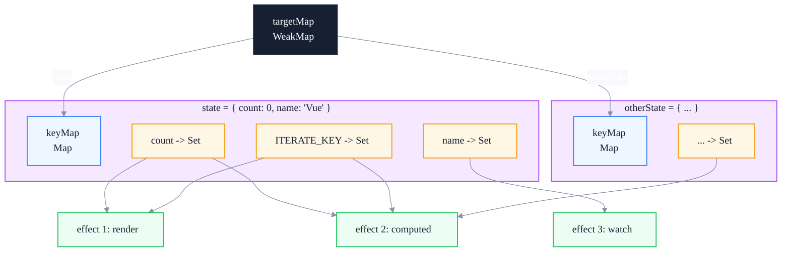
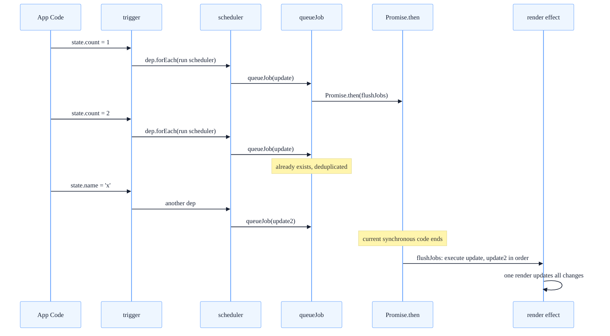

# Vue 3 Reactivity System: The Complete Implementation of Proxy and Dependency Collection

> Subtitle: From Object.defineProperty to Proxy — the dependency collection mechanisms of reactive / ref / computed / effect.
>
> Target readers: Intermediate and senior frontend engineers, advanced Vue users, anyone interested in reactivity-system design.
>
> Reading time: about 26 minutes.

::: info In one sentence
The essence of Vue 3's reactivity system is to use Proxy to intercept reads and writes, and to use a three-layer WeakMap structure to record "who depends on what," so that when data changes, every effect is notified precisely.
:::

## Table of Contents

- [Introduction](#introduction)
- [1. The Fundamental Limitations of Vue 2 Object.defineProperty](#1-the-fundamental-limitations-of-vue-2-objectdefineproperty)
- [2. Proxy and Reflect: The Physical Foundation of Reactivity](#2-proxy-and-reflect-the-physical-foundation-of-reactivity)
- [3. Implementation Principles of reactive, ref, and computed](#3-implementation-principles-of-reactive-ref-and-computed)
- [4. Dependency Collection (track) and Triggering Updates (trigger)](#4-dependency-collection-track-and-triggering-updates-trigger)
- [5. effect and Scheduler: The Execution Entry of Side Effects](#5-effect-and-scheduler-the-execution-entry-of-side-effects)
- [6. Comparison with React's Reactive Model](#6-comparison-with-reacts-reactive-model)
- [7. Several Easy-to-Miss Details](#7-several-easy-to-miss-details)
- [FAQ](#faq)
- [Sources](#sources)

## Introduction

Many frontend engineers understand "reactivity" as "when data changes, the view updates automatically," but they cannot clearly answer the following questions:

- Why can't Vue 2 detect the addition or deletion of object properties?
- Why did Vue 3's switch to Proxy improve performance? Where exactly is the improvement?
- What is the real difference between `reactive` and `ref`? Why not unify them into one?
- What exactly is the "dependency" in dependency collection? Where is it stored?
- What is the relationship among `effect`, `watch`, and `computed`?
- Why does `reactive` lose reactivity after destructuring, while `ref` does not?
- What is the essential difference between Vue's reactivity and React's state update mechanism?

This article aims to build a complete and self-consistent mental model of Vue 3 reactivity. It does not pursue line-by-line source-code interpretation; instead, it focuses on core data structures and design motivations — after reading, you should be able to compare details with the `@vue/reactivity` source code yourself.

::: tip Core argument of this article

Vue 3's reactivity system is a "precise dependency tracking + push-style update" system. It intercepts reads and writes through Proxy, maintains a three-layer WeakMap mapping of "target → key → side-effect set," and directly pushes notifications to relevant effects when data changes. This is the most fundamental difference from React's "component-level pull rendering" model.

:::

---

## 1. The Fundamental Limitations of Vue 2 Object.defineProperty

Vue 2's reactivity is based on `Object.defineProperty`:

```javascript
function defineReactive(obj, key, val) {
  let dep = new Dep() // one Dep per key
  Object.defineProperty(obj, key, {
    enumerable: true,
    configurable: true,
    get() {
      dep.depend() // collect the current Watcher
      return val
    },
    set(newVal) {
      if (newVal === val) return
      val = newVal
      observe(newVal) // new value must also be reactive
      dep.notify() // notify all Watchers
    },
  })
}

function observe(obj) {
  if (typeof obj !== 'object' || obj === null) return
  Object.keys(obj).forEach((key) => {
    defineReactive(obj, key, obj[key])
  })
}
```

This implementation works, but it has four fundamental limitations.

### 1. Cannot Detect Property Addition or Deletion

`defineProperty` can only intercept properties that already exist. If a developer does `obj.newKey = 1` on a reactive object, Vue 2 cannot detect it; they must use `Vue.set(obj, 'newKey', 1)`. This is a frequently criticized API ergonomics issue.

### 2. Array Observation Requires a Hack

`defineProperty` cannot listen to array index assignment (`arr[0] = x`) or `length` changes. Vue 2's solution is to override seven mutating array methods (`push` / `pop` / `shift` / `unshift` / `splice` / `sort` / `reverse`) and manually trigger notifications inside those methods.

```javascript
const methodsToPatch = ['push', 'pop', 'shift', 'unshift', 'splice', 'sort', 'reverse']
methodsToPatch.forEach((method) => {
  const original = arrayProto[method]
  arrayMethods[method] = function (...args) {
    const result = original.apply(this, args)
    const ob = this.__ob__
    // elements added by push/unshift/splice must also be reactive
    let inserted
    switch (method) {
      case 'push':
      case 'unshift':
        inserted = args
        break
      case 'splice':
        inserted = args.slice(2)
        break
    }
    if (inserted) ob.observeArray(inserted)
    ob.dep.notify()
    return result
  }
})
```

### 3. Recursive Traversal at Initialization, Poor Deep-Observation Performance

`observe` recursively traverses the entire object at initialization, installing getter/setter for every key. For large objects, initialization cost is high, and many deep properties may never be read during their lifetime.

### 4. Cannot Listen to Map / Set / WeakMap

`defineProperty` is designed for plain objects and is powerless against collection types such as `Map` and `Set`. In Vue 2, they can only be treated as non-reactive data.

::: tip Core conclusion of this section

The limitations of Vue 2's reactivity are not due to a "bad implementation," but to the `Object.defineProperty` API itself. It can only intercept reads and writes of "already existing properties" and cannot cover arrays or collection types. The fundamental solution to all these problems is to switch to a stronger interception mechanism — Proxy.

:::

---

## 2. Proxy and Reflect: The Physical Foundation of Reactivity

Vue 3 switches to `Proxy`. Proxy can intercept 13 operations (including `get`, `set`, `has`, `deleteProperty`, `ownKeys`, etc.), covering every "cannot be detected" scenario in Vue 2.

### 1. What Proxy Solves

```javascript
const handler = {
  get(target, key, receiver) {
    track(target, key) // collect dependency
    const result = Reflect.get(target, key, receiver)
    if (typeof result === 'object' && result !== null) {
      return reactive(result) // lazy reactivity
    }
    return result
  },
  set(target, key, value, receiver) {
    const result = Reflect.set(target, key, value, receiver)
    trigger(target, key) // trigger update
    return result
  },
  deleteProperty(target, key) {
    const result = Reflect.deleteProperty(target, key)
    trigger(target, key)
    return result
  },
  has(target, key) {
    track(target, key) // 'in' operation also collects
    return Reflect.has(target, key)
  },
  ownKeys(target) {
    track(target, ITERATE_KEY) // Object.keys also collects
    return Reflect.ownKeys(target)
  },
}

function reactive(target) {
  return new Proxy(target, handler)
}
```

Comparison with Vue 2's limitations:

| Limitation | Vue 2 | Vue 3 |
|------------|-------|-------|
| Property addition | `Vue.set` | Direct `obj.newKey = 1` is automatically detected |
| Property deletion | `Vue.delete` | Direct `delete obj.key` is automatically detected |
| Array index assignment | Cannot detect | `arr[0] = x` is automatically detected |
| `length` change | Cannot detect | Automatically detected |
| Map / Set | Not supported | Native support |
| Initialization cost | Recursive traversal | Lazy (proxied only when used) |

### 2. Why Reflect Is Used

The third parameter of `Reflect.get` / `Reflect.set`, `receiver`, solves a subtle problem: when an object has inheritance, the correct `this` should point to the proxy object rather than the original object.

```javascript
const obj = { _value: 0, get value() { return this._value } }
const proxy = new Proxy(obj, {
  get(target, key, receiver) {
    // Without receiver, this points to the original obj, and obj._value is not reactive.
    // With receiver, this points to the proxy, and proxy._value triggers reactivity.
    return Reflect.get(target, key, receiver)
  },
})
```

::: warning Common misconception

Many people write `return target[key]` directly when using Proxy. For objects with getters, this loses reactivity (because `this` is wrong). You must use `Reflect.get(target, key, receiver)`.

:::

### 3. Lazy Reactivity: The Real Source of Performance Advantage

Vue 3's `reactive` does not recursively traverse at initialization. It only returns a proxy for child objects when `get` is called:

```javascript
get(target, key, receiver) {
  const result = Reflect.get(target, key, receiver)
  if (typeof result === 'object' && result !== null) {
    return reactive(result) // proxied only when used
  }
  return result
}
```

And `reactive` has internal caching:

```javascript
const reactiveMap = new WeakMap()
function reactive(target) {
  if (reactiveMap.has(target)) {
    return reactiveMap.get(target) // same object is proxied only once
  }
  const proxy = new Proxy(target, handler)
  reactiveMap.set(target, proxy)
  return proxy
}
```

This means Vue 3's initialization cost is O(1), not Vue 2's O(n). Deep properties enter the reactivity system only when they are read — this is the real source of Vue 3's performance advantage.

::: tip Core conclusion of this section

Proxy is the physical foundation of Vue 3 reactivity. It solves Vue 2's inability to detect addition, deletion, arrays, and collections, and reduces initialization cost from O(n) to O(1) through "lazy proxying + WeakMap caching."

:::

---

## 3. Implementation Principles of reactive, ref, and computed

Vue 3 exposes three main reactivity APIs: `reactive`, `ref`, and `computed`. They correspond to different usage scenarios, but behind them is the same dependency collection mechanism with different wrappers.

### 1. reactive: Proxy for Objects

`reactive` is used for objects (including arrays, Map, and Set). Its implementation is the Proxy + handler shown above. A simplified complete implementation:

```javascript
const reactiveMap = new WeakMap()

function reactive(target) {
  if (!isObject(target)) return target
  if (isReadonly(target)) return target
  if (reactiveMap.has(target)) {
    return reactiveMap.get(target)
  }
  const proxy = new Proxy(target, mutableHandlers)
  reactiveMap.set(target, proxy)
  return proxy
}
```

Note: `reactive` only makes sense for object types. Primitive values (`string`, `number`, `boolean`) cannot be directly proxied by Proxy — this is why `ref` is needed.

### 2. ref: A Wrapper for Primitive Values

JavaScript primitive values (`string`, `number`, `boolean`, `symbol`, `bigint`, `null`, `undefined`) cannot be directly intercepted by Proxy. Vue 3's solution is to wrap them in an object:

```javascript
class RefImpl {
  constructor(value) {
    this._rawValue = value
    this._value = isObject(value) ? reactive(value) : value
    this.dep = new Dep() // its own dependency set
  }

  get value() {
    trackRefValue(this) // collect when read
    return this._value
  }

  set value(newVal) {
    if (newVal !== this._rawValue) {
      this._rawValue = newVal
      this._value = isObject(newVal) ? reactive(newVal) : newVal
      triggerRefValue(this) // trigger when written
    }
  }
}

function ref(value) {
  return new RefImpl(value)
}
```

::: info Engineering insight

The essence of `ref` is "using an object's `.value` property to hold a primitive value." This allows the object's get/set interception to track changes to the primitive value. The `ref.value` syntax is not a design preference, but an inevitable choice under JavaScript language constraints.

:::

`ref` can also hold objects; in that case, `_value` will be the result of `reactive(value)`. This is why `ref({ count: 0 })` allows both wholesale replacement (`ref.value = { count: 1 }`) and direct internal modification (`ref.value.count++`).

### 3. computed: Cached Derived State

`computed` adds a layer of caching on top of effect:

```javascript
class ComputedRefImpl {
  constructor(getter, setter) {
    this._value = undefined
    this._dirty = true // whether recomputation is needed
    this.dep = new Dep()

    this.effect = new ReactiveEffect(getter, () => {
      // scheduler: when dependencies change, do not recompute immediately, just mark dirty
      if (!this._dirty) {
        this._dirty = true
        triggerRefValue(this) // notify computed subscribers
      }
    })
  }

  get value() {
    trackRefValue(this)
    if (this._dirty) {
      this._dirty = false
      // run effect: dependencies will be recollected
      this._value = this.effect.run()
    }
    return this._value
  }

  set value(newVal) {
    if (this.setter) this.setter(newVal)
  }
}

function computed(getter, setter) {
  return new ComputedRefImpl(getter, setter)
}
```

Key design points of `computed`:

1. **Lazy**: not computed at construction time, only when read.
2. **Cached**: directly returns the old value when `_dirty = false`.
3. **Auto-invalidated**: when dependencies change, the scheduler marks `_dirty` as true but does not recompute immediately.
4. **Chain subscription**: computed itself can also be depended on by other effects, forming a dependency chain.

::: tip Core conclusion of this section

`reactive` is object proxying, `ref` is primitive-value wrapping, and `computed` is cached derived state. Behind the three is the same track/trigger mechanism in different packaging. Understanding this is understanding the design unity of Vue 3's reactivity APIs.

:::

---

## 4. Dependency Collection (track) and Triggering Updates (trigger)

Dependency collection is the core of Vue 3's reactivity system. The question it answers is: "When a certain key changes, who needs to be notified?"

### 1. Three-Layer WeakMap Structure

Vue 3 uses a three-layer structure to store dependency relationships:

```javascript
// global dependency mapping
const targetMap = new WeakMap()
// targetMap: target -> keyMap
// keyMap:    key   -> depSet
// depSet:    set of effects

function track(target, key) {
  if (!activeEffect) return

  let keyMap = targetMap.get(target)
  if (!keyMap) {
    keyMap = new Map()
    targetMap.set(target, keyMap)
  }

  let depSet = keyMap.get(key)
  if (!depSet) {
    depSet = new Set()
    keyMap.set(key, depSet)
  }

  depSet.add(activeEffect)
  activeEffect.deps.push(depSet) // reverse reference for cleanup
}

function trigger(target, key) {
  const keyMap = targetMap.get(target)
  if (!keyMap) return

  const depSet = keyMap.get(key)
  if (!depSet) return

  // copy before iterating to avoid modifying the set during iteration
  const effectsToRun = new Set(depSet)
  effectsToRun.forEach((effect) => {
    // avoid an effect triggering itself internally (infinite loop)
    if (effect !== activeEffect) {
      effect.run()
    }
  })
}
```

This structure is illustrated below:



### 2. Why WeakMap Is Used

The outermost layer uses `WeakMap` instead of `Map` because: **when the reactive object itself is destroyed and no other references remain, the corresponding entry in the WeakMap is automatically garbage-collected.** If `Map` were used, it would hold a strong reference to the target, preventing the target from ever being collected — a memory leak.

::: info Design detail

The second layer uses `Map` (keys are strings or symbols), and the third layer uses `Set` (a set of effects). These two layers do not leak, because their lifecycles follow the target.

:::

### 3. activeEffect: The Currently Executing Side Effect

The key question in dependency collection is: "Who should be added during track?" Vue 3 maintains a global variable `activeEffect` pointing to "the effect currently being executed":

```javascript
let activeEffect = null

class ReactiveEffect {
  constructor(fn, scheduler) {
    this.fn = fn
    this.scheduler = scheduler
    this.deps = [] // reverse references for cleanup
  }

  run() {
    const prevEffect = activeEffect
    activeEffect = this
    try {
      return this.fn() // while fn reads reactive data, track adds this to the sets
    } finally {
      activeEffect = prevEffect
    }
  }
}
```

So the real meaning of "dependency collection" is: **when an effect is running, it reads certain reactive data, and it registers itself as a subscriber to those data.**

### 4. Nested effect and effectScope

Effects can be nested (for example, a computed is triggered during component rendering). Vue 3 uses a stack to manage this:

```javascript
function run() {
  const prevEffect = activeEffect
  activeEffect = this
  try {
    return this.fn()
  } finally {
    activeEffect = prevEffect // restore outer effect
  }
}
```

The outer effect continues to be `activeEffect` after the inner effect finishes, and data read by the inner effect is not collected by the outer effect — this is the correct behavior.

::: tip Core conclusion of this section

Dependency collection is stored in a three-layer structure of `WeakMap(target) -> Map(key) -> Set(effect)`. During track, the "currently running effect" is added to the corresponding set; during trigger, that set is retrieved and each effect is executed. This is the "skeleton" of Vue's reactivity system.

:::

---

## 5. effect and Scheduler: The Execution Entry of Side Effects

`effect` is the lowest-level concept in the reactivity system. `watch`, `computed`, and component render functions are essentially effects.

### 1. Basic Structure of effect

```javascript
function effect(fn, options = {}) {
  const _effect = new ReactiveEffect(fn, options.scheduler)
  if (!options.lazy) {
    _effect.run() // execute immediately once to establish dependencies
  }
  return _effect
}
```

After calling `effect(fn)`:

1. `fn` is executed immediately once; during this time, reactive data read will add `_effect` to their subscriber sets.
2. Afterward, any dependency change will call `_effect.run()` and re-execute `fn`.
3. When re-executing, dependencies are read again, and dependency relationships are refreshed (old dependencies may be cleaned up).

### 2. Scheduler: Controlling When Side Effects Execute

If no scheduler is specified, trigger directly calls `effect.run()`. But in many scenarios, we do not want immediate execution:

- Component rendering: we want to batch it to the next microtask to avoid multiple synchronous re-renders.
- computed: we want to delay recomputation until the next read.
- watch: we want the callback to execute asynchronously.

The scheduler is this control point:

```javascript
const _effect = new ReactiveEffect(fn, (/* args */) => {
  // when dependencies change, do not call fn; call the scheduler instead
  // the scheduler decides when and how to call fn
})
```

Vue's component render effect uses the scheduler to implement asynchronous batched updates:

```javascript
function setupRenderEffect(instance, container) {
  const update = () => {
    const subTree = instance.render.call(instance.proxy)
    patch(instance.subTree, subTree, container)
    instance.subTree = subTree
  }

  const effect = new ReactiveEffect(update, () => {
    // scheduler: push update into the queue and flush uniformly on next tick
    queueJob(update)
  })

  effect.run() // first render
}
```

### 3. nextTick and Batched Updates

Vue's updates are asynchronous: multiple `setState` calls within the same tick are merged into a single re-render. The core of this mechanism is `queueJob`:

```javascript
const queue = []
let isFlushing = false
const resolvedPromise = Promise.resolve()

function queueJob(job) {
  if (!queue.includes(job)) {
    queue.push(job)
    if (!isFlushing) {
      isFlushing = true
      resolvedPromise.then(flushJobs)
    }
  }
}

function flushJobs() {
  try {
    for (let i = 0; i < queue.length; i++) {
      queue[i]()
    }
  } finally {
    queue.length = 0
    isFlushing = false
  }
}

export function nextTick(cb) {
  return resolvedPromise.then(cb || (() => {}))
}
```

Execution flow:



::: info Engineering insight

Vue's batched updates are not based on the "event loop" but on the "microtask queue." Therefore, `nextTick` is also implemented with `Promise.then`. This differs from React 18's Automatic Batching — React's batching is based on the Lane model + scheduler and covers a broader scope (including `setState` inside asynchronous callbacks).

:::

### 4. The Relationship Among effect, computed, and watch

All three are essentially effects:

| API | Internal implementation | Scheduler behavior |
|-----|------------------------|--------------------|
| `effect(fn)` | Directly creates ReactiveEffect | Executes synchronously by default |
| `computed(fn)` | Creates an effect with a dirty flag | Only marks dirty, does not recompute immediately |
| `watch(source, cb)` | Creates an effect with a cb callback | Executes cb asynchronously |
| render effect | Creates the component's rendering side effect | queueJob for asynchronous batching |

::: tip Core conclusion of this section

`effect` is the underlying abstraction of Vue reactivity; `computed`, `watch`, and component rendering are all variants of effect. The scheduler is the key hook that controls "when to execute side effects," allowing Vue to turn synchronous triggers into asynchronous batched updates.

:::

---

## 6. Comparison with React's Reactive Model

Vue's reactivity system and React's state update mechanism are two completely different models. Understanding this difference helps make correct technology choices in intermediate-to-advanced projects.

### 1. Push vs Pull

```mermaid
%%{init: {'theme': 'base', 'themeVariables': { 'fontFamily': 'Inter, PingFang SC, Microsoft YaHei, sans-serif', 'primaryColor': '#EEF6FF', 'primaryTextColor': '#172033', 'primaryBorderColor': '#6EA8FE', 'lineColor': '#8A94A6', 'secondaryColor': '#F7F9FC', 'tertiaryColor': '#FFF7E6'}}}%%
flowchart TB
    subgraph Vue["Vue: Push Model"]
        V1["state.count = 1"]
        V2["setter interception"]
        V3["trigger: find the dep for this key"]
        V4["execute subscribed effect"]
        V5["only update affected components"]

        V1 --> V2 --> V3 --> V4 --> V5
    end

    subgraph React["React: Pull Model"]
        R1["setState(1)"]
        R2["mark component dirty"]
        R3["scheduler arranges task"]
        R4["re-render entire component"]
        R5["Virtual DOM diff"]
        R6["commit real DOM updates"]

        R1 --> R2 --> R3 --> R4 --> R5 --> R6
    end

    classDef vue fill:#ECFDF3,stroke:#22C55E,color:#172033,stroke-width:1.5px;
    classDef react fill:#EEF6FF,stroke:#3B82F6,color:#172033,stroke-width:1.5px;

    class V1,V2,V3,V4,V5 vue;
    class R1,R2,R3,R4,R5,R6 react;
```



**Vue (Push)**: when data changes, the setter immediately finds subscribers and notifies them. Updates are "precise" — only effects that depend on that data are executed.

**React (Pull)**: `setState` only marks the component as "needs update"; real rendering happens when the scheduler decides to execute it. React does not know "which data changed," so it can only re-run the entire component function and then use Virtual DOM diff to find the real changes.

### 2. Immutable vs Mutable

```javascript
// React: immutable, returns a new object each time
const [user, setUser] = useState({ name: 'A', age: 18 })
setUser({ ...user, age: 19 }) // must create a new object

// Vue: mutable, direct modification
const user = reactive({ name: 'A', age: 18 })
user.age = 19 // direct modification
```

React's immutable model makes "object reference change" the signal for "data change" — because React has no ability to intercept writes. Vue can be mutable because it intercepts writes through Proxy.

### 3. Component-Level vs Field-Level

- React: state changes trigger **re-rendering of the entire component**, then diff decides which DOM to update.
- Vue: state changes trigger **a specific effect** (possibly a render effect, a watch, or a computed).

This is why Vue performs excellently in scenarios with a large number of fine-grained updates — it does not need to re-run the entire component; it only needs to trigger the corresponding effect.

### 4. Dependency Tracking: Manual vs Automatic

```javascript
// React: manually declare dependencies
useEffect(() => {
  console.log(count, name)
}, [count, name]) // dependency array required

// Vue: automatic tracking
watchEffect(() => {
  console.log(count.value, name.value) // automatically collected
})
```

Vue's automatic dependency tracking comes from the track mechanism — data read while an effect is running automatically become dependencies. React's `useEffect` has no reactivity system support, so the dependency array must be written manually; this is an important source of React Hooks mental burden.

::: warning Trade-offs

Vue's automatic tracking is not "absolutely better." Its costs are:

- Reactive data must be accessed explicitly (`.value`, `reactive` wrapping) to be tracked.
- Destructuring a reactive object loses reactivity.
- Reads inside asynchronous code are not tracked (because `activeEffect` has already left the stack).

React's manual dependency array is tedious, but its semantics are clearer and easier to statically analyze.

:::

::: tip Core conclusion of this section

Vue is a "precise dependency tracking + push" model; React is a "component dirty marking + pull re-rendering" model. Neither is absolutely superior; they are trade-offs under different design philosophies: Vue uses Proxy to gain fine-grained updates and automatic dependency tracking, while React uses immutability and manual dependencies to gain clearer semantics and more statically analyzable code.

:::

---

## 7. Several Easy-to-Miss Details

### 1. Destructuring reactive Loses Reactivity

```javascript
const state = reactive({ count: 0 })
const { count } = state // after destructuring, count is a plain number
// later changes to state.count will not update count
```

Reason: destructuring executes `Reflect.get`, which returns the primitive value and is no longer intercepted by Proxy.

Solution: use `toRefs` to turn each property into a ref:

```javascript
const state = reactive({ count: 0 })
const { count } = toRefs(state)
count.value // reactive
```

### 2. ref Is Automatically Unwrapped in Templates, but Not in JS

```html
<template>
  <div>{{ count }}</div> <!-- auto unwrapped, no .value needed -->
</template>

<script setup>
const count = ref(0)
console.log(count) // RefImpl object
count.value = 1    // in JS, .value is required
</script>
```

This is because Vue's template compiler creates an auto-unwrapping proxy for top-level refs.

### 3. Replacing the Entire reactive Object Does Not Trigger Updates

```javascript
const state = reactive({ count: 0 })
state = reactive({ count: 1 }) // ❌ wrong: state is const, and replacing the reference does not update the view
```

Correct approaches:

```javascript
const state = ref({ count: 0 })
state.value = { count: 1 } // ✅ replace value, trigger update

// or
const state = reactive({ count: 0 })
Object.assign(state, { count: 1 }) // ✅ assign property by property
```

### 4. Dependency Collection Fails in Asynchronous Code

```javascript
watchEffect(async () => {
  const data = await fetchData() // after await, activeEffect has already been cleared
  console.log(state.count) // ❌ will not be collected as a dependency
})
```

Reason: after `await`, the effect has already exited, and `activeEffect` has been restored to its previous value (usually null). Therefore, reading `state.count` does not trigger track.

Solution: read reactive values before await:

```javascript
watchEffect(async () => {
  const count = state.count // ✅ read before await
  const data = await fetchData()
  console.log(count)
})
```

### 5. Side-Effect Pitfalls in computed

```javascript
const double = computed(() => {
  console.log('computing') // ❌ do not perform side effects in computed
  return state.count * 2
})
```

`computed` should be a pure function. Under the `scheduler` mechanism, computed may be recomputed at unpredictable times (marked dirty on every dependency change, but only recalculated on next read), and side effects may "execute repeatedly" or "be out of order."

::: tip Core conclusion of this section

Common pitfalls in Vue reactivity all come from the "boundaries of Proxy interception": destructuring loses reactivity, differential ref unwrapping behavior, object replacement, asynchronous code, and computed side effects. Understanding the essence of these pitfalls is the watershed between "knowing how to use Vue" and "mastering Vue."

:::

---

## FAQ

### 1. Why Doesn't Vue 3 Use Proxy to Directly Proxy Primitive Values?

A Proxy target must be an object; it cannot proxy `string` / `number` / `boolean`. Therefore, Vue 3 uses `ref` to wrap primitive values in an object's `.value` property, and uses the object's get/set interception to achieve reactivity. This is a JavaScript language limitation, not a design preference.

### 2. Should I Choose `ref` or `reactive`?

Simple rule: use `ref` for primitive values and `reactive` for objects. But in fact `ref` can also hold objects (internally it will call `reactive`). If you want "replaceable as a whole" semantics (`state.value = newObj`), use `ref`; if you want "modify by property" semantics (`state.count++`), use `reactive`. Combining them is also common: `const state = ref(reactive({ ... }))`.

### 3. Is Vue 3 Reactivity Faster Than React?

It cannot be simply compared. Vue has advantages in "fine-grained update" scenarios (only triggering relevant effects, no need to diff the entire component); React also has advantages in "large component tree + lots of state" scenarios (Virtual DOM diff uses less memory than Vue's dependency tracking). The performance differences are more reflected in different usage patterns; conclusions cannot be drawn independent of scenario.

### 4. Why Is `watch` Asynchronous by Default, and Is `watchEffect` Also Asynchronous?

Both use the scheduler to push callbacks into the queue and execute them on the next tick. This allows multiple state changes within the same tick to be merged into a single callback execution. If synchronous execution is needed, use the `flush: 'sync'` option.

### 5. Is Proxy Really Faster Than defineProperty?

Initialization performance is better (Vue 3 uses lazy proxying, O(1); Vue 2 uses recursive traversal, O(n)). However, the single-read interception cost of Proxy is not necessarily faster than defineProperty — Proxy trap calls themselves have overhead. Overall, Vue 3's performance advantage mainly comes from "laziness" and "precise dependency tracking," not from Proxy itself being faster than defineProperty.

### 6. Can Vue's Reactivity System Be Used Without Vue?

Yes. `@vue/reactivity` is an independent package and can be used in non-Vue projects. For example, you can use `reactive` + `effect` to implement your own state manager, or use `computed` to cache derived state in Node.js. Vue 3 split the reactivity system into an independent package precisely so that it can be used outside the framework.

---

## Sources

1. Vue 3 Official Docs - Reactivity Fundamentals: <https://vuejs.org/guide/essentials/reactivity-fundamentals.html>
2. Vue 3 Official Docs - Reactivity in Depth: <https://vuejs.org/guide/extras/reactivity-in-depth.html>
3. Evan You - Vue 3 Reactivity Design Discussions: <https://github.com/vuejs/rfcs/discussions/categories/reactivity>
4. Vue Source Code (packages/reactivity): <https://github.com/vuejs/core/tree/main/packages/reactivity>
5. MDN - Proxy: <https://developer.mozilla.org/en-US/docs/Web/JavaScript/Reference/Global_Objects/Proxy>

This article is also based on the author's practical reading and summarization of the Vue source code.
