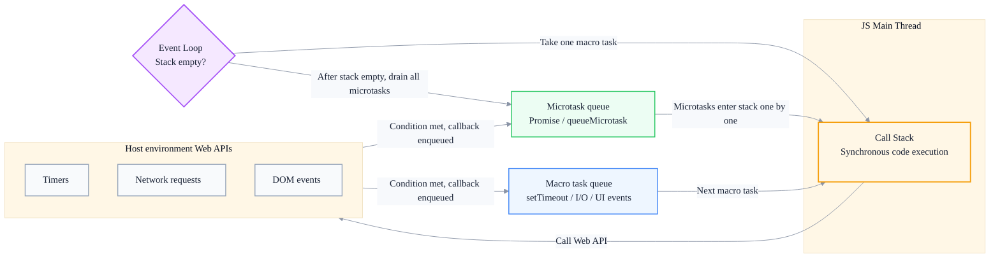
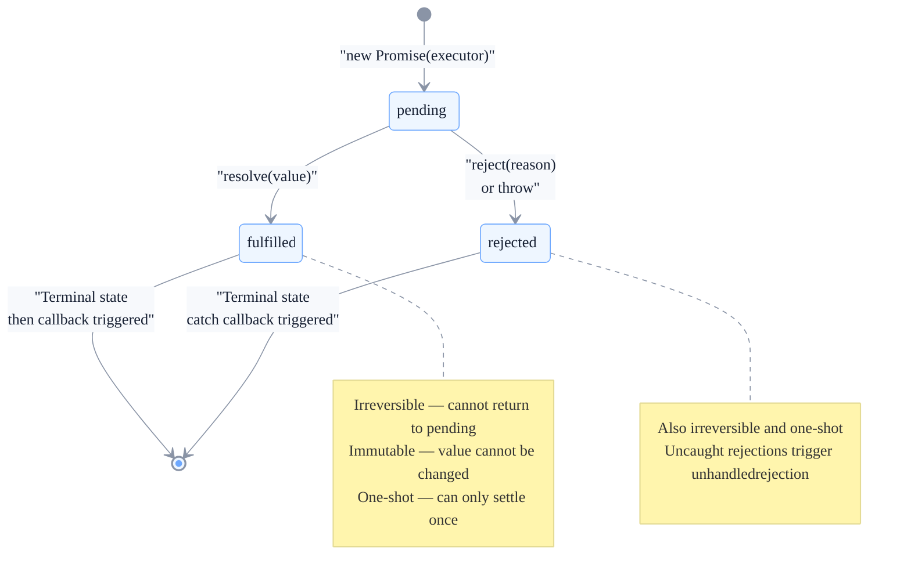
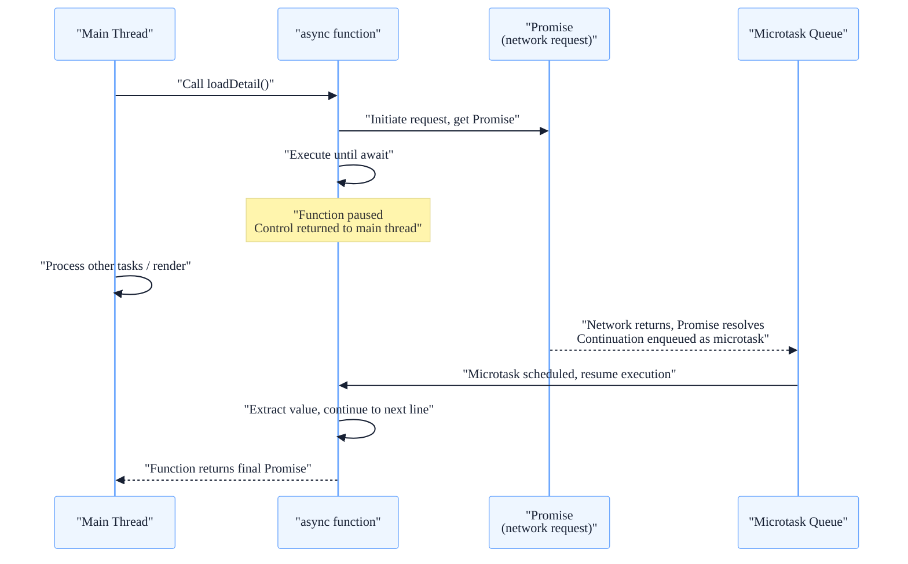

# Async Programming Evolution: From Callback Hell to async/await

> Subtitle: From single-threaded event loop, macro/micro task scheduling, callback trust issues, Promise state machine, to the async/await execution model.
>
> Target readers: Intermediate and senior frontend engineers, frontend architects.
>
> Reading time: ~26 minutes.

::: info In one sentence
Every evolution of JavaScript asynchronous programming is essentially solving the same problem — "how to reliably express 'something that will happen later' without blocking the main thread."
:::

## Table of Contents

- [Introduction](#introduction)
- [1. Single Threading and the Event Loop: The Physical Foundation of Asynchrony](#1-single-threading-and-the-event-loop-the-physical-foundation-of-asynchrony)
- [2. Macro Tasks and Micro Tasks: The Overlooked Execution Order](#2-macro-tasks-and-micro-tasks-the-overlooked-execution-order)
- [3. The Callback Era: Inversion of Control and Trust Issues](#3-the-callback-era-inversion-of-control-and-trust-issues)
- [4. Promise: Understanding It from the State Machine Perspective](#4-promise-understanding-it-from-the-state-machine-perspective)
- [5. async/await: Syntactic Sugar or Revolution?](#5-asyncawait-syntactic-sugar-or-revolution)
- [6. Best Practices for Asynchronous Error Handling](#6-best-practices-for-asynchronous-error-handling)
- [7. Common Asynchronous Pitfalls and Concurrency Control](#7-common-asynchronous-pitfalls-and-concurrency-control)
- [Conclusion: The Essence of Asynchrony Is Scheduling](#conclusion-the-essence-of-asynchrony-is-scheduling)
- [FAQ](#faq)
- [Sources](#sources)

## Introduction

Writing asynchronous code is a daily task for frontend engineers: fetching APIs, reading local storage, timers, animations, message passing — almost everything involves "execute after a while." Yet not many people can write async code that is correct, clear, and reliable.

Many problems appear to be "unfamiliar syntax" but are actually "unclear mental models":

- Why doesn't `setTimeout(fn, 0)` execute immediately? Where exactly does it queue?
- Which runs first, `Promise.then` or `setTimeout`? Why?
- Why doesn't `await` inside `forEach` work?
- What exactly does `await` "block" inside an `async` function? Does it block the main thread?
- What is the essential difference between `Promise.all` and `Promise.allSettled` for error handling?

To answer these questions, we must first understand JavaScript's single-threaded model and the event loop, then understand why callbacks have trust issues, how Promise solves them with a state machine, and finally what async/await adds on top of Promise. This article follows this evolutionary thread.

::: tip Key takeaway of this section
The evolution of async programming is not simply "syntax becoming cleaner." It is a shift from "callbacks hand over control" to "Promise regains control with an irreversible state," and then to "async/await gives async code synchronous readability." Each evolution redistributes who holds the initiative of scheduling.
:::

---

## 1. Single Threading and the Event Loop: The Physical Foundation of Asynchrony

JavaScript is **single-threaded** — it has only one call stack and can execute only one piece of code at a time. This is a historical choice: in the browser, JS manipulates the DOM, and multithreaded concurrent DOM manipulation would cause severe synchronization issues; a single thread is the simplest and safest model.

But single-threading means that if a task takes a long time (e.g., waiting for a network response), the entire page "freezes." So JavaScript designed the **event loop** mechanism: tasks that need to wait do not occupy the call stack — you hang up "what to do later" and come back to execute when the conditions are met.

### 1. Core Components of the Event Loop

The event loop relies on several key parts:

1. **Call Stack**: where synchronous code executes, last-in-first-out.
2. **Host environment (browser / Node)**: provides Web APIs such as timers, network requests, and DOM events. These APIs are often multithreaded at the lower level, but callbacks ultimately return to the JS single thread for execution.
3. **Task Queue**: stores callbacks awaiting execution.
4. **Event Loop**: constantly checks whether "the call stack is empty" and "whether there are tasks in the queue," pushing ready tasks onto the call stack.



### 2. One Tick of the Loop

Each tick of the event loop roughly does the following:

1. Take **one** task from the macro task queue and execute it.
2. After the current macro task finishes, **drain all** microtasks produced during its execution.
3. If necessary, perform UI rendering (the browser decides whether to render based on refresh rate, roughly every 16.67 ms).
4. Return to step 1 and take the next macro task.

```javascript
console.log('1. 同步开始')

setTimeout(() => {
  console.log('4. 宏任务 setTimeout')
}, 0)

Promise.resolve().then(() => {
  console.log('3. 微任务 Promise')
})

console.log('2. 同步结束')

// Output order: 1 → 2 → 3 → 4
```

`setTimeout`'s callback enters the macro task queue, `Promise.then`'s callback enters the microtask queue. Synchronous code (1, 2) runs first, then microtasks are drained (3), and finally the next macro task runs (4).

::: tip Key takeaway of this section
Single-threaded JS + the event loop is the physical foundation of asynchrony. Synchronous code runs on the call stack; asynchronous callbacks are hosted by the environment and, once ready, enter task queues to wait for the main thread to become idle. Understanding "queues" and "polling" is the prerequisite for understanding all asynchronous behavior.
:::

::: warning Common misconception
Thinking that `setTimeout(fn, 0)` will execute "immediately." In fact, 0 is only the "earliest possible execution time"; the callback still has to wait for the current synchronous code and all microtasks to finish before it can enter the stack, and browsers have a minimum delay clamp (4 ms per the HTML5 spec, longer with deeper nesting).
:::

---

## 2. Macro Tasks and Micro Tasks: The Overlooked Execution Order

There is more than one task queue; the most important are the **macro task queue** and the **microtask queue**. Their scheduling timing differs, and this is the root of many "weird order" problems.

### 1. What Is a Macro Task and What Is a Micro Task?

- **Macro task**: `setTimeout` / `setInterval`, I/O callbacks, UI events (click, scroll), `postMessage`, `MessageChannel`, Node's `setImmediate` / `fs` callbacks, etc.
- **Microtask**: `Promise.then` / `catch` / `finally`, `queueMicrotask`, `MutationObserver`, Node's `process.nextTick` (which has even higher priority than ordinary microtasks).

### 2. Key Rule: Microtasks Are Drained After Every Macro Task

The most easily overlooked rule is: **after each macro task completes, the engine drains all current microtasks before moving to the next macro task**. This means microtasks can "cut in line" ahead of the next macro task.

```javascript
setTimeout(() => {
  console.log('宏任务 A')
  Promise.resolve().then(() => console.log('  微任务 A1'))
}, 0)

setTimeout(() => {
  console.log('宏任务 B')
  Promise.resolve().then(() => console.log('  微任务 B1'))
}, 0)

// Output:
// 宏任务 A
//   微任务 A1
// 宏任务 B
//   微任务 B1
```

After each macro task, the microtasks it produced are cleared before the next macro task is fetched. Microtasks never "accumulate" between macro tasks.

### 3. Where Rendering Happens

Browser rendering occurs between macro tasks, after microtasks have been drained. This means: if you change the DOM in a macro task and then continue changing it with a microtask, the browser can see the merged result before rendering; but if you schedule follow-up changes with `setTimeout`, the browser may render once between the two changes, causing "flicker."

```javascript
// Batch update with microtasks, merged before rendering
function batchUpdate() {
  element.style.left = '10px'
  queueMicrotask(() => {
    element.style.left = '20px' // Takes effect before rendering; user only sees 20px
  })
}
```

::: tip Key takeaway of this section
The core difference between macro tasks and microtasks is "scheduling timing": one macro task executes per tick, while all microtasks in a tick are drained. Microtasks always run before the next macro task and before rendering. Mastering this rule lets you predict the output order of the vast majority of asynchronous code.
:::

::: info Engineering implication
Use `queueMicrotask` for logic that needs to run "as soon as possible but asynchronously"; use `setTimeout(fn, 0)` or `requestAnimationFrame` for logic that needs to "yield the main thread to rendering." Do not mix them up.
:::

---

## 3. The Callback Era: Inversion of Control and Trust Issues

Before Promise, asynchrony relied almost entirely on callbacks: you passed "what to do later" as a function to an asynchronous operation, and it called you back when done.

### 1. Inversion of Control

The essence of callbacks is **inversion of control**: you no longer control "when to call, how many times, or with what arguments"; you hand that control over to a third party (a library, an API, a piece of code you do not fully trust).

```javascript
// Your code
asyncOperation(data, function callback(result) {
  updateUI(result) // When this function is called is not up to you
})
```

### 2. The Trust Problem with Callbacks

Kyle Simpson in *You Don't Know JS* listed the trust problems callbacks face — you assume the callback will execute as agreed, but the third party might:

- Call **too early**: callback before the async operation truly completes.
- Call **too late**: or never call at all.
- Call **too few or too many times**: e.g., callback triggered 0 or 3 times.
- **Swallow errors**: not notify you when something goes wrong.
- **Wrong arguments**: return unexpected data.

These problems are not rare in real engineering: a buggy third-party library may call the success callback twice, causing your UI update to run twice; an unhandled timeout may leave your loading spinner forever.

### 3. Callback Hell: Nesting and Lost Control Flow

When multiple asynchronous steps depend on each other, callbacks can only nest deeper and deeper:

```javascript
getUser(userId, function (err, user) {
  if (err) return handleError(err)
  getOrders(user.id, function (err, orders) {
    if (err) return handleError(err)
    getOrderDetail(orders[0].id, function (err, detail) {
      if (err) return handleError(err)
      renderDetail(detail)
    })
  })
})
```

This "pyramid of doom" is not just ugly; more fatally, **control flow is shattered**. Error handling has to be repeated on every level and cannot be unified; adding or reordering a step in the middle requires reshuffling the entire nested structure; sharing variables across steps can only be done through closures passed layer by layer.

::: tip Key takeaway of this section
The problem with callbacks is not "nesting is ugly"; it is "control leaks out + trust is uncontrollable + control flow is shattered." Promise was created precisely to regain control and solve the trust problem with a unified model.
:::

::: warning Common misconception
Thinking that "using named functions instead of anonymous functions solves callback hell." Named functions only solve readability; they do not solve inversion of control or trust issues — how many times or when the callback is called remains outside your control.
:::

---

## 4. Promise: Understanding It from the State Machine Perspective

The best way to understand Promise is not to treat it as "syntactic sugar for callbacks," but as a **finite state machine**.

### 1. Three States and Irreversible Transitions

A Promise has three states:

- **pending**: initial state, not yet settled.
- **fulfilled**: operation succeeded, associated with a value.
- **rejected**: operation failed, associated with a reason.

The transition rules are very strict:

1. Only pending → fulfilled, or pending → rejected. **Once settled, the state is forever irreversible**.
2. Settlement can happen **only once**. A second resolve / reject is silently ignored.



### 2. How the State Machine Solves Trust Problems

Returning to the trust checklist of the callback era, the state machine rules resolve each one:

- **Called too many times**: irreversible state + one-time settlement means only the first resolve takes effect.
- **Called too few / never called**: you can use `Promise.race` with a timeout Promise as a fallback.
- **Called too early**: Promise's `then` callbacks are **always asynchronous** (microtasks); even if the executor resolves synchronously, the callback will not execute synchronously in the current tick, avoiding the race condition of "synchronous callbacks."
- **Swallowing errors**: rejections propagate down the chain until caught by `catch`; completely uncaught rejections trigger the browser's `unhandledrejection` event.

### 3. `then` Returns a New Promise: The Essence of Chaining

`then` does not modify the original Promise; it **returns a new Promise**. This is the foundation of chaining and frees Promise from "callback nesting":

```javascript
getUser(userId)
  .then((user) => getOrders(user.id))     // Returns a new Promise
  .then((orders) => getOrderDetail(orders[0].id))
  .then((detail) => renderDetail(detail))
  .catch((err) => handleError(err))        // Any step's rejection jumps here

// Equivalent to a flattened pipeline, not a pyramid
```

- If the `then` callback returns a Promise, the next `then` waits for it to settle.
- If it returns an ordinary value, the next `then` receives that value immediately.
- If it throws, the chain enters the rejected state and jumps to the nearest `catch`.

```javascript
Promise.resolve(1)
  .then((n) => n + 1)                       // Returns 2 (ordinary value)
  .then((n) => Promise.resolve(n * 10))     // Returns a Promise, waits for it to settle as 20
  .then((n) => { throw new Error('boom') }) // Enters rejected
  .then((n) => console.log('不会执行'))      // Skipped
  .catch((err) => console.log(err.message)) // 'boom'
```

::: tip Key takeaway of this section
Promise is a finite state machine of "irreversible + one-time settlement + asynchronous triggering." It regains the control lost by callbacks through state rules, and achieves flat chaining by having `then` return a new Promise. Understanding the state machine is the key to understanding Promise error propagation and combination APIs.
:::

::: warning Common misconception
Thinking that in `.then(a).then(b)`, `a` and `b` modify the same Promise. In fact, each `then` returns a **new** Promise; once the original Promise is settled, its state is fixed, and each step in the chain is an independent new Promise.
:::

---

## 5. async/await: Syntactic Sugar or Revolution?

`async/await` entered the standard with ES8 in 2017. On the surface it is syntactic sugar for Promise, but its impact on asynchronous code readability and error handling is revolutionary.

### 1. What It Adds on Top of Promise

- **`async` functions always return a Promise**: if you return an ordinary value, it is wrapped as `Promise.resolve(value)`; if you return a Promise, it is used directly; if you throw, the returned Promise becomes rejected.
- **`await` pauses execution of the current async function**: it waits for the Promise on the right to settle, then extracts the value and continues. **It does not block the main thread**; while paused, the main thread can process other tasks, and the remainder of the function is registered as a microtask to resume after settlement.

```javascript
async function loadDetail(userId) {
  const user = await getUser(userId)        // Pause, wait for Promise to settle
  const orders = await getOrders(user.id)
  const detail = await getOrderDetail(orders[0].id)
  return renderDetail(detail)
}
```

This code reads like synchronous code, but execution is asynchronous — at every `await`, control is returned to the event loop.

### 2. The Execution Timing of `await`



Key point: `await` pauses **this async function**, not the main thread. While paused, the main thread is free to respond to user input, execute other callbacks, and render. The "rest of the function" resumes as a microtask after the Promise settles.

### 3. Why It Is a Revolution

Promise solved trust and nesting, but chained `.then` still has pain points: variable scope is shattered (each step only sees the previous step's value; cross-step shared variables require closures), control flow (conditions, loops) is hard to express, and error handling is scattered.

`async/await` lets you use `if` / `for` / `try` / `catch` directly in asynchronous code:

```javascript
async function loadAll() {
  const list = await getList()
  const result = []
  for (const id of list) {
    // await directly inside the loop, serial loading
    result.push(await getItem(id))
  }
  return result
}
```

This logic would be very awkward to write with pure Promise — you would need manual recursion or `reduce` to chain the steps. `async/await` restores "asynchronous flow control" to the most familiar synchronous control-flow syntax.

::: tip Key takeaway of this section
`async/await` is syntactic sugar on top of Promise, but it gives asynchronous code synchronous readability: coherent variable scope, natural control flow (conditions / loops), and unified error handling. Its essence is simulating synchronous semantics with "function pause + microtask resume," but the underlying mechanism is still Promise and the event loop.
:::

::: warning Common misconception
Thinking that `await` blocks the main thread. It only blocks execution of the current async function; the main thread is idle and responsive during the wait. If the page freezes while awaiting a slow operation, the cause is a long synchronous task elsewhere, not `await` itself.
:::

---

## 6. Best Practices for Asynchronous Error Handling

Asynchronous error handling is an accident-prone area. Core principle: **errors must be caught explicitly and never swallowed silently**.

### 1. Use try/catch with async/await

```javascript
async function load() {
  try {
    const data = await fetch('/api/data').then((r) => r.json())
    return data
  } catch (err) {
    console.error('加载失败', err)
    notifyUser('加载失败，请重试')
    return null
  }
}
```

`await` turns a Promise rejection into a thrown exception, so `try/catch` can uniformly catch errors along the await chain.

### 2. Don't Forget catch, and Don't Swallow Silently

```javascript
// Anti-pattern: swallows error; you never know what happened
someAsync().catch(() => {})

// Anti-pattern: forgets catch; unhandledrejections silently accumulate
someAsync()
```

If you really need to "ignore" an error, at least log it or convert it to a semantically clear default value:

```javascript
someAsync().catch((err) => {
  logger.warn('非关键操作失败', err)
  return null
})
```

### 3. Error Semantics of the Four Combination APIs

Understanding the differences among `all` / `allSettled` / `any` / `race` is key to concurrent error handling:

| API | Success condition | Failure behavior | Use case |
| --- | --- | --- | --- |
| `Promise.all` | All succeed | Reject as soon as any fails (fail-fast) | All must succeed |
| `Promise.allSettled` | Always resolves | Returns a status descriptor for each | Want every result |
| `Promise.any` | Any one succeeds | Reject only if all fail | Take the first successful one |
| `Promise.race` | First to settle | First to settle (success or failure) | Timeouts / cancellation control |

```javascript
// allSettled: even partial failures do not lose information
const results = await Promise.allSettled([
  fetch('/api/a'),
  fetch('/api/b'),
  fetch('/api/c'),
])
const ok = results.filter((r) => r.status === 'fulfilled').map((r) => r.value)
const failed = results.filter((r) => r.status === 'rejected')
```

::: tip Key takeaway of this section
Three principles of asynchronous error handling: wrap `await` in try/catch; never swallow errors silently (at least log them); choose `all` / `allSettled` / `any` / `race` as needed. `allSettled` is best for "continue even if some fail."
:::

::: info Engineering implication
Register a global `unhandledrejection` listener at the application entry point to report all uncaught Promise errors to the monitoring platform. This is the last line of defense for discovering "forgotten catch."
:::

```javascript
window.addEventListener('unhandledrejection', (event) => {
  tracker.report({
    type: 'unhandled_promise_rejection',
    reason: event.reason,
  })
})
```

---

## 7. Common Asynchronous Pitfalls and Concurrency Control

### 1. `forEach` Does Not Wait for `await`

`Array.prototype.forEach` does not wait for `await` inside its callback, because it fundamentally does not care about the Promise returned by the callback:

```javascript
// Anti-pattern: three requests fire almost simultaneously, and the function will not wait
async function wrong() {
  [1, 2, 3].forEach(async (id) => {
    await getItem(id) // forEach will not wait for this await
  })
  console.log('done') // Prints almost immediately while requests are still in flight
}
```

The correct approach is `for...of` (serial) or `Promise.all` (parallel):

```javascript
// Serial: one completes before the next
async function sequential() {
  for (const id of [1, 2, 3]) {
    await getItem(id)
  }
  console.log('done') // Prints only after all are completed
}

// Parallel: fire all at once, wait for all
async function parallel() {
  await Promise.all([1, 2, 3].map((id) => getItem(id)))
  console.log('done')
}
```

### 2. Serial vs. Parallel: Don't Turn Parallel Work into Serial with `await`

```javascript
// Anti-pattern: three independent requests are dragged into serial; total time = a + b + c
async function slow() {
  const a = await fetchA()
  const b = await fetchB()
  const c = await fetchC()
  return { a, b, c }
}

// Good: fire simultaneously; total time ≈ max(a, b, c)
async function fast() {
  const [a, b, c] = await Promise.all([fetchA(), fetchB(), fetchC()])
  return { a, b, c }
}
```

Only use serial `await` when requests **depend** on each other; independent requests should use `Promise.all` in parallel.

### 3. Concurrency Limiting: Control with a Promise Pool

When the number of tasks is large (e.g., batch requests for 1000 URLs), `Promise.all` will fire all 1000 requests at once, potentially overwhelming the server or hitting browser concurrency limits. A concurrency limiter is needed:

```javascript
async function mapWithConcurrency(items, limit, worker) {
  const results = new Array(items.length)
  let cursor = 0
  const runners = new Array(Math.min(limit, items.length))
    .fill(0)
    .map(async () => {
      while (cursor < items.length) {
        const index = cursor++
        results[index] = await worker(items[index], index)
      }
    })
  await Promise.all(runners)
  return results
}

// At most 5 concurrent
const data = await mapWithConcurrency(urls, 5, (url) =>
  fetch(url).then((r) => r.json())
)
```

### 4. Forgetting `await`: The Danger of Fire-and-Forget

```javascript
async function save() {
  // Forgot await; error will not enter try/catch, function returns immediately
  syncToRemote()
  return 'saved'
}
```

The Promise returned by `syncToRemote` is not `await`ed, so its rejection will not enter `save`'s try/catch; it becomes an unhandledrejection. If you really want "fire-and-forget," at least `.catch` it:

```javascript
syncToRemote().catch((err) => tracker.report(err))
```

::: tip Key takeaway of this section
Concurrency control points: `forEach` does not wait for `await`; use `for...of` or `Promise.all`; use `Promise.all` for independent tasks and serial only for dependent tasks; use a concurrency limiter for large batches; any fire-and-forget Promise must `.catch` to avoid silent rejection.
:::

---

## Conclusion: The Essence of Asynchrony Is Scheduling

Tying the evolutionary thread together:

1. **Single-threading + event loop** is the physical foundation of asynchrony: the call stack executes synchronous code, the host environment hosts asynchronous operations, and ready callbacks queue to wait for the main thread to become idle.
2. **Macro tasks and microtasks** determine execution order: one macro task per tick, all microtasks drained within a tick, rendering sandwiched between them.
3. **Callbacks** accomplish asynchrony through inversion of control, but bring trust issues (number of calls, timing, errors) and callback hell (shattered control flow).
4. **Promise** regains control with a state machine of "irreversible + one-time + asynchronous triggering," and achieves flat chaining by having `then` return a new Promise.
5. **async/await** restores synchronous semantics on top of Promise: coherent variables, natural control flow, unified errors, but the underlying mechanism is still Promise and microtasks.

> **Every evolution of asynchronous programming is essentially answering the same question — "who holds the initiative of scheduling." From callbacks that hand over control, to Promises that regain control with a state machine, to async/await that lets developers write asynchronous code with synchronous thinking.**

Once you understand scheduling, you no longer need to memorize "who runs first" output puzzles — you can derive everything from the model itself.

---

## FAQ

### 1. Which runs first, `setTimeout(fn, 0)` or `Promise.then(fn)`?

`Promise.then` runs first. The `setTimeout` callback enters the macro task queue; the `Promise.then` callback enters the microtask queue. After every macro task completes, all microtasks are drained before the next macro task is fetched. So even if both are scheduled "immediately," microtasks always execute before the next macro task.

### 2. Does `await` block the main thread?

No. `await` only pauses execution of the current async function and returns control to the main thread. While waiting, the main thread can process other tasks, respond to user input, and render. The remainder of the function resumes as a microtask after the awaited Promise settles. If the page freezes, the problem is a long synchronous task elsewhere, not `await` itself.

### 3. Why doesn't `await` inside `forEach` work?

`forEach`'s implementation does not care about the callback's return value (including a Promise); it synchronously hands each element to the callback and returns immediately. Therefore, the `await` inside only pauses that callback function and does not pause `forEach` itself. Use `for...of` for serial execution or `Promise.all` with `map` for parallel execution.

### 4. What is the essential difference between `Promise.all` and `Promise.allSettled`?

`Promise.all` is fail-fast: as soon as any Promise fails, the whole `all` immediately rejects and the other results are ignored. `Promise.allSettled` always resolves, returning an array where each element describes the corresponding Promise's state (fulfilled/rejected) and value. Use `allSettled` when "some failures should still continue with the successful results"; use `all` when "either all succeed or the whole operation fails."

### 5. How do you keep 1000 async tasks from overwhelming the server?

Use a concurrency limiter to control the number of in-flight tasks (e.g., 5–10). The core idea is to maintain a fixed-size "worker pool"; each worker takes the next task from the queue after finishing one, until the queue is empty. You can implement this manually with the `mapWithConcurrency` example above, or use mature libraries such as `p-limit`.

---

## Sources

1. MDN documentation on event loops, Promise, and async/await: [MDN Using promises](https://developer.mozilla.org/en-US/docs/Web/JavaScript/Guide/Using_promises), [MDN async function](https://developer.mozilla.org/en-US/docs/Web/JavaScript/Reference/Statements/async_function)
2. Kyle Simpson, *You Don't Know JS*, discussions on asynchrony, performance, and callback trust issues.
3. HTML Standard definition of event loops and task queues: [HTML Standard Event loops](https://html.spec.whatwg.org/multipage/webappapis.html#event-loops)
4. ECMAScript specification semantics for Promise and async/await: [ECMA-262 Promises](https://tc39.es/ecma262/#sec-promise-objects)
5. This article is based on public technical documents (MDN, ECMAScript/HTML specifications, *You Don't Know JS*) and the author's engineering experience.
