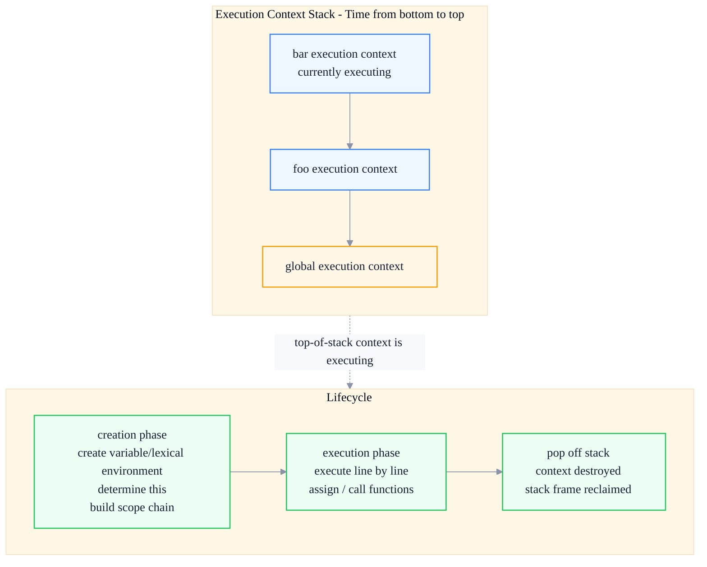
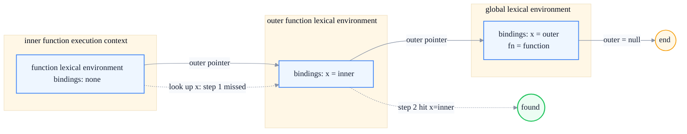
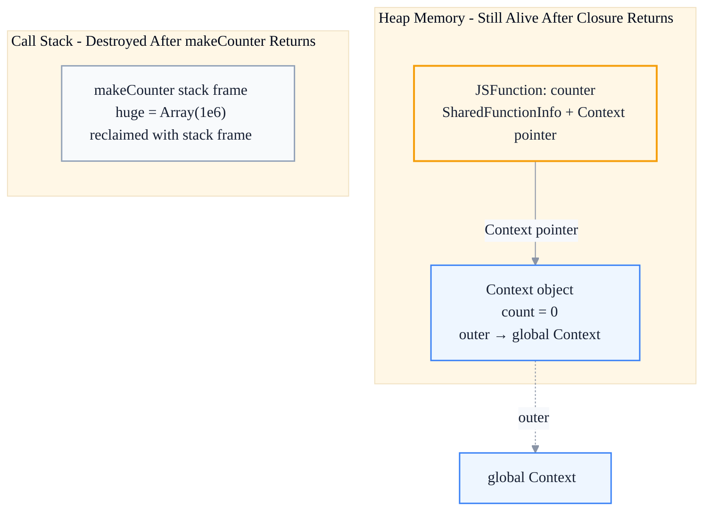

# Execution Context & Scope Chain: Understanding Closures from the V8 Perspective

> Subtitle: From execution-context lifecycle, variable and lexical environments, scope-chain construction to the closure memory model.
>
> Target readers: Intermediate and senior frontend engineers, frontend architects.
>
> Reading time: ~25 minutes.

::: info In one sentence
A closure is not a syntactic trick of "a function inside a function"; it is a real reference chain left by execution contexts and the scope chain in V8 heap memory — understanding it is the only way to understand the real cause of memory leaks.
:::

## Table of Contents

- [Introduction](#introduction)
- [1. Execution Context: The "Scene" Where JavaScript Code Runs](#1-execution-context-the-scene-where-javascript-code-runs)
- [2. Variable Environment and Lexical Environment: Why Two Environments After ES6](#2-variable-environment-and-lexical-environment-why-two-environments-after-es6)
- [3. Scope Chain Construction: The Chain Linked by outer Pointers](#3-scope-chain-construction-the-chain-linked-by-outer-pointers)
- [4. Closures from the V8 Perspective: Context Objects and Escape Analysis](#4-closures-from-the-v8-perspective-context-objects-and-escape-analysis)
- [5. The Real Relationship Between Closures and Memory Leaks](#5-the-real-relationship-between-closures-and-memory-leaks)
- [6. Common Closure Traps and Best Practices](#6-common-closure-traps-and-best-practices)
- [Conclusion: A Closure Is the Scope Chain Continued on the Heap](#conclusion-a-closure-is-the-scope-chain-continued-on-the-heap)
- [FAQ](#faq)
- [Sources](#sources)

## Introduction

Many frontend engineers understand closures at the interview-question level: "A function returns another function, and the inner function can access outer variables." This definition is not wrong, but it is too thin. A few follow-up questions often stump people:

- What is the real difference between `var` and `let` inside an execution context? Why does `let` have a temporal dead zone (TDZ)?
- Why, after a function returns, do its local variables not get destroyed along with the stack frame but can still be accessed?
- Which variables does a closure actually "capture"? All of them, or only those used? How does this affect memory?
- Under what premise does the statement "closures cause memory leaks" hold, and when is it exaggerated?

To answer these questions, we must go from JavaScript execution context, environment record, and scope chain all the way to V8's heap memory model. This article follows that path.

::: tip Key takeaway of this section

The essence of a closure is: when a function is created, it captures the lexical environment in which it was defined; when that function is executed elsewhere, it still looks up variables along this captured environment chain. V8 stores this environment chain as a `Context` object on the heap — this is the underlying reason a closure can "remember" outer variables.

:::

---

## 1. Execution Context: The "Scene" Where JavaScript Code Runs

**Execution Context** is the "scene" that the JavaScript engine prepares for executing a piece of code. It contains all the information that piece of code needs to run: variable bindings, `this` binding, the scope chain, the outer environment reference, etc.

There are three kinds of execution contexts in JavaScript:

1. **Global Execution Context**: Created when the program starts; only one exists throughout the lifetime of the program. In the browser it is associated with the global object `window` / `globalThis`.
2. **Function Execution Context**: A new one is created on every function call and destroyed after the function returns (unless captured by a closure).
3. **Eval Execution Context**: Code executed inside `eval`. Almost unused in modern engineering, but it does exist.

### 1. The Execution Context Stack

JavaScript is single-threaded; at any moment only one execution context can be running. The engine manages them with an **Execution Context Stack (ECS)**:



```javascript
function foo() {
  bar()
}
function bar() {
  console.log('bar')
}
foo()
```

When `foo()` is called, the stack changes as follows: global context pushed → `foo` context pushed → `bar` context pushed → `bar` finished and popped → `foo` finished and popped → back to the global context.

### 2. What Happens During the Creation Phase

During the creation phase, the execution context completes three things that determine "what this piece of code can see":

1. **Create the Lexical Environment**
2. **Create the Variable Environment**
3. **Determine the `this` binding**

Many people think "variable hoisting" simply moves declarations to the top, but a more accurate description is: **during the creation phase, the engine has already registered the variable names in the environment record; only `var` is initialized to `undefined`, while `let` / `const` are in an "uninitialized" state (this is the source of the TDZ)**.

```javascript
console.log(a) // undefined — var is registered with value undefined
console.log(b) // ReferenceError — let is registered but in TDZ
var a = 1
let b = 2
```

::: tip Key takeaway of this section

The execution context is the "scene" where code runs, managed by a stack. The creation phase registers variable bindings, determines `this`, and builds the scope chain. The essence of hoisting is "registered during creation, but not yet initialized".

:::

::: warning Common misconception

Thinking of "hoisting" as "the code is physically moved to the top". In fact the code does not move; hoisting happens during the creation phase of the execution context, when the engine adds bindings to the environment record at that moment.

:::

---

## 2. Variable Environment and Lexical Environment: Why Two Environments After ES6

In the ES5 era, an execution context had only a `VariableEnvironment`, which held `var` and `function` declarations. After ES6 introduced `let` / `const` / `class`, the specification split the context's environment into two:

- **VariableEnvironment**: Holds `var` and `function` declarations. Remains unchanged throughout the function execution.
- **LexicalEnvironment**: Holds `let` / `const` / `class` declarations, and is also the **starting point for identifier lookup at runtime**. It is updated whenever a new block scope is entered.

### 1. Structure of a Lexical Environment

A lexical environment consists of two parts:

1. **Environment Record**: The place that actually stores the variable-name → value mapping.
2. **Reference to the Outer Environment (outer / [[OuterEnv]])**: Points to the outer lexical environment; it is this pointer that strings the scope chain together.

There are several types of environment records, and understanding their differences helps explain many edge behaviors:

| Environment Record Type | Purpose | Typical Scenario |
| --- | --- | --- |
| Declarative | Bindings for `var` / `let` / `const` / `function` / `class` | Function body, block scope |
| Function | Declarative + `this` / `new.target` / `super` bindings | Function call |
| Object | Bindings attached to an object | `with` statement, global object record |
| Module | Top-level module declarations, supporting live import/export bindings | ES Module |

### 2. Why `var` and `let` Are Stored Separately

The key differences are **scope granularity** and **initialization timing**:

- `var` is function-scoped and initialized to `undefined` at creation time.
- `let` / `const` are block-scoped; the binding is created when the block is entered, but **remains uninitialized until the declaration statement is reached** (TDZ).

By separating the two environments, the engine can create a new lexical environment for `let` / `const` when entering a `{ }` block without affecting function-scoped `var` bindings:

```javascript
function demo() {
  // VariableEnvironment: { x: undefined }
  // LexicalEnvironment (function level): { x: undefined } — note that var also appears in the lexical environment for lookup
  var x = 1

  if (true) {
    // Enter block: create a new block-level lexical environment whose outer points to the function-level one
    // Block-level lexical environment: { y: <uninitialized> }
    console.log(x) // 1 — follow outer to find the outer x
    let y = 2
    console.log(y) // 2
  }
  // Leave block: block-level lexical environment is discarded, y is no longer accessible
  console.log(y) // ReferenceError: y is not defined
}
demo()
```

::: tip Key takeaway of this section

ES6 split out the lexical environment to support block scoping and the TDZ. `var` goes through the variable environment (function-scoped, initialized to undefined), while `let` / `const` go through the lexical environment (block-scoped, TDZ before declaration). Identifier lookup always starts from the current lexical environment.

:::

::: info Engineering implication

The TDZ is not "syntactic sugar"; it is a real runtime constraint. When using `let` to declare order-sensitive variables inside loops or conditional blocks, the TDZ helps expose "use before declare" bugs early, whereas `var` would silently yield `undefined`.

:::

---

## 3. Scope Chain Construction: The Chain Linked by outer Pointers

**Scope Chain** is not a separately maintained chain; it is naturally formed by the `outer` (`[[OuterEnv]]`) pointer of each environment. When looking up a variable, the engine starts from the current lexical environment and follows `outer` outward until it finds the variable or reaches `null` (beyond the global environment).

### 1. Lexical Scope: Determined When You Write the Code

JavaScript uses **Lexical Scope**, meaning a function's scope chain is determined by the environment in which it was **defined**, not the environment in which it is called. This is the prerequisite for understanding closures:

```javascript
const x = 'outer'

function outer() {
  const x = 'inner'
  function inner() {
    console.log(x) // 'inner' — determined by the definition location
  }
  return inner
}

const fn = outer()
fn() // still 'inner', even though only 'outer' is around the call site
```

`inner` is defined inside `outer`; its `[[Environment]]` points to `outer`'s lexical environment. No matter where it is later called, looking up `x` will follow this `outer` pointer back to `outer`'s environment.

### 2. The Memory Shape of the Scope Chain

The diagram below shows the structure of the scope chain during nested function execution. Note that the `outer` pointers point from the inside out, and they are fixed at the moment the function is **created**:



::: tip Key takeaway of this section

The scope chain is not dynamically stitched together at runtime; it is fixed at function creation time by each environment's `outer` pointer. Lexical scope means "which variables a function can access" is determined at definition time, independent of the call site.

:::

::: warning Common misconception

Thinking that a function's scope depends on where it is called. Only dynamic-scope features such as `eval` / `with` break lexical-scope rules, and modern code should avoid them.

:::

---

## 4. Closures from the V8 Perspective: Context Objects and Escape Analysis

What we have discussed so far is the specification-level model. Now we move to V8's actual implementation — this is also the answer to "why a closure is not destroyed along with the stack frame".

### 1. A Context Pointer Hides Inside the Function Object

Inside V8, a JavaScript function object (`JSFunction`) contains at least three parts:

1. **SharedFunctionInfo (SFI)**: The "static information" of the function — source code, AST, bytecode, parameter count, etc. The same piece of function code corresponds to a single SFI.
2. **Context pointer**: Points to the **Context object corresponding to the execution context in which the function was created**. This is the source of a closure's "memory".
3. **Feedback Vector**: Type-feedback data used by ICs (inline caches).

When the function is called, V8 uses this Context pointer as the "parent context" of the new stack frame, thereby restoring the complete scope chain.

### 2. The Division of Labor Between Stack and Heap: Why Local Variables Can "Survive"

Local variables of ordinary functions live on the **call stack**; when the function returns, the stack frame is popped and the variables are destroyed immediately. This is efficient and correct for non-closure variables.

But closures break this premise: if an inner function references a local variable of the outer function, that variable must remain alive after the outer function returns. V8 solves this with **Escape Analysis**:

- If a variable is referenced by some closure (it has "escaped" outside the function), V8 "promotes" it from the stack to a **Context object on the heap**.
- If a variable is not referenced by any closure, it stays on the stack and is automatically reclaimed when the function returns.

This means: **a closure does not move the entire activation record of the outer function to the heap; it only moves the variables that are referenced**. This is an optimization that is often overlooked but very important.

```javascript
function makeCounter() {
  let count = 0             // referenced by inner -> escapes to heap Context
  let huge = new Array(1e6) // not referenced by any closure -> stays on stack, reclaimed when makeCounter returns
  return function inner() {
    count++
    return count
  }
}
const counter = makeCounter()
```

In this example, although the large array `huge` is defined inside `makeCounter`, no closure references it, so it does not enter the `Context` object and is released after `makeCounter` returns. Only `count` is kept in the heap `Context`.

### 3. Closure Memory Model Diagram



::: tip Key takeaway of this section

V8 uses escape analysis to decide where variables live: variables referenced by closures go into heap `Context` objects; unreferenced variables stay on the stack and are reclaimed with the stack frame. Therefore "a closure captures the entire outer scope" is inaccurate — it only captures the variables that are actually used.

:::

::: info Engineering implication

This gives a practical troubleshooting approach: if a piece of closure code consumes unexpected memory, first look at which "large variables" it references. Even if you do not explicitly use a variable, as long as some function on the closure chain references it, it will stay on the heap.

:::

---

## 5. The Real Relationship Between Closures and Memory Leaks

"Closures cause memory leaks" is one of the most widespread and most exaggerated claims. Let's be clear: **closures themselves are not memory leaks**. A closure retaining the variables it is supposed to retain is a feature, not a bug.

A real "leak" happens when: **an object that should have been reclaimed is referenced by a long-lived closure chain, so the GC cannot reclaim it**.

### 1. Three Real Closure Leak Patterns

**Pattern A: Uncleaned event listeners**

```javascript
function setup(element, heavyData) {
  element.addEventListener('click', function onClick() {
    // onClick closure references heavyData
    console.log(heavyData.length)
  })
  // forgot to removeEventListener when the component is destroyed
}
```

If `element` is removed from the DOM but the event listener is not removed, the `onClick` closure holds both `heavyData` and `element`, so neither can be reclaimed.

**Pattern B: Long-lived timers holding references**

```javascript
function start() {
  const bigCache = buildBigCache()
  setInterval(() => {
    refresh(bigCache) // timer callback closure holds bigCache forever
  }, 1000)
}
```

The `setInterval` callback stays alive forever, so `bigCache` stays alive forever. The correct approach is to keep the timer id and call `clearInterval` when it is no longer needed.

**Pattern C: Unbounded growing closure caches**

```javascript
const cache = {}
function get(key) {
  if (!cache[key]) {
    cache[key] = function () {
      // closure + unbounded cache -> memory grows with key count
      return computeExpensive(key)
    }
  }
  return cache[key]
}
```

The closure itself is fine; the problem is "unbounded cache + no eviction". This is actually a cache-design problem, but it is often blamed on closures.

### 2. How to Tell Whether It Is a Real Leak

Use the **Memory panel** in Chrome DevTools:

1. Take a heap snapshot.
2. Perform the suspected leak operation several times.
3. Take another heap snapshot and choose "Comparison" mode.
4. Sort by **Retained Size** and look for continuously growing objects, paying special attention to `(closure)` and `(array)` types.

::: tip Key takeaway of this section

A closure is not a leak; "a long-lived reference chain + objects that should be reclaimed but aren't" is the leak. When investigating, focus on closure objects whose Retained Size keeps growing; often they point to uncleaned listeners or timers.

:::

::: warning Common misconception

Thinking "as long as I use closures, I will have memory leaks", and therefore over-avoiding closures. In fact, modern V8 escape analysis is already very efficient, and normal closures have extremely small overhead. What really needs to be managed is the **lifecycle** of closures, not avoiding closures themselves.

:::

---

## 6. Common Closure Traps and Best Practices

### 1. Closures in Loops: var vs let

The most classic closure trap:

```javascript
for (var i = 0; i < 3; i++) {
  setTimeout(() => console.log(i), 0)
}
// Output: 3, 3, 3
```

`var` is function-scoped, so the three loop iterations share the same `i`. By the time the timer callbacks execute, the loop has already finished and `i` is `3`.

```javascript
for (let i = 0; i < 3; i++) {
  setTimeout(() => console.log(i), 0)
}
// Output: 0, 1, 2
```

`let` is block-scoped, and the specification requires **a new `i` binding to be created on each iteration**. Therefore each callback closure captures its own `i`.

In the past, an IIFE (Immediately Invoked Function Expression) was used to solve this:

```javascript
for (var i = 0; i < 3; i++) {
  ;((j) => {
    setTimeout(() => console.log(j), 0)
  })(i)
}
// Output: 0, 1, 2
```

The IIFE copies the current value of `i` into the parameter `j`, cutting the reference to the shared `i`. Modern code can simply use `let`; the IIFE is now a historical solution.

### 2. "Accidentally Capturing" Large Objects in a Closure

```javascript
function handler() {
  const huge = new Array(1e6).fill(0) // only needed during the setup phase
  return function onClick() {
    console.log('clicked')
    // huge is not used here, but older engines might still retain it
  }
}
```

Modern V8 escape analysis will recognize that `onClick` does not reference `huge` and therefore not put it into the `Context`. But **do not rely on engine optimizations** — a safer style is to keep large objects in the smallest possible scope, or explicitly dereference them after use:

```javascript
function handler() {
  let huge = new Array(1e6).fill(0)
  doSomething(huge)
  huge = null // explicitly cut the reference so GC can reclaim it early
  return function onClick() {
    console.log('clicked')
  }
}
```

### 3. Stable Callback References for Easy Unbinding

Creating a new closure each time produces a new function object, so `removeEventListener` cannot match:

```javascript
// Anti-pattern: a new closure every time, can never unbind
function bind() {
  element.addEventListener('click', () => doWork())
  // element.removeEventListener('click', () => doWork()) // ineffective!
}
```

The correct approach is to keep the closure:

```javascript
function bind() {
  const onClick = () => doWork()
  element.addEventListener('click', onClick)
  return () => element.removeEventListener('click', onClick) // return cleanup function
}
```

This "return a cleanup function" pattern is also standard in React `useEffect`.

### 4. Closures and State Encapsulation

Closures naturally lend themselves to private state encapsulation, which is the foundation of the module pattern:

```javascript
function createBankAccount(initial = 0) {
  let balance = initial // private, not directly accessible from outside
  return {
    deposit(amount) {
      balance += amount
      return balance
    },
    withdraw(amount) {
      if (amount > balance) throw new Error('Insufficient balance')
      balance -= amount
      return balance
    },
    getBalance() {
      return balance
    },
  }
}

const account = createBankAccount(100)
account.deposit(50)
console.log(account.getBalance()) // 150
// account.balance // undefined — state is protected by the closure
```

::: tip Key takeaway of this section

Best practices for closures: use `let` instead of IIFE in loops; explicitly dereference large objects after use; keep stable references to event callbacks for easy unbinding; use closures to encapsulate private state. The core idea is to "manage the lifecycle and reference scope of closures".

:::

---

## Conclusion: A Closure Is the Scope Chain Continued on the Heap

Putting it all together:

1. The execution context is the scene where code runs; the creation phase registers variable bindings, determines `this`, and builds the scope chain.
2. ES6 split the environment into the Variable Environment (`var`) and the Lexical Environment (`let` / `const` + TDZ); identifier lookup starts from the lexical environment.
3. The scope chain is strung together by each environment's `outer` pointer and is fixed at the moment the function is **defined** (lexical scope).
4. The essence of a closure: when a function is created, it stores the lexical environment it lives in into a `Context` pointer; when the function is called elsewhere, it still looks up variables along this chain.
5. V8 uses escape analysis to decide where variables go — referenced variables go into the heap `Context`, the rest stay on the stack and are reclaimed with the stack frame.
6. Closures are not leaks; "long-lived reference chain + objects that should be reclaimed but aren't" is the leak.

> **A closure is not a syntactic trick; it is the continuation of the scope chain in heap memory. Understanding it means understanding the intersection of "state" and "memory" in JavaScript.**

---

## FAQ

### 1. Why can a closure "remember" outer variables even after the outer function has returned?

When a function is created, it stores a reference to the lexical environment it lives in into its own `Context` pointer. The outer function returning only pops the stack frame, but the variables referenced by the closure have already been promoted by V8 to a `Context` object on the heap and are not destroyed with the stack frame. Therefore the inner function can still access them through the `Context` pointer.

### 2. What is the real difference between `var` and `let` in an execution context?

Both are registered in the environment record during the creation phase. The difference is: `var` lives in the variable environment, is function-scoped, and is initialized to `undefined`; `let` / `const` live in the lexical environment, are block-scoped, and are in the TDZ (uninitialized) until the declaration statement is reached. In addition, `let` in a `for` loop creates an independent binding for each iteration, which is the root cause of the different closure behavior in loops.

### 3. Does a closure retain all variables of the outer function?

No. V8's escape analysis only promotes variables that are actually referenced by some closure to the heap `Context`; unreferenced variables stay on the stack and are reclaimed with the stack frame. Therefore a closure's memory overhead is usually tied only to the variables it really uses, not the entire outer scope. However, as a precaution, it is still recommended to explicitly dereference large objects after use.

### 4. Under what premise does "closures cause memory leaks" hold?

A leak occurs only when a **long-lived** reference chain (such as an unbound event listener, an uncleared timer, or an unbounded cache) holds objects that should have been reclaimed. Normal short-lived closures do not leak. When investigating, use the Memory panel's Comparison mode and sort by Retained Size to look for continuously growing closure objects.

### 5. Why does `let` solve the closure trap in `for` loops while `var` does not?

`var` is function-scoped; the three iterations share the same `i` binding, so when the callbacks execute they all read the final value after the loop ends. `let` is block-scoped; the specification requires a new `i` binding to be created on each iteration and copies the previous iteration's value, so each callback closure captures its own independent `i`.

---

## Sources

1. ECMAScript specification definitions of execution contexts, lexical environments, and environment records: [ECMA-262 Lexical Environments](https://tc39.es/ecma262/#sec-lexical-environments)
2. V8 engine design and closure implementation documentation and blog posts: [V8 Dev blog](https://v8.dev/blog)
3. MDN explanation of closures and scope: [MDN Closures](https://developer.mozilla.org/en-US/docs/Web/JavaScript/Closures)
4. This article is based on public technical documentation (ECMAScript specification, V8 official blog, MDN) and the author's engineering experience.
