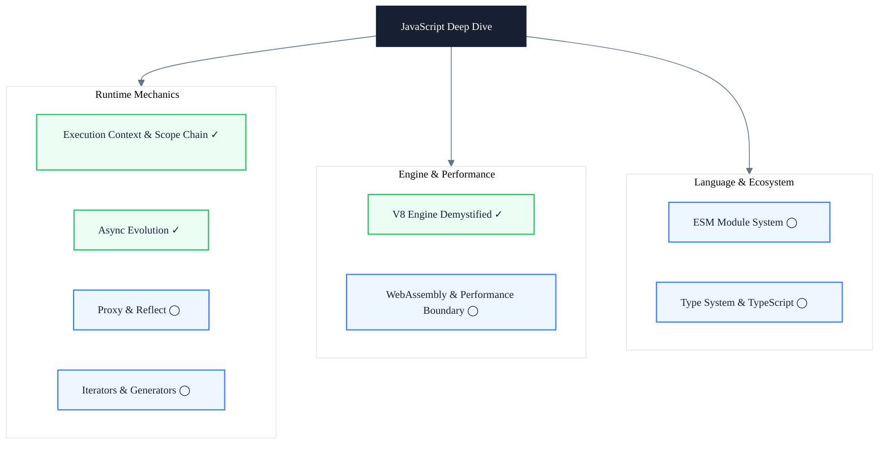

# JavaScript Deep Dive

> Subtitle: From execution context to V8 engine — understanding what really happens at runtime

## Module Positioning

JavaScript is the language frontend engineers use every day, but there is a huge gap between "can use it" and "understand it." This module does not stop at the syntax level. Instead, it goes deep into V8's execution mechanics: how execution contexts are created, how scope chains are formed, how closures persist in memory, how async tasks are scheduled in the event loop, how JIT optimizes hot code, and how GC reclaims memory.

Understanding these underlying mechanisms allows you to write code with predictable performance and to know where to start when investigating closure leaks, memory spikes, or long-task jank.

This module upgrades "knowing the syntax" into "seeing through the mechanics," making the runtime behavior of every line of JS code traceable, locatable, and optimizable.

---

## Knowledge Map

---

## Core Topics

- ✓ **Execution Context & Scope Chain**: Execution context creation, scope chain formation, variable environment, lexical environment, and the nature of closures.
- ✓ **Async Evolution**: Event loop, macro/micro tasks, Promise chains, and the design and pitfalls of async/await.
- ✓ **V8 Engine Demystified**: Ignition bytecode, Sparkplug / Maglev / TurboFan JIT tiers, hidden classes, and GC mechanisms.
- ◯ **ESM Module System**: Module resolution, dependency graph construction, Tree Shaking, dynamic import, and top-level await.
- ◯ **Type System & TypeScript**: Structural types, type inference, declaration files, type gymnastics, and compile-time checks.
- ◯ **WebAssembly & Performance Boundary**: WASM execution model, JS / WASM interop, applicable scenarios, and call cost.
- ◯ **Proxy & Reflect**: Metaprogramming capabilities, proxy traps, reactive system foundations, and performance trade-offs.
- ◯ **Iterators & Generators**: Iterable protocol, generator execution mechanics, lazy evaluation, and coroutine-style control flow.

---

## Learning Path

1. Start with execution context and scope chain — understand variable lookup, closure retention, and memory persistence.
2. Move into async evolution — from callback hell to async/await, understanding the scheduling rules of the event loop.
3. Dive into the V8 engine — master bytecode, JIT tiers, and GC mechanisms to build runtime performance intuition.
4. (Planned) Expand to the ESM module system — understand module resolution, dependency graphs, and Tree Shaking.
5. (Planned) Explore Proxy & Reflect — understand metaprogramming and the foundations of reactive systems.
6. (Planned) Learn iterators & generators — master lazy evaluation and coroutine-style control flow.
7. (Planned) Build a mental model of type systems & TypeScript — from structural types to type gymnastics.
8. (Planned) Evaluate WebAssembly & performance boundaries — understand JS / WASM interop and applicable scenarios.

---

## Article Guide

- [Execution Context & Scope Chain: Understanding Closures from V8's Perspective](/en/javascript/execution-context-closure) — Closures are not syntactic sugar; they are references held to lexical environments.
- [Async Evolution: From Callback Hell to async/await](/en/javascript/async-evolution) — The design thread and pitfalls of Promise / Generator / async/await.
- [V8 Engine Demystified: JIT Compilation & Garbage Collection](/en/javascript/v8-jit-gc) — From bytecode to TurboFan, from Scavenge to Mark-Compact.

---

## Intended Readers

- Intermediate and senior frontend engineers who want to understand JavaScript runtime behavior rather than just syntax.
- Performance engineers who need to troubleshoot memory leaks, long tasks, and JIT deoptimization.
- Framework developers who need to evaluate the runtime cost and GC pressure of different APIs.

---

## Extended Resources

- [V8 Official Blog](https://v8.dev/blog) — In-depth technical articles from the V8 engine team, covering JIT / GC / optimization strategies.
- [TC39 Proposals Repository](https://github.com/tc39/proposals) — Track the evolution of the JavaScript language standard, proposal stages, and progress.
- [MDN JavaScript Guide](https://developer.mozilla.org/en-US/docs/Web/JavaScript/Guide) — Authoritative language reference and tutorial, covering syntax and APIs.
- Book: *You Don't Know JS* by Kyle Simpson — A series diving deep into language mechanics, covering scope, closures, this, async, and more.
