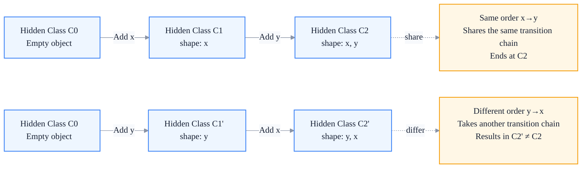
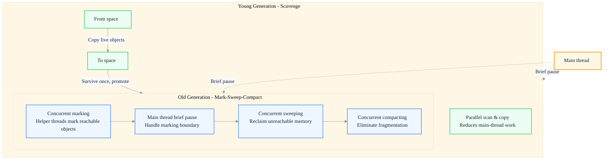

# V8 Engine Deep Dive: JIT Compilation and Garbage Collection

> Subtitle: From the V8 compilation pipeline, tiered JIT, hidden classes and inline caching, to generational GC and the Orinoco algorithm.
>
> Target readers: Intermediate and senior frontend engineers, frontend architects, performance owners.
>
> Reading time: ~28 minutes.

::: info In one sentence
V8's performance secret is not a single "magic optimization" but a collaborative system of tiered JIT, hidden classes, inline caching, and generational GC — your coding style determines whether your code can take the fast path.
:::

## Table of Contents

- [Introduction](#introduction)
- [1. V8 Architecture: The Pipeline from Source to Machine Code](#1-v8-architecture-the-pipeline-from-source-to-machine-code)
- [2. JIT Compilation: The Hybrid Interpreter-Compiler Model](#2-jit-compilation-the-hybrid-interpreter-compiler-model)
- [3. Hidden Class: The Internal Representation of Object Shape](#3-hidden-class-the-internal-representation-of-object-shape)
- [4. Inline Cache: Putting Property Access on the Fast Path](#4-inline-cache-putting-property-access-on-the-fast-path)
- [5. Garbage Collection: Generational GC and Orinoco](#5-garbage-collection-generational-gc-and-orinoco)
- [6. Common Performance Anti-patterns](#6-common-performance-anti-patterns)
- [7. Analyzing V8 Behavior with DevTools](#7-analyzing-v8-behavior-with-devtools)
- [Conclusion: Code Written for V8 Cooperates with Its Fast Paths](#conclusion-code-written-for-v8-cooperates-with-its-fast-paths)
- [FAQ](#faq)
- [Sources](#sources)

## Introduction

In frontend performance discussions, "V8" is a frequent term: JIT, hidden classes, inline caching, GC pauses, deoptimization — but few people can explain how these mechanisms actually work. As a result, many optimization tips become "heard mantras": "don't use delete," "don't use arguments," "don't add properties to objects randomly" — without anyone knowing why.

This article weaves V8's core mechanisms into a complete model so that you can answer:

- How many layers does V8 go through from source to machine code? Why so many?
- Why can two objects that look identical differ greatly in speed? What is a "hidden class"?
- Why does the same function suddenly become faster after a few calls, then possibly slower again after another call (deoptimization)?
- When exactly does GC pause the main thread? What do generational collection and Orinoco solve?
- How can I use DevTools to see what V8 is doing with my code?

Understanding these will let you write code that "cooperates with V8's fast paths" instead of fighting against it.

::: tip Key takeaway of this section
V8's performance comes from the collaboration of tiered JIT (Ignition interpreter + Sparkplug/Maglev/TurboFan compilers), hidden classes (uniform object shape), inline caching (cached property lookup), and generational GC (optimized for short-lived objects). The essence of most "performance anti-patterns" is that they destroy the preconditions these mechanisms rely on: consistent shape, stable types, and short-lived objects.
:::

---

## 1. V8 Architecture: The Pipeline from Source to Machine Code

V8 is Google's JavaScript and WebAssembly engine, used by Chrome, Node.js, Deno, and others. Its core execution pipeline can be summarized as: **source → AST → bytecode → execution → (hot code) → optimized machine code**.

### 1. Core Stages

```mermaid
%%{init: {'theme': 'base', 'themeVariables': { 'fontFamily': 'Inter, PingFang SC, Microsoft YaHei, sans-serif', 'primaryColor': '#EEF6FF', 'primaryTextColor': '#172033', 'primaryBorderColor': '#6EA8FE', 'lineColor': '#8A94A6', 'secondaryColor': '#F7F9FC', 'tertiaryColor': '#FFF7E6'}}}%%
flowchart LR
    Src["JavaScript Source"] --> Parser["Parser<br/>Source → AST"]
    Parser --> AST["Abstract Syntax Tree AST"]
    AST --> Ignition["Ignition Interpreter<br/>AST → Bytecode + Execution"]
    Ignition -- "Collects type feedback" --> Feedback["Feedback Vector<br/>Records runtime type information"]
    Ignition -- "Hot code" --> SP["Sparkplug<br/>Baseline Compiler<br/>Bytecode → Unoptimized Machine Code"]
    SP --> ML["Maglev<br/>Mid-tier Compiler<br/>Lightweight feedback-based optimization"]
    ML --> TF["TurboFan<br/>Top-tier Compiler<br/>Heavy optimization machine code"]
    Feedback --> ML
    Feedback --> TF
    TF -. "Type assumption broken" .-> Deopt["Deoptimization<br/>Fallback to Ignition bytecode"]
    Deopt -. "Re-collect feedback" .-> Ignition

    classDef src fill:#FFF7E6,stroke:#F59E0B,color:#172033,stroke-width:2px;
    classDef parse fill:#EEF6FF,stroke:#3B82F6,color:#172033,stroke-width:1.5px;
    classDef interp fill:#ECFDF3,stroke:#22C55E,color:#172033,stroke-width:1.5px;
    classDef opt fill:#F5E8FF,stroke:#A855F7,color:#172033,stroke-width:1.5px;
    classDef deopt fill:#FEE2E2,stroke:#EF4444,color:#172033,stroke-width:1.5px;
    class Src src;
    class Parser,AST parse;
    class Ignition,Feedback interp;
    class SP,ML,TF opt;
    class Deopt deopt;
```



1. **Parsing**: The Parser turns source text into an **Abstract Syntax Tree (AST)**. V8 uses lazy parsing — it first parses only the outer shell of a function, and fully parses the body only when the function is actually called, speeding up startup.
2. **Bytecode generation and interpretation (Ignition)**: Ignition compiles the AST into bytecode and interprets it. Bytecode is a platform-independent intermediate representation with fast startup and small memory footprint. Ignition also collects **type feedback** — recording observed object shapes, argument types, etc., at runtime — and stores it in the "feedback vector".
3. **Baseline compilation (Sparkplug)**: For hot bytecode, Sparkplug quickly generates unoptimized machine code, eliminating interpretation overhead. Its compilation speed is much faster than TurboFan. This tier was introduced in 2021 to fill the gap between interpretation and heavy optimization.
4. **Mid-tier compilation (Maglev)**: Generates lightly optimized machine code based on type feedback. Its compilation speed and optimization level sit between Sparkplug and TurboFan (gradually maturing since 2023).
5. **Top-tier optimization (TurboFan)**: Performs heavy optimization based on rich type feedback — inlining, escape analysis, hidden-class specialization, etc. — generating highly optimized machine code. It has the longest compilation time, so it is enabled only for truly hot code.
6. **Deoptimization**: If the type assumptions made during TurboFan compilation are broken at runtime (for example, an object with a different shape is passed in), V8 discards the optimized machine code and **falls back to Ignition bytecode**, then re-collects feedback and may trigger optimization again.

### 2. Why So Many Layers?

This is a classic engineering trade-off:

- **Full AOT compilation** (compiling all code before startup) is too slow to start and uses too much memory — browser scenarios are extremely sensitive to startup latency.
- **Pure interpretation** starts fast, but repeatedly interpreting hot code is too slow at runtime.
- **Tiered JIT** lets code "start running quickly through interpretation, then get progressively optimized as it gets hot," balancing startup speed and runtime performance.

::: tip Key takeaway of this section
V8's pipeline is a tiered JIT: "Parse → Ignition bytecode interpretation → Sparkplug → Maglev → TurboFan." The interpreter ensures fast startup, the compilers ensure hot code runs fast, type feedback links every tier, and deoptimization guarantees correctness. Understanding this pipeline is the key to understanding why code may become faster or slower after running a few times.
:::

::: warning Common misconception
Thinking that V8 compiles an entire code block into machine code all at once. In reality, V8 is lazy: it first interprets, and only code judged "hot" progresses into the compilers. Cold code may remain at the bytecode stage forever.
:::

---

## 2. JIT Compilation: The Hybrid Interpreter-Compiler Model

**JIT (Just-In-Time)** means "compiling code into machine code at runtime," as opposed to AOT (ahead-of-time) and pure interpretation (no compilation). V8's JIT is a hybrid of an interpreter plus multi-tier compilers.

### 1. Division of Labor Between Interpreter and Compilers

- **Ignition (interpreter)**: Executes bytecode. Fast startup and low memory usage, but every bytecode instruction goes through "fetch → decode → dispatch → execute" overhead.
- **Compilers (Sparkplug/Maglev/TurboFan)**: Translate bytecode into native machine code, which runs directly and avoids interpretation overhead, but compilation itself costs time and memory.

V8 uses **hotness detection (tiering)** to decide when to upgrade: Ignition maintains a call counter / back-edge counter for each bytecode segment, and exceeding a threshold triggers the next tier of compilation.

### 2. Type Feedback: The Fuel of JIT Optimization

JavaScript is dynamically typed, and the same piece of code may handle many types. The key strategy of JIT optimization is **optimistic specialization**: based on types observed at runtime, generate high-speed machine code specialized for those types.

```javascript
function add(a, b) {
  return a + b
}
// If a and b have historically been integers, TurboFan will specialize to integer-addition machine code.
add(1, 2)
add(3, 4)
// ...after many integer calls, it gets optimized for integer addition.

// Suddenly passing strings breaks the integer specialization → deoptimization, fallback to bytecode.
add('x', 'y')
```

As it executes, Ignition writes these observations into the **feedback vector** — recording "what types has this addition seen," "what hidden classes has this property access seen," and so on. The compilers read this feedback to decide how to specialize.

### 3. Deoptimization: Correctness First

Optimistic specialization means assumptions. Once an assumption is broken, V8 must **deoptimize** — discard the machine code and return to bytecode execution. Deoptimization guarantees semantic correctness, but the performance cost is steep (a single deoptimization can make a hot function several times slower). Afterward, V8 re-collects feedback and tries to optimize again.

```mermaid
%%{init: {'theme': 'base', 'themeVariables': { 'fontFamily': 'Inter, PingFang SC, Microsoft YaHei, sans-serif', 'primaryColor': '#EEF6FF', 'primaryTextColor': '#172033', 'primaryBorderColor': '#6EA8FE', 'lineColor': '#8A94A6', 'secondaryColor': '#F7F9FC', 'tertiaryColor': '#FFF7E6'}}}%%
flowchart LR
    A["Integer calls<br/>Collect feedback: int+int"] --> B["TurboFan optimization<br/>Integer-addition machine code"]
    B --> C["Continued integer calls<br/>High-speed execution"]
    C --> D{String passed in?}
    D -- Yes --> E["Deoptimization<br/>Assumption broken"]
    E --> F["Fallback to Ignition bytecode<br/>Performance drops sharply"]
    F --> G["Re-collect feedback<br/>int+int and str+str"]
    G --> H["Optimize again<br/>Polymorphic version or re-specialize"]
    D -- No --> C

    classDef collect fill:#EEF6FF,stroke:#3B82F6,color:#172033,stroke-width:1.5px;
    classDef opt fill:#ECFDF3,stroke:#22C55E,color:#172033,stroke-width:1.5px;
    classDef deopt fill:#FEE2E2,stroke:#EF4444,color:#172033,stroke-width:2px;
    classDef decide fill:#FFF7E6,stroke:#F59E0B,color:#172033,stroke-width:1.5px;
    class A,G collect;
    class B,C,H opt;
    class E,F deopt;
    class D decide;
```



::: tip Key takeaway of this section
The core of JIT is "optimistic specialization + type feedback + deoptimization": specialized machine code is generated based on types observed at runtime, and if assumptions are broken, execution falls back. Therefore, keeping types and shapes stable is the key to keeping hot functions on the optimized path — which is exactly the goal served by hidden classes and inline caching in the following sections.
:::

::: info Engineering insight
Avoid "mixing types" in hot functions — a single function handling both numbers and strings, or both object A and object B, makes the feedback vector polymorphic or even megamorphic, triggering deoptimization or preventing specialization.
:::

---

## 3. Hidden Class: The Internal Representation of Object Shape

The pain point of dynamic languages is that object property layouts are only known at runtime, so property access has to rely on hash lookups, which is slow. V8 solves this with **hidden classes** (internally called Maps).

### 1. What Is a Hidden Class?

A hidden class describes the "shape" of an object — what properties it has and the memory offsets of those properties. **Objects with the same shape share the same hidden class.** With a hidden class, V8 can locate a property using "hidden class + offset" instead of hashing every time.

```javascript
function Point(x, y) {
  this.x = x
  this.y = y
}

const p1 = new Point(1, 2)
const p2 = new Point(3, 4)
// p1 and p2 add the same properties in the same order → share the same hidden class.
```

### 2. Hidden-Class Transitions

Every time you **add a property** to an object, V8 does not modify the hidden class in place. Instead, it creates a new hidden class along a "transition chain":



This means: **Different property-addition orders produce different hidden classes**, even if the final set of properties is the same.

```javascript
function A() {}
const a1 = new A()
a1.x = 1
a1.y = 2 // Transition chain: {} → {x} → {x,y}

const a2 = new A()
a2.y = 1
a2.x = 2 // Transition chain: {} → {y} → {y,x}

// a1 and a2 have the same properties but different orders → different hidden classes!
```

### 3. When Do You Fall into "Slow Mode"?

The following operations break hidden-class sharing or force V8 to degrade:

- **`delete` removes a property**: Breaks shape consistency; V8 may downgrade the object to "dictionary mode" (slow properties, hash lookup).
- **Too many properties**: Beyond a certain threshold, V8 switches to dictionary storage to save memory, making access slower.
- **Inconsistent dynamic addition order**: As shown above, produces different hidden classes.
- **Heavy mixing of indexed properties (array elements) and named properties**: Affects the fast-elements path.

::: tip Key takeaway of this section
Hidden classes are the key to giving dynamic languages static-layout performance: objects with the same shape share a hidden class, and property access becomes a fast "hidden class + offset" operation. The core rule for keeping objects on the fast path is to "initialize all properties once, in the same order, inside the constructor."
:::

::: warning Common misconception
Thinking that "creating fewer objects is enough." In fact, object count is not the main issue; **object-shape consistency** is. One thousand objects with consistent shapes are much faster than one thousand objects with different shapes, because the former can share hidden classes and hit inline caches.
:::

---

## 4. Inline Cache: Putting Property Access on the Fast Path

Hidden classes solve the "object layout" problem, but every property access still has to "look up the hidden class → find the offset." **Inline Caching (IC)** caches this lookup result, making repeated accesses close to "direct value retrieval."

### 1. How IC Works

V8 maintains an IC slot at each property-access bytecode location, recording "the hidden class of the object + the property offset observed during the last access." The next time the access occurs:

1. Read the hidden class of the current object.
2. Compare it with the hidden class cached in the IC.
3. Hit → use the cached offset to read the value (extremely fast).
4. Miss → take the slow path to look it up, and update the cache.

### 2. IC State Machine

IC has several states; the further down the list, the worse the performance:

| State | Meaning | Performance |
| --- | --- | --- |
| Uninitialized | Not accessed yet | — |
| Monomorphic | Has seen only 1 hidden class | Fastest (hits the fast path) |
| Polymorphic | Has seen 2–4 hidden classes | Fairly fast (small branch checks) |
| Megamorphic | Has seen >4 hidden classes | Slowest (degrades to basic lookup) |

```javascript
function readX(obj) {
  return obj.x
}

const A = { x: 1 } // Hidden class CA
const B = { x: 1, y: 2 } // Hidden class CB (different shape)
const C = { x: 1, z: 3 } // Hidden class CC

readX(A) // IC: monomorphic (CA)
readX(B) // IC: polymorphic (CA, CB)
readX(C) // IC: polymorphic (CA, CB, CC)
// ...passing objects with 5+ different shapes → megamorphic, cache becomes useless.
```

Once a hot function enters megamorphic, property access slows significantly and may prevent TurboFan specialization.

### 3. Best Practices Combined with Hidden Classes

The core of keeping IC monomorphic is ensuring that objects passed into hot functions **share the same hidden class**:

```javascript
// Good example: all point objects have the same shape, IC stays monomorphic.
function makePoint(x, y) {
  return { x, y } // Literal initializes properties in a fixed order.
}
const points = Array.from({ length: 1000 }, (_, i) => makePoint(i, i))
points.forEach((p) => p.x) // fast

// Bad example: inconsistent shapes, IC degrades.
const mixed = [{ x: 1 }, { x: 1, y: 2 }, { x: 1, z: 3 }]
mixed.forEach((p) => p.x) // polymorphic, slow
```

::: tip Key takeaway of this section
Inline caching stores the "hidden class + offset" lookup result at the access point, making repeated accesses close to direct value retrieval. IC has a degradation path from monomorphic → polymorphic → megamorphic. Keeping object shapes consistent and letting hot functions handle only a few shapes is the key to keeping IC on the fast path.
:::

::: info Engineering insight
If a hot function processes data from multiple sources (for example, API A returns `{x,y}` and API B returns `{x,y,z}`), consider doing a "normalization" at the entry point to a uniform shape before handing it to the hot function, to avoid IC degradation.
:::

---

## 5. Garbage Collection: Generational GC and Orinoco

V8's **Garbage Collection (GC)** is based on the "generational hypothesis": **most objects die young, while a few live long.** Accordingly, the heap is divided into the **young generation** and the **old generation**, each collected with different algorithms.

### 1. Young Generation: Scavenge and Cheney Semi-Space Copy

The young generation holds short-lived objects. It is small and collected frequently. V8 uses the **Cheney semi-space copy algorithm**:

1. The young generation is split into two equal-sized semi-spaces: the **From space** (currently allocating) and the **To space** (idle).
2. During GC, scan live objects in the From space and **copy** them to the To space, compacting them as they are copied.
3. After copying, the From and To spaces swap roles.
4. **Objects that survive one Scavenge are promoted to the old generation.**

The copy algorithm is fast and fragmentation-free; its downside is 50% space utilization, but the young generation is small (a few MB to tens of MB), so this is acceptable.

### 2. Old Generation: Mark-Sweep + Mark-Compact

The old generation holds long-lived objects and is large. Copying is not cost-effective for a large space (high copy cost and wastes half the space), so the old generation uses **Mark-Sweep + Mark-Compact**:

1. **Mark**: Starting from roots (globals, stack, registers), traverse the object graph and mark all reachable objects.
2. **Sweep**: Reclaim memory occupied by unreachable objects.
3. **Compact** (when necessary): Move live objects to compact them and eliminate fragmentation.

### 3. Orinoco: Concurrent / Parallel GC for Lower Pauses

Early GC was "stop-the-world" — the main thread was completely paused during collection, and with many large objects, pauses could reach tens of milliseconds, causing jank. **Orinoco** is V8's incremental GC project; it reduces pauses to the millisecond level through concurrency and parallelism:



- **Parallel Scavenge**: Multiple helper threads participate in young-generation copying in parallel, reducing main-thread overhead.
- **Concurrent Marking**: Most marking work is done concurrently by background helper threads; the main thread pauses only briefly at key points.
- **Concurrent Sweeping / Concurrent Compacting**: Sweeping and compacting are also performed concurrently when possible.
- **Incremental Marking**: A single long mark is split into multiple small steps, interleaved with main-thread execution, avoiding one long pause.

::: tip Key takeaway of this section
V8 GC is based on the generational hypothesis: the young generation uses semi-space copy (Scavenge), and the old generation uses Mark-Sweep / Mark-Compact. Orinoco pushes pauses down to the millisecond level through concurrent marking, parallel Scavenge, and incremental marking. However, GC pressure still depends on how many short-lived objects you create — creating fewer temporary objects on hot paths directly lowers GC frequency.
:::

::: warning Common misconception
Thinking that "GC pauses are the browser's problem; developers can't do anything." In reality, GC frequency and pause duration are directly influenced by code: frequently creating short-lived objects triggers Scavenge frequently, and a large number of long-lived objects in the old generation increases marking cost. Controlling object lifecycles is the most effective GC optimization developers can do.
:::

---

## 6. Common Performance Anti-patterns

Putting the previous sections together, we can understand why these patterns are anti-patterns — they break shape consistency, type stability, or object lifecycles.

### 1. `delete` Removes a Property

`delete` breaks the hidden class, may degrade the object to dictionary mode, and invalidates related ICs.

```javascript
// Bad example
function makePoint(x, y) {
  const p = { x, y }
  return p
}
const p = makePoint(1, 2)
delete p.y // p's hidden class changes, IC degrades.

// Good example: use null as a placeholder or redesign the data structure.
p.y = null
```

### 2. Initializing Properties in Different Orders

Inconsistent property order in constructors or literals produces different hidden classes, making IC polymorphic.

```javascript
// Bad example
function bad(a) {
  if (a) return { x: 1, y: 2 }
  return { y: 2, x: 1 } // Different order, different hidden class.
}

// Good example: always use the same order, preferably through the same constructor.
function Point(x, y) {
  this.x = x
  this.y = y
}
```

### 3. Mixing Types in Hot Functions

```javascript
// Bad example: a single hot function handles multiple shapes.
function process(item) {
  return item.value * 2
}
process({ value: 1 }) // shape A
process({ value: 1, tag: 'x' }) // shape B → IC becomes polymorphic.

// Good example: normalize before processing.
const normalized = { value: raw.value }
process(normalized) // Always shape A.
```

### 4. Creating Short-Lived Objects on Hot Paths

```javascript
// Bad example: creating a new object every animation frame increases GC pressure.
function animate() {
  const state = { x: 0, y: 0, vx: 1, vy: 1 } // New object every frame.
  // ...
  requestAnimationFrame(animate)
}

// Good example: reuse the object.
const state = { x: 0, y: 0, vx: 1, vy: 1 }
function animate() {
  state.x += state.vx
  state.y += state.vy
  // ...
  requestAnimationFrame(animate)
}
```

### 5. Oversized and Sparse Arrays

Sparse arrays (many holes) or oversized arrays fall off the fast-elements path and degrade to dictionary elements. Avoid using objects as sparse maps; use `Map` when necessary.

::: tip Key takeaway of this section
The common essence of performance anti-patterns is destroying hidden-class consistency (`delete`, inconsistent order), type stability (mixed shapes), or amplifying object-lifecycle costs (frequently creating short-lived objects). The optimization direction is "consistent shape, stable types, object reuse."
:::

---

## 7. Analyzing V8 Behavior with DevTools

Theory must be observable. Chrome DevTools provides several direct entry points for observing V8 behavior.

### 1. Performance Panel: View JS Execution and GC

After recording an interaction, look at the flame chart:

- **Yellow Evaluate Script / Function Call blocks**: JavaScript execution time. Large continuous yellow blocks are usually long tasks that block interaction.
- **Purple Recalculate Style / Layout blocks**: Style and layout costs (related to the rendering pipeline).
- **Green GC blocks (with trash-can icon)**: GC pauses. Frequent appearances or long individual blocks indicate too many short-lived objects.
- **Yellow Deoptimization-related logs**: You can locate hot functions in Performance's "Bottom-Up" view.

### 2. Memory Panel: View Heap and Allocations

- **Heap snapshot**: Take a snapshot, sort by Retained Size, and find the object types that consume the most memory (`(array)`, `(string)`, `(system)`, closures, etc.). Comparing two snapshots can identify growing objects.
- **Allocation timeline**: Watch object allocations in real time; blue bars indicate allocations, gray bars indicate reclaimed objects. Frequent blue bars without corresponding gray bars mean many short-lived objects or a leak.
- **Allocation sampling**: Sample allocations by function to locate which function is creating objects.

### 3. Observing Optimization and Deoptimization

Enable the corresponding options in the Performance panel, or use `node --trace-opt --trace-deopt` (Node environment) to see which functions are optimized, when they deoptimize, and why:

```bash
# In Node, trace optimizations and deoptimizations.
node --trace-opt --trace-deopt app.js
```

The output will mark entries such as `[optimizing: ...]` and `[deoptimizing: ...]`; the "reason" field can pinpoint specific shape / type inconsistencies.

::: tip Key takeaway of this section
The three-piece toolkit for analyzing V8 behavior: the Performance panel for long tasks and GC pauses, the Memory panel for heap usage and allocation hotspots, and `--trace-opt --trace-deopt` for optimization / deoptimization reasons. Performance optimization should start with observation and measurement before changing code.
:::

::: info Engineering insight
The standard optimization workflow is "reproduce first → measure second → optimize last." First record a real interaction with Performance, find the largest yellow / purple / green blocks, optimize them specifically, and then verify the gain with the same metric. Avoid optimizing by intuition on code that is not the bottleneck.
:::

---

## Conclusion: Code Written for V8 Cooperates with Its Fast Paths

To tie everything together:

1. V8 uses a **tiered JIT** (Parser → Ignition → Sparkplug → Maglev → TurboFan) to trade off startup speed and runtime performance, using type feedback to link the tiers and deoptimization to guarantee correctness.
2. **Hidden classes** give dynamic objects static-layout performance. Objects with the same shape share a hidden class, and property access becomes a fast "hidden class + offset" operation.
3. **Inline caching** stores the result of property lookups, making repeated accesses close to direct value retrieval; IC has a degradation path from monomorphic → polymorphic → megamorphic.
4. **GC** is based on the generational hypothesis — semi-space copy for the young generation, Mark-Sweep / Mark-Compact for the old generation; Orinoco uses concurrency / parallelism / incremental marking to push pauses down to the millisecond level.
5. The essence of most anti-patterns (`delete`, inconsistent order, mixed types, frequently creating short-lived objects) is that they destroy the preconditions these mechanisms rely on.

> **Good code written for V8 is not code with fewer lines, but code that cooperates with its fast paths: consistent shapes, stable types, and controllable object lifecycles. Understand V8, and you understand the underlying grammar of JavaScript performance optimization.**

---

## FAQ

### 1. Why does the same function become faster after a few calls, then possibly slower again?

It becomes faster because V8 progressively compiles hot bytecode into optimized machine code (Sparkplug → Maglev → TurboFan), eliminating interpretation overhead. It suddenly becomes slower usually because of **deoptimization** — the object shape or type passed at runtime breaks the optimistic assumption made during compilation, so V8 discards the machine code and falls back to bytecode, causing a steep performance drop. Use `--trace-deopt` to see the specific reason.

### 2. What exactly is bad about `delete`-ing a property?

`delete` changes an object's shape, triggers a hidden-class transition, may degrade the object to "dictionary mode" (properties stored in a hash table), and invalidates inline caches at related locations. If the object is on a hot path, performance drops noticeably. When you need "marked deletion," using `obj.x = null` as a placeholder is usually more friendly than `delete`.

### 3. What is the relationship between hidden classes and constructors?

A constructor itself is not the same as a hidden class, but objects created through the same constructor and initialized with the same property order will follow the same transition chain and end up sharing the same hidden class. In other words, constructors are an engineering means of "ensuring shape consistency" — objects created with constructors are easier to keep shape-consistent than scattered object literals.

### 4. Can GC pauses be completely eliminated?

They cannot be completely eliminated, but Orinoco already keeps them very low. Concurrent marking, parallel Scavenge, and incremental marking let most GC work happen on background threads; the main thread only pauses briefly at key points (usually milliseconds). What developers can do is reduce the rate at which short-lived objects are produced, lowering GC frequency, rather than trying to "not create objects at all."

### 5. How can I quickly tell whether my code has fallen off the fast path?

Record with the Performance panel: look for frequent green GC blocks (too many short-lived objects), large continuous yellow long tasks (hot functions are slow or deoptimizing), or frequent purple Layout blocks (layout thrashing). Then use Memory's Allocation sampling to locate which function is creating objects. Finally, use `--trace-deopt` to confirm whether deoptimization is happening frequently.

---

## Sources

1. V8 official blog posts on Ignition, TurboFan, Sparkplug, Maglev, and Orinoco: [V8 Dev blog](https://v8.dev/blog)
2. V8 official documentation on hidden classes, inline caching, and garbage collection: [v8.dev](https://v8.dev/docs)
3. MDN documentation on JavaScript performance and memory management: [MDN Memory Management](https://developer.mozilla.org/en-US/docs/Web/JavaScript/Memory_Management)
4. Chrome DevTools official documentation on the Performance / Memory panels: [Chrome DevTools](https://developer.chrome.com/docs/devtools/)
5. This article is based on publicly available technical documentation (V8 official blog and docs, MDN, Chrome DevTools docs) and the author's engineering practice.
