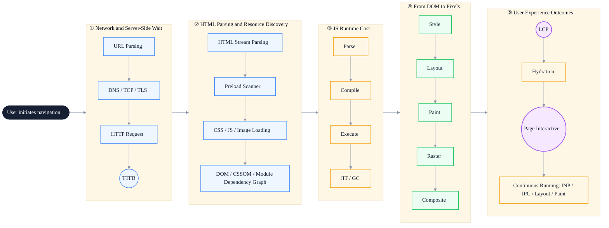

# The Critical Path of Modern Frontend Performance

> Subtitle: From TTFB, LCP, and Hydration to ESM, JIT, GC, Rasterization, IPC, and Resource Scheduling
>
> Target readers: Mid-to-senior frontend engineers, frontend architects, performance optimization leads
>
> Reading time: ~25 minutes

::: info In one sentence
The essence of modern frontend performance optimization is managing waiting, blocking, and repeated work on the critical path.
:::

## Table of Contents

- [Preface](#preface)
- [1. From "Framework Perspective" to "Browser Pipeline Perspective"](#_1-from-framework-perspective-to-browser-pipeline-perspective)
- [2. The First Wait: A Lot Happens Before TTFB](#_2-the-first-wait-a-lot-happens-before-ttfb)
- [3. Resource Discovery: Many LCP Issues Are Not Slow Downloads, but Late Discovery](#_3-resource-discovery-many-lcp-issues-are-not-slow-downloads-but-late-discovery)
- [4. HTTP/2 and HTTP/3 Have Changed Resource Organization, but Haven't Eliminated the Critical Path](#_4-http-2-and-http-3-have-changed-resource-organization-but-haven-t-eliminated-the-critical-path)
- [5. The HTML, CSS, and JS Parsing Phase Is a Performance Battlefield](#_5-the-html-css-and-js-parsing-phase-is-a-performance-battlefield)
- [6. LCP Is an Outcome Metric, Not a Single-Resource Metric](#_6-lcp-is-an-outcome-metric-not-a-single-resource-metric)
- [7. From DOM to Pixels: The Real Cost of Layout, Paint, Raster, and Composite](#_7-from-dom-to-pixels-the-real-cost-of-layout-paint-raster-and-composite)
- [8. Rasterization Is Not an Abstraction; It Is Key to LCP and Animation Performance](#_8-rasterization-is-not-an-abstraction-it-is-key-to-lcp-and-animation-performance)
- [9. JS Cost Is More Than Execution: Parsing, Compilation, JIT, and GC](#_9-js-cost-is-more-than-execution-parsing-compilation-jit-and-gc)
- [10. GC Optimization Is Not About "Not Creating Objects"; It Is About Controlling Lifecycles](#_10-gc-optimization-is-not-about-not-creating-objects-it-is-about-controlling-lifecycles)
- [11. Module Runtime: The Browser Is Taking Over Some of the Bundler's Former Responsibilities](#_11-module-runtime-the-browser-is-taking-over-some-of-the-bundler-s-former-responsibilities)
- [12. Hydration: The Cost of SSR Is Often Underestimated](#_12-hydration-the-cost-of-ssr-is-often-underestimated)
- [13. INP: From "Page Appears" to "Interaction Reliability"](#_13-inp-from-page-appears-to-interaction-reliability)
- [14. IPC and Multiprocessing: Collaboration Inside the Browser Also Has a Cost](#_14-ipc-and-multiprocessing-collaboration-inside-the-browser-also-has-a-cost)
- [15. Site Isolation and Sandbox: Security Architecture Also Affects the Performance Model](#_15-site-isolation-and-sandbox-security-architecture-also-affects-the-performance-model)
- [16. bfcache and Service Worker: Reducing Repeated Loading and Repeated Work](#_16-bfcache-and-service-worker-reducing-repeated-loading-and-repeated-work)
- [17. Unified Model: Wait, Block, and Repeated Work](#_17-unified-model-wait-block-and-repeated-work)
- [18. Advanced Frontend Practice Checklist](#_18-advanced-frontend-practice-checklist)
- [Conclusion: Advanced Frontend Optimizes the System, Not a Single Line of Code](#conclusion-advanced-frontend-optimizes-the-system-not-a-single-line-of-code)
- [FAQ](#faq)
- [Sources](#sources)

## Preface

The main reference for this article is Addy Osmani's long post on X, *How modern browsers work*, and its Chinese compilation. Addy Osmani is an engineering leader who has long focused on Web performance, Chrome developer experience, and frontend engineering. He worked at Google for more than 14 years, led Chrome Developer Experience, contributed to DevTools, Lighthouse, and Core Web Vitals, and authored books such as *Learning JavaScript Design Patterns* and *Image Optimization*. (https://addyosmani.com/)

This article will not explain browser internals as a string of isolated terms. Instead, it tries to build a performance model truly useful for advanced frontend engineers:

::: info In one sentence
The essence of modern frontend performance optimization is managing waiting, blocking, and repeated work on the critical path.
:::

This central thread can be broken down into three groups of problems:

- **Waiting**: TTFB is waiting on the network and server; LCP is waiting for the main content to actually appear; Hydration is waiting for the page to go from "viewable" to "usable."
- **Blocking**: synchronous scripts block HTML parsing; CSS blocks first render; long tasks block the main thread; GC pauses block interaction.
- **Repeated work**: repeated layout, repeated paint, repeated rasterization, repeated hydration of static regions, repeated resource requests.

Understanding these three groups requires first understanding the complete pipeline from request to pixel in a modern browser. The diagram below shows the full path of this pipeline; each segment can introduce waiting, blocking, or repeated work:



---

## 1. From "Framework Perspective" to "Browser Pipeline Perspective"

When many frontend engineers approach performance optimization, their first reaction is:

- Are React components re-rendering too much?
- Is the Vue reactivity system triggering too many updates?
- Is the Webpack bundle too large?
- Are images not compressed?
- Are API responses too slow?

These questions matter, but they remain local. Advanced frontend engineers need to dig deeper:

- Does the slowness happen in the network stage, the server stage, or the browser stage?
- Is TTFB slow, or is resource discovery late?
- Is CSS blocking first render, or is synchronous JS blocking HTML parsing?
- Is the LCP image downloading slowly, or is decoding, layout, or rasterization slow?
- Is the client module graph too deep, causing critical JS to execute late?
- Is Hydration too heavy, making the page "visible but unclickable"?
- Is JIT deoptimization, GC pauses, or IPC and compositing-layer cost being amplified?

A modern browser is not a simple HTML/CSS/JS execution box; it is a complex software system. It handles network communication, resource scheduling, HTML/CSS/JS parsing, JavaScript execution, layout, paint, GPU compositing, multi-process isolation, and security sandboxes.

Therefore, what advanced frontend engineers really optimize is not a single line of code, but the complete pipeline from request to interactivity. The following path can be used to understand modern page loading (each stage may involve waiting/blocking/repeated work):

1. User initiates navigation
2. URL parsing / DNS / TCP / TLS / HTTP request
3. TTFB
4. HTML streaming parse / preload scan
5. DOM / CSSOM / module dependency graph
6. JS parse / compile / execute
7. Style calculation / layout / paint records
8. Layering / tile rasterization / GPU compositing
9. LCP
10. Hydration
11. Page truly interactive
12. Ongoing JIT / GC / IPC / Layout / Paint / Composite costs

::: tip Key takeaway of this section

The performance optimization perspective needs to upgrade from "framework-local" to "browser-pipeline-global." Only by locating the problem at a specific stage of the pipeline can the right optimization be chosen.

:::

---

## 2. The First Wait: A Lot Happens Before TTFB

**TTFB (Time to First Byte)** is the time between the browser initiating a request and receiving the first byte returned by the server.

Many people simplify TTFB as "backend response time," but that is incomplete. Before the first byte arrives, the browser usually already goes through:

1. URL parsing
2. Security checks
3. DNS lookup
4. TCP connection establishment
5. TLS handshake in HTTPS scenarios
6. HTTP request sent
7. Server processing
8. Response headers and response body start to return

Addy Osmani noted in his original X post that the modern Chromium network stack usually runs in a dedicated network service or network process. The renderer process cannot access the network directly; it obtains resources through the browser process or network process. This is both an architectural division and part of security isolation.

So TTFB can be slow for many reasons:

- Slow DNS
- Slow TCP/TLS handshake
- User far from the server
- CDN cache miss
- Server cold start
- Slow SSR execution
- Slow database queries
- Backend serial API calls
- Heavy BFF aggregation layer
- Edge node not cached
- HTML not cacheable

Common directions for optimizing TTFB:

- Use a CDN to shorten network distance
- Cache HTML or data APIs
- Reduce serial server-side requests
- Optimize SSR cold start
- Use streaming SSR
- Defer non-critical data
- Use edge rendering
- Use Early Hints for critical resources

**Early Hints (HTTP 103)** allows the server to tell the browser in advance which resources can be preconnected or preloaded before the main response is fully generated, letting the browser prepare critical resources while the server is still "thinking."

::: tip Key takeaway of this section

TTFB is not equal to backend response time; it includes DNS, TCP, TLS, server processing, and other stages. Optimizing TTFB requires network distance, caching strategy, and server-side concurrency.

:::

::: warning Common pitfall

Attributing slow TTFB entirely to slow backend interfaces while ignoring network stages such as DNS, TLS handshake, and CDN cache hit.

:::

---

## 3. Resource Discovery: Many LCP Issues Are Not Slow Downloads, but Late Discovery

In first-screen performance, an often underestimated problem is: **when does the browser discover the critical resource?**

Many pages have slow LCP not because the image itself downloads slowly, but because the browser learns of the image's existence very late.

Modern browsers have a very important mechanism: the **preload scanner**. Addy Osmani explained that Chromium's preload scanner scans raw HTML tokens ahead of the main HTML parser. Even if the main parser is blocked by CSS or synchronous JavaScript, the preload scanner can continue discovering images, scripts, stylesheets, and other resources, and initiate parallel requests early.

This means the following pattern is browser-friendly:

```html

```

Because the LCP image appears directly in the HTML, the browser can discover it early.

But if the LCP image is inserted later by JS:

```javascript
const img = document.createElement('img')
img.src = '/hero.webp'
document.body.appendChild(img)
```

The browser must wait for the JS to download, parse, compile, and execute before it knows the image exists. This pushes the LCP image behind JS execution, creating a typical resource-discovery delay.

Advanced frontend engineers should remember one principle:

> **First-screen critical resources should not be hidden behind JavaScript execution.**

For first-screen critical resources, the following techniques can be used (think in terms of "let the browser know earlier / start working earlier"):

- `rel="preload"`: load critical resources early
- `rel="modulepreload"`: load critical ESM modules early
- `fetchpriority="high"`: hint to the browser to raise resource priority
- `rel="preconnect"`: establish connections early
- Early Hints: get resource hints to the browser earlier

Addy Osmani also noted that browsers assign priorities to resources. HTML and CSS usually have higher priority, images may have lower priority, and developers can influence scheduling through `rel=preload` and Fetch Priority.

::: tip Key takeaway of this section

The root cause of slow LCP is often "late discovery" rather than "slow download." First-screen critical resources should appear directly in the initial HTML, or be announced early via preload / modulepreload.

:::

::: info Engineering implication

When auditing performance, first check whether the LCP element appears in the initial HTML, then check whether it is delayed by JS insertion. This is one of the highest-ROI optimization points.

:::

---

## 4. HTTP/2 and HTTP/3 Have Changed Resource Organization, but Haven't Eliminated the Critical Path

In the past, frontend performance optimization often emphasized:

- Reducing request count
- Merging JS
- Merging CSS
- Sprite images
- Domain sharding

These practices were important in the HTTP/1.1 era because browsers had a limited number of concurrent connections to the same domain, and too many requests easily caused blocking.

But modern browsers widely support HTTP/2 and HTTP/3. Addy Osmani's original article also emphasizes that HTTP/2 allows multiple resource requests to be multiplexed over a single TCP/TLS connection, while HTTP/3 is based on QUIC and can further reduce connection-establishment latency.

This means:

- "The fewer requests the better" is no longer absolute
- Many small files are not necessarily a disaster
- But dependency chains on the critical path remain very important
- Deep module graphs can still create waterfalls
- Resource priorities still affect first paint

If your LCP dependency chain looks like this:

```text
HTML
→ main.js
→ router.js
→ page.js
  → component.js
  → fetch data
  → render hero image
```

Even if HTTP/3 is fast, users still have to wait for a series of serial dependencies to complete.

::: tip Key takeaway of this section

HTTP/2/3 alleviated the "number of concurrent requests" problem, but did not eliminate the "critical-path dependency chain" problem. Deep module graphs are still LCP killers.

:::

::: warning Common pitfall

Thinking that HTTP/2 makes request count irrelevant and ignoring the impact of module dependency depth on first paint.

:::

---

## 5. The HTML, CSS, and JS Parsing Phase Is a Performance Battlefield

After receiving HTML, the browser parses it in a streaming manner and builds the DOM. Addy Osmani points out that HTML parsing is incremental: the browser can start building the DOM before the full HTML has been downloaded.

There are two important blocking points here.

### 1. Synchronous scripts block HTML parsing

By default, when the HTML parser encounters a normal `<script>`, it pauses parsing, waits for the script to download and execute, and then continues. The reason is that scripts may modify the DOM or even use `document.write()` to change the subsequent document structure.

For example:

```html
<script src="/large-app.js"></script>
```

A more reasonable approach is to use `defer`, `type="module"`, or `async` in suitable scenarios.

Addy Osmani notes: `defer` lets scripts download in parallel but delays execution until HTML parsing is complete, preserving order; `async` downloads in parallel and executes as soon as possible after download; ES modules have defer-like behavior by default.

### 2. CSS blocks first render

CSS does not necessarily block HTML parsing, but it usually blocks first render. The browser wants to avoid showing an unstyled version first, then repainting a different version after CSS arrives.

::: tip Key takeaway of this section

There are two main blocking points in the HTML parsing phase: synchronous scripts and CSS. Prefer `defer` or `type="module"` by default, inline critical CSS, and load non-critical CSS asynchronously.

:::

::: info Engineering implication

In the Performance panel, if you see a long blue "Parse HTML" block followed by a red "Evaluate Script" block, it indicates that synchronous scripts are blocking parsing.

:::

---

## 6. LCP Is an Outcome Metric, Not a Single-Resource Metric

**LCP (Largest Contentful Paint)** measures when the largest and most important visible content on the page finishes rendering.

LCP may be a large image, a video first frame, a large block of text, or the main above-the-fold content.

A more effective way to break down LCP:

1. **When does HTML arrive?**
2. **When is the LCP element discovered?**
3. **When does the LCP resource finish downloading?**
4. **When does the browser have time to lay it out, paint it, rasterize it, and composite it?**

The diagram below shows the complete LCP breakdown pipeline:

```mermaid
%%{init: {'theme': 'base', 'themeVariables': { 'fontFamily': 'Inter, PingFang SC, Microsoft YaHei, sans-serif', 'primaryColor': '#F8FAFC', 'primaryTextColor': '#172033', 'primaryBorderColor': '#CBD5E1', 'lineColor': '#64748B'}}}%%
flowchart LR
    subgraph Phase1[Discovery Phase]
        A[HTML Arrival]
        B[LCP Element Discovered]
        A --> B
    end

    subgraph Phase2[Loading Phase]
        C[LCP Resource Starts Downloading]
        D[Resource Download Complete]
        B --> C --> D
    end

    subgraph Phase3[Rendering Phase]
        E[Decode]
        F[Layout]
        G[Paint]
        H[Raster]
        I[Composite]
        D --> E --> F --> G --> H --> I
    end

    J((LCP Complete))
    I --> J

    B -. "Discovered late" .-> C
    D -. "Download slow" .-> E
    I -. "Main thread or render pipeline busy" .-> J

    classDef discovery fill:#EEF6FF,stroke:#3B82F6,color:#172033,stroke-width:1.5px;
    classDef loading fill:#FFF7E6,stroke:#F59E0B,color:#172033,stroke-width:1.5px;
    classDef render fill:#ECFDF3,stroke:#22C55E,color:#172033,stroke-width:1.5px;
    classDef metric fill:#F5E8FF,stroke:#A855F7,color:#172033,stroke-width:2px;

    class A,B discovery;
    class C,D loading;
    class E,F,G,H,I render;
    class J metric;
```



::: tip Key takeaway of this section

LCP is an outcome metric, not a single-resource metric. Optimizing LCP requires breaking it into "discovery time + download time + render time" and locating the bottleneck in each segment.

:::

::: warning Common pitfall

Attributing slow LCP entirely to large image size while ignoring resource-discovery delay, main-thread blocking, rasterization cost, and other factors.

:::

---

## 7. From DOM to Pixels: The Real Cost of Layout, Paint, Raster, and Composite

A page usually goes through:

1. DOM construction
2. CSSOM construction
3. Style calculation
4. Layout tree construction
5. Layout calculation (Layout)
6. Paint record generation (Paint record / Display list)
7. Layer construction (Layering)
8. Tile splitting
9. Rasterization
10. GPU compositing (Composite)

Addy Osmani notes: the layout tree omits elements that do not produce layout boxes, such as `display:none`, but keeps elements that still occupy space, such as `visibility:hidden`.

This gives frontend optimization a very important insight:

> What is truly expensive is not "changing a style," but whether that style change forces the entire subsequent rendering pipeline to redo work.

For example (typical layout thrashing):

```javascript
// Anti-pattern: interleaved reads and writes force synchronous layout
for (const item of list) {
  item.style.width = container.offsetWidth + 'px'
}
```

Rewrite to "read first, then write":

```javascript
// Best practice: batch reads, then batch writes
const width = container.offsetWidth
for (const item of list) {
  item.style.width = width + 'px'
}
```

Different CSS properties may enter different rendering paths (simplified):

- Changing `width` / `height` / `top` / `left`: may trigger layout
- Changing `color` / `background` / `box-shadow`: may trigger paint
- Changing `transform` / `opacity`: can usually stay in the compositing stage

::: tip Key takeaway of this section

The cost of the rendering pipeline depends on which segment a change triggers. Prefer properties that only trigger compositing (`transform` / `opacity`) and avoid interleaved layout reads and writes.

:::

::: info Engineering implication

In the Performance panel, continuous purple Layout blocks and green Paint blocks usually mean the rendering pipeline is being triggered repeatedly.

:::

---

## 8. Rasterization Is Not an Abstraction; It Is Key to LCP and Animation Performance

**Rasterization** is the process of turning paint instructions into real pixels.

Addy Osmani notes: in Chrome, the compositor thread splits layers into smaller tiles, dispatches those tiles to multiple raster worker threads for concurrent processing, and the rasterized tiles enter GPU memory as textures. Finally, the GPU process composites them onto the screen.

This means:

- The rasterization completion time of the LCP element directly affects the LCP metric
- If re-rasterization is triggered during animations, it consumes GPU bandwidth and compositor thread time
- Large layers (such as long lists or complex backgrounds) increase rasterization cost

::: tip Key takeaway of this section

Rasterization is a key link for LCP and animation performance. Controlling layer count and avoiding large-area frequent repaints are the core means of reducing rasterization cost.

:::

---

## 9. JS Cost Is More Than Execution: Parsing, Compilation, JIT, and GC

Many teams measure JS cost only by bundle size, but JS cost in the browser includes at least:

1. Download
2. Parsing
3. Compilation
4. Bytecode generation
5. Execution
6. JIT optimization / deoptimization
7. Memory allocation
8. GC collection

In Addy Osmani's introduction to the V8 execution pipeline, V8 parses source code into an AST, compiles it into bytecode through Ignition, and executes it. Hot code may enter different tiers of JIT compilers such as Sparkplug, Maglev, and TurboFan.

Example: keeping object shapes stable helps the optimization path stay stable.

```javascript
// Best practice: stable object shape lets V8 take the fast path
function update(user) {
  return user.score + 1
}

update({ score: 1 })
update({ score: 2 })
update({ score: 3 })
```

Anti-pattern (object shape / type keeps changing):

```javascript
// Anti-pattern: changing object shape triggers V8 deoptimization
update({ score: 1 })
update({ score: 1, name: 'Ken' })
update({ score: '1' })
```

::: tip Key takeaway of this section

JS cost is more than bundle size; it also includes parsing, compilation, JIT, and GC runtime costs. Keeping object shapes stable and avoiding long tasks are key to lowering runtime cost.

:::

::: info Engineering implication

In the Performance panel, the size of the yellow "Evaluate Script" block and the purple "Function Call" block reflects JS execution and JIT cost.

:::

---

## 10. GC Optimization Is Not About "Not Creating Objects"; It Is About Controlling Lifecycles

GC (garbage collection) exists so business code does not need to manually free memory, but storms of short-lived objects on high-frequency interaction paths still need to be watched.

Example (continuously creating short-lived objects on a high-frequency path increases GC pressure):

```javascript
// Anti-pattern: creating new objects on every move triggers frequent GC
function handleMove(points) {
  return points.map((point) => ({
    x: point.x * 2,
    y: point.y * 2,
    time: Date.now(),
  }))
}
```

Optimization directions:

- Reuse objects on high-frequency paths and avoid creating new objects each time
- Use object pools to manage short-lived objects
- Stabilize references to frequently called callback functions to avoid creating new closures each time

::: tip Key takeaway of this section

GC optimization is not about "not creating objects"; it is about controlling the production rate of short-lived objects on high-frequency paths.

:::

---

## 11. Module Runtime: The Browser Is Taking Over Some of the Bundler's Former Responsibilities

Browsers natively support ES Modules. When encountering a module entry, the browser recursively builds the module dependency graph; only after the entire module graph is fetched and parsed will the browser execute modules in dependency order.

Key differences between static `import` and dynamic `import()`:

- Static `import`: the dependency graph must be built before execution
- Dynamic `import()`: triggered at runtime, more suitable for route-level / component-level / feature-level splitting

::: tip Key takeaway of this section

Static imports force the full dependency graph to be built; dynamic `import()` is suitable for on-demand loading. Route-level and feature-level code should prefer dynamic `import()`.

:::

---

## 12. Hydration: The Cost of SSR Is Often Underestimated

SSR lets users see HTML earlier, but the client still needs to download JS, restore state, and bind events to make the static HTML interactive. This process is **Hydration**.

A typical Hydration problem is "it looks ready, but clicks don't work" (zombie page).

Modern solutions include:

- Selective Hydration / Progressive Hydration
- Islands Architecture
- Resumability
- Streaming SSR
- Server Components
- Partial Prerendering

The common goal: reduce JS execution, main-thread blocking, and repeated work on the critical path.

::: tip Key takeaway of this section

SSR is not free, and Hydration cost is often underestimated. Modern framework features such as Selective Hydration, Islands, and Resumability all exist to reduce Hydration cost.

:::

::: warning Common pitfall

Thinking that SSR is always fast and ignoring main-thread occupation during the Hydration phase.

:::

---

## 13. INP: From "Page Appears" to "Interaction Reliability"

INP focuses more on whether subsequent interactions on the page are smooth. Poor INP usually comes from:

- JS long tasks
- A large number of initialization tasks after Hydration
- GC pauses
- Style recalculation
- Forced synchronous layout
- Third-party scripts competing for the main thread

::: tip Key takeaway of this section

INP measures interaction reliability. The core of optimizing INP is splitting long tasks, deferring non-critical initialization, and keeping the main thread idle.

:::

---

## 14. IPC and Multiprocessing: Collaboration Inside the Browser Also Has a Cost

Chromium uses a multi-process architecture: browser process, renderer process, GPU process, network process, etc. These processes collaborate through IPC.

The following scenarios require more attention to IPC cost:

- Electron applications
- iframe micro-frontends
- Multi-window collaboration
- Large amounts of `postMessage`

::: tip Key takeaway of this section

Multi-process architecture brings security isolation, but also IPC cost. High-frequency cross-process communication should be batched and asynchronous; avoid synchronous IPC blocking the main thread.

:::

---

## 15. Site Isolation and Sandbox: Security Architecture Also Affects the Performance Model

Site Isolation makes different sites run in different renderer processes. Cross-site iframes may become OOPIFs (out-of-process iframes), improving security but also bringing more resource overhead and communication cost.

::: tip Key takeaway of this section

Security architecture (site isolation, sandbox) affects the performance model. Cross-site iframes become OOPIFs, bringing extra process overhead and IPC cost.

:::

---

## 16. bfcache and Service Worker: Reducing Repeated Loading and Repeated Work

### 1. bfcache: browser-level instant recovery

If a page can enter bfcache, back/forward navigation does not need to re-download, re-parse, re-execute, or re-hydrate; it can recover almost instantly.

### 2. Service Worker: controlling network wait and caching strategy

Suitable for:

- Static resource precaching
- Weak-network fallback and offline availability
- Stale-while-revalidate and other caching strategies

It also brings complexity: cache updates, version management, stale caches, etc.

::: tip Key takeaway of this section

The essence of bfcache and Service Worker is reducing repeated work. bfcache is browser-level instant recovery; Service Worker is a developer-controlled caching layer.

:::

---

## 17. Unified Model: Wait, Block, and Repeated Work

The diagram below summarizes the three groups of problems from the whole article into a unified model:

```mermaid
%%{init: {'theme': 'base', 'themeVariables': { 'fontFamily': 'Inter, PingFang SC, Microsoft YaHei, sans-serif', 'primaryColor': '#FFFFFF', 'primaryTextColor': '#172033', 'primaryBorderColor': '#CBD5E1', 'lineColor': '#94A3B8'}}}%%
flowchart TB
    Core(("Frontend Performance Optimization<br/>Critical Path Management"))

    subgraph Wait["Wait: Make Critical Things Start Earlier"]
        direction TB
        W1["DNS / TCP / TLS"]
        W2[TTFB]
        W3[Resource Discovery]
        W4[Data Request]
        W5[Hydration]
    end

    subgraph Block["Block: Keep the Main Thread Free"]
        direction TB
        B1[Sync Script]
        B2[CSS First Render]
        B3[JS Long Tasks]
        B4[GC Pause]
        B5[Sync Layout]
    end

    subgraph Repeat["Repeated Work: Avoid Doing the Same Thing Over and Over"]
        direction TB
        R1[Repeat Layout]
        R2[Repeat Paint]
        R3[Repeat Hydrate]
        R4[Repeat Parse]
        R5[Repeat Request]
    end

    Core --> Wait
    Core --> Block
    Core --> Repeat

    Wait --> Strategy1["Early Discovery / Cache / Parallelization"]
    Block --> Strategy2["Split Long Tasks / Defer Non-Critical Logic"]
    Repeat --> Strategy3["Reuse Results / Reduce Invalid Updates"]

    classDef core fill:#172033,color:#fff,stroke:#172033,stroke-width:2px;
    classDef wait fill:#EEF6FF,stroke:#3B82F6,color:#172033,stroke-width:1.5px;
    classDef block fill:#FFF7E6,stroke:#F59E0B,color:#172033,stroke-width:1.5px;
    classDef repeat fill:#ECFDF3,stroke:#22C55E,color:#172033,stroke-width:1.5px;
    classDef strategy fill:#F8FAFC,stroke:#64748B,color:#172033,stroke-dasharray: 4 3;

    class Core core;
    class W1,W2,W3,W4,W5 wait;
    class B1,B2,B3,B4,B5 block;
    class R1,R2,R3,R4,R5 repeat;
    class Strategy1,Strategy2,Strategy3 strategy;
```



### 1. Wait

Waiting includes: DNS, TCP/TLS, server, HTML/CSS/JS, module dependency graph, images/fonts, data, Hydration, cross-process messages, etc.

### 2. Block

Blocking includes: synchronous scripts, CSS first-render blocking, long tasks, Hydration occupying the main thread, layout thrashing, GC pauses, synchronous IPC, etc.

### 3. Repeated work

Repeated work includes: repeated layout/paint/rasterization, repeated object creation, repeated module parsing, repeated resource requests, repeated hydration of static regions, etc.

::: tip Key takeaway of this section

All performance problems can be classified into the three groups of "wait, block, and repeated work." This unified model is the mental framework for advanced frontend performance optimization.

:::

---

## 18. Advanced Frontend Practice Checklist

### 1. First-screen resource design

- [ ] LCP elements should appear directly in the HTML as much as possible
- [ ] LCP images should use appropriate sizes and formats
- [ ] Critical images should use `fetchpriority="high"`
- [ ] Critical CSS should be placed first; non-critical CSS deferred
- [ ] First-screen modules should use `modulepreload`
- [ ] Analyze the Critical Request Chain

### 2. JS loading and execution

- [ ] Prefer `defer` or `type="module"` by default
- [ ] Use dynamic `import()` for non-critical logic
- [ ] Avoid large-scale synchronous initialization on first screen
- [ ] Split long tasks; put heavy computation in Workers

### 3. Module graph governance

- [ ] Avoid deep dependency chains
- [ ] Avoid large utility libraries entering the first screen
- [ ] `modulepreload` critical modules
- [ ] Design cache granularity and update strategies reasonably

### 4. Rendering pipeline optimization

- [ ] Avoid interleaved layout reads and writes
- [ ] Prefer `transform` / `opacity` for animations
- [ ] Use `will-change` carefully
- [ ] Control DOM size and avoid large-area frequent repaints

### 5. Hydration optimization

- [ ] Do not hydrate static regions
- [ ] Hydrate interactive regions on demand (prioritize restoring first-screen critical interactions)
- [ ] Reduce repeated client-side computation

### 6. Runtime stability

- [ ] Keep object shapes and parameter types stable
- [ ] Create fewer temporary objects on high-frequency paths
- [ ] Release caches in time to avoid memory leaks

### 7. Multi-process and IPC scenarios

- [ ] Batch high-frequency communication
- [ ] Avoid synchronous IPC
- [ ] Use transferables for large object transfer
- [ ] Throttle, merge, and prioritize iframe communication protocols

---

## Conclusion: Advanced Frontend Optimizes the System, Not a Single Line of Code

A modern browser is more like a small operating system: network stack, resource scheduler, preload scanner, HTML/CSS parser, module loader, JS virtual machine, JIT, GC, rendering pipeline, GPU compositing, multi-process and IPC, DevTools observability...

Therefore, advanced frontend performance optimization cannot stop at "writing faster code." What really works is understanding how a piece of code enters the browser, how it is discovered / downloaded / parsed / compiled / executed, how it triggers layout and paint, how it becomes pixels, and how it continues to affect experience during Hydration and interaction.

In the end, the center of this article remains:

> **The essence of modern frontend performance optimization is managing waiting, blocking, and repeated work on the critical path.**

---

## FAQ

### 1. Why can LCP be slow even when the image download is not slow?

LCP is an outcome metric that includes three segments: "discovery time + download time + render time." If the LCP image is dynamically inserted by JS, the browser must wait for JS to download, parse, and execute before discovering the image, pushing LCP behind JS execution. Even if the image itself downloads quickly, LCP can still be slow.

### 2. Do we still need to care about request count in the HTTP/2 era?

HTTP/2 alleviated the concurrent-request-count problem but did not eliminate critical-path dependency chains. Deep module graphs still create waterfalls and affect first paint. The focus should be on "dependency depth on the critical path," not simply "request count."

### 3. Why does Hydration make the page "visible but unclickable"?

HTML generated by SSR is static and has no event bindings. The client needs to download JS, restore state, and bind events. This process is Hydration. Before Hydration completes, the page looks ready but does not respond to clicks. This is the "zombie page" problem.

### 4. What is JIT deoptimization? Why does it slow down performance?

V8 optimizes hot code based on runtime feedback. But if the shape of the passed object changes (for example, the number or type of properties changes), V8 discards the previous optimization and falls back to bytecode interpretation. This is deoptimization, and it causes a sudden performance drop.

### 5. How can I quickly locate which segment of the pipeline contains the performance bottleneck?

Use Chrome DevTools' Performance panel to record page load and observe:

- Whether blue blocks (HTML parsing) are interrupted by yellow blocks (JS execution) → synchronous script blocking
- Whether purple blocks (Layout) appear frequently → layout thrashing
- Whether the LCP marker is after JS execution → resource-discovery delay
- Whether yellow blocks (JS) are large and continuous → long tasks blocking the main thread

---

## Sources

1. Addy Osmani's profile and experience:
   
    [https://addyosmani.com/](https://addyosmani.com/)

2. Addy Osmani's post on X:
   
    [https://x.com/addyosmani/article/2068394292796871019](https://x.com/addyosmani/article/2068394292796871019)

3. Chinese compilation of *How modern browsers work*:
   
    [https://lumina.shawnxie.top/article/networking-and-resource-loading-e6bdf120](https://lumina.shawnxie.top/article/networking-and-resource-loading-e6bdf120)
