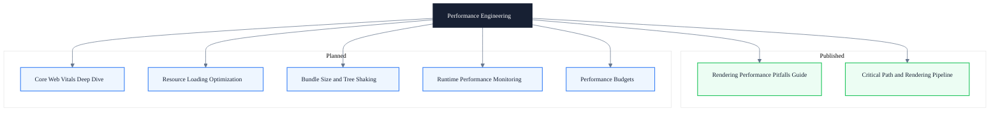

# Performance Engineering

> Subtitle: Locate performance issues to specific stages along the critical path and rendering pipeline

## Module Positioning

Performance optimization is not a single-point trick like "add will-change" or "use transform for animations." It is a complete engineering method from problem localization to optimization verification. This module centers on the modern browser's critical path and rendering pipeline, decomposing performance issues into three models — waiting / blocking / redundant work — so that every optimization is evidence-based.

Each optimization recommendation is paired with a DevTools verification path and an actionable practice checklist, avoiding pseudo-optimizations that "look improved" but actually change nothing.

The module also addresses engineering governance: from metric breakdown and resource loading to bundle size and runtime monitoring with performance budgets, turning performance from one-off tuning into a sustainable engineering capability.

---

## Knowledge Map

---

## Core Topics

- ✓ **Critical path and rendering pipeline** — TTFB / resource discovery / HTML-CSS-JS parsing / module dependency graph / LCP breakdown
- ✓ **Rendering performance pitfalls** — Common traps and solutions at Layout / Paint / Composite stages
- ◯ **Core Web Vitals deep dive** — Metric breakdown and optimization directions for LCP / INP / CLS / TTFB
- ◯ **Resource loading optimization** — Preload / preconnect / resource priority / cache strategy
- ◯ **Bundle size and tree shaking** — Dependency analysis / on-demand loading / dead code elimination
- ◯ **Runtime performance monitoring** — Long tasks / JIT deoptimization / GC pauses / INP optimization
- ◯ **Performance budgets** — Budget definition / CI gates / regression protection

---

## Learning Path

1. Start with "The Underlying Chain of Modern Frontend Performance" to build the three-model mental framework of waiting / blocking / redundant work
2. Then read "Rendering Performance Pitfalls Guide" to dive into stage-specific traps along the rendering pipeline
3. Proceed through Core Web Vitals → Resource Loading → Bundle Size → Runtime Monitoring → Performance Budgets in order

---

## Article Guide

- [Rendering Performance Pitfalls Guide](/en/performance/rendering-pitfalls) — Common traps and solutions at Layout / Paint / Composite stages
- [The Underlying Chain of Modern Frontend Performance](/en/performance/critical-path) — A complete performance model from TTFB to Hydration

---

## Intended Readers

- Performance owners who need to build a team-level performance diagnosis and optimization framework
- Intermediate and senior frontend engineers who want to move beyond single-point optimizations like "add will-change"
- Frontend architects who need to evaluate how technical choices affect the critical path

---

## Extended Resources

- [web.dev/performance](https://web.dev/performance/) — Google's authoritative guide to performance optimization
- [Chrome DevTools Documentation](https://developer.chrome.com/docs/devtools/) — Official docs for performance analysis tooling
- [Core Web Vitals](https://web.dev/articles/vitals) — Official specification of core performance metrics
- "High Performance Browser Networking" by Ilya Grigorik — A classic on browser networking and performance
