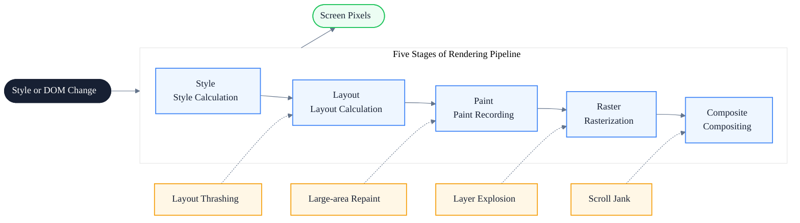
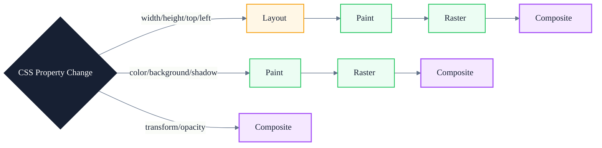
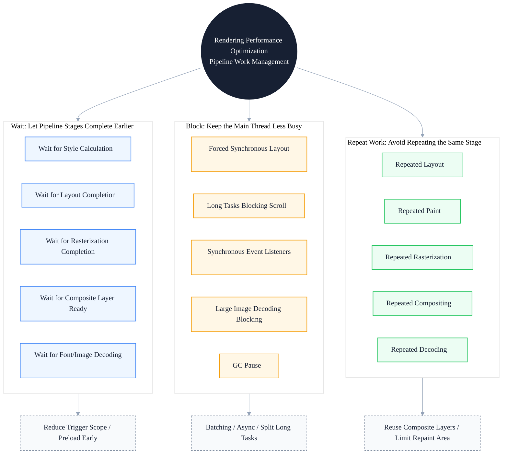

# Rendering Performance Pitfalls: Common Traps and Solutions from Layout, Paint to Composite

> Subtitle: From layout thrashing, forced synchronous layout, large-area repaints, composite layer explosion to will-change abuse
>
> Target Audience: Mid-to-senior frontend engineers, frontend architects, performance optimization leads
>
> Reading Time: about 22 minutes

::: info In one sentence
The essence of rendering performance issues is triggering unnecessary rendering pipeline work, or overloading a specific stage of the pipeline.
:::

## Table of Contents

- [Before We Begin](#before-we-begin)
- [I. Rendering Pipeline Review: Five Stages from Style to Composite](#i-rendering-pipeline-review-five-stages-from-style-to-composite)
- [II. Layout Pitfalls: Layout Thrashing and Forced Synchronous Layout](#ii-layout-pitfalls-layout-thrashing-and-forced-synchronous-layout)
- [III. Paint Pitfalls: Large-area Repaints and Paint Region Propagation](#iii-paint-pitfalls-large-area-repaints-and-paint-region-propagation)
- [IV. Composite Pitfalls: Layer Explosion and will-change Abuse](#iv-composite-pitfalls-layer-explosion-and-will-change-abuse)
- [V. Animation Performance: Boundary Conditions Beyond transform and opacity](#v-animation-performance-boundary-conditions-beyond-transform-and-opacity)
- [VI. DOM Scale: How Node Count Brings Down the Entire Pipeline](#vi-dom-scale-how-node-count-brings-down-the-entire-pipeline)
- [VII. CSS Selector Complexity: The Underestimated Cost of Style](#vii-css-selector-complexity-the-underestimated-cost-of-style)
- [VIII. Fonts and First Screen: FOIT, FOUT, and Layout Shift](#viii-fonts-and-first-screen-foit-fout-and-layout-shift)
- [IX. Images and Media: Decoding, Rasterization, and LCP](#ix-images-and-media-decoding-rasterization-and-lcp)
- [X. Scroll Performance: Passive Listener and Composite Layers](#x-scroll-performance-passive-listener-and-composite-layers)
- [XI. Unified Model: Three Groups of Rendering Pipeline Problems](#xi-unified-model-three-groups-of-rendering-pipeline-problems)
- [XII. Rendering Performance Practice Checklist](#xii-rendering-performance-practice-checklist)
- [Conclusion: Optimize the Pipeline, Not a Single Point](#conclusion-optimize-the-pipeline-not-a-single-point)
- [FAQ](#faq)
- [Sources](#sources)

## Before We Begin

When many teams work on rendering performance optimization, their first reaction is to "add `will-change`", "use `transform` for animations", or "enable GPU acceleration". These heuristics are certainly useful, but they are conclusions, not root causes.

Without understanding the full path of the rendering pipeline, it is easy to run into situations like these:

- Adding `will-change: transform` to every animated element, causing memory to spike and layers to explode
- Using `transform` for animations, but the parent triggers reflow, so the animation still stutters
- Optimizing single-frame paint time, but continuous repaints during scrolling still cause frame drops overall
- Implementing list virtualization perfectly, but complex CSS selectors overload the Style stage and drag down the entire pipeline

::: info In one sentence
The essence of rendering performance issues is triggering unnecessary rendering pipeline work, or overloading a specific stage of the pipeline.
:::

This main thread can be broken down into three groups of problems:

- **Waiting**: waiting for style calculation to finish, waiting for layout to finish, waiting for rasterization to finish, waiting for composite layers to be ready.
- **Blocking**: forced synchronous layout blocking the main thread, long tasks blocking scrolling, synchronous event listeners blocking the scrolling thread.
- **Repeated work**: repeated layout, repeated paint, repeated rasterization, repeated compositing.

Understanding these three groups requires first reviewing the complete path of the modern browser rendering pipeline. The diagram below shows the five-stage chain from Style to Composite; every stage may encounter waiting, blocking, or repeated work:



---

## I. Rendering Pipeline Review: Five Stages from Style to Composite

The browser turns the DOM and CSSOM into screen pixels, usually going through the following five stages:

1. **Style**: match selector rules to DOM elements and compute the final style values for each node.
2. **Layout**: compute the box model based on styles and determine each element's position and size.
3. **Paint**: generate paint records (display list), recording "what to draw first, what to draw later".
4. **Raster**: turn paint commands into real pixels, usually processed in tiles concurrently.
5. **Composite**: combine multiple layers onto the screen in order, usually done by the GPU.

Different CSS property changes trigger recomputation of different stages:

- Changing `width` / `height` / `margin` / `padding` / `top` / `left`: triggers **Layout** (and all subsequent stages)
- Changing `color` / `background` / `box-shadow` / `border-color`: triggers **Paint** (and subsequent stages)
- Changing `transform` / `opacity`: in most cases only triggers **Composite**



::: tip Key takeaway of this section

The cost of the rendering pipeline depends on which stage a change triggers. Layout is the most expensive (triggering all subsequent stages), Paint is second, and Composite is the cheapest. The first principle of rendering performance optimization is: **make changes trigger only Composite as much as possible**.

:::

::: warning Common misconception

Thinking "CSS animations are always faster than JS animations". If an animated property triggers Layout or Paint, CSS animations will stutter too. The key is not the animation implementation, but whether the animated property stays in the compositing stage.

:::

---

## II. Layout Pitfalls: Layout Thrashing and Forced Synchronous Layout

**Layout Thrashing** is one of the most classic traps in rendering performance. Its essence is repeatedly triggering a "write → read → write → read" loop within the same frame, forcing the browser to execute synchronous layout calculations multiple times.

### 1. Causes of Forced Synchronous Layout

To keep DOM operations smooth, the browser batches multiple layout changes within a frame and calculates them together in the next frame. But if you **read layout properties immediately after writing to the DOM**, the browser is forced to calculate layout right away to return the correct value. This is **Forced Synchronous Layout**.

Common APIs that trigger forced synchronous layout:

- `offsetWidth` / `offsetHeight` / `offsetTop` / `offsetLeft`
- `clientWidth` / `clientHeight`
- `scrollWidth` / `scrollHeight` / `scrollTop` / `scrollLeft`
- `getBoundingClientRect()`
- `getComputedStyle()`
- `window.scrollY` / `window.scrollX`

### 2. Anti-pattern: interleaved read-write loop

```javascript
// Anti-pattern: forces synchronous layout on every loop iteration
const boxes = document.querySelectorAll('.box')
for (const box of boxes) {
  box.style.width = box.offsetWidth + 10 + 'px'
}
```

The problem with this code: each iteration first reads `offsetWidth` (triggering synchronous layout), then writes `style.width` (invalidating layout). On the next iteration, reading `offsetWidth` again forces the browser to recalculate layout. N elements trigger N synchronous layouts.

### 3. Good pattern: read in batch first, then write in batch

```javascript
// Good pattern: batch reads first, then batch writes, triggering only one layout
const boxes = document.querySelectorAll('.box')
const widths = Array.from(boxes).map((box) => box.offsetWidth)
boxes.forEach((box, i) => {
  box.style.width = widths[i] + 10 + 'px'
})
```

After separating reads and writes, the entire loop triggers only one layout calculation.

### 4. Manage reads and writes with the FastDOM pattern

In complex scenarios, you can use `requestAnimationFrame` to place reads in one frame and writes in the next:

```javascript
// Good pattern: isolate reads and writes with rAF
function measureAndMutate() {
  const boxes = document.querySelectorAll('.box')
  const widths = Array.from(boxes).map((box) => box.offsetWidth)

  requestAnimationFrame(() => {
    boxes.forEach((box, i) => {
      box.style.width = widths[i] + 10 + 'px'
    })
  })
}
```

::: tip Key takeaway of this section

The root cause of Layout Thrashing is "interleaved reads and writes". The solution is to batch layout reads and layout writes separately, avoiding repeated forced synchronous layouts within the same frame.

:::

::: info Engineering insight

In Chrome DevTools' Performance panel, forced synchronous layout appears as purple "Layout" blocks with red warning markers, with "Recalculate Style" + "Layout" appearing repeatedly. If you see this sawtooth pattern of consecutive Layout blocks, it is basically Layout Thrashing.

:::

---

## III. Paint Pitfalls: Large-area Repaints and Paint Region Propagation

Even after avoiding Layout issues, there are still many traps in the Paint stage. Paint cost depends on two factors: **paint region size** and **paint complexity**.

### 1. The paint region is larger than you think

The browser does not repaint only the area of "the element that changed". It computes an **invalidation rect** that merges all affected regions. If multiple elements are adjacent, their repaint regions may merge into one large rectangle.

```html
<!-- Anti-pattern: adjacent elements' repaint regions merge -->
<div class="card" style="background: #fff">Card A</div>
<div class="card" style="background: #fff">Card B</div>
<div class="card highlighted" style="background: #ffe">Card C highlighted</div>
<div class="card" style="background: #fff">Card D</div>
```

Changing the background color of `.highlighted` may trigger a merged repaint region across all four cards.

### 2. box-shadow and border-radius are Paint killers

```css
/* Anti-pattern: large radius + large spread box-shadow is extremely expensive to paint */
.modal {
  box-shadow: 0 50px 100px rgba(0, 0, 0, 0.5);
  border-radius: 24px;
}
```

The paint cost of `box-shadow` is proportional to the shadow area, and `border-radius` requires anti-aliasing at the edges. When combined, Paint time increases significantly.

### 3. Continuous repaints during scrolling

Fixed-position elements (`position: fixed` / `position: sticky`) can cause the entire page scroll to stutter if they trigger repaints during scrolling:

```css
/* Anti-pattern: fixed element changing background triggers full-page repaint */
.header {
  position: fixed;
  transition: background 0.3s;
}
.header.scrolled {
  background: rgba(255, 255, 255, 0.9);
}
```

### 4. Solution: limit repaints to composite layers

```css
/* Good pattern: promote to a composite layer so repaint happens only on that layer */
.header {
  position: fixed;
  will-change: transform;
  transform: translateZ(0);
}
```

After promoting to a composite layer, the element's repaint does not propagate to other layers, and the main thread is also less burdened during scrolling.

::: tip Key takeaway of this section

Paint cost is determined by "paint region × paint complexity". `box-shadow`, `border-radius`, filters, and gradients are the main sources of Paint cost. Promoting frequently changing elements to independent composite layers can limit the repaint region.

:::

::: warning Common misconception

Thinking "changing colors won't be slow". If you change the `background` or `box-shadow` of a large-area element, Paint cost is still high. Color changes do not trigger Layout, but they do trigger Paint + Raster + Composite.

:::

---

## IV. Composite Pitfalls: Layer Explosion and will-change Abuse

`will-change` and `transform: translateZ(0)` are common "GPU acceleration" techniques, but abuse can lead to **Layer Explosion**.

### 1. The cost of composite layers

Each composite layer occupies GPU memory, and compositing between layers also consumes GPU resources. Too many composite layers cause:

- GPU memory usage to spike (especially noticeable on mobile)
- The Composite stage itself to slow down (layer sorting, layer merging)
- Overhead from layer splitting and re-compositing

### 2. Anti-pattern: adding will-change to every animated element

```css
/* Anti-pattern: indiscriminate will-change causes layer explosion */
.card {
  will-change: transform;
}
.list-item {
  will-change: transform;
}
.button {
  will-change: transform;
}
```

If there are hundreds of `.card` and `.list-item` elements on the page, each becoming an independent composite layer, GPU memory will quickly run out.

### 3. Good pattern: enable on demand, remove when done

```css
/* Good pattern: promote to composite layer only when animation actually stutters */
.card-animated {
  will-change: transform;
}
```

```javascript
// Good pattern: remove will-change after animation ends
function animateCard(card) {
  card.style.willChange = 'transform'
  const animation = card.animate(
    [{ transform: 'translateX(0)' }, { transform: 'translateX(100px)' }],
    { duration: 300 }
  )
  animation.onfinish = () => {
    card.style.willChange = 'auto'
  }
}
```

### 4. Implicit composite layers

Some elements get promoted to composite layers even without `will-change`, for example:

- `position: fixed` / `position: sticky` with `z-index`
- `opacity` less than 1
- `transform` not `none`
- `<video>`, `<canvas>`, `<iframe>`
- CSS filter `filter` not `none`

These implicit composite layers are not a problem by themselves, but if there are too many, they can also drag down the Composite stage.

::: tip Key takeaway of this section

`will-change` is a way to "borrow GPU resources", not free. Only enable it when animation actually needs a boost, and remove it immediately after the animation ends. Indiscriminate `will-change` causes layer explosion.

:::

::: info Engineering insight

In Chrome DevTools' Layers panel you can view all composite layers on the page. If you find dozens or even hundreds of layers, it is basically layer explosion. A normal page usually has only 5-15 composite layers.

:::

---

## V. Animation Performance: Boundary Conditions Beyond transform and opacity

"Only use `transform` and `opacity` for animations" is the right direction, but there are still boundary conditions that can make animations stutter.

### 1. Parent reflow interrupts child composite animations

```html
<!-- Anti-pattern: parent changes width, child's transform animation is also interrupted -->
<div class="parent" style="width: 50%">
  <div class="child" style="transform: translateX(100px)"></div>
</div>
```

A parent `width` change triggers Layout, invalidating the Layout of the entire subtree, and the child's composite animation is interrupted.

### 2. After an animated element is promoted to a composite layer, the rasterization region is too large

```css
/* Anti-pattern: promoting the entire long list to a composite layer causes rasterization cost to explode */
.long-list {
  will-change: transform;
  height: 10000px;
}
```

After a 10000px tall element is promoted to a composite layer, the browser needs to rasterize the entire layer, causing GPU memory and rasterization time to spike.

### 3. Scrolling triggered during animation

```javascript
// Anti-pattern: scrollIntoView during animation interrupts the composite animation
element.animate(...)
element.scrollIntoView({ behavior: 'smooth' })
```

`scrollIntoView` triggers Layout and interrupts the ongoing composite animation.

### 4. Good pattern: animated elements keep independent composite layers and avoid parent reflow

```css
/* Good pattern: animated element is independent and parent does not trigger layout */
.card {
  position: absolute;
  will-change: transform;
}
.card.is-moving {
  animation: slide 0.3s ease;
}
@keyframes slide {
  from { transform: translateX(0); }
  to { transform: translateX(100px); }
}
```

::: tip Key takeaway of this section

For `transform` / `opacity` animations to stay smooth, three conditions must be met simultaneously: the animated element is on an independent composite layer, the parent does not trigger Layout during animation, and the animated element itself is not so large that rasterization is overloaded.

:::

---

## VI. DOM Scale: How Node Count Brings Down the Entire Pipeline

DOM node count is the "hidden tax" of rendering performance. It does not directly trigger a specific stage, but makes every stage slower.

### 1. Style stage: selector matching cost is linear with node count

The browser needs to match every CSS rule against every DOM node. 10,000 nodes × 1,000 rules = 10 million matches.

### 2. Layout stage: layout tree construction cost is linear with node count

`display: none` elements do not enter the layout tree, but `visibility: hidden` elements do. Layout computation needs to traverse the entire layout tree.

### 3. Paint stage: paint record count is related to node count

Each visible node produces at least one paint record, and complex structures produce more.

### 4. Anti-pattern: full rendering of long lists

```html
<!-- Anti-pattern: 10,000 data items fully rendered to DOM -->
<ul id="list">
  <!-- 10,000 <li> -->
</ul>
```

10,000 `<li>` elements slow down Style, Layout, and Paint, especially during scrolling.

### 5. Good pattern: virtual list + content chunking

```javascript
// Good pattern: render only viewport + buffer
function renderVisibleItems(container, items, scrollTop, viewportHeight) {
  const itemHeight = 40
  const startIndex = Math.max(0, Math.floor(scrollTop / itemHeight) - 5)
  const endIndex = Math.min(
    items.length,
    Math.ceil((scrollTop + viewportHeight) / itemHeight) + 5
  )

  container.innerHTML = items
    .slice(startIndex, endIndex)
    .map((item) => `<li style="height:${itemHeight}px">${item}</li>`)
    .join('')
}
```

::: tip Key takeaway of this section

DOM scale is a multiplier for rendering performance. The more nodes there are, the slower every pipeline stage becomes. Long lists, tree structures, and tables should be virtualized or paginated first.

:::

::: info Engineering insight

In the Performance panel, if the time of "Recalculate Style" and "Layout" is clearly positively correlated with DOM node count, it indicates a DOM scale problem. Consider virtual lists, lazy rendering, or content chunking.

:::

---

## VII. CSS Selector Complexity: The Underestimated Cost of Style

Many teams only focus on "how many DOM nodes there are" and "whether animations use transform", while ignoring the complexity of CSS selectors themselves.

### 1. Selector matching proceeds from right to left

When matching selectors, the browser starts from the rightmost key selector and verifies leftward. This means:

```css
/* Anti-pattern: rightmost key selector is a universal selector, matching cost is extremely high */
.navbar * {
  outline: none;
}

/* Anti-pattern: descendant selector is too deep, matching path is long */
.list .item .row .col .cell {
  color: red;
}
```

### 2. Universal selectors and attribute selectors are the hardest hit

```css
/* Anti-pattern: universal selector matches all elements */
* {
  box-sizing: border-box;
}

/* Anti-pattern: complex attribute selector */
[data-type='card'][data-status='active']:not(.disabled) {
  background: #fff;
}
```

### 3. BEM naming is better than deep descendant selectors

```css
/* Good pattern: BEM naming, flat selectors */
.card {}
.card__title {}
.card--highlighted {}
```

The advantage of BEM is not "nice naming", but that selector complexity is constant O(1) and does not depend on DOM depth.

::: tip Key takeaway of this section

CSS selector complexity directly affects Style stage time. Prefer class selectors, avoid universal selectors, attribute selectors, and overly deep descendant selectors. Flat naming conventions like BEM are better for performance.

:::

---

## VIII. Fonts and First Screen: FOIT, FOUT, and Layout Shift

Font loading is an easily overlooked part of rendering performance. It not only affects LCP, but can also trigger CLS (Cumulative Layout Shift).

### 1. FOIT and FOUT

- **FOIT (Flash of Invisible Text)**: text is invisible before the font finishes loading. Chromium's default behavior is to wait up to 3 seconds, then fall back to a fallback font.
- **FOUT (Flash of Unstyled Text)**: the fallback font is displayed first, then replaced after the font loads.

```css
/* Good pattern: control font loading strategy with font-display */
@font-face {
  font-family: 'CustomFont';
  src: url('/fonts/custom.woff2') format('woff2');
  font-display: swap;
}
```

`font-display: swap` means display with the fallback font first, then replace after the font loads (FOUT).

### 2. Font loading triggers layout shift

If the metrics of the fallback font and the custom font differ, replacement will trigger reflow and cause CLS.

```css
/* Good pattern: adjust fallback font metrics with size-adjust to reduce shift */
@font-face {
  font-family: 'FallbackFont';
  src: local('Arial');
  size-adjust: 95%;
  ascent-override: 90%;
}
```

### 3. Font preloading

```html
<!-- Good pattern: preload critical fonts to reduce waiting -->
<link
  rel="preload"
  href="/fonts/custom.woff2"
  as="font"
  type="font/woff2"
  crossorigin
/>
```

::: tip Key takeaway of this section

Font loading affects LCP and CLS. Use `font-display: swap` to avoid FOIT, use `preload` to accelerate critical fonts, and use `size-adjust` to reduce layout shift during font replacement.

:::

---

## IX. Images and Media: Decoding, Rasterization, and LCP

Images are the main source of LCP and a major battlefield for rendering performance.

### 1. Image decoding is a main-thread task

```html
<!-- Anti-pattern: large image without decoding optimization blocks the main thread -->

```

Large image decoding is a synchronous task that blocks the main thread. You can use `decoding="async"` to let the browser decode asynchronously:

```html
<!-- Good pattern: asynchronous decoding reduces main-thread blocking -->

```

### 2. Rasterization cost is proportional to image size

Rasterization needs to upload the decoded bitmap as a texture to the GPU. The texture upload cost of a 4K image is much higher than that of a 720p image. Use `srcset` to provide appropriate sizes on demand:

```html
<!-- Good pattern: responsive images, load appropriate size by device pixel ratio -->

```

### 3. Video first frame and rasterization

```html
<!-- Good pattern: preload video poster to avoid black screen -->
<video preload="metadata" poster="/poster.webp">
  <source src="/video.mp4" type="video/mp4" />
</video>
```

The `poster` image is displayed before the video first frame renders, avoiding a long black screen when the LCP element is a video.

::: tip Key takeaway of this section

The rendering cost of images and media includes "decoding + rasterization + texture upload". Use `decoding="async"` for asynchronous decoding, use `srcset` to control size, and use `poster` to placeholder the video first frame.

:::

---

## X. Scroll Performance: Passive Listener and Composite Layers

Scrolling is one of the most frequent user interactions. Scroll jank usually comes from two causes: **the main thread being blocked by long tasks** and **scroll event listeners executing synchronously**.

### 1. Anti-pattern: synchronous scroll listener blocks the scrolling thread

```javascript
// Anti-pattern: synchronous scroll listener blocks the scrolling thread
document.addEventListener('scroll', () => {
  // complex calculations
  updateParallax()
  updateIndicator()
})
```

The browser cannot know whether the listener will call `preventDefault()`, so it must wait for the listener to finish before scrolling the page.

### 2. Good pattern: passive listener

```javascript
// Good pattern: declare passive so the browser can scroll in parallel
document.addEventListener(
  'scroll',
  () => {
    updateParallax()
    updateIndicator()
  },
  { passive: true }
)
```

`passive: true` tells the browser the listener will not call `preventDefault()`, so the browser can continue scrolling while the listener runs on the main thread.

### 3. Parallax scrolling should use composite layers

```css
/* Good pattern: promote parallax element to composite layer, only compositing during scroll */
.parallax-layer {
  position: fixed;
  will-change: transform;
  transform: translate3d(0, 0, 0);
}
```

```javascript
// Good pattern: throttle scroll callback with rAF, only change transform
let ticking = false
document.addEventListener(
  'scroll',
  () => {
    if (!ticking) {
      requestAnimationFrame(() => {
        const y = window.scrollY
        parallaxLayer.style.transform = `translate3d(0, ${y * 0.5}px, 0)`
        ticking = false
      })
      ticking = true
    }
  },
  { passive: true }
)
```

::: tip Key takeaway of this section

The core of scroll performance optimization is: declare `passive: true` so listeners do not block scrolling, throttle callbacks with `requestAnimationFrame`, and keep visual changes during scrolling within composite layers (only change `transform`).

:::

::: warning Common misconception

Thinking "scroll jank is caused by too many event listeners". The real reason is usually that listeners are not declared `passive`, or they change properties that trigger Layout inside the listener. Even a single listener can cause jank if it executes synchronously.

:::

---

## XI. Unified Model: Three Groups of Rendering Pipeline Problems

The diagram below summarizes all rendering performance pitfalls in this article into a unified model, grouped into "waiting, blocking, repeated work":



### 1. Waiting

Waiting in the rendering pipeline includes: waiting for style calculation to finish, waiting for layout to finish, waiting for rasterization to finish, waiting for composite layers to be ready, and waiting for fonts and images to decode. Most of these waits come from triggering unnecessary pipeline stages.

### 2. Blocking

Blocking in the rendering pipeline includes: forced synchronous layout blocking the main thread, long tasks blocking scrolling, synchronous event listeners blocking the scrolling thread, large image decoding blocking the main thread, and GC pauses blocking all interactions.

### 3. Repeated work

Repeated work in the rendering pipeline includes: repeated layout (Layout Thrashing), repeated paint (large-area repaints), repeated rasterization (composite layers being repeatedly rebuilt), repeated compositing (layer sorting repeatedly), and repeated decoding (the same image decoded multiple times).

::: tip Key takeaway of this section

All rendering performance issues can be grouped into "waiting, blocking, repeated work". This unified model is the mental framework for rendering performance optimization: first locate which stage the problem is in, then determine which group it belongs to, and finally choose the corresponding strategy.

:::

---

## XII. Rendering Performance Practice Checklist

### 1. Layout optimization

- [ ] Avoid interleaved read-write loops (Layout Thrashing)
- [ ] Batch layout property reads and batch style writes
- [ ] Use `requestAnimationFrame` to isolate reads and writes
- [ ] Avoid reading `offsetTop` / `scrollTop` in scroll callbacks

### 2. Paint optimization

- [ ] Use large-radius `box-shadow` and `border-radius` with caution
- [ ] Avoid changing `background` / `box-shadow` on large-area elements
- [ ] Promote frequently changing elements to composite layers to limit repaint regions
- [ ] Use filter `filter` only when necessary

### 3. Composite optimization

- [ ] Enable `will-change` on demand and remove it when done
- [ ] Avoid indiscriminate `will-change: transform`
- [ ] Regularly check the Layers panel and keep composite layer count under 15
- [ ] Watch out for implicit composite layers (`opacity`, `filter`, `<video>`)

### 4. Animation optimization

- [ ] Prefer `transform` / `opacity` for animation properties
- [ ] Keep animated elements on independent composite layers
- [ ] Ensure parents do not trigger Layout during animation
- [ ] Control the height of animated elements in long lists to avoid rasterization overload

### 5. DOM scale control

- [ ] Virtualize long lists (render only viewport + buffer)
- [ ] Lazily expand tree structures
- [ ] Paginate or virtual-scroll tables
- [ ] Monitor DOM node count and alert when it exceeds 5000

### 6. CSS selector optimization

- [ ] Prefer class selectors, avoid universal selectors
- [ ] Keep descendant selector depth within 3 levels
- [ ] Consider flat naming conventions like BEM
- [ ] Avoid combining attribute selectors with pseudo-classes

### 7. Font and image optimization

- [ ] Use `font-display: swap` to avoid FOIT
- [ ] Preload critical fonts
- [ ] Use `size-adjust` to reduce font replacement shift
- [ ] Use `decoding="async"` for images
- [ ] Provide responsive sizes with `srcset`

### 8. Scroll optimization

- [ ] Declare `passive: true` on scroll listeners
- [ ] Throttle scroll callbacks with `requestAnimationFrame`
- [ ] Promote parallax elements to composite layers and only change `transform`
- [ ] Avoid triggering Layout in scroll callbacks

---

## Conclusion: Optimize the Pipeline, Not a Single Point

Rendering performance optimization is not a single-point trick like "add `will-change`" or "use `transform`". It is about understanding how the entire rendering pipeline works, locating the problem to a specific stage, and then choosing the appropriate optimization method.

The modern browser rendering pipeline is a sophisticated system: Style computes selector matching, Layout computes the box model, Paint generates paint records, Raster turns instructions into pixels, and Composite combines layers onto the screen. Every stage has a cost, and every stage has pitfalls.

In the end, the central thesis of this article remains:

> **The essence of rendering performance issues is triggering unnecessary rendering pipeline work, or overloading a specific stage of the pipeline.**

---

## FAQ

### 1. Why does adding `will-change` make things slower?

`will-change` promotes an element to an independent composite layer, occupying GPU memory. If used indiscriminately, it causes layer explosion, GPU memory exhaustion, and the Composite stage itself slows down. `will-change` should be enabled on demand and removed immediately after the animation ends.

### 2. Are `transform` animations guaranteed to be smooth?

Not necessarily. For `transform` animations to be smooth, three conditions must be met simultaneously: the animated element is on an independent composite layer, the parent does not trigger Layout during animation, and the animated element itself is not so large that rasterization is overloaded. If the parent changes `width`, the child's `transform` animation will also be interrupted.

### 3. How do I tell whether it is a Layout problem or a Paint problem?

In Chrome DevTools' Performance panel, purple "Layout" blocks indicate layout calculation time, and green "Paint" blocks indicate paint time. If purple blocks appear consecutively with red warning markers, it is a Layout problem; if green blocks are large and recurring, it is a Paint problem.

### 4. Why can virtual lists significantly improve scroll performance?

Virtual lists render only DOM nodes in the viewport + buffer, reducing 10,000 nodes to a few dozen. DOM scale is a multiplier for rendering performance; with fewer nodes, every pipeline stage (Style, Layout, Paint) becomes faster, so scrolling naturally becomes smoother.

### 5. What exactly does `passive: true` solve?

The browser cannot know in advance whether a scroll listener will call `preventDefault()`, so it must wait for the listener to finish before scrolling the page. `passive: true` tells the browser the listener will not block scrolling, so the browser can continue the scrolling thread while the listener runs on the main thread, avoiding jank.

---

## Sources

1. Web.dev rendering performance guide:
   
   [https://web.dev/articles/rendering-performance](https://web.dev/articles/rendering-performance)

2. Chrome DevTools rendering performance analysis:
   
   [https://developer.chrome.com/docs/devtools/performance/reference](https://developer.chrome.com/docs/devtools/performance/reference)

3. Inside look at modern web browser (Chrome official blog):
   
   [https://developer.chrome.com/blog/inside-browser-part3](https://developer.chrome.com/blog/inside-browser-part3)

4. Addy Osmani "How modern browsers work":
   
   [https://addyosmani.com/](https://addyosmani.com/)
