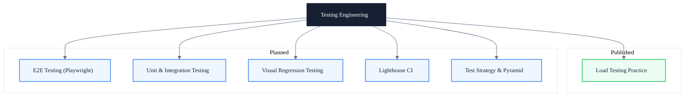

# Testing Engineering

> Subtitle: From load testing to E2E and unit testing — building a verifiable quality assurance system

---

## Module Positioning

Testing is not a "final step" after development is done. It is an engineering method that runs through the full lifecycle of requirements, design, and delivery. This module decomposes testing into three goals: verification, isolation, and regression. Verify system boundaries under real pressure, isolate defects to specific layers, and ensure every change does not introduce new problems.

Each test category is accompanied by toolchain selection, scenario design, and result-analysis methods, avoiding pseudo-coverage where "tests were run but no conclusion could be drawn." Load testing focuses on throughput and bottlenecks, E2E testing on the stability of critical paths, and unit and integration testing on logical boundaries and contracts. Together they form a verifiable, regression-friendly, and evolvable quality assurance system.

This module emphasizes engineering thinking: test plans first, quantifiable metrics, and reproducible results — making testing a trustworthy quality gate in the delivery pipeline rather than a one-off manual check.

---

## Knowledge Map

---

## Core Topics

**✓ Published**

- **Load Testing Engineering Practice** — Test plans, load models, JMeter script parameterization, TPS / response time / error-rate metrics, bottleneck localization

**◯ Planned**

- **E2E Testing (Playwright)** — Playwright scenario design, assertion strategy, parallel execution, stability governance
- **Unit & Integration Testing** — Jest / Vitest test pyramid, mock strategy, coverage boundaries, contract testing
- **Visual Regression Testing** — Visual snapshot comparison, Storybook + Chromatic, cross-browser consistency
- **Lighthouse CI** — Performance budgets, CI integration, Core Web Vitals gating
- **Test Strategy & Pyramid** — Test layering, ROI evaluation, test debt management

---

## Learning Path

1. Start with load testing practice to understand the full-flow methodology of test plans, load models, and bottleneck identification
2. Build a test pyramid mindset, clarifying the responsibilities and boundaries of unit, integration, and E2E layers
3. Introduce Playwright E2E scenario design to cover critical user journeys and assertion strategies
4. Configure Lighthouse CI and performance budgets to embed quality gates into the delivery pipeline
5. Adopt visual regression testing to safeguard UI consistency and prevent style regressions

---

## Article Guide

- [Load Testing Engineering Practice: From Test Plan to Bottleneck Identification](/en/testing/load-testing-practice) — Full-process methodology for load testing and bottleneck diagnosis

---

## Intended Readers

- Testing engineers and quality owners who need to build a team-level load-testing and bottleneck-localization framework
- Intermediate and senior frontend engineers who want to understand system behavior and stability under real pressure
- Frontend architects who need to evaluate scalability and fault tolerance during technical decision-making

---

## Extended Resources

- [Playwright Documentation](https://playwright.dev/docs/intro)
- [Testing Library Documentation](https://testing-library.com/)
- [Google Testing Blog](https://testing.googleblog.com/)
- Book: *Software Testing: A Practitioner's Guide*
