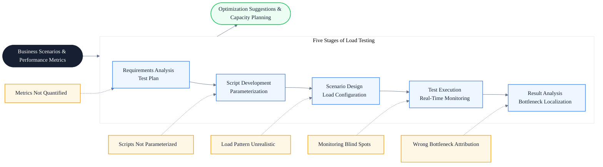
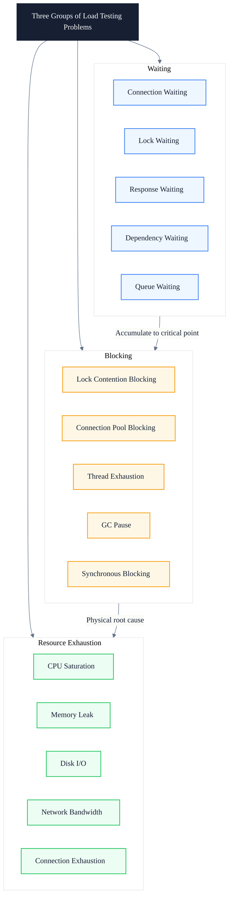
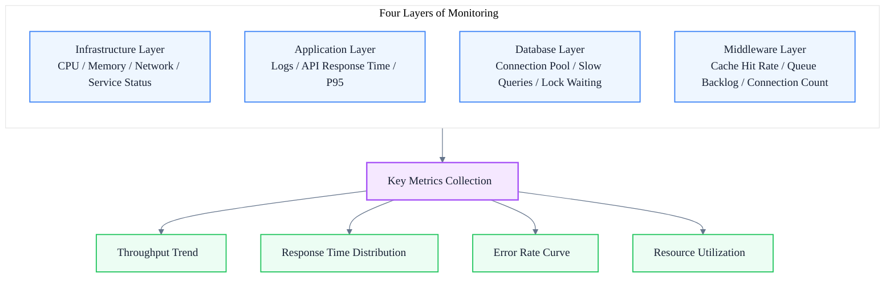
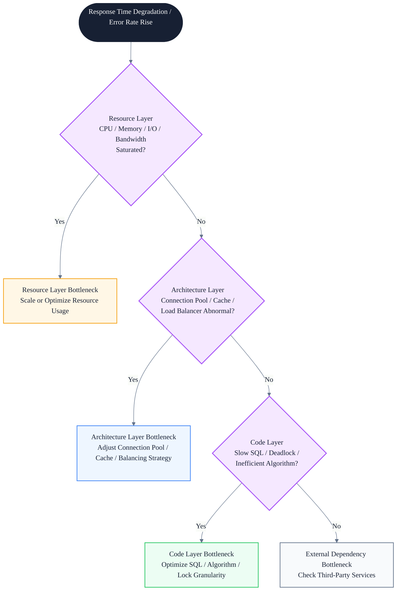
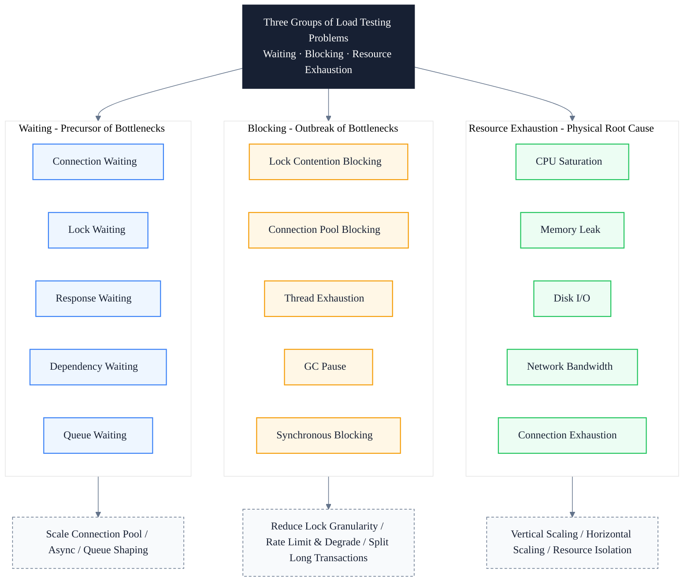

# Load Testing Engineering Practice: A Full-Stack Methodology from Test Plan to Bottleneck Localization

> Subtitle: From test objectives, load models, and JMeter script parameterization to TPS, 95th-percentile response time, bottleneck diagnosis, and degradation/circuit-breaker validation.
>
> Target readers: Testing engineers, quality owners, intermediate and senior frontend engineers, frontend architects.
>
> Reading time: ~24 minutes.

::: info In one sentence
The essence of load testing is exposing a system's real boundaries under controlled pressure — boundaries of waiting, blocking, and resource exhaustion.
:::

## Table of Contents

- [Introduction](#introduction)
- [1. Why Do Load Testing: From Technical Verification to Business Assurance](#1-why-do-load-testing-from-technical-verification-to-business-assurance)
- [2. Three Groups of Load Testing Problems: Waiting, Blocking, Resource Exhaustion](#2-three-groups-of-load-testing-problems-waiting-blocking-resource-exhaustion)
- [3. Requirements Analysis and Test Plan](#3-requirements-analysis-and-test-plan)
- [4. Script Development and Parameterization](#4-script-development-and-parameterization)
- [5. Scenario Design and Load Patterns](#5-scenario-design-and-load-patterns)
- [6. Test Execution and Real-Time Monitoring](#6-test-execution-and-real-time-monitoring)
- [7. Result Analysis and Bottleneck Localization](#7-result-analysis-and-bottleneck-localization)
- [8. Key Metrics: TPS, Response Time, and Percentiles](#8-key-metrics-tps-response-time-and-percentiles)
- [9. Third-Party Dependency Pressure Validation: Degradation and Circuit Breaker](#9-third-party-dependency-pressure-validation-degradation-and-circuit-breaker)
- [10. Unified Model: Three Groups of Load Testing Problems](#10-unified-model-three-groups-of-load-testing-problems)
- [11. Load Testing Practice Checklist](#11-load-testing-practice-checklist)
- [Conclusion: Load Testing Verifies the Real Boundaries of the System](#conclusion-load-testing-verifies-the-real-boundaries-of-the-system)
- [FAQ](#faq)
- [Sources](#sources)

## Introduction

Many teams understand load testing as "use a tool to stress the system and see if it holds." This approach can produce a rough conclusion, but it cannot answer the truly critical questions:

- At what concurrency does the system start to degrade? Where is the inflection point?
- When the error rate rises from 0% to 1%, which resource hits the bottleneck first — CPU, memory, database connection pool, or bandwidth?
- When a third-party dependency (e.g., an external queue service) fails, can the system withstand 10x or 30x traffic impact? Does it slow down or crash?
- Does adding server instances (horizontal scaling) really improve throughput linearly? Or has a shared resource already become the ceiling?

If a load test ends with only a "pass" or "fail" conclusion, it has almost no engineering value. Real load testing must decompose system behavior under pressure: where it waits, where it is blocked, and which resource is exhausted first.

::: info In one sentence
The essence of load testing is exposing a system's real boundaries under controlled pressure — boundaries of waiting, blocking, and resource exhaustion.
:::

This main thread decomposes into three groups of problems:

- **Waiting**: requests waiting for connections, transactions waiting for locks, users waiting for responses, dependencies waiting for downstream services.
- **Blocking**: lock contention blocking transactions, full connection pools blocking requests, thread exhaustion blocking access, GC pauses blocking everything.
- **Resource exhaustion**: CPU saturation, memory leaks, disk I/O saturation, network bandwidth depletion, database connection exhaustion.

Understanding these three groups requires establishing a complete process view of load testing. The following diagram shows the five-stage chain from requirements analysis to bottleneck localization, each stage producing concrete engineering artifacts:



This article follows the five-stage process and marks common pitfalls and executable engineering practices at each stage.

---

## 1. Why Do Load Testing: From Technical Verification to Business Assurance

Many people equate load testing with "run a stress script before going live." This is a narrow understanding. The actual value of load testing goes far beyond technical verification; it also assumes responsibility for business assurance and cost optimization.

The core value of load testing can be summarized as follows:

1. **Discover performance bottlenecks**: Under high concurrency or high load, the system may exhibit response latency, resource exhaustion (CPU, memory, database connection pool saturation), and request queue backlog. Test results provide the basis for optimizing code, SQL queries, network bandwidth, or server configuration.
2. **Verify system scalability**: Horizontal scaling tests whether the system can share load by adding server instances (e.g., increasing Pod count); vertical scaling verifies whether upgrading hardware resources effectively improves performance.
3. **Ensure user experience**: Ensure user operations (page loading, form submission) complete within the expected time (e.g., within 2 seconds), avoiding user complaints caused by system crashes or lag.
4. **Prevent business losses**: Avoid service interruptions due to system overload that damage reputation, and plan server resources reasonably based on test results to balance performance and cost (capacity planning).
5. **Verify third-party dependencies**: Test the behavior of dependent external services (e.g., external queue services) under high load, and simulate whether the system's degradation or circuit-breaker mechanism works when third parties fail — even if the external queue service fails, the system should withstand 10x or 30x traffic impact, allowing slowdown but not outage.
6. **Cost optimization**: Determine the minimum-cost resource configuration (server count, database specifications) that meets performance requirements through testing, avoiding over-investment in hardware or cloud resources for unrealistic high loads.

::: tip Core takeaway of this section

Load testing is not only technical verification, but also business assurance. It exposes risks early, optimizes resource investment, and ensures the system still provides reliable service to users under real pressure.

:::

::: warning Common pitfall

Treating load testing as "run a script once before going live." This practice only yields a binary pass/fail conclusion and cannot answer where the inflection point is, how to attribute the bottleneck, or whether scaling is linear — wasting the value of testing at the final step.

:::

---

## 2. Load Testing's Three Groups of Problems: Waiting, Blocking, Resource Exhaustion

To upgrade load testing from "running scripts" to an "engineering methodology," a unified mental framework is needed to categorize all observed phenomena. This article follows the idea of "waiting, blocking, and repeated work" and adapts it to load testing scenarios as three groups of problems: waiting, blocking, and resource exhaustion.

### 1. Waiting: Waiting Generated Under Pressure

After pressure rises, requests queue and wait at multiple stages:

- **Connection waiting**: Database connection pool is full, and new requests queue waiting for available connections.
- **Lock waiting**: Transactions hold row locks or table locks, and other transactions wait for lock release.
- **Response waiting**: Downstream services respond slowly, and upstream requests wait for the return.
- **Dependency waiting**: Third-party services (e.g., external queue services) queue for processing, and the main flow waits for their response.
- **Queue waiting**: Request queues back up, and new requests wait to be consumed.

The characteristic of waiting is: throughput is still growing, but response time starts to climb. Waiting is the precursor of bottlenecks.

### 2. Blocking: Blocking Generated Under Pressure

When waiting accumulates to a critical point, the system enters a blocked state:

- **Lock contention blocking**: A large number of transactions compete for the same row lock, and database throughput drops sharply.
- **Connection pool blocking**: Connection pool is exhausted, and new requests are directly rejected or hung for a long time.
- **Thread exhaustion blocking**: Web container worker threads are full, unable to accept new requests.
- **GC pause blocking**: Memory pressure triggers frequent Full GC, and application threads are paused.
- **Synchronous blocking**: A slow SQL occupies a connection, dragging down the entire call chain.

The characteristic of blocking is: throughput no longer grows or even decreases, and the error rate starts to rise. Blocking is the outbreak of bottlenecks.

### 3. Resource Exhaustion: Hard Boundaries Under Pressure

Resource exhaustion is the physical root cause of blocking:

- **CPU saturation**: CPU usage remains at 100%, and request processing speed cannot be improved.
- **Memory leak**: Memory keeps growing until OOM, and the process is restarted.
- **Disk I/O bottleneck**: Disk throughput is saturated, and all read/write requests slow down.
- **Network bandwidth depletion**: Bandwidth is saturated, and request transmission latency increases sharply.
- **Database connection exhaustion**: Connection pool configuration is too small, becoming the first bottleneck reached.



::: tip Core takeaway of this section

The three groups are progressive: waiting is the precursor of bottlenecks (throughput still rising, response time starting to climb), blocking is the outbreak of bottlenecks (throughput falling, error rate rising), and resource exhaustion is the physical root cause of blocking. The goal of load testing is to push the system to the critical point of these three groups and identify which resource reaches the boundary first.

:::

---

## 3. Requirements Analysis and Test Plan

Requirements analysis is the step most easily skipped in load testing, yet it most determines the value of the test. Without clear test objectives, all subsequent steps lose their evaluation criteria.

### 1. Clarify Test Objectives

Test objectives must be quantified and cannot stay at "see if the system holds." Typical quantified metrics include:

- **Response time**: Core API P95 response time ≤ 2 seconds.
- **Throughput (TPS)**: Target TPS to reach.
- **Error rate**: Error rate < 1%.
- **Concurrent users**: How many concurrent users can continuously operate.

In addition to metrics, key business scenarios must be identified. For example, a system's core business process includes order submission, data query, report export, file upload, batch processing, and other types of transactions — these are the test scenarios that must be covered. At the same time, system architecture should be analyzed: servers, databases, network configuration, and other dependencies, clarifying which are influencing factors within the test scope.

### 2. Formulate the Test Plan

The test plan translates objectives into executable configurations:

- **Load model design**: Simulate real user behavior, covering the proportions of different operation types such as login, browsing, query, and form submission.
- **Environment setup**: Isolate the test environment and ensure consistency with production environment configuration (hardware specifications, network bandwidth, etc.). Inconsistent environments are the largest source of distorted test conclusions.
- **Data preparation**: Generate test data and initialize. This includes parameterized user accounts, table relationships configured according to business tables, dynamic request parameters (e.g., different users correspond to different business numbers), and static files required for testing upload functions (e.g., XML files).

```text
// Bad example: vague test objective
Objective: verify the system can handle big promotion traffic
Conclusion: pass / fail

// Good example: quantified test objective
Objective: under 200 concurrency, core API P95 ≤ 2s, TPS ≥ 500, error rate < 1%
Inflection point localization: find the concurrency at which TPS stops growing
Scaling validation: after horizontal scaling to 4 instances, does TPS grow linearly?
```

::: tip Core takeaway of this section

The core of the test plan is "quantified objectives + realistic load model + consistent environment." Vague objectives only produce vague conclusions, and a load model divorced from real business makes test results lose their guiding significance.

:::

::: warning Common pitfall

Test environment configuration is lower than production, leading to the conclusion "the system can handle X concurrency." In the actual production environment, hardware is stronger, and the real bottleneck may be completely different; the reverse is also true. Environmental consistency is the prerequisite for credible test conclusions.

:::

---

## 4. Script Development and Parameterization

Scripts are the vehicle that transforms test plans into executable stress tests. A script without parameterization is equivalent to having 100 users log in with the same account and submit the same data; such a test can neither expose concurrency issues nor reflect real traffic.

### 1. Record User Operations

Use JMeter to record HTTP/API requests and generate base scripts. When recording, focus on key operations: login, form submission, data query, and other high-frequency behaviors, filtering out static resource requests (CSS, JS, images) to avoid script redundancy.

### 2. Script Enhancement

Recorded scripts are only skeletons and must go through four enhancement steps before they can be used for real stress testing:

- **Parameterization**: Replace static data with dynamic variables (e.g., username, password) to support multi-user concurrency. A typical approach is to read data from a CSV file, assigning different accounts to each virtual user.
- **Correlation**: Extract dynamic values returned by the server and pass them to subsequent requests. The most common is Session ID / Token: the Token returned by the login interface must be extracted and used as the request header for subsequent interfaces.
- **Checkpoints and assertions**: Verify whether the response content is correct. Do not only look at HTTP status code 200; check the returned JSON fields (e.g., `code === 0`, `data.userId` exists), otherwise the system returning an error page with status code 200 will be misjudged as success.
- **Think time and rendezvous points**: Simulate real user operation intervals (think time), and set rendezvous points before key transactions so that multiple users initiate requests simultaneously to simulate peaks.

```text
// Bad example: single-user script directly concurrent
All virtual users use the same account admin/123456
Submit the same business number
Do not extract Token; every request re-logs in

// Good example: parameterization + correlation + assertion
Read 200 different accounts from CSV
Each user submits their own business number (parameterization)
Extract Token after login and reuse it in subsequent requests (correlation)
Assert the code field of the returned JSON is 0 (checkpoint)
```

### 3. Debugging and Validation

After parameterization, first replay the script with a single user to ensure functional correctness and troubleshoot script logic or data issues. After single-user validation, gradually increase concurrency to verify whether parameterized data is correctly allocated, correlations take effect, and assertions trigger.

::: tip Core takeaway of this section

Script quality determines the credibility of test conclusions. Scripts without parameterization can only test single-point performance and cannot expose concurrency issues; scripts without assertions will misjudge "returning an error page" as "request successful."

:::

---

## 5. Scenario Design and Load Patterns

Scenario design determines "how to stress." The same script with different load patterns will expose completely different problems.

### 1. Configure Load Patterns

Two basic load patterns correspond to different testing purposes:

- **Constant Load**: Fixed number of concurrent users (e.g., 40 users continuously applying pressure). Used to verify system stability under sustained pressure, observing whether gradual issues such as memory leaks or connection leaks occur.
- **Ramp-up Load**: Gradually increase users (e.g., add 10 users every 20 seconds until 40 or more). Used to find the system's performance inflection point — the concurrency at which TPS stops growing and response time starts to degrade.

Actual tests usually combine both: first use ramp-up to find the inflection point, then use constant load to verify stability. Peak load (instantaneous large concurrency) and surge load (periodic fluctuations) can also be added to simulate extreme scenarios such as big promotions and flash sales.

### 2. Resource Monitoring Configuration

After the load pattern is determined, resource monitoring must be configured synchronously; otherwise, bottleneck attribution after the test is impossible. Monitoring covers four layers:

- **Infrastructure layer (OCP / Grafana Infra)**: CPU, memory, network traffic, service status.
- **Application layer**: Application log monitoring, API metrics (response time, 95th-percentile response time).
- **Database layer**: Database connection pool status, slow queries, lock waiting.
- **Middleware layer**: Cache hit rate, message queue backlog, connection count.



::: tip Core takeaway of this section

Load patterns should match test objectives: use ramp-up to find inflection points, and constant load to verify stability. Monitoring configuration must be completed before testing, covering infrastructure, application, database, and middleware layers; otherwise, bottleneck attribution after testing becomes "guessing."

:::

::: info Engineering insight

OCP (OpenShift Container Platform) and Grafana are commonly used monitoring combinations in cloud-native environments. OCP provides container-level resource monitoring, and Grafana is responsible for metric visualization and alerting. Together, they enable "data immediately available as soon as the test ends."

:::

---

## 6. Test Execution and Real-Time Monitoring

The execution phase is not "click start and wait for results"; it requires real-time observation of system behavior, timely identification of anomalies, and avoiding wasting time on invalid tests.

### 1. Warm-up Phase

Before formal testing, run at low load for 3-5 minutes to avoid cold-start effects on data accuracy. During cold start, JIT compilation, cache filling, and connection pool initialization will make response time higher; if directly included in results, the overall average will be pulled up, causing misjudgment.

### 2. Formal Execution

Execute tests according to scenario configuration, focusing on:

- **TPS and response time trends**: Observe whether they are within the expected range and whether sudden drops or jitter occur.
- **Error rate**: Once the error rate exceeds the threshold (e.g., 1%), immediately record the time point for subsequent alignment with monitoring data.
- **Exception handling**: Set failure retry mechanisms or dynamically adjust load strategies. For example, when user login fails or API requests fail, jump out of the current loop or take other handling methods to avoid a single failed request causing chain failures that pollute data.

### 3. Real-Time Monitoring

Observe key metrics in real time through dashboards (Grafana Dashboard):

- CPU, memory, network traffic, service status
- Database connection pool status
- API metrics (response time, 95th-percentile response time)

The value of real-time monitoring lies in "testing while checking": when response time suddenly degrades, you can immediately check CPU, connection pool, and lock waiting data at the same time point, quickly locking the bottleneck layer. If you wait until the test ends to check monitoring, time points will not align, and attribution becomes much more difficult.

::: tip Core takeaway of this section

The core of the execution phase is "real-time observation + time-point alignment." Warm-up excludes cold-start interference, and real-time monitoring transforms bottleneck localization from "post-hoc guessing" to "on-site verification."

:::

---

## 7. Result Analysis and Bottleneck Localization

Result analysis is the key link where load testing value is realized. The same test data, analyzed differently, can lead to completely opposite conclusions.

### 1. Generate Reports

Reports should summarize the following core data:

- **Average response time**: Reflects the overall level, but is easily pulled up by long tails and should not be used alone.
- **95th-percentile response time (P95)**: Reflects the real experience of the vast majority of users and is more valuable than the average.
- **Throughput (TPS)**: Reflects system processing capacity; focus on trends rather than instantaneous values.
- **Error type distribution**: Classify and count by error code or error type to locate problem directions.

Chart analysis should focus on two correlations:

- **Correlation between concurrent users and response time**: Find the inflection point where response time starts to degrade.
- **Resource utilization trend**: At the inflection point, which resource reaches the bottleneck first.

### 2. Bottleneck Diagnosis

Bottleneck diagnosis should be layered to avoid the leapfrog attribution of "CPU is high, so optimize code":



Typical bottlenecks at three levels:

- **Code layer** (generally investigated and optimized by backend engineers): slow SQL queries, deadlocks, inefficient algorithms. Located through APM tools; open-source solutions such as Prometheus + Grafana for monitoring metrics and visualization.
- **Architecture layer**: insufficient database connection pool, cache invalidation, unreasonable load balancing strategy.
- **Resource layer**: CPU overload, memory leak, disk I/O bottleneck, network bandwidth bottleneck.

::: tip Core takeaway of this section

Bottleneck diagnosis must be layered: first look at the resource layer (easiest to quantify), then the architecture layer (connection pool / cache / load balancing), and finally the code layer (SQL / algorithm / locks). Leapfrog attribution is a common cause of diagnosis failure — seeing high CPU and going to optimize code, when the real bottleneck is that the connection pool configuration is too small, causing request backlog.

:::

::: warning Common pitfall

Only looking at average response time. The average can be lowered by a large number of fast requests, masking the existence of a few very slow requests. An interface with an average of 500ms may have 95% of requests completed within 100ms, but 5% of requests take 5 seconds — these 5% of users have a terrible experience, which is hidden by the average. P95 / P99 must be examined.

:::

---

## 8. Key Metrics: TPS, Response Time, and Percentiles

The indicator system is the "language" of load testing. The same test result, described with different indicators, can lead to completely different conclusions.

### 1. TPS (Transactions Per Second)

TPS is the number of transactions the system processes per second, reflecting system processing capacity. When focusing on TPS, note:

- **TPS trend is more important than instantaneous value**: Under ramp-up load, TPS first grows linearly, then flattens, and finally declines; this inflection point is the system's maximum processing capacity.
- **TPS not growing does not mean no bottleneck**: It may be that the connection pool is full or lock contention exists; resource monitoring is needed to judge.

### 2. Response Time and Percentiles

Response time should be viewed as a distribution, not just an average:

- **Average**: Overall level, easily pulled up by long tails.
- **Median (P50)**: Baseline experience for half of users.
- **95th percentile (P95)**: Upper limit of experience for 95% of users; core SLA indicator.
- **99th percentile (P99)**: Long-tail user experience, reflecting system stability.

Businesses usually agree on "P95 ≤ 2 seconds" as the target for core interfaces, which is much stricter than "average response time ≤ 2 seconds."

### 3. Error Rate

Error rates should be classified and counted by type:

- **HTTP 5xx**: Server errors, usually resource exhaustion or code exceptions.
- **HTTP 4xx**: Client errors, possibly parameterization data issues or authentication failures.
- **Business errors**: HTTP 200 but business code non-zero; require assertions to discover.
- **Timeouts**: Requests do not return within the expected time, usually the result of accumulated response waiting.

```text
// Bad example: conclusion based only on average
Average response time 800ms, TPS 600, conclusion: good performance

// Good example: conclusion based on percentiles and trends
P50 200ms / P95 3.2s / P99 8s
TPS reaches inflection point at 200 concurrency (600 → 580 → 420)
Error rate rises from 0.1% to 3.5% after 250 concurrency
Conclusion: system inflection point is at 200 concurrency; bottleneck is database connection pool
```

::: tip Core takeaway of this section

The core of the indicator system is "look at distribution, look at trends, look at correlations." Averages hide long tails, instantaneous values hide inflection points, and a single indicator hides bottleneck attribution. P95 is the core SLA, TPS trend locates the inflection point, and error type distribution points to the bottleneck layer.

:::

---

## 9. Third-Party Dependency Pressure Validation: Degradation and Circuit Breaker

Modern systems rarely run independently; almost all depend on third-party services. Third-party dependency pressure validation is the link most easily overlooked in load testing, yet it most affects online stability.

### 1. Dependency Stability Testing

Test the behavior of dependent external services (e.g., external queue services) under high load:

- How much traffic can the third-party service itself withstand?
- When the third-party service responds slowly, will the main system's call chain be dragged down?
- When the third-party service is rate-limited or circuit-broken, can the main system correctly perceive and degrade?

### 2. Fault Injection and Degradation Validation

Simulate third-party service failures to verify whether the system's degradation or circuit-breaker mechanism takes effect:

- **Circuit Breaker**: When the third party fails consecutively and reaches the threshold, does the circuit breaker trip and directly return a degraded response?
- **Timeout Control**: Is a reasonable timeout set for calling the third party? After timeout, is the connection released to avoid long-term occupation?
- **Degradation Strategy**: When the third party is unavailable, does the system switch to degradation logic (e.g., returning cached data, skipping non-core steps)?

Core validation goal: even if the external queue service fails, the system can withstand 10x or 30x traffic impact, allowing slowdown but not outage.

```text
// Bad example: no timeout, no degradation
Call external queue service without timeout
External queue service slows down → main system connections occupied → entire site unavailable

// Good example: timeout + circuit breaker + degradation
Set 2s timeout for calling external queue service
Trigger circuit breaker after 5 consecutive failures, directly go to degradation logic
Degradation logic returns local queuing or friendly prompt
System can still serve core processes when external queue service is down
```

::: tip Core takeaway of this section

Third-party dependency pressure validation must answer two questions: when the third party is normal but slow, will the main system be dragged down? When the third party is completely down, can the main system survive by degrading? Dependency calls without timeout control and circuit-breaker mechanisms are time bombs for system stability.

:::

---

## 10. Unified Model: Three Groups of Load Testing Problems

Consolidating the scattered views into a unified framework, all load testing phenomena can be mapped to three groups of problems: waiting, blocking, and resource exhaustion. The following diagram summarizes the specific manifestations, progressive relationships, and corresponding strategies of the three groups:



### 1. Waiting

Waiting in load testing includes: connection waiting, lock waiting, response waiting, dependency waiting, and queue waiting. These are signals that throughput is still growing but response time is starting to climb — precursors of bottlenecks. Corresponding strategies are scaling connection pools, asynchronous processing, and using queues to shave peaks and fill valleys.

### 2. Blocking

Blocking in load testing includes: lock contention blocking, connection pool blocking, thread exhaustion, GC pause, and synchronous blocking. These are outbreak points where throughput drops and error rate rises. Corresponding strategies are reducing lock granularity, rate limiting and degradation, and splitting long transactions.

### 3. Resource Exhaustion

Resource exhaustion is the physical root cause of blocking: CPU saturation, memory leak, disk I/O bottleneck, network bandwidth depletion, and database connection exhaustion. Corresponding strategies are vertical scaling (upgrading hardware), horizontal scaling (adding instances), and resource isolation (preventing a single tenant from collapsing the global system).

::: tip Core takeaway of this section

All load testing phenomena can be classified into the three groups of "waiting, blocking, and resource exhaustion." This unified model is the thinking framework for load testing: first observe which group the phenomenon belongs to, then trace the root cause at the previous layer, and finally choose the corresponding strategy. Waiting corresponds to scaling and asynchronous processing; blocking corresponds to rate limiting and splitting; resource exhaustion corresponds to scaling and isolation.

:::

---

## 11. Load Testing Practice Checklist

### 1. Test Planning Phase

- [ ] Quantify test objectives (P95 ≤ Xs, TPS ≥ Y, error rate < Z%)
- [ ] Identify key business scenarios and cover core transaction flows
- [ ] Isolate the test environment and ensure hardware specifications match production
- [ ] Prepare parameterized test data (user accounts, business numbers, dynamic parameters)
- [ ] Configure static files (e.g., XML upload files) for testing

### 2. Script Development Phase

- [ ] Parameterize user accounts and business data (CSV data-driven)
- [ ] Correlate dynamic values (Session ID / Token extraction and reuse)
- [ ] Add response assertions (validate JSON fields, not just status code)
- [ ] Configure think time to simulate real user operation intervals
- [ ] Validate script functional correctness with single-user replay

### 3. Scenario Design Phase

- [ ] Use ramp-up load to locate performance inflection point
- [ ] Use constant load to verify sustained stability
- [ ] Use peak load to simulate big promotion / flash sale scenarios
- [ ] Configure four-layer monitoring (infrastructure / application / database / middleware)

### 4. Test Execution Phase

- [ ] Warm up for 3-5 minutes to exclude cold-start interference
- [ ] Real-time observation of TPS and response time trends
- [ ] Record time points immediately when error rate exceeds threshold
- [ ] Configure failure retry or jump-out logic to avoid chain failures
- [ ] Exception handling strategy consistent with production

### 5. Monitoring Configuration Phase

- [ ] OCP / Grafana collect CPU, memory, network, and service status
- [ ] Application log monitoring covers key links
- [ ] Database connection pool status and slow query monitoring
- [ ] API metrics include response time and P95
- [ ] Monitoring time aligned with test execution time

### 6. Result Analysis Phase

- [ ] Report average, P95, and P99 simultaneously
- [ ] Plot concurrency-response time correlation chart to locate inflection point
- [ ] Classify errors by type (5xx / 4xx / business errors / timeouts)
- [ ] Layered diagnosis of bottlenecks (resource layer → architecture layer → code layer)
- [ ] Use APM tools to locate slow SQL and inefficient algorithms

### 7. Stability Validation Phase

- [ ] Whether the main system is dragged down when third-party dependencies slow down
- [ ] Whether the circuit breaker trips when third-party dependencies are down
- [ ] Whether degradation logic takes effect (return cache / skip non-core steps)
- [ ] Whether reasonable timeout is set for calling third parties
- [ ] Validate the fault-tolerance goal of "slowdown but not outage"

### 8. Cost and Capacity Planning

- [ ] Whether TPS grows linearly after horizontal scaling
- [ ] Whether vertical scaling effectively improves performance
- [ ] Determine the minimum-cost resource configuration that meets SLA
- [ ] Avoid over-investing in unrealistic high loads

---

## Conclusion: Load Testing Verifies the Real Boundaries of the System

Load testing is not a closing action of "run a script before going live," but a complete engineering methodology from requirements analysis, script development, scenario design, test execution to result analysis. Its value does not lie in giving a "pass/fail" conclusion, but in decomposing system behavior under pressure: where it waits, where it is blocked, and which resource is exhausted first.

Modern system stability cannot be guaranteed by "feeling." Only by pushing the system to real pressure, observing where it collapses first, why it collapses, and what signs appeared before collapse, can we be prepared before the real traffic peak arrives. The essence of load testing is to exchange controlled pressure for cognition of system boundaries — this cognition is the only basis for capacity planning, degradation strategy, and scaling decisions.

Ultimately, the central thesis of this article remains:

> **The essence of load testing is exposing a system's real boundaries under controlled pressure — boundaries of waiting, blocking, and resource exhaustion.**

---

## FAQ

### 1. What is the difference between load testing and stress testing?

Load testing verifies system behavior under expected load, with the goal of confirming whether the system can meet SLA; stress testing continuously increases load until the system collapses, with the goal of finding the system's limit boundary and recovery ability. The former asks "can it hold," the latter asks "when will it fail and what happens when it fails." In actual engineering, the two are often combined: first load testing to verify SLA, then stress testing to locate the limit.

### 2. Why must scripts be parameterized? Can't we test with the same account?

Testing with the same account turns the test into "100 requests competing for the same resource," exposing lock contention rather than real concurrency issues. In real scenarios, each user operates on different data; parameterization (reading different accounts and business numbers from CSV) can simulate real traffic distribution and expose real bottlenecks such as connection pools, cache hit rates, and data races.

### 3. Why is P95 response time more important than the average?

The average can be lowered by a large number of fast requests, masking long tails. For example, among 100 requests, 95 take 100ms and 5 take 5s, with an average of 337ms looking good, but 5% of users wait 5 seconds — an unacceptable experience. P95 reflects the "upper limit of experience for 95% of users," is a stricter SLA indicator, and can expose long-tail problems hidden by the average.

### 4. How is the inflection point located? Which indicator should be looked at?

The inflection point is the concurrency at which TPS no longer grows with concurrency and response time starts to degrade. Location method: under ramp-up load, plot "concurrency - TPS" and "concurrency - P95" curves; the point where the TPS curve changes from linear growth to flat or declining, and P95 starts to climb, is the inflection point. Resource monitoring data at the inflection point points to the first resource reaching the bottleneck.

### 5. If a third-party dependency goes down, does the system have to be fully available?

Not necessarily. A reasonable expectation is "slowdown but not outage": core processes are still available (possibly slower), non-core functions are degraded (returning cache or friendly prompts), rather than the entire system being unavailable. This depends on the trio of timeout control, circuit breaker, and degradation strategy. What load testing needs to verify is whether this degradation mechanism can protect core processes when third parties fail.

---

## Sources

1. Apache JMeter Official User Manual:

   [https://jmeter.apache.org/usermanual/index.html](https://jmeter.apache.org/usermanual/index.html)

2. Grafana Official Monitoring Documentation:

   [https://grafana.com/docs/](https://grafana.com/docs/)

3. OpenShift Container Platform Monitoring Documentation:

   [https://docs.openshift.com/container-platform/latest/observability/monitoring/monitoring-overview.html](https://docs.openshift.com/container-platform/latest/observability/monitoring/monitoring-overview.html)

4. Martin Fowler, *TestDouble* and test layering ideas:

   [https://martinfowler.com/bliki/TestDouble.html](https://martinfowler.com/bliki/TestDouble.html)

5. Google SRE Book — Handling Overload and Capacity Planning:

   [https://sre.google/sre-book/handling-overload/](https://sre.google/sre-book/handling-overload/)
