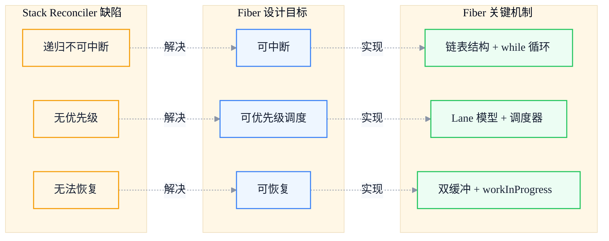
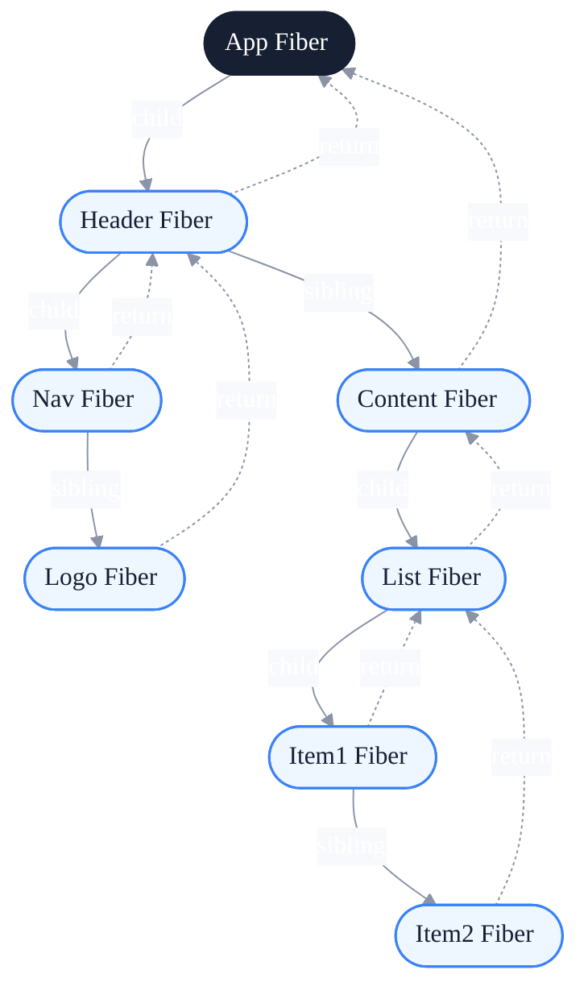
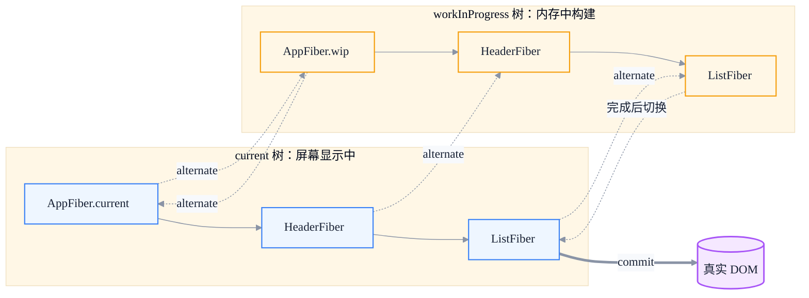
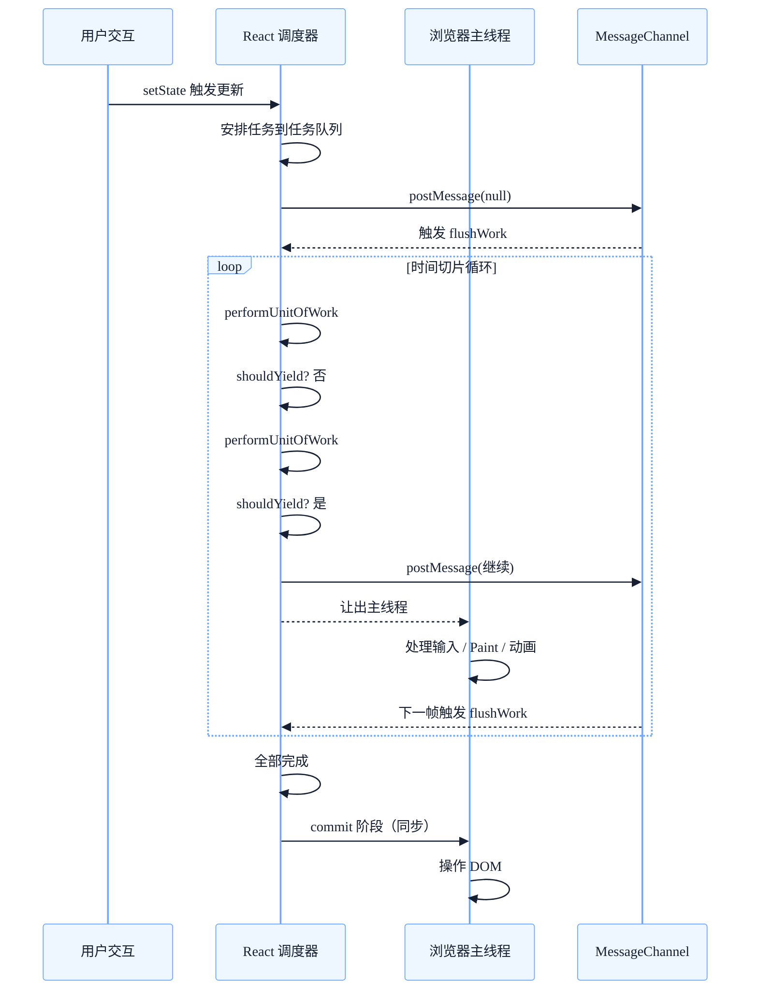
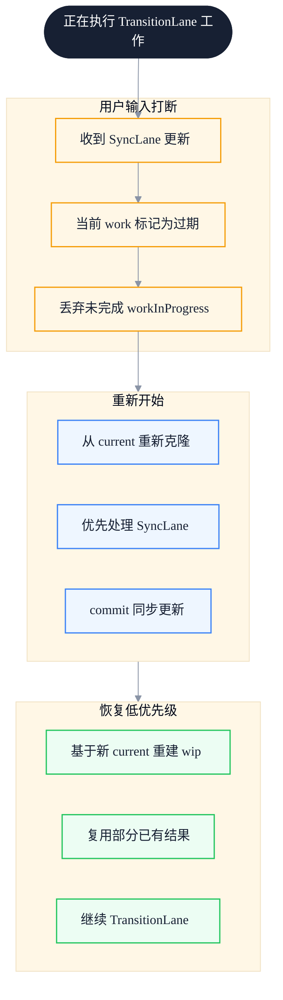
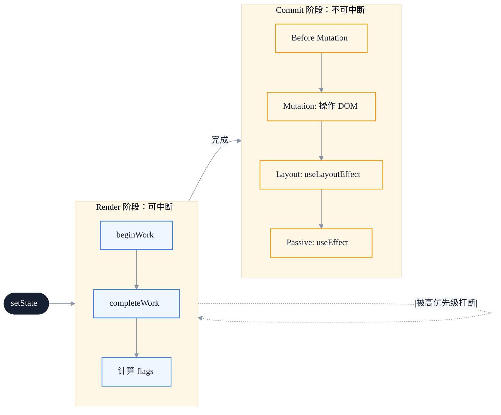

# React Fiber 架构：从栈调度到链式可中断渲染

> 副标题：从栈调度到链式可中断渲染——Fiber 数据结构、双缓冲、时间切片与 Lane 模型
>
> 目标读者：中高级前端工程师、前端架构师、React 深度使用者
>
> 阅读时间：约 28 分钟

::: info 一句话
React Fiber 的本质，是把一棵递归不可中断的组件树，重写成一颗可中断、可恢复、可优先级调度的链表。
:::

## 目录

- [写在前面](#写在前面)
- [一、React 15 Stack Reconciler 的根本问题](#一、react-15-stack-reconciler-的根本问题)
- [二、Fiber 架构的设计动机：可中断、可恢复、可优先级调度](#二、fiber-架构的设计动机-可中断-可恢复-可优先级调度)
- [三、Fiber 节点的数据结构：从树到链表](#三、fiber-节点的数据结构-从树到链表)
- [四、双缓冲技术：current 树与 workInProgress 树](#四、双缓冲技术-current-树与-workinprogress-树)
- [五、时间切片与 MessageChannel：让主线程呼吸](#五、时间切片与-messagechannel-让主线程呼吸)
- [六、Lane 模型：用位运算表达优先级](#六、lane-模型-用位运算表达优先级)
- [七、并发模式的本质：协同式调度而非真并发](#七、并发模式的本质-协同式调度而非真并发)
- [八、从 setState 到 commit：一次完整更新的流转](#八、从-setstate-到-commit-一次完整更新的流转)
- [九、Fiber 带来的工程价值与代价](#九、fiber-带来的工程价值与代价)
- [FAQ](#faq)
- [来源](#来源)

## 写在前面

很多前端工程师对 Fiber 的理解停留在"React 16 引入的新架构"，知道它"使用了时间切片"，但说不清下面这些问题：

- 为什么递归调用栈不可中断？把它改成 `while` 循环不就行了？
- Fiber 节点为什么要拆成"三指针链表"而不是继续用树？
- 双缓冲机制到底为了什么？只为了"复用内存"吗？
- `shouldYield` 到底在让谁？让的是浏览器主线程，还是自己的工作？
- Lane 模型相比 `expirationTime` 到底解决了什么？
- Concurrent Mode 既然 JavaScript 是单线程，那"并发"二字到底在哪里？

本文试图建立一个真正自洽的 Fiber 模型，把这些问题串起来。本文不追求源码逐行解读，而是聚焦设计动机与关键数据结构，让你在阅读完之后，能够自行对照 React 源码理解细节。

::: tip 本文的核心论点

Fiber 不是"性能优化"，而是把 React 从一个**同步递归渲染器**重构成一个**协同式调度系统**。它解决的不是"渲染慢"，而是"渲染卡住了，主线程没办法让出来"。

:::

---

## 一、React 15 Stack Reconciler 的根本问题

React 15 的 Reconciler 叫 **Stack Reconciler**。它的工作方式非常直接：递归遍历组件树，对比前后两棵树，把差异提交到 DOM。

```javascript
// 简化版 Stack Reconciler 工作流程
function reconcileChildren(parentFiber, children) {
  // 递归调用，调用栈深度等于组件树深度
  for (const child of children) {
    reconcileChild(parentFiber, child)
  }
}

function reconcileChild(parentFiber, child) {
  if (Array.isArray(child)) {
    reconcileChildren(parentFiber, child) // 继续递归
  } else {
    // 创建 / 更新 / 删除 fiber
    // 递归处理子节点
    reconcileChildren(parentFiber, child.props.children)
  }
}
```

这套实现简单、直观，但有一个致命问题：**一旦开始，就必须跑完**。

### 1. 递归调用栈不可中断

JavaScript 的执行栈是引擎管理的，开发者无法"暂停"一个正在执行的函数。当 Reconciler 进入 `reconcileChildren`，整棵树的协调过程会一路递归到底。如果这棵树很大，比如几千个节点，这个过程可能耗时 100ms 以上。

在这 100ms 内，主线程被完全占用：

- 用户点击没有响应
- 输入框输入卡顿
- 动画掉帧
- 滚动不流畅

::: warning 关键问题

不是"React 慢"，而是"React 在工作的时候，没办法让出主线程"。

:::

### 2. 单一优先级，无法插队

Stack Reconciler 中，所有更新一视同仁。一个高优先级的用户输入（比如点击按钮）必须排在已经发起的低优先级更新（比如网络请求回来触发的 setState）后面执行。

这就导致了一个反直觉的现象：**用户点击响应慢，是因为前面有一个"不太重要的更新"在跑，跑完才能轮到用户的点击**。

### 3. 调用栈深度等于组件树深度

由于使用递归，组件树越深，调用栈越深。这不仅限制了架构演进，也让错误堆栈变得难以阅读。

::: tip 本节核心结论

Stack Reconciler 的根本问题不是"性能不够"，而是"模型不够"——它没有把"可中断"和"可优先级调度"作为一等公民。Fiber 的设计动机正是补上这两个能力。

:::

---

## 二、Fiber 架构的设计动机：可中断、可恢复、可优先级调度

Fiber 的设计动机可以归结为三个目标，每一个都对应 Stack Reconciler 的一个缺陷：



### 1. 可中断：把递归改成迭代

要让递归可中断，最直接的办法是**把递归改成 while 循环**，并且在循环中检查"是否需要让出主线程"。

但这里有一个关键问题：递归的"上下文"保存在调用栈里，改成 while 循环后，调用栈没了，上下文从哪里来？

答案就是：**自己用对象把上下文存下来**。这个"自己存上下文的对象"，就是 Fiber 节点。

### 2. 可恢复：链表结构 + 节点记上下文

递归函数的"下一步该处理谁"由调用栈决定。改为迭代后，需要每个节点自己记住：

- 我的父节点是谁（处理完我该回到哪里）
- 我的第一个子节点是谁（我应该向下走到哪里）
- 我的下一个兄弟节点是谁（处理完子树后该走到哪里）

这就是 Fiber 节点三个核心指针 `return`、`child`、`sibling` 的由来。

### 3. 可优先级调度：让重要的事情先做

可中断和可恢复只是基础，真正的目标是**优先级调度**。Fiber 设计了一套优先级系统（早期是 `expirationTime`，后来演进为 Lane 模型），让调度器可以：

- 比较两个更新的优先级
- 把低优先级更新"打断"或"延迟"
- 让高优先级更新"插队"

::: tip 本节核心结论

Fiber 的三个目标——可中断、可恢复、可优先级调度——共同决定了它的实现方式：用链表替代树、用对象保存上下文、用调度器决定何时让出主线程。这是一套协同式调度系统，而不是简单的"性能优化"。

:::

---

## 三、Fiber 节点的数据结构：从树到链表

下面是一个简化但内核准确的 Fiber 节点结构（去掉与本文主线无关的字段）：

```javascript
function FiberNode(tag, pendingProps, key) {
  // === 身份与类型 ===
  this.tag = tag              // FunctionComponent / ClassComponent / HostComponent / ...
  this.key = key
  this.type = null            // 对应的函数 / 类 / 字符串如 'div'
  this.pendingProps = pendingProps
  this.memoizedProps = null   // 上次渲染用的 props
  this.memoizedState = null   // hooks 链表 / class 实例状态
  this.stateNode = null       // 对应的 DOM 节点 / 类实例

  // === 三指针：把树改造成链表 ===
  this.return = null          // 父 Fiber
  this.child = null           // 第一个子 Fiber
  this.sibling = null         // 下一个兄弟 Fiber
  this.index = 0              // 在兄弟中的位置

  // === 双缓冲 ===
  this.alternate = null       // 指向另一棵树中对应的 Fiber

  // === 副作用 ===
  this.flags = NoFlags        // Placement / Update / Deletion / ...
  this.subtreeFlags = NoFlags // 子树累积的 flags
  this.deletions = null       // 待删除的子节点

  // === 调度相关 ===
  this.lanes = NoLanes        // 该 Fiber 上的待处理优先级
  this.childLanes = NoLanes   // 子树上的待处理优先级
}
```

### 1. 三指针链表：每个节点只记 3 个邻居

最关键的设计是 `return / child / sibling` 三个指针。它们把一棵树改造成了"可遍历的链表"：



这种结构让遍历可以用一个 `while` 循环完成：

```javascript
function workLoopSync(rootFiber) {
  let nextUnitOfWork = rootFiber
  while (nextUnitOfWork !== null) {
    nextUnitOfWork = performUnitOfWork(nextUnitOfWork)
  }
}

function performUnitOfWork(unitOfWork) {
  // 1. 处理当前节点（执行函数组件、对比 props 等）
  const next = beginWork(unitOfWork)
  if (next !== null) {
    return next // 有子节点，下一步处理子节点
  }
  // 2. 没有子节点，找兄弟节点；兄弟也没有，回溯到父节点
  let node = unitOfWork
  while (node !== null) {
    completeWork(node)
    if (node.sibling !== null) {
      return node.sibling
    }
    node = node.return
  }
  return null // 整棵树遍历完成
}
```

注意 `performUnitOfWork` 的返回值就是"下一个要处理的工作单元"。这就是 Fiber 把递归变成迭代的核心：**下一个工作单元由指针决定，而不是由调用栈决定**。

### 2. 调度单元 = 渲染单元

Fiber 节点不仅是数据载体，也是调度单元。调度器可以决定：

- 现在处理几个 Fiber 节点
- 处理到哪个节点时让出主线程
- 下次回来时从哪个节点继续

::: info 工程启示

每个 Fiber 节点都自带"上下文"，所以 React 才能在任意节点中断、在任意节点恢复。这就是为什么 hooks 必须按顺序调用——hooks 链表保存在 Fiber 的 `memoizedState` 上，顺序错乱就找不回来了。

:::

::: tip 本节核心结论

Fiber 的链表结构不是为了"省内存"，而是为了"可遍历可中断"。三指针把树扁平化成可单步推进的工作流，每一个 Fiber 节点都是一个独立的工作单元。

:::

---

## 四、双缓冲技术：current 树与 workInProgress 树

Fiber 还引入了一个看起来很奇怪的字段：`alternate`。它指向"另一棵树中对应的 Fiber"。

这就是**双缓冲（Double Buffering）**机制。React 同时维护两棵 Fiber 树：

- **current 树**：当前显示在屏幕上的树，每个 Fiber 节点的 `stateNode` 指向真实的 DOM
- **workInProgress 树**：正在内存中构建的下一帧的树



### 1. 为什么要双缓冲？

最直接的好处是 **复用 Fiber 对象**。当一次更新被中断后重新开始，React 可以选择：

- 完全重新构建一棵新树（浪费内存）
- 复用 current 树上的 Fiber 对象，仅更新变化的字段（高效）

通过 `alternate` 指针，React 可以从 current 树"克隆"出 workInProgress 树。如果这个节点已经在之前的尝试中构建过 workInProgress，就直接复用。

```javascript
function createWorkInProgress(current, pendingProps) {
  let workInProgress = current.alternate
  if (workInProgress === null) {
    // 第一次克隆：创建新 Fiber
    workInProgress = createFiber(current.tag, pendingProps, current.key)
    workInProgress.type = current.type
    workInProgress.stateNode = current.stateNode
    // 互相指向
    workInProgress.alternate = current
    current.alternate = workInProgress
  } else {
    // 复用：只更新字段
    workInProgress.pendingProps = pendingProps
    workInProgress.flags = NoFlags
    workInProgress.deletions = null
  }
  workInProgress.lanes = current.lanes
  workInProgress.childLanes = current.childLanes
  workInProgress.memoizedProps = current.memoizedProps
  workInProgress.memoizedState = current.memoizedState
  return workInProgress
}
```

### 2. 双缓冲让中断变得"几乎免费"

假设一次低优先级更新开始了，构建到一半被高优先级任务打断。React 会：

1. 丢弃当前未完成的 workInProgress 树
2. 优先处理高优先级更新，构建一棵新的 workInProgress 树
3. 高优先级更新 commit 后，current 树指向新的 root
4. 低优先级更新重新开始，从新的 current 树克隆

由于克隆是"按需"的，未访问的节点根本不会创建 workInProgress。这让中断和重启的成本被控制在"已工作过的部分"。

### 3. 双缓冲 vs Git 分支

::: tip 类比理解

把 current 树想象成 `main` 分支，workInProgress 树想象成 `feature` 分支。React 在 feature 分支上构建，构建完成（commit）后通过 fast-forward 把 main 指向 feature。下次开始新的更新时，再从新的 main 切出新的 feature。

:::

::: tip 本节核心结论

双缓冲不是为了"内存复用"这么简单，而是为了让"中断—重启"成本可控。`alternate` 字段是双缓冲的物理实现，让 React 可以在两棵树之间快速切换、按需复用节点。

:::

---

## 五、时间切片与 MessageChannel：让主线程呼吸

可中断、可恢复只是数据结构层面的准备，真正"什么时候让出主线程"由 **Scheduler（调度器）** 决定。

### 1. 时间切片：5ms 的工作预算

React 给每一帧的工作设定了一个时间预算，默认是 **5ms**（在 `scheduler` 包中可配置）。Scheduler 会维护一个 `currentTime`，每处理完一个工作单元就检查：

```javascript
function workLoopConcurrent(rootFiber) {
  let nextUnitOfWork = rootFiber
  while (nextUnitOfWork !== null && !shouldYield()) {
    nextUnitOfWork = performUnitOfWork(nextUnitOfWork)
  }
  if (nextUnitOfWork !== null) {
    // 还有工作没做完，让出主线程，等下一个时间片
    scheduleCallback(continueWork, nextUnitOfWork)
  }
}

function shouldYield() {
  const now = getCurrentTime()
  return now >= deadline
  // deadline = frameStart + 5ms
}
```

注意 `shouldYield` 的本质：**问的是"我的 5ms 用完了没"，而不是"主线程有没有别的事要做"**。React 主动让出主线程，给浏览器机会去处理输入事件、Paint、动画等。

### 2. 为什么是 MessageChannel？

React 需要一个"在浏览器空闲时被调用"的机制。可选方案有：

- `setTimeout(cb, 0)`：最小延迟约 1-4ms，且会被 clamp
- `requestAnimationFrame`：在渲染前触发，但只在每一帧渲染前调用一次
- `requestIdleCallback`：浏览器空闲时调用，但兼容性差，且优先级太低
- `MessageChannel`：通过 postMessage 触发，回调在宏任务中执行，延迟最低

```javascript
const channel = new MessageChannel()
const port = channel.port2

channel.port1.onmessage = () => {
  // 在这里执行工作循环
  flushWork()
}

function scheduleCallback() {
  port.postMessage(null)
}
```

React 最终选择了 `MessageChannel`，原因有二：

1. **延迟最低**：postMessage 触发的宏任务几乎在当前事件循环结束后立刻执行，不像 `setTimeout` 有最小延迟
2. **可控**：React 自己决定何时让出、何时继续，而不是依赖浏览器空闲判断

::: warning 常见误区

很多人以为 React 用了 `requestIdleCallback`。实际上 React 团队早期评估过，最终放弃了。原因：兼容性差、调用时机不稳定、优先级不可控。React 自己实现了一套基于时间切片的调度器。

:::

### 3. 时间切片流程



::: tip 本节核心结论

时间切片的本质是"React 自己主动让出主线程"。`MessageChannel` 提供了延迟最低的延迟唤醒机制。`shouldYield` 检查的是工作预算耗尽，让浏览器有机会处理输入、渲染等任务。

:::

---

## 六、Lane 模型：用位运算表达优先级

React 17 之前使用 `expirationTime` 模型：每个更新有一个"过期时间"，越小越紧急。这个模型简单但有问题：

- **难以表达"批量"**：多个不同优先级的更新混在一起，很难快速算出"这批任务的优先级范围"
- **难以"重叠"**：高优先级插队时，低优先级的工作如何与它区分、复用？

React 18 引入了 **Lane 模型**，用 32 位整数中的每一位表示一个优先级：

```javascript
// 简化的 Lane 定义（实际有更多）
export const NoLanes = 0b0000000000000000000000000000000
export const SyncLane = 0b0000000000000000000000000000001  // 同步，最高
export const InputContinuousLane = 0b0000000000000000000000000000010 // 连续输入
export const DefaultLane = 0b0000000000000000000000000000100 // 默认
export const TransitionLane = 0b0000000000000000000000100000000 // transition
export const IdleLane = 0b0010000000000000000000000000000 // 空闲
export const OffscreenLane = 0b1000000000000000000000000000000 // 离屏
```

### 1. 为什么用位运算？

位运算有几个关键优势：

**第一，批量判断用 `&` 即可**：

```javascript
// 判断某个 Fiber 是否有"高优先级任务待处理"
function includesBlockingLane(root, lanes) {
  const blockingLanes = SyncLane | InputContinuousLane | DefaultLane
  return (lanes & blockingLanes) !== NoLanes
}
```

**第二，多优先级可以并存**：

```javascript
// 一个 Fiber 上可以同时有 SyncLane 和 TransitionLane
const lanes = SyncLane | TransitionLane // 0b0000000000000000000000100000001
```

这意味着同一个 Fiber 上"挂着"多个不同优先级的更新，React 可以分别处理。

**第三，分离优先级用 `&` 和 `~`**：

```javascript
// 从 lanes 中去掉 transition 相关的，得到"非 transition"的部分
const nonTransitionLanes = lanes & ~TransitionLanes
```

### 2. Lane 与 batchedUpdates 的关系

React 18 的 Automatic Batching 跟 Lane 模型紧密相关。多个 setState 被合并到同一次更新，本质上是把它们的 lanes 用 `|` 合并：

```javascript
function markRootUpdated(root, updateLane) {
  root.pendingLanes |= updateLane
}
```

调度器拿到 `pendingLanes`，找到其中"最高优先级的 lane"，决定下次任务的优先级。

### 3. 优先级插队

当用户输入触发 `SyncLane` 更新，而当前正在进行 `TransitionLane` 的工作时：



::: tip 本节核心结论

Lane 模型用位运算把优先级表达为"一组可叠加、可分离"的位。这让 React 可以同时处理多个优先级、批量更新、插队与恢复，是 Concurrent Mode 的算术基础。

:::

---

## 七、并发模式的本质：协同式调度而非真并发

很多文章说 React 18 引入了"并发模式"，让人以为 React 变成多线程了。其实没有，JavaScript 仍然是单线程。**"并发"二字在这里不是"并行"**。

### 1. 协同式 vs 抢占式

操作系统的进程调度有两种：

- **抢占式**：内核强行挂起进程，让另一个进程运行
- **协同式**：进程自己主动让出 CPU

JavaScript 单线程，没法被"抢占"——一个函数一旦开始执行就会执行到结束。所以 React 必须自己**主动让出**，这就是"协同式调度"。

### 2. 并发 = 可中断 + 可插队

React 的"并发"实际是：

- 把渲染工作切成多个小任务
- 高优先级任务可以打断低优先级任务
- 低优先级任务在空闲时继续

用户感受到的"并发"，是输入响应、动画、渲染三者不再"互相阻塞"。

### 3. useTransition 与 useDeferredValue

这两个 API 让开发者可以主动把一个更新标记为低优先级：

```jsx
function App() {
  const [isPending, startTransition] = useTransition()
  const [query, setQuery] = useState('')
  const [results, setResults] = useState([])

  function handleChange(e) {
    setQuery(e.target.value) // 高优先级：输入框立刻更新
    startTransition(() => {
      setResults(filter(hugeList, e.target.value)) // 低优先级：列表可以慢一点
    })
  }

  return (
    <>
      <input value={query} onChange={handleChange} />
      {isPending ? 'loading...' : <List items={results} />}
    </>
  )
}
```

`startTransition` 内的 setState 会被打上 `TransitionLane`。用户输入时输入框立刻响应，列表渲染即使很慢也不会卡住输入。

::: warning 关键认知

`useTransition` 不是"性能优化 API"，而是"优先级声明 API"。它告诉 React："这个更新可以晚一点"。如果列表本来就在 5ms 内能渲染完，`useTransition` 不会有任何加速效果。

:::

### 4. Concurrent Mode 不影响 commit 阶段

虽然 render 阶段（reconcile）可中断，但 **commit 阶段不可中断**。commit 阶段包含真实的 DOM 操作、生命周期、useEffect 调度等。一旦开始，必须同步完成。



::: warning 重要规则

不要在 commit 阶段（如 `useLayoutEffect`、`componentDidMount`）里读取未提交的数据或做副作用——它同步执行，会阻塞主线程。

:::

::: tip 本节核心结论

Concurrent Mode 中的"并发"是协同式调度，不是多线程。可中断的只是 render 阶段，commit 阶段仍然同步。`useTransition / useDeferredValue` 是开发者主动声明优先级的入口。

:::

---

## 八、从 setState 到 commit：一次完整更新的流转

把前面所有概念串起来，一次 setState 的完整流程如下：

```mermaid
%%{init: {'theme': 'base', 'themeVariables': { 'fontFamily': 'Inter, PingFang SC, Microsoft YaHei, sans-serif', 'primaryColor': '#EEF6FF', 'primaryTextColor': '#172033', 'primaryBorderColor': '#6EA8FE', 'lineColor': '#8A94A6', 'secondaryColor': '#F7F9FC', 'tertiaryColor': '#FFF7E6'}}}%%
flowchart TB
    A([setState 调用])

    subgraph Schedule[① 调度阶段]
        S1[计算 lane]
        S2[创建 update 对象]
        S3[挂入 updateQueue]
        S4[markRootUpdated<br/>root.pendingLanes |= lane]
        S5[ensureRootIsScheduled]
    end

    subgraph Render[② Render 阶段：可中断]
        R1[prepareFreshStack]
        R2{shouldYield?}
        R3[performUnitOfWork]
        R4[beginWork: 执行组件 / diff]
        R5[completeWork: 收集 flags]
        R1 --> R2
        R2 -->|否| R3 --> R4 --> R5 --> R2
        R2 -->|是| R6[让出主线程]
        R6 -.下一帧.-> R2
    end

    subgraph Commit[③ Commit 阶段：同步]
        C1[Before Mutation]
        C2[Mutation: apply DOM]
        C3[Layout]
        C4[Passive Effects]
    end

    A --> Schedule --> Render --> Commit --> Done([完成])

    classDef schedule fill:#F5E8FF,stroke:#A855F7,color:#172033,stroke-width:1.5px;
    classDef render fill:#EEF6FF,stroke:#3B82F6,color:#172033,stroke-width:1.5px;
    classDef commit fill:#FFF7E6,stroke:#F59E0B,color:#172033,stroke-width:1.5px;
    classDef terminal fill:#172033,color:#fff,stroke:#172033,stroke-width:2px;

    class A,Done terminal;
    class S1,S2,S3,S4,S5 schedule;
    class R1,R2,R3,R4,R5,R6 render;
    class C1,C2,C3,C4 commit;
```

### 1. 调度阶段

setState 不会立刻触发渲染，而是：

1. 根据 setState 的来源（事件、transition、suspense 等）计算 lane
2. 创建一个 update 对象 `{ lane, action, next }`
3. 把 update 挂到对应 Hook / updateQueue 上
4. 把 lane 通过 `|=` 合并到 `root.pendingLanes`
5. 调用 `ensureRootIsScheduled`：如果还没有任务在跑，就 `scheduleCallback`

### 2. Render 阶段

调度器在合适时机调用 workLoop：

1. 从 root 开始，prepareFreshStack 重置工作单元
2. 循环执行 `performUnitOfWork`，处理当前节点
3. 每次循环检查 `shouldYield`，超时则让出主线程
4. 完成后整棵 workInProgress 树的 flags 都准备好了

### 3. Commit 阶段

Render 完成后进入 commit，**同步执行**：

1. **Before Mutation**：getSnapshotBeforeUpdate 等
2. **Mutation**：根据 flags 操作 DOM（插入、删除、更新）
3. **Layout**：useLayoutEffect / componentDidMount / componentDidUpdate
4. **Passive Effects**：useEffect 异步调度

### 4. 切换 current

commit 完成后，`root.current` 指向新的 workInProgress.root，下次更新开始时，这棵树就成了新的 current。

::: tip 本节核心结论

一次更新的完整链路是"调度 → Render（可中断）→ Commit（同步）→ 切换 current"。理解每个阶段做什么、能否被打断，是阅读 React 源码的导航地图。

:::

---

## 九、Fiber 带来的工程价值与代价

### 1. 工程价值

- **可中断渲染**：长任务被切分，主线程不再被独占
- **优先级调度**：用户输入优先于数据更新，体验质变
- **Suspense**：渲染可以"等待"，配合异步数据流更自然
- **Streaming SSR**：服务端流式 HTML，结合 `lazy` 实现按需加载
- **Server Components**：Fiber 的优先级模型是 RSC 的基础之一

### 2. 代价

- **心智复杂度**：从"渲染一次"变成"可能渲染多次，部分会被丢弃"
- **render 阶段不能有副作用**：因为 render 可能被中断重做，副作用会出现重复执行
- **内存占用**：双缓冲 + 链表结构比递归调用栈占用更多堆内存
- **Hooks 规则**：必须按顺序调用，因为 hooks 链表保存在 Fiber 上

::: warning 易踩的坑

在 render 阶段读取 ref 并修改、调用没有 cleanup 的副作用、在并发模式下读取"脏"状态——这些都是 Fiber 引入后才暴露的"陷阱"。Concurrent Mode 下，render 函数可能被调用多次，必须保持纯净。

:::

### 3. Fiber 与"React 是声明式框架"的张力

React 一直宣称自己是声明式 UI 框架。但 Concurrent Mode 引入后，开发者必须关心"渲染可能被打断重做"这个非声明式的事实。这是 React 设计哲学中一个真实的张力，并没有完美解决。

::: tip 本节核心结论

Fiber 是 React 走向"调度系统"的关键一步。它带来了优先级、可中断、Suspense、RSC 等能力，但也要求开发者把 render 函数写得更加纯净，并接受一定的概念复杂度。

:::

---

## FAQ

### 1. 为什么 React 不直接用 `requestIdleCallback`？

`requestIdleCallback` 有几个问题：浏览器兼容性差；调用时机不稳定（只有在浏览器完全空闲时才回调）；优先级不可控；在帧繁忙时可能根本不触发。React 团队需要一个"自己说了算"的调度机制，所以基于 `MessageChannel` 自己实现了基于时间切片的调度器。

### 2. Fiber 节点的链表结构真的比递归调用栈"省"吗？

不是"省"，是"可控"。递归调用栈由引擎管理，开发者无法暂停；链表结构由 React 自己管理，可以在任意节点中断、任意节点恢复。代价是堆内存占用变高，但换来了可调度性。

### 3. `useTransition` 和 `setTimeout(fn, 0)` 有什么区别？

`setTimeout` 把回调推迟到下一个宏任务，本质上还是同步执行该回调里的所有 setState。`useTransition` 是把 setState 标记为低优先级，让 React 在调度层面"延后处理"，并且可以被打断、被插队。前者是"延迟调用"，后者是"优先级声明"，模型完全不同。

### 4. 为什么 commit 阶段不能中断？

commit 阶段操作的是真实 DOM，半途中断会让 UI 处于不一致状态（比如一部分节点已删除，另一部分还没更新）。而且 commit 阶段通常耗时很短（毫秒级），中断的收益不大。所以 React 设计上把 commit 阶段做成同步、不可中断。

### 5. Lane 模型相比 expirationTime 的本质优势是什么？

expirationTime 是单一数值，难以表达"多个优先级并存"和"批量分离"。Lane 用位运算把多个优先级压在一个 32 位整数里，可以用 `|` 合并、用 `&` 检查、用 `& ~` 分离。这让 React 在面对复杂优先级组合时（比如同时有 sync、transition、suspense）能够快速决策。

### 6. Concurrent Mode 下 render 函数会执行多次，如何避免性能问题？

保持 render 函数纯净：不要在 render 中做副作用、不要读取可变的全局状态、复杂计算用 `useMemo` 缓存。如果副作用不可避免，放到 `useEffect` 或 `useLayoutEffect` 中——它们在 commit 阶段执行，不会被重复调用。

---

## 来源

1. React 官方文档 - Concurrent Features：<https://react.dev/blog/2021/06/08/the-plan-for-react-18>
2. React 官方文档 - Scheduling in React：<https://react.dev/reference/react/useTransition>
3. Andrew Clark - React Fiber Architecture（社区经典笔记）：<https://github.com/acdlite/react-fiber-architecture>
4. Sebastian Markbåge - React Basic（Fiber 设计动机）：<https://github.com/reactjs/react-basic>
5. React 源码（packages/react-reconciler / packages/scheduler）：<https://github.com/facebook/react>

本文同时基于作者对 React 源码的实践阅读与整理总结。
