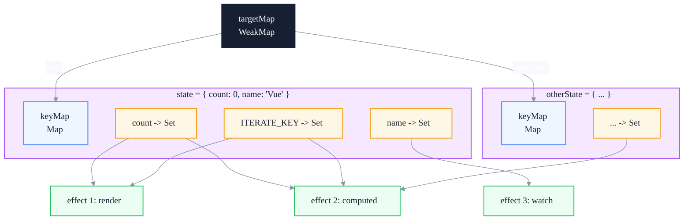
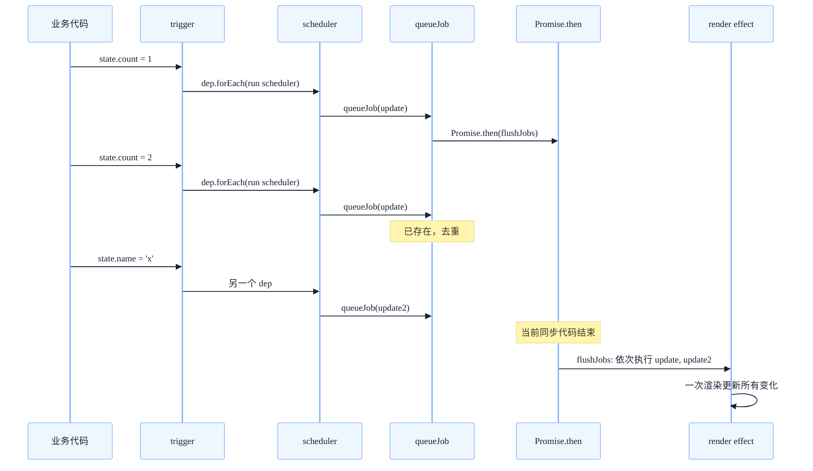

# Vue 3 响应式系统：Proxy 与依赖收集的完整实现

> 副标题：从 Object.defineProperty 到 Proxy——reactive / ref / computed / effect 的依赖收集机制
>
> 目标读者：中高级前端工程师、Vue 深度使用者、响应式系统设计感兴趣者
>
> 阅读时间：约 26 分钟

::: info 一句话
Vue 3 响应式系统的本质，是用 Proxy 拦截读写、用 WeakMap 三层结构记录"谁依赖了什么"，从而在数据变化时精确地通知到每一个 effect。
:::

## 目录

- [写在前面](#写在前面)
- [一、Vue 2 Object.defineProperty 的根本局限](#一、vue-2-object-definedproperty-的根本局限)
- [二、Proxy 与 Reflect：响应式的物理基础](#二、proxy-与-reflect-响应式的物理基础)
- [三、reactive / ref / computed 的实现原理](#三-reactive-ref-computed-的实现原理)
- [四、依赖收集（track）与触发更新（trigger）](#四-依赖收集-track-与触发更新-trigger)
- [五、effect 与调度器：副作用的执行入口](#五-effect-与调度器-副作用的执行入口)
- [六、与 React 响应式模型的对比](#六-与-react-响应式模型的对比)
- [七、几个容易踩坑的细节](#七-几个容易踩坑的细节)
- [FAQ](#faq)
- [来源](#来源)

## 写在前面

很多前端工程师对"响应式"的理解停留在"数据变了视图自动更新"，但说不清下面这些问题：

- 为什么 Vue 2 监听不到对象属性的新增和删除？
- 为什么 Vue 3 改用 Proxy 后，性能就提升了？提升在哪里？
- `reactive` 和 `ref` 到底有什么区别？为什么不统一成一种？
- 依赖收集的"依赖"具体是什么？保存在哪里？
- `effect` 和 `watch`、`computed` 是什么关系？
- 为什么 `reactive` 解构后会失去响应性，而 `ref` 不会？
- Vue 的响应式和 React 的状态更新机制，本质区别在哪里？

本文试图建立一个完整自洽的 Vue 3 响应式心智模型。本文不追求源码逐行解读，而是聚焦核心数据结构和设计动机——读完之后，你应该能够自行对照 `@vue/reactivity` 源码理解细节。

::: tip 本文的核心论点

Vue 3 响应式系统是一个"精确依赖追踪 + 推送式更新"的系统。它通过 Proxy 拦截读写，通过三层 WeakMap 结构维护"目标 → 键 → 副作用集合"的映射，在数据变化时直接推送通知给相关 effect。这是与 React"组件级 pull 渲染"模型最根本的差异。

:::

---

## 一、Vue 2 Object.defineProperty 的根本局限

Vue 2 的响应式基于 `Object.defineProperty`：

```javascript
function defineReactive(obj, key, val) {
  let dep = new Dep() // 每个 key 一个 Dep
  Object.defineProperty(obj, key, {
    enumerable: true,
    configurable: true,
    get() {
      dep.depend() // 收集当前 Watcher
      return val
    },
    set(newVal) {
      if (newVal === val) return
      val = newVal
      observe(newVal) // 新值也要响应式
      dep.notify() // 通知所有 Watcher
    },
  })
}

function observe(obj) {
  if (typeof obj !== 'object' || obj === null) return
  Object.keys(obj).forEach((key) => {
    defineReactive(obj, key, obj[key])
  })
}
```

这套实现能用，但有四个根本性局限。

### 1. 监听不到属性的新增和删除

`defineProperty` 只能拦截已存在的属性。如果开发者在响应式对象上 `obj.newKey = 1`，Vue 2 监听不到，必须用 `Vue.set(obj, 'newKey', 1)`。这是一个经常被诟病的 API 体验问题。

### 2. 数组监听需要 hack

`defineProperty` 无法监听数组下标赋值（`arr[0] = x`）和 `length` 变化。Vue 2 的解决方案是：重写数组的 7 个变异方法（push / pop / shift / unshift / splice / sort / reverse），在这些方法里手动触发通知。

```javascript
const methodsToPatch = ['push', 'pop', 'shift', 'unshift', 'splice', 'sort', 'reverse']
methodsToPatch.forEach((method) => {
  const original = arrayProto[method]
  arrayMethods[method] = function (...args) {
    const result = original.apply(this, args)
    const ob = this.__ob__
    // push/unshift/splice 新增的元素也要响应式
    let inserted
    switch (method) {
      case 'push':
      case 'unshift':
        inserted = args
        break
      case 'splice':
        inserted = args.slice(2)
        break
    }
    if (inserted) ob.observeArray(inserted)
    ob.dep.notify()
    return result
  }
})
```

### 3. 初始化时递归遍历，深度监听性能差

`observe` 在初始化时会递归遍历整个对象，给每个 key 都装上 getter/setter。对于大型对象，初始化成本很高，而且很多深层属性一辈子都不会被读取。

### 4. 无法监听 Map / Set / WeakMap

`defineProperty` 是为普通对象设计的，对 `Map`、`Set` 这类集合类型无能为力。Vue 2 中只能把它们当作非响应式数据。

::: tip 本节核心结论

Vue 2 的响应式局限不是"实现得不好"，而是 `Object.defineProperty` 这个 API 本身的限制。它只能拦截"已存在的属性"的读写，且无法覆盖数组和集合类型。所有这些问题的根本解决方案是换一个更强的拦截机制——Proxy。

:::

---

## 二、Proxy 与 Reflect：响应式的物理基础

Vue 3 改用 `Proxy`。Proxy 可以拦截 13 种操作（包括 get / set / has / deleteProperty / ownKeys 等），覆盖了 Vue 2 所有的"监听不到"场景。

### 1. Proxy 解决了什么

```javascript
const handler = {
  get(target, key, receiver) {
    track(target, key) // 收集依赖
    const result = Reflect.get(target, key, receiver)
    if (typeof result === 'object' && result !== null) {
      return reactive(result) // 惰性响应式
    }
    return result
  },
  set(target, key, value, receiver) {
    const result = Reflect.set(target, key, value, receiver)
    trigger(target, key) // 触发更新
    return result
  },
  deleteProperty(target, key) {
    const result = Reflect.deleteProperty(target, key)
    trigger(target, key)
    return result
  },
  has(target, key) {
    track(target, key) // 'in' 操作也要收集
    return Reflect.has(target, key)
  },
  ownKeys(target) {
    track(target, ITERATE_KEY) // Object.keys 也要收集
    return Reflect.ownKeys(target)
  },
}

function reactive(target) {
  return new Proxy(target, handler)
}
```

对比 Vue 2 的局限：

| 局限 | Vue 2 | Vue 3 |
|------|-------|-------|
| 属性新增 | `Vue.set` | 直接 `obj.newKey = 1` 自动监听 |
| 属性删除 | `Vue.delete` | 直接 `delete obj.key` 自动监听 |
| 数组下标 | 监听不到 | `arr[0] = x` 自动监听 |
| `length` 变化 | 监听不到 | 自动监听 |
| Map / Set | 不支持 | 原生支持 |
| 初始化成本 | 递归遍历 | 惰性（用到才代理） |

### 2. 为什么用 Reflect

`Reflect.get` / `Reflect.set` 的第三个参数 `receiver` 解决了一个微妙的问题：当对象有继承关系时，正确的 `this` 应该指向代理对象而不是原始对象。

```javascript
const obj = { _value: 0, get value() { return this._value } }
const proxy = new Proxy(obj, {
  get(target, key, receiver) {
    // 如果不传 receiver，this 指向原始 obj，obj._value 不是响应式的
    // 传 receiver，this 指向 proxy，proxy._value 触发响应式
    return Reflect.get(target, key, receiver)
  },
})
```

::: warning 常见误区

很多人写 Proxy 时直接 `return target[key]`。这样写对于带 getter 的对象会丢失响应式（因为 `this` 不对）。必须用 `Reflect.get(target, key, receiver)`。

:::

### 3. 惰性响应式：性能优势的真正来源

Vue 3 的 `reactive` 不会在初始化时递归遍历。它只在 `get` 时返回子对象的代理：

```javascript
get(target, key, receiver) {
  const result = Reflect.get(target, key, receiver)
  if (typeof result === 'object' && result !== null) {
    return reactive(result) // 用到才代理
  }
  return result
}
```

并且 `reactive` 内部有缓存：

```javascript
const reactiveMap = new WeakMap()
function reactive(target) {
  if (reactiveMap.has(target)) {
    return reactiveMap.get(target) // 同一对象只代理一次
  }
  const proxy = new Proxy(target, handler)
  reactiveMap.set(target, proxy)
  return proxy
}
```

这意味着 Vue 3 的初始化成本是 O(1)，而不是 Vue 2 的 O(n)。深层属性只有在被读取时才进入响应式系统——这是 Vue 3 性能优势的真正来源。

::: tip 本节核心结论

Proxy 是 Vue 3 响应式的物理基础。它解决了 Vue 2 监听不到新增/删除/数组/集合的问题，并通过"惰性代理 + WeakMap 缓存"把初始化成本从 O(n) 降到 O(1)。

:::

---

## 三、reactive / ref / computed 的实现原理

Vue 3 暴露了三种主要的响应式 API：`reactive`、`ref`、`computed`。它们对应不同的使用场景，背后是同一套依赖收集机制的不同封装。

### 1. reactive：对象的代理

`reactive` 用于对象（包括数组、Map、Set）。它的实现就是上面看到的 Proxy + handler。一个简化的完整实现：

```javascript
const reactiveMap = new WeakMap()

function reactive(target) {
  if (!isObject(target)) return target
  if (isReadonly(target)) return target
  if (reactiveMap.has(target)) {
    return reactiveMap.get(target)
  }
  const proxy = new Proxy(target, mutableHandlers)
  reactiveMap.set(target, proxy)
  return proxy
}
```

注意：`reactive` 只对对象类型有意义。原始值（string、number、boolean）无法被 Proxy 直接代理——这就是为什么需要 `ref`。

### 2. ref：原始值的"包装"

JavaScript 的原始值（string、number、boolean、symbol、bigint、null、undefined）不能被 Proxy 直接拦截。Vue 3 的解决方案是用一个对象把它们包起来：

```javascript
class RefImpl {
  constructor(value) {
    this._rawValue = value
    this._value = isObject(value) ? reactive(value) : value
    this.dep = new Dep() // 自己的依赖集合
  }

  get value() {
    trackRefValue(this) // 读取时收集
    return this._value
  }

  set value(newVal) {
    if (newVal !== this._rawValue) {
      this._rawValue = newVal
      this._value = isObject(newVal) ? reactive(newVal) : newVal
      triggerRefValue(this) // 写入时触发
    }
  }
}

function ref(value) {
  return new RefImpl(value)
}
```

::: info 工程启示

`ref` 的本质是"用一个对象的 `.value` 属性来持有原始值"。这样就能用对象的 get/set 拦截来追踪原始值的变化。`ref.value` 的语法不是设计偏好，而是 JavaScript 语言限制下的必然选择。

:::

`ref` 也可以持有对象，这时 `_value` 会是 `reactive(value)` 的结果。这就是为什么 `ref({ count: 0 })` 既能整体替换（`ref.value = { count: 1 }`），又能直接修改内部（`ref.value.count++`）。

### 3. computed：缓存的衍生状态

`computed` 在 effect 之上再加一层缓存：

```javascript
class ComputedRefImpl {
  constructor(getter, setter) {
    this._value = undefined
    this._dirty = true // 是否需要重新计算
    this.dep = new Dep()

    this.effect = new ReactiveEffect(getter, () => {
      // scheduler：当依赖变化时，不立即重算，只标记 dirty
      if (!this._dirty) {
        this._dirty = true
        triggerRefValue(this) // 通知 computed 的订阅者
      }
    })
  }

  get value() {
    trackRefValue(this)
    if (this._dirty) {
      this._dirty = false
      // 运行 effect：会重新收集依赖
      this._value = this.effect.run()
    }
    return this._value
  }

  set value(newVal) {
    if (this.setter) this.setter(newVal)
  }
}

function computed(getter, setter) {
  return new ComputedRefImpl(getter, setter)
}
```

computed 的关键设计：

1. **lazy**：构造时不计算，只有被读取时才计算
2. **缓存**：`_dirty = false` 时直接返回旧值
3. **自动失效**：依赖变化时通过 scheduler 把 `_dirty` 标记为 true，但不立即重算
4. **链式订阅**：computed 自己也可以被其他 effect 依赖，形成依赖链

::: tip 本节核心结论

`reactive` 是对象代理，`ref` 是原始值包装，`computed` 是带缓存的衍生状态。三者背后是同一套 track/trigger 机制的不同封装。理解这一点，就理解了 Vue 3 响应式 API 的设计统一性。

:::

---

## 四、依赖收集（track）与触发更新（trigger）

依赖收集是 Vue 3 响应式系统的核心。它要回答的问题是："当某个 key 变化时，需要通知谁？"

### 1. 三层 WeakMap 结构

Vue 3 用三层结构存储依赖关系：

```javascript
// 全局依赖映射
const targetMap = new WeakMap()
// targetMap: target -> keyMap
// keyMap:    key   -> depSet
// depSet:    effect 集合

function track(target, key) {
  if (!activeEffect) return

  let keyMap = targetMap.get(target)
  if (!keyMap) {
    keyMap = new Map()
    targetMap.set(target, keyMap)
  }

  let depSet = keyMap.get(key)
  if (!depSet) {
    depSet = new Set()
    keyMap.set(key, depSet)
  }

  depSet.add(activeEffect)
  activeEffect.deps.push(depSet) // 反向引用，方便清理
}

function trigger(target, key) {
  const keyMap = targetMap.get(target)
  if (!keyMap) return

  const depSet = keyMap.get(key)
  if (!depSet) return

  // 复制一份再遍历，避免在迭代过程中修改集合
  const effectsToRun = new Set(depSet)
  effectsToRun.forEach((effect) => {
    // 避免 effect 内部又触发自己（死循环）
    if (effect !== activeEffect) {
      effect.run()
    }
  })
}
```

用图表示这个结构：



### 2. 为什么用 WeakMap

最外层用 `WeakMap` 而不是 `Map`，是因为：**当响应式对象本身被销毁、没有其他引用时，WeakMap 中对应的条目会被自动 GC**。如果用 `Map`，会持有 target 的强引用，导致 target 永远无法被回收——内存泄漏。

::: info 设计细节

第二层用 `Map`（key 是字符串或 symbol），第三层用 `Set`（effect 集合）。这两层不会泄漏，因为它们的生命周期跟随 target。

:::

### 3. activeEffect：当前正在执行的副作用

依赖收集的关键问题是："track 时把谁加进去？"。Vue 3 维护一个全局变量 `activeEffect`，指向"当前正在执行的 effect"：

```javascript
let activeEffect = null

class ReactiveEffect {
  constructor(fn, scheduler) {
    this.fn = fn
    this.scheduler = scheduler
    this.deps = [] // 反向引用，用于清理
  }

  run() {
    const prevEffect = activeEffect
    activeEffect = this
    try {
      return this.fn() // fn 内部读响应式数据时，track 会把 this 加入集合
    } finally {
      activeEffect = prevEffect
    }
  }
}
```

所以"依赖收集"的真正含义是：**当一个 effect 正在运行时，它读取了哪些响应式数据，就把自己注册到这些数据的"订阅者集合"里**。

### 4. 嵌套 effect 与 effectScope

effect 可以嵌套（比如组件渲染过程中触发了 computed）。Vue 3 用栈来管理：

```javascript
function run() {
  const prevEffect = activeEffect
  activeEffect = this
  try {
    return this.fn()
  } finally {
    activeEffect = prevEffect // 恢复外层 effect
  }
}
```

外层 effect 在内层 effect 跑完后会继续作为 `activeEffect`，内层 effect 读取的数据不会被外层收集——这是正确的行为。

::: tip 本节核心结论

依赖收集用 `WeakMap(target) -> Map(key) -> Set(effect)` 三层结构存储。track 时把"当前正在运行的 effect"加入对应集合，trigger 时取出该集合并逐个执行。这是 Vue 响应式系统的"骨架"。

:::

---

## 五、effect 与调度器：副作用的执行入口

`effect` 是响应式系统中最底层的概念。`watch`、`computed`、组件渲染函数，本质上都是 effect。

### 1. effect 的基本结构

```javascript
function effect(fn, options = {}) {
  const _effect = new ReactiveEffect(fn, options.scheduler)
  if (!options.lazy) {
    _effect.run() // 立即执行一次，建立依赖
  }
  return _effect
}
```

调用 `effect(fn)` 后：

1. 立即执行一次 `fn`，期间读取的响应式数据都会把 `_effect` 加入订阅者集合
2. 之后任何依赖变化，都会调用 `_effect.run()`，重新执行 `fn`
3. 重新执行时再次读取数据，依赖关系会被刷新（旧依赖可能被清理）

### 2. 调度器（scheduler）：控制副作用的执行时机

如果不指定 scheduler，trigger 时直接调用 `effect.run()`。但很多场景下，我们不希望立即执行：

- 组件渲染：希望批量到下一个微任务再执行（避免同步多次重渲染）
- computed：希望延迟到下次被读取时再计算
- watch：希望异步执行回调

scheduler 就是这个控制点：

```javascript
const _effect = new ReactiveEffect(fn, (/* args */) => {
  // 当依赖变化时，不调用 fn，而是调用 scheduler
  // 由 scheduler 决定何时、以何种方式调用 fn
})
```

Vue 的组件渲染 effect 就是用 scheduler 实现异步批量更新：

```javascript
function setupRenderEffect(instance, container) {
  const update = () => {
    const subTree = instance.render.call(instance.proxy)
    patch(instance.subTree, subTree, container)
    instance.subTree = subTree
  }

  const effect = new ReactiveEffect(update, () => {
    // scheduler：把更新推入队列，下个 tick 统一 flush
    queueJob(update)
  })

  effect.run() // 首次渲染
}
```

### 3. nextTick 与批量更新

Vue 的更新是异步的：同一个 tick 内的多次 setState 会被合并到一次重渲染。这个机制的核心是 `queueJob`：

```javascript
const queue = []
let isFlushing = false
const resolvedPromise = Promise.resolve()

function queueJob(job) {
  if (!queue.includes(job)) {
    queue.push(job)
    if (!isFlushing) {
      isFlushing = true
      resolvedPromise.then(flushJobs)
    }
  }
}

function flushJobs() {
  try {
    for (let i = 0; i < queue.length; i++) {
      queue[i]()
    }
  } finally {
    queue.length = 0
    isFlushing = false
  }
}

export function nextTick(cb) {
  return resolvedPromise.then(cb || (() => {}))
}
```

执行流程：



::: info 工程启示

Vue 的批量更新不是基于"事件循环"，而是基于"微任务队列"。所以 `nextTick` 也是用 `Promise.then` 实现。这一点跟 React 18 的 Automatic Batching 不同——React 的批量是基于 Lane 模型 + 调度器，覆盖范围更广（包括异步回调里的 setState）。

:::

### 4. effect、computed、watch 的关系

三者本质上都是 effect：

| API | 内部实现 | scheduler 行为 |
|-----|---------|---------------|
| `effect(fn)` | 直接创建 ReactiveEffect | 默认同步执行 |
| `computed(fn)` | 创建带 dirty 标记的 effect | 仅标记 dirty，不立即重算 |
| `watch(source, cb)` | 创建带 cb 回调的 effect | 异步执行 cb |
| 渲染 effect | 创建组件的渲染副作用 | queueJob 异步批量 |

::: tip 本节核心结论

`effect` 是 Vue 响应式的底层抽象，`computed`、`watch`、组件渲染都是 effect 的不同变体。scheduler 是控制"何时执行副作用"的关键钩子，让 Vue 可以把同步触发转为异步批量更新。

:::

---

## 六、与 React 响应式模型的对比

Vue 的响应式系统和 React 的状态更新机制是两种完全不同的模型。理解这种差异，有助于在中高级项目中做正确选型。

### 1. Push vs Pull

```mermaid
%%{init: {'theme': 'base', 'themeVariables': { 'fontFamily': 'Inter, PingFang SC, Microsoft YaHei, sans-serif', 'primaryColor': '#EEF6FF', 'primaryTextColor': '#172033', 'primaryBorderColor': '#6EA8FE', 'lineColor': '#8A94A6', 'secondaryColor': '#F7F9FC', 'tertiaryColor': '#FFF7E6'}}}%%
flowchart TB
    subgraph Vue["Vue：Push 模型"]
        V1["state.count = 1"]
        V2["setter 拦截"]
        V3["trigger: 找到该 key 的 dep"]
        V4[执行订阅的 effect]
        V5[只更新受影响的组件]

        V1 --> V2 --> V3 --> V4 --> V5
    end

    subgraph React["React：Pull 模型"]
        R1["setState(1)"]
        R2["标记组件 dirty"]
        R3[调度器安排任务]
        R4[重新渲染整个组件]
        R5[Virtual DOM diff]
        R6[提交真实 DOM 更新]

        R1 --> R2 --> R3 --> R4 --> R5 --> R6
    end

    classDef vue fill:#ECFDF3,stroke:#22C55E,color:#172033,stroke-width:1.5px;
    classDef react fill:#EEF6FF,stroke:#3B82F6,color:#172033,stroke-width:1.5px;

    class V1,V2,V3,V4,V5 vue;
    class R1,R2,R3,R4,R5,R6 react;
```



**Vue（Push）**：数据变化时，立即通过 setter 找到订阅者并通知。更新是"精确的"——只有依赖了该数据的 effect 会被执行。

**React（Pull）**：setState 只是把组件标记为"需要更新"，真正的渲染发生在调度器决定执行时。React 不知道"哪些数据变了"，只能重新运行整个组件函数，再通过 Virtual DOM diff 找出真实变化。

### 2. 不可变 vs 可变

```javascript
// React：不可变，每次返回新对象
const [user, setUser] = useState({ name: 'A', age: 18 })
setUser({ ...user, age: 19 }) // 必须创建新对象

// Vue：可变，直接修改
const user = reactive({ name: 'A', age: 18 })
user.age = 19 // 直接修改
```

React 的不可变模型是为了让"对象引用变化"成为"数据变化"的信号——因为 React 没有拦截写入的能力。Vue 通过 Proxy 拦截，所以可以可变。

### 3. 组件级 vs 字段级

- React：状态变化触发**整个组件重新渲染**，再通过 diff 决定哪些 DOM 要更新
- Vue：状态变化触发**特定 effect**（可能是渲染 effect，可能是 watch，可能是 computed）

这就是为什么 Vue 在大量细粒度更新场景下性能优秀——它不需要重新运行整个组件，只需触发对应的 effect。

### 4. 依赖追踪：手动 vs 自动

```javascript
// React：手动声明依赖
useEffect(() => {
  console.log(count, name)
}, [count, name]) // 必须写依赖数组

// Vue：自动追踪
watchEffect(() => {
  console.log(count.value, name.value) // 自动收集
})
```

Vue 的自动追踪依赖来自 track 机制——effect 运行时读取的数据，自动成为依赖。React 的 `useEffect` 没有响应式系统支持，必须手动写依赖数组，这是 React Hooks 心智负担的一个重要来源。

::: warning 取舍

Vue 的自动追踪不是"绝对更好"。它的代价是：

- 必须显式访问响应式数据（`.value`、`reactive` 包装）才能被追踪
- 解构 reactive 对象会失去响应性
- 异步代码中的读取不会被追踪（因为 activeEffect 已经出栈）

React 的手动依赖数组虽然繁琐，但语义更明确，也更容易静态分析。

:::

::: tip 本节核心结论

Vue 是"精确依赖追踪 + 推送"模型，React 是"组件标记 dirty + 拉取重渲染"模型。两者没有绝对优劣，是不同设计哲学下的取舍：Vue 用 Proxy 换来了细粒度更新和自动依赖追踪，React 用不可变和手动依赖换来了更明确的语义和更易静态分析的代码。

:::

---

## 七、几个容易踩坑的细节

### 1. reactive 解构会失去响应性

```javascript
const state = reactive({ count: 0 })
const { count } = state // 解构后 count 是普通数字
// 后续 state.count 变化，count 不会更新
```

原因：解构时执行了 `Reflect.get`，返回的是原始值，不再受 Proxy 拦截。

解决：用 `toRefs` 把每个属性变成 ref：

```javascript
const state = reactive({ count: 0 })
const { count } = toRefs(state)
count.value // 是响应式的
```

### 2. ref 在 template 中自动解包，在 JS 中不会

```html
<template>
  <div>{{ count }}</div> <!-- 自动解包，不需要 .value -->
</template>

<script setup>
const count = ref(0)
console.log(count) // RefImpl 对象
count.value = 1    // JS 中必须 .value
</script>
```

这是因为 Vue 的模板编译器对顶层 ref 做了自动解包的代理。

### 3. reactive 替换整个对象不会触发更新

```javascript
const state = reactive({ count: 0 })
state = reactive({ count: 1 }) // ❌ 错误：state 是 const，且替换引用不会更新视图
```

正确做法：

```javascript
const state = ref({ count: 0 })
state.value = { count: 1 } // ✅ 替换 value，触发更新

// 或
const state = reactive({ count: 0 })
Object.assign(state, { count: 1 }) // ✅ 逐属性赋值
```

### 4. 异步代码中的依赖收集失效

```javascript
watchEffect(async () => {
  const data = await fetchData() // await 之后 activeEffect 已经被清空
  console.log(state.count) // ❌ 不会被收集为依赖
})
```

原因：`await` 之后 effect 已经退出，`activeEffect` 恢复成之前的值（通常是 null）。所以 `state.count` 的读取不会触发 track。

解决：把响应式读取放在 await 之前：

```javascript
watchEffect(async () => {
  const count = state.count // ✅ 在 await 之前读取
  const data = await fetchData()
  console.log(count)
})
```

### 5. computed 的副作用陷阱

```javascript
const double = computed(() => {
  console.log('computing') // ❌ 不要在 computed 中做副作用
  return state.count * 2
})
```

computed 应该是纯函数。`scheduler` 机制下，computed 可能在不可预期的时机被重新计算（每次依赖变化都标记 dirty，下次读取才计算），副作用会出现"重复执行"或"时序错乱"。

::: tip 本节核心结论

Vue 响应式的常见坑都来自"Proxy 拦截的边界"：解构失去响应性、ref 解包的差异化行为、对象替换、异步代码、computed 副作用。理解这些坑的本质，是"会用 Vue"和"精通 Vue"的分水岭。

:::

---

## FAQ

### 1. 为什么 Vue 3 不用 Proxy 直接代理原始值？

Proxy 的 target 必须是对象，无法代理 string/number/boolean。所以 Vue 3 用 `ref` 把原始值包在对象的 `.value` 属性里，借助对象的 get/set 拦截来实现响应式。这是 JavaScript 语言限制，不是设计偏好。

### 2. `ref` 和 `reactive` 应该选哪个？

简单原则：原始值用 `ref`，对象用 `reactive`。但实际上 `ref` 也能持有对象（内部会调用 `reactive`）。如果你想要"整体可替换"语义（`state.value = newObj`），用 `ref`；如果想要"按属性修改"语义（`state.count++`），用 `reactive`。组合使用也是常见做法：`const state = ref(reactive({ ... }))`。

### 3. Vue 3 响应式比 React 快吗？

不能简单比较。Vue 在"细粒度更新"场景下有优势（只触发相关 effect，不需要 diff 整个组件）；React 在"大型组件树 + 大量状态"场景下也有优势（Virtual DOM diff 比 Vue 的依赖追踪更省内存）。两者性能差异更多体现在不同使用模式上，不能脱离场景下结论。

### 4. 为什么 `watch` 默认是异步的，而 `watchEffect` 也是异步的？

它们都用 scheduler 把回调推入队列，在下一个 tick 执行。这样可以让同一 tick 内的多次状态变化合并为一次回调执行。如果需要同步执行，可以用 `flush: 'sync'` 选项。

### 5. Proxy 性能真的比 defineProperty 好吗？

初始化性能更好（Vue 3 是惰性代理，O(1)；Vue 2 是递归遍历，O(n)）。但单次读取的拦截成本，Proxy 不一定比 defineProperty 快——Proxy 的 trap 调用本身有开销。整体来看，Vue 3 的性能优势主要来自"惰性"和"精确依赖追踪"，而不是 Proxy 本身比 defineProperty 快。

### 6. Vue 响应式系统能否脱离 Vue 使用？

可以。`@vue/reactivity` 是独立包，可以在非 Vue 项目中使用。比如用 `reactive` + `effect` 自己实现一个状态管理器，或者用 `computed` 在 Node.js 中做衍生状态缓存。Vue 3 把响应式系统拆成独立包，就是为了让它在框架之外也能用。

---

## 来源

1. Vue 3 官方文档 - Reactivity Fundamentals：<https://vuejs.org/guide/essentials/reactivity-fundamentals.html>
2. Vue 3 官方文档 - Reactivity in Depth：<https://vuejs.org/guide/extras/reactivity-in-depth.html>
3. 尤雨溪 - Vue 3 响应式设计讨论：<https://github.com/vuejs/rfcs/discussions/categories/reactivity>
4. Vue 源码（packages/reactivity）：<https://github.com/vuejs/core/tree/main/packages/reactivity>
5. MDN - Proxy：<https://developer.mozilla.org/en-US/docs/Web/JavaScript/Reference/Global_Objects/Proxy>

本文同时基于作者对 Vue 源码的实践阅读与整理总结。
