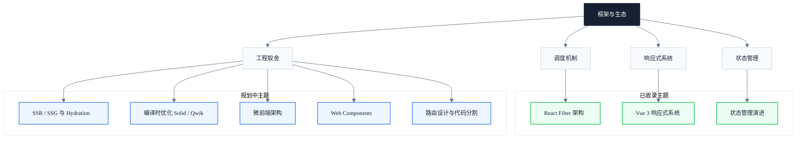

# 框架与生态

> 副标题：看透 React Fiber、Vue 3 响应式与状态管理抽象背后的工程取舍

## 模块定位

现代前端框架把"如何更新 DOM"这件事抽象得越来越彻底，但抽象不是免费的。React Fiber 的链式可中断渲染、Vue 3 的 Proxy 响应式、Zustand 的原子化状态，每一种方案背后都是对"调度、依赖追踪、性能与开发体验"的不同取舍。本模块不只讲"怎么用框架"，而是拆开框架的内部机制，让你理解它为什么这样设计、在什么场景下会遇到性能瓶颈、什么情况下应该绕过抽象直接操作底层。

我们不把框架当作黑盒，也不把 API 当作终点。理解 Fiber 节点结构、Proxy trap 与 Effect 调度、Flux 单向流的演进动机之后，你才能在性能问题、选型决策、源码贡献这三件事上做出有依据的判断，而不是停留在"跟着文档抄一遍"的层面。

最终目标不是成为某一个框架的专家，而是建立"调度、响应式、状态管理"这三组互相关联的工程视角，把不同框架的设计选择放进同一套坐标系里比较。

---

## 知识地图

---

## 核心主题

### ✓ 已收录

- **调度机制**：React Fiber 链表结构、时间切片、可中断渲染与 Lane 优先级模型
  → [React Fiber 架构](/frameworks/react-fiber)
- **响应式系统**：Vue 3 Proxy 依赖收集、Effect 调度、ref / reactive / computed 的实现差异
  → [Vue 3 响应式系统](/frameworks/vue3-reactivity)
- **状态管理**：Flux 单向流、Redux 中间件、Zustand 原子化、Recoil 派生状态的设计演进
  → [现代状态管理演进](/frameworks/state-management)

### ◯ 规划中

- **SSR / SSG 与 Hydration**：服务端渲染、静态生成与水合机制的工程取舍
- **编译时优化（Solid / Qwik）**：细粒度响应式与零水合范式如何避开运行时调度开销
- **微前端架构**：应用隔离、共享依赖与运行时编排的边界
- **Web Components**：原生组件模型、Shadow DOM 与框架互操作
- **路由设计与代码分割**：客户端 / 服务端路由、按需加载与预取策略

---

## 学习路径

1. 先读 [React Fiber 架构](/frameworks/react-fiber)，建立"调度 → 渲染 → 提交"的链路心智模型，理解可中断渲染为何能缓解主线程阻塞
2. 再读 [Vue 3 响应式系统](/frameworks/vue3-reactivity)，对比 Proxy 依赖收集与虚拟 DOM diff 两种更新范式在调度粒度上的差异
3. 接着读 [现代状态管理演进](/frameworks/state-management)，把状态抽象的演进放入 Flux → Redux → Zustand 的脉络中观察
4. 进阶：基于已有内容，对照 Solid / Qwik 的编译时优化思路，思考运行时调度是否可被完全消除

---

## 文章导览

- [React Fiber 架构：从栈调度到链式可中断渲染](/frameworks/react-fiber) — Fiber 节点结构、Scheduler、Lane 优先级模型
- [Vue 3 响应式系统：Proxy 与依赖收集的完整实现](/frameworks/vue3-reactivity) — 从 Proxy trap 到 Effect 调度的完整链路
- [现代状态管理演进：从 Flux 到 Zustand 的设计哲学](/frameworks/state-management) — 单向流、不可变性、原子化的取舍脉络

---

## 适用读者

- 中高级前端工程师，希望理解框架内部机制而非只会用 API
- 前端架构师，需要在技术选型时评估不同框架的性能边界与扩展性
- 框架源码贡献者，需要建立调度、响应式、状态管理的统一视角
- 工具链 / SDK 开发者，需要在框架抽象之上构建可移植的运行时能力

---

## 延伸资源

- [React 官方文档](https://react.dev) — Fiber、并发模式与 Suspense 的权威说明
- [Vue 3 官方文档](https://vuejs.org) — 响应式系统、Composition API 与编译器优化
- 《Front-End Architecture in the React Era》 — 框架选型与前端架构演进的系统性论述
- [Frontend Architecture patterns](https://www.patterns.dev/) — 现代前端架构模式的模式库
