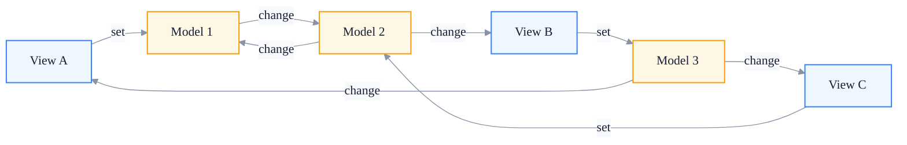
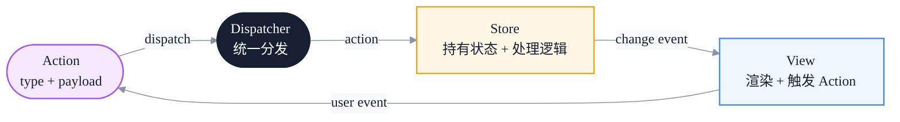
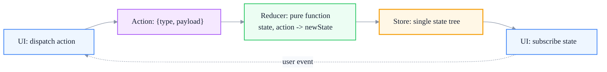
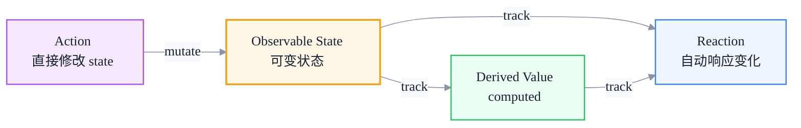
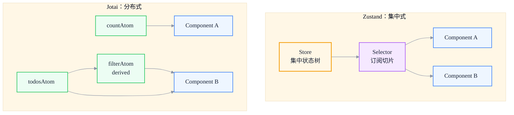
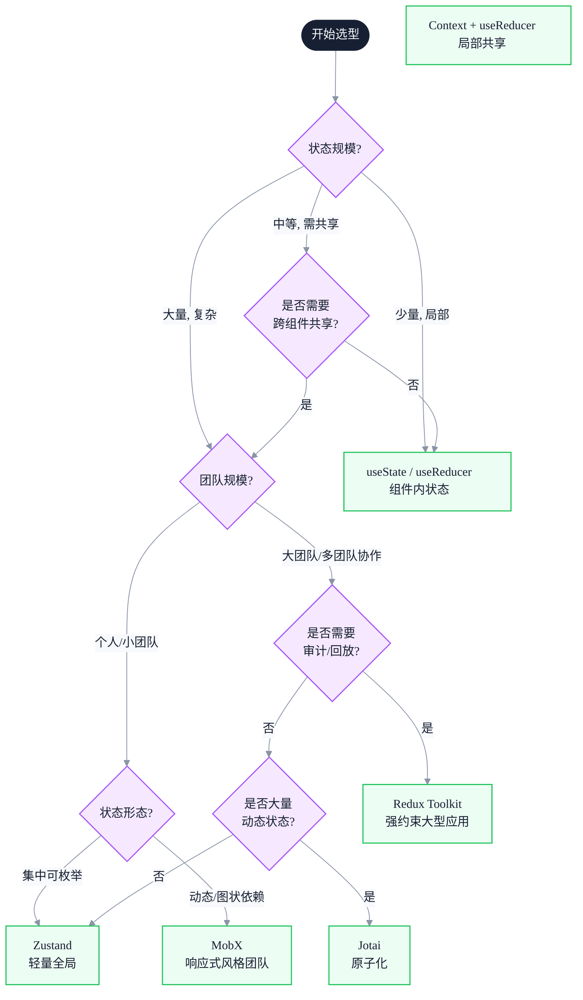

# 现代状态管理演进：从 Flux 到 Zustand 的设计哲学

> 副标题：从 MVC 到 Flux、Redux、MobX、Zustand、Jotai——前端状态管理的设计哲学与选型决策框架
>
> 目标读者：中高级前端工程师、前端架构师、需要做技术选型的工程师
>
> 阅读时间：约 27 分钟

::: info 一句话
前端状态管理演进的每一步，都在解决"状态变化的可追踪性"与"开发体验"之间的张力——从 Flux 强约束的单向流，到 Zustand 的极简 API，本质都是在重新权衡这两个维度。
:::

## 目录

- [写在前面](#写在前面)
- [一、MVC 时代的状态管理问题](#一-mvc-时代的状态管理问题)
- [二、Flux：单向数据流的革命](#二-flux-单向数据流的革命)
- [三、Redux：函数式与不可变性的极致](#三-redux-函数式与不可变性的极致)
- [四、MobX：响应式状态管理](#四-mobx-响应式状态管理)
- [五、Zustand 与 Jotai：回归简单的极简主义](#五-zustand-与-jotai-回归简单的极简主义)
- [六、状态管理的选型决策框架](#六-状态管理的选型决策框架)
- [七、趋势观察：状态管理正在"消失"](#七-趋势观察-状态管理正在-消失)
- [FAQ](#faq)
- [来源](#来源)

## 写在前面

很多前端工程师对状态管理的认知是这样的：

- 项目开始时：用 useState，简单够用
- 状态变多：提升到父组件，prop drilling
- 嫌烦：装 Redux
- 嫌 Redux 烦：换 MobX / Zustand / Jotai
- 用了一会儿：好像每个方案都有不对劲的地方

这种"换工具"的过程，本质上是没理解清楚不同方案要解决的问题。本文试图建立一个完整的"状态管理演进地图"，回答这些问题：

- Flux 为什么出现？它到底解决了 MVC 的什么问题？
- Redux 的"三大原则"为什么是这三条？强制不可变是为了什么？
- MobX 跟 Redux 是对立的吗？还是解决不同问题？
- Zustand 这么简单，为什么能取代 Redux？它"少"了什么？
- Jotai 的"原子化"跟 Zustand 的"集中式"有什么本质区别？
- 在一个具体项目中，到底该怎么选？

::: tip 本文的核心论点

状态管理方案没有"绝对最优"。每个方案都是"约束 vs 自由"、"集中 vs 分布"、"显式 vs 隐式"的不同取舍。理解这些取舍维度，才能做出合适的选型，而不是被工具牵着走。

:::

---

## 一、MVC 时代的状态管理问题

在前端框架化之前（约 2010-2014），Backbone.js、Ember.js、Knockout 等框架普遍采用 MVC 或 MVP 模式。Model 持有数据，View 监听 Model 变化并渲染，Controller 处理用户交互。

### 1. 双向绑定的诱惑与陷阱

早期 MVC 框架普遍支持双向绑定：View 的输入变化会写回 Model，Model 变化会刷新 View。这在简单场景下非常顺手，但在大型应用中迅速失控：

```javascript
// Backbone 风格的伪代码
const Model = Backbone.Model.extend({
  defaults: { count: 0, total: 100 }
})

const View = Backbone.View.extend({
  events: {
    'input #count': 'onInput'  // View -> Model
  },
  initialize() {
    this.model.on('change', this.render, this) // Model -> View
  },
  onInput(e) {
    this.model.set('count', e.target.value)
  },
  render() { /* ... */ }
})
```

### 2. 状态流变得不可追踪

当 Model 数量变多、View 之间互相依赖、Model 之间互相监听时，一个用户操作可能触发一连串难以追踪的变化：



这种"网状依赖"导致：

- **数据流不可预测**：一次输入可能触发循环更新、级联更新
- **调试困难**：状态变化的源头难以追溯
- **测试困难**：依赖大量隐式状态

### 3. Facebook 的"MVC 不 scale"论断

2014 年 Facebook 的工程师 Chew Chua 在 Flux 演讲中展示了一张图：MVC 在大型应用中很快变成"V-C-M-V-M-C"的纠缠。这张图直接推动了 Flux 的诞生。

::: warning 常见误区

很多人误解为"MVC 模式本身有问题"。实际上 MVC 在小型应用中工作得很好。问题在于"前端应用的规模上来后，缺乏对状态变化的统一约束"。Flux 的核心不是"取代 MVC"，而是"用单向数据流强制约束状态变化路径"。

:::

::: tip 本节核心结论

MVC 时代状态管理的核心问题是：双向绑定 + Model 间互相监听，导致数据流变成网状、不可追踪。Flux 的出现正是为了用单向数据流打破这种网状依赖。

:::

---

## 二、Flux：单向数据流的革命

Flux 是 Facebook 在 2014 年提出的状态管理架构。它不是库，而是一套设计模式。核心思想：**所有状态变化必须经过 Dispatcher，单向流动**。

### 1. Flux 的四个角色



- **Action**：描述"发生了什么"的纯对象 `{ type, payload }`
- **Dispatcher**：统一分发 Action 到所有 Store
- **Store**：持有状态，注册到 Dispatcher，根据 Action 类型更新自己
- **View**：订阅 Store 变化、渲染、响应用户操作触发 Action

### 2. 简化实现

```javascript
// Dispatcher: 简化实现
class Dispatcher {
  constructor() {
    this.callbacks = []
  }
  register(callback) {
    this.callbacks.push(callback)
    return () => {
      this.callbacks = this.callbacks.filter((cb) => cb !== callback)
    }
  }
  dispatch(action) {
    this.callbacks.forEach((cb) => cb(action))
  }
}

const dispatcher = new Dispatcher()

// Store
class TodoStore {
  constructor() {
    this.todos = []
    this.listeners = new Set()
    dispatcher.register((action) => this.handleAction(action))
  }
  handleAction(action) {
    switch (action.type) {
      case 'ADD_TODO':
        this.todos.push(action.payload)
        this.emit()
        break
      case 'REMOVE_TODO':
        this.todos = this.todos.filter((t) => t.id !== action.payload.id)
        this.emit()
        break
    }
  }
  emit() {
    this.listeners.forEach((l) => l())
  }
  subscribe(listener) {
    this.listeners.add(listener)
    return () => this.listeners.delete(listener)
  }
}

// View
const store = new TodoStore()
store.subscribe(() => render(store.todos))
addButton.onclick = () => {
  dispatcher.dispatch({ type: 'ADD_TODO', payload: { id: Date.now(), text: 'new' } })
}
```

### 3. Flux 解决了什么

| MVC 问题 | Flux 解法 |
|---------|----------|
| 数据流网状 | 所有数据流经过 Dispatcher，单向 |
| Model 互相监听 | Store 不允许互相直接调用，只能通过 Dispatcher 间接通信 |
| 状态变化不可追踪 | 所有变化必须由 Action 触发，Action 是不可变事件 |
| 调试困难 | Action 是离散事件，可以记录、回放 |

### 4. Flux 的局限

- **多 Store 协调麻烦**：一个 Action 可能要更新多个 Store，Store 之间还要等彼此完成（`waitFor`）
- **没有标准实现**：Facebook 给了模式，但具体 API 各家不同
- **冗余代码**：每个 Store 都要写 switch-case，模板代码多

这些局限直接催生了 Redux——一个"标准化、单一 Store、函数式"的 Flux 变体。

::: tip 本节核心结论

Flux 用单向数据流（Action → Dispatcher → Store → View）打破了 MVC 的网状依赖。它的核心贡献是"约束"：所有状态变化必须是显式 Action。代价是模板代码多、多 Store 协调复杂——这正是 Redux 要解决的问题。

:::

---

## 三、Redux：函数式与不可变性的极致

Redux 是 Dan Abramov 在 2015 年创建的库，它把 Flux 的思想推到了极致。Redux 的"三大原则"是：

1. **单一数据源**：整个应用的状态保存在一棵 state tree 中
2. **状态只读**：唯一改变状态的方式是 dispatch action
3. **纯函数修改**：reducer 必须是纯函数，无副作用

### 1. Redux 的核心模型



### 2. 完整的简化实现

```javascript
function createStore(reducer, initialState) {
  let state = initialState
  const listeners = []

  return {
    getState: () => state,
    dispatch: (action) => {
      state = reducer(state, action) // 纯函数计算新 state
      listeners.forEach((l) => l())
      return action
    },
    subscribe: (listener) => {
      listeners.push(listener)
      return () => {
        const i = listeners.indexOf(listener)
        if (i >= 0) listeners.splice(i, 1)
      }
    },
  }
}

// Reducer：纯函数，不可变更新
function todosReducer(state = [], action) {
  switch (action.type) {
    case 'ADD_TODO':
      return [...state, action.payload] // 新数组，不修改原 state
    case 'TOGGLE_TODO':
      return state.map((t) =>
        t.id === action.payload.id ? { ...t, done: !t.done } : t
      )
    case 'REMOVE_TODO':
      return state.filter((t) => t.id !== action.payload.id)
    default:
      return state
  }
}

const store = createStore(todosReducer, [])
store.subscribe(() => console.log(store.getState()))
store.dispatch({ type: 'ADD_TODO', payload: { id: 1, text: 'learn redux', done: false } })
```

### 3. 为什么强制不可变

Redux 最显著的特点是 reducer 必须返回新对象，不能直接修改原 state。原因有三：

**第一，可追踪性**：每次 state 变化都是一次新引用，可以用 `===` 快速判断是否变化，无需深比较。

```javascript
// React-Redux 的优化基础
function shallowEqual(a, b) {
  if (a === b) return true // 引用相等直接返回，O(1)
  // ...
}
```

**第二，时间旅行**：因为 state 是不可变的，所有历史 state 都保留在内存中，可以回放。这是 Redux DevTools 的基础。

**第三，纯函数可测试**：reducer 是纯函数，给定输入一定得到相同输出，测试不需要 mock。

### 4. 中间件机制

Redux 的副作用（异步、日志、错误处理）通过中间件实现。中间件是 `store.dispatch` 的包装器：

```javascript
function applyMiddleware(store, middlewares) {
  let dispatch = store.dispatch
  middlewares.forEach((mw) => {
    dispatch = mw(store)(dispatch)
  })
  return { ...store, dispatch }
}

// 日志中间件
const logger = (store) => (next) => (action) => {
  console.log('dispatch', action)
  const result = next(action)
  console.log('next state', store.getState())
  return result
}

// thunk 中间件：处理异步 action
const thunk = (store) => (next) => (action) => {
  if (typeof action === 'function') {
    return action(store.dispatch, store.getState)
  }
  return next(action)
}

// 使用
const store = createStore(reducer, initialState)
const enhancedStore = applyMiddleware(store, [logger, thunk])

// 异步 action
const fetchTodos = () => async (dispatch) => {
  dispatch({ type: 'FETCH_TODOS_REQUEST' })
  try {
    const todos = await api.fetchTodos()
    dispatch({ type: 'FETCH_TODOS_SUCCESS', payload: todos })
  } catch (e) {
    dispatch({ type: 'FETCH_TODOS_FAILURE', payload: e.message })
  }
}
enhancedStore.dispatch(fetchTodos())
```

### 5. Redux 的代价

Redux 的"约束力"是它的优点，也是它的代价：

- **模板代码多**：一个简单功能要写 action type / action creator / reducer / 连接组件
- **不可变更新繁琐**：嵌套对象的 spread 操作可读性差、易错
- **学习曲线陡**：纯函数、不可变、中间件、connect/Hooks 都要学
- **过度工程**：小项目用 Redux 是杀鸡用牛刀

```javascript
// 嵌套更新的痛苦
function reducer(state, action) {
  switch (action.type) {
    case 'UPDATE_TODO_TEXT':
      return {
        ...state,
        todos: state.todos.map((t) =>
          t.id === action.payload.id
            ? { ...t, text: action.payload.text }
            : t
        ),
      }
  }
}
```

这种繁琐催生了 Immer 等工具，让 reducer 可以"用可变语法写不可变更新"：

```javascript
import { produce } from 'immer'

const reducer = produce((draft, action) => {
  switch (action.type) {
    case 'UPDATE_TODO_TEXT':
      const todo = draft.todos.find((t) => t.id === action.payload.id)
      if (todo) todo.text = action.payload.text // 看起来可变，实际生成新 state
      break
  }
})
```

::: tip 本节核心结论

Redux 把 Flux 推向极致：单一 Store、纯函数 reducer、强制不可变。它换来了可追踪性、时间旅行、纯函数测试，代价是大量模板代码和繁琐的不可变更新。Redux 适合"大型应用 + 团队需要强约束"的场景。

:::

---

## 四、MobX：响应式状态管理

MobX 走了完全相反的路。它的核心理念是："通过响应式系统自动追踪依赖，让状态管理变成'修改数据'本身"。

### 1. MobX 的核心模型



### 2. 简化实现

```javascript
// 简化的 observable：本质是 Vue 3 的 reactive
function observable(target) {
  const deps = new Map() // key -> Set<reaction>
  let currentReaction = null

  return new Proxy(target, {
    get(t, key) {
      if (currentReaction) {
        if (!deps.has(key)) deps.set(key, new Set())
        deps.get(key).add(currentReaction)
      }
      return t[key]
    },
    set(t, key, value) {
      t[key] = value
      deps.get(key)?.forEach((r) => r())
      return true
    },
  })
}

function autorun(fn) {
  const reaction = () => {
    currentReaction = reaction
    try {
      fn()
    } finally {
      currentReaction = null
    }
  }
  reaction()
}

// 使用
const state = observable({ count: 0, todos: [] })

autorun(() => {
  console.log('count is', state.count) // 自动追踪 count
})

state.count = 1 // 控制台输出: count is 1
state.todos.push({}) // 不会触发上面的 autorun（因为没读 todos）
```

### 3. MobX 的关键设计

**第一，状态可变**：直接 `state.count++`，无需 reducer、无需 dispatch、无需不可变更新。

**第二，自动依赖追踪**：reaction 运行时读取了哪些 observable，就自动订阅哪些。无需手写依赖列表。

**第三，细粒度更新**：每个 observable 属性都有自己的订阅集合，更新某个属性只触发相关 reaction，不触发其他。

**第四，computed 缓存**：衍生状态自动缓存，依赖不变时返回旧值。

```javascript
import { observable, computed, autorun } from 'mobx'

const store = observable({
  todos: [],
  get unfinishedCount() {
    return computed(() => this.todos.filter((t) => !t.done).length).get()
  },
})

autorun(() => {
  console.log('unfinished:', store.unfinishedCount)
})

store.todos.push({ done: false }) // 自动输出: unfinished: 1
```

### 4. Redux vs MobX

| 维度 | Redux | MobX |
|------|-------|------|
| 数据流 | 单向、显式 Action | 双向、直接修改 |
| 状态可变性 | 不可变 | 可变 |
| 依赖追踪 | 手动 connect/selector | 自动 |
| 更新粒度 | 组件级（订阅 state 切片） | 字段级 |
| 模板代码 | 多 | 少 |
| 可追踪性 | 强（所有变化都是 Action） | 弱（任何地方都能改） |
| 调试 | 时间旅行、Action 回放 | 难以回放（状态被直接修改） |
| 适合规模 | 大型团队、需要约束 | 中小型、追求开发效率 |

::: warning 关键认知

Redux 和 MobX 不是"好与坏"的关系，而是"约束 vs 自由"的取舍。Redux 的强约束让大型团队协作更安全，MobX 的自由让中小型项目开发更快。在不需要"严格审计每一次状态变化"的场景下，MobX 的开发体验远好于 Redux。

:::

::: tip 本节核心结论

MobX 用响应式系统把"状态变化"和"UI 更新"自动绑定，让开发者直接修改状态而不需要 Action/Reducer。代价是失去了"显式可追踪"的审计能力。它是"自由派"的代表，与 Redux 的"约束派"形成对立。

:::

---

## 五、Zustand 与 Jotai：回归简单的极简主义

到 2017-2019 年，社区对 Redux 的繁琐越来越不满。一批"极简状态管理"库出现，其中最有代表性的是 Zustand 和 Jotai（以及 Recoil、Valtio 等）。

### 1. Zustand：极简的"小型 Redux"

Zustand 的设计目标：保留 Redux 的"显式 store"理念，但去掉所有模板代码。

```javascript
import { create } from 'zustand'

const useStore = create((set, get) => ({
  count: 0,
  todos: [],
  increment: () => set((state) => ({ count: state.count + 1 })),
  addTodo: (text) => set((state) => ({ todos: [...state.todos, { text, done: false }] })),
  getUnfinished: () => get().todos.filter((t) => !t.done).length,
}))

// 使用
function Counter() {
  const count = useStore((state) => state.count)
  const increment = useStore((state) => state.increment)
  return <button onClick={increment}>{count}</button>
}
```

**关键设计**：

- **store 是一个 hook**：直接在组件中调用，无需 Provider
- **状态和 action 放一起**：不再分离 reducer/action creator
- **可变或不可变都可以**：`set` 接受新对象，也可以用 Immer 中间件写可变语法
- **selector 优化**：组件只订阅自己关心的切片

```javascript
// 简化实现
function createStore(createState) {
  let state
  const listeners = new Set()

  const setState = (partial) => {
    const nextState = typeof partial === 'function' ? partial(state) : partial
    if (nextState !== state) {
      state = Object.assign({}, state, nextState)
      listeners.forEach((l) => l())
    }
  }
  const getState = () => state
  const subscribe = (listener) => {
    listeners.add(listener)
    return () => listeners.delete(listener)
  }

  const api = { setState, getState, subscribe }
  state = createState(setState, getState, api)

  const useStore = (selector = (s) => s) => {
    return useSyncExternalStore(
      subscribe,
      () => selector(getState())
    )
  }
  Object.assign(useStore, api)
  return useStore
}
```

### 2. Jotai：原子化状态

Jotai（受 Recoil 启发）走完全不同的路线：**状态不是集中在一棵树里，而是分散为独立的"原子"**。

```javascript
import { atom, useAtom } from 'jotai'

// 原子：状态的最小单元
const countAtom = atom(0)
const todosAtom = atom([])

// 衍生原子：依赖其他原子
const unfinishedCountAtom = atom((get) =>
  get(todosAtom).filter((t) => !t.done).length
)

// 派生可写原子
const addTodoAtom = atom(null, (get, set, text) => {
  set(todosAtom, [...get(todosAtom), { text, done: false }])
})

function Counter() {
  const [count, setCount] = useAtom(countAtom)
  return <button onClick={() => setCount(count + 1)}>{count}</button>
}

function TodoList() {
  const [unfinished] = useAtom(unfinishedCountAtom)
  const [, addTodo] = useAtom(addTodoAtom)
  // ...
}
```

**关键设计**：

- **状态分散**：每个 atom 独立，不需要集中 store
- **图状依赖**：atom 可以依赖其他 atom，自动形成依赖图
- **细粒度订阅**：组件只订阅自己用的 atom，atom 变化只触发相关组件
- **可派生**：atom 可以是只读的衍生状态、可写的转换 atom

### 3. Zustand vs Jotai



| 维度 | Zustand | Jotai |
|------|---------|-------|
| 状态形态 | 集中式 store | 分散原子 |
| 心智模型 | "全局对象 + selector" | "原子 + 依赖图" |
| 适合场景 | 业务状态、可枚举状态集合 | 状态依赖复杂、动态生成状态 |
| 状态共享 | 默认全局 | 默认全局，可作用域隔离 |
| API 风格 | 命令式 set/get | 声明式 atom |

### 4. 为什么 Zustand/Jotai 能取代 Redux

::: tip 共同的设计哲学

1. **零模板代码**：没有 reducer、没有 action creator、没有 switch-case
2. **零 Provider**：直接在组件中 import 使用，不污染组件树
3. **不强制不可变**：但鼓励，配合 Immer 也容易
4. **基于 Hooks**：天然契合 React 函数式组件范式
5. **足够小**：Zustand ~1KB，Jotai ~3KB，加起来比 Redux Toolkit 还小

:::

但它们也"少"了 Redux 的一些东西：没有强制的 Action 类型、没有时间旅行（虽然 Zustand 可以配合中间件实现）、没有标准化的副作用方案（需要自己用 saga/observable/async）。

::: tip 本节核心结论

Zustand 和 Jotai 代表了"回归简单"的趋势。Zustand 是"小型 Redux"——保留集中 store，去掉模板代码；Jotai 是"原子化状态"——把状态分散为最小单元，依赖图自动管理。两者都通过"减少约束"换来了开发体验的提升。

:::

---

## 六、状态管理的选型决策框架

理解了不同方案的设计哲学，下一个问题是：在具体项目中怎么选？下面是一个基于实践的决策框架。

### 1. 决策树



### 2. 四个核心维度

**维度 1：状态规模**

- 单组件内部：`useState` / `useReducer` 足够
- 跨几个组件但有限范围：Context + useReducer
- 全局大量状态：Zustand / Redux Toolkit / MobX

**维度 2：状态形态**

- 集中、可枚举：Zustand、Redux Toolkit
- 分散、动态生成：Jotai
- 响应式风格、可变：MobX

**维度 3：团队规模与协作需求**

- 个人或小团队：选开发体验好的（Zustand、Jotai、MobX）
- 大型团队、需要审计：Redux Toolkit（Action 可追溯）
- 跨团队共享状态：必须有强约束（Redux Toolkit）

**维度 4：性能要求**

- 频繁更新 + 大量订阅：Jotai / MobX（细粒度订阅）
- 一般场景：Zustand / Redux Toolkit（selector 优化足够）

### 3. 常见反模式

**反模式 1：所有状态都进全局 store**

```javascript
// ❌ 表单临时状态进 Redux
const [formValue, setFormValue] = useFormState() // 用 useState 就好
```

判断原则：**只有"跨多组件共享"且"长期存在"的状态才进全局 store**。表单临时输入、动画状态、UI 局部开关都应该用组件本地状态。

**反模式 2：服务端状态用 Redux 管理**

```javascript
// ❌ 把 todo 列表数据存进 Redux
const [todos, setTodos] = useState([])
useEffect(() => fetchTodos().then(setTodos), [])
// 还要管 loading、error、缓存、重新验证...
```

服务端状态有专门的库：React Query、SWR、RTK Query。它们解决了缓存、重新验证、loading 状态、并发请求等问题，比手写 Redux 副作用干净得多。

**反模式 3：选型不考虑团队**

新人多的团队选 Redux 是"为约束付钱"，但学习成本很高；强协作场景选 MobX 是"为自由付钱"，但难以追溯状态变化。**选型决策必须考虑团队结构，不能只看技术指标**。

::: tip 本节核心结论

状态管理选型没有"最优解"，只有"合适解"。核心维度是：状态规模、状态形态、团队规模、性能要求。同时要避免"所有状态进全局"和"用状态管理库管理服务端状态"这两个反模式。

:::

---

## 七、趋势观察：状态管理正在"消失"

最近两年的趋势是：**前端状态管理的"显式感"正在变弱**。

### 1. 服务端状态被独立出去

React Query / SWR / RTK Query 把"服务端数据缓存"从状态管理中剥离。开发者不再需要把 API 数据存进 Redux，而是用专门的 query 库管理。这极大简化了"状态管理"的负担——大部分"状态"其实是"服务端数据的本地缓存"。

### 2. 框架内置状态能力增强

- React Server Components 把"服务端状态"直接渲染到组件树
- React `use` Hook 让异步数据可以"同步化"使用
- Vue 的 `useStorage`、`useAsyncState` 等组合式函数覆盖了大部分场景
- SvelteKit / SolidStart 等元框架内置了数据加载和状态同步

### 3. URL 作为状态

越来越多的状态被搬到 URL：搜索条件、过滤器、分页、tab 选中状态。URL 状态天然可分享、可前进后退、可服务端渲染。这进一步减少了"需要管理"的状态量。

### 4. "状态管理库"的未来

剩下的真正"客户端状态"变少了：用户偏好、UI 状态、本地草稿、协作状态。这部分用 Zustand / Jotai 已经足够，很少需要 Redux 这种重型方案。

::: warning 趋势判断

未来 3-5 年，"状态管理"作为独立技术命题的权重会下降。开发者会更多关注：服务端状态（React Query 类）、URL 状态、框架内置状态、Server Components。状态管理库会回归"局部工具"的角色，而不是项目架构的核心。

:::

::: tip 本节核心结论

理解状态管理演进，不只是为了"选对库"，而是为了理解前端应用的数据流。在服务端状态、URL 状态、客户端状态被分门别类管理后，传统"全局状态管理"的领域正在收窄。这正是 Zustand/Jotai 这样的轻量方案能崛起的根本原因。

:::

---

## FAQ

### 1. 为什么 Redux 现在不流行了？

不是"不流行"，而是"使用场景变窄了"。Redux 的核心价值是"大型团队的强约束"，但当大部分应用状态被 React Query（服务端状态）和 URL（共享状态）接管后，需要 Redux 管理的状态变少了。中小型项目用 Zustand 足够。但大型企业级应用（如金融、ERP）仍然适合用 Redux Toolkit + RTK Query。

### 2. Zustand 真的能完全替代 Redux 吗？

在大部分场景下可以。Zustand 缺失的是：标准的 Action 类型（需要自己约定）、原生的时间旅行（需要中间件）、强约束的代码风格（需要团队规范）。如果你的项目不需要这些"约束能力"，Zustand 完全够用。

### 3. Jotai 的"原子化"和 Redux 的"集中式"哪个更好？

看状态形态。如果你的状态是"一个对象 + 几个 slice"（如用户信息、主题、配置），集中式（Zustand/Redux）更直观。如果你的状态是"大量动态生成的小单元"（如表单字段、动态卡片），原子化（Jotai）更合适。两者也可以混用。

### 4. MobX 在 React 中还有未来吗？

MobX 仍有用户群体，特别是 Vue 背景的开发者转到 React 时偏好它。但社区趋势是 Zustand/Jotai 占主导。MobX 的劣势是：脱离了 React 主流生态（基于外部响应式系统而非 React 的 reconciliation）、与 Suspense/Server Components 集成困难。这些是结构性问题。

### 5. 状态管理和服务端数据缓存有什么区别？

状态管理（client state）：用户偏好、UI 开关、本地草稿、表单临时输入。这些是"客户端独有的、可变的、不需要服务端验证"的状态。

服务端数据缓存（server state）：从 API 拉来的数据。这些状态有"所有者"（服务端）、有"新鲜度"（可能过期）、有"一致性"要求（多视图看到的数据要一致）。React Query 类库专门解决这些问题，比通用状态管理库更合适。

### 6. 是否有必要学 Redux 的源码？

值得学。`createStore` 的实现只有几十行，但涵盖了"发布订阅、纯函数 reducer、不可变更新、中间件组合"四个核心概念。这是函数式编程在前端的经典案例，对理解更多库（RxJS、Express 中间件、Webpack loader 链）都有帮助。但要区分"学源码"和"在项目中用 Redux"——前者是思维训练，后者是工程决策。

---

## 来源

1. Redux 官方文档：<https://redux.js.org/>
2. MobX 官方文档：<https://mobx.js.org/>
3. Zustand GitHub：<https://github.com/pmndrs/zustand>
4. Jotai GitHub：<https://github.com/pmndrs/jotai>
5. Dan Abramov - You Might Not Need Redux：<https://medium.com/@dan_abramov/you-might-not-need-redux-be46360cf367>

本文同时基于作者对多个状态管理库源码的实践阅读与项目经验总结。
