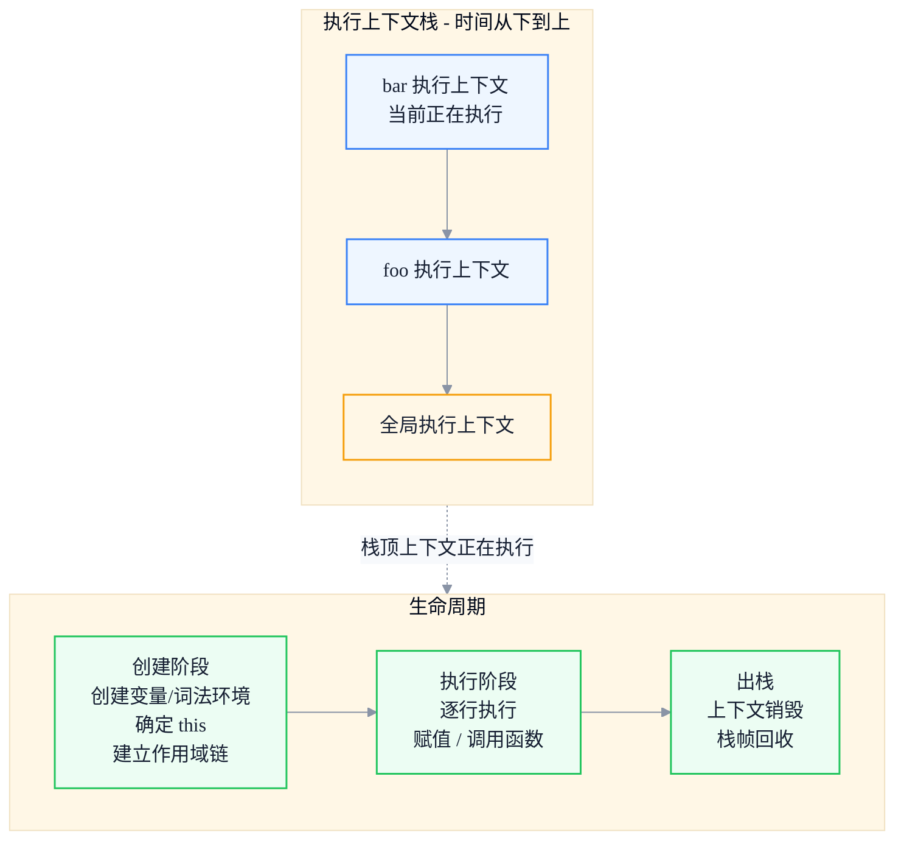

# 执行上下文与作用域链：从 V8 视角理解闭包本质

> 副标题：从执行上下文生命周期、变量环境与词法环境、作用域链构建到闭包内存模型
>
> 目标读者：中高级前端工程师、前端架构师
>
> 阅读时间：约 25 分钟

::: info 一句话
闭包不是"函数套函数"的语法技巧，而是执行上下文与作用域链在 V8 堆内存中留下的一条真实引用链——理解它，才能理解内存泄漏的真正成因。
:::

## 目录

- [写在前面](#写在前面)
- [一、执行上下文：JavaScript 代码运行的"现场"](#一、执行上下文-javascript-代码运行的-现场)
- [二、变量环境与词法环境：为什么 ES6 之后要有两套环境](#二、变量环境与词法环境-为什么-es6-之后要有两套环境)
- [三、作用域链的构建机制：outer 指针串起的链条](#三、作用域链的构建机制-outer-指针串起的链条)
- [四、从 V8 视角看闭包：Context 对象与逃逸分析](#四、从-v8-视角看闭包-context-对象与逃逸分析)
- [五、闭包与内存泄漏的真实关系](#五、闭包与内存泄漏的真实关系)
- [六、常见闭包陷阱与最佳实践](#六、常见闭包陷阱与最佳实践)
- [结语：闭包是作用域链在堆上的延续](#结语-闭包是作用域链在堆上的延续)
- [FAQ](#faq)
- [来源](#来源)

## 写在前面

很多前端工程师对闭包的理解停留在面试题层面："函数内部返回一个函数，内部函数能访问外部变量"。这个定义没错，但太薄。再追问几个问题，往往就答不上来：

- `var` 和 `let` 在执行上下文里到底有什么不同？为什么 `let` 会有暂时性死区（TDZ）？
- 为什么函数返回后，它内部的局部变量没有随栈帧一起销毁，而是还能被访问？
- 闭包到底"捕获"了哪些变量？是全部捕获，还是只捕获用到的？这会怎么影响内存？
- "闭包导致内存泄漏"这句话在什么前提下成立，什么前提下是被夸大的？

要回答这些问题，必须从 JavaScript 的执行上下文（Execution Context）、环境记录（Environment Record）、作用域链（Scope Chain）一路讲到 V8 的堆内存模型。本文就是沿着这条路径展开的。

::: tip 本节核心结论

闭包的本质是：函数在创建时会捕获它定义时所处的词法环境；当这个函数被带到别处执行时，它仍然沿着这条被捕获的环境链查找变量。V8 把这条环境链以 `Context` 对象的形式放在堆上，这就是闭包能"记住"外部变量的底层原因。

:::

---

## 一、执行上下文：JavaScript 代码运行的"现场"

**执行上下文（Execution Context）** 是 JavaScript 引擎为执行一段代码所准备的"现场"。它包含这段代码运行所需要的全部信息：变量绑定、`this` 指向、作用域链、外层环境引用等。

JavaScript 中有三种执行上下文：

1. **全局执行上下文**：程序启动时创建，整个生命周期只有一个。它在浏览器里关联到全局对象 `window` / `globalThis`。
2. **函数执行上下文**：每次调用函数时创建一个新的，函数返回后销毁（在没有闭包捕获的情况下）。
3. **Eval 执行上下文**：在 `eval` 中执行的代码。现代工程几乎不用，但它确实存在。

### 1. 执行上下文栈

JavaScript 是单线程的，同一时刻只能执行一个执行上下文。引擎用一个**执行上下文栈（Execution Context Stack，ECS）** 来管理：



```javascript
function foo() {
  bar()
}
function bar() {
  console.log('bar')
}
foo()
```

调用 `foo()` 时的栈变化：全局上下文入栈 → `foo` 上下文入栈 → `bar` 上下文入栈 → `bar` 执行完出栈 → `foo` 执行完出栈 → 回到全局上下文。

### 2. 创建阶段做了什么

执行上下文在创建阶段会完成三件事，这三件事决定了"这段代码能看到什么"：

1. **创建词法环境（Lexical Environment）**
2. **创建变量环境（Variable Environment）**
3. **确定 `this` 的绑定**

很多人以为"变量提升"只是把声明挪到顶部，其实更准确的描述是：**在创建阶段，引擎已经把变量名注册到了环境记录里，只是 `var` 的值初始为 `undefined`，而 `let` / `const` 处于"未初始化"状态（这就是 TDZ 的来源）**。

```javascript
console.log(a) // undefined —— var 已注册，值为 undefined
console.log(b) // ReferenceError —— let 已注册，但处于 TDZ
var a = 1
let b = 2
```

::: tip 本节核心结论

执行上下文是代码运行的"现场"，由栈管理。创建阶段会注册变量绑定、确定 `this`、建立作用域链。变量提升的本质是"创建阶段已注册，但值未初始化"。

:::

::: warning 常见误区

把"变量提升"理解为"代码被物理移动到顶部"。实际上代码没有移动，提升发生在执行上下文的创建阶段，引擎在那一刻就把绑定加进了环境记录。

:::

---

## 二、变量环境与词法环境：为什么 ES6 之后要有两套环境

在 ES5 时代，执行上下文只有一个 `VariableEnvironment`，用来存放 `var` 和 `function` 声明。ES6 引入 `let` / `const` / `class` 之后，规范把执行上下文的环境拆成了两个：

- **VariableEnvironment（变量环境）**：存放 `var` 声明和 `function` 声明。整个函数执行期间不变。
- **LexicalEnvironment（词法环境）**：存放 `let` / `const` / `class` 声明，同时也是**执行时标识符查找的起点**。它会随着进入新的块级作用域而更新。

### 1. 词法环境的结构

一个词法环境由两部分组成：

1. **环境记录（Environment Record）**：真正存储变量名 → 值映射的地方。
2. **对外部环境的引用（outer / [[OuterEnv]]）**：指向外层词法环境，作用域链就是由它串起来的。

环境记录有几种类型，理解它们的差异有助于解释很多边界行为：

| 环境记录类型 | 用途 | 典型场景 |
| --- | --- | --- |
| 声明式（Declarative） | `var` / `let` / `const` / `function` / `class` 绑定 | 函数体、块级作用域 |
| 函数式（Function） | 声明式 + `this` / `new.target` / `super` 绑定 | 函数调用 |
| 对象式（Object） | 绑定挂在某个对象上 | `with` 语句、全局对象记录 |
| 模块式（Module） | 模块顶层声明，支持 import/export 实时绑定 | ES Module |

### 2. 为什么 `var` 和 `let` 要分开存

关键差异在于**作用域粒度**和**初始化时机**：

- `var` 是函数级作用域，并且创建时初始化为 `undefined`。
- `let` / `const` 是块级作用域，进入块时创建绑定，但**在执行到声明语句之前处于未初始化状态**（TDZ）。

把两套环境分开，引擎才能在进入 `{ }` 块时为 `let` / `const` 创建新的词法环境，而不影响函数级的 `var` 绑定：

```javascript
function demo() {
  // VariableEnvironment: { x: undefined }
  // LexicalEnvironment（函数级）: { x: undefined } —— 注意 var 也会出现在词法环境里供查找
  var x = 1

  if (true) {
    // 进入块：新建一个块级词法环境，outer 指向函数级
    // 块级词法环境: { y: <uninitialized> }
    console.log(x) // 1 —— 沿 outer 找到外层的 x
    let y = 2
    console.log(y) // 2
  }
  // 离开块：块级词法环境被丢弃，y 不可访问
  console.log(y) // ReferenceError: y is not defined
}
demo()
```

::: tip 本节核心结论

ES6 拆出词法环境是为了支持块级作用域和 TDZ。`var` 走变量环境（函数级、初始化为 undefined），`let` / `const` 走词法环境（块级、声明前为 TDZ）。标识符查找永远从当前的词法环境开始。

:::

::: info 工程启示

TDZ 不是"语法糖"，它是真实的运行时约束。在循环、条件块里用 `let` 声明依赖顺序敏感的变量时，TDZ 会帮你尽早暴露"先用后声明"的 bug，而 `var` 会静默给出 `undefined`。

:::

---

## 三、作用域链的构建机制：outer 指针串起的链条

**作用域链（Scope Chain）** 不是一条单独维护的链，而是由各个环境的 `outer`（`[[OuterEnv]]`）指针自然形成的。查找变量时，引擎从当前词法环境出发，沿着 `outer` 一路向外找，直到命中或到达 `null`（全局环境之外）。

### 1. 词法作用域：在"写代码时"就决定了

JavaScript 采用**词法作用域（Lexical Scope）**，即函数的作用域链由它**定义时**所处的环境决定，而不是调用时所处的环境。这是理解闭包的前提：

```javascript
const x = 'outer'

function outer() {
  const x = 'inner'
  function inner() {
    console.log(x) // 'inner' —— 由定义位置决定
  }
  return inner
}

const fn = outer()
fn() // 仍然是 'inner'，尽管调用处周围只有 'outer'
```

`inner` 定义在 `outer` 内部，它的 `[[Environment]]` 指向 `outer` 的词法环境。无论它被带到哪里调用，查找 `x` 时都会沿着这条 `outer` 指针回到 `outer` 的环境。

### 2. 作用域链的内存形态

下图展示了嵌套函数执行时作用域链的结构。注意 `outer` 指针是从内指向外的，它是在函数**创建**时就被固定下来的：

```mermaid
%%{init: {'theme': 'base', 'themeVariables': { 'fontFamily': 'Inter, PingFang SC, Microsoft YaHei, sans-serif', 'primaryColor': '#EEF6FF', 'primaryTextColor': '#172033', 'primaryBorderColor': '#6EA8FE', 'lineColor': '#8A94A6', 'secondaryColor': '#F7F9FC', 'tertiaryColor': '#FFF7E6'}}}%%
flowchart LR
    subgraph Inner[inner 函数执行上下文]
        IE[函数词法环境<br/>绑定: 无]
    end
    subgraph Outer[outer 函数词法环境]
        OE[绑定: x = inner]
    end
    subgraph Global[全局词法环境]
        GE[绑定: x = outer<br/>fn = function]
    end

    IE -- "outer 指针" --> OE
    OE -- "outer 指针" --> GE
    GE -- "outer = null" --> Null((结束))

    IE -. "查找 x: 第 1 步未命中" .-> OE
    OE -. "第 2 步命中 x=inner" .-> Hit((找到))

    classDef env fill:#EEF6FF,stroke:#3B82F6,color:#172033,stroke-width:1.5px;
    classDef hit fill:#ECFDF3,stroke:#22C55E,color:#172033,stroke-width:2px;
    classDef end fill:#FFF7E6,stroke:#F59E0B,color:#172033,stroke-width:1.5px;
    class IE,OE,GE env;
    class Hit hit;
    class Null end;
```

::: tip 本节核心结论

作用域链不是运行时动态拼接的，而是由各环境的 `outer` 指针在函数创建时固定下来的。词法作用域意味着"函数能访问哪些变量"在定义时就确定了，与调用位置无关。

:::

::: warning 常见误区

认为函数的作用域取决于它在哪里被调用。只有 `eval` / `with` 这类动态作用域特性才会打破词法作用域规则，现代代码应当避免使用。

:::

---

## 四、从 V8 视角看闭包：Context 对象与逃逸分析

前面讲的都是规范层面的模型。现在落到 V8 的真实实现上——这也是"闭包为什么不会随栈帧一起销毁"的答案所在。

### 1. 函数对象里藏着一个 Context 指针

在 V8 内部，一个 JavaScript 函数对象（JSFunction）至少包含三部分：

1. **SharedFunctionInfo（SFI）**：函数的"静态信息"——源码、AST、字节码、参数数量等。同一段函数代码只对应一份 SFI。
2. **Context 指针**：指向创建该函数时所在的**执行上下文对应的 Context 对象**。这就是闭包的"记忆"来源。
3. **反馈向量（Feedback Vector）**：用于 IC（内联缓存）的类型反馈数据。

当函数被调用时，V8 会用这个 Context 指针作为新栈帧的"父上下文"，从而恢复出完整的作用域链。

### 2. 栈与堆的分工：为什么局部变量能"活下来"

普通函数的局部变量存储在**调用栈**上，函数返回时栈帧弹出，变量立即销毁。这对非闭包变量是高效且正确的。

但闭包打破了这个前提：如果内部函数引用了外部函数的局部变量，那么外部函数返回后，这些变量必须仍然存活。V8 的做法是**逃逸分析（Escape Analysis）**：

- 如果一个变量被某个闭包引用（"逃逸"到了函数外部），V8 会把它从栈上"提升"到**堆上的 Context 对象**里。
- 如果一个变量没有被任何闭包引用，它就留在栈上，函数返回时自动回收。

这意味着：**闭包并不是把整个外部函数的活动记录都搬到堆上，而是只搬运"被引用"的那些变量**。这是一个常被忽略却很重要的优化。

```javascript
function makeCounter() {
  let count = 0           // 被 inner 引用 → 逃逸到堆 Context
  let huge = new Array(1e6) // 没有被任何闭包引用 → 留在栈上，makeCounter 返回即回收
  return function inner() {
    count++
    return count
  }
}
const counter = makeCounter()
```

在这个例子里，`huge` 这个大数组虽然定义在 `makeCounter` 里，但因为没有任何闭包引用它，它不会进入 `Context` 对象，`makeCounter` 返回后就被释放。只有 `count` 会被保留在堆上的 `Context` 中。

### 3. 闭包的内存模型图

```mermaid
%%{init: {'theme': 'base', 'themeVariables': { 'fontFamily': 'Inter, PingFang SC, Microsoft YaHei, sans-serif', 'primaryColor': '#EEF6FF', 'primaryTextColor': '#172033', 'primaryBorderColor': '#6EA8FE', 'lineColor': '#8A94A6', 'secondaryColor': '#F7F9FC', 'tertiaryColor': '#FFF7E6'}}}%%
flowchart TB
    subgraph Heap[堆内存 - 闭包返回后仍然存活]
        direction TB
        FN[JSFunction: counter<br/>SharedFunctionInfo + Context 指针]
        CTX[Context 对象<br/>count = 0<br/>outer → 全局 Context]
        FN -- Context 指针 --> CTX
    end

    subgraph Stack[调用栈 - makeCounter 返回后销毁]
        direction TB
        FR[makeCounter 栈帧<br/>huge = Array(1e6)<br/>随栈帧回收]
    end

    CTX -. outer .-> GCTX[全局 Context]

    classDef fn fill:#FFF7E6,stroke:#F59E0B,color:#172033,stroke-width:2px;
    classDef ctx fill:#EEF6FF,stroke:#3B82F6,color:#172033,stroke-width:1.5px;
    classDef stack fill:#F8FAFC,stroke:#94A3B8,color:#172033,stroke-width:1.5px;
    class FN fn;
    class CTX,GCTX ctx;
    class FR stack;
```

::: tip 本节核心结论

V8 通过逃逸分析决定变量存放位置：被闭包引用的变量进入堆上的 `Context` 对象，未被引用的留在栈上随栈帧回收。所以"闭包捕获整个外部作用域"是不准确的，它只捕获真正被引用的变量。

:::

::: info 工程启示

这给了一个实用的排查思路：如果一段闭包代码占用了意外内存，先看它引用了哪些"大变量"。哪怕你没有显式使用某个变量，只要闭包链上有一个函数引用了它，它就会留在堆上。

:::

---

## 五、闭包与内存泄漏的真实关系

"闭包导致内存泄漏"是被传得最广、也最容易被夸大的说法之一。先说清楚：**闭包本身不是内存泄漏**。闭包按预期保留了它该保留的变量，这是特性而非 bug。

真正的"泄漏"发生在：**一个本该被回收的对象，因为被某条长期存活的闭包链引用，导致无法被 GC 回收**。

### 1. 三种真实的闭包泄漏模式

**模式 A：未清理的事件监听器**

```javascript
function setup(element, heavyData) {
  element.addEventListener('click', function onClick() {
    // onClick 闭包引用了 heavyData
    console.log(heavyData.length)
  })
  // 忘记在组件销毁时 removeEventListener
}
```

`element` 如果被移出 DOM 但事件监听未移除，`onClick` 闭包会同时持有 `heavyData` 和 `element`，导致两者都无法回收。

**模式 B：长期定时器持有引用**

```javascript
function start() {
  const bigCache = buildBigCache()
  setInterval(() => {
    refresh(bigCache) // 定时器回调闭包永远持有 bigCache
  }, 1000)
}
```

`setInterval` 的回调会一直存活，`bigCache` 也就一直存活。正确做法是保留定时器 id，在不需要时 `clearInterval`。

**模式 C：不断增长的缓存闭包**

```javascript
const cache = {}
function get(key) {
  if (!cache[key]) {
    cache[key] = function () {
      // 闭包 + 无界 cache → 内存随 key 增长
      return computeExpensive(key)
    }
  }
  return cache[key]
}
```

闭包本身没问题，问题在"无界缓存 + 永不淘汰"。这其实是缓存设计问题，但常被归咎于闭包。

### 2. 如何判断是不是真的泄漏

用 Chrome DevTools 的 **Memory 面板**：

1. 拍一份堆快照（Heap snapshot）。
2. 执行你怀疑泄漏的操作若干次。
3. 再拍一份堆快照，选择 "Comparison" 模式对比。
4. 按 **Retained Size** 排序，看是否有持续增长的对象，重点关注 `(closure)` 和 `(array)` 类型。

::: tip 本节核心结论

闭包不是泄漏，"长期存活的引用链 + 该回收却没回收"才是泄漏。排查时关注 Retained Size 持续增长的闭包对象，往往能定位到未清理的监听器或定时器。

:::

::: warning 常见误区

认为"只要用了闭包就会有内存泄漏"，于是过度回避闭包。实际上现代 V8 的逃逸分析已经非常高效，正常使用的闭包开销极小。真正要管理的是闭包的**生命周期**，而不是回避闭包本身。

:::

---

## 六、常见闭包陷阱与最佳实践

### 1. 循环中的闭包：var vs let

最经典的闭包陷阱：

```javascript
for (var i = 0; i < 3; i++) {
  setTimeout(() => console.log(i), 0)
}
// 输出: 3, 3, 3
```

`var` 是函数级作用域，三次循环共享同一个 `i`。等定时器回调执行时，循环早已结束，`i` 已经是 `3`。

```javascript
for (let i = 0; i < 3; i++) {
  setTimeout(() => console.log(i), 0)
}
// 输出: 0, 1, 2
```

`let` 是块级作用域，规范要求**每次迭代都创建一个新的 `i` 绑定**。所以每个回调闭包捕获的是各自那一份 `i`。

过去用 IIFE（立即调用函数表达式）来解决：

```javascript
for (var i = 0; i < 3; i++) {
  ;((j) => {
    setTimeout(() => console.log(j), 0)
  })(i)
}
// 输出: 0, 1, 2
```

IIFE 通过函数参数 `j` 复制了当前 `i` 的值，从而切断对共享 `i` 的引用。现代代码直接用 `let` 即可，IIFE 已经是历史方案。

### 2. 闭包里"意外捕获"大对象

```javascript
function handler() {
  const huge = new Array(1e6).fill(0) // 仅在 setup 阶段需要
  return function onClick() {
    console.log('clicked')
    // 没有用到 huge，但早期引擎可能仍保留它
  }
}
```

现代 V8 的逃逸分析会识别出 `onClick` 没有引用 `huge`，从而不把它放进 `Context`。但**不要依赖引擎优化**——更稳妥的写法是让大对象的作用域尽可能小，或者在用完后显式解引用：

```javascript
function handler() {
  let huge = new Array(1e6).fill(0)
  doSomething(huge)
  huge = null // 显式切断引用，让 GC 尽早回收
  return function onClick() {
    console.log('clicked')
  }
}
```

### 3. 稳定回调引用，便于解绑

每次创建新闭包都会产生一个新函数对象，导致 `removeEventListener` 无法匹配：

```javascript
// 反例：每次都是新闭包，永远无法解绑
function bind() {
  element.addEventListener('click', () => doWork())
  // element.removeEventListener('click', () => doWork()) // 无效！
}
```

正确做法是把闭包保存下来：

```javascript
function bind() {
  const onClick = () => doWork()
  element.addEventListener('click', onClick)
  return () => element.removeEventListener('click', onClick) // 返回清理函数
}
```

这种"返回清理函数"的模式在 React `useEffect` 中也是标准做法。

### 4. 闭包与状态封装

闭包天然适合做私有状态封装，这是模块模式的根基：

```javascript
function createBankAccount(initial = 0) {
  let balance = initial // 私有，外部无法直接访问
  return {
    deposit(amount) {
      balance += amount
      return balance
    },
    withdraw(amount) {
      if (amount > balance) throw new Error('余额不足')
      balance -= amount
      return balance
    },
    getBalance() {
      return balance
    },
  }
}

const account = createBankAccount(100)
account.deposit(50)
console.log(account.getBalance()) // 150
// account.balance // undefined —— 状态被闭包保护
```

::: tip 本节核心结论

闭包的最佳实践：循环里用 `let` 而非 IIFE；大对象用完显式解引用；事件回调保存稳定引用以便解绑；用闭包封装私有状态。核心思路是"管理闭包的生命周期和引用范围"。

:::

---

## 结语：闭包是作用域链在堆上的延续

把全文串起来：

1. 执行上下文是代码运行的现场，创建阶段注册变量绑定、确定 `this`、建立作用域链。
2. ES6 把环境拆成变量环境（`var`）和词法环境（`let` / `const` + TDZ），标识符查找从词法环境出发。
3. 作用域链由各环境的 `outer` 指针串成，在函数**定义时**就被固定（词法作用域）。
4. 闭包的本质：函数创建时把"所在词法环境"存进 `Context` 指针；函数被带到别处调用时，仍沿这条链查找变量。
5. V8 用逃逸分析决定变量去向——被闭包引用的进堆 `Context`，其余的留栈随栈帧回收。
6. 闭包不是泄漏，"长期存活引用链 + 该回收未回收"才是泄漏。

> **闭包不是语法技巧，而是作用域链在堆内存中的延续。理解它，你就理解了 JavaScript 里"状态"和"内存"的交汇点。**

---

## FAQ

### 1. 闭包为什么会"记住"外部变量，即使外部函数已经返回？

函数在创建时会把所在词法环境的引用存进自身的 `Context` 指针。外部函数返回只是栈帧弹出，但被闭包引用的变量已经被 V8 提升到堆上的 `Context` 对象，不随栈帧销毁。所以内部函数仍能通过 `Context` 指针访问到它们。

### 2. `var` 和 `let` 在执行上下文里到底有什么区别？

两者都会在创建阶段被注册到环境记录。区别在于：`var` 存在变量环境，函数级作用域，创建时初始化为 `undefined`；`let` / `const` 存在词法环境，块级作用域，在执行到声明语句前处于 TDZ（未初始化）。此外，`for` 循环里的 `let` 会为每次迭代创建独立绑定，这是循环闭包行为不同的根因。

### 3. 闭包会把外部函数的所有变量都保留下来吗？

不会。V8 的逃逸分析只会把"被某个闭包实际引用"的变量提升到堆 `Context`，未被引用的变量留在栈上随栈帧回收。所以闭包的内存开销通常只与它真正使用的变量有关，而不是整个外部作用域。不过为稳妥起见，大对象用完后建议显式解引用。

### 4. "闭包导致内存泄漏"在什么前提下成立？

当一条**长期存活**的引用链（如未解绑的事件监听、未清除的定时器、无界缓存）持有了本该被回收的对象时，才构成泄漏。正常使用的短生命周期闭包不会泄漏。排查时用 Memory 面板的 Comparison 模式，按 Retained Size 看持续增长的闭包对象。

### 5. 为什么 `for` 循环里 `let` 能解决闭包陷阱，而 `var` 不行？

`var` 是函数级，三次迭代共享同一个 `i` 绑定，回调执行时读到的都是循环结束后的最终值。`let` 是块级，规范要求每次迭代都创建一个新的 `i` 绑定并复制上一轮的值，因此每个回调闭包捕获的是各自独立的 `i`。

---

## 来源

1. ECMAScript 规范中关于执行上下文、词法环境、环境记录的定义：[ECMA-262 Lexical Environments](https://tc39.es/ecma262/#sec-lexical-environments)
2. V8 引擎设计与闭包实现的公开文档与博客：[V8 Dev blog](https://v8.dev/blog)
3. MDN 关于闭包与作用域的说明：[MDN Closures](https://developer.mozilla.org/zh-CN/docs/Web/JavaScript/Closures)
4. 本文基于公开技术文档（ECMAScript 规范、V8 官方博客、MDN）和作者工程实践总结。
