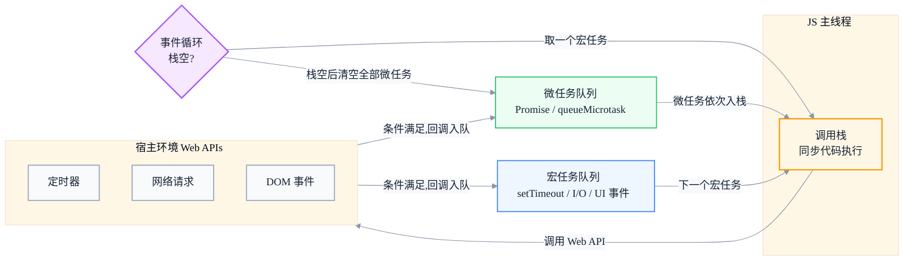
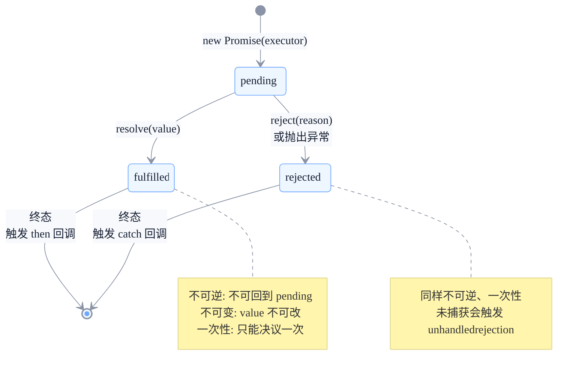
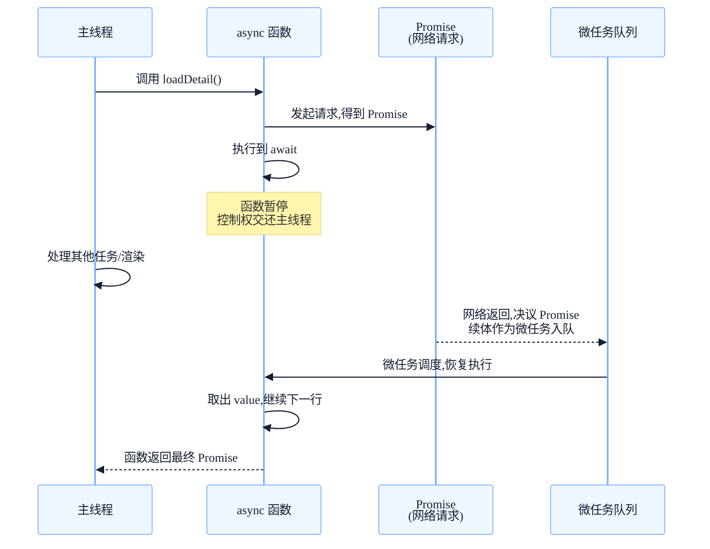

# 异步编程的演进：从回调地狱到 async/await

> 副标题：从单线程事件循环、宏任务与微任务调度、回调信任问题、Promise 状态机到 async/await 执行模型
>
> 目标读者：中高级前端工程师、前端架构师
>
> 阅读时间：约 26 分钟

::: info 一句话
JavaScript 异步编程的每一次演进，本质上都是在解决同一个问题——"如何在不阻塞主线程的前提下，可靠地表达'以后会发生的事'"。
:::

## 目录

- [写在前面](#写在前面)
- [一、单线程与事件循环：异步的物理基础](#一、单线程与事件循环-异步的物理基础)
- [二、宏任务与微任务：被忽略的执行顺序](#二、宏任务与微任务-被忽略的执行顺序)
- [三、回调时代：控制反转与信任问题](#三、回调时代-控制反转与信任问题)
- [四、Promise：从状态机角度理解](#四-promise-从状态机角度理解)
- [五、async/await：语法糖还是革命？](#五-async-await-语法糖还是革命)
- [六、异步错误处理的最佳实践](#六-异步错误处理的最佳实践)
- [七、常见异步陷阱与并发控制](#七-常见异步陷阱与并发控制)
- [结语：异步的本质是调度](#结语-异步的本质是调度)
- [FAQ](#faq)
- [来源](#来源)

## 写在前面

写异步代码是前端工程师的日常：请求接口、读本地存储、定时器、动画、消息通信……几乎都离不开"等一会儿再执行"。但能把异步写得正确、清晰、可靠的人并不算多。

很多问题看起来是"语法不熟"，其实是"模型不清"：

- 为什么 `setTimeout(fn, 0)` 不会立即执行？它到底排在谁后面？
- `Promise.then` 和 `setTimeout` 谁先执行？为什么？
- `forEach` 里写 `await` 为什么不生效？
- `async` 函数里的 `await` 到底"阻塞"了什么？它会卡住主线程吗？
- `Promise.all` 和 `Promise.allSettled` 在错误处理上有什么本质区别？

要回答这些问题，必须先理解 JavaScript 单线程模型与事件循环，再理解回调为什么会有信任问题，Promise 如何用状态机解决它，最后看 async/await 又在 Promise 之上做了什么。本文沿这条演进主线展开。

::: tip 本节核心结论

异步编程的演进不是"语法越来越简洁"那么简单，而是从"回调传递控制权"到"Promise 用不可逆状态夺回控制权"，再到"async/await 让异步代码拥有同步的可读性"。每一次演进都在重新分配"谁掌握调度的主动权"。

:::

---

## 一、单线程与事件循环：异步的物理基础

JavaScript 是**单线程**的——它只有一个调用栈，同一时刻只能执行一段代码。这是历史选择：浏览器里 JS 要操作 DOM，多线程并发操作 DOM 会引发严重的同步问题，单线程是最简单也最安全的模型。

但单线程意味着：如果一个任务耗时长（比如等网络响应），整个页面就会"卡死"。于是 JavaScript 设计了**事件循环（Event Loop）** 机制，让"需要等待的任务"不占用调用栈——你把"等会儿要做的事"挂起来，等条件满足了再回来执行。

### 1. 事件循环的核心组件

事件循环依赖几个关键部分：

1. **调用栈（Call Stack）**：执行同步代码的地方，后进先出。
2. **宿主环境（浏览器/Node）**：提供 Web API，如定时器、网络请求、DOM 事件。这些 API 在底层往往是多线程的，但回调最终要回到 JS 单线程执行。
3. **任务队列（Task Queue）**：存放待执行的回调。
4. **事件循环（Event Loop）**：不断检查"调用栈是否为空"和"队列里是否有任务"，把就绪的任务推入调用栈执行。



### 2. 一次循环的执行流程

事件循环每一轮（tick）大致做这些事：

1. 从宏任务队列取出**一个**任务执行。
2. 执行过程中产生的所有微任务，在当前宏任务结束后**全部清空**。
3. 必要时进行 UI 渲染（浏览器会按刷新率决定是否渲染，约 16.67ms 一次）。
4. 回到第 1 步，取下一个宏任务。

```javascript
console.log('1. 同步开始')

setTimeout(() => {
  console.log('4. 宏任务 setTimeout')
}, 0)

Promise.resolve().then(() => {
  console.log('3. 微任务 Promise')
})

console.log('2. 同步结束')

// 输出顺序: 1 → 2 → 3 → 4
```

`setTimeout` 的回调进入宏任务队列，`Promise.then` 的回调进入微任务队列。同步代码（1、2）先执行完，然后清空微任务（3），最后才轮到下一个宏任务（4）。

::: tip 本节核心结论

JS 单线程 + 事件循环是异步的物理基础。同步代码在调用栈执行，异步回调被宿主环境托管，就绪后进入任务队列等待主线程空闲时执行。理解"队列"和"轮询"是理解一切异步行为的前提。

:::

::: warning 常见误区

认为 `setTimeout(fn, 0)` 会"立即"执行。实际上 0 只是"最早可执行时间"，回调仍要等当前同步代码和所有微任务执行完才会入栈，且浏览器有最小延迟钳制（HTML5 规范为 4ms，嵌套层级更深时更长）。

:::

---

## 二、宏任务与微任务：被忽略的执行顺序

任务队列其实不止一个，最重要的是**宏任务队列**和**微任务队列**。它们的调度时机不同，这正是大量"顺序诡异"问题的根源。

### 1. 谁是宏任务，谁是微任务

- **宏任务（Macrotask）**：`setTimeout` / `setInterval`、I/O 回调、UI 事件（click、scroll）、`postMessage`、`MessageChannel`、Node 的 `setImmediate` / `fs` 回调等。
- **微任务（Microtask）**：`Promise.then` / `catch` / `finally`、`queueMicrotask`、`MutationObserver`、Node 的 `process.nextTick`（优先级甚至高于普通微任务）。

### 2. 关键规则：微任务在"每个宏任务之后"清空

最容易被忽略的规则是：**每执行完一个宏任务，引擎会清空当前所有的微任务，然后才进入下一个宏任务**。这意味着微任务可以"插队"到下一个宏任务之前。

```javascript
setTimeout(() => {
  console.log('宏任务 A')
  Promise.resolve().then(() => console.log('  微任务 A1'))
}, 0)

setTimeout(() => {
  console.log('宏任务 B')
  Promise.resolve().then(() => console.log('  微任务 B1'))
}, 0)

// 输出:
// 宏任务 A
//   微任务 A1
// 宏任务 B
//   微任务 B1
```

每个宏任务执行后，紧跟着清空它产生的微任务，然后再取下一个宏任务。微任务永远不会跨宏任务"积压"到中间。

### 3. 渲染时机的位置

浏览器的渲染发生在宏任务之间、微任务清空之后。这意味着：如果你在一个宏任务里改了 DOM，紧接着用微任务继续改，浏览器可以在渲染前看到合并后的结果；但如果用 `setTimeout` 排程后续修改，浏览器可能在两次修改之间渲染一次，造成"闪烁"。

```javascript
// 用微任务批量更新，渲染前合并
function batchUpdate() {
  element.style.left = '10px'
  queueMicrotask(() => {
    element.style.left = '20px' // 渲染前生效，用户只看到 20px
  })
}
```

::: tip 本节核心结论

宏任务和微任务的核心差异是"调度时机"：宏任务一轮执行一个，微任务在一轮内全部清空。微任务总是先于下一个宏任务、也先于渲染执行。掌握这条规则，就能预测绝大多数异步代码的输出顺序。

:::

::: info 工程启示

需要"尽快但异步"执行的逻辑用 `queueMicrotask`；需要"让出主线程给渲染"的逻辑用 `setTimeout(fn, 0)` 或 `requestAnimationFrame`。两者不可混用。

:::

---

## 三、回调时代：控制反转与信任问题

在 Promise 出现之前，异步几乎只能靠回调：你把"以后要做的事"作为函数传给异步操作，由它在完成后调用你。

### 1. 控制反转

回调的本质是**控制反转（Inversion of Control）**：你不再掌控"何时调用、调用几次、用什么参数"，而是把这些控制权交给了第三方（一个库、一个 API、一段你不完全信任的代码）。

```javascript
// 你写的代码
asyncOperation(data, function callback(result) {
  updateUI(result) // 这个函数何时被调用，你说了不算
})
```

### 2. 回调的信任问题

Kyle Simpson 在《You Don't Know JS》里列出过回调面临的信任问题——你以为回调会按约定执行，但实际上第三方可能：

- 调用**太早**：在异步操作还没真正完成时就回调。
- 调用**太晚**：甚至永远不调用。
- 调用**次数太少或太多**：比如回调被触发 0 次或 3 次。
- **吞掉错误**：出错时不通知你。
- **参数不对**：传回意料之外的数据。

这些问题在真实工程里并不罕见：一个有 bug 的第三方库可能把成功回调调用两次，导致你的 UI 更新执行两遍；一个超时未处理的请求可能让你的 loading 永远不消失。

### 3. 回调地狱：嵌套与控制流丢失

当多个异步步骤有依赖关系时，回调只能层层嵌套：

```javascript
getUser(userId, function (err, user) {
  if (err) return handleError(err)
  getOrders(user.id, function (err, orders) {
    if (err) return handleError(err)
    getOrderDetail(orders[0].id, function (err, detail) {
      if (err) return handleError(err)
      renderDetail(detail)
    })
  })
})
```

这种"金字塔厄运"不只是难看，更致命的是：**控制流被切碎了**。错误处理要每层重复，无法统一；想在中间加一步或调整顺序，要重排整个嵌套结构；想在多步之间共享变量，只能靠闭包层层传递。

::: tip 本节核心结论

回调的问题不是"嵌套丑"，而是"控制权外流 + 信任不可控 + 控制流被切碎"。Promise 的出现正是为了夺回控制权，并用统一模型解决信任问题。

:::

::: warning 常见误区

认为"用命名函数代替匿名函数就能解决回调地狱"。命名函数只解决了可读性，没有解决控制反转和信任问题——回调被调用几次、何时调用，依然不受你控制。

:::

---

## 四、Promise：从状态机角度理解

理解 Promise 最好的方式不是把它当作"回调的语法糖"，而是把它看作一个**有限状态机**。

### 1. 三态与不可逆转换

一个 Promise 有三种状态：

- **pending（待定）**：初始状态，尚未决议。
- **fulfilled（已完成）**：操作成功，关联一个 value。
- **rejected（已拒绝）**：操作失败，关联一个 reason。

转换规则非常严格：

1. 只能从 pending → fulfilled，或 pending → rejected。**一旦决议，状态永远不可逆**。
2. 决议只能发生**一次**。再次 resolve / reject 会被静默忽略。



### 2. 状态机如何解决信任问题

回到回调时代的信任清单，你会发现状态机的规则正好逐条化解：

- **调用太多次**：状态不可逆 + 一次性决议，resolve 两次只有第一次生效。
- **调用太少/从不调用**：你可以用 `Promise.race` 加一个超时 Promise 来兜底。
- **调用太早**：Promise 的 then 回调**永远是异步的**（微任务），即使在 executor 里同步 resolve，回调也不会在当前 tick 同步执行，避免了"同步回调"的竞态。
- **吞掉错误**：rejection 会沿链传播，直到被 catch 捕获；完全未捕获时浏览器会触发 `unhandledrejection` 事件。

### 3. then 返回新 Promise：链式的本质

`then` 不会修改原 Promise，而是**返回一个新的 Promise**。这是链式调用的根基，也让 Promise 摆脱了"回调嵌套"：

```javascript
getUser(userId)
  .then((user) => getOrders(user.id))     // 返回新 Promise
  .then((orders) => getOrderDetail(orders[0].id))
  .then((detail) => renderDetail(detail))
  .catch((err) => handleError(err))        // 任意一步的 rejection 都会跳到这里

// 等价于一个被"拉平"的管道，而不是金字塔
```

- 如果 `then` 的回调返回一个 Promise，下一个 `then` 会等它决议。
- 如果返回普通值，下一个 `then` 会立即收到这个值。
- 如果抛出异常，链路进入 rejected 状态，跳到最近的 `catch`。

```javascript
Promise.resolve(1)
  .then((n) => n + 1)                       // 返回 2（普通值）
  .then((n) => Promise.resolve(n * 10))     // 返回 Promise，等它决议为 20
  .then((n) => { throw new Error('boom') }) // 进入 rejected
  .then((n) => console.log('不会执行'))      // 被跳过
  .catch((err) => console.log(err.message)) // 'boom'
```

::: tip 本节核心结论

Promise 是一个"状态不可逆 + 一次性决议 + 异步触发"的有限状态机。它通过状态规则夺回了回调失去的控制权，通过 `then` 返回新 Promise 实现了扁平化链式调用。理解状态机，才能理解 Promise 的错误传播和组合 API。

:::

::: warning 常见误区

认为 `.then(a).then(b)` 里 a、b 修改的是同一个 Promise。实际上每个 `then` 都返回一个**新的** Promise，原 Promise 决议后状态就固定了，链上的每一步都是独立的新 Promise。

:::

---

## 五、async/await：语法糖还是革命？

`async/await` 在 2017 年随 ES8 进入标准。表面看它是 Promise 的语法糖，但它对异步代码可读性和错误处理的影响是革命性的。

### 1. 它在 Promise 之上做了什么

- **`async` 函数总是返回 Promise**：如果你 return 一个普通值，它会被包成 `Promise.resolve(value)`；如果 return 一个 Promise，就直接用它；如果抛出异常，返回的 Promise 变为 rejected。
- **`await` 暂停当前 async 函数的执行**：等待右侧 Promise 决议，决议后把 value 取出来继续往下执行。**它不阻塞主线程**，暂停期间主线程可以去处理其他任务，函数的剩余部分被注册为微任务在决议后恢复。

```javascript
async function loadDetail(userId) {
  const user = await getUser(userId)        // 暂停，等 Promise 决议
  const orders = await getOrders(user.id)
  const detail = await getOrderDetail(orders[0].id)
  return renderDetail(detail)
}
```

这段代码读起来像同步，但实际执行是异步的——每个 `await` 处都把控制权交还给事件循环。

### 2. await 的执行时序



关键点：`await` 暂停的是**这个 async 函数**，不是主线程。暂停期间主线程完全可以响应用户输入、执行其他回调。函数的"剩余部分"在 Promise 决议后作为微任务恢复。

### 3. 为什么说它是革命

Promise 解决了信任和嵌套，但链式 `.then` 仍有几个痛点：变量作用域被切碎（每步只能拿到上一步的值，跨步共享变量要靠闭包）、控制流（条件、循环）难以表达、错误处理分散。

`async/await` 让你能在异步代码里直接用 `if` / `for` / `try` / `catch`：

```javascript
async function loadAll() {
  const list = await getList()
  const result = []
  for (const id of list) {
    // 循环里直接 await，串行加载
    result.push(await getItem(id))
  }
  return result
}
```

这段逻辑用纯 Promise 写会非常别扭——你需要手动递归或用 `reduce` 串起链。`async/await` 把"异步流程控制"还原成了最熟悉的同步控制流语法。

::: tip 本节核心结论

`async/await` 是 Promise 之上的语法糖，但它让异步代码获得了同步的可读性：变量作用域连贯、控制流（条件/循环）自然、错误处理统一。它的本质是用"函数暂停 + 微任务恢复"模拟了同步语义，但底层依然是 Promise 和事件循环。

:::

::: warning 常见误区

认为 `await` 会阻塞主线程。它只阻塞当前 async 函数的执行，主线程在等待期间是空闲的、可响应的。如果你在 await 一个很慢的操作时整个页面卡住，那一定是别处有同步长任务，而不是 await 本身的问题。

:::

---

## 六、异步错误处理的最佳实践

异步错误处理是事故高发区。核心原则：**错误必须被显式捕获，且永远不要静默吞掉**。

### 1. async/await 用 try/catch

```javascript
async function load() {
  try {
    const data = await fetch('/api/data').then((r) => r.json())
    return data
  } catch (err) {
    console.error('加载失败', err)
    notifyUser('加载失败，请重试')
    return null
  }
}
```

`await` 会把 Promise 的 rejection 转成抛出异常，所以 `try/catch` 能统一捕获 await 链上的错误。

### 2. 不要忘记 catch，但更不要静默吞掉

```javascript
// 反例：吞掉错误，永远不知道发生了什么
someAsync().catch(() => {})

// 反例：忘记 catch，unhandledrejection 静默累积
someAsync()
```

如果你确实要"忽略"某个错误，至少记一条日志，或把它转成一个语义明确的默认值：

```javascript
someAsync().catch((err) => {
  logger.warn('非关键操作失败', err)
  return null
})
```

### 3. 四种组合 API 的错误语义

理解 `all` / `allSettled` / `any` / `race` 的差异，是并发错误处理的关键：

| API | 成功条件 | 失败行为 | 适用场景 |
| --- | --- | --- | --- |
| `Promise.all` | 全部成功 | 任意一个失败即 reject（fail-fast） | 多个必须全部成功 |
| `Promise.allSettled` | 永远 resolve | 返回每个的状态描述符 | 想知道每一个的结果 |
| `Promise.any` | 任意一个成功 | 全部失败才 reject | 取最快成功的那个 |
| `Promise.race` | 第一个 settle | 第一个 settle（无论成败） | 超时/取消控制 |

```javascript
// allSettled: 即使部分失败也不丢信息
const results = await Promise.allSettled([
  fetch('/api/a'),
  fetch('/api/b'),
  fetch('/api/c'),
])
const ok = results.filter((r) => r.status === 'fulfilled').map((r) => r.value)
const failed = results.filter((r) => r.status === 'rejected')
```

::: tip 本节核心结论

异步错误处理三原则：用 try/catch 包裹 await；永不静默吞错（至少记日志）；按需选择 all / allSettled / any / race。其中 `allSettled` 最适合"部分失败也要继续"的场景。

:::

::: info 工程启示

在应用入口处注册一个全局 `unhandledrejection` 监听器，把所有未被捕获的 Promise 错误上报到监控平台。这是发现"忘记 catch"的最后一道防线。

:::

```javascript
window.addEventListener('unhandledrejection', (event) => {
  tracker.report({
    type: 'unhandled_promise_rejection',
    reason: event.reason,
  })
})
```

---

## 七、常见异步陷阱与并发控制

### 1. forEach 不等待 await

`Array.prototype.forEach` 不会等待回调里的 `await`，因为它本质上不关心回调返回的 Promise：

```javascript
// 反例:三个请求几乎同时发出,且函数不会等待
async function wrong() {
  [1, 2, 3].forEach(async (id) => {
    await getItem(id) // forEach 不会等这个 await
  })
  console.log('done') // 几乎立即打印,而请求还在飞
}
```

正确做法用 `for...of`（串行）或 `Promise.all`（并行）：

```javascript
// 串行:一个完成再下一个
async function sequential() {
  for (const id of [1, 2, 3]) {
    await getItem(id)
  }
  console.log('done') // 全部完成后才打印
}

// 并行:同时发出,全部等待
async function parallel() {
  await Promise.all([1, 2, 3].map((id) => getItem(id)))
  console.log('done')
}
```

### 2. 串行 vs 并行：别用 await 把能并行的拖成串行

```javascript
// 反例:三个独立请求被拖成串行,总耗时 = a + b + c
async function slow() {
  const a = await fetchA()
  const b = await fetchB()
  const c = await fetchC()
  return { a, b, c }
}

// 正例:同时发起,总耗时 ≈ max(a, b, c)
async function fast() {
  const [a, b, c] = await Promise.all([fetchA(), fetchB(), fetchC()])
  return { a, b, c }
}
```

只有当请求之间**有依赖**时才需要串行 `await`；彼此独立就该用 `Promise.all` 并行。

### 3. 并发限流：用 Promise 池控制

当任务数量很大（比如批量请求 1000 个 URL），`Promise.all` 会瞬间发出 1000 个请求，可能压垮服务端或触发浏览器并发上限。需要一个并发限流器：

```javascript
async function mapWithConcurrency(items, limit, worker) {
  const results = new Array(items.length)
  let cursor = 0
  const runners = new Array(Math.min(limit, items.length))
    .fill(0)
    .map(async () => {
      while (cursor < items.length) {
        const index = cursor++
        results[index] = await worker(items[index], index)
      }
    })
  await Promise.all(runners)
  return results
}

// 最多 5 个并发
const data = await mapWithConcurrency(urls, 5, (url) =>
  fetch(url).then((r) => r.json())
)
```

### 4. 忘记 await：fire-and-forget 的隐患

```javascript
async function save() {
  // 忘记 await,错误不会进 try/catch,函数立即返回
  syncToRemote()
  return 'saved'
}
```

`syncToRemote` 返回的 Promise 没有被 `await`，它的 rejection 不会进入 `save` 的 try/catch，而是变成 unhandledrejection。如果你确实要"发后即忘"，至少 `.catch` 一下：

```javascript
syncToRemote().catch((err) => tracker.report(err))
```

::: tip 本节核心结论

并发控制要点：`forEach` 不等待 await，要用 `for...of` 或 `Promise.all`；独立任务用 `Promise.all` 并行，有依赖才串行；大批量任务用并发限流器控制；任何 fire-and-forget 的 Promise 都要 `.catch`，避免静默 rejection。

:::

---

## 结语：异步的本质是调度

把演进主线串起来：

1. **单线程 + 事件循环**是异步的物理基础：调用栈执行同步代码，宿主环境托管异步操作，就绪回调排队等主线程空闲。
2. **宏任务与微任务**的调度时机决定了执行顺序：宏任务一轮一个，微任务在一轮内全部清空，渲染夹在两者之间。
3. **回调**通过控制反转完成异步，但带来了信任问题（调用次数、时机、错误）和回调地狱（控制流被切碎）。
4. **Promise** 用"不可逆 + 一次性 + 异步触发"的状态机夺回控制权，用 `then` 返回新 Promise 实现扁平链式。
5. **async/await** 在 Promise 之上恢复了同步语义：变量连贯、控制流自然、错误统一，但底层依然是 Promise 和微任务。

> **异步编程的每一次演进，本质上都是在回答同一个问题——"谁掌握调度的主动权"。从交出控制权的回调，到用状态机夺回控制权的 Promise，再到让开发者用同步思维写异步的 async/await。**

理解了调度，你就不再需要死记"谁先谁后"的输出题——你能从模型本身推出一切。

---

## FAQ

### 1. `setTimeout(fn, 0)` 和 `Promise.then(fn)` 谁先执行？

`Promise.then` 先执行。`setTimeout` 的回调进入宏任务队列，`Promise.then` 的回调进入微任务队列。每个宏任务执行完后会清空所有微任务，然后才取下一个宏任务。所以即使两者都"立即"排程，微任务也总是先于下一个宏任务执行。

### 2. `await` 会阻塞主线程吗？

不会。`await` 只暂停当前 async 函数的执行，把控制权交还给主线程。等待期间主线程可以处理其他任务、响应用户输入、执行渲染。函数的剩余部分作为微任务，在等待的 Promise 决议后恢复。如果你发现页面卡住，问题在于别处的同步长任务，而非 await 本身。

### 3. 为什么 `forEach` 里的 `await` 不生效？

`forEach` 的实现不关心回调返回值（包括 Promise），它同步地把每个元素交给回调后就立即返回。所以回调里的 `await` 只暂停了那个回调函数，不会暂停 `forEach` 本身。需要串行用 `for...of`，需要并行用 `Promise.all` 配合 `map`。

### 4. `Promise.all` 和 `Promise.allSettled` 有什么本质区别？

`Promise.all` 是 fail-fast：任意一个 Promise 失败，整个 `all` 立即 reject，其余结果被忽略。`Promise.allSettled` 永远 resolve，返回一个数组，每个元素描述对应 Promise 的状态（fulfilled/rejected）和值。需要"部分失败也要继续处理成功结果"时用 `allSettled`；需要"要么全成功要么整体失败"时用 `all`。

### 5. 如何让 1000 个异步任务不压垮服务端？

用并发限流器控制同时在途的任务数（如 5~10）。核心思路是维护一个固定大小的"运行池"，每个 worker 完成一个任务后从队列取下一个，直到队列清空。手写实现可用上面的 `mapWithConcurrency`，或使用 `p-limit` 等成熟库。

---

## 来源

1. MDN 关于事件循环、Promise、async/await 的文档：[MDN Using promises](https://developer.mozilla.org/zh-CN/docs/Web/JavaScript/Guide/Using_promises)、[MDN async function](https://developer.mozilla.org/zh-CN/docs/Web/JavaScript/Reference/Statements/async_function)
2. Kyle Simpson《You Don't Know JS》关于异步与性能、回调信任问题的讨论
3. HTML 规范关于事件循环与任务队列的定义：[HTML Standard Event loops](https://html.spec.whatwg.org/multipage/webappapis.html#event-loops)
4. ECMAScript 规范关于 Promise 与 async/await 的语义：[ECMA-262 Promises](https://tc39.es/ecma262/#sec-promise-objects)
5. 本文基于公开技术文档（MDN、ECMAScript/HTML 规范、《You Don't Know JS》）和作者工程实践总结。
