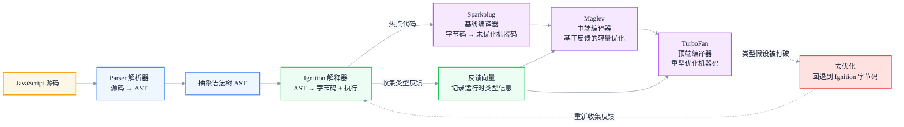
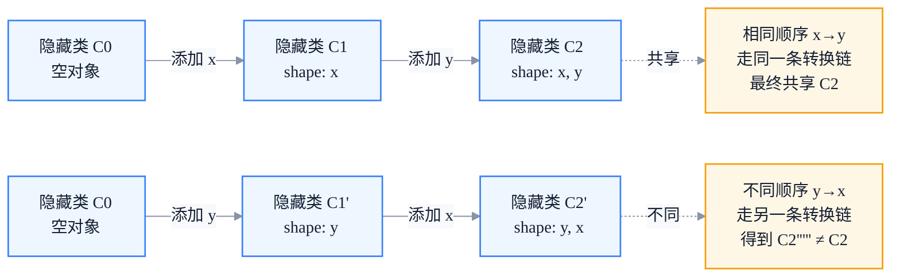
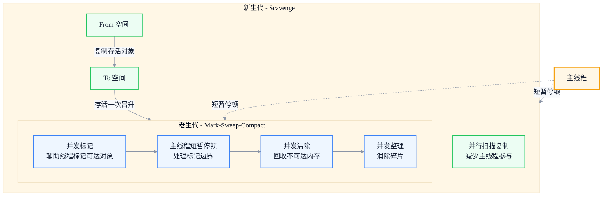

# V8 引擎揭秘：JIT 编译与垃圾回收机制

> 副标题：从 V8 编译流水线、分层 JIT、隐藏类与内联缓存到分代垃圾回收与 Orinoco 算法
>
> 目标读者：中高级前端工程师、前端架构师、性能优化负责人
>
> 阅读时间：约 28 分钟

::: info 一句话
V8 的性能秘诀不是某个"魔法优化"，而是一套分层 JIT + 隐藏类 + 内联缓存 + 分代 GC 的协作系统——你的代码风格决定了它能不能走"快速路径"。
:::

## 目录

- [写在前面](#写在前面)
- [一、V8 整体架构：从源码到机器码的流水线](#一、v8-整体架构-从源码到机器码的流水线)
- [二、JIT 编译：解释器与编译器的混合模式](#二、jit-编译-解释器与编译器的混合模式)
- [三、隐藏类（Hidden Class）：对象 shape 的内部表示](#三、隐藏类-hidden-class-对象-shape-的内部表示)
- [四、内联缓存（Inline Cache）：让属性访问走快路径](#四、内联缓存-inline-cache-让属性访问走快路径)
- [五、垃圾回收：分代回收与 Orinoco 算法](#五、垃圾回收-分代回收与-orinoco-算法)
- [六、常见性能反模式](#六、常见性能反模式)
- [七、用 DevTools 分析 V8 行为](#七、用-devtools-分析-v8-行为)
- [结语：写给 V8 的代码，是配合它的快速路径](#结语-写给-v8-代码-是配合它的快速路径)
- [FAQ](#faq)
- [来源](#来源)

## 写在前面

前端性能讨论里，"V8"是个高频词：JIT、隐藏类、内联缓存、GC 停顿、去优化……但这些词背后的机制到底如何运转，能讲清楚的人不多。结果是很多优化建议变成"听来的口诀"——"别用 delete""别用 arguments""对象别乱加属性"——却说不清为什么。

本文要做的事，是把 V8 的核心机制串成一个完整模型，让你能回答：

- V8 把源码变成机器码，到底经过哪几层？为什么需要这么多层？
- 为什么两个看起来一样的对象，一个快一个慢？什么是"隐藏类"？
- 为什么同一个函数，调用几次后突然变快，又可能在某次调用后突然变慢（去优化）？
- GC 到底在什么时候停顿主线程？分代回收和 Orinoco 算法解决了什么？
- 我该怎么用 DevTools 看到 V8 在对我的代码做什么？

理解了这些，你写出的代码就能"配合 V8 的快速路径"，而不是和它对着干。

::: tip 本节核心结论

V8 的性能来自分层 JIT（Ignition 解释 + Sparkplug/Maglev/TurboFan 编译）、隐藏类（统一对象 shape）、内联缓存（缓存属性查找）和分代 GC（针对短命对象优化）的协作。绝大多数"性能反模式"的本质，都是破坏了这些机制赖以工作的前提（shape 一致、类型稳定、对象短命）。

:::

---

## 一、V8 整体架构：从源码到机器码的流水线

V8 是 Google 开发的 JavaScript 与 WebAssembly 引擎，用于 Chrome、Node.js、Deno 等。它执行 JavaScript 的核心流水线可以概括为：**源码 → AST → 字节码 → 执行 →（热点代码）→ 优化机器码**。

### 1. 核心阶段



1. **解析（Parsing）**：Parser 把源码文本解析成**抽象语法树（AST）**。V8 有懒解析（lazy parsing）——先只解析函数外壳，函数真正被调用时才完整解析函数体，从而加快启动。
2. **字节码生成与解释执行（Ignition）**：Ignition 把 AST 编译成字节码，并解释执行。字节码是平台无关的中间表示，启动快、内存占用小。Ignition 同时负责**收集类型反馈**——记录运行时观察到的对象 shape、参数类型等，存进"反馈向量"。
3. **基线编译（Sparkplug）**：对热点字节码，Sparkplug 快速生成未优化的机器码，省去解释开销，编译速度远快于 TurboFan。这是 2021 年引入的层级，填补"解释"与"重型优化"之间的空档。
4. **中端编译（Maglev）**：基于类型反馈做轻量优化的机器码，编译速度和优化程度都介于 Sparkplug 与 TurboFan 之间（2023 年起逐步成熟）。
5. **顶端优化（TurboFan）**：基于充足类型反馈做重型优化——内联、逃逸分析、隐藏类特化等，生成高度优化的机器码。编译耗时最长，因此只对真正的热点代码启用。
6. **去优化（Deoptimization）**：如果 TurboFan 编译时基于的类型假设在运行时被打破（比如传入了不同 shape 的对象），V8 会丢弃优化机器码，**回退到 Ignition 字节码继续执行**，并重新收集反馈，可能再次触发优化。

### 2. 为什么要这么多层

这是经典的工程权衡：

- **全 AOT 编译**（启动前编译所有代码）启动太慢、内存太大——浏览器场景对启动延迟极其敏感。
- **纯解释执行**启动快，但热点代码反复解释，运行时太慢。
- **分层 JIT** 让代码"先用解释快速跑起来，热了再逐级加码优化"，在启动速度和运行性能之间取得平衡。

::: tip 本节核心结论

V8 的流水线是"解析 → Ignition 字节码解释 → Sparkplug → Maglev → TurboFan"的分层 JIT。解释器保证启动快，编译器保证热点代码运行快，类型反馈串联各级，去优化保证正确性。理解这条流水线，才能理解"为什么代码跑几次后会变快/变慢"。

:::

::: warning 常见误区

认为 V8 会一次性把整段代码全部编译成机器码。实际上 V8 是惰性的：先解释执行，只有被判定为"热点"的代码才会逐级进入编译器。冷代码可能始终停留在字节码阶段。

:::

---

## 二、JIT 编译：解释器与编译器的混合模式

**JIT（Just-In-Time，即时编译）** 指"在运行时把代码编译成机器码"，区别于 AOT（运行前编译）和纯解释（不编译）。V8 的 JIT 是解释器 + 多级编译器的混合模式。

### 1. 解释器与编译器的分工

- **Ignition（解释器）**：执行字节码，启动快、内存省，但每条字节码都要经历"取指 → 解码 → 分发 → 执行"的开销。
- **编译器（Sparkplug/Maglev/TurboFan）**：把字节码翻译成原生机器码，执行时直接跑，省去解释开销，但编译本身耗时耗内存。

V8 用**热点检测（tiering）** 决定何时升级：Ignition 为每段字节码维护一个调用计数 / 回边计数，超过阈值就触发下一级编译。

### 2. 类型反馈：JIT 优化的燃料

JavaScript 是动态类型语言，同一段代码可能处理各种类型。JIT 优化的关键策略是**乐观特化（optimistic specialization）**：基于运行时观察到的类型，生成针对该类型的高速机器码。

```javascript
function add(a, b) {
  return a + b
}
// 如果历史上 a、b 一直是整数，TurboFan 会特化成整数加法机器码
add(1, 2)
add(3, 4)
// ...大量整数调用后,被优化为整数加法

// 突然传入字符串,整数特化的假设被打破 → 去优化,回退字节码
add('x', 'y')
```

Ignition 在执行时把这些观察写进**反馈向量（Feedback Vector）**——它记录"这个加法运算见过哪些类型""这个属性访问见过哪些隐藏类"等。编译器读这些反馈来决定如何特化。

### 3. 去优化：正确性优先

乐观特化意味着假设。一旦假设被打破，V8 必须**去优化**——丢弃机器码，回到字节码继续执行。去优化保证了语义正确，但代价是性能骤降（一次去优化可能让热点函数瞬间慢几倍），之后 V8 会重新收集反馈并尝试再次优化。


::: tip 本节核心结论

JIT 的核心是"乐观特化 + 类型反馈 + 去优化"：基于运行时观察到的类型生成特化机器码，假设被打破就回退。所以保持类型/shape 稳定，是让热点函数留在优化路径的关键——这正是后面"隐藏类"和"内联缓存"要服务的目标。

:::

::: info 工程启示

避免在热点函数里"混用类型"——同一函数既处理数字又处理字符串、既处理对象 A 又处理对象 B，会让反馈向量变得多态甚至超态，触发去优化或阻碍特化。

:::

---

## 三、隐藏类（Hidden Class）：对象 shape 的内部表示

动态类型语言的痛点是：对象属性布局在运行时才知道，访问属性只能靠哈希查找，慢。V8 用**隐藏类（Hidden Class，内部称 Map）** 来解决这个问题。

### 1. 什么是隐藏类

隐藏类描述了一个对象的"shape"——它有哪些属性、这些属性在内存里的存储偏移量。**shape 相同的对象共享同一个隐藏类**。有了隐藏类，V8 就能用"隐藏类 + 偏移量"直接定位属性，而不必每次哈希查找。

```javascript
function Point(x, y) {
  this.x = x
  this.y = y
}

const p1 = new Point(1, 2)
const p2 = new Point(3, 4)
// p1、p2 以相同顺序添加相同属性 → 共享同一个隐藏类
```

### 2. 隐藏类转换（Transition）

每次给对象**新增属性**时，V8 不会原地修改隐藏类，而是沿着"转换链（transition chain）"创建一个新隐藏类：



这意味着：**属性添加顺序不同，会产生不同的隐藏类**，即使最终属性集相同。

```javascript
function A() {}
const a1 = new A()
a1.x = 1
a1.y = 2 // 转换链: {} → {x} → {x,y}

const a2 = new A()
a2.y = 1
a2.x = 2 // 转换链: {} → {y} → {y,x}

// a1 和 a2 属性相同,但顺序不同 → 隐藏类不同!
```

### 3. 何时会掉入"慢模式"

下列操作会破坏隐藏类共享或迫使 V8 退化：

- **`delete` 删除属性**：会打破 shape 一致性，V8 可能把对象降级为"字典模式"（慢属性，哈希查找）。
- **属性数量过多**：超过一定阈值后，V8 改用字典存储以节省内存，访问变慢。
- **动态添加顺序不一致**：如上例，产生不同隐藏类。
- **索引型属性（数组元素）与命名属性混合大量使用**：影响 fast elements 路径。

::: tip 本节核心结论

隐藏类是 V8 让动态语言获得静态布局性能的关键：相同 shape 的对象共享隐藏类，属性访问变成"隐藏类 + 偏移量"的快速操作。保持"构造函数里一次性、按相同顺序初始化所有属性"，是让对象留在快路径的核心准则。

:::

::: warning 常见误区

认为"少创建对象就够了"。其实对象数量不是主要问题，**对象 shape 的一致性**才是。1000 个 shape 一致的对象比 1000 个 shape 各异的对象快得多，因为前者能共享隐藏类并命中内联缓存。

:::

---

## 四、内联缓存（Inline Cache）：让属性访问走快路径

隐藏类解决了"对象布局"问题，但每次访问属性还是要"查隐藏类 → 找偏移"。**内联缓存（Inline Cache，IC）** 把这个查找结果缓存下来，让重复访问接近"直接取值"。

### 1. IC 的工作方式

V8 在每个属性访问点（字节码位置）维护一个 IC 槽，记录"上次访问时对象的隐藏类 + 属性偏移"。下次访问时：

1. 取当前对象的隐藏类。
2. 与 IC 缓存的隐藏类比对。
3. 命中 → 直接用缓存的偏移取值（极快）。
4. 未命中 → 走慢路径查找，并更新缓存。

### 2. IC 的状态机

IC 有几个状态，状态越靠后，性能越差：

| 状态 | 含义 | 性能 |
| --- | --- | --- |
| Uninitialized | 还没访问过 | — |
| Monomorphic | 只见过 1 种隐藏类 | 最快（命中快路径） |
| Polymorphic | 见过 2~4 种隐藏类 | 较快（少量分支判断） |
| Megamorphic | 见过 >4 种隐藏类 | 最慢（退化为基础查找） |

```javascript
function readX(obj) {
  return obj.x
}

const A = { x: 1 } // 隐藏类 CA
const B = { x: 1, y: 2 } // 隐藏类 CB（shape 不同）
const C = { x: 1, z: 3 } // 隐藏类 CC

readX(A) // IC: monomorphic（CA）
readX(B) // IC: polymorphic（CA, CB）
readX(C) // IC: polymorphic（CA, CB, CC）
// ...传入 5 种以上不同 shape 的对象 → megamorphic,失去缓存价值
```

热点函数一旦进入 megamorphic，属性访问会显著变慢，且可能阻碍 TurboFan 特化。

### 3. 配合隐藏类的实践

让 IC 留在 monomorphic 的核心，是保证传入热点函数的对象**共享同一隐藏类**：

```javascript
// 正例:所有 point 对象 shape 一致,IC 始终 monomorphic
function makePoint(x, y) {
  return { x, y } // 字面量按固定顺序初始化
}
const points = Array.from({ length: 1000 }, (_, i) => makePoint(i, i))
points.forEach((p) => p.x) // 快

// 反例:shape 不一致,IC 退化
const mixed = [{ x: 1 }, { x: 1, y: 2 }, { x: 1, z: 3 }]
mixed.forEach((p) => p.x) // 多态,慢
```

::: tip 本节核心结论

内联缓存把"隐藏类 + 偏移"的查找结果缓存在访问点，使重复访问接近直接取值。IC 有 monomorphic → polymorphic → megamorphic 的退化路径——保持对象 shape 一致、让热点函数只处理少数 shape，是让 IC 留在快路径的关键。

:::

::: info 工程启示

如果一个热点函数处理多种数据来源（比如接口 A 返回 `{x,y}`、接口 B 返回 `{x,y,z}`），考虑在入口做一次"归一化"，统一成同一 shape，再交给热点函数处理，避免 IC 退化。

:::

---

## 五、垃圾回收：分代回收与 Orinoco 算法

V8 的**垃圾回收（Garbage Collection，GC）** 基于"分代假说"：**大多数对象朝生夕死，少数对象长期存活**。据此把堆分成**新生代**和**老生代**，用不同算法回收。

### 1. 新生代：Scavenge 与 Cheney 半空间复制

新生代存放短命对象，体积小、回收频繁。V8 用 **Cheney 半空间复制算法**：

1. 新生代分成两个等大的半空间：**From 空间**（当前分配）和 **To 空间**（空闲）。
2. GC 时，扫描 From 空间里存活的对象，**复制**到 To 空间，复制过程中紧凑排列。
3. 复制完，From 与 To 角色互换。
4. **经历过一次 Scavenge 仍存活的对象，晋升（promote）到老生代**。

复制算法的优点是速度快、无碎片；缺点是空间利用率只有一半，但新生代本就小（几 MB 到几十 MB），可接受。

### 2. 老生代：标记清除 + 标记整理

老生代存放长期存活的对象，体积大。复制算法对大空间不划算（复制成本高、浪费一半空间），所以老生代用**标记-清除（Mark-Sweep）+ 标记-整理（Mark-Compact）**：

1. **标记**：从根（全局、栈、寄存器）出发，遍历对象图，标记所有可达对象。
2. **清除**：回收不可达对象占用的内存。
3. **整理**（必要时）：移动存活对象紧凑排列，消除碎片。

### 3. Orinoco：减少停顿的并发/并行 GC

早期 GC 是"全停顿（stop-the-world）"的——回收时主线程完全暂停，大对象多时停顿可达几十毫秒，造成卡顿。**Orinoco** 是 V8 的渐进式 GC 项目，通过并发和并行把停顿压到毫秒级：



- **并行 Scavenge**：多个辅助线程并行参与新生代复制，减少主线程开销。
- **并发标记（Concurrent Marking）**：标记工作大部分由后台辅助线程并发完成，主线程只在关键点短暂停顿。
- **并发清除 / 并发整理**：清除和整理也尽量并发进行。
- **增量标记（Incremental Marking）**：把一次长标记拆成多次小步，穿插在主线程执行间隙，避免单次长停顿。

::: tip 本节核心结论

V8 GC 基于"分代假说"：新生代用半空间复制（Scavenge），老生代用标记清除/整理。Orinoco 通过并发标记、并行 Scavenge、增量标记把停顿压到毫秒级。但 GC 压力仍取决于你制造了多少短命对象——高频路径里少制造临时对象，能直接降低 GC 频率。

:::

::: warning 常见误区

认为"GC 停顿是浏览器的事，开发者管不了"。实际上 GC 频率和停顿时长直接受代码影响：高频创建短命对象会频繁触发 Scavenge，大量长寿命对象进入老生代会增加标记成本。控制对象生命周期是开发者能做的最有效 GC 优化。

:::

---

## 六、常见性能反模式

把前几节串起来，就能理解为什么这些写法是反模式——它们破坏了 shape 一致性、类型稳定性或对象生命周期。

### 1. `delete` 删除属性

`delete` 会打破隐藏类，可能让对象退化为字典模式，并使相关 IC 失效。

```javascript
// 反例
function makePoint(x, y) {
  const p = { x, y }
  return p
}
const p = makePoint(1, 2)
delete p.y // p 的隐藏类变化,IC 退化

// 正例:用 null 占位或重新设计数据结构
p.y = null
```

### 2. 不同顺序初始化属性

构造函数或字面量里属性顺序不一致，会产生不同隐藏类，让 IC 变成 polymorphic。

```javascript
// 反例
function bad(a) {
  if (a) return { x: 1, y: 2 }
  return { y: 2, x: 1 } // 顺序不同,隐藏类不同
}

// 正例:始终用同一种顺序,最好通过同一个构造函数
function Point(x, y) {
  this.x = x
  this.y = y
}
```

### 3. 热点函数混用类型

```javascript
// 反例:同一个热点函数处理多种 shape
function process(item) {
  return item.value * 2
}
process({ value: 1 }) // shape A
process({ value: 1, tag: 'x' }) // shape B → IC 多态

// 正例:归一化后再处理
const normalized = { value: raw.value }
process(normalized) // 始终 shape A
```

### 4. 高频路径制造短命对象

```javascript
// 反例:动画每帧创建新对象,加大 GC 压力
function animate() {
  const state = { x: 0, y: 0, vx: 1, vy: 1 } // 每帧新建
  // ...
  requestAnimationFrame(animate)
}

// 正例:复用对象
const state = { x: 0, y: 0, vx: 1, vy: 1 }
function animate() {
  state.x += state.vx
  state.y += state.vy
  // ...
  requestAnimationFrame(animate)
}
```

### 5. 超大数组与稀疏数组

稀疏数组（大量空洞）或超大数组会脱离 fast elements 路径，退化为字典元素。避免用对象当稀疏映射，必要时用 `Map`。

::: tip 本节核心结论

性能反模式的共同本质：破坏隐藏类一致性（delete、顺序不一致）、破坏类型稳定性（混用 shape）、放大对象生命周期成本（高频新建短命对象）。优化方向是"shape 一致、类型稳定、对象复用"。

:::

---

## 七、用 DevTools 分析 V8 行为

理论要能落到观察上。Chrome DevTools 提供了几个直接观察 V8 行为的入口。

### 1. Performance 面板：看 JS 执行与 GC

录制一段交互后，在火焰图里关注：

- **黄色 Evaluate Script / Function Call 块**：JS 执行耗时。大块连续黄色通常是长任务，会阻塞交互。
- **紫色 Recalculate Style / Layout 块**：样式与布局成本（与渲染管线相关）。
- **绿色 GC 块（带垃圾箱图标）**：GC 停顿。频繁出现或单次较长，说明短命对象过多。
- **黄色 Deopt 相关日志**：可在 Performance 的 "Bottom-Up" 里定位热点函数。

### 2. Memory 面板：看堆与分配

- **Heap snapshot（堆快照）**：拍快照后按 Retained Size 排序，找出占内存最大的对象类型（`(array)`、`(string)`、`(system)`、闭包等）。对比两次快照可定位增长对象。
- **Allocation timeline（分配时间线）**：实时看对象分配，蓝色柱表示分配、灰色表示被回收。频繁蓝柱不回收说明短命对象多或泄漏。
- **Allocation sampling（分配采样）**：按函数采样分配，定位是哪个函数在制造对象。

### 3. 观察优化与去优化

在 Performance 面板勾选对应选项，或用 `node --trace-opt --trace-deopt`（Node 环境）能看到哪些函数被优化、何时去优化及原因：

```bash
# Node 里追踪优化与去优化
node --trace-opt --trace-deopt app.js
```

输出会标注如 `[optimizing: ...]` 和 `[deoptimizing: ...]`，配合"reason"字段能定位到具体的 shape / 类型不一致。

::: tip 本节核心结论

分析 V8 行为的三件套：Performance 面板看长任务与 GC 停顿，Memory 面板看堆占用与分配热点，`--trace-opt --trace-deopt` 看优化/去优化原因。性能优化要先观察定位，再动手改代码。

:::

::: info 工程启示

优化的标准流程是"先复现 → 再测量 → 后优化"。先用 Performance 录制真实交互，找到占比最大的黄色/紫色/绿色块，针对性优化，再用同一指标验证收益。避免凭直觉优化没瓶颈的代码。

:::

---

## 结语：写给 V8 的代码，是配合它的快速路径

把全文串起来：

1. V8 用**分层 JIT**（Parser → Ignition → Sparkplug → Maglev → TurboFan）在启动速度和运行性能之间权衡，靠类型反馈串联各级，靠去优化保证正确性。
2. **隐藏类**让动态对象获得静态布局，shape 相同的对象共享隐藏类，属性访问变成"隐藏类 + 偏移"的快速操作。
3. **内联缓存**把属性查找结果缓存下来，让重复访问接近直接取值；IC 有 monomorphic → polymorphic → megamorphic 的退化路径。
4. **GC** 基于"分代假说"——新生代半空间复制，老生代标记清除/整理；Orinoco 用并发/并行/增量把停顿压到毫秒级。
5. 绝大多数反模式（delete、顺序不一致、混用类型、高频新建短命对象）的本质，都是破坏了这些机制赖以工作的前提。

> **写给 V8 的好代码，不是"少写几行"的代码，而是配合它快速路径的代码：shape 一致、类型稳定、对象生命周期可控。理解了 V8，你就理解了 JavaScript 性能优化的底层语法。**

---

## FAQ

### 1. 为什么同一个函数调用几次后会变快，又可能突然变慢？

调用几次后变快，是因为 V8 把热点字节码逐级编译成了优化机器码（Sparkplug → Maglev → TurboFan），省去解释开销。突然变慢通常是因为**去优化**——运行时传入的对象 shape 或类型打破了编译时的乐观假设，V8 丢弃机器码回退到字节码，性能骤降。用 `--trace-deopt` 能看到具体原因。

### 2. `delete` 一个属性到底有什么坏处？

`delete` 会改变对象的 shape，触发隐藏类转换，可能让对象退化为"字典模式"（属性改为哈希存储），并使相关位置的内联缓存失效。如果该对象在热点路径上，性能会明显下降。需要"标记删除"时，用 `obj.x = null` 占位通常比 `delete` 更友好。

### 3. 隐藏类和"构造函数"是什么关系？

构造函数本身不直接等于隐藏类，但通过同一个构造函数、按相同顺序初始化属性创建的对象，会沿着同一条转换链到达同一个隐藏类，从而共享。换句话说，构造函数是"保证 shape 一致"的工程手段——用构造函数创建对象，比散落的字面量更容易保持 shape 一致。

### 4. GC 停顿能不能完全消除？

不能完全消除，但 Orinoco 已经把它压到很低。并发标记、并行 Scavenge、增量标记让大部分 GC 工作在后台线程完成，主线程只在关键点短暂停顿（通常毫秒级）。开发者能做的是减少短命对象的产生速率，降低触发 GC 的频率，而不是试图"不创建对象"。

### 5. 怎么快速判断我的代码有没有掉进慢路径？

用 Performance 面板录制：看是否有频繁的绿色 GC 块（短命对象过多）、是否有大块连续黄色长任务（热点函数慢或去优化）、是否有紫色 Layout 频繁出现（布局抖动）。再用 Memory 的 Allocation sampling 定位是哪个函数在制造对象。最后用 `--trace-deopt` 确认是否频繁去优化。

---

## 来源

1. V8 官方博客关于 Ignition、TurboFan、Sparkplug、Maglev、Orinoco 的文章：[V8 Dev blog](https://v8.dev/blog)
2. V8 官方文档关于隐藏类、内联缓存、垃圾回收的说明：[v8.dev](https://v8.dev/docs)
3. MDN 关于 JavaScript 性能与内存管理的文档：[MDN Memory Management](https://developer.mozilla.org/zh-CN/docs/Web/JavaScript/Memory_Management)
4. Chrome DevTools 关于 Performance / Memory 面板的官方文档：[Chrome DevTools](https://developer.chrome.com/docs/devtools/)
5. 本文基于公开技术文档（V8 官方博客与文档、MDN、Chrome DevTools 文档）和作者工程实践总结。
