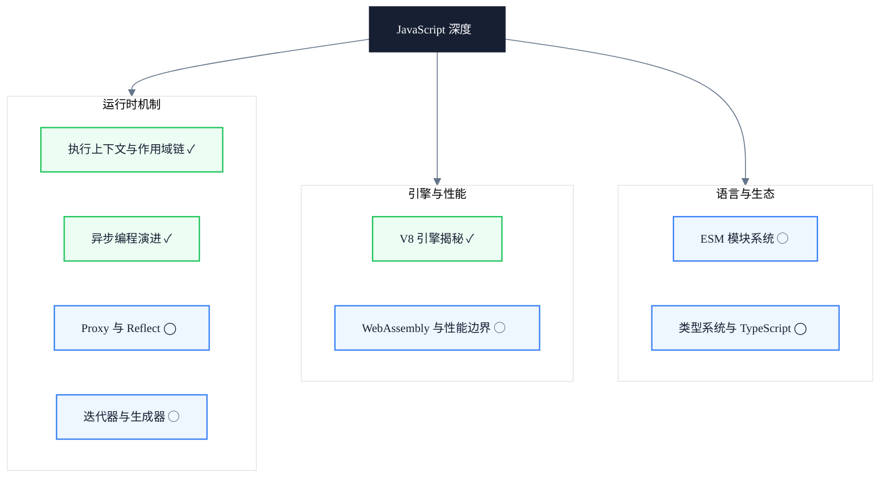

# JavaScript 深度

> 副标题：从执行上下文到 V8 引擎，理解代码在运行时真实发生的每一件事

## 模块定位

JavaScript 是前端工程师每天使用的语言，但"会用"和"理解"之间隔着一条巨大的鸿沟。本模块不停留在语法层面，而是深入 V8 引擎的执行机制：执行上下文如何创建、作用域链如何形成、闭包在内存中如何存续、异步任务如何在事件循环中调度、JIT 如何优化热点代码、GC 如何回收内存。

理解这些底层机制，才能写出可预测性能的代码，才能在排查闭包泄漏、内存暴涨、长任务卡顿等问题时知道从哪里下手。

本模块把"语法会用了"升级为"机制看透了"，让每一行 JS 代码的运行时行为都可被推理、可被定位、可被优化。

---

## 知识地图

---

## 核心主题

- ✓ **执行上下文与作用域链**：执行上下文创建、作用域链形成、变量环境与词法环境、闭包本质
- ✓ **异步编程演进**：事件循环、宏任务与微任务、Promise 链、async/await 的设计与陷阱
- ✓ **V8 引擎揭秘**：Ignition 字节码、Sparkplug / Maglev / TurboFan JIT 层级、隐藏类与 GC 机制
- ◯ **ESM 模块系统**：模块解析、依赖图构建、Tree Shaking、动态导入与顶层 await
- ◯ **类型系统与 TypeScript**：结构类型、类型推导、声明文件、类型体操与编译期检查
- ◯ **WebAssembly 与性能边界**：WASM 执行模型、JS / WASM 互操作、适用场景与调用成本
- ◯ **Proxy 与 Reflect**：元编程能力、代理陷阱、响应式系统底座与性能权衡
- ◯ **迭代器与生成器**：可迭代协议、生成器执行机制、惰性计算与协程式控制流

---

## 学习路径

1. 先建立执行上下文与作用域链的认知，理解变量查找、闭包持有与内存存续
2. 进入异步编程演进，从回调地狱走到 async/await，理解事件循环的调度规则
3. 深入 V8 引擎，掌握字节码、JIT 分层与 GC 机制，建立运行时性能直觉
4. （规划中）扩展到 ESM 模块系统，理解模块解析、依赖图与 Tree Shaking
5. （规划中）探索 Proxy 与 Reflect，理解元编程能力与响应式系统的底座
6. （规划中）学习迭代器与生成器，掌握惰性计算与协程式控制流
7. （规划中）建立类型系统与 TypeScript 的认知，从结构类型到类型体操
8. （规划中）评估 WebAssembly 与性能边界，理解 JS / WASM 互操作与适用场景

---

## 文章导览

- [执行上下文与作用域链：从 V8 视角理解闭包本质](/javascript/execution-context-closure) — 闭包不是语法糖，而是词法环境的引用持有
- [异步编程的演进：从回调地狱到 async/await](/javascript/async-evolution) — Promise / Generator / async/await 的设计脉络与陷阱
- [V8 引擎揭秘：JIT 编译与垃圾回收机制](/javascript/v8-jit-gc) — 从字节码到 TurboFan，从 Scavenge 到 Mark-Compact

---

## 适用读者

- 中高级前端工程师，希望理解 JavaScript 运行时行为而非仅停留在语法层
- 性能优化工程师，需要排查内存泄漏、长任务、JIT 去优化等问题
- 框架开发者，需要评估不同 API 的运行时成本与 GC 压力

---

## 延伸资源

- [V8 官方博客](https://v8.dev/blog) — V8 引擎团队的深度技术文章，覆盖 JIT / GC / 优化策略
- [TC39 提案仓库](https://github.com/tc39/proposals) — JavaScript 语言标准的演进跟踪，了解提案阶段与进度
- [MDN JavaScript Guide](https://developer.mozilla.org/en-US/docs/Web/JavaScript/Guide) — 权威的语言参考与教程，覆盖语法与 API
- 书籍：《You Don't Know JS》by Kyle Simpson — 深入语言机制的系列丛书，覆盖作用域、闭包、this、异步等核心主题
