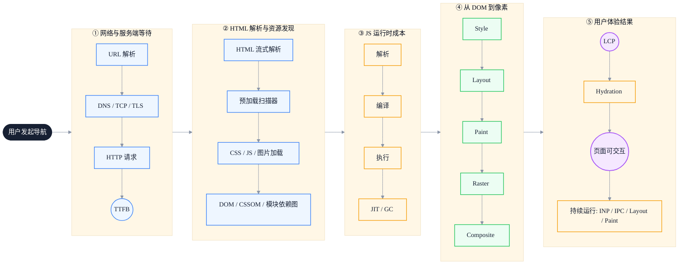
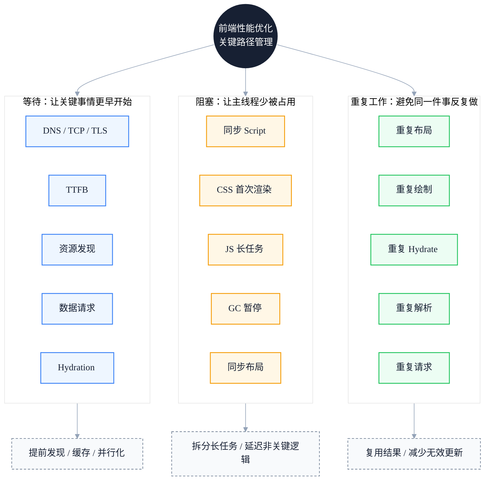

# 现代前端性能的底层链路：如何减少关键路径上的等待、阻塞与重复工作

> 副标题：从 TTFB、LCP、Hydration 到 ESM、JIT、GC、光栅化、IPC 与资源调度
>
> 目标读者：中高级前端工程师、前端架构师、性能优化负责人
>
> 阅读时间：约 25 分钟

::: info 一句话
现代前端性能优化的本质，是管理关键路径上的等待、阻塞与重复工作。
:::

## 目录

- [写在前面](#写在前面)
- [一、从“框架视角”升级到“浏览器链路视角”](#一、从-框架视角-升级到-浏览器链路视角)
- [二、第一段等待：TTFB 之前，浏览器已经做了很多事](#二、第一段等待-ttfb-之前-浏览器已经做了很多事)
- [三、资源发现：很多 LCP 慢，不是下载慢，而是发现晚](#三、资源发现-很多-lcp-慢-不是下载慢-而是发现晚)
- [四、HTTP/2、HTTP/3 改变了资源组织方式，但没有消灭关键路径](#四、http-2、http-3-改变了资源组织方式-但没有消灭关键路径)
- [五、HTML、CSS、JS 解析阶段本身就是性能战场](#五、html、css、js-解析阶段本身就是性能战场)
- [六、LCP 是结果指标，不是单个资源指标](#六、lcp-是结果指标-不是单个资源指标)
- [七、从 DOM 到像素：Layout、Paint、Raster、Composite 的真实成本](#七、从-dom-到像素-layout、paint、raster、composite-的真实成本)
- [八、光栅化不是抽象概念，而是 LCP 和动画性能的关键](#八、光栅化不是抽象概念-而是-lcp-和动画性能的关键)
- [九、JS 成本不只是执行，还包括解析、编译、JIT 和 GC](#九、js-成本不只是执行-还包括解析、编译、jit-和-gc)
- [十、GC 优化的重点不是“不创建对象”，而是控制生命周期](#十、gc-优化的重点不是-不创建对象-而是控制生命周期)
- [十一、模块运行时：浏览器正在接管过去 Bundler 的一部分职责](#十一、模块运行时-浏览器正在接管过去-bundler-的一部分职责)
- [十二、Hydration：SSR 的成本经常被低估](#十二、hydration-ssr-的成本经常被低估)
- [十三、INP：从“页面出现”走向“交互可靠”](#十三、inp-从-页面出现-走向-交互可靠)
- [十四、IPC 和多进程：浏览器内部协作也有成本](#十四、ipc-和多进程-浏览器内部协作也有成本)
- [十五、站点隔离和沙箱：安全架构也会影响性能模型](#十五、站点隔离和沙箱-安全架构也会影响性能模型)
- [十六、bfcache 和 Service Worker：减少重复加载和重复工作](#十六、bfcache-和-service-worker-减少重复加载和重复工作)
- [十七、统一模型：等待、阻塞、重复工作](#十七、统一模型-等待、阻塞、重复工作)
- [十八、高级前端实践清单](#十八、高级前端实践清单)
- [结语：高级前端优化的是系统，不是某一行代码](#结语-高级前端优化的是系统-不是某一行代码)
- [FAQ](#faq)
- [来源](#来源)

## 写在前面

本文的主要参考来源是 Addy Osmani 发布在 X 上的长文《How modern browsers work》，以及该文的中文整理版本。Addy Osmani 是长期深耕 Web 性能、Chrome 开发者体验与前端工程化的工程领导者，曾在 Google 工作 14 年以上，领导过 Chrome Developer Experience 相关工作，并参与 DevTools、Lighthouse、Core Web Vitals 等方向，同时也是《Learning JavaScript Design Patterns》《Image Optimization》等技术书籍作者。(https://addyosmani.com/)

这篇文章不会把浏览器内部机制当作一串孤立术语来解释，而是试图建立一个对高级前端真正有用的性能模型：

::: info 一句话
现代前端性能优化的本质，是管理关键路径上的等待、阻塞与重复工作。
:::

这条主线可以拆成三组问题：

- **等待**：TTFB 是等待网络和服务端；LCP 是等待主要内容真正显示；Hydration 是等待页面从“能看”变成“能用”。
- **阻塞**：同步脚本阻塞 HTML 解析；CSS 阻塞首次渲染；长任务阻塞主线程；GC 暂停阻塞交互。
- **重复工作**：重复布局、重复绘制、重复光栅化、重复 Hydrate 静态区域、重复请求资源。

理解这三组问题，需要先理解现代浏览器从请求到像素的完整链路。下图展示了这条链路的完整路径，每一段都可能出现等待、阻塞或重复工作：



---

## 一、从“框架视角”升级到“浏览器链路视角”

很多前端工程师做性能优化时，第一反应是：

- React 组件是不是重复渲染了？
- Vue 响应式是不是触发太多更新了？
- Webpack 包是不是太大了？
- 图片是不是没有压缩？
- 接口是不是太慢？

这些问题当然重要，但它们仍然偏局部。高级前端需要进一步追问：

- 慢发生在网络阶段、服务端阶段，还是浏览器阶段？
- 是 TTFB 慢，还是资源发现晚？
- 是 CSS 阻塞首次渲染，还是同步 JS 阻塞 HTML 解析？
- 是 LCP 图片下载慢，还是图片解码、布局、光栅化慢？
- 是客户端模块图太深，导致关键 JS 执行晚？
- 是 Hydration 太重，导致页面“看得见但点不动”？
- 是 JIT 去优化、GC 停顿，还是 IPC 和合成层成本被放大？

现代浏览器并不是一个简单的 HTML/CSS/JS 执行盒子，而是一套复杂的软件系统：它负责网络通信、资源调度、HTML/CSS/JS 解析、JavaScript 执行、布局、绘制、GPU 合成、多进程隔离和安全沙箱。

因此，高级前端真正优化的不是某一行代码，而是整个页面从请求到可交互的完整链路。可以用下面这条路径理解现代页面加载（每一段都可能出现等待/阻塞/重复工作）：

1. 用户发起导航
2. URL 解析 / DNS / TCP / TLS / HTTP 请求
3. TTFB
4. HTML 流式解析 / 预加载扫描
5. DOM / CSSOM / 模块依赖图
6. JS 解析 / 编译 / 执行
7. 样式计算 / 布局 / 绘制记录
8. 分层 / Tile 光栅化 / GPU 合成
9. LCP
10. Hydration
11. 页面真正可交互
12. 持续运行中的 JIT / GC / IPC / Layout / Paint / Composite 成本

::: tip 本节核心结论

性能优化的视角需要从“框架局部”升级到“浏览器链路全局”。只有把问题定位到链路上的具体阶段，才能选择正确的优化手段。

:::

---

## 二、第一段等待：TTFB 之前，浏览器已经做了很多事

**TTFB（Time to First Byte，首字节时间）** 表示浏览器发起请求后，到接收到服务器返回的第一个字节之间的时间。

很多人把 TTFB 简单理解为“后端响应时间”，但这并不完整。在第一个字节到达之前，浏览器通常已经经历了：

1. URL 解析
2. 安全检查
3. DNS 查询
4. TCP 连接建立
5. HTTPS 场景下的 TLS 握手
6. HTTP 请求发送
7. 服务器处理
8. 响应头与响应体开始返回

Addy Osmani 在 X 上发布的原文中提到，现代 Chromium 的网络栈通常运行在专门的网络服务或网络进程中，渲染器进程不能直接访问网络，而是通过浏览器进程或网络进程获取资源，这既是架构划分，也是安全隔离的一部分。

所以，TTFB 慢可能来自很多地方：

- DNS 慢
- TCP/TLS 握手慢
- 用户离服务器远
- CDN 没命中
- 服务端冷启动
- SSR 执行慢
- 数据库查询慢
- 后端串行 API 调用
- BFF 聚合层过重
- 边缘节点没有缓存
- HTML 不可缓存

优化 TTFB 的常见方向包括：

- 使用 CDN 缩短网络距离
- 对 HTML 或数据接口做缓存
- 减少服务端串行请求
- 优化 SSR 冷启动
- 使用流式 SSR
- 将非关键数据延后
- 使用边缘渲染
- 对关键资源使用 Early Hints

其中 **Early Hints（HTTP 103）** 允许服务器在主响应生成完成前，提前告诉浏览器可以预连接或预加载哪些资源，从而让浏览器在服务器“思考”的同时开始准备关键资源。

::: tip 本节核心结论

TTFB 不等于后端响应时间，它包含 DNS、TCP、TLS、服务端处理等多个阶段。优化 TTFB 需要从网络距离、缓存策略、服务端并发三个方向入手。

:::

::: warning 常见误区

把 TTFB 慢一律归因于后端接口慢，忽略了 DNS、TLS 握手、CDN 命中等网络阶段。

:::

---

## 三、资源发现：很多 LCP 慢，不是下载慢，而是发现晚

在首屏性能中，一个经常被低估的问题是：关键资源**什么时候被浏览器发现**？

很多页面 LCP 慢，并不是因为图片本身下载太慢，而是浏览器很晚才知道这张图片存在。

现代浏览器有一个非常重要的机制：**预加载扫描器**。Addy Osmani 在对现代浏览器工作机制的梳理中提到，Chromium 的预加载扫描器会在主 HTML 解析器之前扫描原始 HTML 标记。即使主解析器被 CSS 或同步 JavaScript 阻塞，预加载扫描器仍然可以继续发现图片、脚本、样式表等资源，并提前发起并行请求。

这意味着，下面这种写法对浏览器友好：

```html

```

因为 LCP 图片直接出现在 HTML 中，浏览器可以较早发现它。

但如果 LCP 图片是通过 JS 后续插入的：

```javascript
const img = document.createElement('img')
img.src = '/hero.webp'
document.body.appendChild(img)
```

浏览器必须等 JS 下载、解析、编译、执行后，才知道这张图片存在。这就把 LCP 图片拖到了 JS 执行之后，形成典型的资源发现延迟。

高级前端要记住一个原则：

> **首屏关键资源不应该藏在 JavaScript 执行之后。**

对于首屏关键资源，可以使用这些手段（按“让浏览器更早知道/更早开始干活”的思路理解）：

- `rel="preload"`：提前加载关键资源
- `rel="modulepreload"`：提前加载关键 ESM 模块
- `fetchpriority="high"`：提示浏览器提升资源优先级
- `rel="preconnect"`：提前建立连接
- Early Hints：让资源提示更早到达浏览器

Addy Osmani 也提到，浏览器会对资源分配优先级，HTML 和 CSS 通常优先级较高，图片优先级可能较低，而开发者可以通过 `rel=preload` 和 Fetch Priority 影响资源调度。

::: tip 本节核心结论

LCP 慢的根因往往是“资源发现晚”而不是“下载慢”。首屏关键资源应直接出现在 HTML 中，或通过 preload / modulepreload 提前告知浏览器。

:::

::: info 工程启示

在性能审计时，先检查 LCP 元素是否出现在初始 HTML 中，再检查是否被 JS 延迟插入。这是性价比最高的优化点之一。

:::

---

## 四、HTTP/2、HTTP/3 改变了资源组织方式，但没有消灭关键路径

过去前端性能优化经常强调：

- 减少请求数
- 合并 JS
- 合并 CSS
- 雪碧图
- 域名分片

这些经验在 HTTP/1.1 时代很重要，因为浏览器对同一域名的并发连接数量有限，请求数量过多容易造成阻塞。

但现代浏览器普遍支持 HTTP/2 和 HTTP/3。Addy Osmani 的原文也强调，HTTP/2 允许在一个 TCP/TLS 连接上多路复用多个资源请求，而 HTTP/3 基于 QUIC，可以进一步降低连接建立延迟。

这意味着：

- “请求越少越好”不再绝对成立
- 很多小文件不一定必然灾难
- 但关键路径上的依赖链仍然非常重要
- 深层模块图仍然可能造成瀑布
- 资源优先级仍然会影响首屏

如果你的 LCP 依赖链是：

```text
HTML
→ main.js
→ router.js
→ page.js
  → component.js
  → fetch data
  → render hero image
```

即使 HTTP/3 很快，用户仍然要等一串串行依赖完成。

::: tip 本节核心结论

HTTP/2/3 缓解了“并发请求数”问题，但没有消灭“关键路径依赖链”问题。深层模块图仍然是 LCP 杀手。

:::

::: warning 常见误区

认为上了 HTTP/2 就不用关心请求数，忽略了模块依赖深度对首屏的影响。

:::

---

## 五、HTML、CSS、JS 解析阶段本身就是性能战场

浏览器收到 HTML 后，会流式解析并构建 DOM。Addy Osmani 指出，HTML 解析是增量式的，浏览器可以在完整 HTML 下载完之前就开始构建 DOM。

这里有两个重要阻塞点。

### 1. 同步 script 会阻塞 HTML 解析

默认情况下，HTML 解析器遇到普通 `<script>` 会暂停解析，等脚本下载并执行完成后再继续。原因是脚本可能修改 DOM，甚至使用 `document.write()` 改变后续文档结构。

例如：

```html
<script src="/large-app.js"></script>
```

更合理的方式是使用 `defer` 或 `type="module"`，或在合适场景使用 `async`。

Addy Osmani 提到：`defer` 会让脚本并行下载，但推迟到 HTML 解析完成后按顺序执行；`async` 会并行下载并在下载完成后尽快执行；而 ES Module 默认具有类似 defer 的行为。

### 2. CSS 会阻塞首次渲染

CSS 不一定阻塞 HTML 解析，但通常会阻塞首次渲染。因为浏览器要避免先显示一版“无样式内容”，然后 CSS 到达后再重绘成另一版。

::: tip 本节核心结论

HTML 解析阶段有两个主要阻塞点——同步 script 和 CSS。默认使用 `defer` 或 `type="module"`，关键 CSS 前置、非关键 CSS 异步加载。

:::

::: info 工程启示

在 Performance 面板中，如果看到长蓝色“Parse HTML”后跟着红色“Evaluate Script”，说明同步脚本阻塞了解析。

:::

---

## 六、LCP 是结果指标，不是单个资源指标

**LCP（Largest Contentful Paint，最大内容绘制）** 衡量页面上最大、最重要的可见内容什么时候完成显示。

LCP 可能是一张大图、一个视频首帧、一块大文本区域，或者首屏主体内容。

分析 LCP 更有效的拆解方式：

1. **HTML 什么时候到？**
2. **LCP 元素什么时候被发现？**
3. **LCP 资源什么时候下载完成？**
4. **浏览器什么时候有空把它布局、绘制、光栅化并合成出来？**

下图展示了 LCP 的完整拆解链路：

```mermaid
%%{init: {'theme': 'base', 'themeVariables': { 'fontFamily': 'Inter, PingFang SC, Microsoft YaHei, sans-serif', 'primaryColor': '#F8FAFC', 'primaryTextColor': '#172033', 'primaryBorderColor': '#CBD5E1', 'lineColor': '#64748B'}}}%%
flowchart LR
    subgraph Phase1[发现阶段]
        A[HTML 到达]
        B[LCP 元素被发现]
        A --> B
    end

    subgraph Phase2[加载阶段]
        C[LCP 资源开始下载]
        D[资源下载完成]
        B --> C --> D
    end

    subgraph Phase3[渲染阶段]
        E[解码]
        F[Layout]
        G[Paint]
        H[Raster]
        I[Composite]
        D --> E --> F --> G --> H --> I
    end

    J((LCP 完成))
    I --> J

    B -. 发现晚 .-> C
    D -. 下载慢 .-> E
    I -. 主线程或渲染管线繁忙 .-> J

    classDef discovery fill:#EEF6FF,stroke:#3B82F6,color:#172033,stroke-width:1.5px;
    classDef loading fill:#FFF7E6,stroke:#F59E0B,color:#172033,stroke-width:1.5px;
    classDef render fill:#ECFDF3,stroke:#22C55E,color:#172033,stroke-width:1.5px;
    classDef metric fill:#F5E8FF,stroke:#A855F7,color:#172033,stroke-width:2px;

    class A,B discovery;
    class C,D loading;
    class E,F,G,H,I render;
    class J metric;
```



::: tip 本节核心结论

LCP 是结果指标，不是单个资源指标。优化 LCP 需要拆解为“发现时间 + 下载时间 + 渲染时间”三段，分别定位瓶颈。

:::

::: warning 常见误区

把 LCP 慢一律归因为图片体积大，忽略了资源发现延迟、主线程阻塞、光栅化成本等因素。

:::

---

## 七、从 DOM 到像素：Layout、Paint、Raster、Composite 的真实成本

页面通常要经历：

1. DOM 构建
2. CSSOM 构建
3. 样式计算
4. 布局树构建
5. 布局计算（Layout）
6. 绘制记录生成（Paint record / Display list）
7. 图层构建（Layering）
8. Tile 切分
9. 光栅化（Raster）
10. GPU 合成（Composite）

Addy Osmani 提到：布局树会省略 `display:none` 这类不产生布局盒子的元素，但 `visibility:hidden` 这类仍占空间的元素会保留在布局树中。

这给前端优化一个很重要的启示：

> 真正昂贵的不是“改了一个样式”，而是这个样式改动是否让后续整条渲染管线重新工作。

例如（典型的 Layout Thrashing）：

```javascript
// 反例：读写交错，强制同步布局
for (const item of list) {
  item.style.width = container.offsetWidth + 'px'
}
```

改写为“先读后写”：

```javascript
// 正例：先批量读，再批量写
const width = container.offsetWidth
for (const item of list) {
  item.style.width = width + 'px'
}
```

不同 CSS 属性可能进入不同渲染路径（简化理解）：

- 改 `width` / `height` / `top` / `left`：可能触发布局
- 改 `color` / `background` / `box-shadow`：可能触发绘制
- 改 `transform` / `opacity`：多数情况下可停留在合成阶段

::: tip 本节核心结论

渲染管线的成本取决于改动触发了哪一段。优先使用只触发合成的属性（transform / opacity），避免布局读写交错。

:::

::: info 工程启示

在 Performance 面板中，紫色 Layout 块和绿色 Paint 块的连续出现，通常意味着渲染管线被反复触发。

:::

---

## 八、光栅化不是抽象概念，而是 LCP 和动画性能的关键

**光栅化**是把绘制指令转换成真实像素。

Addy Osmani 提到：在 Chrome 中，合成器线程会把图层拆成更小的 tile，再把这些 tile 分派给多个光栅工作线程并发处理。光栅化后的 tile 会作为纹理进入 GPU 内存，最终由 GPU 进程合成到屏幕上。

这意味着：

- LCP 元素的光栅化完成时间，直接影响 LCP 指标
- 动画期间如果触发重新光栅化，会占用 GPU 带宽和合成线程时间
- 大面积图层（如长列表、复杂背景）会增加光栅化成本

::: tip 本节核心结论

光栅化是 LCP 和动画性能的关键环节。控制图层数量、避免大面积频繁重绘，是减少光栅化成本的核心手段。

:::

---

## 九、JS 成本不只是执行，还包括解析、编译、JIT 和 GC

很多团队衡量 JS 成本时只看 bundle size，但浏览器里的 JS 成本至少包括：

1. 下载
2. 解析
3. 编译
4. 字节码生成
5. 执行
6. JIT 优化 / 去优化
7. 内存分配
8. GC 回收

在 Addy Osmani 对 V8 执行流水线的介绍中，V8 解析源码生成 AST，并通过 Ignition 编译成字节码执行；热点代码可能进入 Sparkplug、Maglev、TurboFan 等不同层级的 JIT 编译器。

示例：保持对象 shape 稳定有助于优化路径稳定。

```javascript
// 正例：对象 shape 稳定，V8 可走快速路径
function update(user) {
  return user.score + 1
}

update({ score: 1 })
update({ score: 2 })
update({ score: 3 })
```

反例（传入对象形状/类型不断变化）：

```javascript
// 反例：对象 shape 变化，触发 V8 去优化
update({ score: 1 })
update({ score: 1, name: 'Ken' })
update({ score: '1' })
```

::: tip 本节核心结论

JS 成本不只是 bundle size，还包括解析、编译、JIT、GC 等运行时成本。保持对象 shape 稳定、避免长任务，是降低运行时成本的关键。

:::

::: info 工程启示

在 Performance 面板中，黄色“Evaluate Script”块和紫色“Function Call”块的大小，反映了 JS 执行和 JIT 成本。

:::

---

## 十、GC 优化的重点不是“不创建对象”，而是控制生命周期

GC（垃圾回收）存在的意义是让业务代码不需要手动释放内存，但高频交互路径中仍要警惕短命对象风暴。

示例（高频路径里持续制造短命对象会加大 GC 压力）：

```javascript
// 反例：每次移动都创建新对象，触发频繁 GC
function handleMove(points) {
  return points.map((point) => ({
    x: point.x * 2,
    y: point.y * 2,
    time: Date.now(),
  }))
}
```

优化方向：

- 高频路径复用对象，避免每次创建新对象
- 使用对象池管理短命对象
- 将频繁调用的回调函数引用稳定化，避免每次创建新闭包

::: tip 本节核心结论

GC 优化的重点不是“不创建对象”，而是控制短命对象在高频路径上的产生速率。

:::

---

## 十一、模块运行时：浏览器正在接管过去 Bundler 的一部分职责

浏览器原生支持 ES Modules。遇到模块入口时，浏览器会递归构建模块依赖图；只有当整个模块图被获取和解析后，浏览器才会按依赖顺序执行模块。

静态 `import` 与动态 `import()` 的关键区别：

- 静态 `import`：执行前就需要把依赖图构建好
- 动态 `import()`：运行时触发加载，更适合路由级/组件级/功能级拆分

::: tip 本节核心结论

静态 import 会强制构建完整依赖图，动态 import() 适合按需加载。路由级、功能级代码应优先使用动态 import()。

:::

---

## 十二、Hydration：SSR 的成本经常被低估

SSR 可以让用户更早看到 HTML，但客户端下载 JS、恢复状态、绑定事件，让静态 HTML 变得可交互的过程就是 **Hydration**。

Hydration 的典型问题是“看起来好了，但点不动”（僵尸页面）。

现代方案包括：

- Selective Hydration / Progressive Hydration
- Islands Architecture
- Resumability
- Streaming SSR
- Server Components
- Partial Prerendering

共同目标：减少关键路径上的 JS 执行、主线程阻塞与重复工作。

::: tip 本节核心结论

SSR 不是免费的，Hydration 成本经常被低估。现代框架的 Selective Hydration、Islands、Resumability 都是为了减少 Hydration 成本。

:::

::: warning 常见误区

认为上了 SSR 就一定快，忽略了 Hydration 阶段的主线程占用。

:::

---

## 十三、INP：从“页面出现”走向“交互可靠”

INP 更关注页面后续交互是否顺畅。INP 差通常来自：

- JS 长任务
- Hydration 后仍有大量初始化任务
- GC 停顿
- 样式重计算
- 强制同步布局
- 第三方脚本抢占主线程

::: tip 本节核心结论

INP 衡量的是交互可靠性。优化 INP 的核心是拆分长任务、延迟非关键初始化、保持主线程空闲。

:::

---

## 十四、IPC 和多进程：浏览器内部协作也有成本

Chromium 采用多进程架构：浏览器进程、渲染器进程、GPU 进程、网络进程等，进程间通过 IPC 协作。

在以下场景中需要更关注 IPC 成本：

- Electron 应用
- iframe 微前端
- 多窗口协作
- 大量 `postMessage`

::: tip 本节核心结论

多进程架构带来安全隔离，但也带来 IPC 成本。高频跨进程通信要批量、异步，避免同步 IPC 阻塞主线程。

:::

---

## 十五、站点隔离和沙箱：安全架构也会影响性能模型

站点隔离让不同站点运行在不同渲染进程中，跨站 iframe 可能成为 OOPIF（out-of-process iframe），提升安全性也可能带来更多资源开销与通信成本。

::: tip 本节核心结论

安全架构（站点隔离、沙箱）会影响性能模型。跨站 iframe 会成为 OOPIF，带来额外的进程开销和 IPC 成本。

:::

---

## 十六、bfcache 和 Service Worker：减少重复加载和重复工作

### 1. bfcache：浏览器级瞬时恢复

如果页面能进入 bfcache，前进/后退时不需要重新下载、解析、执行和 Hydrate，几乎可以瞬间恢复。

### 2. Service Worker：控制网络等待和缓存策略

适合：

- 静态资源预缓存
- 弱网兜底与离线可用
- stale-while-revalidate 等缓存策略

也会带来复杂性：缓存更新、版本管理、错误缓存等。

::: tip 本节核心结论

bfcache 和 Service Worker 的本质都是减少重复工作。bfcache 是浏览器级瞬时恢复，Service Worker 是开发者控制的缓存层。

:::

---

## 十七、统一模型：等待、阻塞、重复工作

下图将全文的三组问题汇总为统一模型：



### 1. 等待

等待包括：DNS、TCP/TLS、服务器、HTML/CSS/JS、模块依赖图、图片/字体、数据、Hydration、跨进程消息等。

### 2. 阻塞

阻塞包括：同步脚本、CSS 首次渲染阻塞、长任务、Hydration 抢占主线程、布局抖动、GC 暂停、同步 IPC 等。

### 3. 重复工作

重复工作包括：重复布局/绘制/光栅化、重复创建对象、重复解析模块、重复请求资源、重复 Hydrate 静态区域等。

::: tip 本节核心结论

所有性能问题都可以归入“等待、阻塞、重复工作”三组。这个统一模型是高级前端性能优化的思维框架。

:::

---

## 十八、高级前端实践清单

### 1. 首屏资源设计

- [ ] LCP 元素尽量直接出现在 HTML 中
- [ ] LCP 图片使用合适尺寸和格式
- [ ] 关键图片使用 `fetchpriority="high"`
- [ ] 关键 CSS 前置，非关键 CSS 延后
- [ ] 首屏模块使用 `modulepreload`
- [ ] 分析 Critical Request Chain

### 2. JS 加载与执行

- [ ] 默认使用 `defer` 或 `type="module"`
- [ ] 非关键逻辑动态 `import()`
- [ ] 避免首屏大规模同步初始化
- [ ] 长任务拆分；重计算放入 Worker

### 3. 模块图治理

- [ ] 避免深层依赖链
- [ ] 避免大型工具库进入首屏
- [ ] 关键模块 `modulepreload`
- [ ] 合理设计缓存粒度和更新策略

### 4. 渲染管线优化

- [ ] 避免布局读写交错
- [ ] 动画优先 `transform` / `opacity`
- [ ] 谨慎使用 `will-change`
- [ ] 控制 DOM 规模、避免大面积频繁重绘

### 5. Hydration 优化

- [ ] 静态区域不 Hydrate
- [ ] 交互区域按需 Hydrate（优先恢复首屏关键交互）
- [ ] 减少客户端重复计算

### 6. 运行时稳定性

- [ ] 保持对象 shape 与参数类型稳定
- [ ] 高频路径少创建临时对象
- [ ] 及时释放缓存，避免内存泄漏

### 7. 多进程与 IPC 场景

- [ ] 高频通信要批量
- [ ] 避免同步 IPC
- [ ] 大对象传输用 transferable
- [ ] iframe 通信协议做节流、合并和优先级

---

## 结语：高级前端优化的是系统，不是某一行代码

现代浏览器更像一套小型操作系统：网络栈、资源调度器、预加载扫描器、HTML/CSS 解析器、模块加载器、JS 虚拟机、JIT、GC、渲染管线、GPU 合成、多进程与 IPC、DevTools 可观测性……

因此，高级前端的性能优化不能停留在“代码写快一点”。真正有效的优化，是理解一段代码如何进入浏览器、如何被发现/下载/解析/编译/执行、如何触发布局与绘制、如何变成像素、如何在 Hydration 与交互中继续影响体验。

最终，本文的中心仍然是：

> **现代前端性能优化的本质，是管理关键路径上的等待、阻塞与重复工作。**

---

## FAQ

### 1. 为什么 LCP 慢但不一定是图片下载慢？

LCP 是结果指标，包含“发现时间 + 下载时间 + 渲染时间”三段。如果 LCP 图片是通过 JS 动态插入的，浏览器要等 JS 下载、解析、执行后才发现这张图片，这会把 LCP 拖到 JS 执行之后。即使图片本身下载很快，LCP 仍然会慢。

### 2. HTTP/2 时代还需要关心请求数吗？

HTTP/2 缓解了并发请求数问题，但没有消灭关键路径依赖链。深层模块图仍然会造成瀑布流，影响首屏。应该关注的是“关键路径上的依赖深度”，而不是简单的“请求数”。

### 3. Hydration 为什么会让页面“看得见但点不动”？

SSR 生成的 HTML 是静态的，没有事件绑定。客户端需要下载 JS、恢复状态、绑定事件，这个过程就是 Hydration。在 Hydration 完成前，页面看起来好了但点不动，这就是“僵尸页面”问题。

### 4. JIT 去优化是什么？为什么会拖慢性能？

V8 会根据运行时反馈优化热点代码。但如果传入对象的 shape 变化（比如属性数量或类型变化），V8 会丢弃之前的优化，回退到字节码解释执行，这就是去优化。去优化会导致性能骤降。

### 5. 如何快速定位性能瓶颈在链路的哪一段？

使用 Chrome DevTools 的 Performance 面板录制页面加载，观察：
- 蓝色块（HTML 解析）是否被黄色块（JS 执行）打断 → 同步脚本阻塞
- 紫色块（Layout）是否频繁出现 → 布局抖动
- LCP 标记的位置是否在 JS 执行之后 → 资源发现延迟
- 黄色块（JS）是否大面积连续 → 长任务阻塞主线程

---

## 来源

1. Addy Osmani 个人资料与经历：
   
    [https://addyosmani.com/](https://addyosmani.com/)

2. Addy Osmani 在 X 发布的文章：
   
    [https://x.com/addyosmani/article/2068394292796871019](https://x.com/addyosmani/article/2068394292796871019)

3. 中文整理版本《How modern browsers work》：
   
    [https://lumina.shawnxie.top/article/networking-and-resource-loading-e6bdf120](https://lumina.shawnxie.top/article/networking-and-resource-loading-e6bdf120)
