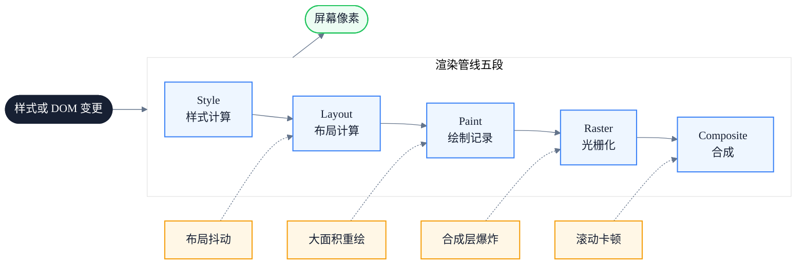
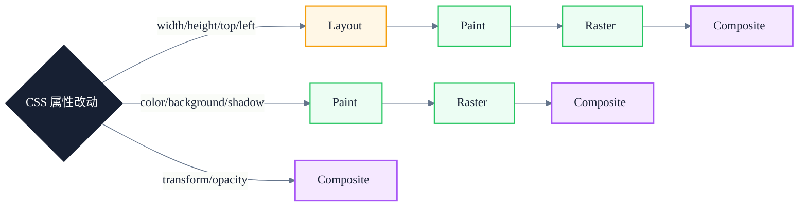
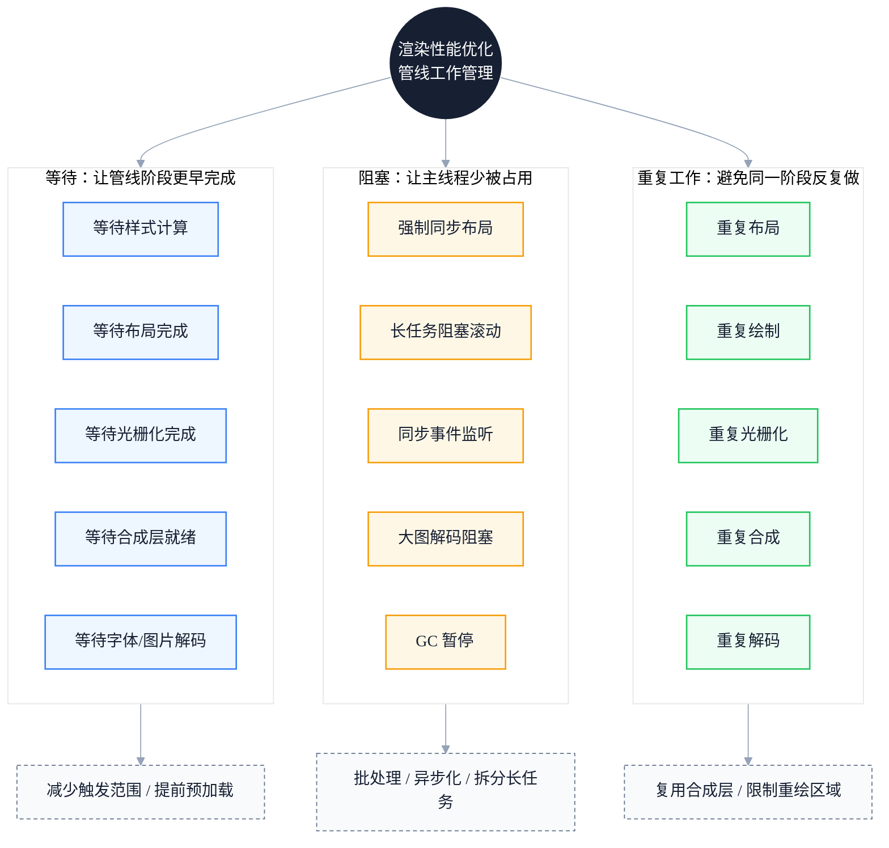

# 渲染性能避坑指南：从 Layout、Paint 到 Composite 的常见陷阱与解法

> 副标题：从布局抖动、强制同步布局、大面积重绘、合成层爆炸到 will-change 滥用
>
> 目标读者：中高级前端工程师、前端架构师、性能优化负责人
>
> 阅读时间：约 22 分钟

::: info 一句话
渲染性能问题的本质，是触发了不必要的渲染管线工作，或让管线某一段过载。
:::

## 目录

- [写在前面](#写在前面)
- [一、渲染管线回顾：从 Style 到 Composite 的五段](#一、渲染管线回顾-从-style-到-composite-的五段)
- [二、Layout 陷阱：布局抖动与强制同步布局](#二、layout-陷阱-布局抖动与强制同步布局)
- [三、Paint 陷阱：大面积重绘与绘制区域扩散](#三、paint-陷阱-大面积重绘与绘制区域扩散)
- [四、Composite 陷阱：合成层爆炸与 will-change 滥用](#四、composite-陷阱-合成层爆炸与-will-change-滥用)
- [五、动画性能：transform/opacity 之外的边界条件](#五、动画性能-transform-opacity-之外的边界条件)
- [六、DOM 规模：节点数量如何拖垮整条管线](#六、dom-规模-节点数量如何拖垮整条管线)
- [七、CSS 选择器复杂度：被低估的 Style 成本](#七、css-选择器复杂度-被低估的-style-成本)
- [八、字体与首屏：FOIT、FOUT 与布局偏移](#八、字体与首屏-foit-fout-与布局偏移)
- [九、图片与媒体：解码、光栅化与 LCP](#九、图片与媒体-解码-光栅化与-lcp)
- [十、滚动性能：passive listener 与合成层](#十、滚动性能-passive-listener-与合成层)
- [十一、统一模型：渲染管线的三组问题](#十一、统一模型-渲染管线的三组问题)
- [十二、渲染性能实践清单](#十二、渲染性能实践清单)
- [结语：渲染性能优化的是管线，不是单点](#结语-渲染性能优化的是管线-不是单点)
- [FAQ](#faq)
- [来源](#来源)

## 写在前面

很多团队在做渲染性能优化时，第一反应是"加 `will-change`"、"用 `transform` 做动画"、"开启 GPU 加速"。这些经验当然有用，但它们只是结论，不是原因。

如果不理解渲染管线的完整路径，就很容易出现下面这些情况：

- 给所有动画元素都加 `will-change: transform`，结果内存暴涨、合成层爆炸
- 用 `transform` 做动画，但父级触发了重排，动画依然卡顿
- 优化了单次绘制时间，但因为滚动时持续触发重绘，整体仍然掉帧
- 把列表虚拟化做得很完美，但因为 CSS 选择器复杂度过高，Style 阶段拖垮了整条管线

::: info 一句话
渲染性能问题的本质，是触发了不必要的渲染管线工作，或让管线某一段过载。
:::

这条主线可以拆成三组问题：

- **等待**：等待样式计算完成、等待布局完成、等待光栅化完成、等待合成层就绪。
- **阻塞**：强制同步布局阻塞主线程、长任务阻塞滚动、同步事件监听阻塞滚动线程。
- **重复工作**：重复布局、重复绘制、重复光栅化、重复合成。

理解这三组问题，需要先回顾现代浏览器渲染管线的完整路径。下图展示了从 Style 到 Composite 的五段链路，每一段都可能出现等待、阻塞或重复工作：



---

## 一、渲染管线回顾：从 Style 到 Composite 的五段

浏览器把 DOM 和 CSSOM 变成屏幕像素，通常要经历以下五段：

1. **Style（样式计算）**：把选择器规则匹配到 DOM 元素，计算每个节点的最终样式值。
2. **Layout（布局）**：根据样式计算盒模型，确定每个元素的位置和大小。
3. **Paint（绘制）**：生成绘制记录（paint record / display list），记录"先画什么、后画什么"。
4. **Raster（光栅化）**：把绘制指令转换成真实像素，通常分 tile 并发处理。
5. **Composite（合成）**：把多个图层按顺序合成到屏幕上，通常由 GPU 完成。

不同 CSS 属性的改动会触发不同段落的重新计算：

- 改 `width` / `height` / `margin` / `padding` / `top` / `left`：触发 **Layout**（连带后续所有阶段）
- 改 `color` / `background` / `box-shadow` / `border-color`：触发 **Paint**（连带后续阶段）
- 改 `transform` / `opacity`：多数情况下只触发 **Composite**



::: tip 本节核心结论

渲染管线的成本取决于改动触发了哪一段。Layout 最贵（连带后续所有阶段），Paint 次之，Composite 最便宜。优化渲染性能的第一原则是：**让改动尽量只触发 Composite**。

:::

::: warning 常见误区

认为"用 CSS 动画就一定比 JS 动画快"。如果动画属性触发了 Layout 或 Paint，CSS 动画同样会卡。关键不在动画的实现方式，而在动画属性是否停留在合成阶段。

:::

---

## 二、Layout 陷阱：布局抖动与强制同步布局

**Layout Thrashing（布局抖动）** 是渲染性能里最经典的陷阱之一。它的本质是：在同一个帧里，反复触发"写 → 读 → 写 → 读"的循环，迫使浏览器多次执行同步布局计算。

### 1. 强制同步布局的成因

浏览器为了让 DOM 操作不卡顿，会把一帧内的多次布局变更"批处理"，在下一帧统一计算。但如果你在写完 DOM 后**立即读取布局属性**，浏览器被迫立刻计算一次布局，才能返回正确的值。这就是 **强制同步布局（Forced Synchronous Layout）**。

会触发强制同步布局的常见 API：

- `offsetWidth` / `offsetHeight` / `offsetTop` / `offsetLeft`
- `clientWidth` / `clientHeight`
- `scrollWidth` / `scrollHeight` / `scrollTop` / `scrollLeft`
- `getBoundingClientRect()`
- `getComputedStyle()`
- `window.scrollY` / `window.scrollX`

### 2. 反例：读写交错的循环

```javascript
// 反例：每次循环都强制浏览器同步布局
const boxes = document.querySelectorAll('.box')
for (const box of boxes) {
  box.style.width = box.offsetWidth + 10 + 'px'
}
```

这段代码的问题在于：每次循环先读 `offsetWidth`（触发同步布局），再写 `style.width`（让布局失效）。下一次循环再读 `offsetWidth` 时，浏览器必须重新计算布局。N 个元素就触发 N 次同步布局。

### 3. 正例：先批量读，再批量写

```javascript
// 正例：先批量读取，再批量写入，只触发一次布局
const boxes = document.querySelectorAll('.box')
const widths = Array.from(boxes).map((box) => box.offsetWidth)
boxes.forEach((box, i) => {
  box.style.width = widths[i] + 10 + 'px'
})
```

把读和写分开后，整段循环只触发一次布局计算。

### 4. 用 FastDOM 模式管理读写

在复杂场景下，可以借助 `requestAnimationFrame` 把读操作放在一帧、写操作放在下一帧：

```javascript
// 正例：用 rAF 隔离读写，避免交错
function measureAndMutate() {
  const boxes = document.querySelectorAll('.box')
  const widths = Array.from(boxes).map((box) => box.offsetWidth)

  requestAnimationFrame(() => {
    boxes.forEach((box, i) => {
      box.style.width = widths[i] + 10 + 'px'
    })
  })
}
```

::: tip 本节核心结论

Layout Thrashing 的根因是"读写交错"。解法是把布局读和布局写分别批处理，避免在同一帧内反复触发强制同步布局。

:::

::: info 工程启示

在 Chrome DevTools 的 Performance 面板中，强制同步布局会显示为紫色 "Layout" 块，且带有红色警告标记 "Recalculate Style" + "Layout" 反复出现。如果看到这种锯齿状连续 Layout 块，基本可以确认是布局抖动。

:::

---

## 三、Paint 陷阱：大面积重绘与绘制区域扩散

即使避免了 Layout 问题，Paint 阶段仍然有很多陷阱。Paint 的成本取决于两个因素：**绘制区域大小** 和 **绘制复杂度**。

### 1. 绘制区域比你想象的更大

浏览器并不是只重绘"改了那个元素"的区域。它会计算一个 **重绘矩形（invalidation rect）**，把所有受影响的区域合并。如果多个元素相邻，它们的重绘区域可能合并成一个很大的矩形。

```html
<!-- 反例：相邻元素的重绘区域合并 -->
<div class="card" style="background: #fff">卡片 A</div>
<div class="card" style="background: #fff">卡片 B</div>
<div class="card highlighted" style="background: #ffe">卡片 C 高亮</div>
<div class="card" style="background: #fff">卡片 D</div>
```

给 `.highlighted` 改背景色，可能触发四个卡片的合并重绘区域。

### 2. box-shadow 和 border-radius 是 Paint 杀手

```css
/* 反例：大半径 + 大扩散的 box-shadow，绘制成本极高 */
.modal {
  box-shadow: 0 50px 100px rgba(0, 0, 0, 0.5);
  border-radius: 24px;
}
```

`box-shadow` 的绘制成本与阴影面积成正比，`border-radius` 会让边缘需要抗锯齿处理。两者叠加时，Paint 时间会显著上升。

### 3. 滚动时持续重绘

固定定位的元素（`position: fixed` / `position: sticky`）在页面滚动时，如果触发了重绘，会让整页滚动卡顿：

```css
/* 反例：fixed 元素改背景触发整页重绘 */
.header {
  position: fixed;
  transition: background 0.3s;
}
.header.scrolled {
  background: rgba(255, 255, 255, 0.9);
}
```

### 4. 解法：把重绘限制在合成层

```css
/* 正例：用 transform 提升合成层，让重绘只发生在该图层 */
.header {
  position: fixed;
  will-change: transform;
  transform: translateZ(0);
}
```

提升合成层后，该元素的重绘不会扩散到其他图层，滚动时主线程也更轻松。

::: tip 本节核心结论

Paint 成本由"绘制区域 × 绘制复杂度"决定。`box-shadow`、`border-radius`、滤镜、渐变是 Paint 成本的主要来源。把高频变化的元素提升到独立合成层，可以限制重绘范围。

:::

::: warning 常见误区

认为"只改颜色不会卡"。如果改的是大面积元素的 `background` 或 `box-shadow`，Paint 成本依然很高。颜色变化虽然不触发 Layout，但会触发 Paint + Raster + Composite。

:::

---

## 四、Composite 陷阱：合成层爆炸与 will-change 滥用

`will-change` 和 `transform: translateZ(0)` 是常见的"GPU 加速"手段，但滥用会带来 **合成层爆炸（Layer Explosion）**。

### 1. 合成层的成本

每个合成层都占用 GPU 内存，层与层之间的合成也需要 GPU 资源。合成层过多会导致：

- GPU 内存占用飙升（移动端尤其明显）
- 合成阶段本身变慢（层排序、层合并）
- 层拆分和重新合成的开销

### 2. 反例：给所有动画元素加 will-change

```css
/* 反例：无差别加 will-change，导致合成层爆炸 */
.card {
  will-change: transform;
}
.list-item {
  will-change: transform;
}
.button {
  will-change: transform;
}
```

如果页面上有几百个 `.card` 和 `.list-item`，每个都成为独立合成层，GPU 内存会迅速耗尽。

### 3. 正例：按需开启，用完移除

```css
/* 正例：只在动画确实卡顿时提升合成层 */
.card-animated {
  will-change: transform;
}
```

```javascript
// 正例：动画结束后移除 will-change
function animateCard(card) {
  card.style.willChange = 'transform'
  const animation = card.animate(
    [{ transform: 'translateX(0)' }, { transform: 'translateX(100px)' }],
    { duration: 300 }
  )
  animation.onfinish = () => {
    card.style.willChange = 'auto'
  }
}
```

### 4. 隐式合成层

有些元素即使没加 `will-change`，也会被提升为合成层，例如：

- `position: fixed` / `position: sticky` 且有 `z-index`
- `opacity` 小于 1
- `transform` 非 `none`
- `<video>`、`<canvas>`、`<iframe>`
- CSS 滤镜 `filter` 非 `none`

这些隐式合成层本身没问题，但如果数量过多，同样会拖累合成阶段。

::: tip 本节核心结论

`will-change` 是"租借 GPU 资源"的手段，不是免费的。只在确实需要动画提升时开启，动画结束后立即移除。无差别加 `will-change` 会引发合成层爆炸。

:::

::: info 工程启示

在 Chrome DevTools 的 Layers 面板可以查看页面的所有合成层。如果发现几十甚至上百层，基本是合成层爆炸。正常页面通常只有 5-15 个合成层。

:::

---

## 五、动画性能：transform/opacity 之外的边界条件

"动画只用 `transform` 和 `opacity`"是正确的方向，但仍有边界条件会让动画卡顿。

### 1. 父级重排会打断子级合成动画

```html
<!-- 反例：父级改 width，子级的 transform 动画也会被打断 -->
<div class="parent" style="width: 50%">
  <div class="child" style="transform: translateX(100px)"></div>
</div>
```

父级 `width` 变化触发 Layout，整棵子树的 Layout 都失效，子级的合成动画也会被打断。

### 2. 动画元素被提升合成层后，光栅化区域过大

```css
/* 反例：长列表整体提升合成层，光栅化成本爆炸 */
.long-list {
  will-change: transform;
  height: 10000px;
}
```

一个 10000px 高的元素被提升为合成层后，浏览器需要光栅化整个图层，GPU 内存和光栅化时间都会飙升。

### 3. 动画期间触发了滚动

```javascript
// 反例：动画期间用 scrollIntoView 触发滚动，打断合成动画
element.animate(...)
element.scrollIntoView({ behavior: 'smooth' })
```

`scrollIntoView` 会触发 Layout，打断正在进行的合成动画。

### 4. 正例：动画元素保持独立合成层，避免父级重排

```css
/* 正例：动画元素独立成层，父级不触发布局 */
.card {
  position: absolute;
  will-change: transform;
}
.card.is-moving {
  animation: slide 0.3s ease;
}
@keyframes slide {
  from { transform: translateX(0); }
  to { transform: translateX(100px); }
}
```

::: tip 本节核心结论

`transform` / `opacity` 动画要稳定流畅，需要同时满足：动画元素在独立合成层、动画期间父级不重排、动画元素本身不大到让光栅化过载。

:::

---

## 六、DOM 规模：节点数量如何拖垮整条管线

DOM 节点数量是渲染性能的"隐形税"。它不直接触发某一阶段，但会让每个阶段都变慢。

### 1. Style 阶段：选择器匹配成本与节点数线性相关

浏览器需要把每条 CSS 规则与每个 DOM 节点匹配。10000 个节点 × 1000 条规则 = 1000 万次匹配。

### 2. Layout 阶段：布局树构建成本与节点数线性相关

`display: none` 的元素不进布局树，但 `visibility: hidden` 的元素会进。布局计算需要遍历整棵布局树。

### 3. Paint 阶段：绘制记录数量与节点数相关

每个可见节点至少产生一条绘制记录，复杂结构会产生更多。

### 4. 反例：长列表全量渲染

```html
<!-- 反例：10000 条数据全量渲染到 DOM -->
<ul id="list">
  <!-- 10000 个 <li> -->
</ul>
```

10000 个 `<li>` 会让 Style、Layout、Paint 全部变慢，滚动时尤其明显。

### 5. 正例：虚拟列表 + 内容分片

```javascript
// 正例：只渲染可视区域 + 缓冲区
function renderVisibleItems(container, items, scrollTop, viewportHeight) {
  const itemHeight = 40
  const startIndex = Math.max(0, Math.floor(scrollTop / itemHeight) - 5)
  const endIndex = Math.min(
    items.length,
    Math.ceil((scrollTop + viewportHeight) / itemHeight) + 5
  )

  container.innerHTML = items
    .slice(startIndex, endIndex)
    .map((item) => `<li style="height:${itemHeight}px">${item}</li>`)
    .join('')
}
```

::: tip 本节核心结论

DOM 规模是渲染性能的乘数。节点数越多，每一段管线都越慢。长列表、树形结构、表格应优先虚拟化或分页。

:::

::: info 工程启示

在 Performance 面板中，如果 "Recalculate Style" 和 "Layout" 的耗时与 DOM 节点数明显正相关，说明是 DOM 规模问题。可以考虑虚拟列表、懒渲染、内容分片。

:::

---

## 七、CSS 选择器复杂度：被低估的 Style 成本

很多团队只关注"DOM 多不多"、"动画用没用 transform"，却忽略了 CSS 选择器本身的复杂度。

### 1. 选择器匹配是从右到左

浏览器匹配选择器时，是从最右边的关键选择器开始，再向左验证。这意味着：

```css
/* 反例：右侧关键选择器是通配符，匹配成本极高 */
.navbar * {
  outline: none;
}

/* 反例：后代选择器过深，匹配路径长 */
.list .item .row .col .cell {
  color: red;
}
```

### 2. 通配符和属性选择器是重灾区

```css
/* 反例：通配符匹配所有元素 */
* {
  box-sizing: border-box;
}

/* 反例：属性选择器复杂 */
[data-type='card'][data-status='active']:not(.disabled) {
  background: #fff;
}
```

### 3. BEM 命名优于深层后代选择器

```css
/* 正例：BEM 命名，扁平化选择器 */
.card {}
.card__title {}
.card--highlighted {}
```

BEM 的优势不在于"命名好看"，而在于选择器复杂度恒定为 O(1)，不依赖 DOM 层级。

::: tip 本节核心结论

CSS 选择器复杂度直接影响 Style 阶段耗时。优先使用类选择器，避免通配符、属性选择器、过深后代选择器。BEM 等扁平命名法在性能上更优。

:::

---

## 八、字体与首屏：FOIT、FOUT 与布局偏移

字体加载是渲染性能里容易被忽略的一环。它不仅影响 LCP，还可能引发 CLS（Cumulative Layout Shift）。

### 1. FOIT 与 FOUT

- **FOIT（Flash of Invisible Text）**：字体加载完成前，文字不可见。Chromium 默认行为是最多等 3 秒，超时后回退字体。
- **FOUT（Flash of Unstyled Text）**：先显示回退字体，字体加载完成后替换。

```css
/* 正例：用 font-display 控制字体加载策略 */
@font-face {
  font-family: 'CustomFont';
  src: url('/fonts/custom.woff2') format('woff2');
  font-display: swap;
}
```

`font-display: swap` 表示先用回退字体显示，字体加载完成后替换（FOUT）。

### 2. 字体加载触发布局偏移

如果回退字体和自定义字体的度量（metric）不同，替换时会触发重新布局，造成 CLS。

```css
/* 正例：用 size-adjust 调整回退字体度量，减少偏移 */
@font-face {
  font-family: 'FallbackFont';
  src: local('Arial');
  size-adjust: 95%;
  ascent-override: 90%;
}
```

### 3. 字体预加载

```html
<!-- 正例：关键字体预加载，减少等待 -->
<link
  rel="preload"
  href="/fonts/custom.woff2"
  as="font"
  type="font/woff2"
  crossorigin
/>
```

::: tip 本节核心结论

字体加载影响 LCP 和 CLS。用 `font-display: swap` 避免 FOIT，用 `preload` 加速关键字体，用 `size-adjust` 减少字体替换时的布局偏移。

:::

---

## 九、图片与媒体：解码、光栅化与 LCP

图片是 LCP 的主要来源，也是渲染性能的重灾区。

### 1. 图片解码是主线程任务

```html
<!-- 反例：大图未做解码优化，阻塞主线程 -->

```

大图解码是同步任务，会阻塞主线程。可以用 `decoding="async"` 让浏览器异步解码：

```html
<!-- 正例：异步解码，减少主线程阻塞 -->

```

### 2. 光栅化成本与图片尺寸正相关

光栅化要把图片解码后的位图作为纹理上传到 GPU。4K 图片的纹理上传成本远高于 720p。按需使用 `srcset` 提供不同尺寸：

```html
<!-- 正例：响应式图片，按设备像素比加载合适尺寸 -->

```

### 3. 视频首帧与光栅化

```html
<!-- 正例：视频预加载首帧，避免黑屏 -->
<video preload="metadata" poster="/poster.webp">
  <source src="/video.mp4" type="video/mp4" />
</video>
```

`poster` 图片会在视频首帧渲染前显示，避免 LCP 元素是视频时出现长时间黑屏。

::: tip 本节核心结论

图片和媒体的渲染成本包括"解码 + 光栅化 + 纹理上传"。用 `decoding="async"` 异步解码，用 `srcset` 控制尺寸，用 `poster` 占位视频首帧。

:::

---

## 十、滚动性能：passive listener 与合成层

滚动是用户最高频的交互之一。滚动卡顿通常来自两个原因：**主线程被长任务阻塞** 和 **滚动事件监听器同步执行**。

### 1. 反例：同步滚动监听阻塞滚动线程

```javascript
// 反例：同步滚动监听，阻塞滚动线程
document.addEventListener('scroll', () => {
  // 复杂计算
  updateParallax()
  updateIndicator()
})
```

浏览器无法知道监听器是否会调用 `preventDefault()`，必须等监听器执行完才能滚动页面。

### 2. 正例：passive 监听器

```javascript
// 正例：声明 passive，让浏览器并行滚动
document.addEventListener(
  'scroll',
  () => {
    updateParallax()
    updateIndicator()
  },
  { passive: true }
)
```

`passive: true` 告诉浏览器监听器不会调用 `preventDefault()`，浏览器可以在主线程执行监听器的同时继续滚动。

### 3. 视差滚动应使用合成层

```css
/* 正例：视差元素提升合成层，滚动时只触发合成 */
.parallax-layer {
  position: fixed;
  will-change: transform;
  transform: translate3d(0, 0, 0);
}
```

```javascript
// 正例：用 rAF 节流滚动回调，只改 transform
let ticking = false
document.addEventListener(
  'scroll',
  () => {
    if (!ticking) {
      requestAnimationFrame(() => {
        const y = window.scrollY
        parallaxLayer.style.transform = `translate3d(0, ${y * 0.5}px, 0)`
        ticking = false
      })
      ticking = true
    }
  },
  { passive: true }
)
```

::: tip 本节核心结论

滚动性能优化的核心是：用 `passive: true` 声明监听器不阻止滚动，用 `requestAnimationFrame` 节流回调，把滚动期间视觉变化限制在合成层（只改 `transform`）。

:::

::: warning 常见误区

认为"滚动卡是因为事件监听太多"。真正的原因通常是监听器没声明 `passive`，或者监听器里改了触发 Layout 的属性。即使只有一个监听器，同步执行也会卡。

:::

---

## 十一、统一模型：渲染管线的三组问题

下图把全文的渲染性能陷阱汇总为统一模型，归入"等待、阻塞、重复工作"三组：



### 1. 等待

渲染管线中的等待包括：等待样式计算完成、等待布局完成、等待光栅化完成、等待合成层就绪、等待字体和图片解码完成。这些等待大多来自触发了不必要的管线阶段。

### 2. 阻塞

渲染管线中的阻塞包括：强制同步布局阻塞主线程、长任务阻塞滚动、同步事件监听阻塞滚动线程、大图解码阻塞主线程、GC 暂停阻塞所有交互。

### 3. 重复工作

渲染管线中的重复工作包括：重复布局（布局抖动）、重复绘制（大面积重绘）、重复光栅化（合成层反复重建）、重复合成（层排序反复进行）、重复解码（同一图片被多次解码）。

::: tip 本节核心结论

所有渲染性能问题都可以归入"等待、阻塞、重复工作"三组。这个统一模型是渲染性能优化的思维框架：先定位问题在哪一段，再判断属于哪一组，最后选择对应策略。

:::

---

## 十二、渲染性能实践清单

### 1. Layout 优化

- [ ] 避免读写交错的循环（Layout Thrashing）
- [ ] 批量读取布局属性，批量写入样式
- [ ] 用 `requestAnimationFrame` 隔离读写
- [ ] 避免在滚动回调中读取 `offsetTop` / `scrollTop`

### 2. Paint 优化

- [ ] 谨慎使用大半径 `box-shadow` 和 `border-radius`
- [ ] 避免大面积元素改 `background` / `box-shadow`
- [ ] 高频变化元素提升合成层，限制重绘区域
- [ ] 滤镜 `filter` 仅在必要时使用

### 3. Composite 优化

- [ ] `will-change` 按需开启，用完移除
- [ ] 避免无差别 `will-change: transform`
- [ ] 定期检查 Layers 面板，合成层数量控制在 15 以内
- [ ] 注意隐式合成层（`opacity`、`filter`、`<video>`）

### 4. 动画优化

- [ ] 动画属性优先 `transform` / `opacity`
- [ ] 动画元素保持独立合成层
- [ ] 动画期间父级不触发 Layout
- [ ] 长列表动画元素控制高度，避免光栅化过载

### 5. DOM 规模控制

- [ ] 长列表虚拟化（只渲染可视区域 + 缓冲区）
- [ ] 树形结构懒展开
- [ ] 表格分页或虚拟滚动
- [ ] 监控 DOM 节点数，超过 5000 时预警

### 6. CSS 选择器优化

- [ ] 优先类选择器，避免通配符
- [ ] 后代选择器深度不超过 3 层
- [ ] 考虑 BEM 等扁平命名法
- [ ] 避免属性选择器与伪类组合

### 7. 字体与图片优化

- [ ] `font-display: swap` 避免 FOIT
- [ ] 关键字体 `preload`
- [ ] 用 `size-adjust` 减少字体替换偏移
- [ ] 图片 `decoding="async"`
- [ ] 用 `srcset` 提供响应式尺寸

### 8. 滚动优化

- [ ] 滚动监听器声明 `passive: true`
- [ ] 滚动回调用 `requestAnimationFrame` 节流
- [ ] 视差元素提升合成层，只改 `transform`
- [ ] 避免滚动回调中触发 Layout

---

## 结语：渲染性能优化的是管线，不是单点

渲染性能优化不是"加 `will-change`"或"用 `transform`"这样的单点技巧，而是理解整条渲染管线如何工作，把问题定位到具体阶段，再选择对应的优化手段。

现代浏览器的渲染管线是一套精密的系统：Style 计算选择器匹配、Layout 计算盒模型、Paint 生成绘制记录、Raster 把指令变成像素、Composite 把图层合成到屏幕。每一段都有成本，每一段都有陷阱。

最终，本文的中心仍然是：

> **渲染性能问题的本质，是触发了不必要的渲染管线工作，或让管线某一段过载。**

---

## FAQ

### 1. 为什么 `will-change` 加了反而更卡？

`will-change` 会把元素提升为独立合成层，占用 GPU 内存。如果无差别使用，会导致合成层爆炸，GPU 内存耗尽，合成阶段本身变慢。`will-change` 应按需开启，动画结束后立即移除。

### 2. `transform` 动画就一定不卡吗？

不一定。`transform` 动画要稳定流畅，需要同时满足：动画元素在独立合成层、动画期间父级不触发 Layout、动画元素本身不大到让光栅化过载。如果父级改了 `width`，子级的 `transform` 动画也会被打断。

### 3. 怎么判断是 Layout 问题还是 Paint 问题？

在 Chrome DevTools 的 Performance 面板中，紫色 "Layout" 块表示布局计算耗时，绿色 "Paint" 块表示绘制耗时。如果紫色块连续出现且伴随红色警告，是 Layout 问题；如果绿色块面积大且反复出现，是 Paint 问题。

### 4. 虚拟列表为什么能大幅提升滚动性能？

虚拟列表只渲染可视区域 + 缓冲区的 DOM 节点，把 10000 个节点降到几十个。DOM 规模是渲染性能的乘数，节点数减少后，Style、Layout、Paint 每一段都会变快，滚动自然流畅。

### 5. `passive: true` 到底解决了什么问题？

浏览器无法预知滚动监听器是否会调用 `preventDefault()`，必须等监听器执行完才能滚动页面。`passive: true` 告诉浏览器监听器不会阻止滚动，浏览器可以在主线程执行监听器的同时继续滚动线程，避免卡顿。

---

## 来源

1. Web.dev 渲染性能指南：
   
   [https://web.dev/articles/rendering-performance](https://web.dev/articles/rendering-performance)

2. Chrome DevTools 渲染性能分析：
   
   [https://developer.chrome.com/docs/devtools/performance/reference](https://developer.chrome.com/docs/devtools/performance/reference)

3. Inside look at modern web browser（Chrome 官方博客）：
   
   [https://developer.chrome.com/blog/inside-browser-part3](https://developer.chrome.com/blog/inside-browser-part3)

4. Addy Osmani《How modern browsers work》：
   
   [https://addyosmani.com/](https://addyosmani.com/)
