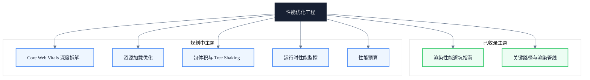

# 性能优化工程

> 副标题：围绕关键路径与渲染管线，把性能问题定位到具体阶段

## 模块定位

性能优化不是"加 will-change"或"用 transform 做动画"这样的单点技巧，而是建立一套从问题定位到优化验证的完整工程方法。本模块围绕现代浏览器的关键路径与渲染管线，把性能问题拆解为"等待、阻塞、重复工作"三组模型，让每一项优化都有据可依。

每个优化建议都配套 DevTools 验证路径与可执行的实践清单，避免"看起来优化了"但实际没改善的伪优化。

本模块同时关注工程治理层面：从指标拆解、资源加载、包体积到运行时监控与性能预算，把性能从一次性优化沉淀为可守护的工程能力。

---

## 知识地图

---

## 核心主题

- ✓ **关键路径与渲染管线** — TTFB / 资源发现 / HTML-CSS-JS 解析 / 模块依赖图 / LCP 拆解
- ✓ **渲染性能避坑** — Layout / Paint / Composite 各阶段常见陷阱与解法
- ◯ **Core Web Vitals 深度拆解** — LCP / INP / CLS / TTFB 的指标拆解与优化方向
- ◯ **资源加载优化** — 预加载 / 预连接 / 资源优先级 / 缓存策略
- ◯ **包体积与 Tree Shaking** — 依赖分析 / 按需加载 / 死代码消除
- ◯ **运行时性能监控** — 长任务 / JIT 去优化 / GC 暂停 / INP 优化
- ◯ **性能预算** — 预算制定 / CI 卡点 / 回归保护

---

## 学习路径

1. 先读《现代前端性能的底层链路》建立"等待、阻塞、重复工作"三组模型的整体认知
2. 再读《渲染性能避坑指南》深入渲染管线各阶段的具体陷阱
3. 后续按 Core Web Vitals → 资源加载 → 包体积 → 运行时监控 → 性能预算 的顺序逐步展开

---

## 文章导览

- [渲染性能避坑指南](/performance/rendering-pitfalls) — Layout / Paint / Composite 各阶段常见陷阱与解法
- [现代前端性能的底层链路：如何减少关键路径上的等待、阻塞与重复工作](/performance/critical-path) — 从 TTFB 到 Hydration 的完整性能模型

---

## 适用读者

- 性能优化负责人，需要建立团队级的性能诊断与优化框架
- 中高级前端工程师，希望突破"加 will-change"式的单点优化
- 前端架构师，需要在技术选型时评估方案对关键路径的影响

---

## 延伸资源

- [web.dev/performance](https://web.dev/performance/) — Google 出品的性能优化权威指南
- [Chrome DevTools 文档](https://developer.chrome.com/docs/devtools/) — 性能分析工具的官方文档
- [Core Web Vitals](https://web.dev/articles/vitals) — 核心性能指标的官方说明
- 《High Performance Browser Networking》by Ilya Grigorik — 浏览器网络与性能的经典书籍
