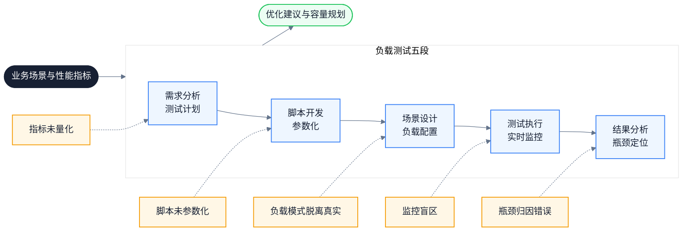
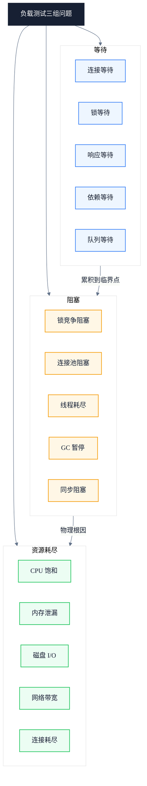
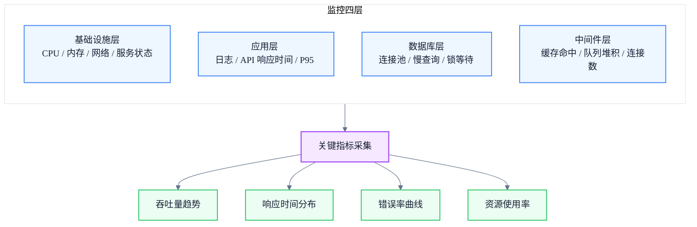
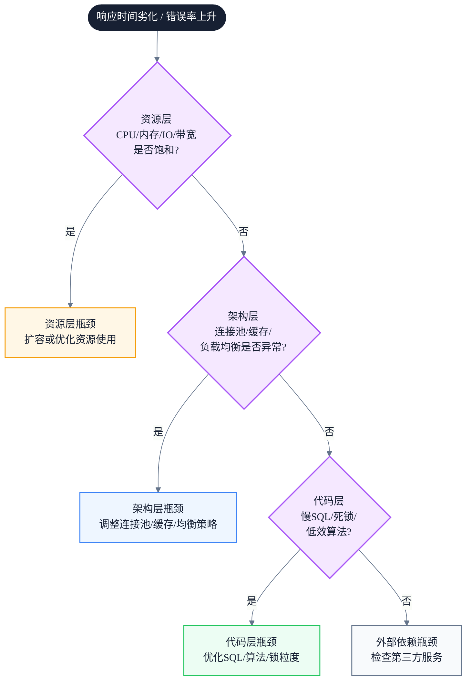
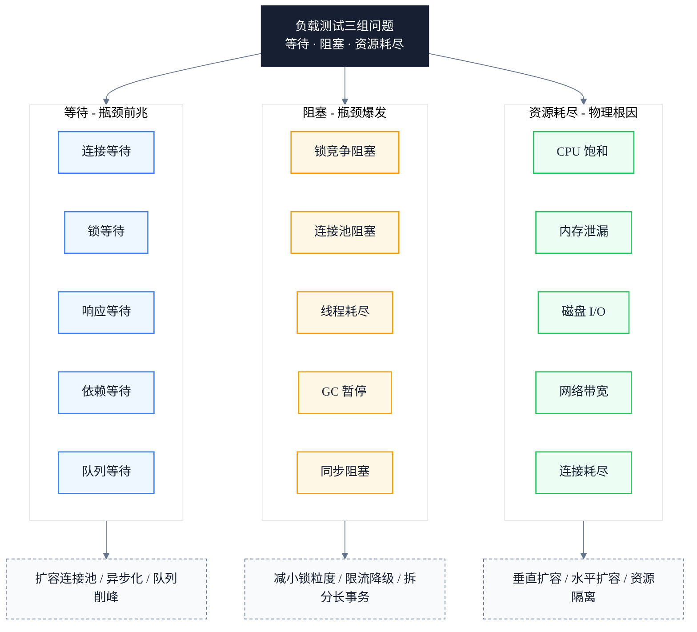

# 负载测试工程实践：从测试计划到瓶颈定位的全流程方法论

> 副标题：从测试目标、负载模型、JMeter 脚本参数化到 TPS、95% 百分位响应时间、瓶颈诊断与降级熔断验证
>
> 目标读者：测试工程师、质量负责人、中高级前端工程师、前端架构师
>
> 阅读时间：约 24 分钟

::: info 一句话
负载测试的本质，是在受控压力下暴露系统在等待、阻塞与资源耗尽上的真实边界。
:::

## 目录

- [写在前面](#写在前面)
- [一、为什么要做负载测试：从技术验证到业务保障](#一-为什么要做负载测试-从技术验证到业务保障)
- [二、负载测试的三组问题：等待、阻塞、资源耗尽](#二-负载测试的三组问题-等待-阻塞-资源耗尽)
- [三、需求分析与测试计划](#三-需求分析与测试计划)
- [四、脚本开发与参数化](#四-脚本开发与参数化)
- [五、场景设计与负载模式](#五-场景设计与负载模式)
- [六、测试执行与实时监控](#六-测试执行与实时监控)
- [七、结果分析与瓶颈定位](#七-结果分析与瓶颈定位)
- [八、关键指标体系：TPS、响应时间与百分位](#八-关键指标体系-tps-响应时间与百分位)
- [九、第三方依赖的压力验证：降级与熔断](#九-第三方依赖的压力验证-降级与熔断)
- [十、统一模型：负载测试的三组问题](#十-统一模型-负载测试的三组问题)
- [十一、负载测试实践清单](#十一-负载测试实践清单)
- [结语：负载测试验证的是系统的真实边界](#结语-负载测试验证的是系统的真实边界)
- [FAQ](#faq)
- [来源](#来源)

## 写在前面

很多团队对负载测试的认知停留在"用工具压一下看看扛不扛得住"。这种做法能拿到一个粗略的结论，但回答不了真正关键的问题：

- 系统在多少并发下开始出现响应时间劣化？劣化的拐点在哪？
- 错误率从 0% 升到 1% 时，是哪个资源先到达瓶颈？CPU、内存、数据库连接池，还是带宽？
- 当第三方依赖（如外部排队服务）失效时，系统能否抵御 10 倍、30 倍的流量冲击？是降速还是宕机？
- 增加服务器实例（水平扩展）真的能线性提升吞吐量吗？还是某个共享资源早就成了天花板？

如果一次负载测试结束，只能给出"通过了"或"没通过"的结论，那它几乎没有工程价值。真正的负载测试，是要把系统在压力下的行为拆解清楚：哪里在等待、哪里被阻塞、哪个资源先耗尽。

::: info 一句话
负载测试的本质，是在受控压力下暴露系统在等待、阻塞与资源耗尽上的真实边界。
:::

这条主线可以拆成三组问题：

- **等待**：请求等待连接、事务等待锁、用户等待响应、依赖等待下游。
- **阻塞**：锁竞争阻塞事务、连接池满阻塞请求、线程耗尽阻塞接入、GC 暂停阻塞一切。
- **资源耗尽**：CPU 饱和、内存泄漏、磁盘 I/O 打满、网络带宽见底、数据库连接耗尽。

理解这三组问题，需要先建立负载测试的完整流程认知。下图展示了从需求分析到瓶颈定位的五段链路，每一段都对应具体的工程产物：



本文按照这五段流程展开，并在每一阶段标注常见误区与可执行的工程实践。

---

## 一、为什么要做负载测试：从技术验证到业务保障

很多人把负载测试等同于"上线前跑一遍压测脚本"，这是一种窄化的理解。负载测试的实际价值远不止技术验证，它同时承担业务保障与成本优化的职责。

负载测试的核心价值可以归纳为以下几方面：

1. **发现性能瓶颈**：在高并发或高负载场景下，系统可能出现响应延迟、资源耗尽（CPU、内存、数据库连接池满）、请求队列堆积。测试结果是定位代码、SQL 查询、网络带宽或服务器配置瓶颈的优化依据。
2. **验证系统的扩展能力**：水平扩展（Horizontal Scaling）测试系统能否通过增加服务器实例（如增加 Pod 数量）来分担负载；垂直扩展（Vertical Scaling）验证升级硬件资源是否能有效提升性能。
3. **确保用户体验**：保证用户操作（如页面加载、表单提交）在预期时间内完成（如 2 秒内），避免因系统崩溃或卡顿导致用户投诉。
4. **预防业务损失**：避免因系统过载导致服务中断影响声誉，并根据测试结果合理规划服务器资源，平衡性能与成本（容量规划）。
5. **验证第三方依赖**：测试依赖的外部服务（如外部排队服务）在高负载下的表现，模拟第三方故障时系统的降级或熔断机制是否生效——即使外部排队服务失效，系统也应能抵御 10 倍、30 倍的流量冲击，允许降速但不宕机。
6. **成本优化**：通过测试确定最低成本下满足性能需求的资源配置（服务器数量、数据库规格），避免为应对不切实际的高负载而过度投资硬件或云资源。

::: tip 本节核心结论

负载测试不只是技术验证，更是业务保障。它提前暴露风险、优化资源投入，并确保系统在真实压力下仍能为用户提供可靠服务。

:::

::: warning 常见误区

把负载测试等同于"上线前跑一次脚本"。这种做法只能得到"通过/不通过"的二值结论，回答不了拐点在哪、瓶颈归因、扩展是否线性等关键问题，等于把测试价值浪费在最后一步。

:::

---

## 二、负载测试的三组问题：等待、阻塞、资源耗尽

要把负载测试从"跑脚本"升级为"工程方法"，需要一个统一的思维框架来归类所有观察到的现象。本文沿用"等待、阻塞、重复工作"的思路，并结合负载测试场景调整为三组问题：等待、阻塞、资源耗尽。

### 1. 等待：系统在压力下产生的等待

压力上升后，请求会在多个环节排队等待：

- **连接等待**：数据库连接池满，新请求排队等待可用连接。
- **锁等待**：事务持有行锁或表锁，其他事务等待锁释放。
- **响应等待**：下游服务响应变慢，上游请求等待返回。
- **依赖等待**：第三方服务（如外部排队服务）排队处理，主流程等待其响应。
- **队列等待**：请求队列堆积，新请求等待被消费。

等待的特点是：吞吐量还在增长，但响应时间开始爬升。等待是瓶颈的前兆。

### 2. 阻塞：系统在压力下产生的阻塞

当等待累积到临界点，系统进入阻塞状态：

- **锁竞争阻塞**：大量事务争抢同一行锁，数据库吞吐量骤降。
- **连接池阻塞**：连接池耗尽，新请求被直接拒绝或长时间挂起。
- **线程耗尽阻塞**：Web 容器工作线程打满，无法接入新请求。
- **GC 暂停阻塞**：内存压力触发频繁 Full GC，应用线程被暂停。
- **同步阻塞**：某个慢 SQL 占住连接，整条调用链被拖慢。

阻塞的特点是：吞吐量不再增长甚至下降，错误率开始上升。阻塞是瓶颈的爆发。

### 3. 资源耗尽：系统在压力下的硬性边界

资源耗尽是阻塞的物理根因：

- **CPU 饱和**：CPU 使用率持续 100%，请求处理速度无法提升。
- **内存泄漏**：内存持续增长直至 OOM，进程被重启。
- **磁盘 I/O 瓶颈**：磁盘吞吐打满，所有读写请求变慢。
- **网络带宽见底**：带宽饱和，请求传输延迟剧增。
- **数据库连接耗尽**：连接池配置过小，成为最先到达的瓶颈。



::: tip 本节核心结论

三组问题是递进关系：等待是瓶颈的前兆（吞吐量还在涨，响应时间开始爬升），阻塞是瓶颈的爆发（吞吐量下降，错误率上升），资源耗尽是阻塞的物理根因。负载测试的目标就是把系统推到这三组问题的临界点，并定位是哪个资源先到达边界。

:::

---

## 三、需求分析与测试计划

需求分析是负载测试最容易跳过、却又最决定测试价值的一步。没有明确的测试目标，后续所有环节都会失去评判标准。

### 1. 明确测试目标

测试目标必须量化，不能停留在"看看系统扛不扛得住"。典型的量化指标包括：

- **响应时间**：核心接口 P95 响应时间 ≤ 2 秒。
- **吞吐量（TPS）**：目标 TPS 达到多少。
- **错误率**：错误率 < 1%。
- **并发用户数**：支持多少并发用户持续操作。

除了指标，还要识别关键业务场景。例如某系统的核心业务流程包含订单提交、数据查询、报表导出、文件上传、批量处理等多类事务，这些就是必须覆盖的测试场景。同时要分析系统架构：服务器、数据库、网络配置等依赖项，明确哪些是测试范围内的影响因素。

### 2. 制定测试计划

测试计划要把目标落到可执行的配置上：

- **负载模型设计**：模拟真实用户行为，覆盖登录、浏览、查询、提交表单等不同操作类型的比例。
- **环境搭建**：隔离测试环境，确保与生产环境配置一致（硬件规格、网络带宽等）。环境不一致是测试结论失真的最大来源。
- **数据准备**：生成测试数据并初始化。包括参数化的用户账号、根据业务表配置好表关联、动态请求参数（如不同用户对应不同业务编号）、测试上传功能所需的静态文件（如 XML 文件）。

```text
// 反例：测试目标模糊
目标：验证系统能扛住大促流量
结论：通过 / 不通过

// 正例：测试目标量化
目标：在 200 并发下，核心接口 P95 ≤ 2s，TPS ≥ 500，错误率 < 1%
拐点定位：找出 TPS 不再增长的并发数
扩展验证：水平扩展到 4 实例后，TPS 是否线性增长
```

::: tip 本节核心结论

测试计划的核心是"量化目标 + 真实负载模型 + 一致环境"。模糊的目标只会产生模糊的结论，脱离真实业务的负载模型会让测试结果失去指导意义。

:::

::: warning 常见误区

测试环境配置低于生产环境，得出"系统能扛住 X 并发"的结论。实际生产环境硬件更强，真实瓶颈可能完全不同；反之亦然。环境一致性是测试结论可信的前提。

:::

---

## 四、脚本开发与参数化

脚本是把测试计划转化为可执行压测的载体。一个没有参数化的脚本，相当于让 100 个用户用同一个账号登录、提交同一条数据，这种测试既不能暴露并发问题，也无法反映真实流量。

### 1. 录制用户操作

使用 JMeter 录制 HTTP/API 请求，生成基础脚本。录制时要聚焦关键操作：登录、表单提交、数据查询等高频行为，过滤掉静态资源请求（CSS、JS、图片），避免脚本冗余。

### 2. 脚本增强

录制出来的脚本只是骨架，必须经过四步增强才能用于真实压测：

- **参数化**：把静态数据替换为动态变量（如用户名、密码），支持多用户并发。典型做法是从 CSV 文件读取数据，每个虚拟用户分配不同账号。
- **关联处理**：提取服务器返回的动态值并传递给后续请求。最常见的是 Session ID / Token：登录接口返回的 Token 必须提取出来，作为后续接口的请求头。
- **检查点与断言**：验证响应内容是否正确。不能只看 HTTP 状态码 200，要检查返回的 JSON 字段（如 `code === 0`、`data.userId` 存在），否则系统返回错误页面但状态码 200 时会漏判。
- **思考时间与集合点**：模拟真实用户操作间隔（思考时间），在关键事务前设置集合点（Rendezvous），让多个用户同时发起请求以模拟峰值。

```text
// 反例：单用户脚本直接并发
所有虚拟用户使用同一账号 admin/123456
提交同一个业务编号
不提取 Token，每个请求都重新登录

// 正例：参数化 + 关联 + 断言
从 CSV 读取 200 个不同账号
每个用户提交自己的业务编号（参数化）
登录后提取 Token，后续请求复用（关联）
断言返回 JSON 的 code 字段为 0（检查点）
```

### 3. 调试与验证

参数化完成后，先用单用户回放脚本，确保功能正确性，排查脚本逻辑或数据问题。单用户通过后再逐步加并发，验证参数化数据是否被正确分配、关联是否生效、断言是否触发。

::: tip 本节核心结论

脚本质量决定测试结论的可信度。没有参数化的脚本只能测单点性能，无法暴露并发问题；没有断言的脚本会把"返回错误页面"误判为"请求成功"。

:::

---

## 五、场景设计与负载模式

场景设计决定了"用什么方式压"。同样的脚本，不同的负载模式会暴露完全不同的问题。

### 1. 配置负载模式

两种基础负载模式对应不同的测试目的：

- **恒定负载（Constant Load）**：固定并发用户数（如 40 用户持续加压）。用于验证系统在持续压力下的稳定性，观察是否出现内存泄漏、连接泄漏等渐进性问题。
- **递增负载（Ramp-up）**：逐步增加用户数（如每 20 秒增加 10 用户，直至 40 或更多）。用于寻找系统的性能拐点——TPS 不再增长、响应时间开始劣化的并发数。

实际测试通常组合使用：先递增找拐点，再恒定验证稳定性。还可以加入峰值负载（瞬间大量并发）和浪涌负载（周期性波动）来模拟大促、秒杀等极端场景。

### 2. 资源监控配置

负载模式确定后，要同步配置资源监控，否则测试结束后无法做瓶颈归因。监控覆盖四个层次：

- **基础设施层（OCP / Grafana Infra）**：CPU、内存、Network Traffic、Service Status。
- **应用层**：应用日志监控、API 各项指标（Response Time、95% 百分位响应时间）。
- **数据库层**：数据库连接池状态、慢查询、锁等待。
- **中间件层**：缓存命中率、消息队列堆积、连接数。



::: tip 本节核心结论

负载模式要与测试目的匹配：找拐点用递增负载，验证稳定性用恒定负载。监控配置必须在测试前完成，覆盖基础设施、应用、数据库、中间件四层，否则测试结束后的瓶颈归因会变成"猜谜"。

:::

::: info 工程启示

OCP（OpenShift Container Platform）和 Grafana 是云原生环境下常用的监控组合。OCP 提供容器级资源监控，Grafana 负责指标可视化与告警。两者配合可以做到"测试一结束，数据立即可查"。

:::

---

## 六、测试执行与实时监控

执行阶段不是"点开始然后等结果"，而是要实时观察系统表现，及时识别异常，避免无效测试浪费时间。

### 1. 预热阶段（Warm-up）

正式测试前以低负载运行 3-5 分钟，避免冷启动影响数据准确性。冷启动期间 JIT 编译、缓存填充、连接池初始化都会让响应时间偏高，如果直接计入结果会拉高整体均值，产生误判。

### 2. 正式执行

按场景配置执行测试，重点关注：

- **TPS 与响应时间趋势**：观察是否在预期范围内，是否出现骤降或抖动。
- **错误率**：一旦错误率超过阈值（如 1%），要立即记录发生时间点，便于后续与监控数据对齐分析。
- **异常处理**：设置失败重试机制或动态调整负载策略。例如用户登录失败或 API 请求失败时，跳出当前循环或采取其他处理方式，避免一个失败请求引发连锁失败污染数据。

### 3. 实时监控

通过仪表盘（Grafana Dashboard）实时观察关键指标：

- CPU、内存、Network Traffic、Service Status
- 数据库连接池状态
- API 各项指标（Response Time、95% 百分位响应时间）

实时监控的价值在于"边测边查"：当发现响应时间突然劣化时，可以立即查看同一时间点的 CPU、连接池、锁等待数据，快速锁定瓶颈层次。如果等测试结束才看监控，时间点对不齐，归因就困难得多。

::: tip 本节核心结论

执行阶段的核心是"实时观察 + 时间点对齐"。预热排除冷启动干扰，实时监控让瓶颈定位从"事后猜测"变成"当场验证"。

:::

---

## 七、结果分析与瓶颈定位

结果分析是负载测试价值变现的关键环节。同样的测试数据，分析方法不同，得出的结论可能完全相反。

### 1. 生成报告

报告要汇总以下核心数据：

- **平均响应时间**：反映整体水平，但容易被长尾拉高，不能单独使用。
- **95% 百分位响应时间（P95）**：反映绝大多数用户的真实体验，比平均值更有参考价值。
- **吞吐量（TPS）**：反映系统处理能力，关注趋势而非瞬时值。
- **错误类型分布**：按错误码或错误类型分类统计，定位问题方向。

图表分析要重点关注两组相关性：

- **并发用户数与响应时间的相关性**：找出响应时间开始劣化的拐点。
- **资源使用率趋势**：在拐点处，哪个资源先到达瓶颈。

### 2. 瓶颈诊断

瓶颈诊断要分层进行，避免"看到 CPU 高就优化代码"的跳跃式归因：



三个层次的典型瓶颈：

- **代码层**（一般由后端工程师排查优化）：慢 SQL 查询、死锁、低效算法。通过 APM 工具定位，开源方案如 Prometheus + Grafana 做监控指标与可视化。
- **架构层**：数据库连接池不足、缓存失效、负载均衡策略不合理。
- **资源层**：CPU 过载、内存泄漏、磁盘 I/O 瓶颈、网络带宽瓶颈。

::: tip 本节核心结论

瓶颈诊断必须分层：先看资源层（最易量化），再看架构层（连接池/缓存/均衡），最后看代码层（SQL/算法/锁）。跳层归因是诊断失败的常见原因——看到 CPU 高就去优化代码，结果真正的瓶颈是连接池配置过小导致请求堆积。

:::

::: warning 常见误区

只看平均响应时间。平均值会被大量快速请求拉低，掩盖少数超慢请求的存在。一个平均 500ms 的接口，可能 95% 的请求在 100ms 内完成，但有 5% 的请求耗时 5 秒——这 5% 的用户体验极差，却被平均值掩盖了。必须看 P95 / P99。

:::

---

## 八、关键指标体系：TPS、响应时间与百分位

指标体系是负载测试的"语言"。同样的测试结果，用不同的指标描述，结论可能完全不同。

### 1. TPS（Transactions Per Second）

TPS 是系统每秒处理的事务数，反映系统的处理能力。关注 TPS 时要注意：

- **TPS 趋势比瞬时值更重要**：递增负载下，TPS 先线性增长、后趋于平缓、最后下降，这个拐点就是系统的最大处理能力。
- **TPS 不增长不代表没瓶颈**：可能是连接池打满、可能是锁竞争，需要结合资源监控判断。

### 2. 响应时间与百分位

响应时间要看分布，不能只看平均值：

- **平均值（Average）**：整体水平，容易被长尾拉高。
- **中位数（P50）**：一半用户的体验基线。
- **95% 百分位（P95）**：95% 用户的体验上限，是核心 SLA 指标。
- **99% 百分位（P99）**：长尾用户体验，反映系统稳定性。

业务上通常约定"P95 ≤ 2 秒"作为核心接口的目标，这比"平均响应时间 ≤ 2 秒"严格得多。

### 3. 错误率

错误率要按类型分类统计：

- **HTTP 5xx**：服务器错误，通常是资源耗尽或代码异常。
- **HTTP 4xx**：客户端错误，可能是参数化数据问题或鉴权失败。
- **业务错误**：HTTP 200 但业务 code 非 0，需要断言才能发现。
- **超时**：请求未在预期时间内返回，通常是响应等待累积的结果。

```text
// 反例：只看平均值下结论
平均响应时间 800ms，TPS 600，结论：性能良好

// 正例：看百分位与趋势下结论
P50 200ms / P95 3.2s / P99 8s
TPS 在 200 并发到达拐点（600→580→420）
错误率在 250 并发后从 0.1% 升至 3.5%
结论：系统拐点在 200 并发，瓶颈为数据库连接池
```

::: tip 本节核心结论

指标体系的核心是"看分布、看趋势、看相关性"。平均值掩盖长尾，瞬时值掩盖拐点，单一指标掩盖瓶颈归因。P95 是核心 SLA，TPS 趋势定位拐点，错误类型分布指向瓶颈层次。

:::

---

## 九、第三方依赖的压力验证：降级与熔断

现代系统很少独立运行，几乎都依赖第三方服务。第三方依赖的压力验证是负载测试中容易被忽略、却最影响线上稳定性的环节。

### 1. 依赖稳定性测试

测试依赖的外部服务（如外部排队服务）在高负载下的表现：

- 第三方服务自身能承受多少流量？
- 第三方服务响应变慢时，主系统的调用链是否会被拖垮？
- 第三方服务限流或熔断时，主系统是否能正确感知并降级？

### 2. 故障注入与降级验证

模拟第三方服务故障，验证系统的降级或熔断机制是否生效：

- **断路器（Circuit Breaker）**：当第三方连续失败达到阈值，断路器是否跳闸，直接返回降级响应？
- **超时控制**：调用第三方是否设置了合理超时？超时后是否释放连接，避免连接被长时间占用？
- **降级策略**：第三方不可用时，系统是否切换到降级逻辑（如返回缓存数据、跳过非核心步骤）？

核心验证目标：就算外部排队服务失效，系统也能抵御 10 倍、30 倍的流量冲击，允许降速但不宕机。

```text
// 反例：无超时无降级
调用外部排队服务不设超时
外部排队服务变慢 → 主系统连接被占满 → 全站不可用

// 正例：超时 + 熔断 + 降级
调用外部排队服务设置 2s 超时
连续失败 5 次触发熔断，直接走降级逻辑
降级逻辑返回本地排队或友好提示
系统在外部排队服务宕机时仍能服务核心流程
```

::: tip 本节核心结论

第三方依赖的压力验证要回答两个问题：第三方正常但变慢时，主系统会不会被拖垮？第三方完全宕机时，主系统能否降级生存？没有超时控制和熔断机制的依赖调用，是系统稳定性的定时炸弹。

:::

---

## 十、统一模型：负载测试的三组问题

把前面散落的观点归并为统一框架，负载测试的所有现象都可以映射到三组问题：等待、阻塞、资源耗尽。下图汇总了三组问题的具体表现、递进关系与对应策略：



### 1. 等待

负载测试中的等待包括：连接等待、锁等待、响应等待、依赖等待、队列等待。这些等待是吞吐量还在增长但响应时间开始爬升的信号，是瓶颈的前兆。对应策略是扩容连接池、异步化处理、用队列削峰填谷。

### 2. 阻塞

负载测试中的阻塞包括：锁竞争阻塞、连接池阻塞、线程耗尽、GC 暂停、同步阻塞。这些是吞吐量下降、错误率上升的爆发点。对应策略是减小锁粒度、限流降级、拆分长事务。

### 3. 资源耗尽

资源耗尽是阻塞的物理根因：CPU 饱和、内存泄漏、磁盘 I/O 瓶颈、网络带宽见底、数据库连接耗尽。对应策略是垂直扩容（升级硬件）、水平扩容（增加实例）、资源隔离（避免单租户打垮全局）。

::: tip 本节核心结论

所有负载测试现象都可以归入"等待、阻塞、资源耗尽"三组。这个统一模型是负载测试的思维框架：先观察现象属于哪一组，再追溯上一层根因，最后选择对应策略。等待对应扩容与异步化，阻塞对应限流与拆分，资源耗尽对应扩容与隔离。

:::

---

## 十一、负载测试实践清单

### 1. 测试计划阶段

- [ ] 量化测试目标（P95 ≤ Xs、TPS ≥ Y、错误率 < Z%）
- [ ] 识别关键业务场景并覆盖核心事务流程
- [ ] 隔离测试环境，确保硬件规格与生产一致
- [ ] 准备参数化测试数据（用户账号、业务编号、动态参数）
- [ ] 配置静态文件（如 XML 上传文件）供测试使用

### 2. 脚本开发阶段

- [ ] 参数化用户账号与业务数据（CSV 数据驱动）
- [ ] 关联动态值（Session ID / Token 提取与复用）
- [ ] 添加响应断言（校验 JSON 字段而非仅状态码）
- [ ] 配置思考时间模拟真实用户操作间隔
- [ ] 单用户回放验证脚本功能正确性

### 3. 场景设计阶段

- [ ] 递增负载定位性能拐点
- [ ] 恒定负载验证持续稳定性
- [ ] 峰值负载模拟大促/秒杀场景
- [ ] 配置四层监控（基础设施/应用/数据库/中间件）

### 4. 测试执行阶段

- [ ] 预热 3-5 分钟排除冷启动干扰
- [ ] 实时观察 TPS 与响应时间趋势
- [ ] 错误率超阈值时立即记录时间点
- [ ] 配置失败重试或跳出逻辑避免连锁失败
- [ ] 异常处理策略与生产一致

### 5. 监控配置阶段

- [ ] OCP / Grafana 采集 CPU、内存、网络、服务状态
- [ ] 应用日志监控覆盖关键链路
- [ ] 数据库连接池状态与慢查询监控
- [ ] API 指标包含 Response Time 与 P95
- [ ] 监控时间与测试执行时间对齐

### 6. 结果分析阶段

- [ ] 同时报告平均值与 P95 / P99
- [ ] 绘制并发数-响应时间相关性图定位拐点
- [ ] 错误按类型分类统计（5xx / 4xx / 业务错误 / 超时）
- [ ] 分层诊断瓶颈（资源层 → 架构层 → 代码层）
- [ ] 用 APM 工具定位慢 SQL 与低效算法

### 7. 稳定性验证阶段

- [ ] 第三方依赖变慢时主系统是否被拖垮
- [ ] 第三方宕机时熔断器是否跳闸
- [ ] 降级逻辑是否生效（返回缓存/跳过非核心步骤）
- [ ] 调用第三方是否设置合理超时
- [ ] 验证"降速但不宕机"的容错目标

### 8. 成本与容量规划

- [ ] 水平扩展后 TPS 是否线性增长
- [ ] 垂直扩展是否有效提升性能
- [ ] 确定最低成本下满足 SLA 的资源配置
- [ ] 避免为不切实际的高负载过度投资

---

## 结语：负载测试验证的是系统的真实边界

负载测试不是"上线前跑一遍脚本"的收尾动作，而是一套从需求分析、脚本开发、场景设计、测试执行到结果分析的完整工程方法。它的价值不在于给出"通过/不通过"的结论，而在于把系统在压力下的行为拆解清楚：哪里在等待、哪里被阻塞、哪个资源先耗尽。

现代系统的稳定性不能靠"感觉"保证。只有把系统推到真实压力下，观察它在哪里先崩溃、为什么崩溃、崩溃前有什么征兆，才能在真正的流量洪峰到来之前做好准备。负载测试的本质，是用受控的压力换取对系统边界的认知——这种认知，是容量规划、降级策略、扩容决策的唯一依据。

最终，本文的中心仍然是：

> **负载测试的本质，是在受控压力下暴露系统在等待、阻塞与资源耗尽上的真实边界。**

---

## FAQ

### 1. 负载测试和压力测试（Stress Test）有什么区别？

负载测试（Load Test）是验证系统在预期负载下的表现，目标是确认系统能否满足 SLA；压力测试（Stress Test）是把负载持续加到系统崩溃，目标是找出系统的极限边界与恢复能力。前者问"能不能扛住"，后者问"什么时候扛不住、扛不住会怎样"。实际工程中两者常组合使用：先负载测试验证 SLA，再压力测试定位极限。

### 2. 为什么脚本必须参数化？用同一个账号测不行吗？

用同一个账号测会让测试变成"100 个请求抢同一个资源"，暴露的是锁竞争而非真实并发问题。真实场景中每个用户操作不同数据，参数化（从 CSV 读取不同账号、不同业务编号）才能模拟真实流量分布，暴露连接池、缓存命中率、数据竞争等真实瓶颈。

### 3. P95 响应时间为什么比平均值更重要？

平均值会被大量快速请求拉低，掩盖长尾。例如 100 个请求中 95 个 100ms、5 个 5s，平均 337ms 看似不错，但有 5% 的用户等待 5 秒——这是不可接受的体验。P95 反映"95% 用户的体验上限"，是更严格的 SLA 指标，能暴露平均值掩盖的长尾问题。

### 4. 拐点怎么定位？看哪个指标？

拐点是 TPS 不再随并发数增长而增长、响应时间开始劣化的并发数。定位方法：递增负载下绘制"并发数 - TPS"和"并发数 - P95"两条曲线，TPS 曲线由线性增长转为平缓或下降的点、同时 P95 开始爬升的点，就是拐点。拐点处的资源监控数据指向第一个到达瓶颈的资源。

### 5. 第三方依赖宕机，系统一定要完全可用吗？

不一定。合理的预期是"降速但不宕机"：核心流程仍可用（可能变慢），非核心功能降级（返回缓存或友好提示），而不是整个系统不可用。这依赖超时控制、熔断器、降级策略三件套。负载测试要验证的就是这套降级机制能否在第三方失效时保住核心流程。

---

## 来源

1. Apache JMeter 官方用户手册：

   [https://jmeter.apache.org/usermanual/index.html](https://jmeter.apache.org/usermanual/index.html)

2. Grafana 官方监控文档：

   [https://grafana.com/docs/](https://grafana.com/docs/)

3. OpenShift Container Platform 监控文档：

   [https://docs.openshift.com/container-platform/latest/observability/monitoring/monitoring-overview.html](https://docs.openshift.com/container-platform/latest/observability/monitoring/monitoring-overview.html)

4. Martin Fowler《TestDouble》与测试分层思想：

   [https://martinfowler.com/bliki/TestDouble.html](https://martinfowler.com/bliki/TestDouble.html)

5. Google SRE Book - 处理过载与容量规划：

   [https://sre.google/sre-book/handling-overload/](https://sre.google/sre-book/handling-overload/)
