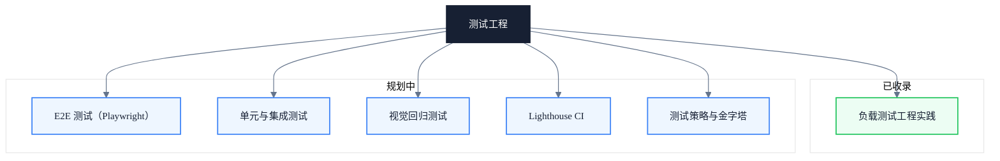

# 测试工程

> 副标题：从负载测试、端到端测试到单元测试，构建可验证的质量保障体系

---

## 模块定位

测试不是开发完成后的"收尾动作"，而是一套贯穿需求、设计、交付全生命周期的工程方法。本模块把测试拆解为"验证、隔离、回归"三组目标：验证系统在真实压力下的边界，隔离缺陷到具体层次，回归保障每次变更不引入新问题。

每类测试都配套工具链选型、场景设计与结果分析方法，避免"跑了测试但说不清结论"的伪覆盖。负载测试关注吞吐与瓶颈，E2E 测试关注关键路径的稳定性，单元与集成测试关注逻辑边界与契约，三者共同构成可验证、可回归、可演进的质量保障体系。

本模块强调工程化思维：测试计划先行、指标可量化、结果可复盘，让测试成为交付流水线中可信任的质量门禁，而非一次性的人工检查。

---

## 知识地图

---

## 核心主题

**✓ 已收录**

- **负载测试工程实践** — 测试计划、负载模型、JMeter 脚本参数化、TPS / 响应时间 / 错误率指标体系、瓶颈定位

**◯ 规划中**

- **E2E 测试（Playwright）** — Playwright 场景设计、断言策略、并行执行、稳定性治理
- **单元与集成测试** — Jest / Vitest 测试金字塔、Mock 策略、覆盖率边界、契约测试
- **视觉回归测试** — 视觉快照对比、Storybook + Chromatic、跨浏览器一致性保障
- **Lighthouse CI** — 性能预算、CI 集成、Core Web Vitals 质量门禁
- **测试策略与金字塔** — 测试分层、ROI 评估、测试债务治理

---

## 学习路径

1. 从负载测试实践入手，理解测试计划、负载模型与瓶颈定位的全流程方法论
2. 建立测试金字塔思维，明确单元、集成、E2E 各层职责与边界
3. 引入 Playwright E2E 场景设计，覆盖关键用户路径与断言策略
4. 配置 Lighthouse CI 与性能预算，将质量门禁纳入交付流水线
5. 通过视觉回归测试保障 UI 一致性，避免样式回退与视觉债务累积

---

## 文章导览

- [负载测试工程实践：从测试计划到瓶颈定位的全流程方法论](/testing/load-testing-practice) — 负载测试全流程方法论与瓶颈诊断框架

---

## 适用读者

- 测试工程师与质量负责人，需要建立团队级的负载测试与瓶颈定位框架
- 中高级前端工程师，希望理解系统在真实压力下的行为边界与稳定性表现
- 前端架构师，需要在技术选型时评估方案的扩展性与容错能力

---

## 延伸资源

- [Playwright 官方文档](https://playwright.dev/docs/intro)
- [Testing Library 文档](https://testing-library.com/)
- [Google Testing Blog](https://testing.googleblog.com/)
- 书籍：《Software Testing: A Practitioner's Guide》
